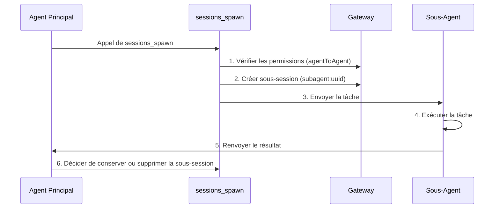

# Gestion des Sessions et Multi-Agents : Isolation des Sessions, Collaboration des Sous-Agents et Compression du Contexte

## Ce Que Vous Pouvez Faire

- Comprendre le modèle de sessions et la structure des clés de session de Clawdbot
- Configurer l'isolation des sessions entre différents agents
- Utiliser des sous-agents pour accomplir des tâches isolées
- Gérer la fenêtre de contexte pour éviter de dépasser les limites du modèle
- Maîtriser les meilleures pratiques de réinitialisation et de compression des sessions

## Votre Situation Actuelle

Lorsque votre assistant IA sert simultanément plusieurs utilisateurs et plusieurs canaux, vous pouvez rencontrer ces problèmes :

- **Interférence de sessions** : Les messages de différents utilisateurs se mélangent et l'IA ne peut pas se souvenir de leurs historiques respectifs
- **Explosion de contexte** : Après de longues conversations, le modèle commence à "perdre la mémoire" ou les réponses deviennent plus lentes
- **Confusion des sous-tâches** : Lorsque l'agent principal appelle des sous-tâches, il n'y a pas de limites claires d'isolement
- **Gaspillage de ressources** : Tous les agents partagent le même ensemble de sessions, rendant les ressources de stockage et de calcul inefficaces

Le **système de gestion des sessions de Clawdbot** est conçu pour résoudre ces problèmes.

## Concept Central

Une **session** est l'unité abstraite centrale de Clawdbot. Chaque session représente un historique de conversation indépendant, avec son propre enregistrement de messages, ses métadonnées et son cycle de vie.

Clawdbot utilise des **clés de session (session key)** pour identifier et isoler différentes sessions. Les clés de session distinguent non seulement les différents interlocuteurs de conversation (utilisateurs, groupes, canaux), mais aussi les différentes instances d'agents.

::: info Qu'est-ce qu'une Clé de Session ?

Une clé de session est un identifiant de chaîne qui identifie de manière unique une session. Exemples de format :
- `agent:main:main` (session principale de l'agent principal)
- `agent:work:main` (session principale de l'agent de travail)
- `agent:main:whatsapp:group:123` (session de groupe WhatsApp)
- `cron:job-id` (session de tâche planifiée)

Clawdbot achemine les messages vers le bon agent en fonction de la clé de session et maintient des historiques de conversation indépendants.
:::

## Modèle de Session

### Composition de la Clé de Session

Clawdbot utilise des clés de session structurées pour identifier différents types de sessions :

| Type de Session | Format de Clé | Exemple | Description |
|--- | --- | --- | ---|
| **Session Principale** | `agent:<agentId>:<mainKey>` | `agent:main:main` | Session principale par défaut de chaque agent |
| **Message Direct** | `agent:<agentId>:dm:<peerId>` | `agent:main:dm:+15551234567` | Isolé selon la configuration `dmScope` |
| **Groupe/Canal** | `agent:<agentId>:<channel>:group:<id>` | `agent:main:whatsapp:group:123` | Groupes et canaux isolés automatiquement |
| **Sous-Agent** | `agent:<agentId>:subagent:<uuid>` | `agent:main:subagent:a1b2c3d4` | Session isolée du sous-agent |
| **Tâche Planifiée** | `cron:<jobId>` | `cron:daily-report` | Session dédiée pour les tâches Cron |
| **Webhook** | `hook:<uuid>` | `hook:xyz789` | Session déclenchée par Webhook |

### Stockage des Sessions

Les données de session sont stockées à deux endroits :

```bash
# Index des sessions (métadonnées)
~/.clawdbot/agents/<agentId>/sessions/sessions.json

# Historique des messages (un fichier par session)
~/.clawdbot/agents/<agentId>/sessions/<sessionId>.jsonl
```

**sessions.json** est une table de mappage qui enregistre :
- Clé de session → Métadonnées de session (sessionId, updatedAt, model, tokens, etc.)
- Supprimer ces entrées est sûr ; elles seront reconstruites automatiquement si nécessaire

**Fichiers JSONL** stockent l'historique complet de la conversation, avec un enregistrement de message par ligne.

::: tip Gateway est la Seule Source de Vérité

Tous les états de session sont détenus par le Gateway. Les clients UI (application macOS, WebChat) doivent interroger la liste des sessions et le nombre de tokens depuis le Gateway, plutôt que de lire directement les fichiers locaux.

En mode distant, les sessions qui vous intéressent sont stockées sur l'hôte distant du Gateway, et non sur votre Mac.
:::

## Mécanisme d'Isolation des Sessions

### Mode Agent Unique (Par Défaut)

Si aucune configuration n'est faite, Clawdbot exécute un seul agent :
- `agentId` par défaut est `main`
- Toutes les sessions DM partagent la clé de session principale (`agent:main:main`)
- Cela signifie que **les messages du même utilisateur depuis différents canaux entreront dans la même session**

### Mode Multi-Agents

**Plusieurs Agents = Plusieurs Cerveaux Isolés**

Chaque agent possède son propre ensemble indépendant de :
- **Workspace** (fichiers d'espace de travail, AGENTS.md, SOUL.md)
- **State directory** (configuration d'authentification, registre des modèles)
- **Session store** (historique de chat et état de routage)

#### Pourquoi Plusieurs Agents ?

| Scénario | Solution |
|--- | ---|
| **Plusieurs utilisateurs partageant un serveur** | Chaque utilisateur a un agent indépendant, sessions complètement isolées |
| **Différentes personnalités sur différents canaux** | WhatsApp utilise l'agent de quotidien, Telegram l'agent de travail profond |
| **Séparation des autorisations** | Agent familial avec outils limités, agent personnel avec accès complet |
| **Différents environnements** | Agent de développement, agent de production complètement isolés |

#### Configuration Multi-Agents

**Étape 1 : Ajouter un Nouvel Agent**

```bash
clawdbot agents add work
```

Cela créera un nouveau répertoire d'agent dans `~/.clawdbot/agents/work/`.

**Étape 2 : Configurer les Règles de Routage**

Ajoutez `bindings` dans `~/.clawdbot/clawdbot.json` :

```json5
{
  agents: {
    list: [
      { id: "home", workspace: "~/clawd-home", name: "Home" },
      { id: "work", workspace: "~/clawd-work", name: "Work" }
    ]
  },
  bindings: [
    { agentId: "home", match: { channel: "whatsapp", accountId: "personal" } },
    { agentId: "work", match: { channel: "whatsapp", accountId: "biz" } }
  ]
}
```

**Étape 3 : Vérifier la Configuration**

```bash
clawdbot agents list --bindings
```

#### Règles de Routage (Correspondance Déterministe)

Lorsqu'un message arrive, Clawdbot correspond aux règles dans l'ordre du **plus spécifique en premier** :

1. Correspondance **peer** (id exact de DM/group/channel)
2. **guildId** (Discord)
3. **teamId** (Slack)
4. Correspondance **accountId**
5. Correspondance au niveau du canal (`accountId: "*"`)
6. Retour à l'agent par défaut

::: warning Attention à l'Ordre des Liaisons

L'ordre dans la liste des liaisons est important ! Les règles plus spécifiques doivent venir en premier.

Par exemple, si vous voulez acheminer un DM spécifique à l'agent `work` et d'autres DM WhatsApp à l'agent `home`, vous devez écrire la règle de peer en premier :
```json5
{
  bindings: [
    { agentId: "work", match: { channel: "whatsapp", peer: { kind: "dm", id: "+15551234567" } } },
    { agentId: "home", match: { channel: "whatsapp" } }
  ]
}
```
:::

### Contrôle de la Portée DM

Utilisez `session.dmScope` pour contrôler comment les messages directs sont groupés :

| Option | Comportement | Scénario d'Utilisation |
|--- | --- | ---|
| `main` (par défaut) | Tous les DM partagent la session principale | Utilisateur unique, plusieurs canaux |
| `per-peer` | Isolé par ID d'expéditeur | Environnement multi-utilisateurs |
| `per-channel-peer` | Isolé par canal + expéditeur | Boîte de réception partagée |

Exemple de configuration :

```json5
{
  session: {
    dmScope: "per-channel-peer"  // Chaque utilisateur dans chaque canal a une session indépendante
  }
}
```

### Liens d'Identité (Identity Links)

Si le même utilisateur utilise plusieurs plateformes (comme WhatsApp et Telegram), vous pouvez faire partager leurs sessions en utilisant `session.identityLinks` :

```json5
{
  session: {
    identityLinks: {
      alice: ["telegram:123456789", "discord:987654321012345678"]
    }
  }
}
```

Ainsi, les messages qu'Alice envoie depuis Telegram ou Discord entreront dans la session `agent:<agentId>:dm:alice`.

## Collaboration des Sous-Agents

### Qu'est-ce qu'un Sous-Agent ?

Un **sous-agent** est une instance d'agent qui s'exécute dans une session isolée, utilisée pour effectuer des tâches spécifiques sans affecter le contexte de la session principale.

Scénarios d'utilisation typiques :
- **Révision de code** : Le sous-agent analyse le code et renvoie un résumé
- **Extraction de données** : Le sous-agent extrait des informations de documents longs
- **Tâches parallèles** : Pendant que l'agent principal attend, le sous-agent s'exécute en arrière-plan
- **Isolement du bac à sable** : Exécuter des tâches non fiables dans un environnement restreint

### Outil sessions_spawn

Utilisez l'outil `sessions_spawn` pour créer un sous-agent :

```json
{
  "task": "Analysez ce document et extrayez les points clés",
  "label": "Analyse de Document",
  "model": "anthropic/claude-opus-4-5",
  "thinking": "detailed",
  "runTimeoutSeconds": 300,
  "cleanup": "keep"
}
```

Description des paramètres :

| Paramètre | Type | Requis | Description |
|--- | --- | --- | ---|
| `task` | string | ✅ | Description de la tâche du sous-agent |
| `label` | string | ❌ | Étiquette lisible de la tâche (pour le suivi) |
| `agentId` | string | ❌ | ID de l'agent cible (par défaut l'agent actuel) |
| `model` | string | ❌ | Remplacement du modèle |
| `thinking` | string | ❌ | Niveau de réflexion (`minimal`/`standard`/`detailed`) |
| `runTimeoutSeconds` | number | ❌ | Délai d'attente (secondes) |
| `cleanup` | string | ❌ | Stratégie de nettoyage après avoir terminé la tâche (`keep`/`delete`) |

### Cycle de Vie du Sous-Agent



**Étapes du Cycle de Vie** :

1. **Vérification des permissions** : Si appel entre agents, vérifie la configuration `tools.agentToAgent.allow`
2. **Création de sous-session** : Génère une clé unique `agent:<agentId>:subagent:<uuid>`
3. **Exécution de la tâche** : Le sous-agent complète la tâche dans la session isolée
4. **Renvoi du résultat** : Le résultat est renvoyé par streaming à l'agent principal
5. **Stratégie de nettoyage** :
   - `cleanup: "keep"` : Conserve la sous-session pour des inspections ultérieures
   - `cleanup: "delete"` : Supprime automatiquement la sous-session

### Configuration de la Communication Entre Agents

Par défaut, la communication entre agents est désactivée. Elle doit être explicitement activée :

```json5
{
  tools: {
    agentToAgent: {
      enabled: true,
      allow: ["home", "work", "family"]
    }
  }
}
```

Description des permissions :
- `enabled: false` : Désactive complètement la communication entre agents
- `allow: ["*"]` : Permet n'importe quel agent
- `allow: ["home", "work"]` : Permet uniquement des agents spécifiques

::: danger Rappel de Sécurité

Les sous-agents héritent d'une partie du contexte de l'agent parent, mais **n'obtiennent pas** l'historique complet de la session parente. C'est à la fois une fonctionnalité (économie de tokens) et une limitation (les sous-agents ne connaissent pas le contexte complet).

Pour les opérations sensibles, envisagez de les terminer dans la session principale plutôt que via des sous-agents.
:::

## Compression du Contexte

### Qu'est-ce que la Fenêtre de Contexte ?

Chaque modèle IA a une **fenêtre de contexte (context window)** : le nombre maximum de tokens qu'il peut voir dans une seule inférence.

Les conversations longues accumulent des messages et des résultats d'outils. Une fois proche de la limite du modèle, Clawdbot **compressera (compact)** l'historique pour libérer de l'espace.

### Compression Automatique

Lorsqu'une session approche ou dépasse la fenêtre de contexte, Clawdbot déclenche automatiquement la compression :

- **Avant compression** : Exécute d'abord un **rafraîchissement silencieux de la mémoire**, demandant au modèle d'écrire des notes persistantes sur disque (si l'espace de travail est accessible en écriture)
- **Processus de compression** : Résume les anciennes conversations en un résumé compressé, en conservant les messages récents
- **Persistance** : Le résultat de la compression est écrit dans le fichier d'historique JSONL
- **Nouvelle tentative** : Réessaie la demande originale en utilisant le contexte compressé

Vous verrez :
- `🧹 Auto-compaction complete` (en mode détaillé)
- `/status` affiche `🧹 Compactions: <count>`

### Compression Manuelle

Utilisez la commande `/compact` pour déclencher manuellement la compression :

```
/compact
```

Vous pouvez ajouter des instructions de compression :

```
/compact Focus on decisions and open questions
```

Cela guidera l'IA à se concentrer sur un contenu spécifique lors du résumé.

### Compression vs Élagage

| Opération | Objectif | Persistance | Emplacement |
|--- | --- | --- | ---|
| **Compression** | Résumer les anciennes conversations | ✅ | Écriture dans JSONL |
| **Élagage** | Supprimer les anciens résultats d'outils | ❌ | Seulement en mémoire |

::: tip Recommandations de Stratégie de Compression

- **Compression** : Sauvegarde les résumés d'informations, adapté pour revoir l'historique
- **Élagage** : Nettoyage temporaire, adapté pour réduire l'utilisation de tokens sur une seule demande
- **/new** : Efface complètement la session, pour commencer un nouveau sujet

Choisissez la stratégie appropriée selon vos habitudes d'utilisation.
:::

### Configuration de la Compression

Configurez le comportement de compression dans `~/.clawdbot/clawdbot.json` :

```json5
{
  agents: {
    defaults: {
      compaction: {
        enabled: true,
        threshold: 0.9,  // Déclencher lorsque l'utilisation du contexte est de 90%
        trigger: "auto"  // auto/manual
      }
    }
  }
}
```

## Suivez-moi : Configuration de la Gestion des Sessions

Configurons la gestion des sessions à travers un scénario réel.

### Scénario

Vous avez un numéro WhatsApp et souhaitez :
1. Les contacts personnels utilisent l'agent `home` (conversation quotidienne)
2. Les groupes de travail utilisent l'agent `work` (réponse professionnelle)
3. Activer des sous-agents pour des tâches isolées

### Étape 1 : Ajouter Deux Agents

```bash
# Ajouter l'agent maison
clawdbot agents add home

# Ajouter l'agent de travail
clawdbot agents add work
```

**Vous devriez voir** : On vous demandera d'entrer le chemin de l'espace de travail et d'autres informations.

### Étape 2 : Modifier le Fichier de Configuration

Ouvrez `~/.clawdbot/clawdbot.json` et ajoutez la liste des agents et les règles de liaison :

```json5
{
  agents: {
    list: [
      {
        id: "home",
        name: "Home",
        workspace: "~/clawd-home",
        model: "anthropic/claude-sonnet-4-5"
      },
      {
        id: "work",
        name: "Work",
        workspace: "~/clawd-work",
        model: "anthropic/claude-opus-4-5"
      }
    ]
  },
  bindings: [
    // Messages personnels acheminés à l'agent home
    { agentId: "home", match: { channel: "whatsapp", peer: { kind: "dm", id: "+15551230001" } } },
    // Groupes de travail acheminés à l'agent work
    { agentId: "work", match: { channel: "whatsapp", peer: { kind: "group", id: "120363999999999999@g.us" } } },
    // Autres messages WhatsApp acheminés à l'agent home (par défaut)
    { agentId: "home", match: { channel: "whatsapp" } }
  ],
  tools: {
    agentToAgent: {
      enabled: true,
      allow: ["home", "work"]
    }
  }
}
```

### Étape 3 : Redémarrer le Gateway

```bash
clawdbot gateway restart
```

**Vous devriez voir** : Journal de démarrage du Gateway, affichant les agents et règles de liaison chargés.

### Étape 4 : Tester l'Appel de Sous-Agent

Envoyez dans la session de l'agent `home` :

```
Veuillez utiliser un sous-agent pour analyser ce document PDF et extraire les informations clés : /path/to/file.pdf
```

L'agent devrait appeler automatiquement l'outil `sessions_spawn` et vous verrez :
- Notification de création de sous-agent
- Processus d'exécution de la tâche
- Renvoi du résultat

### Étape 5 : Vérifier l'État de la Session

Envoyez dans le chat :

```
/status
```

**Vous devriez voir** :
- Utilisation des tokens de la session actuelle
- Nombre de compressions
- Informations sur le modèle

## Point de Contrôle ✅

Après avoir terminé la configuration, vérifiez les points suivants :

- [ ] `clawdbot agents list --bindings` affiche les règles de liaison correctes
- [ ] Les DM personnels sont acheminés à l'agent `home`
- [ ] Les groupes de travail sont acheminés à l'agent `work`
- [ ] Les appels de sous-agents fonctionnent correctement
- [ ] `/status` affiche les informations correctes de la session

## Avertissements de Problèmes

### Erreurs Courantes

| Erreur | Cause | Solution |
|--- | --- | ---|
| **Appel entre agents interdit** | `tools.agentToAgent.enabled` n'est pas activé ou la liste `allow` n'inclut pas l'agent cible | Vérifiez la configuration, assurez-vous qu'elle est activée et la liste autorisée ajoutée |
| **Échec de la création de sous-agent** | Lors des appels entre agents, l'agent cible n'est pas dans la liste autorisée | Vérifiez la configuration `tools.agentToAgent.allow` |
| **Conflit de clé de session** | Ordre incorrect des règles de liaison, règles plus spécifiques écrasées | Placez les règles de peer avant les règles de canal |
| **Échec de compression** | Contexte trop petit ou le modèle ne prend pas en charge la compression | Vérifiez la fenêtre de contexte du modèle et la configuration de compression |

### Recommandations de Configuration

- **Commencez simple** : Testez d'abord avec un seul agent, confirmez que les fonctions fonctionnent normalement avant d'ajouter plusieurs agents
- **Utilisez des étiquettes** : Ajoutez des `label` clairs aux tâches de sous-agents pour faciliter le suivi
- **Surveillez l'utilisation des tokens** : Vérifiez régulièrement `/status` pour comprendre l'utilisation du contexte
- **Sauvegarde de la configuration** : Faites une sauvegarde avant de modifier `clawdbot.json`

## Résumé de la Leçon

Cette leçon a présenté le système de gestion des sessions de Clawdbot :

- **Modèle de session** : Clés de session, emplacements de stockage, cycle de vie
- **Isolement de session** : Mode multi-agents, contrôle de la portée DM, liens d'identité
- **Collaboration des sous-agents** : Outil `sessions_spawn`, contrôle des permissions, stratégie de nettoyage
- **Compression du contexte** : Compression automatique/manuelle, compression vs élagage

Avec une configuration appropriée de la gestion des sessions, vous pouvez faire que Clawdbot serve simultanément plusieurs utilisateurs et scénarios, chacun avec son propre contexte et historique isolés.

## Prochaine Leçon

> Dans la prochaine leçon, nous apprendrons **[Outils d'Automatisation du Navigateur](../tools-browser/)**.
>
> Vous apprendrez :
> - Comment configurer et utiliser les outils du navigateur
> - Les limites de sécurité de l'automatisation du navigateur
> - Captures d'écran et opérations de formulaire

---

## Annexe : Référence du Code Source

<details>
<summary><strong>Cliquez pour développer et voir les emplacements du code source</strong></summary>

> Dernière mise à jour : 2026-01-27

| Fonctionnalité | Chemin du Fichier | Numéro de Ligne |
|--- | --- | ---|
| Analyse de la clé de session | [`src/routing/session-key.ts`](https://github.com/moltbot/moltbot/blob/main/src/routing/session-key.ts) | 1-100 |
| Schéma de configuration de session | [`src/config/zod-schema.session.ts`](https://github.com/moltbot/moltbot/blob/main/src/config/zod-schema.session.ts) | 11-83 |
|--- | --- | ---|
| Fonctions auxiliaires d'outils de session | [`src/agents/tools/sessions-helpers.ts`](https://github.com/moltbot/moltbot/blob/main/src/agents/tools/sessions-helpers.ts) | 1-328 |
| Documentation de gestion des sessions | [`docs/concepts/session.md`](https://github.com/moltbot/moltbot/blob/main/docs/concepts/session.md) | 1-151 |
|--- | --- | ---|
| Documentation de compression du contexte | [`docs/concepts/compaction.md`](https://github.com/moltbot/moltbot/blob/main/docs/concepts/compaction.md) | 1-50 |

**Constantes Clés** :
- `SESSION_ID_RE = /^[0-9a-f]{8}-[0-9a-f]{4}-[0-9a-f]{4}-[0-9a-f]{4}-[0-9a-f]{12}$/i` : Expression régulière de l'ID de session (`sessions-helpers.ts:96`)

**Types Clés** :
- `SessionKind = "main" | "group" | "cron" | "hook" | "node" | "other"` : Énumération des types de session (`sessions-helpers.ts:11`)
- `SessionListRow` : Structure de ligne de liste de session (`sessions-helpers.ts:19-41`)

**Fonctions Clés** :
- `createSessionsSpawnTool()` : Créer l'outil de génération de sous-agents (`sessions-spawn-tool.ts:60-269`)
- `resolveSessionReference()` : Résoudre la référence de session (`sessions-helpers.ts:215-253`)
- `classifySessionKind()` : Classer le type de session (`sessions-helpers.ts:255-271`)
- `createAgentToAgentPolicy()` : Créer la politique de communication entre agents (`sessions-helpers.ts:72-94`)

</details>
