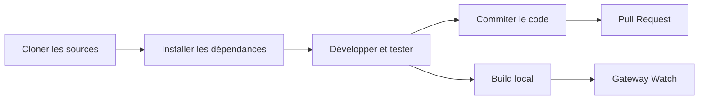

# Guide de développement : de la compilation à la contribution

## Ce que vous apprendrez

- Compiler et exécuter Clawdbot depuis les sources
- Développer des plugins personnalisés (canaux, outils, méthodes RPC)
- Exécuter les tests unitaires et les tests de bout en bout
- Soumettre des Pull Requests et contribuer au projet
- Comprendre l'architecture du projet et le système de plugins

## Le problème

Vous êtes développeur et souhaitez :
- Personnaliser ou étendre les fonctionnalités de Clawdbot
- Comprendre les mécanismes internes du projet
- Contribuer à la communauté open source
- Mais vous ne savez pas par où commencer : compilation, tests, processus de soumission ?

## Quand utiliser ce guide

- Lorsque vous devez modifier le code source ou ajouter de nouvelles fonctionnalités
- Lorsque vous souhaitez développer des plugins ou canaux personnalisés
- Lorsque vous devez déboguer ou corriger des bugs
- Lorsque vous voulez contribuer au projet

## 🎒 Prérequis

::: warning Conditions préalables
Ce tutoriel suppose que vous disposez des éléments suivants :
:::

- **Node.js ≥22** installé (requis par le projet)
- **pnpm** gestionnaire de paquets installé (recommandé pour la compilation depuis les sources)
- Connaissances de base de **Git**
- Expérience en développement **TypeScript**
- Maîtrise du **terminal** en ligne de commande

Environnement recommandé :
- macOS / Linux (plateformes de développement principales)
- Windows via WSL2

## Concepts clés

### Vue d'ensemble du workflow de développement

Le workflow de développement de Clawdbot se divise en quatre phases principales :



### Concepts fondamentaux

- **Système de build** : compilation TypeScript, le répertoire `dist/` contient les fichiers générés
- **Architecture de plugins** : modules TypeScript chargés à l'exécution, permettant d'étendre les fonctionnalités
- **Daemon Gateway** : singleton, plan de contrôle et routage des messages
- **Framework de tests** : Vitest pour les tests unitaires, Docker pour les tests de bout en bout

### Structure du projet

| Répertoire | Rôle |
| --- | --- |
| `src/` | Tout le code source (2475 fichiers TypeScript) |
| `src/gateway/` | Serveur WebSocket Gateway |
| `src/channels/` | Système de plugins de canaux |
| `src/agents/` | Runtime des agents IA |
| `src/plugin-sdk/` | SDK de développement de plugins |
| `extensions/` | Plugins intégrés (ex : voice-call) |
| `tests/` | Fichiers de tests |

## Tutoriel pas à pas

### Étape 1 : Cloner les sources et installer les dépendances

**Pourquoi**
Obtenir le code source le plus récent et installer toutes les dépendances est la première étape du développement.

```bash
## Cloner le dépôt
git clone https://github.com/clawdbot/clawdbot.git
cd clawdbot

## Installer les dépendances (pnpm recommandé)
pnpm install
```

**Résultat attendu** : les dépendances sont installées avec succès, sans message d'erreur.

::: info Support Bun
Si vous utilisez Bun, vous pouvez exécuter directement le TypeScript sans compilation (via `tsx`).
:::

### Étape 2 : Compiler le projet

**Pourquoi**
Compiler le TypeScript en JavaScript pour générer le répertoire distribuable `dist/`.

```bash
## Compilation complète
pnpm build
```

**Résultat attendu** :
```
src/cli/entry.ts → dist/cli/entry.js
src/gateway/server.ts → dist/gateway/server.js
...
Build completed in X seconds
```

::: tip Compilation de l'UI
La première exécution de `pnpm ui:build` installera automatiquement les dépendances de l'interface.
:::

### Étape 3 : Lancer le mode développement

**Pourquoi**
Le mode développement permet le rechargement automatique, sans recompilation manuelle.

```bash
## Lancer le Gateway en mode développement (rechargement automatique)
pnpm gateway:watch

## Ou lancer le CLI en mode développement
CLAWDBOT_PROFILE=dev pnpm clawdbot --dev
```

**Résultat attendu** :
- Le Gateway démarre et écoute sur `ws://127.0.0.1:18789`
- Les modifications de fichiers déclenchent automatiquement la recompilation et le redémarrage

::: tip Ignorer le chargement des canaux
En développement, utilisez `CLAWDBOT_SKIP_CHANNELS=1` pour ignorer l'initialisation des canaux et accélérer le démarrage.
:::

**Point de contrôle ✅**
- Le Gateway a démarré avec succès et écoute sur le port 18789
- Les modifications des fichiers TypeScript déclenchent la recompilation automatique

### Étape 4 : Exécuter les tests

**Pourquoi**
S'assurer que les modifications du code n'ont pas cassé les fonctionnalités existantes.

#### Tests unitaires

```bash
## Exécuter tous les tests
pnpm test

## Exécuter les tests en mode watch
pnpm test:watch

## Générer le rapport de couverture
pnpm test:coverage
```

**Résultat attendu** : taux de réussite des tests et statistiques de couverture.

#### Tests de bout en bout

```bash
## Exécuter les tests de bout en bout Docker
pnpm test:docker:all

## Ou exécuter une suite de tests spécifique
pnpm test:docker:live-models
```

**Résultat attendu** : tous les conteneurs Docker de test s'exécutent et se terminent avec succès.

::: warning Prérequis pour les tests
Les tests de bout en bout nécessitent que Docker soit installé et en cours d'exécution.
:::

**Point de contrôle ✅**
- Tous les tests unitaires passent
- La couverture de tests est conforme aux exigences (≥70%)
- Les tests de bout en bout passent

### Étape 5 : Vérification et formatage du code

**Pourquoi**
Maintenir un style de code cohérent et la sécurité des types.

```bash
## Exécuter le linter
pnpm lint

## Formater le code
pnpm format:fix

## Exécuter le linter Swift (développement macOS/iOS)
pnpm lint:swift
```

**Résultat attendu** : aucune erreur de lint, code formaté.

::: tip Formatage automatique
Le projet est configuré avec des hooks git pre-commit qui formatent automatiquement les fichiers stagés avant le commit.
:::

### Étape 6 : Développer un plugin (optionnel)

**Pourquoi**
Étendre les fonctionnalités de Clawdbot ou intégrer des services externes.

#### Création rapide d'un plugin

1. Créer le répertoire du plugin :
```bash
mkdir extensions/my-plugin
cd extensions/my-plugin
```

2. Créer `clawdbot.plugin.json` :
```json
{
  "id": "my-plugin",
  "name": "My Plugin",
  "version": "1.0.0",
  "configSchema": {
    "type": "object",
    "properties": {
      "apiKey": { "type": "string" }
    }
  }
}
```

3. Créer le point d'entrée `index.ts` :
```typescript
export default function (api) {
  console.log("My plugin loaded!");
  
  // Enregistrer un outil
  api.registerTool({
    name: "my_tool",
    description: "My custom tool",
    execute: async (params) => {
      return { result: "Hello from my tool!" };
    }
  });
  
  // Enregistrer une méthode RPC
  api.registerGatewayMethod("myplugin.status", ({ respond }) => {
    respond({ ok: true, status: "running" });
  });
}
```

4. Installer et tester :
```bash
## Mode développement : lier le plugin
clawdbot plugins install -l extensions/my-plugin

## Redémarrer le Gateway
pnpm gateway:watch
```

::: details Types de plugins
Clawdbot prend en charge les types de plugins suivants :

- **Agent Tools** : outils appelables par l'IA
- **Channel Plugins** : nouveaux canaux de messagerie (WhatsApp, Telegram, etc.)
- **Gateway RPC** : endpoints WebSocket
- **CLI Commands** : outils en ligne de commande
- **Background Services** : tâches en arrière-plan
- **Auto-reply Commands** : commandes rapides sans IA

Voir la [documentation des plugins](https://github.com/moltbot/moltbot/blob/main/docs/plugin.md) pour plus de détails.
:::

**Point de contrôle ✅**
- Le plugin se charge avec succès
- Les fonctionnalités du plugin sont accessibles via le CLI ou le Gateway
- La configuration du plugin fonctionne correctement

### Étape 7 : Commiter le code et créer une Pull Request

**Pourquoi**
Soumettre votre contribution à la communauté.

```bash
## Créer une branche de fonctionnalité
git checkout -b feature/my-feature

## Commiter les modifications
git add .
git commit -m "feat: add my new feature"

## Pousser vers GitHub
git push origin feature/my-feature
```

Ensuite, créez une Pull Request sur GitHub.

::: tip Conventions de PR
Dans la description de la PR, précisez :
- **Ce qui a été fait** : description de la fonctionnalité ou du correctif
- **Pourquoi** : quel problème cela résout
- **État des tests** : untested / lightly tested / fully tested
- **Assistance IA** : si des outils IA ont été utilisés pour le développement
:::

**Point de contrôle ✅**
- Le code a été poussé sur GitHub
- La Pull Request a été créée avec succès
- Les vérifications CI/CD passent (le cas échéant)

## Erreurs fréquentes

### Erreurs courantes

| Erreur | Cause | Solution |
| --- | --- | --- |
| `Cannot find module 'xxx'` | Dépendance non installée | Exécuter `pnpm install` |
| `Port 18789 already in use` | Le Gateway est déjà en cours d'exécution | Vérifier et arrêter l'ancienne instance |
| Erreur de compilation TypeScript | Problème de définition de types | Exécuter `pnpm lint` pour vérifier |
| Timeout des tests | Docker non démarré ou problème réseau | Vérifier l'état de Docker |

### Bonnes pratiques de développement

- **Commits atomiques** : chaque PR ne fait qu'une seule chose, facilitant la revue
- **Écrire des tests** : les nouvelles fonctionnalités doivent avoir une couverture de tests
- **Respecter le style** : utiliser le linter et le formatter configurés dans le projet
- **Mettre à jour la documentation** : synchroniser la documentation lors des modifications de code
- **Mentionner l'IA** : si vous utilisez l'assistance IA pour le développement, indiquez-le dans la PR

## Résumé

Ce tutoriel a couvert le workflow complet de développement de Clawdbot :

✅ **Compilation depuis les sources** : utiliser `pnpm install` et `pnpm build`
✅ **Mode développement** : utiliser `pnpm gateway:watch` pour le rechargement automatique
✅ **Framework de tests** : tests unitaires Vitest + tests de bout en bout Docker
✅ **Développement de plugins** : système de plugins extensible basé sur TypeScript
✅ **Processus de contribution** : workflow Git et conventions de Pull Request

Aide-mémoire des commandes clés :

| Tâche | Commande |
| --- | --- |
| Installer les dépendances | `pnpm install` |
| Compiler | `pnpm build` |
| Mode développement | `pnpm gateway:watch` |
| Tests unitaires | `pnpm test` |
| Vérification du code | `pnpm lint` |
| Formatage | `pnpm format:fix` |

## Prochaine étape

Félicitations, vous avez terminé le guide de développement ! Vous disposez maintenant :

- De la capacité à compiler et exécuter Clawdbot depuis les sources
- Des bases pour développer des plugins personnalisés
- Du processus pour exécuter les tests et contribuer au code

Ensuite, vous pourriez approfondir :

- [Référence de configuration](../config-reference/) - Documentation complète des options de configuration
- [Protocole API Gateway](../api-protocol/) - Spécification du protocole WebSocket
- [Options de déploiement](../deployment/) - Méthodes de déploiement Docker, Nix, etc.

Continuez à explorer et laissez Clawdbot travailler pour vous !

---

## Annexe : Références du code source

<details>
<summary><strong>Cliquez pour voir les emplacements dans le code source</strong></summary>

> Dernière mise à jour : 2026-01-27

| Fonctionnalité | Chemin du fichier | Lignes |
| --- | --- | --- |
| Scripts de build | [`package.json`](https://github.com/moltbot/moltbot/blob/main/package.json) | 77-44 |
| Installation depuis les sources | [`README.md`](https://github.com/moltbot/moltbot/blob/main/README.md) | 83-99 |
| Documentation des plugins | [`docs/plugin.md`](https://github.com/moltbot/moltbot/blob/main/docs/plugin.md) | 1-639 |
| Guide de contribution | [`CONTRIBUTING.md`](https://github.com/moltbot/moltbot/blob/main/CONTRIBUTING.md) | 1-53 |
| Documentation de l'architecture | [`docs/concepts/architecture.md`](https://github.com/moltbot/moltbot/blob/main/docs/concepts/architecture.md) | 1-123 |

**Commandes clés** :
- `pnpm build` - Compilation complète (package.json:85)
- `pnpm gateway:watch` - Rechargement automatique en mode développement (package.json:93)
- `pnpm test` - Exécution des tests unitaires (package.json:118)
- `pnpm lint` - Vérification du code (package.json:110)

**Répertoires clés** :
- `src/` - Répertoire racine du code source (2475 fichiers TypeScript)
- `src/plugin-sdk/` - SDK de développement de plugins
- `extensions/` - Plugins intégrés
- `tests/` - Fichiers de tests
- `dist/` - Répertoire de sortie de compilation

**Relatif aux plugins** :
- Format du manifest de plugin : `clawdbot.plugin.json` (plugin.md:8-10)
- API des plugins : `api.registerTool()`, `api.registerGatewayMethod()` (plugin.md:591-600)
- Schéma de configuration des plugins : JSON Schema + `uiHints` (plugin.md:36-48)

</details>
