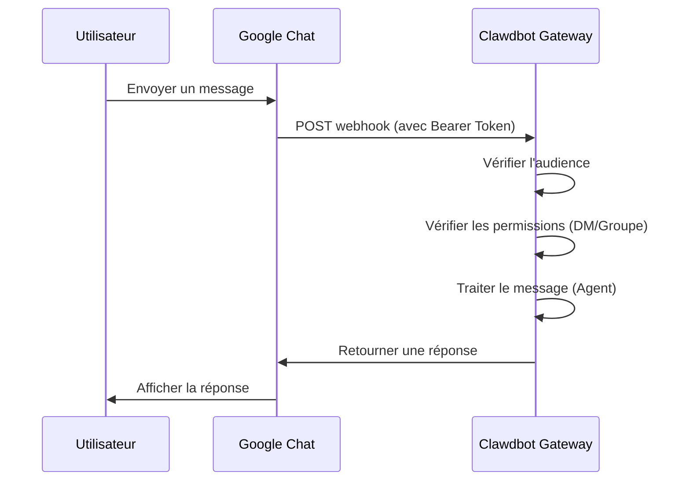

# Configuration du canal Google Chat

## Ce que vous saurez faire

- Effectuer une conversation 1:1 privée avec votre assistant IA dans Google Chat
- Déclencher l'assistant IA par @mention dans les espaces Google Chat
- Maîtriser l'authentification Service Account et la configuration Webhook
- Apprendre à exposer en sécurité une URL publique avec Tailscale Funnel

## Votre situation actuelle

Vous souhaitez utiliser un assistant IA via Google Chat dans votre entreprise ou votre équipe, mais vous ne savez pas comment :

- Créer et configurer un projet Google Cloud
- Configurer l'authentification Service Account
- Configurer un Webhook pour que Google Chat puisse se connecter à votre Gateway
- Exposer la Gateway sur Internet en toute sécurité

## Quand utiliser cette approche

**Scénarios adaptés à l'utilisation du canal Google Chat** :

- Votre équipe utilise principalement Google Chat pour la communication
- Besoin d'utiliser un assistant IA dans l'environnement Google Workspace
- Souhait de collaborer via Google Chat Spaces
- Besoin de recevoir des messages Google Chat via un Webhook public

**Scénarios non adaptés** :

- Utilisation personnelle (WebChat, Telegram, WhatsApp recommandés)
- Besoin d'autorisation utilisateur OAuth (Google Chat ne prend en charge que Service Account)

## Concept clé

Flux de travail du canal Google Chat :



**Concepts clés** :

| Concept | Description |
|--- | ---|
| **Service Account** | Méthode d'authentification Google Cloud pour l'identité du bot |
| **Webhook** | Point de terminaison HTTP où Google Chat POST les messages vers la Gateway |
| **Audience** | Cible utilisée pour vérifier les requêtes webhook (app-url ou project-number) |
| **Appariement DM** | Mécanisme de sécurité par défaut, les expéditeurs inconnus doivent être approuvés |

::: tip
Le canal Google Chat prend uniquement en charge l'authentification Service Account, pas l'autorisation utilisateur OAuth. Si vous avez besoin d'autorisations au niveau utilisateur, envisagez d'utiliser d'autres canaux.
:::

## 🎒 Préparatifs

Assurez-vous d'avoir :

- ✅ Complété le [Démarrage rapide](../../start/getting-started/) et installé Clawdbot
- ✅ Gateway en cours d'exécution (`clawdbot gateway --port 18789`)
- ✅ Accès à un compte Google Cloud
- ✅ Compréhension de base des commandes terminal

::: warning
Le Webhook Google Chat nécessite un point de terminaison HTTPS public. Ce tutoriel présentera comment exposer le service en toute sécurité à l'aide de Tailscale Funnel ou d'un proxy inverse.
:::

## Suivez le guide

### Étape 1 : Créer un projet Google Cloud et activer l'API Chat

**Pourquoi**
Vous avez d'abord besoin d'un projet Google Cloud pour héberger l'application Chat et le Service Account.

1. Visitez [Google Chat API Credentials](https://console.cloud.google.com/apis/api/chat.googleapis.com/credentials)
2. Si l'API n'est pas activée, cliquez sur **Enable API**

**Ce que vous devriez voir** :
- L'API Chat est activée et affiche "API enabled"
- La page de gestion des Credentials s'ouvre

### Étape 2 : Créer un Service Account

**Pourquoi**
Le Service Account est l'identité du bot, utilisée pour authentifier les requêtes webhook.

1. Sur la page Credentials, cliquez sur **Create Credentials** > **Service Account**
2. Entrez un nom (par exemple `clawdbot-chat`)
3. Cliquez sur **Continue** (passer les autorisations)
4. Laissez le contrôle d'accès vide, cliquez sur **Done**

**Ce que vous devriez voir** :
- Le nouveau Service Account apparaît dans la liste

### Étape 3 : Créer et télécharger la clé JSON

**Pourquoi**
La clé JSON contient les informations d'identification, Clawdbot en a besoin pour vérifier les requêtes Google Chat.

1. Cliquez sur le Service Account que vous venez de créer
2. Allez dans l'onglet **Keys**
3. Cliquez sur **Add Key** > **Create new key**
4. Sélectionnez le format **JSON**, cliquez sur **Create**
5. Le fichier JSON téléchargé sera automatiquement enregistré

**Ce que vous devriez voir** :
- Le navigateur télécharge un fichier `.json`

::: warning
⚠️ Important : cette clé JSON ne peut être téléchargée qu'une seule fois, conservez-la soigneusement ! Si elle est perdue, vous devez la recréer.
:::

### Étape 4 : Stocker le fichier Service Account

**Pourquoi**
Clawdbot doit lire le fichier Key pour vérifier les requêtes Google Chat.

1. Déplacez le fichier JSON téléchargé vers un emplacement sécurisé :
   ```bash
   mv ~/Downloads/*.json ~/.clawdbot/googlechat-service-account.json
   ```
2. Définissez les permissions de fichier (optionnel mais recommandé) :
   ```bash
   chmod 600 ~/.clawdbot/googlechat-service-account.json
   ```

**Ce que vous devriez voir** :
- Le fichier est stocké dans le répertoire `~/.clawdbot/`
- Les permissions sont définies pour lecture/écriture uniquement par le propriétaire

### Étape 5 : Créer l'application Google Chat

**Pourquoi**
L'application Chat définit l'apparence, le comportement et l'URL webhook du bot.

1. Visitez [Google Cloud Console Chat Configuration](https://console.cloud.google.com/apis/api/chat.googleapis.com/hangouts-chat)
2. Remplissez les **Application info** :
   - **App name** : `Clawdbot` (ou autre nom)
   - **Avatar URL** : `https://clawd.bot/logo.png` (optionnel)
   - **Description** : `Personal AI Assistant` (optionnel)
3. Activez les **Interactive features**
4. Sous **Functionality**, cochez **Join spaces and group conversations**
5. Sous **Connection settings**, sélectionnez **HTTP endpoint URL**
6. Sous **Visibility**, sélectionnez **Make this Chat app available to specific people and groups in &lt;Your Domain&gt;**
7. Entrez votre email Google Workspace (par exemple `user@example.com`)
8. Cliquez sur **Save** en bas de la page

**Ce que vous devriez voir** :
- La configuration de l'application est enregistrée
- La page affiche la section "App status"

### Étape 6 : Configurer les déclencheurs Webhook

**Pourquoi**
Les déclencheurs définissent quand Google Chat envoie des messages à la Gateway.

1. Actualisez la page après l'enregistrement
2. Trouvez la section **App status** (généralement en haut ou en bas)
3. Changez le statut en **Live - available to users**
4. Cliquez à nouveau sur **Save**

**Ce que vous devriez voir** :
- Le statut de l'application affiche "Live - available to users"

::: info
💡 Astuce : l'URL Webhook sera configurée à l'étape 7. Si vous n'êtes pas sûr, vous pouvez utiliser d'abord un espace réservé `https://example.com/googlechat` et le mettre à jour plus tard.
:::

### Étape 7 : Obtenir l'URL publique de la Gateway

**Pourquoi**
Google Chat a besoin d'une URL HTTPS publique pour envoyer les requêtes webhook.

Exécutez la commande suivante pour voir l'URL publique de la Gateway :

```bash
clawdbot status
```

**Ce que vous devriez voir** :
- La sortie contient l'URL publique (par exemple `https://your-node.tailnet.ts.net`)

::: warning
Si la Gateway n'est pas configurée avec Tailscale ou un proxy inverse, vous devez d'abord configurer l'accès public (voir l'étape suivante).
:::

### Étape 8 : Exposer le point de terminaison Webhook (choisissez l'une des options)

::: tip
Tailscale Funnel est recommandé car il peut exposer uniquement le chemin `/googlechat`, gardant les autres points de terminaison privés.
:::

#### Option A : Tailscale Funnel (recommandé)

**Pourquoi Tailscale Funnel**
- Expose uniquement des chemins spécifiques, améliorant la sécurité
- La Gateway interne reste privée, seul le Webhook est accessible
- Pas besoin d'acheter un domaine et de configurer SSL

1. **Vérifier l'adresse de liaison de la Gateway** :
   ```bash
   ss -tlnp | grep 18789
   ```
   Notez l'adresse IP (par exemple `127.0.0.1`, `0.0.0.0` ou IP Tailscale comme `100.x.x.x`)

2. **Exposer uniquement le panneau de contrôle au tailnet** (port 8443) :
   ```bash
   # Si lié à localhost (127.0.0.1 ou 0.0.0.0) :
   tailscale serve --bg --https 8443 http://127.0.0.1:18789
   
   # Si lié à l'IP Tailscale (par exemple 100.106.161.80) :
   tailscale serve --bg --https 8443 http://100.106.161.80:18789
   ```

3. **Exposer le chemin Webhook publiquement** :
   ```bash
   # Si lié à localhost (127.0.0.1 ou 0.0.0.0) :
   tailscale funnel --bg --set-path /googlechat http://127.0.0.1:18789/googlechat
   
   # Si lié à l'IP Tailscale (par exemple 100.106.161.80) :
   tailscale funnel --bg --set-path /googlechat http://100.106.161.80:18789/googlechat
   ```

4. **Autoriser le nœud à accéder à Funnel** (si demandé) :
   - Visitez l'URL d'autorisation affichée dans la sortie
   - Activez Funnel pour ce nœud dans le panneau d'administration Tailscale

5. **Vérifier la configuration** :
   ```bash
   tailscale serve status
   tailscale funnel status
   ```

**Ce que vous devriez voir** :
- Serve et Funnel sont tous deux en cours d'exécution
- URL Webhook publique : `https://<node-name>.<tailnet>.ts.net/googlechat`
- Panneau de contrôle privé : `https://<node-name>.<tailnet>.ts.net:8443/`

#### Option B : Proxy inverse Caddy

**Pourquoi Caddy**
- Prend en charge HTTPS automatique
- Configuration flexible du routage de chemin

1. Créez un Caddyfile :
   ```txt
   your-domain.com {
       reverse_proxy /googlechat* localhost:18789
   }
   ```

2. Démarrez Caddy :
   ```bash
   caddy run --config Caddyfile
   ```

**Ce que vous devriez voir** :
- Caddy a démarré et écoute sur le port 443
- Seul le chemin `your-domain.com/googlechat` est routé vers la Gateway

#### Option C : Tunnel Cloudflare

**Pourquoi Cloudflare Tunnel**
- CDN mondiale gratuite
- Configuration simple des règles de chemin

1. Configurez les règles d'entrée du tunnel :
   - **Path** : `/googlechat` -> `http://localhost:18789/googlechat`
   - **Default Rule** : HTTP 404 (Not Found)

### Étape 9 : Mettre à jour l'URL Webhook Google Chat

**Pourquoi**
Maintenant que vous avez une URL publique, mettez à jour la configuration de l'application Chat pour pointer vers le bon point de terminaison.

1. Retournez à la page Google Cloud Console Chat Configuration
2. Dans la section **Triggers** :
   - Sélectionnez **Use a common HTTP endpoint URL for all triggers**
   - Définissez sur : `<votre URL publique>/googlechat`
   - Par exemple : `https://your-node.tailnet.ts.net/googlechat`
3. Cliquez sur **Save**

**Ce que vous devriez voir** :
- Les déclencheurs sont mis à jour et enregistrés

### Étape 10 : Configurer Clawdbot

**Pourquoi**
Indiquer à Clawdbot quel Service Account et chemin Webhook utiliser.

**Méthode A : Variables d'environnement**

```bash
export GOOGLE_CHAT_SERVICE_ACCOUNT_FILE="/path/to/service-account.json"
clawdbot gateway restart
```

**Méthode B : Fichier de configuration**

Modifiez `~/.clawdbot/clawdbot.json` :

```json5
{
  channels: {
    googlechat: {
      enabled: true,
      serviceAccountFile: "/Users/yourname/.clawdbot/googlechat-service-account.json",
      audienceType: "app-url",
      audience: "https://your-node.tailnet.ts.net/googlechat",
      webhookPath: "/googlechat",
      dm: {
        policy: "pairing",
        allowFrom: ["users/1234567890", "your-email@example.com"]
      },
      groupPolicy: "allowlist",
      groups: {
        "spaces/AAAA": {
          allow: true,
          requireMention: true,
          users: ["users/1234567890"],
          systemPrompt: "Short answers only."
        }
      }
    }
  }
}
```

**Redémarrer la Gateway** :

```bash
clawdbot gateway restart
```

**Ce que vous devriez voir** :
- La Gateway démarre et affiche "Google Chat default: enabled, configured, ..."
- Pas de logs d'erreur

### Étape 11 : Ajouter le bot à Google Chat

**Pourquoi**
Dernière étape, trouver et ajouter le bot dans Google Chat.

1. Visitez [Google Chat](https://chat.google.com/)
2. Cliquez sur l'icône **+** (plus) à côté de **Direct Messages**
3. Dans la zone de recherche (généralement là où on ajoute des contacts), entrez le **App name** (le nom configuré à l'étape 5)
   - **Note** : le bot n'apparaîtra pas dans la liste de navigation "Marketplace" car c'est une application privée. Vous devez le rechercher par nom.
4. Sélectionnez votre bot dans les résultats
5. Cliquez sur **Add** ou **Chat** pour commencer une conversation 1:1

**Ce que vous devriez voir** :
- Le bot apparaît dans la liste des contacts
- La fenêtre de conversation s'ouvre

### Étape 12 : Envoyer un message de test

**Pourquoi**
Vérifier que la configuration est correcte et que les messages sont transmis normalement.

Dans la fenêtre de conversation, entrez :

```
Hello
```

**Ce que vous devriez voir** :
- Le bot répond avec un message de bienvenue ou de confirmation
- Les logs de la Gateway affichent les messages reçus et traités

## Point de contrôle ✅

Vérifier que la configuration a réussi :

```bash
# Vérifier le statut du canal
clawdbot channels status

# Devrait afficher :
# Google Chat default: enabled, configured, webhook listening
```

::: info
Si vous voyez des erreurs, exécutez `clawdbot channels status --probe` pour voir des informations de diagnostic détaillées.
:::

## Détails de la configuration

### Authentification Service Account

| Option de configuration | Type | Valeur par défaut | Description |
|--- | --- | --- | ---|
| `serviceAccountFile` | string | - | Chemin du fichier JSON Service Account |
| `serviceAccount` | string\|object | - | Informations d'identification JSON en ligne (alternative au fichier) |
| `audienceType` | "app-url"\|"project-number" | "app-url" | Type de vérification : URL ou numéro de projet |
| `audience` | string | - | Valeur de l'audience (URL ou numéro de projet) |

### Stratégie DM

Par défaut, les expéditeurs inconnus doivent être appariés :

| Option de configuration | Type | Valeur par défaut | Description |
|--- | --- | --- | ---|
| `dm.enabled` | boolean | non défini | Activer ou non la réception DM |
| `dm.policy` | "pairing"|"open" | "pairing" | Stratégie d'accès : appariement ou ouverture |
| `dm.allowFrom` | array | [] | Liste des expéditeurs autorisés (IDs utilisateur ou emails) |

**Apparier un nouvel expéditeur** :

```bash
clawdbot pairing approve googlechat <code d'appariement>
```

### Stratégie de groupe

| Option de configuration | Type | Valeur par défaut | Description |
|--- | --- | --- | ---|
| `groupPolicy` | "allowlist"|"disabled" | "allowlist" | Stratégie de groupe : liste d'autorisation ou désactivé |
| `requireMention` | boolean | true | Nécessite ou non une @mention pour déclencher |
| `groups` | object | {} | Configuration par ID d'espace |

**Autoriser des groupes spécifiques** :

```json5
{
  channels: {
    googlechat: {
      groups: {
        "spaces/AAAA": {
          allow: true,
          requireMention: true,
          users: ["users/1234567890"],
          systemPrompt: "Short answers only."
        }
      }
    }
  }
}
```

### Autres configurations

| Option de configuration | Type | Valeur par défaut | Description |
|--- | --- | --- | ---|
| `webhookPath` | string | "/googlechat" | Chemin du Webhook |
| `botUser` | string | - | Nom de ressource utilisateur du bot (pour la détection de mention) |
| `typingIndicator` | "none"|"message"|"reaction" | "message" | Mode de l'indicateur de frappe |
| `actions.reactions` | boolean | false | Prend en charge ou non les réactions emoji |
| `mediaMaxMb` | number | non défini | Taille maximale du fichier média (Mo) |

## Pièges courants

### 405 Method Not Allowed

**Symptôme** : Google Cloud Logs Explorer affiche `405 Method Not Allowed`

**Cause** : Le gestionnaire Webhook n'est pas enregistré

**Résolution** :

1. Vérifiez que la section `channels.googlechat` existe dans la configuration :
   ```bash
   clawdbot config get channels.googlechat
   ```

2. Vérifiez le statut du plugin :
   ```bash
   clawdbot plugins list | grep googlechat
   ```

3. Si "disabled" s'affiche, ajoutez la configuration :
   ```json5
   {
     plugins: {
       entries: {
         googlechat: {
           enabled: true
         }
       }
     }
   }
   ```

4. Redémarrez la Gateway :
   ```bash
   clawdbot gateway restart
   ```

### Aucun message reçu

**Symptôme** : Pas de réponse après l'envoi d'un message

**Étapes de dépannage** :

1. Exécutez `clawdbot logs --follow` et envoyez un message de test
2. Vérifiez l'URL Webhook et l'abonnement aux événements de l'application Chat
3. Vérifiez que la configuration `audience` est correcte
4. Si le gating des mentions bloque la réponse, définissez `botUser` et vérifiez `requireMention`

### Tailscale Funnel ne démarre pas

**Symptôme** : `tailscale funnel` renvoie une erreur

**Cause** : Authentification par mot de passe non configurée

**Résolution** :

Ajoutez dans `~/.clawdbot/clawdbot.json` :

```json5
{
  gateway: {
    auth: {
      mode: "password"
    }
  }
}
```

## Résumé du cours

- Créé un projet Google Cloud et un Service Account
- Configuré l'application Google Chat et le Webhook
- Exposé le point de terminaison via Tailscale Funnel ou proxy inverse
- Configuré Clawdbot pour utiliser l'authentification Service Account
- Appris les mécanismes d'appariement DM et de @mention de groupe
- Testé les messages 1:1 et de groupe

## Prochain cours

> Le prochain cours apprendra le **[canal Signal](../signal/)**.
>
> Vous apprendrez :
> - Comment installer et configurer signal-cli
> - Les permissions et le contrôle d'accès du canal Signal
> - Les différences de configuration avec Google Chat

---

## Annexe : Référence du code source

<details>
<summary><strong>Cliquer pour afficher l'emplacement du code source</strong></summary>

> Dernière mise à jour : 2026-01-27

| Fonctionnalité | Chemin du fichier | Ligne |
|--- | --- | ---|
| Définition des types Google Chat | [`src/config/types.googlechat.ts`](https://github.com/moltbot/moltbot/blob/main/src/config/types.googlechat.ts) | 1-109 |
| Schéma Zod Google Chat | [`src/config/zod-schema.providers-core.ts`](https://github.com/moltbot/moltbot/blob/main/src/config/zod-schema.providers-core.ts) | 273-341 |
| Registre des canaux | [`src/channels/registry.ts`](https://github.com/moltbot/moltbot/blob/main/src/channels/registry.ts) | 61-67 |
| Analyse des mentions de groupe | [`src/channels/plugins/group-mentions.ts`](https://github.com/moltbot/moltbot/blob/main/src/channels/plugins/group-mentions.ts) | 158-175 |
| Documentation Google Chat | [`docs/channels/googlechat.md`](https://github.com/moltbot/moltbot/blob/main/docs/channels/googlechat.md) | 1-221 |

**Types clés** :
- `GoogleChatConfig` : Interface de configuration complète Google Chat
- `GoogleChatDmConfig` : Configuration de la stratégie d'accès DM
- `GoogleChatGroupConfig` : Configuration de l'espace de groupe
- `GoogleChatActionConfig` : Configuration des actions (comme les réactions emoji)

**Champs de configuration clés** :
- `audienceType` : "app-url" ou "project-number", utilisé pour vérifier les requêtes webhook
- `audience` : URL Webhook ou numéro de projet, associé à `audienceType`
- `dm.policy` : Par défaut "pairing", contrôle l'accès DM inconnu
- `groupPolicy` : Stratégie d'accès de groupe, "allowlist" ou "disabled"

**Mécanisme d'authentification** :
- Utilise les informations d'identification JSON du Service Account Google
- Les requêtes webhook sont vérifiées via l'en-tête `Authorization: Bearer <token>`
- Le token est comparé à l'option de configuration `audience` pour s'assurer que la requête provient d'une source légitime

</details>
