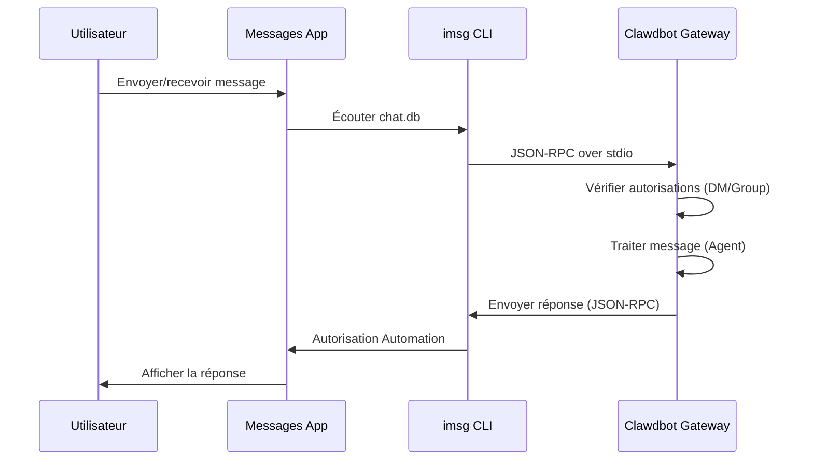

# Configuration du canal iMessage

## Ce que vous saurez faire

- Discuter 1:1 avec l'assistant IA via iMessage sur macOS
- Utiliser l'assistant IA dans les groupes iMessage (support des mentions @)
- Configurer un utilisateur Mac dédié pour isoler l'identité du bot
- Accéder à distance au iMessage d'un autre Mac via SSH/Tailscale
- Maîtriser le jumelage DM et le contrôle d'accès allowlist de groupe

## Votre problème actuel

Vous souhaitez utiliser iMessage sur macOS pour interagir avec l'assistant IA, mais vous ne savez pas comment :

- Installer et configurer l'outil CLI `imsg`
- Accorder à Clawdbot les autorisations Full Disk Access et Automation
- Configurer un Mac local ou distant comme passerelle iMessage
- Configurer plusieurs comptes iMessage
- Contrôler qui peut envoyer des messages au bot

## Quand utiliser cette méthode

**Scénarios adaptés à l'utilisation du canal iMessage** :

- Vous utilisez principalement iMessage sur macOS
- Vous souhaitez utiliser iMessage local (sans dépendre de serveurs tiers)
- Besoin d'interagir texte et média avec l'assistant IA via iMessage
- Vous souhaitez conserver la même expérience de conversation que sur d'autres canaux (WhatsApp, Telegram)

**Scénarios non adaptés** :

- Systèmes non macOS (le canal iMessage ne prend en charge que macOS)
- Besoin de synchronisation multi-plateforme (envisagez WebChat, Telegram)
- Besoin de mentions @ de groupe (iMessage n'a pas de mécanisme de mention natif, configuration manuelle requise)

## Idée principale

Flux de travail du canal iMessage :



**Concepts clés** :

| Concept | Description |
|--- | ---|
| **imsg CLI** | Outil tiers, interagit avec Messages via JSON-RPC over stdio |
| **Full Disk Access** | Autorisation macOS permettant à Clawdbot de lire le chat.db de Messages |
| **Autorisation Automation** | Autorisation macOS permettant à imsg d'envoyer des messages via l'API Automation |
| **chat_id** | Identifiant de chat stable pour le routage et l'isolation de session |
| **pairing** | Mécanisme de protection DM par défaut, les expéditeurs inconnus nécessitent une approbation |

::: tip
Le canal iMessage est implémenté via le CLI `imsg`, pas via un appel direct à l'API Messages. `imsg` communique avec Clawdbot via JSON-RPC over stdio, ce qui signifie qu'il peut s'exécuter sur un Mac distant (via SSH).
:::

## 🎒 Préparatifs

Assurez-vous d'avoir déjà :

- ✅ Terminé [Démarrage rapide](../../start/getting-started/) et installé Clawdbot
- ✅ Gateway en cours d'exécution (`clawdbot gateway --port 18789`)
- ✅ Connecté à Messages sur macOS (iMessage activé)
- ✅ Accès à Homebrew (pour installer `imsg`)

::: warning
Le canal iMessage prend uniquement en charge macOS. Assurez-vous que votre Gateway s'exécute sur macOS ou se connecte à un Mac distant via SSH/Tailscale.
:::

## Suivez les étapes

### Étape 1 : Installer le CLI imsg

**Pourquoi**
`imsg` est la dépendance principale du canal iMessage, interagissant avec l'application Messages via JSON-RPC over stdio.

1. Installer via Homebrew :
   ```bash
   brew install steipete/tap/imsg
   ```

**Ce que vous devriez voir** :
- Après installation, la commande `imsg` est disponible
- Exécuter `imsg --version` affiche les informations de version

**Vérifier l'installation** :

```bash
# Tester si imsg est disponible
imsg chats --limit 1
```

**Ce que vous devriez voir** :
- Au moins un enregistrement de chat en sortie (s'il y en a)
- Ou une invite demandant d'accorder l'autorisation Full Disk Access

### Étape 2 : Accorder l'autorisation Full Disk Access

**Pourquoi**
Clawdbot doit lire la base de données `chat.db` de Messages pour écouter les nouveaux messages.

1. Ouvrir **Paramètres système** > **Confidentialité et sécurité**
2. Cliquez sur **Accès complet au disque**
3. Cliquez sur **+** pour ajouter les applications suivantes :
   - `/Applications/Clawdbot.app` (si vous utilisez l'application macOS)
   - `/usr/local/bin/imsg` ou le chemin réel d'`imsg`
4. Redémarrer Gateway

::: warning
Vous devez redémarrer Gateway après la modification des autorisations pour que les changements prennent effet !
:::

**Ce que vous devriez voir** :
- Pas d'erreur d'autorisation dans les journaux de démarrage de Gateway
- `imsg chats --limit 1` peut normalement afficher la liste des chats

### Étape 3 : Accorder l'autorisation Automation

**Pourquoi**
`imsg` envoie des messages via l'API Automation Apple Events et nécessite une autorisation utilisateur.

1. Lors du premier envoi de message, macOS affichera une invite d'autorisation
2. Cliquez sur **Autoriser** ou **OK**
3. Si vous utilisez un utilisateur Mac dédié, exécutez un test une fois dans la session de cet utilisateur

**Tester l'autorisation Automation** :

```bash
# Envoyer un message de test (remplacer par le destinataire réel)
imsg send --to "+15555550123" "Test message"
```

**Ce que vous devriez voir** :
- macOS affiche une invite d'autorisation (première fois)
- Message envoyé avec succès après autorisation accordée
- Message de test affiché dans l'application Messages

### Étape 4 : Configurer Clawdbot

**Pourquoi**
Indiquer à Clawdbot quel chemin `imsg` utiliser et où se trouve la base de données Messages.

**Méthode A : Configuration simple (Mac local)**

Modifier `~/.clawdbot/clawdbot.json` :

```json5
{
  channels: {
    imessage: {
      enabled: true,
      cliPath: "/usr/local/bin/imsg",
      dbPath: "/Users/<your-username>/Library/Messages/chat.db",
      dmPolicy: "pairing",
      groupPolicy: "allowlist"
    }
  }
}
```

::: info
Remplacez `<your-username>` par votre nom d'utilisateur macOS réel.
:::
**Méthode B : Configuration multi-comptes**

```json5
{
  channels: {
    imessage: {
      enabled: true,
      accounts: {
        main: {
          name: "Main Account",
          enabled: true,
          cliPath: "/usr/local/bin/imsg",
          dbPath: "/Users/alice/Library/Messages/chat.db"
        },
        bot: {
          name: "Bot Account",
          enabled: true,
          cliPath: "/path/to/imsg-bot-wrapper",  // Voir étape 5
          dbPath: "/Users/botuser/Library/Messages/chat.db"
        }
      }
    }
  }
}
```

**Redémarrer Gateway** :

```bash
clawdbot gateway restart
```

**Ce que vous devriez voir** :
- Gateway démarre et affiche "iMessage default: enabled, configured, ..."
- Pas de journal d'erreur d'autorisation ou de chemin

### Étape 5 : Envoyer un message de test

**Pourquoi**
Vérifier que la configuration est correcte et que les messages sont transmis normalement.

1. Envoyer un message de test via CLI :
   ```bash
   clawdbot message --to imessage:+15555550123 "Hello from Clawdbot!"
   ```

**Ce que vous devriez voir** :
- Application Messages reçoit le message
- Journal Gateway affiche le message envoyé
- Si un modèle IA est configuré, recevoir une réponse IA

::: info
Le format `imessage:+15555550123` indique l'envoi via le canal iMessage au numéro de téléphone `+15555550123`. Vous pouvez également utiliser une adresse email `imessage:user@example.com`.
:::

## Point de contrôle ✅

Vérifier si la configuration a réussi :

```bash
# Vérifier l'état des canaux
clawdbot channels status

# Devrait afficher :
# iMessage default: enabled, configured, rpc listening
```

::: info
Si vous voyez une erreur, exécutez `clawdbot channels status --probe` pour afficher des informations de diagnostic détaillées.
:::

## Configuration avancée

### Configurer un utilisateur Mac dédié (optionnel)

Si vous souhaitez utiliser une identité iMessage distincte (sans polluer vos Messages personnels), vous pouvez créer un utilisateur Mac dédié.

**Étapes** :

1. **Créer un Apple ID dédié** :
   - Visitez [appleid.apple.com](https://appleid.apple.com)
   - Créez un nouvel Apple ID (par exemple `my-cool-bot@icloud.com`)

2. **Créer un utilisateur macOS** :
   - Ouvrez **Paramètres système** > **Utilisateurs et groupes**
   - Cliquez sur **+** pour créer un nouvel utilisateur (par exemple `botuser`)
   - Configurez la connexion automatique ou mémorisez le mot de passe

3. **Connecter au compte iMessage dédié** :
   - Basculez vers l'utilisateur `botuser`
   - Ouvrez l'application Messages
   - Connectez-vous à iMessage avec l'Apple ID dédié

4. **Activer la connexion à distance** :
   - Ouvrez **Paramètres système** > **Général** > **Partage**
   - Activez **Connexion à distance**

5. **Configurer SSH sans mot de passe** :
   ```bash
   # Tester SSH depuis l'utilisateur principal
   ssh botuser@localhost true

   # Si un mot de passe est requis, configurez les clés SSH :
   ssh-keygen -t ed25519
   ssh-copy-id botuser@localhost
   ```

6. **Créer un script wrapper SSH** :

   Créez `~/.clawdbot/scripts/imsg-bot` (`chmod +x`) :

   ```bash
   #!/usr/bin/env bash
   set -euo pipefail

   # Exécuter SSH interactif une fois pour accepter les clés d'hôte :
   #   ssh botuser@localhost true
   exec /usr/bin/ssh -o BatchMode=yes -o ConnectTimeout=5 -T botuser@localhost \
     "/usr/local/bin/imsg" "$@"
   ```
7. **Configurer Clawdbot** :

   ```json5
   {
     channels: {
       imessage: {
         enabled: true,
         accounts: {
           bot: {
             name: "Bot",
             enabled: true,
             cliPath: "/Users/<your-username>/.clawdbot/scripts/imsg-bot",
             dbPath: "/Users/botuser/Library/Messages/chat.db"
           }
         }
       }
     }
   }
   ```

::: tip
Lors de la première configuration, exécutez `imsg chats --limit 1` ou `imsg send ...` une fois dans la session `botuser` pour accorder l'autorisation Automation.
:::

### Configuration Mac distant (optionnel)

Si Gateway s'exécute sur Linux/VM mais iMessage doit être sur Mac, vous pouvez vous connecter à distance via SSH.

**Architecture** :

```
┌──────────────────────────────┐          SSH (imsg rpc)          ┌──────────────────────────┐
│ Gateway host (Linux/VM)      │──────────────────────────────────▶│ Mac with Messages + imsg │
│ - clawdbot gateway           │          SCP (attachments)        │ - Messages signed in     │
│ - channels.imessage.cliPath  │◀──────────────────────────────────│ - Remote Login enabled   │
└──────────────────────────────┘                                   └──────────────────────────┘
              ▲
              │ Tailscale tailnet (hostname or 100.x.y.z)
              ▼
        user@remote-mac
```

**Étapes de configuration** :

1. **Créer un wrapper SSH** (`~/.clawdbot/scripts/imsg-ssh`) :

   ```bash
   #!/usr/bin/env bash
   exec ssh -T bot@remote-mac imsg "$@"
   ```

2. **Configurer Clawdbot** :

   ```json5
   {
     channels: {
       imessage: {
         enabled: true,
         cliPath: "/Users/<your-username>/.clawdbot/scripts/imsg-ssh",
         remoteHost: "bot@remote-mac",
         includeAttachments: true,
         dbPath: "/Users/bot/Library/Messages/chat.db"
       }
     }
   }
   ```

::: info
`remoteHost` est utilisé pour le transfert de pièces jointes SCP. Si non défini, Clawdbot essaiera de détecter automatiquement depuis la commande SSH. La configuration explicite est plus fiable.
:::

**Exemple de configuration Tailscale** :

```bash
# Wrapper SSH
#!/usr/bin/env bash
exec ssh -T bot@mac-mini.tailnet-1234.ts.net imsg "$@"
```

```json5
{
  channels: {
    imessage: {
      enabled: true,
      cliPath: "~/.clawdbot/scripts/imsg-ssh",
      remoteHost: "bot@mac-mini.tailnet-1234.ts.net",
      includeAttachments: true,
      dbPath: "/Users/bot/Library/Messages/chat.db"
    }
  }
}
```

## Détails de la configuration

### Configuration de base

| Option | Type | Par défaut | Description |
|--- | --- | --- | ---|
| `enabled` | boolean | false | Activer ou non le canal iMessage |
| `cliPath` | string | "imsg" | Chemin du CLI imsg (peut être un wrapper SSH) |
| `dbPath` | string | - | Chemin du chat.db de Messages |
| `remoteHost` | string | - | Hôte SSH (pour le transfert de pièces jointes SCP) |

### Stratégie DM

| Option | Type | Par défaut | Description |
|--- | --- | --- | ---|
| `dmPolicy` | "pairing"|"allowlist"|"open"|"disabled" | "pairing" | Stratégie d'accès DM |
| `allowFrom` | array | [] | Liste des expéditeurs autorisés (handles, emails, E.164, `chat_id:*`) |

**Jumeler un nouvel expéditeur** :

```bash
# Lister les codes de jumelage en attente
clawdbot pairing list imessage

# Approuver le jumelage
clawdbot pairing approve imessage <CODE>
```

::: tip
iMessage n'a pas de concept de nom d'utilisateur, il utilise des handles (numéros de téléphone ou adresses email) ou des cibles de chat (`chat_id`, `chat_guid`, `chat_identifier`).
:::

### Stratégie de groupe

| Option | Type | Par défaut | Description |
|--- | --- | --- | ---|
| `groupPolicy` | "allowlist"|"open"|"disabled" | "allowlist" | Stratégie d'accès aux groupes |
| `groupAllowFrom` | array | [] | Expéditeurs autorisés à déclencher l'IA dans les groupes |
| `groups` | object | {} | Configuration des groupes par chat_id |

**Exemple de configuration de groupe** :

```json5
{
  channels: {
    imessage: {
      groupPolicy: "allowlist",
      groupAllowFrom: ["+15555550123", "alice@example.com"],
      groups: {
        "42": {
          requireMention: false,
          allowFrom: ["bob@example.com"]
        }
      }
    }
  }
}
```

### Limites de média et texte

| Option | Type | Par défaut | Description |
|--- | --- | --- | ---|
| `includeAttachments` | boolean | false | Inclure ou non les pièces jointes dans le contexte |
| `mediaMaxMb` | number | 16 | Taille maximale des fichiers médias (MB) |
| `textChunkLimit` | number | 4000 | Taille des blocs de texte sortants (caractères) |
| `chunkMode` | "length"|"newline" | "length" | Mode de découpage : par longueur ou par ligne vide |

### Historique

| Option | Type | Par défaut | Description |
|--- | --- | --- | ---|
| `historyLimit` | number | - | Nombre maximum de messages historiques pour les groupes (0 pour désactiver) |
| `dmHistoryLimit` | number | - | Limite des messages historiques DM (tours utilisateur) |
| `dms["<handle>"].historyLimit` | number | - | Remplacer la limite d'historique DM par handle |

## Problèmes courants

### La commande imsg rpc n'est pas disponible

**Symptôme** : Le journal Gateway affiche "imsg CLI does not support 'rpc' subcommand"

**Cause** : La version d'`imsg` est trop ancienne et ne prend pas en charge la sous-commande `rpc`

**Solution** :

1. Mettre à jour `imsg` :
   ```bash
   brew upgrade steipete/tap/imsg
   ```

2. Vérifier la version :
   ```bash
   imsg rpc --help
   ```

### Problème d'autorisation Full Disk Access

**Symptôme** : `imsg chats --limit 1` n'affiche rien ou affiche une erreur "Permission denied"

**Solution** :

1. Assurez-vous d'avoir ajouté Clawdbot et `imsg` à l'accès complet au disque
2. Redémarrer Gateway
3. Si le problème persiste, essayez de redémarrer Mac

### Problème d'autorisation Automation

**Symptôme** : L'envoi de messages ne provoque aucune réaction, le journal Gateway affiche un timeout

**Cause** : macOS n'a pas accordé l'autorisation Automation

**Solution** :

1. Envoyez manuellement un message dans l'application Messages
2. macOS devrait afficher une invite d'autorisation
3. Cliquez sur **Autoriser**
4. Si vous utilisez un utilisateur Mac dédié, basculez vers cet utilisateur et répétez les étapes

### Échec de connexion Mac distant

**Symptôme** : Le wrapper SSH expire ou la connexion est refusée

**Solution** :

1. Tester la connexion SSH :
   ```bash
   ssh -T bot@remote-mac imsg --version
   ```

2. Assurez-vous que la connexion à distance est activée (Mac distant)

3. Vérifiez le pare-feu et les paramètres de port

4. Utilisez Tailscale pour simplifier la traversée réseau

## Résumé du cours

- Installé l'outil CLI `imsg`
- Configuré les autorisations Full Disk Access et Automation
- Appris les méthodes de configuration Mac locale et distante
- Maîtrisé le jumelage DM et le mécanisme allowlist de groupe
- Compris les différences entre chat_id, chat_guid, chat_identifier
- Testé les messages 1:1 et de groupe

## Prochain cours

> Dans le prochain cours, nous apprendrons le **[canal LINE](../line/)**.
> 
> Vous apprendrez :
> - Comment obtenir les identifiants de l'API LINE Messaging
> - Configurer les points de terminaison Webhook du bot LINE
> - Les formats et limites des messages du canal LINE
> - Les différences de configuration avec le canal iMessage

---

## Annexe : Référence du code source

<details>
<summary><strong>Cliquez pour afficher les emplacements du code source</strong></summary>

> Dernière mise à jour : 2026-01-27

| Fonctionnalité | Chemin du fichier | Lignes |
|--- | --- | ---|
| Définition des types de configuration iMessage | [`src/config/types.imessage.ts`](https://github.com/moltbot/moltbot/blob/main/src/config/types.imessage.ts) | 1-80 |
| Analyse des comptes iMessage | [`src/imessage/accounts.ts`](https://github.com/moltbot/moltbot/blob/main/src/imessage/accounts.ts) | 1-83 |
| Détection iMessage | [`src/imessage/probe.ts`](https://github.com/moltbot/moltbot/blob/main/src/imessage/probe.ts) | 1-92 |
| Envoi iMessage | [`src/imessage/send.ts`](https://github.com/moltbot/moltbot/blob/main/src/imessage/send.ts) | 1-135 |
| Fournisseur de surveillance iMessage | [`src/imessage/monitor/monitor-provider.ts`](https://github.com/moltbot/moltbot/blob/main/src/imessage/monitor/monitor-provider.ts) | 1-600+ |
| Analyse des cibles | [`src/imessage/targets.ts`](https://github.com/moltbot/moltbot/blob/main/src/imessage/targets.ts) | 1-200+ |
| Adaptateur Onboarding | [`src/channels/plugins/onboarding/imessage.ts`](https://github.com/moltbot/moltbot/blob/main/src/channels/plugins/onboarding/imessage.ts) | 1-262 |
| Documentation iMessage | [`docs/channels/imessage.md`](https://github.com/moltbot/moltbot/blob/main/docs/channels/imessage.md) | 1-262 |

**Types clés** :
- `IMessageConfig` : Interface de configuration iMessage complète
- `IMessageAccountConfig` : Configuration de compte unique
- `IMessageService` : "imessage" | "sms" | "auto"
- `IMessageTargetKind` : "chat_id" | "chat_guid" | "chat_identifier" | "handle"

**Champs de configuration clés** :
- `cliPath` : Chemin du CLI imsg, peut être un chemin local ou un script wrapper SSH
- `dbPath` : Chemin de la base de données chat.db de Messages
- `remoteHost` : Hôte SSH (pour le transfert de pièces jointes SCP), détecté automatiquement ou configuré explicitement
- `dmPolicy` : Par défaut "pairing", contrôle l'accès DM inconnu
- `groupPolicy` : Stratégie d'accès aux groupes, "allowlist" ou "open"
- `groups` : Configuration des groupes par `chat_id`, supporte l'isolation de session et les stratégies personnalisées

**Fonctions clés** :
- `probeIMessage()` : Détecte si le CLI imsg est disponible et prend en charge la sous-commande rpc (`probe.ts`)
- `sendMessageIMessage()` : Envoie des messages iMessage, supporte texte et média (`send.ts`)
- `monitorIMessageProvider()` : Surveille le flux d'événements iMessage (`monitor-provider.ts`)
- `parseIMessageTarget()` : Analyse les adresses cibles (chat_id, handle, email, etc.) (`targets.ts`)

**Mécanisme de communication** :
- Communication JSON-RPC over stdio via la sous-commande `imsg rpc`
- Chaque compte a une instance de client RPC indépendante (`createIMessageRpcClient`)
- Les événements de message sont diffusés en streaming vers Gateway via `monitor-provider.ts`
- L'envoi de messages prend en charge `chat_id` (recommandé), `chat_guid`, `chat_identifier` ou handle direct

**Support multi-comptes** :
- Utiliser le map `channels.imessage.accounts` pour configurer plusieurs comptes
- Chaque compte a une configuration indépendante de `cliPath`, `dbPath` et de stratégies
- L'ID de compte par défaut est "default", peut être spécifié via le champ `accountId`

</details>
