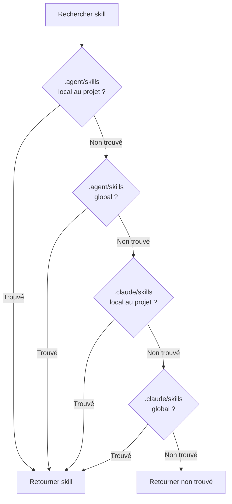

# Mode Universal : Environnement multi-agent

## Ce que vous apprendrez

- Comprendre la valeur fondamentale et le but de conception du mode Universal
- Maîtriser l'utilisation du flag `--universal`
- Comprendre la différence entre `.agent/skills` et `.claude/skills`
- Comprendre les règles des 4 niveaux de priorité de recherche
- Gérer les skills de manière unifiée dans un environnement multi-agent et éviter les conflits
- Partager le même ensemble de skills pour Claude Code, Cursor, Windsurf, Aider et autres agents

::: info Prérequis

Ce tutoriel suppose que vous avez déjà compris [Installation globale vs locale au projet](../../platforms/global-vs-project/) et [Synchroniser les skills vers AGENTS.md](../../start/sync-to-agents/), et que vous comprenez les emplacements d'installation de base et le flux de synchronisation.

:::

---

## Votre situation actuelle

Vous avez peut-être déjà appris comment installer et synchroniser des skills, mais :

- **Comment partager les skills entre plusieurs agents ?** : Utiliser simultanément Claude Code et Cursor, mais installer les skills séparément, ce qui crée une gestion chaotique
- **Conflit avec le Marketplace Claude Code** : Les skills installés entrent en conflit avec le marketplace natif des plugins Claude Code
- **Emplacement AGENTS.md non uniforme** : Différents agents nécessitent des chemins AGENTS.md différents, difficiles à maintenir
- **Installation répétée des skills** : Chaque agent doit installer son propre ensemble de skills, gaspillant de l'espace disque

En fait, OpenSkills propose le mode Universal, spécialement conçu pour résoudre les problèmes de gestion des skills dans un environnement multi-agent.

---

## Quand utiliser cette approche

**Scénarios d'application du mode Universal** :

| Scénario | Mode Universal nécessaire ? | Exemple |
| --- | --- | --- |
| **Agent unique** (Claude Code uniquement) | ❌ Non | Utiliser uniquement Claude Code, utiliser directement `.claude/skills` par défaut |
| **Multi-agent** (Claude Code + autres) | ✅ Oui | Utiliser simultanément Claude Code et Cursor/Windsurf/Aider |
| **Éviter les conflits Marketplace** | ✅ Oui | Ne pas vouloir entrer en conflit avec le marketplace natif Claude Code |
| **Gestion AGENTS.md unifiée** | ✅ Oui | Plusieurs agents partagent le même fichier AGENTS.md |

::: tip Recommandations

- **Agent unique en mode par défaut** : N'utiliser que Claude Code, installer avec `.claude/skills` par défaut
- **Multi-agent en mode Universal** : Utiliser plusieurs agents simultanément, installer avec `--universal` dans `.agent/skills`
- **Standard unifié en équipe** : L'équipe doit convenir explicitement du mode à utiliser pour éviter la confusion

:::

---

## Idée centrale : Répertoire unifié, partage multi-agent

OpenSkills propose deux modes de répertoire de skills :

**Mode par défaut (`.claude/skills`)** :
- Conçu spécifiquement pour Claude Code
- Compatible avec le Marketplace Claude Code
- Emplacement d'installation : `./.claude/skills/` ou `~/.claude/skills/`

**Mode Universal (`.agent/skills`)** :
- Conçu spécifiquement pour les environnements multi-agent
- Évite les conflits avec le Marketplace Claude Code
- Emplacement d'installation : `./.agent/skills/` ou `~/.agent/skills/`

::: info Concept important

**Mode Universal** : Utiliser le flag `--universal` pour installer les skills dans le répertoire `.agent/skills/`, permettant à plusieurs agents de codage IA (Claude Code, Cursor, Windsurf, Aider, etc.) de partager le même ensemble de skills, gérés de manière unifiée via AGENTS.md.

:::

**4 niveaux de priorité de recherche** (source `dirs.ts:18-24`) :

```typescript
export function getSearchDirs(): string[] {
  return [
    join(process.cwd(), '.agent/skills'),     // 1. Project universal (priorité la plus élevée)
    join(homedir(), '.agent/skills'),         // 2. Global universal
    join(process.cwd(), '.claude/skills'),    // 3. Project claude
    join(homedir(), '.claude/skills'),        // 4. Global claude
  ];
}
```

**Explication des priorités** :
1. **Project Universal** (plus élevé) : `.agent/skills/` prioritaire sur `.claude/skills/`
2. **Global Universal** : recherche ensuite dans `.agent/skills/` global
3. **Project Claude** : puis dans `.claude/skills/` local au projet
4. **Global Claude** (plus bas) : enfin dans `.claude/skills/` global

---

## Suivez-moi

### Étape 1 : Installer les skills en mode Universal

**Pourquoi**
Apprendre d'abord à utiliser le flag `--universal` pour installer des skills.

Ouvrez un terminal et exécutez dans n'importe quel projet :

```bash
# Installer les skills en mode Universal
npx openskills install anthropics/skills --universal -y

# Voir la liste des skills
npx openskills list
```

**Vous devriez voir** : Chaque skill dans la liste a une étiquette `(project)`

```
codebase-reviewer (project)
Review code changes for issues...

Summary: 3 project, 0 global (3 total)
```

**Explication** :
- En utilisant le flag `--universal`, les skills sont installés dans `./.agent/skills/`
- La commande `list` affiche toujours les étiquettes `(project)` ou `(global)`
- `.agent/skills/` ne rentre pas en conflit avec `.claude/skills/` par défaut

---

### Étape 2 : Vérifier l'emplacement d'installation des skills

**Pourquoi**
Confirmer l'emplacement réel de stockage des fichiers de skills et comprendre la structure du répertoire en mode Universal.

Exécutez à la racine du projet :

```bash
# Voir le répertoire des skills en mode Universal
ls -la .agent/skills/

# Voir le contenu du répertoire d'un skill
ls -la .agent/skills/codebase-reviewer/
```

**Vous devriez voir** :

```
.agent/skills/
├── codebase-reviewer/
│   ├── SKILL.md
│   └── .openskills.json  # Métadonnées d'installation
├── file-writer/
│   ├── SKILL.md
│   └── .openskills.json
└── ...
```

**Explication** :
- Les skills en mode Universal sont installés dans `.agent/skills/`
- Chaque skill a son propre répertoire et ses métadonnées
- C'est exactement la même structure que `.claude/skills/` par défaut

---

### Étape 3 : Comparer les structures de répertoire des deux modes

**Pourquoi**
Comprendre la différence entre `.claude/skills` et `.agent/skills` par une comparaison réelle.

Exécutez les commandes suivantes :

```bash
# Voir les répertoires de skills des deux modes
echo "=== .claude/skills (mode par défaut) ==="
ls -la .claude/skills/ 2>/dev/null || echo "Répertoire inexistant"

echo "=== .agent/skills (mode Universal) ==="
ls -la .agent/skills/

# Voir les répertoires d'installation globale
echo "=== ~/.claude/skills (global par défaut) ==="
ls -la ~/.claude/skills/ 2>/dev/null || echo "Répertoire inexistant"

echo "=== ~/.agent/skills (global Universal) ==="
ls -la ~/.agent/skills/ 2>/dev/null || echo "Répertoire inexistant"
```

**Vous devriez voir** :

```
=== .claude/skills (mode par défaut) ===
Répertoire inexistant

=== .agent/skills (mode Universal) ===
codebase-reviewer
file-writer

=== ~/.claude/skills (global par défaut) ===
git-helper
test-generator

=== ~/.agent/skills (global Universal) ===
Répertoire inexistant
```

**Explication** :
- `.claude/skills/` et `.agent/skills/` sont deux répertoires indépendants
- Ils peuvent coexister sans interférence
- Supporte l'installation locale au projet et globale

---

### Étape 4 : Installation Universal globale

**Pourquoi**
Comprendre comment installer des skills Universal globalement pour servir tous les projets.

Exécutez :

```bash
# Installer des skills Universal globalement
npx openskills install anthropics/skills --universal --global -y

# Voir la liste des skills
npx openskills list
```

**Vous devriez voir** :

```
codebase-reviewer (project)
Review code changes for issues...
file-writer (global)
Write files with format...

Summary: 1 project, 2 global (3 total)
```

**Explication** :
- `--universal` et `--global` peuvent être combinés
- Installé dans le répertoire `~/.agent/skills/`
- Tous les projets peuvent utiliser ces skills

---

### Étape 5 : Vérifier les 4 niveaux de priorité de recherche

**Pourquoi**
Comprendre comment OpenSkills recherche les skills dans les 4 répertoires.

Exécutez :

```bash
# Installer des skills du même nom aux 4 emplacements (versions différentes)
# 1. Project Universal
npx openskills install anthropics/skills --universal -y
# 2. Global Universal
npx openskills install anthropics/skills --universal --global -y
# 3. Project Claude
npx openskills install anthropics/skills -y
# 4. Global Claude
npx openskills install anthropics/skills --global -y

# Lire le skill (utilisera la version Project Universal par priorité)
npx openskills read codebase-reviewer | head -5
```

**Vous devriez voir** : La sortie est le contenu de la version du répertoire `.agent/skills/` (Project Universal).

**Visualisation de la priorité de recherche** :



**Explication** :
- `.agent/skills/` a une priorité plus élevée que `.claude/skills/`
- La priorité locale au projet est plus élevée que globale
- Quand des skills du même nom existent simultanément, la version Project Universal est utilisée en priorité
- Cela permet une configuration flexible "Universal en priorité"

---

### Étape 6 : Éviter les conflits avec le Marketplace Claude Code

**Pourquoi**
Comprendre comment le mode Universal résout les conflits avec le Marketplace Claude Code.

Exécutez :

```bash
# Installer des skills en mode Universal
npx openskills install anthropics/skills --universal -y

# Synchroniser vers AGENTS.md
npx openskills sync

# Voir AGENTS.md
cat AGENTS.md
```

**Vous devriez voir** : AGENTS.md contient la liste des skills, sans conflit avec le Marketplace Claude Code.

**Explication** :
- Le mode Universal utilise `.agent/skills/`, séparé de `.claude/skills/` de Claude Code
- Évite les conflits entre les skills installés par OpenSkills et les plugins du Marketplace Claude Code
- Plusieurs agents peuvent partager le même AGENTS.md, géré de manière unifiée

---

## Point de contrôle ✅

Complétez les vérifications suivantes pour confirmer que vous maîtrisez le contenu de cette leçon :

- [ ] Pouvoir distinguer les deux modes `.claude/skills` et `.agent/skills`
- [ ] Connaître le rôle du flag `--universal`
- [ ] Comprendre les règles des 4 niveaux de priorité de recherche
- [ ] Pouvoir choisir le mode d'installation approprié selon le scénario
- [ ] Savoir comment gérer les skills de manière unifiée dans un environnement multi-agent
- [ ] Comprendre comment le mode Universal évite les conflits Marketplace

---

## Pièges à éviter

### Erreur courante 1 : Utiliser le mode Universal avec un agent unique

**Scénario d'erreur** : N'utiliser que Claude Code, mais utiliser le mode Universal

```bash
# ❌ Erreur : Un agent unique n'a pas besoin du mode Universal
npx openskills install anthropics/skills --universal
```

**Problème** :
- Ajoute une complexité inutile
- Ne peut pas fonctionner avec les plugins du Marketplace Claude Code
- L'emplacement AGENTS.md peut ne pas correspondre aux attentes de Claude Code

**Bonne pratique** :

```bash
# ✅ Correct : Un agent unique utilise le mode par défaut
npx openskills install anthropics/skills
```

---

### Erreur courante 2 : Ne pas utiliser le mode Universal en multi-agent

**Scénario d'erreur** : Utiliser plusieurs agents simultanément, mais sans utiliser le mode Universal

```bash
# ❌ Erreur : Chaque agent installe les skills indépendamment, gestion chaotique
npx openskills install anthropics/skills  # Pour Claude Code
npx openskills install anthropics/skills --global  # Pour Cursor
```

**Problème** :
- Installation répétée des skills, gaspillage d'espace disque
- Les versions des skills utilisées par différents agents peuvent ne pas être cohérentes
- AGENTS.md doit être maintenu séparément

**Bonne pratique** :

```bash
# ✅ Correct : Le multi-agent utilise le mode Universal pour une gestion unifiée
npx openskills install anthropics/skills --universal
# Tous les agents partagent le même ensemble de skills et AGENTS.md
```

---

### Erreur courante 3 : Oublier la priorité de recherche du mode Universal

**Scénario d'erreur** : Des skills du même nom sont installés dans `.claude/skills` et `.agent/skills`, mais vous voulez utiliser la version `.claude/skills`

```bash
# .agent/skills et .claude/skills ont tous deux codebase-reviewer
# mais vous voulez utiliser la version .claude/skills
npx openskills install anthropics/skills --universal  # Installer nouvelle version dans .agent/skills
npx openskills install anthropics/skills  # Installer ancienne version dans .claude/skills
npx openskills read codebase-reviewer  # ❌ Lit toujours la version .agent/skills
```

**Problème** :
- `.agent/skills` a une priorité plus élevée que `.claude/skills`
- Même si `.claude/skills` a la nouvelle version installée, la version `.agent/skills` est toujours lue

**Bonne pratique** :

```bash
# Solution 1 : Supprimer la version .agent/skills
npx openskills remove codebase-reviewer  # Supprimer version .agent/skills
npx openskills read codebase-reviewer  # ✅ Lit maintenant la version .claude/skills

# Solution 2 : Mettre à jour la version .agent/skills
npx openskills update codebase-reviewer  # Mettre à jour version .agent/skills
```

---

### Erreur courante 4 : Configuration incorrecte du chemin AGENTS.md

**Scénario d'erreur** : Différents agents nécessitent des chemins AGENTS.md différents

```bash
# Claude Code attend AGENTS.md à la racine
# Cursor attend AGENTS.md dans .cursor/
# Windsurf attend AGENTS.md dans .windsurf/
npx openskills sync  # Génère seulement un AGENTS.md
```

**Problème** :
- Différents agents ne peuvent pas trouver AGENTS.md
- Échec du chargement des skills

**Bonne pratique** :

```bash
# Générer des AGENTS.md à différents emplacements pour différents agents
npx openskills sync -o AGENTS.md  # Claude Code
npx openskills sync -o .cursor/AGENTS.md  # Cursor
npx openskills sync -o .windsurf/AGENTS.md  # Windsurf
```

---

## Résumé de la leçon

**Points clés** :

1. **Le mode Universal est pour les environnements multi-agent** : Utiliser `--universal` pour installer dans `.agent/skills/`
2. **4 niveaux de priorité de recherche** : Project Universal > Global Universal > Project Claude > Global Claude
3. **Éviter les conflits Marketplace** : `.agent/skills/` est séparé de `.claude/skills/` de Claude Code
4. **Gestion AGENTS.md unifiée** : Plusieurs agents partagent le même fichier AGENTS.md
5. **Principe recommandé** : Agent unique en mode par défaut, multi-agent en mode Universal

**Flux de décision** :

```
[Besoin d'installer des skills] → [Utiliser plusieurs agents ?]
↓ Oui
[Utiliser mode Universal (--universal)]
↓ Non
[Utiliser uniquement Claude Code ?]
↓ Oui
[Utiliser mode par défaut (.claude/skills)]
↓ Non
[Consulter la documentation de l'agent spécifique, choisir le mode approprié]
```

**Moyen mnémotechnique** :

- **Agent unique** : Le mode par défaut est le plus simple, Claude Code utilise `.claude`
- **Multi-agent** : Le mode Universal gère de manière unifiée, `.agent/skills` évite les conflits

---

## Aperçu de la prochaine leçon

> La prochaine leçon couvre **[Chemin de sortie personnalisé](../custom-output-path/)**.
>
> Vous apprendrez :
> - Comment utiliser le flag `--output/-o` pour personnaliser le chemin de sortie AGENTS.md
> - Comment générer des AGENTS.md à différents emplacements pour différents agents
> - Comment utiliser le chemin de sortie personnalisé dans un environnement CI/CD
> - Comment intégrer dans un système de documentation existant

---

## Annexe : Référence du code source

<details>
<summary><strong>Cliquez pour voir l'emplacement du code source</strong></summary>

> Dernière mise à jour : 2026-01-24

| Fonctionnalité | Chemin du fichier | Lignes |
| --- | --- | --- |
| Utilitaires de chemins de répertoire | [`src/utils/dirs.ts`](https://github.com/numman-ali/openskills/blob/main/src/utils/dirs.ts#L7-L25) | 7-25 |
| Détermination de l'emplacement d'installation | [`src/commands/install.ts`](https://github.com/numman-ali/openskills/blob/main/src/commands/install.ts#L84-L92) | 84-92 |
| Définition des arguments de ligne de commande | [`src/cli.ts`](https://github.com/numman-ali/openskills/blob/main/src/cli.ts#L48) | 48 |

**Constantes clés** :
- `.claude/skills` : Répertoire de skills par défaut (compatible Claude Code)
- `.agent/skills` : Répertoire de skills universel (environnement multi-agent)

**Fonctions clés** :
- `getSkillsDir(projectLocal, universal)` : Retourne le chemin du répertoire de skills selon les flags
- `getSearchDirs()` : Retourne la liste des répertoires de recherche de skills (4 niveaux de priorité)

**Règles métier** :
- Le mode Universal utilise le répertoire `.agent/skills/`
- 4 niveaux de priorité de recherche : Project Universal > Global Universal > Project Claude > Global Claude
- `--universal` et `--global` peuvent être combinés

</details>
