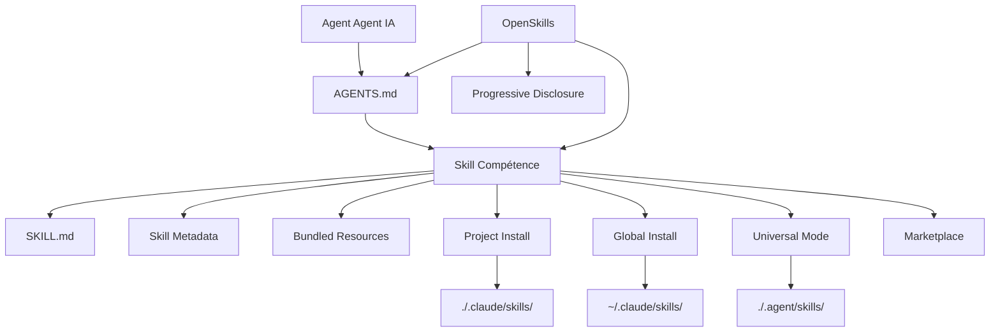

# Glossaire

Ce glossaire explique les concepts clés dans OpenSkills et le système de compétences IA, vous aidant à comprendre rapidement les termes techniques.

::: info Info
Ce glossaire est organisé par ordre alphabétique. Les associations entre termes sont indiquées dans leurs définitions.
:::

---

## A

### Agent (Agent IA)

**Définition** : Un agent IA est un outil IA capable d'exécuter des tâches de codage, comme Claude Code, Cursor, Windsurf, Aider, etc.

**Caractéristiques** :
- Capable de lire le fichier de configuration `AGENTS.md`
- Supporte le chargement de compétences au format SKILL.md
- Peut appeler des outils externes via la ligne de commande (comme `npx openskills read`)

**Rôle dans OpenSkills** : OpenSkills permet à n'importe quel agent supportant la lecture de AGENTS.md d'utiliser le format de compétences d'Anthropic.

**Termes associés** : [Skill](#skill), [AGENTS.md](#agentsmd)

---

## B

### Base Directory (Répertoire de Base)

**Définition** : Le chemin complet du répertoire de compétences, utilisé pour résoudre les références de chemins relatifs dans les compétences.

**Fonction** :
- Fournit le chemin absolu du répertoire de compétences
- Utilisé pour résoudre les chemins relatifs des ressources groupées comme `references/`, `scripts/`, `assets/`, etc.

**Exemple** :
```
Base directory: /path/to/my-first-skill
```

Lorsqu'une compétence référence `references/skill-format.md`, elle est résolue en :
```
/path/to/my-first-skill/references/skill-format.md
```

**Termes associés** : [Skill](#skill), [Bundled Resources](#bundled-resources)

---

### Bundled Resources (Ressources Groupées)

**Définition** : Les fichiers de ressources joints dans le répertoire de compétences, fournissant des informations détaillées ou des outils nécessaires à l'exécution de la compétence.

**Types** :
- **`references/`** - Documentation de référence, documentation API, etc.
- **`scripts/`** - Fichiers de scripts exécutables
- **`assets/`** - Modèles, fichiers d'exemple, etc.

**Utilisation** :
- Déplacer la documentation détaillée vers `references/` pour garder SKILL.md concis
- Placer le code exécutable dans `scripts/` pour faciliter l'appel
- Placer les modèles et exemples dans `assets/` pour référence des utilisateurs

**Exemple** :
```
my-skill/
├── SKILL.md
├── references/
│   └── api-docs.md
├── scripts/
│   └── helper.py
└── assets/
    └── template.json
```

**Termes associés** : [Skill](#skill), [SKILL.md](#skillmd)

---

## G

### Global Install (Installation Globale)

**Définition** : Installer une compétence dans le répertoire `.claude/skills` du répertoire personnel de l'utilisateur, rendant la compétence accessible à tous les projets.

**Exemple de commande** :
```bash
npx openskills install anthropics/skills --global
```

**Chemin cible** :
- macOS/Linux: `~/.claude/skills/`
- Windows: `%USERPROFILE%\.claude\skills\`

**Scénarios d'utilisation** :
- Souhaiter utiliser la même compétence dans plusieurs projets
- Ne pas vouloir versionner la compétence avec le dépôt du projet

**Priorité** : Lors de la recherche de compétences, l'installation globale a une priorité inférieure à l'installation locale du projet (voir [Priorité de Recherche de Compétences](#priorité-de-recherche-de-compétences)).

**Termes associés** : [Project Install](#project-install), [Priorité de Recherche de Compétences](#priorité-de-recherche-de-compétences)

---

## M

### Marketplace (Marché)

**Définition** : Un dépôt GitHub contenant des compétences, utilisé pour publier et découvrir des compétences.

**Anthropic Marketplace** :
- Dépôt officiel de compétences : `anthropics/skills`
- Fournit des compétences maintenues officiellement (comme pdf, git-workflow, skill-creator, etc.)

**Marchés tiers** :
- N'importe quel dépôt GitHub peut être une source de compétences
- Supporte les dépôts privés

**Installation depuis le marché** :
```bash
# Installer depuis le marché officiel d'Anthropic
npx openskills install anthropics/skills

# Installer depuis un dépôt tiers
npx openskills install your-org/your-skills

# Installer depuis un dépôt privé
npx openskills install git@github.com:your-org/private-skills.git
```

**Termes associés** : [Skill](#skill), [Global Install](#global-install)

---

## O

### OpenSkills

**Définition** : OpenSkills est un chargeur universel pour le système de compétences d'Anthropic, permettant à n'importe quel agent de codage IA d'utiliser des compétences au format standard SKILL.md.

**Valeurs fondamentales** :
- **Standard unifié** - Tous les agents utilisent le même format de compétences et la description AGENTS.md
- **Chargement progressif** - Charger les compétences à la demande, garder le contexte concis
- **Support multi-agents** - Un ensemble de compétences pour plusieurs agents
- **Orienté open source** - Supporte les chemins locaux et les dépôts git privés
- **Compatibilité élevée** - Entièrement compatible avec le format Claude Code

**Commandes principales** :
- `install` - Installer des compétences
- `list` - Lister les compétences installées
- `read` - Lire le contenu d'une compétence (pour utilisation par les agents IA)
- `sync` - Synchroniser les compétences vers AGENTS.md
- `update` - Mettre à jour les compétences installées
- `manage` / `remove` - Supprimer des compétences

**Dépôt officiel** : https://github.com/numman-ali/openskills

**Termes associés** : [Skill](#skill), [SKILL.md](#skillmd), [AGENTS.md](#agentsmd)

---

## P

### Progressive Disclosure (Chargement Progressif)

**Définition** : Ne charger les compétences que lorsqu'elles sont réellement nécessaires, évitant l'expansion du contexte causée par le chargement de toutes les compétences en une seule fois.

**Fonctionnement** :
1. Les informations sur les compétences sont stockées sous forme de descriptions courtes dans AGENTS.md
2. Lorsqu'un utilisateur demande une tâche, l'agent IA vérifie s'il existe une compétence correspondante
3. Si oui, charger le contenu complet de la compétence via `npx openskills read <skill-name>`
4. Le contenu de la compétence n'est valide que dans le contexte de la tâche actuelle

**Avantages** :
- Garder le contexte de l'agent IA concis
- Réduire l'utilisation de tokens
- Améliorer la vitesse de réponse

**Exemple** :
```xml
<!-- AGENTS.md ne contient que de brèves descriptions -->
<available_skills>
  <skill>
    <name>pdf</name>
    <description>Comprehensive PDF manipulation toolkit...</description>
  </skill>
</available_skills>

<!-- Charger le contenu complet uniquement lors d'une demande de traitement PDF -->
npx openskills read pdf
```

**Termes associés** : [AGENTS.md](#agentsmd), [Skill](#skill)

---

### Project Install (Installation Locale de Projet)

**Définition** : Installer une compétence dans les répertoires `.claude/skills` ou `.agent/skills` du répertoire du projet, versionnant la compétence avec le dépôt du projet.

**Exemple de commande** :
```bash
# Installation locale de projet (par défaut)
npx openskills install anthropics/skills

# Installation locale de projet vers .agent/skills (mode universel)
npx openskills install anthropics/skills --universal
```

**Chemin cible** :
- Par défaut : `./.claude/skills/`
- Mode universel : `./.agent/skills/`

**Scénarios d'utilisation** :
- Le projet a besoin de compétences spécifiques
- Souhaiter versionner la compétence avec le dépôt du projet
- Unifier les versions de compétences pour la collaboration d'équipe

**Priorité** : Lors de la recherche de compétences, l'installation locale de projet a une priorité supérieure à l'installation globale (voir [Priorité de Recherche de Compétences](#priorité-de-recherche-de-compétences)).

**Termes associés** : [Global Install](#global-install), [Universal Mode](#universal-mode), [Priorité de Recherche de Compétences](#priorité-de-recherche-de-compétences)

---

## S

### Skill (Compétence)

**Définition** : Un document fournissant des instructions d'exécution de tâches spécifiques aux agents IA, contenant des instructions détaillées, des étapes et des ressources groupées.

**Caractéristiques principales** :
- **Instructions statiques** - Contient seulement du texte et des ressources, pas de logique dynamique
- **Composable** - Plusieurs compétences peuvent être combinées
- **Versionnable** - Géré avec le dépôt du projet

**Composition de la compétence** :
```
skill-name/
├── SKILL.md              # Fichier principal de la compétence
├── .openskills.json      # Métadonnées d'installation (généré automatiquement)
├── references/           # Documentation de référence (optionnel)
├── scripts/             # Scripts exécutables (optionnel)
└── assets/              # Modèles et exemples (optionnel)
```

**Scénarios d'utilisation** :
- Lorsqu'un utilisateur demande une tâche, l'agent IA vérifie s'il existe une compétence correspondante
- Si oui, charger la compétence via `npx openskills read <name>`
- L'agent IA complète la tâche selon les instructions de la compétence

**Exemples de compétences** :
- `pdf` - Outil de traitement PDF
- `git-workflow` - Flux de travail Git
- `check-branch-first` - Vérification de branche

**Termes associés** : [SKILL.md](#skillmd), [Bundled Resources](#bundled-resources), [Agent](#agent)

---

### Skill Metadata (Métadonnées de Compétence)

**Définition** : Un fichier JSON (`.openskills.json`) enregistrant les informations sur la source d'installation de la compétence, utilisé pour supporter les mises à jour de compétence.

**Emplacement du fichier** : `.openskills.json` dans le répertoire de la compétence

**Description des champs** :
```json
{
  "source": "anthropics/skills",
  "sourceType": "github",
  "repoUrl": "https://github.com/anthropics/skills",
  "subpath": "skills/pdf",
  "installedAt": "2025-01-24T10:30:00.000Z"
}
```

**Fonction** :
- Enregistrer la source de la compétence (GitHub, chemin local, etc.)
- Supporter la commande `openskills update` pour rafraîchir la compétence depuis la source
- Identifier les compétences nécessitant une mise à jour mais sans source enregistrée

**Termes associés** : [Skill](#skill), [Global Install](#global-install), [Project Install](#project-install)

---

### Priorité de Recherche de Compétences

**Définition** : Lors de la recherche de compétences, OpenSkills recherche dans plusieurs répertoires selon un ordre de priorité fixe.

**Ordre de priorité** (du plus élevé au plus bas) :

| Priorité | Répertoire | Mode d'installation | Scénario d'utilisation |
|--- | --- | --- | ---|
| 1 | `./.agent/skills/` | `--universal` | Environnement multi-agents, éviter les conflits avec Claude Code |
| 2 | `~/.agent/skills/` | `--universal --global` | Compétences globales en environnement multi-agents |
| 3 | `./.claude/skills/` | Par défaut (local projet) | Compétences locales de projet (choix par défaut) |
| 4 | `~/.claude/skills/` | `--global` | Compétences globales |

**Règles de recherche** :
- Rechercher dans l'ordre de priorité
- Arrêter dès que la première compétence correspondante est trouvée
- Les compétences locales de projet remplacent les compétences globales du même nom

**Exemple** :
```bash
# Rechercher une compétence nommée "pdf"
# 1. Vérifier d'abord ./.agent/skills/pdf
# 2. Puis vérifier ~/.agent/skills/pdf
# 3. Puis vérifier ./.claude/skills/pdf
# 4. Enfin vérifier ~/.claude/skills/pdf
```

**Termes associés** : [Project Install](#project-install), [Global Install](#global-install), [Universal Mode](#universal-mode)

---

### SKILL.md

**Définition** : Fichier de format standard pour les compétences, utilisant le frontmatter YAML et le contenu Markdown pour définir les métadonnées et instructions de la compétence.

**Format du fichier** :
```markdown
---
name: my-skill
description: When to use this skill
---

# Instructions de Compétence

Instructions détaillées pour l'agent IA...

## Ressources Groupées

Voir `references/skill-format.md` pour plus de détails.
```

**Champs obligatoires** :
- `name` - Nom de la compétence (identifiant unique)
- `description` - Description de la compétence (affichée dans AGENTS.md)

**Champs optionnels** :
- `context` - Indication de contexte (guide l'agent IA sur l'utilisation de la compétence)

**Bonnes pratiques** :
- Utiliser l'impératif/infinitif : `"Pour faire X, exécuter Y"`
- Éviter la deuxième personne : ne pas écrire `"Vous devez..."`
- Garder sous 5 000 caractères
- Déplacer le contenu détaillé vers le répertoire `references/`

**Termes associés** : [Skill](#skill), [AGENTS.md](#agentsmd), [Bundled Resources](#bundled-resources)

---

## U

### Universal Mode (Mode Universel)

**Définition** : Mode d'installation en environnement multi-agents, installant les compétences dans le répertoire `.agent/skills/` pour éviter les conflits avec le Marketplace de Claude Code.

**Exemple de commande** :
```bash
npx openskills install anthropics/skills --universal
```

**Chemin cible** : `./.agent/skills/` ou `~/.agent/skills/` (avec `--global`)

**Scénarios d'utilisation** :
- Utiliser simultanément Claude Code et d'autres agents IA (comme Cursor, Windsurf)
- Souhaiter que tous les agents partagent le même ensemble de compétences
- Éviter les conflits d'installation de compétences

**Priorité de recherche** : Les compétences installées en mode universel ont la priorité la plus élevée (voir [Priorité de Recherche de Compétences](#priorité-de-recherche-de-compétences)).

**Termes associés** : [Project Install](#project-install), [Priorité de Recherche de Compétences](#priorité-de-recherche-de-compétences)

---

## A

### AGENTS.md

**Définition** : Fichier de configuration lu par les agents IA, contenant la liste des compétences disponibles et les instructions d'utilisation, au format XML.

**Emplacement du fichier** : Répertoire racine du projet ou chemin personnalisé de l'utilisateur (par défaut le répertoire racine du projet)

**Format du fichier** :
```xml
<skills_system priority="1">

## Available Skills

<!-- SKILLS_TABLE_START -->
<usage>
When users ask you to perform tasks, check if any of the available skills below can help complete the task more effectively.

How to use skills:
- Invoke: `npx openskills read <skill-name>` (run in your shell)
- The skill content will load with detailed instructions
- Base directory provided in output for resolving bundled resources
</usage>

<available_skills>

<skill>
<name>pdf</name>
<description>Comprehensive PDF manipulation toolkit...</description>
<location>project</location>
</skill>

</available_skills>
<!-- SKILLS_TABLE_END -->

</skills_system>
```

**Fonction** :
- Déclarer la liste des compétences disponibles
- Fournir des instructions d'utilisation des compétences
- Supporter la conservation du contenu personnalisé lors des mises à jour de compétences

**Génération** :
```bash
npx openskills sync
```

**Mise à jour** :
```bash
# Régénérer AGENTS.md (écrasera le contenu existant)
npx openskills sync -y

# Sortir vers un fichier personnalisé
npx openskills sync -o custom-agents.md
```

**Termes associés** : [OpenSkills](#openskills), [Skill](#skill), [Progressive Disclosure](#progressive-disclosure)

---

## Graphique des Relations entre Termes

Voici les relations entre les termes clés :



---

## Aperçu du Prochain Chapitre

> Le glossaire se termine ici. Vous avez maintenant compris les concepts clés d'OpenSkills.
>
> Ensuite, vous pouvez :
> - Revenir au [Démarrage Rapide](../../start/quick-start/) pour pratiquer l'installation et l'utilisation
> - Consulter la [Référence de l'API CLI](../cli-api/) pour connaître les commandes complètes
> - Lire le [Dépannage](../../faq/troubleshooting/) pour résoudre les problèmes courants

---

## Annexe : Référence du Code Source

<details>
<summary><strong>Cliquer pour développer les emplacements du code source</strong></summary>

> Date de mise à jour : 2026-01-24

| Terme/Fonctionnalité | Chemin du fichier | Ligne |
|--- | --- | ---|
| Définition du type Skill | [`src/types.ts`](https://github.com/numman-ali/openskills/blob/main/src/types.ts#L1-L6) | 1-6 |
| Type SkillLocation | [`src/types.ts`](https://github.com/numman-ali/openskills/blob/main/src/types.ts#L8-L12) | 8-12 |
| Type InstallOptions | [`src/types.ts`](https://github.com/numman-ali/openskills/blob/main/src/types.ts#L14-L18) | 14-18 |
| Type SkillMetadata | [`src/types.ts`](https://github.com/numman-ali/openskills/blob/main/src/types.ts#L20-L24) | 20-24 |
| Logique de recherche de compétences | [`src/utils/skills.ts`](https://github.com/numman-ali/openskills/blob/main/src/utils/skills.ts) | Tout le fichier |
| Calcul des chemins de répertoire | [`src/utils/dirs.ts`](https://github.com/numman-ali/openskills/blob/main/src/utils/dirs.ts) | Tout le fichier |
| Génération de AGENTS.md | [`src/utils/agents-md.ts`](https://github.com/numman-ali/openskills/blob/main/src/utils/agents-md.ts) | Tout le fichier |
| Lecture/Écriture de Skill Metadata | [`src/utils/skill-metadata.ts`](https://github.com/numman-ali/openskills/blob/main/src/utils/skill-metadata.ts) | Tout le fichier |

**Constantes clés** :
- Aucune (logique basée sur les paramètres et le calcul des répertoires)

**Fonctions clés** :
- `findAllSkills()` - Rechercher toutes les compétences installées
- `findSkill(name)` - Rechercher une compétence spécifique (par priorité)
- `getSkillsDir(options)` - Calculer le répertoire d'installation des compétences
- `generateSkillsXml(skills)` - Générer le contenu XML de AGENTS.md

</details>
