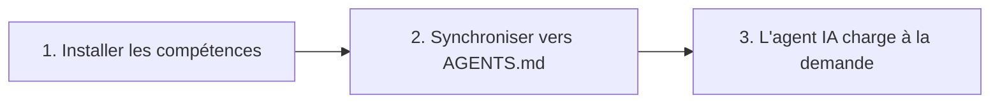

# Démarrage rapide OpenSkills : maîtrisez le système de compétences IA en 5 minutes

## Ce que vous pourrez faire après ce cours

Après avoir terminé ce cours, vous serez capable de :

- Compléter l'installation d'OpenSkills et le déploiement de votre première compétence en 5 minutes
- Utiliser les commandes `openskills install` et `openskills sync` pour gérer les compétences
- Permettre aux agents IA (Claude Code, Cursor, Windsurf, etc.) de reconnaître et d'utiliser les compétences installées
- Comprendre la valeur fondamentale d'OpenSkills : format de compétences unifié, chargement progressif, support multi-agents

## Votre problème actuel

Vous avez peut-être rencontré ces problèmes :

- **Les compétences ne peuvent pas être utilisées entre différents agents** : Les compétences de Claude Code ne peuvent pas être réutilisées dans Cursor ou Windsurf
- **Explosion du contexte** : Charger trop de compétences entraîne une consommation rapide de tokens par les agents IA
- **Format de compétences incohérent** : Différents agents utilisent différentes méthodes de définition de compétences, ce qui augmente les coûts d'apprentissage
- **Les compétences privées ne peuvent pas être partagées** : Les compétences internes de l'entreprise ne peuvent pas être facilement distribuées aux membres de l'équipe

OpenSkills résout ces problèmes.

## Quand utiliser cette approche

Utilisez cette approche lorsque vous avez besoin de :

- Installer des compétences spécialisées pour les agents de codage IA (comme le traitement PDF, les workflows Git, la revue de code, etc.)
- Unifier la gestion des compétences entre plusieurs agents IA
- Utiliser des dépôts de compétences privés ou personnalisés
- Permettre à l'IA de charger les compétences à la demande, gardant le contexte concis

## 🎒 Préparation avant de commencer

::: warning Vérification des prérequis

Avant de commencer, veuillez confirmer :

1. **Node.js 20.6 ou supérieur**
   ```bash
   node --version
   ```
   La sortie doit afficher `v20.6.0` ou une version supérieure

2. **Git est installé** (utilisé pour cloner les compétences depuis les dépôts GitHub)
   ```bash
   git --version
   ```

:::

## Idée centrale

Le fonctionnement d'OpenSkills peut être résumé en trois étapes :



### Étape 1 : Installer les compétences

Utilisez `openskills install` pour installer des compétences depuis GitHub, un chemin local ou un dépôt privé. Les compétences seront copiées dans le répertoire `.claude/skills/` du projet.

### Étape 2 : Synchroniser vers AGENTS.md

Utilisez `openskills sync` pour générer le fichier AGENTS.md, qui contient des balises XML listant les compétences. Les agents IA liront ce fichier pour connaître les compétences disponibles.

### Étape 3 : L'agent IA charge à la demande

Lorsqu'un utilisateur demande une tâche spécifique, l'agent IA chargera dynamiquement le contenu de la compétence correspondante via `npx openskills read <skill-name>`, au lieu de charger toutes les compétences en une seule fois.

::: info Pourquoi "chargement progressif" ?

Approche traditionnelle : toutes les compétences sont préchargées dans le contexte → consommation élevée de tokens, réponses lentes
OpenSkills : chargement à la demande → seules les compétences nécessaires sont chargées → contexte concis, réponses rapides

:::

---

## Suivez les étapes

Maintenant, complétons le processus d'installation et d'utilisation étape par étape.

### Étape 1 : Accédez au répertoire de votre projet

Tout d'abord, accédez au répertoire du projet sur lequel vous travaillez :

```bash
cd /path/to/your/project
```

**Pourquoi**

Par défaut, OpenSkills installe les compétences dans le répertoire `.claude/skills/` du projet, ce qui permet aux compétences d'être gérées par version avec le projet et partagées entre les membres de l'équipe.

**Ce que vous devriez voir** :

Votre répertoire de projet doit contenir l'un des éléments suivants :

- `.git/` (dépôt Git)
- `package.json` (projet Node.js)
- Autres fichiers de projet

::: tip Recommandation

Même pour un nouveau projet, il est recommandé d'initialiser d'abord un dépôt Git, afin de mieux gérer les fichiers de compétences.

:::

---

### Étape 2 : Installer votre première compétence

Utilisez la commande suivante pour installer des compétences depuis le dépôt officiel d'Anthropic :

```bash
npx openskills install anthropics/skills
```

**Pourquoi**

`anthropics/skills` est le dépôt de compétences officiellement maintenu par Anthropic, contenant des exemples de compétences de haute qualité, idéal pour une première expérience.

**Ce que vous devriez voir** :

La commande lancera une interface de sélection interactive :

```
? Select skills to install: (Press <space> to select, <a> to toggle all, <i> to invert selection, and <enter> to proceed)
❯ ◉ pdf                 Comprehensive PDF manipulation toolkit for extracting text and tables...
  ◯ check-branch-first  Git workflow: Always check current branch before making changes...
  ◯ git-workflow        Git workflow: Best practices for commits, branches, and PRs...
  ◯ skill-creator       Guide for creating effective skills...
```

Utilisez la barre d'espace pour sélectionner les compétences que vous souhaitez installer, puis appuyez sur Entrée pour confirmer.

::: tip Astuce

Pour la première fois, il est recommandé de ne sélectionner que 1 à 2 compétences (comme `pdf` et `git-workflow`), puis d'en installer davantage après vous être familiarisé avec le processus.

:::

**Ce que vous devriez voir** (après installation réussie) :

```
✓ Installed: pdf
✓ Installed: git-workflow

Skills installed to: /path/to/your/project/.claude/skills/

Next steps:
  Run: npx openskills sync
  This will update AGENTS.md with your installed skills
```

---

### Étape 3 : Synchroniser les compétences vers AGENTS.md

Maintenant, exécutez la commande de synchronisation :

```bash
npx openskills sync
```

**Pourquoi**

La commande `sync` générera le fichier AGENTS.md, qui contient des balises XML listant les compétences. Les agents IA liront ce fichier pour connaître les compétences disponibles.

**Ce que vous devriez voir** :

```
? Select skills to sync: (Press <space> to select, <a> to toggle all, <i> to invert selection, and <enter> to proceed)
❯ ◉ pdf                 [project]
  ◯ git-workflow        [project]
```

De même, utilisez la barre d'espace pour sélectionner les compétences à synchroniser, puis appuyez sur Entrée pour confirmer.

**Ce que vous devriez voir** (après synchronisation réussie) :

```
✓ Synced: pdf
✓ Synced: git-workflow

Updated: AGENTS.md
```

---

### Étape 4 : Vérifier le fichier AGENTS.md

Consultez le fichier AGENTS.md généré :

```bash
cat AGENTS.md
```

**Ce que vous devriez voir** :

```xml
<skills_system priority="1">

## Available Skills

<!-- SKILLS_TABLE_START -->
<usage>
When users ask you to perform tasks, check if any of available skills below can help complete task more effectively.

How to use skills:
- Invoke: `npx openskills read <skill-name>` (run in your shell)
- The skill content will load with detailed instructions
- Base directory provided in output for resolving bundled resources

Usage notes:
- Only use skills listed in <available_skills> below
- Do not invoke a skill that is already loaded in your context
</usage>

<available_skills>

<skill>
<name>pdf</name>
<description>Comprehensive PDF manipulation toolkit for extracting text and tables...</description>
<location>project</location>
</skill>

<skill>
<name>git-workflow</name>
<description>Git workflow: Best practices for commits, branches, and PRs...</description>
<location>project</location>
</skill>

</available_skills>
<!-- SKILLS_TABLE_END -->

</skills_system>
```

---

### Étape 5 : Voir les compétences installées

Utilisez la commande `list` pour voir les compétences installées :

```bash
npx openskills list
```

**Ce que vous devriez voir** :

```
Installed Skills:

pdf              [project]
  Comprehensive PDF manipulation toolkit for extracting text and tables...

git-workflow     [project]
  Git workflow: Best practices for commits, branches, and PRs...

Total: 2 skills (project: 2, global: 0)
```

**Ce que vous devriez voir** (explication) :

- Le nom de la compétence est à gauche
- Le tag `[project]` indique que c'est une compétence installée localement dans le projet
- La description de la compétence s'affiche en dessous

---

## Point de contrôle ✅

Après avoir terminé les étapes ci-dessus, vous devriez confirmer :

- [ ] Le répertoire `.claude/skills/` a été créé et contient les compétences que vous avez installées
- [ ] Le fichier `AGENTS.md` a été généré et contient les balises XML listant les compétences
- [ ] L'exécution de `openskills list` permet de voir les compétences installées

Si toutes les vérifications réussissent, félicitations ! Vous avez réussi à installer et configurer OpenSkills.

---

## Problèmes courants

### Problème 1 : commande `npx` introuvable

**Message d'erreur** :

```
command not found: npx
```

**Cause** : Node.js n'est pas installé ou n'est pas configuré dans le PATH

**Solution** :

1. Réinstallez Node.js (il est recommandé d'utiliser [nvm](https://github.com/nvm-sh/nvm) pour gérer les versions de Node.js)
2. Confirmez que vous avez redémarré le terminal après l'installation

---

### Problème 2 : Timeout réseau lors de l'installation

**Message d'erreur** :

```
Error: git clone failed
```

**Cause** : Accès GitHub restreint ou réseau instable

**Solution** :

1. Vérifiez la connexion réseau
2. Configurez un proxy (si nécessaire) :
   ```bash
   git config --global http.proxy http://proxy.example.com:8080
   ```
3. Utilisez une source miroir (si disponible)

---

### Problème 3 : Erreur de permission

**Message d'erreur** :

```
Error: EACCES: permission denied
```

**Cause** : Le répertoire cible n'a pas de permission d'écriture

**Solution** :

1. Vérifiez les permissions du répertoire :
   ```bash
   ls -la .claude/
   ```
2. Si le répertoire n'existe pas, créez-le d'abord :
   ```bash
   mkdir -p .claude/skills
   ```
3. Si les permissions sont insuffisantes, modifiez-les (utilisez avec prudence) :
   ```bash
   chmod -R 755 .claude/
   ```

---

## Résumé du cours

Dans ce cours, nous avons appris :

1. **La valeur fondamentale d'OpenSkills** : format de compétences unifié, chargement progressif, support multi-agents
2. **Workflow en trois étapes** : Installer les compétences → Synchroniser vers AGENTS.md → L'agent IA charge à la demande
3. **Commandes de base** :
   - `npx openskills install <source>` - Installer des compétences
   - `npx openskills sync` - Synchroniser les compétences vers AGENTS.md
   - `npx openskills list` - Voir les compétences installées
4. **Dépannage des problèmes courants** : problèmes réseau, problèmes de permission, etc.

Vous pouvez maintenant permettre aux agents IA d'utiliser ces compétences. Lorsqu'un agent IA doit effectuer un traitement PDF ou des opérations Git, il appellera automatiquement `npx openskills read <skill-name>` pour charger le contenu de la compétence correspondante.

---

## Aperçu du prochain cours

> Dans le prochain cours, nous apprendrons **[Qu'est-ce qu'OpenSkills ?](../what-is-openskills/)**
>
> Vous apprendrez :
> - La relation entre OpenSkills et Claude Code
> - Les concepts clés du système de compétences
> - Pourquoi choisir CLI plutôt que MCP

---

## Annexe : Référence du code source

<details>
<summary><strong>Cliquez pour afficher l'emplacement du code source</strong></summary>

> Date de mise à jour : 2026-01-24

### Fonctionnalités principales

| Fonctionnalité | Chemin du fichier | Numéros de ligne |
|--- | --- | ---|
| Installer des compétences | [`src/commands/install.ts`](https://github.com/numman-ali/openskills/blob/main/src/commands/install.ts) | 83-424 |
| Synchroniser vers AGENTS.md | [`src/commands/sync.ts`](https://github.com/numman-ali/openskills/blob/main/src/commands/sync.ts) | 18-109 |
| Lister les compétences | [`src/commands/list.ts`](https://github.com/numman-ali/openskills/blob/main/src/commands/list.ts) | 7-43 |
| Trouver toutes les compétences | [`src/utils/skills.ts`](https://github.com/numman-ali/openskills/blob/main/src/utils/skills.ts) | 30-64 |
| Générer du XML | [`src/utils/agents-md.ts`](https://github.com/numman-ali/openskills/blob/main/src/utils/agents-md.ts) | 23-93 |
| Utilitaires de chemins de répertoire | [`src/utils/dirs.ts`](https://github.com/numman-ali/openskills/blob/main/src/utils/dirs.ts) | 18-25 |

### Fonctions clés

**install.ts**
- `installSkill(source, options)` - Fonction d'installation principale, prend en charge GitHub, les chemins locaux et les dépôts privés
- `isLocalPath(source)` - Détermine s'il s'agit d'un chemin local
- `isGitUrl(source)` - Détermine s'il s'agit d'une URL Git
- `getRepoName(repoUrl)` - Extrait le nom du dépôt depuis une URL Git
- `isPathInside(targetPath, targetDir)` - Vérification de sécurité de traversée de chemin

**sync.ts**
- `syncAgentsMd(options)` - Synchronise les compétences vers AGENTS.md, prend en charge la sélection interactive
- Prend en charge les chemins de sortie personnalisés (flag `--output`)
- Préselectionne les compétences déjà activées dans le fichier actuel

**agents-md.ts**
- `parseCurrentSkills(content)` - Analyse les compétences actuelles dans AGENTS.md
- `generateSkillsXml(skills)` - Génère du XML au format Claude Code
- `replaceSkillsSection(content, xml)` - Remplace la section des compétences dans le fichier

**skills.ts**
- `findAllSkills()` - Trouve toutes les compétences installées, déduplique par priorité
- `findSkill(skillName)` - Trouve une compétence spécifique
- Prend en charge la détection des liens symboliques et la déduplication

**dirs.ts**
- `getSkillsDir(projectLocal, universal)` - Obtient le chemin du répertoire des compétences
- `getSearchDirs()` - Renvoie la liste des répertoires de recherche (priorité : .agent projet → .agent global → .claude projet → .claude global)

### Constantes importantes

- `.claude/skills/` - Chemin d'installation par défaut dans le projet
- `.agent/skills/` - Chemin d'installation en mode Universal
- `~/.claude/skills/` - Chemin d'installation globale
- `AGENTS.md` - Fichier de sortie de synchronisation par défaut

</details>
