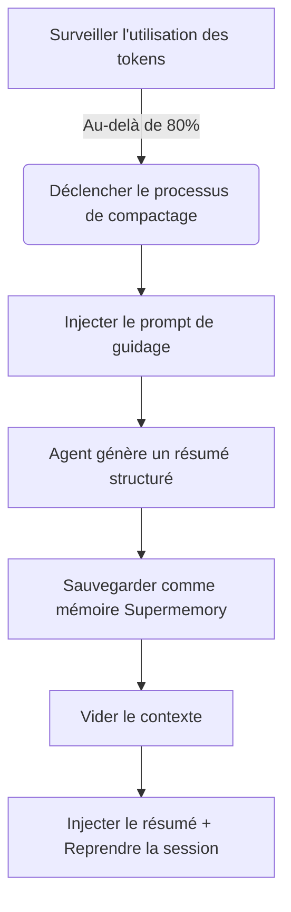

# Principe de compactage préemptif : Empêcher l'oubli du contexte

## Ce que vous pourrez faire après ce cours

Après avoir terminé ce cours, vous serez capable de :
1. **Comprendre** pourquoi l'Agent devient "moins intelligent" lors de longues sessions et comment Supermemory résout ce problème.
2. **Maîtriser** les conditions de déclenchement et le flux de travail du compactage préemptif (Preemptive Compaction).
3. **Configurer** le seuil de compression adapté à votre projet, équilibrant le coût et la qualité de la mémoire.
4. **Vérifier** que la compression fonctionne normalement et voir les résumés de session générés.

## Votre situation actuelle

Lors de la programmation en binôme avec une IA, vous avez peut-être rencontré ces situations :
* **Il oublie au milieu de la conversation** : Au cours d'une longue tâche de refactoring, l'Agent oublie soudainement les règles de dénomination des variables conçues au début.
* **Obligé de redémarrer la session** : La fenêtre de contexte (Context Window) est pleine, l'IDE demande de vider l'historique, entraînant la perte de tout le contexte du travail accompli.
* **Mauvaise qualité du résumé** : La compression automatique ordinaire ne fait que tronquer ou résumer vaguement, perdant les informations clés sur "quoi faire ensuite".

## Quand utiliser cette approche

* Lorsque vous effectuez une **grande refonte** ou un **développement de fonctionnalités complexes**, prévoyant que la session durera longtemps.
* Lorsque le modèle que vous utilisez a une petite fenêtre de contexte (comme 32k/128k), facile à atteindre.
* Lorsque vous souhaitez que l'Agent se souvienne précisément "où nous en sommes" après avoir vidé le contexte.

---

## Idée principale : Préemptif vs Réactif

La gestion traditionnelle du contexte est souvent **réactive** : attendez que le contexte soit complètement plein (100%), puis forcez l'abandon des anciens messages. C'est comme attendre que le disque dur soit plein avant de commencer à supprimer des fichiers, souvent trop tard pour organiser.

Supermemory adopte le **compactage préemptif (Preemptive Compaction)** :

1. **Intervention anticipée** : Déclenche par défaut lorsque l'utilisation des tokens atteint **80%**, réservant suffisamment d'espace pour la réflexion et le résumé.
2. **Guidage structuré** : Au lieu de laisser l'Agent écrire un résumé arbitraire, injectez un prompt spécifique, le forçant à résumer selon le format "objectif-progression-tâches à faire".
3. **Persistance de la mémoire** : Le résumé généré est non seulement utilisé pour la récupération de la session actuelle, mais aussi sauvegardé comme une mémoire de type `conversation`, disponible pour une future récupération.

### Schéma du flux de travail



---

## Détails du mécanisme de déclenchement

Supermemory surveille en temps réel l'utilisation des tokens pour chaque session. Le processus de compactage est déclenché par les trois conditions dures suivantes :

### 1. Seuil d'utilisation des tokens
Par défaut, lorsque le nombre total de tokens (entrée + sortie + cache) dépasse **80%** de la limite du modèle, le compactage se déclenche.

*   **Élément de configuration** : `compactionThreshold`
*   **Valeur par défaut** : `0.80`
*   **Source du code** : [`src/services/compaction.ts`](https://github.com/supermemoryai/opencode-supermemory/blob/main/src/services/compaction.ts#L11)

### 2. Limite minimale de tokens
Pour éviter les déclenchements incorrects dans les sessions courtes (par exemple, le contexte du modèle est très grand, mais seulement quelques phrases échangées), le système a codé en dur une limite inférieure. Seulement lorsque l'utilisation dépasse **50 000 tokens**, le compactage sera envisagé.

*   **Constante** : `MIN_TOKENS_FOR_COMPACTION`
*   **Valeur** : `50 000`
*   **Source du code** : [`src/services/compaction.ts`](https://github.com/supermemoryai/opencode-supermemory/blob/main/src/services/compaction.ts#L12)

### 3. Temps de refroidissement
Pour éviter les déclenchements consécutifs entraînant une boucle infinie, au moins **30 secondes** doivent s'écouler entre deux compactages.

*   **Constante** : `COMPACTION_COOLDOWN_MS`
*   **Valeur** : `30 000` (ms)
*   **Source du code** : [`src/services/compaction.ts`](https://github.com/supermemoryai/opencode-supermemory/blob/main/src/services/compaction.ts#L13)

---

## Modèle de résumé structuré

Lorsque le compactage se déclenche, Supermemory injecte un System Prompt spécial (`[COMPACTION CONTEXT INJECTION]`) dans l'Agent, exigeant que le résumé contienne les 5 sections suivantes :

| Section | Description | Objectif |
| :--- | :--- | :--- |
| **1. User Requests** | Demande originale de l'utilisateur (conservée telle quelle) | Empêcher la dérive des besoins |
| **2. Final Goal** | Objectif final à atteindre | Clarifier l'état final |
| **3. Work Completed** | Travail accompli, fichiers modifiés | Éviter le travail en double |
| **4. Remaining Tasks** | Tâches restantes | Clarifier les prochaines étapes |
| **5. MUST NOT Do** | Choses interdites explicitement, tentatives échouées | Éviter de refaire les mêmes erreurs |

::: details Cliquez pour voir le code source du prompt injecté
```typescript
// src/services/compaction.ts

return `[COMPACTION CONTEXT INJECTION]

When summarizing this session, you MUST include the following sections in your summary:

## 1. User Requests (As-Is)
- List all original user requests exactly as they were stated
...

## 2. Final Goal
...

## 3. Work Completed
...

## 4. Remaining Tasks
...

## 5. MUST NOT Do (Critical Constraints)
...
This context is critical for maintaining continuity after compaction.
`;
```
:::

---

## Suivez-moi : Configuration et vérification

### Étape 1 : Ajuster le seuil de compression (optionnel)

Si vous trouvez que 80% est trop tôt ou trop tard, vous pouvez l'ajuster dans `~/.config/opencode/supermemory.jsonc`.

```jsonc
// ~/.config/opencode/supermemory.jsonc
{
  // ... autres configurations
  "compactionThreshold": 0.90
}
```

::: warning Avertissement de conflit
Si vous avez installé `oh-my-opencode` ou un autre plugin de gestion de contexte, vous **devez désactiver** leur fonction de compression intégrée (comme `context-window-limit-recovery`), sinon cela entraînera une double compression ou un conflit logique.
:::

### Étape 2 : Observer le déclenchement de la compression

Lorsque vous atteignez le seuil dans une longue session, surveillez le toast dans le coin inférieur droit de l'IDE.

**Ce que vous devriez voir** :

1. **Alerte préalable** :
    > "Preemptive Compaction: Context at 81% - compacting with Supermemory context..."
    
    Le système est en train de générer le résumé.

2. **Message de fin** :
    > "Compaction Complete: Session compacted with Supermemory context. Resuming..."
    
    Le contexte a été vidé et le nouveau résumé a été injecté.

### Étape 3 : Vérifier la sauvegarde de la mémoire

Une fois le compactage terminé, le résumé généré est automatiquement sauvegardé dans Supermemory. Vous pouvez le vérifier via le CLI.

**Action** :
Exécutez la commande suivante dans le terminal pour voir les mémoires récentes :

```bash
opencode run supermemory list --scope project --limit 1
```

**Ce que vous devriez voir** :
Une mémoire de type `conversation`, dont le contenu est exactement le résumé structuré.

```json
{
  "id": "mem_123abc",
  "content": "[Session Summary]\n## 1. User Requests\n...",
  "type": "conversation",
  "scope": "opencode_project_..."
}
```

---

## Questions fréquentes (FAQ)

### Q : Pourquoi ma session est-elle longue mais la compression ne se déclenche pas ?
**R** : Vérifiez les points suivants :
1. **Total de tokens** : A-t-il dépassé 50 000 tokens ? (Les sessions courtes ne se déclenchent pas même si le pourcentage est élevé).
2. **Limite du modèle** : OpenCode identifie-t-il correctement la limite de contexte du modèle actuel ? Si l'identification échoue, il reviendra au défaut de 200k, entraînant un calcul de pourcentage faible.
3. **Temps de refroidissement** : Le délai depuis la dernière compression est-il inférieur à 30 secondes ?

### Q : Combien de tokens le résumé compressé occupe-t-il ?
**R** : Cela dépend du niveau de détail du résumé, généralement entre 500 et 2000 tokens. Par rapport au contexte original de 100k+, c'est une économie énorme.

### Q : Puis-je déclencher manuellement la compression ?
**R** : La version actuelle (v1.0) ne prend pas en charge le déclenchement manuel, entièrement géré automatiquement par l'algorithme.

---

## Résumé du cours

Le compactage préemptif est le "secret de l'endurance" de Supermemory. Il transforme le flux de conversation linéaire en instantanés de mémoire raffinés par **l'intervention anticipée** et le **résumé structuré**. Cela résout non seulement le problème du débordement de contexte, mais plus important encore, il permet à l'Agent de continuer sans interruption le travail précédent même après avoir "oublié" (vidé le contexte), en lisant l'instantané.

## Aperçu du prochain cours

> Le prochain cours est **[Détails de la configuration approfondie](../configuration/index.md)**.
>
> Vous apprendrez :
> - Comment personnaliser le chemin de stockage de la mémoire
> - Configurer la limite du nombre de résultats de recherche
> - Ajuster les règles de filtrage de confidentialité

---

## Annexe : Référence du code source

<details>
<summary><strong>Cliquez pour voir les emplacements du code source</strong></summary>

> Date de mise à jour : 2026-01-23

| Fonctionnalité | Chemin du fichier | Lignes |
| :--- | :--- | :--- |
| Définition des constantes de seuil | [`src/services/compaction.ts`](https://github.com/supermemoryai/opencode-supermemory/blob/main/src/services/compaction.ts#L11-L14) | 11-14 |
| Génération du prompt de guidage | [`src/services/compaction.ts`](https://github.com/supermemoryai/opencode-supermemory/blob/main/src/services/compaction.ts#L58-L98) | 58-98 |
| Logique de détection de déclenchement | [`src/services/compaction.ts`](https://github.com/supermemoryai/opencode-supermemory/blob/main/src/services/compaction.ts#L317-L358) | 317-358 |
| Logique de sauvegarde du résumé | [`src/services/compaction.ts`](https://github.com/supermemoryai/opencode-supermemory/blob/main/src/services/compaction.ts#L294-L315) | 294-315 |
| Définition des éléments de configuration | [`src/config.ts`](https://github.com/supermemoryai/opencode-supermemory/blob/main/src/config.ts#L22) | 22 |

**Constantes clés** :
- `DEFAULT_THRESHOLD = 0.80` : Seuil de déclenchement par défaut
- `MIN_TOKENS_FOR_COMPACTION = 50_000` : Nombre minimum de tokens pour le déclenchement
- `COMPACTION_COOLDOWN_MS = 30_000` : Temps de refroidissement (millisecondes)

</details>
