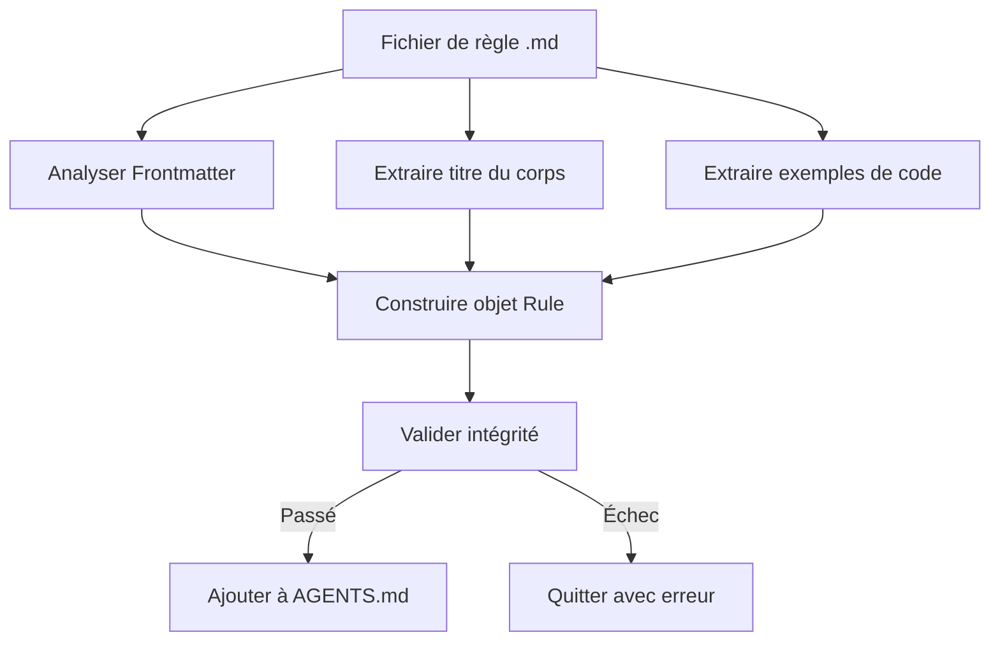

# Rédaction de règles de bonnes pratiques React

## Ce que vous apprendrez

- Rédiger des règles d'optimisation des performances React conformes aux normes Agent Skills à partir de zéro
- Utiliser le modèle _template.md pour créer rapidement des fichiers de règles
- Sélectionner correctement le niveau d'impact (CRITICAL/HIGH/MEDIUM) pour classer les règles
- Rédiger des exemples de code comparant Incorrect/Correct de manière claire et compréhensible
- Valider l'intégrité des règles via `pnpm validate`

## Votre situation actuelle

Vous avez déjà audité du code avec la bibliothèque de règles d'optimisation des performances React d'Agent Skills et vous avez découvert que certains motifs d'optimisation n'étaient pas couverts. Vous souhaitez contribuer vos propres règles, mais :

- Vous ne savez pas quel format utiliser pour les fichiers de règles
- Vous n'êtes pas sûr du niveau d'impact à choisir
- Les exemples de code que vous rédigez ne sont pas conformes aux normes, provoquant des échecs de validation
- Vous craignez que les règles soient rejetées ou ne puissent pas être correctement analysées

## Quand utiliser cette méthode

Scénarios adaptés à la rédaction de règles :

- Vous avez découvert un problème de performance dans votre projet et souhaitez le formaliser en règle réutilisable
- Votre équipe dispose de motifs d'optimisation React spécifiques que vous souhaitez voir appliqués par l'Agent
- Vous avez appris de nouvelles techniques depuis la documentation React officielle ou l'équipe d'ingénierie de Vercel et souhaitez les partager avec la communauté

Scénarios inadaptés :

- Problèmes simples de style de code (utilisez les règles ESLint)
- Suggestions fonctionnelles sans lien avec les performances (utilisez la documentation ou des commentaires)

## Approche principale

Les fichiers de règles sont au format Markdown, suivant une **structure en trois parties** :

1. **Frontmatter** : Métadonnées de la règle (title, impact, tags)
2. **Titre du corps** : Nom d'affichage de la règle et description de l'impact
3. **Exemples de code** : Comparaison via `**Incorrect:**` et `**Correct:**`



**Concepts clés** :

::: info Niveau d'impact (Impact Level)
L'impact détermine la position de la règle dans la documentation. Niveaux du plus élevé au plus bas :
- **CRITICAL** : Goulots d'étranglement critiques (éliminer les cascades, optimisation des bundles)
- **HIGH** : Améliorations importantes (performances côté serveur)
- **MEDIUM-HIGH** : Priorité moyenne-élevée (récupération de données côté client)
- **MEDIUM** : Améliorations moyennes (optimisation des re-rendus)
- **LOW-MEDIUM** : Priorité faible-moyenne (micro-optimisations JavaScript)
- **LOW** : Améliorations incrémentales (motifs avancés)
:::

::: info Convention de nommage kebab-case
Les noms de fichiers doivent utiliser des lettres minuscules séparées par des tirets, comme `async-parallel.md`. Le préfixe du nom de fichier (la partie avant le premier `-`) détermine la section de la règle :
- `async-*` → Chapitre 1 (Éliminer les cascades)
- `bundle-*` → Chapitre 2 (Optimisation des bundles)
- `rerender-*` → Chapitre 5 (Optimisation des re-rendus)
:::

## 🎒 Avant de commencer

::: warning Vérifications préalables
- Avoir terminé [Bien démarrer avec Agent Skills](../../start/getting-started/)
- Comprendre les concepts de base de la performance React (re-render, waterfall, bundle, etc.)
- Avoir cloné le dépôt : `cd source/vercel-labs/agent-skills`
- Avoir installé les dépendances : `pnpm install`
:::

## Suivez-moi

### Étape 1 : Copier le fichier modèle

**Pourquoi**
Utiliser un modèle garantit un format correct et évite d'oublier des champs obligatoires.

**Action** :

```bash
cd skills/react-best-practices/rules
cp _template.md my-new-rule.md
```

**Ce que vous devriez voir** : Le fichier `my-new-rule.md` a été créé avec le même contenu que le modèle.

### Étape 2 : Rédiger les métadonnées Frontmatter

**Pourquoi**
Le frontmatter définit le titre de la règle, son niveau d'impact et ses étiquettes de classification. C'est la première barrière de l'analyseur.

**Modifiez la partie frontmatter du fichier `my-new-rule.md`** :

```yaml
---
title: Use React.lazy for Code Splitting
impact: CRITICAL
impactDescription: 50-70% reduction in initial bundle
tags: bundle, code-splitting, lazy-loading, performance
---
```

**Description des champs** :

| Champ | Obligatoire | Description | Exemple |
|---|---|---|---|
| `title` | ✅ | Titre court de la règle | `Promise.all() for Independent Operations` |
| `impact` | ✅ | Niveau d'impact (6 valeurs d'énumération) | `CRITICAL` / `HIGH` / `MEDIUM` etc. |
| `impactDescription` | ⭕ | Description de l'amplitude de l'impact | `2-10× improvement` |
| `tags` | ⭕ | Étiquettes séparées par des virgules | `async, parallelization, promises` |

**Ce que vous devriez voir** : Le frontmatter est mis à jour avec votre contenu.

### Étape 3 : Compléter le titre du corps et la description

**Pourquoi**
Le titre du corps s'affiche dans la documentation finale. La section de description aide l'utilisateur à comprendre la signification de la règle.

**Ajoutez le corps après le frontmatter**

```markdown
## Use React.lazy for Code Splitting

**Impact: CRITICAL (50-70% reduction in initial bundle)**

Code split large components using `React.lazy()` to reduce the initial bundle size. Components are loaded on-demand when needed.
```

**Points clés de rédaction** :

- Le titre H2 utilise le `title` du frontmatter
- La ligne **Impact:** utilise le format `**Impact: LEVEL (description)**`
- Brève explication du but de la règle et de ses gains de performance

### Étape 4 : Rédiger les exemples Incorrect et Correct

**Pourquoi**
Les exemples comparés sont le cœur de la règle. Ils montrent directement le « code problématique » et la « bonne pratique ».

**Ajoutez les exemples de code après le corps**

````markdown
**Incorrect (loads entire bundle on initial page):**

```typescript
import HeavyChart from './HeavyChart'

function Dashboard() {
  return <HeavyChart />
}
```

**Correct (loads on-demand when needed):**

```typescript
import { lazy, Suspense } from 'react'

const HeavyChart = lazy(() => import('./HeavyChart'))

function Dashboard() {
  return (
    <Suspense fallback={<LoadingSpinner />}>
      <HeavyChart />
    </Suspense>
  )
}
```
````

**Spécifications de rédaction des exemples** :

| Exigence | Description |
|---|---|
| **Format d'étiquette** | `**Incorrect:**` ou `**Incorrect (description):**` (parenthèses optionnelles) |
| **Contenu parenthèses** | Optionnel, brève description de pourquoi c'est faux/pourquoi c'est correct |
| **Bloc de code** | Utilisez `\`\`\`typescript` ou `\`\`\`tsx` |
| **Nombre d'exemples** | Au moins un exemple de type bad ou good |

**Ce que vous devriez voir** : Les blocs de code s'affichent correctement avec la coloration syntaxique.

### Étape 5 : Ajouter des références (optionnel)

**Pourquoi**
Les références fournissent des sources fiables pour la règle, renforçant la crédibilité.

**Ajoutez à la fin du fichier**

```markdown
Reference: [React.lazy and Suspense](https://react.dev/reference/react/lazy)
```

**Formats pris en charge** :

```markdown
Reference: [lien](URL)

### Références multiples
References:
- [Documentation React.lazy](https://react.dev/reference/react/lazy)
- [Code splitting patterns](https://web.dev/code-splitting-suspense/)
```

### Étape 6 : Valider le fichier de règles

**Pourquoi**
`pnpm validate` vérifie l'intégrité de la règle et s'assure qu'elle peut être correctement analysée.

**Exécutez la commande de validation**

```bash
cd packages/react-best-practices-build
pnpm validate
```

**Ce que vous devriez voir** :

```bash
Validating rule files...
✓ All 58 rule files are valid
```

Si la validation échoue, vous verrez des informations d'erreur détaillées :

```bash
✗ Validation failed:

  my-new-rule.md: Missing or empty title
```

**Erreurs de validation courantes** :

| Message d'erreur | Raison | Solution |
|---|---|---|
| `Missing or empty title` | Champ `title` manquant dans le frontmatter | Ajoutez `title: Votre Titre` |
| `Missing examples (need at least one bad and one good example)` | Tableau examples vide | Ajoutez au moins un exemple (avec bloc de code) |
| `Missing code examples` | Exemple avec étiquette mais sans code | Ajoutez un bloc de code (`\`\`\`typescript`) après l'étiquette |
| `Missing bad/incorrect or good/correct examples` | Pas de mots-clés bad/good/incorrect/correct dans les étiquettes | Utilisez des étiquettes légales comme `**Incorrect:**`, `**Correct:**`, `**Example:**` |
| `Invalid impact level: &lt;value&gt;...` | Valeur `impact` non dans l'énumération | Utilisez tout en majuscules : `CRITICAL`/`HIGH`/`MEDIUM-HIGH`/`MEDIUM`/`LOW-MEDIUM`/`LOW` |
| `Failed to parse` | Erreur de format Markdown | Vérifiez que le frontmatter est entouré de `---` |

### Étape 7 : Construire et voir le résultat

**Pourquoi**
`pnpm build` compilera toutes les règles dans `AGENTS.md`, vous permettant de voir l'effet de rendu de la règle dans la documentation.

**Exécutez la commande de construction**

```bash
pnpm build
```

**Ce que vous devriez voir** :

```bash
Building rules...
Validating rule files...
✓ All 58 rule files are valid
✓ Built 8 sections with 58 rules
✓ Generated test-cases.json with 172 test cases
```

**Voir le document généré**

```bash
cat skills/react-best-practices/AGENTS.md
```

**Ce que vous devriez voir** : Votre nouvelle règle apparaît dans la section correspondante, au format :

```markdown
### 2.1 Use React.lazy for Code Splitting

**Impact: CRITICAL (50-70% reduction in initial bundle)**

Code split large components using `React.lazy()` to reduce...
```

## Points de contrôle ✅

Confirmez que vous avez terminé les opérations suivantes :

- [ ] Copié `_template.md` et renommé en `my-new-rule.md`
- [ ] Le frontmatter contient `title`, `impact`, `impactDescription`, `tags`
- [ ] Le titre du corps correspond au `title` du frontmatter
- [ ] Au moins un exemple de code Incorrect ou Correct inclus
- [ ] `pnpm validate` passe la validation
- [ ] `pnpm build` génère avec succès AGENTS.md

## Pièges à éviter

#### Erreur courante 1 : Erreur d'orthographe du niveau d'impact

```yaml
# ❌ Erreur : lettres minuscules causant l'échec de validation
# impact: critical

# ✅ Correct : utiliser tout en majuscules (doit être tout en majuscules)
impact: CRITICAL
```

**Raison** : La définition de type `ImpactLevel` n'accepte que les valeurs d'énumération tout en majuscules (`types.ts:5`).

#### Erreur courante 2 : Erreur de préfixe de nom de fichier

```bash
# ❌ Erreur : préfixe non dans sectionMap causant l'échec d'inférence
# use-react-lazy.md  # préfixe est "use", impossible d'inférer la section

# ✅ Correct : utiliser l'un des 8 préfixes standard
bundle-lazy-loading.md  # préfixe est "bundle", appartient au chapitre 2
```

**Raison** : L'analyseur infère la section depuis le préfixe du nom de fichier (`parser.ts:201-210`). Si le préfixe ne correspond pas à `sectionMap`, la règle sera classée dans le chapitre 0.

#### Erreur courante 3 : Frontmatter non fermé

```markdown
---
title: My Rule
impact: MEDIUM
# ❌ Manque la fin ---

## My Rule
```

**Raison** : Le frontmatter doit être entouré de `---` (`parser.ts:42`).

#### Erreur courante 4 : Format d'étiquette d'exemple erroné

````markdown
# ❌ Erreur : manque les deux-points
# **Incorrect**

```typescript
const bad = code
```

# ✅ Correct : doit avoir des deux-points
# **Incorrect:**

```typescript
const bad = code
```

# ✅ Description entre parenthèses (recommandé)
# **Incorrect (raison pourquoi c'est faux):**

```typescript
const bad = code
```
````

**Raison** : L'analyseur correspond aux étiquettes via l'expression régulière `^\*\*([^:]+?):\*?\*?$` (`parser.ts:125`). Les deux-points sont obligatoires, mais la description entre parenthèses est optionnelle.

## Résumé de la leçon

La rédaction de fichiers de règles suit une approche **basée sur les modèles**, dont le cœur est :

1. **Frontmatter** définit les métadonnées (title, impact, tags)
2. **Corps** contient le titre, la description de l'impact et les exemples de code
3. **Exemples** utilisent les étiquettes `**Incorrect:**` et `**Correct:**`
4. **Validation** via `pnpm validate` assure que le format est correct

Retenez ces 5 points :
- ✅ Utilisez `_template.md` comme point de départ
- ✅ Les niveaux d'impact sont en majuscules (CRITICAL/HIGH/MEDIUM)
- ✅ Le préfixe du nom de fichier détermine l'appartenance au chapitre (async-/bundle-/rerender- etc.)
- ✅ Format des étiquettes d'exemple : `**Incorrect (description):**`
- ✅ Exécutez `pnpm validate` avant soumission

## Aperçu de la prochaine leçon

> Dans la prochaine leçon, nous apprendrons **[Utilisation de la chaîne d'outils de construction](../build-toolchain/)**.
>
> Vous apprendrez :
> - Comment `pnpm build` compile la documentation des règles
> - Comment `pnpm extract-tests` extrait les cas de test
> - Comment configurer GitHub Actions pour une validation automatique
> - Le fonctionnement de l'évaluation automatique par LLM

---

## Annexe : Référence du code source

<details>
<summary><strong>Cliquez pour développer et voir l'emplacement du code source</strong></summary>

> Dernière mise à jour : 2026-01-25

| Fonction | Chemin du fichier | Ligne |
|---|---|---|
| Fichier modèle de règles | [`skills/react-best-practices/rules/_template.md`](https://github.com/vercel-labs/agent-skills/blob/main/skills/react-best-practices/rules/_template.md) | 1-29 |
| Définition des types de règles | [`packages/react-best-practices-build/src/types.ts`](https://github.com/vercel-labs/agent-skills/blob/main/packages/react-best-practices-build/src/types.ts) | 5-26 |
| Logique de validation des règles | [`packages/react-best-practices-build/src/validate.ts`](https://github.com/vercel-labs/agent-skills/blob/main/packages/react-best-practices-build/src/validate.ts) | 21-66 |
| Analyse Frontmatter | [`packages/react-best-practices-build/src/parser.ts`](https://github.com/vercel-labs/agent-skills/blob/main/packages/react-best-practices-build/src/parser.ts) | 42-63 |
| Mappage des sections (inférence de section) | [`packages/react-best-practices-build/src/parser.ts`](https://github.com/vercel-labs/agent-skills/blob/main/packages/react-best-practices-build/src/parser.ts) | 201-210 |
| Extraction des exemples de code | [`packages/react-best-practices-build/src/parser.ts`](https://github.com/vercel-labs/agent-skills/blob/main/packages/react-best-practices-build/src/parser.ts) | 130-194 |
| Fichier de définition des sections | [`skills/react-best-practices/rules/_sections.md`](https://github.com/vercel-labs/agent-skills/blob/main/skills/react-best-practices/rules/_sections.md) | 1-47 |

**Définitions de types clés** :

```typescript
export type ImpactLevel = 'CRITICAL' | 'HIGH' | 'MEDIUM-HIGH' | 'MEDIUM' | 'LOW-MEDIUM' | 'LOW'

export interface Rule {
  id: string
  title: string
  section: number // 1-8
  impact: ImpactLevel
  explanation: string
  examples: CodeExample[]
  references?: string[]
  tags?: string[]
}
```

**Règles de validation clés** :

- title non vide (`validate.ts:26-28`)
- Nombre d'exemples ≥ 1 (`validate.ts:34-58`)
- impact doit être une valeur d'énumération valide (`validate.ts:60-63`)

**Mappage des sections** (préfixe nom de fichier → ID section) :

```typescript
const sectionMap: Record<string, number> = {
  async: 1,      // Éliminer les cascades
  bundle: 2,     // Optimisation des bundles
  server: 3,     // Performances côté serveur
  client: 4,     // Récupération de données côté client
  rerender: 5,   // Optimisation des re-rendus
  rendering: 6,  // Performance de rendu
  js: 7,         // Performance JavaScript
  advanced: 8,   // Motifs avancés
}
```

</details>
