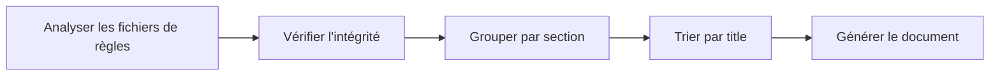

# Architecture et détails d'implémentation

## Ce que vous pourrez faire après ce cours

- Comprendre le principe de fonctionnement de la chaîne d'outils de construction d'Agent Skills
- Maîtriser la logique principale de l'analyse des fichiers de règles
- Découvrir le système de types et la conception du flux de données
- Apprendre les détails d'implémentation de l'algorithme de détection de framework

## Vue d'ensemble de l'architecture principale

Agent Skills se compose de trois parties principales :

**1. Chaîne d'outils de construction** (`packages/react-best-practices-build/`)
- Analyse des fichiers de règles
- Génération d'AGENTS.md
- Extraction des cas de test

**2. Fichiers de règles** (`skills/react-best-practices/rules/`)
- 57 règles d'optimisation des performances React
- Format Markdown, respectant les spécifications de modèle

**3. Scripts de déploiement** (`skills/claude.ai/vercel-deploy-claimable/`)
- Déploiement en un clic vers Vercel
- Détection automatique de framework

::: info Pourquoi comprendre l'architecture ?
Si vous utilisez simplement Agent Skills, vous n'aurez peut-être pas besoin de comprendre ces détails en profondeur. Mais si vous voulez :
- Développer des compétences personnalisées
- Écrire de nouvelles règles d'optimisation des performances
- Dépanner les problèmes de construction ou de déploiement

Comprendre l'architecture sera très utile.
:::

## Détails du processus de construction

Le processus de construction compile les fichiers de règles dispersés en document AGENTS.md lisible par AIAgent. Le processus se déroule en cinq étapes :



### Étape 1 : Analyser les fichiers de règles (parse)

Chaque fichier de règles (`.md`) est analysé en objet `Rule` via la fonction `parseRuleFile()`.

**Ordre d'analyse** (emplacement du code source : `parser.ts:18-238`) :

1. **Extraire le Frontmatter** (si présent)
   - Analyser les métadonnées au format YAML
   - Champs pris en charge : `title`, `impact`, `tags`, `section`, `explanation`, `references`

2. **Extraire le titre**
   - Rechercher le premier titre `##` ou `###`
   - Si le Frontmatter n'a pas de title, utiliser le contenu ici

3. **Extraire l'Impact**
   - Correspondre à la ligne `**Impact:**`
   - Format : `**Impact:** CRITICAL (2-10× improvement)`
   - Extraire le niveau et la description

4. **Extraire les exemples de code**
   - Rechercher les marqueurs `**Label:**` (comme `**Incorrect:**`, `**Correct:**`)
   - Collecter les blocs de code suivants
   - Capturer les notes supplémentaires après le bloc de code

5. **Extraire les références**
   - Rechercher les lignes `Reference:` ou `References:`
   - Analyser les liens Markdown `[text](url)`

6. **Déduire la Section**
   - Extraire à partir du préfixe de nom de fichier (emplacement du code source : `parser.ts:201-210`)
   - Table de correspondance :
     - `async-*` → Section 1 (Éliminer les cascades)
     - `bundle-*` → Section 2 (Optimisation du bundle)
     - `server-*` → Section 3 (Performance serveur)
     - `client-*` → Section 4 (Récupération de données côté client)
     - `rerender-*` → Section 5 (Optimisation du re-render)
     - `rendering-*` → Section 6 (Performance de rendu)
     - `js-*` → Section 7 (Performance JavaScript)
     - `advanced-*` → Section 8 (Modes avancés)

### Étape 2 : Vérifier l'intégrité (validate)

La logique de vérification est implémentée dans `validate.ts`, garantissant que les fichiers de règles respectent les spécifications.

**Éléments de vérification** :

| Élément de vérification | Description | Sortie en cas d'échec |
|--- | --- | ---|
| Title non vide | Doit avoir un titre (Frontmatter ou titre `##`) | `Missing or empty title` |
| Au moins un exemple | Le tableau `examples` ne doit pas être vide | `At least one code example required` |
| Impact valide | Doit être une valeur d'énumération `ImpactLevel` valide | `Invalid impact level` |
| Code non vide | Chaque exemple doit avoir du contenu de code | `Empty code block` |

### Étape 3 : Grouper par Section (group)

Toutes les règles sont regroupées par section, chaque section contient :

- `number` : numéro de section (1-8)
- `title` : titre de la section (lu depuis `_sections.md`)
- `impact` : niveau d'impact global
- `introduction` : introduction à la section (optionnel)
- `rules[]` : tableau des règles incluses

(emplacement du code source : `build.ts:156-169`)

### Étape 4 : Trier par Title (sort)

Les règles de chaque section sont triées par ordre alphabétique de titre.

**Règles de tri** (emplacement du code source : `build.ts:172-175`) :
```typescript
section.rules.sort((a, b) =>
  a.title.localeCompare(b.title, 'en-US', { sensitivity: 'base' })
)
```

Utilise la locale `en-US` pour garantir un tri cohérent entre environnements.

**Attribuer les ID** (emplacement du code source : `build.ts:178-180`) :
```typescript
section.rules.forEach((rule, index) => {
  rule.id = `${section.number}.${index + 1}`
  rule.subsection = index + 1
})
```

Après le tri, les ID sont attribués, comme `1.1`, `1.2`...

### Étape 5 : Générer le document (generate)

La fonction `generateMarkdown()` convertit le tableau `Section[]` en document Markdown.

**Structure de sortie** (emplacement du code source : `build.ts:29-126`) :

```markdown
# React Best Practices
**Version 1.0**
Vercel Engineering
January 25, 2026

## Abstract
...

## Table of Contents
1. Éliminer les cascades - CRITICAL
   - 1.1 [Requêtes parallèles](#11-parallel-requests)
   - 1.2 [Defer Await](#12-defer-await)
...

## 1. Éliminer les cascades
**Impact: CRITICAL**

### 1.1 Requêtes parallèles
**Impact: CRITICAL**

**Incorrect:**
```typescript
// code
```
```

## Détails de l'analyseur de règles

### Analyse du Frontmatter

Le Frontmatter est un bloc YAML au début du fichier Markdown :

```markdown
---
title: Requêtes parallèles
impact: CRITICAL
impactDescription: 2-10× improvement
tags: async, waterfall
---
```

**Logique d'analyse** (emplacement du code source : `parser.ts:28-41`) :
- Détecte le début `---` et la fin du deuxième `---`
- Divise les paires clé-valeur par `:`
- Supprime les guillemets
- Stocke dans l'objet `frontmatter`

### Analyse des exemples de code

Chaque règle contient plusieurs exemples de code, marqués par `**Label:**`.

**Machine d'état d'analyse** (emplacement du code source : `parser.ts:66-188`) :

```
État initial → Lire **Label:** → currentExample.label = "label"
            → Lire ``` → inCodeBlock = true, collecter le code
            → Lire ``` → inCodeBlock = false, currentExample.code = code collecté
            → Lire texte → Si afterCodeBlock, stocker dans additionalText
            → Lire **Reference:** → Pousser currentExample dans examples[]
```

**Types de Label pris en charge** :
- `Incorrect` : exemple incorrect
- `Correct` : exemple correct
- `Example` : exemple générique
- `Usage` : exemple d'utilisation
- `Implementation` : exemple d'implémentation

**Capture des notes supplémentaires** (emplacement du code source : `parser.ts:182-186`) :
```typescript
// Texte après un bloc de code, ou texte dans une section sans bloc de code
// (ex. "When NOT to use this pattern:" avec des puces au lieu de code)
else if (currentExample && (afterCodeBlock || !hasCodeBlockForCurrentExample)) {
  additionalText.push(line)
}
```

Cela prend en charge l'ajout de notes supplémentaires après les blocs de code, ou des exemples en texte pur (comme des listes).

### Analyse des références

Les références se trouvent à la fin du fichier, au format :

```markdown
Reference: [React文档](https://react.dev), [Next.js指南](https://nextjs.org/docs)
```

**Logique d'analyse** (emplacement du code source : `parser.ts:154-174`) :
- Correspondance regex du modèle `[text](url)`
- Extrait toutes les URL dans le tableau `references[]`

## Système de types

Les définitions de types se trouvent dans `types.ts` (emplacement du code source : `types.ts:1-54`).

### Énumération ImpactLevel

```typescript
export type ImpactLevel =
  | 'CRITICAL'
  | 'HIGH'
  | 'MEDIUM'
  | 'LOW'
```

**Description des niveaux** :

| Niveau | Impact | Règle d'exemple |
|--- | --- | ---|
| CRITICAL | Goulot d'étranglement critique, doit être corrigé | async-parallel |
| HIGH | Amélioration importante, recommandé en priorité | server-cache-react |
| MEDIUM-HIGH | Priorité moyenne-élevée | client-data-fetch |
| MEDIUM | Amélioration moyenne | rerender-memo |
| LOW-MEDIUM | Priorité basse-moyenne | js-use-memo |
| LOW | Amélioration incrémentale, optionnel | advanced-suspense-boundaries |

### Interface Rule

```typescript
export interface Rule {
  id: string                    // Généré automatiquement, comme "1.1"
  title: string                 // Titre de la règle
  section: number              // Section d'appartenance (1-8)
  subsection?: number          // Numéro de sous-section
  impact: ImpactLevel          // Niveau d'impact
  impactDescription?: string  // Description de l'impact, comme "2-10× improvement"
  explanation: string          // Explication de la règle
  examples: CodeExample[]      // Tableau d'exemples de code
  references?: string[]        // Liens de référence
  tags?: string[]              // Tags
}
```

### Interface CodeExample

```typescript
export interface CodeExample {
  label: string              // "Incorrect", "Correct", "Example"
  description?: string       // Description de l'étiquette (optionnel)
  code: string              // Contenu du code
  language?: string         // Langage du code, par défaut typescript
  additionalText?: string   // Notes supplémentaires après le code
}
```

### Interface Section

```typescript
export interface Section {
  number: number              // Numéro de section (1-8)
  title: string              // Titre de la section
  impact: ImpactLevel        // Niveau d'impact global
  impactDescription?: string // Description de l'impact
  introduction?: string      // Introduction à la section
  rules: Rule[]             // Règles incluses
}
```

### Interface GuidelinesDocument

```typescript
export interface GuidelinesDocument {
  version: string          // Numéro de version, comme "1.0"
  organization: string     // Nom de l'organisation
  date: string            // Date
  abstract: string        // Résumé
  sections: Section[]     // Sections
  references?: string[]   // Références globales
}
```

### Interface TestCase

Cas de test pour l'évaluation automatique par LLM.

```typescript
export interface TestCase {
  ruleId: string          // ID de règle, comme "1.1"
  ruleTitle: string       // Titre de la règle
  type: 'bad' | 'good'   // Type d'exemple
  code: string           // Contenu du code
  language: string       // Langage du code
  description?: string   // Description
}
```

## Mécanisme d'extraction des cas de test

La fonction d'extraction de cas de test convertit les exemples de code des règles en cas de test évaluables, utilisés pour l'évaluation automatique de la conformité aux règles par LLM.

### Logique d'extraction (emplacement du code source : `extract-tests.ts:15-38`)

```typescript
function extractTestCases(rule: Rule): TestCase[] {
  const testCases: TestCase[] = []

  rule.examples.forEach((example, index) => {
    const isBad = example.label.toLowerCase().includes('incorrect') ||
                  example.label.toLowerCase().includes('wrong') ||
                  example.label.toLowerCase().includes('bad')
    const isGood = example.label.toLowerCase().includes('correct') ||
                   example.label.toLowerCase().includes('good')

    if (isBad || isGood) {
      testCases.push({
        ruleId: rule.id,
        ruleTitle: rule.title,
        type: isBad ? 'bad' : 'good',
        code: example.code,
        language: example.language || 'typescript',
        description: example.description || `${example.label} example for ${rule.title}`
      })
    }
  })

  return testCases
}
```

**Types d'exemples pris en charge** :
- `Incorrect` / `Wrong` / `Bad` → type = 'bad'
- `Correct` / `Good` → type = 'good'

**Fichier de sortie** : `test-cases.json`

**Structure de données** :
```json
[
  {
    "ruleId": "1.1",
    "ruleTitle": "Requêtes parallèles",
    "type": "bad",
    "code": "const data = await fetch(url);\nconst result = await process(data);",
    "language": "typescript",
    "description": "Incorrect example for Requêtes parallèles"
  },
  {
    "ruleId": "1.1",
    "ruleTitle": "Requêtes parallèles",
    "type": "good",
    "code": "const [data, processed] = await Promise.all([\n  fetch(url),\n  process(data)\n]);",
    "language": "typescript",
    "description": "Correct example for Requêtes parallèles"
  }
]
```

**Statistiques** (emplacement du code source : `extract-tests.ts:68-70`) :
```bash
✓ Extracted 120 test cases to test-cases.json
  - Bad examples: 60
  - Good examples: 60
```

## Détection de framework des scripts de déploiement

Les scripts de déploiement Vercel prennent en charge la détection automatique de plus de 40 frameworks.

### Logique de détection (emplacement du code source : `deploy.sh:12-156`)

```bash
detect_framework() {
    local pkg_json="$1"
    local content=$(cat "$pkg_json")

    has_dep() {
        echo "$content" | grep -q "\"$1\""
    }

    # Vérifier les dépendances, dans l'ordre de priorité
    if has_dep "blitz"; then echo "blitzjs"; return; fi
    if has_dep "next"; then echo "nextjs"; return; fi
    if has_dep "gatsby"; then echo "gatsby"; return; fi
    # ... plus de détection de frameworks
}
```

**Ordre de détection** :
- Du spécial au général
- Vérifier `dependencies` et `devDependencies`
- Utiliser `grep -q` pour une correspondance rapide

### Frameworks pris en charge

| Catégorie | Liste des frameworks | Mots-clés de détection |
|--- | --- | ---|
| React | Next.js, Gatsby, Create React App, Remix, React Router, Blitz | `next`, `gatsby`, `remix-run` |
| Vue | Nuxt, Vitepress, Vuepress, Gridsome | `nuxt`, `vitepress` |
| Svelte | SvelteKit, Svelte, Sapper | `@sveltejs/kit`, `svelte` |
| Angular | Angular, Ionic Angular | `@angular/core` |
| Node.js Backend | Express, Hono, Fastify, NestJS, Elysia, h3, Nitro | `express`, `hono`, `nestjs` |
| Outils de construction | Vite, Parcel | `vite`, `parcel` |
| HTML statique | Pas de package.json | Retourne `null` |

### Traitement des projets HTML statiques (emplacement du code source : `deploy.sh:192-206`)

Les projets HTML statiques (sans `package.json`) nécessitent un traitement spécial :

```bash
if [ ! -f "$PROJECT_PATH/package.json" ]; then
  # Rechercher les fichiers HTML dans le répertoire racine
  HTML_FILES=$(find "$PROJECT_PATH" -maxdepth 1 -name "*.html" -type f)
  HTML_COUNT=$(echo "$HTML_FILES" | grep -c . || echo 0)

  # S'il n'y a qu'un seul fichier HTML et qu'il n'est pas index.html, le renommer en index.html
  if [ "$HTML_COUNT" -eq 1 ]; then
    HTML_FILE=$(echo "$HTML_FILES" | head -1)
    BASENAME=$(basename "$HTML_FILE")
    if [ "$BASENAME" != "index.html" ]; then
      echo "Renaming $BASENAME to index.html..." >&2
      mv "$HTML_FILE" "$PROJECT_PATH/index.html"
    fi
  fi
fi
```

**Pourquoi renommer ?**
Vercel recherche par défaut `index.html` comme fichier d'entrée pour les sites statiques.

### Processus de déploiement (emplacement du code source : `deploy.sh:158-249`)

```bash
# 1. Analyser les paramètres
INPUT_PATH="${1:-.}"

# 2. Créer un répertoire temporaire
TEMP_DIR=$(mktemp -d)

# 3. Détecter le framework
FRAMEWORK=$(detect_framework "$PROJECT_PATH/package.json")

# 4. Créer un tarball (excluant node_modules et .git)
tar -czf "$TARBALL" -C "$PROJECT_PATH" --exclude='node_modules' --exclude='.git' .

# 5. Téléverser vers l'API
RESPONSE=$(curl -s -X POST "$DEPLOY_ENDPOINT" -F "file=@$TARBALL" -F "framework=$FRAMEWORK")

# 6. Analyser la réponse
PREVIEW_URL=$(echo "$RESPONSE" | grep -o '"previewUrl":"[^"]*"' | cut -d'"' -f4)
CLAIM_URL=$(echo "$RESPONSE" | grep -o '"claimUrl":"[^"]*"' | cut -d'"' -f4)

# 7. Sortir les résultats
echo "Preview URL: $PREVIEW_URL"
echo "Claim URL:   $CLAIM_URL"
echo "$RESPONSE"  # Format JSON pour utilisation par programme
```

**Gestion des erreurs** (emplacement du code source : `deploy.sh:224-239`) :
```bash
if echo "$RESPONSE" | grep -q '"error"'; then
  ERROR_MSG=$(echo "$RESPONSE" | grep -o '"error":"[^"]*"' | cut -d'"' -f4)
  echo "Error: $ERROR_MSG" >&2
  exit 1
fi

if [ -z "$PREVIEW_URL" ]; then
  echo "Error: Could not extract preview URL from response" >&2
  exit 1
fi
```

## Prochaines étapes

Après avoir compris l'architecture, vous pouvez :

- [Développer des compétences personnalisées](../../advanced/skill-development/)
- [Rédiger des règles React de meilleures pratiques](../../advanced/rule-authoring/)
- [Consulter l'API et la référence des commandes](../reference/)

## Annexe : Référence du code source

<details>
<summary><strong>Cliquez pour voir les emplacements du code source</strong></summary>

> Dernière mise à jour : 2026-01-25

| Fonctionnalité | Chemin de fichier | Ligne |
|--- | --- | ---|
| Système de types | [`packages/react-best-practices-build/src/types.ts`](https://github.com/vercel-labs/agent-skills/blob/main/packages/react-best-practices-build/src/types.ts) | 1-54 |
| Configuration de chemin | [`packages/react-best-practices-build/src/config.ts`](https://github.com/vercel-labs/agent-skills/blob/main/packages/react-best-practices-build/src/config.ts) | 1-18 |
| Analyseur de règles | [`packages/react-best-practices-build/src/parser.ts`](https://github.com/vercel-labs/agent-skills/blob/main/packages/react-best-practices-build/src/parser.ts) | 18-238 |
| Script de construction | [`packages/react-best-practices-build/src/build.ts`](https://github.com/vercel-labs/agent-skills/blob/main/packages/react-best-practices-build/src/build.ts) | 131-287 |
| Extraction de cas de test | [`packages/react-best-practices-build/src/extract-tests.ts`](https://github.com/vercel-labs/agent-skills/blob/main/packages/react-best-practices-build/src/extract-tests.ts) | 15-38 |
| Détection de framework de scripts de déploiement | [`skills/claude.ai/vercel-deploy-claimable/scripts/deploy.sh`](https://github.com/vercel-labs/agent-skills/blob/main/skills/claude.ai/vercel-deploy-claimable/scripts/deploy.sh) | 12-156 |

**Constantes clés** :
- Valeurs d'énumération `ImpactLevel` : CRITICAL, HIGH, MEDIUM-HIGH, MEDIUM, LOW-MEDIUM, LOW (`types.ts:5`)
- `SKILL_DIR` : chemin du répertoire des compétences (`config.ts:11`)
- `RULES_DIR` : répertoire des fichiers de règles (`config.ts:13`)
- `DEPLOY_ENDPOINT` : `https://claude-skills-deploy.vercel.com/api/deploy` (`deploy.sh:9`)

**Fonctions clés** :
- `parseRuleFile()`: analyse les fichiers de règles Markdown en objets Rule (`parser.ts:18`)
- `extractTestCases()`: extrait les cas de test à partir des règles (`extract-tests.ts:15`)
- `generateMarkdown()`: génère le document Markdown à partir de Section[] (`build.ts:29`)
- `detect_framework()`: détecte le framework du projet (`deploy.sh:12`)

</details>
