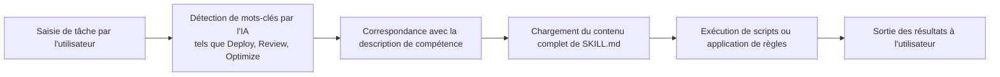

# Agent Skills 101

## Ce que vous pourrez faire après ce cours

- Comprendre ce qu'est Agent Skills et comment il étend les capacités des agents d'encodage IA
- Découvrir les trois packs de compétences principaux et leurs cas d'utilisation
- Savoir quand utiliser Agent Skills pour améliorer l'efficacité du développement

## Votre problème actuel

Lorsque vous utilisez Claude, Cursor ou d'autres agents d'encodage IA au quotidien, vous pourriez rencontrer ces problèmes :
- Vous souhaitez suivre les meilleures pratiques mais ne savez pas quelles règles retenir
- Vous répétez souvent des opérations de déploiement similaires et souhaitez les automatiser
- La qualité du code généré par l'IA varie et manque de standards unifiés

## L'idée centrale

**Agent Skills est un système de packs de compétences** - fournissant des « plugins » extensibles pour les agents d'encodage IA. Chaque compétence contient :

- **SKILL.md** : fichier de définition de compétence, indiquant à l'agent IA quand activer cette compétence
- **scripts/** : scripts auxiliaires (comme les scripts de déploiement), exécutant des tâches spécifiques
- **references/** : documents auxiliaires (optionnels), fournissant des références détaillées

::: tip Philosophie de conception
Les compétences utilisent un mécanisme de **chargement à la demande** : seuls le nom et la description de la compétence sont chargés au démarrage, le contenu complet n'est lu que lorsque l'IA juge qu'il est nécessaire. Cela réduit l'utilisation du contexte et améliore l'efficacité.
:::

## Packs de compétences disponibles

Le projet fournit trois packs de compétences, chacun ciblant un scénario spécifique :

### react-best-practices

Directives d'optimisation des performances React et Next.js, basées sur les standards de Vercel Engineering. Contient plus de 50 règles, classées par niveau d'impact.

**Cas d'utilisation** :
- Écrire de nouveaux composants React ou pages Next.js
- Auditer les problèmes de performance du code
- Optimiser la taille des packages ou les temps de chargement

**Catégories couvertes** :
- Éliminer les cascades (Critical)
- Optimisation de la taille des packages (Critical)
- Performance serveur (High)
- Récupération de données côté client (Medium-High)
- Optimisation du re-render (Medium)
- Performance de rendu (Medium)
- Micro-optimisations JavaScript (Low-Medium)
- Modes avancés (Low)

### web-design-guidelines

Audit des directives de conception d'interface Web, vérifiant si le code respecte près de 100 meilleures pratiques.

**Cas d'utilisation** :
- Invite : « Review my UI »
- Vérifier l'accessibilité (Accessibility)
- Auditer la cohérence de conception
- Vérifier les performances et l'UX

**Catégories couvertes** :
- Accessibilité (aria-labels, HTML sémantique, gestion clavier)
- États de focus (focus visible, mode focus-visible)
- Formulaires (autocomplete, validation, gestion des erreurs)
- Animations (prefers-reduced-motion, transformations compositing-friendly)
- Images (dimensions, lazy loading, texte alt)
- Typographie, performance, navigation, etc.

### vercel-deploy-claimable

Déploiement en un clic d'applications et sites Web vers Vercel, renvoyant les liens de prévisualisation et de transfert de propriété.

**Cas d'utilisation** :
- Invite : « Deploy my app »
- Partage rapide de prévisualisation de projet
- Déploiement sans authentification, zéro config

**Fonctionnalités clés** :
- Détection automatique de plus de 40 frameworks (Next.js, Vite, Astro, etc.)
- Renvoie l'URL de prévisualisation (site en direct) et l'URL de claim (transfert de propriété)
- Gère automatiquement les projets HTML statiques
- Exclut `node_modules` et `.git` lors du téléchargement

## Comment fonctionnent les compétences

Lorsque vous utilisez Claude ou un autre agent IA, le flux d'activation des compétences est le suivant :



**Exemple de flux** :

1. **Saisie utilisateur** : « Deploy my app »
2. **Détection IA** : identifie le mot-clé « Deploy », correspond à la compétence `vercel-deploy`
3. **Chargement de compétence** : lit le contenu complet de `SKILL.md`
4. **Exécution du déploiement** :
   - Exécute le script `deploy.sh`
   - Détecte le framework (lit package.json)
   - Empaquette le projet en tarball
   - Télécharge vers l'API Vercel
5. **Renvoi des résultats** :
   ```json
     {
       "previewUrl": "https://skill-deploy-abc123.vercel.app",
       "claimUrl": "https://vercel.com/claim-deployment?code=..."
     }
   ```

## Quand utiliser cette technique

Meilleurs moments pour utiliser Agent Skills :

| Scénario | Compétence utilisée | Exemple d'invite déclencheur |
|--- | --- | ---|
| Écriture de composants React | react-best-practices | « Review this React component for performance issues » |
| Optimisation de pages Next.js | react-best-practices | « Help me optimize this Next.js page » |
| Vérification de la qualité UI | web-design-guidelines | « Check accessibility of my site » |
| Déploiement de projet | vercel-deploy-claimable | « Deploy my app to production » |

## Modèle de sécurité

::: info Note de sécurité
- **Exécution locale** : toutes les compétences s'exécutent localement, aucune donnée n'est téléversée vers des services tiers (sauf l'API de déploiement Vercel)
- **Activation à la demande** : les compétences ne chargent le contenu détaillé que lorsque l'IA les juge pertinentes, réduisant le risque de fuite de confidentialité
- **Open source transparent** : toutes les compétences et scripts sont open source et auditable
:::

## Mises en garde

### Compétence non activée

Si une compétence n'est pas activée, vérifiez :
- L'invite contient-elle suffisamment de mots-clés (comme « Deploy », « Review »)
- La compétence est-elle correctement installée dans le répertoire `~/.claude/skills/`
- Si vous utilisez claude.ai, confirmez que la compétence a été ajoutée à la base de connaissances du projet

### Autorisations réseau

Certaines compétences nécessitent un accès réseau :
- `vercel-deploy-claimable` nécessite d'accéder à l'API de déploiement Vercel
- `web-design-guidelines` nécessite de récupérer les dernières règles depuis GitHub

**Solution** : ajoutez les domaines requis dans claude.ai/settings/capabilities.

## Résumé de ce cours

Agent Skills est un système de packs de compétences conçu pour les agents d'encodage IA, fournissant :
- **react-best-practices** : plus de 50 règles d'optimisation des performances React/Next.js
- **web-design-guidelines** : près de 100 meilleures pratiques de conception Web
- **vercel-deploy-claimable** : déploiement en un clic vers Vercel

Les compétences utilisent un mécanisme de chargement à la demande pour réduire l'utilisation du contexte. Une fois installées, les agents IA activeront automatiquement les compétences appropriées pour les tâches pertinentes.

## Aperçu du cours suivant

> Dans le cours suivant, nous apprendrons **[l'installation d'Agent Skills](../installation/)**.
>
> Vous apprendrez :
> - Deux méthodes d'installation : Claude Code et claude.ai
> - Configuration des autorisations réseau
> - Vérification que les compétences sont correctement installées

---

## Annexe : Référence du code source

<details>
<summary><strong>Cliquez pour voir les emplacements du code source</strong></summary>

> Dernière mise à jour : 2026-01-25

| Fonctionnalité | Chemin de fichier | Ligne |
|--- | --- | ---|
| Liste des packs de compétences | [`README.md`](https://github.com/vercel-labs/agent-skills/blob/main/README.md#L7-L80) | 7-80 |
| Description de la structure des compétences | [`README.md`](https://github.com/vercel-labs/agent-skills/blob/main/README.md#L103-L110) | 103-110 |
| Spécification AGENTS.md | [`AGENTS.md`](https://github.com/vercel-labs/agent-skills/blob/main/AGENTS.md) | Tout |
| Structure du répertoire des compétences | [`AGENTS.md`](https://github.com/vercel-labs/agent-skills/blob/main/AGENTS.md#L11-L20) | 11-20 |
| Format SKILL.md | [`AGENTS.md`](https://github.com/vercel-labs/agent-skills/blob/main/AGENTS.md#L29-L68) | 29-68 |
| Commande de packaging des compétences | [`AGENTS.md`](https://github.com/vercel-labs/agent-skills/blob/main/AGENTS.md#L93-L96) | 93-96 |
| Méthode d'installation utilisateur | [`AGENTS.md`](https://github.com/vercel-labs/agent-skills/blob/main/AGENTS.md#L98-L110) | 98-110 |
| Mécanisme de chargement à la demande | [`AGENTS.md`](https://github.com/vercel-labs/agent-skills/blob/main/AGENTS.md#L72-L78) | 72-78 |
| Scripts d'outils de construction | [`packages/react-best-practices-build/package.json`](https://github.com/vercel-labs/agent-skills/blob/main/packages/react-best-practices-build/package.json) | Tout |

**Constantes clés** :
- Aucune constante codée en dur

**Fonctions clés** :
- `build.ts` : construit AGENTS.md et les cas de test
- `validate.ts` : valide l'intégrité des fichiers de règles
- `extract-tests.ts` : extrait les cas de test à partir des règles

</details>
