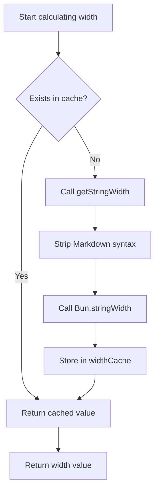

# Technical Details: Caching Mechanism & Performance Optimization

## What You'll Learn

- Understand how the plugin's caching mechanism improves performance
- Master the data structure and usage of widthCache
- Learn the trigger conditions for automatic cache cleanup
- Know how to analyze the effectiveness of performance optimization

## Your Current Challenge

You may be wondering:

> How does the plugin quickly calculate table widths? Why does it remain smooth when handling large tables? How is the caching mechanism designed?

This lesson provides an in-depth analysis of the plugin's internal implementation, helping you understand the design philosophy behind the caching mechanism and performance optimization strategies.

## Core Concepts

### Why Use Caching?

When formatting Markdown tables, the plugin needs to calculate the **display width** of each cell. This calculation involves:

1. **Stripping Markdown syntax**: Such as `**bold**`, `*italic*`, `~~strikethrough~~`
2. **Preserving inline code**: Markdown syntax within `` `code` `` blocks remains unchanged
3. **Calling `Bun.stringWidth()`**: Calculates the display width of Unicode characters (including Emoji, Chinese characters)

**The problem**: The same cell content may appear multiple times (e.g., header column names), and recalculating these operations each time is slow.

**The solution**: Use a cache (Map) to store the mapping of "text content → display width", avoiding redundant calculations.

## Cache Data Structure

The plugin uses two global variables to manage the cache:

### widthCache

```typescript
const widthCache = new Map<string, number>()
```

**Purpose**: Cache the calculation results of string display width

**Structure**:
- **Key**: The original text content of the cell (including all Markdown syntax)
- **Value**: The calculated display width (character count)

**Examples**:

| Original Text (Key) | Display Width (Value) | Description |
|--- | --- | ---|
| `**姓名**` | 4 | Width is 4 after stripping `**` |
| `*年龄*` | 4 | Width is 4 after stripping `*` |
| `` `status` `` | 8 | Code block symbols are also counted in width |
| `张三` | 4 | Chinese character width is 1 |

### cacheOperationCount

```typescript
let cacheOperationCount = 0
```

**Purpose**: Records the number of cache operations, used to trigger automatic cleanup

**Cleanup thresholds**:
- Operations > 100 or
- Cache entries > 1000

## Cache Lookup Process

### calculateDisplayWidth Function

When the plugin needs to calculate cell width, it calls the `calculateDisplayWidth()` function, which executes the following flow:

<details>
<summary><strong>📖 View Complete Code</strong></summary>

```typescript
function calculateDisplayWidth(text: string): number {
  if (widthCache.has(text)) {
    return widthCache.get(text)!  // Cache hit, return directly
  }

  const width = getStringWidth(text)  // Calculate actual width
  widthCache.set(text, width)          // Store in cache
  return width
}
```

</details>

**Flowchart**:



**Step Breakdown**:

| Step | Operation | Time Complexity |
|--- | --- | ---|
| 1 | Check `widthCache.has(text)` | O(1) |
| 2 | Cache hit → Return directly | O(1) |
| 3 | Cache miss → Calculate width | O(n) |
| 4 | Store in cache | O(1) |

**Key Points**:
- **On cache hit**: Return directly without any calculation (O(1))
- **On cache miss**: Execute the complete width calculation logic (O(n))
- **Store original text**: Key is the complete Markdown text, ensuring exact matching

## Cache Cleanup Mechanism

### Why Clean the Cache?

While caching improves performance, it consumes memory. Without cleanup:
- **Memory usage grows continuously**: Each new cell content gets cached
- **May contain useless data**: Old table content may no longer be needed

### Automatic Cleanup Trigger Conditions

The plugin calls `incrementOperationCount()` to update the operation counter after each formatting completion:

<details>
<summary><strong>📖 View Cleanup Code</strong></summary>

```typescript
function incrementOperationCount() {
  cacheOperationCount++

  if (cacheOperationCount > 100 || widthCache.size > 1000) {
    cleanupCache()
  }
}

function cleanupCache() {
  widthCache.clear()
  cacheOperationCount = 0
}
```

</details>

**Trigger conditions** (triggered when either condition is met):

| Condition | Threshold | Description |
|--- | --- | ---|
| Operation count | > 100 formatting operations | Avoid frequent cleanup triggers |
| Cache entries | > 1000 cells | Prevent excessive memory usage |

**Cleanup strategy**:
- **Complete clear**: `widthCache.clear()` removes all cached entries
- **Reset counter**: `cacheOperationCount = 0`

::: info Cleanup Timing

Cache cleanup happens **after each formatting completes**, not during formatting. This ensures ongoing formatting operations are not interrupted.

:::

## Performance Optimization Effects

### Cache Hit Rate Analysis

Assume a 5-column × 10-row table where:

- **Duplicate content**: Header column names appear 11 times (header row, separator row, and data rows)
- **Unique content**: Each cell has different content

**Cache effectiveness**:

| Scenario | Without Cache | With Cache | Performance Improvement |
|--- | --- | --- | ---|
| 5 columns × 10 rows (no duplicates) | 50 calculations | 50 calculations | None |
| 5 columns × 10 rows (duplicate headers) | 50 calculations | 10 calculations + 40 cache hits | ~80% |

### Real-world Impact

**Advantages brought by caching**:

1. **Reduce computation overhead**: Avoid repeatedly stripping Markdown syntax and calling `Bun.stringWidth()`
2. **Lower CPU usage**: `getStringWidth()` involves regex replacement and Unicode calculations, which are expensive
3. **Improve response speed**: More noticeable effects for tables with many duplicate cells

**Example scenarios**:

| Scenario | Cache Effectiveness |
|--- | ---|
|--- | ---|
| Simple single-row tables | ⚪ Moderate (unique content) |
| Tables with nested Markdown | ✅ Significant (high symbol stripping overhead) |

## Performance Optimization Suggestions

::: tip Recommendations for Developers

If you need to further optimize performance, consider:

1. **Adjust cache thresholds**: Tune the `100` operation and `1000` entry thresholds based on actual table sizes
2. **LRU cache**: Use Least Recently Used (LRU) algorithm instead of complete clearing strategy
3. **Performance monitoring**: Add logging to track cache hit rates and analyze actual effectiveness

:::

## Summary

The plugin uses the `widthCache` caching mechanism to optimize performance:

- **Storage structure**: `Map<string, number>` maps original text to display width
- **Lookup process**: Check cache first → Calculate and store on miss
- **Cleanup mechanism**: Auto-cleanup when operations > 100 or entries > 1000
- **Performance improvement**: Reduce redundant calculations and lower CPU usage

This mechanism keeps the plugin smooth when handling complex tables and is the core implementation of performance optimization.

## Coming Up Next

> In the next lesson, we'll learn **[Changelog: Version History & Change Records](../../changelog/release-notes/)**.
>
> You'll learn:
> - The plugin's version evolution history
> - New features and fix records
> - How to track plugin updates

---

## Appendix: Source Code Reference

<details>
<summary><strong>Click to expand source code locations</strong></summary>

> Last updated: 2026-01-26

| Feature | File Path | Line Number |
|--- | --- | ---|
| widthCache definition | [`source/franlol/opencode-md-table-formatter/index.ts`](https://github.com/franlol/opencode-md-table-formatter/blob/main/index.ts#L6) | 6 |
| cacheOperationCount definition | [`source/franlol/opencode-md-table-formatter/index.ts`](https://github.com/franlol/opencode-md-table-formatter/blob/main/index.ts#L7) | 7 |
| calculateDisplayWidth function | [`source/franlol/opencode-md-table-formatter/index.ts`](https://github.com/franlol/opencode-md-table-formatter/blob/main/index.ts#L151-L159) | 151-159 |
| incrementOperationCount function | [`source/franlol/opencode-md-table-formatter/index.ts`](https://github.com/franlol/opencode-md-table-formatter/blob/main/index.ts#L219-L225) | 219-225 |
| cleanupCache function | [`source/franlol/opencode-md-table-formatter/index.ts`](https://github.com/franlol/opencode-md-table-formatter/blob/main/index.ts#L227-L230) | 227-230 |

**Key constants**:
- `widthCache = new Map<string, number>()`: Map structure for caching string display widths
- `cacheOperationCount = 0`: Cache operation counter

**Key functions**:
- `calculateDisplayWidth(text: string): number`: Calculates display width (with caching), checks cache before calculating
- `incrementOperationCount(): void`: Increments operation count, triggers conditional cleanup
- `cleanupCache(): void`: Clears widthCache and resets counter

</details>
