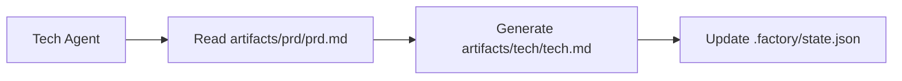

# Context Optimization: Multi-Session Execution

## What You'll Learn

After completing this lesson, you will be able to:

- Use the `factory continue` command to continue the pipeline in a new session
- Understand the benefits of each stage having a clean, isolated context
- Master methods to significantly reduce Token consumption
- Support interrupt recovery—pause and resume at any time

## Your Current Struggle

When executing a complete 7-stage pipeline in an AI assistant (such as Claude Code), you may encounter these problems:

- **Tokens keep accumulating**: As conversations accumulate, context gets longer and longer, and each stage needs to load content from all previous stages
- **Costs keep rising**: Long conversations mean more input tokens, with costs skyrocketing
- **Slower response**: Excessively long context may lead to increased response times
- **Difficult to recover**: If a stage fails, restarting requires reloading a large amount of context

::: tip Core Problem
Context accumulation in long conversations is an inherent characteristic of AI assistants, but we can avoid this problem through "multi-session execution."
:::

## When to Use This Technique

| Scenario                     | Use Multi-Session | Reason                           |
| ------------------------ | -------------- | ------------------------------ |
| Full 7-stage pipeline execution | ✅ Highly recommended | Every token is valuable |
| Only 1-2 stages | ⚠️ Optional | Short context may not need it |
| Debugging a stage | ⚠️ Optional | Frequent retries may increase session switching costs |
| Recovery after long interruption | ✅ Must use | Avoid loading outdated context |

## Core Concept

Agent App Factory supports **multi-session execution**, whose core idea is:

**Create a new session for the next stage after each stage completes.**

Benefits of doing this:

1. **Clean context**: Each stage only loads necessary input files, without relying on conversation history
2. **Save tokens**: Avoids repeatedly passing content from all previous stages to the AI
3. **Recoverability**: Can interrupt at any time, then continue with a new session without losing progress
4. **Cross-platform compatibility**: Works with all AI assistants (Claude Code, OpenCode, Cursor, etc.)

### Context Isolation Strategy

To achieve multi-session execution, Agent App Factory adopts a **context isolation strategy**:

::: info What is context isolation?
Context isolation means each Agent depends only on file inputs, not on conversation history. Regardless of what happened before, the Agent only reads information from specified input files.
:::

When each Agent executes:

- ✅ **Only reads** `inputs` files defined in `pipeline.yaml`
- ❌ **Does not use** any "memory" from conversation history
- ❌ **Does not assume** knowledge of what happened in previous stages

For example, when Tech Agent executes:



Tech Agent only cares about `artifacts/prd/prd.md`, won't wonder "what application did the user want before," all information comes from input files.

### State Recovery Mechanism

When you execute `factory continue`, the system will:

1. Read `.factory/state.json` to get current progress
2. Read `.factory/pipeline.yaml` to determine the next stage
3. **Only load input files required for that stage**
4. Start a new AI assistant window to continue execution

The state file (`.factory/state.json`) is the "memory center" of the entire system:

```json
{
  "version": 1,
  "status": "waiting_for_confirmation",
  "current_stage": "tech",
  "completed_stages": ["bootstrap", "prd"],
  "last_updated": "2026-01-29T12:00:00Z"
}
```

After each stage completes, status is updated to this file. When a new session starts, simply read this file to know where you are currently.
## 🎒 Preparation Before Starting

::: warning Prerequisite Check
Before starting this tutorial, please ensure:

- [ ] Completed [Getting Started](../../start/getting-started/) and initialized a Factory project
- [ ] Understood [7-Stage Pipeline Overview](../../start/pipeline-overview/)
- [ ] Installed Claude Code (or other AI assistant)

If not completed, please complete these prerequisite courses first.
:::

## Follow Along

Let's learn how to use the `factory continue` command through a practical scenario.

### Scenario Setup

Assume you are executing a 7-stage pipeline and have completed the `bootstrap` and `prd` stages, currently at the `ui` stage waiting for confirmation.

### Step 1: Select "New Session to Continue" at Checkpoint

When a stage completes, the Sisyphus scheduler displays an options table:

```
✓ ui completed!

Generated artifacts:
- artifacts/ui/ui.schema.yaml
- artifacts/ui/preview.web/index.html
- artifacts/ui/preview.web/styles.css
- artifacts/ui/preview.web/app.js

┌─────────────────────────────────────────────────────────────┐
│  📋 Please select next action                               │
│  Enter option number (1-5), then press Enter to confirm     │
└─────────────────────────────────────────────────────────────┘

┌──────┬──────────────────────────────────────────────────────┐
│ Option │ Description                                       │
├──────┼──────────────────────────────────────────────────────┤
│  1   │ Continue to next stage (same session)               │
│      │ I will continue executing tech stage                │
├──────┼──────────────────────────────────────────────────────┤
│  2   │ New session to continue ⭐ Recommended, saves tokens │
│      │ Execute in new terminal window: factory continue    │
│      │ (Will automatically start new Claude Code window and continue pipeline) │
├──────┼──────────────────────────────────────────────────────┤
│  3   │ Rerun this stage                                     │
│      │ Re-execute ui stage                                  │
├──────┼──────────────────────────────────────────────────────┤
│  4   │ Modify artifacts and rerun                          │
│      │ Modify artifacts/prd/prd.md then re-execute         │
├──────┼──────────────────────────────────────────────────────┤
│  5   │ Pause pipeline                                       │
│      │ Save current progress, continue later                │
└──────┴──────────────────────────────────────────────────────┘

💡 Tip: Enter a number between 1-5, then press Enter to confirm your choice
```

**You should see**:
- Option 2 is marked as "⭐ Recommended, saves tokens"

In the current session, we can select option 5 (Pause pipeline), then execute `factory continue` in a new terminal window.

**Why**
- Option 1 is "Continue to next stage (same session)", which continues in the current session, context will accumulate
- Option 2 is "New session to continue", which executes the next stage with a new clean context, **saving tokens**
- Option 5 is "Pause pipeline", which saves current progress, can be resumed later with `factory continue`

### Step 2: Execute `factory continue` in New Terminal Window

Open a new terminal window (or tab), enter your project directory, then execute:

```bash
factory continue
```

**You should see**:

```
Agent Factory - Continue in New Session

Pipeline Status:
───────────────────────────────────────
Project: my-awesome-app
Status: Waiting
Current Stage: tech
Completed: bootstrap, prd

Starting new Claude Code session...
✓ New Claude Code window launched
  (Please wait for the window to open)
```

**What happened**:

1. The `factory continue` command read `.factory/state.json`, knowing the current state
2. Displayed current project status information
3. Automatically started a new Claude Code window, passing the instruction to "please continue executing the pipeline"
4. The new window will automatically continue executing from the `tech` stage

### Step 3: Continue Executing in New Window

After the new Claude Code window launches, you will see a new conversation, but the state is recovered from the previously saved checkpoint.

In the new session, the Agent will:

1. Read `.factory/state.json` to get the current stage
2. Read `.factory/pipeline.yaml` to determine that stage's inputs and outputs
3. **Only load input files required for that stage** (e.g., `artifacts/prd/prd.md`)
4. Execute that stage's tasks

**Key point**:
- The new session has no conversation history from previous stages
- The Agent only reads information from input files, does not rely on "memory"
- This is the embodiment of **context isolation**

### Step 4: Verify Context Isolation

To verify that context isolation is working, you can try asking the Agent in the new session:

"Do you know what the bootstrap stage did?"

If context isolation is working, the Agent will say something like:

"I need to check relevant files to understand previous work. Let me read..."

Then it will attempt to read `input/idea.md` or other files to get information, rather than directly "recalling" from conversation history.

**Checkpoint ✅**
- New session started successfully
- Correct project status displayed
- Agent only depends on input files, not conversation history

### Step 5: Continue Executing Remaining Stages

After each stage completes, you can choose:

- Continue in current session (option 1) - suitable for short workflows
- **New session to continue (option 2)** - **Recommended, saves tokens**
- Pause pipeline (option 5) - execute `factory continue` later

For the full 7-stage pipeline, it's recommended to use "New session to continue" for each stage, so:

```
bootstrap (session 1) → prd (session 2) → ui (session 3) → tech (session 4)
→ code (session 5) → validation (session 6) → preview (session 7)
```

Each session is clean, no need to load content from all previous stages.
## Pitfall Alerts

### Issue 1: Forgetting to Execute `factory continue`

**Wrong approach**:
- Start the next stage directly in the old session
- Or directly open Claude Code in a new window without executing `factory continue`

**Correct approach**:
- Always use the `factory continue` command to start a new session
- This command automatically reads state and passes the correct instruction

### Issue 2: Repeatedly Loading History Files in New Session

**Wrong approach**:
- Manually ask AI to read artifacts from previous stages in the new session
- Assume AI should "know" what happened before

**Correct approach**:
- Trust the context isolation mechanism, Agent will automatically read information from input files
- Only provide input files required for that stage

### Issue 3: Using `factory continue` Across Projects

**Wrong approach**:
- Execute `factory continue` in project A, but current directory is project B

**Correct approach**:
- `factory continue` will check if current directory is a Factory project
- If not, will prompt to execute `factory init` first

### Issue 4: Not Using `factory continue` After Modifying Artifacts

**Scenario**:
- After completing a stage, you manually modified artifacts (e.g., modified PRD)
- Want to continue executing the next stage

**Correct approach**:
- Execute `factory run` (will restart from specified stage)
- Or execute `factory continue` (will continue from current checkpoint)
- Do not continue directly in the old session, as context may be inconsistent

## Lesson Summary

This lesson learned how to use the `factory continue` command for multi-session execution:

### Key Points

1. **Multi-session execution**: After each stage completes, use a new session to execute the next stage
2. **Context isolation**: Agent only depends on input files, not on conversation history
3. **State recovery**: `.factory/state.json` records current progress, new sessions can recover
4. **Save tokens**: Avoid loading excessively long context, significantly reduce costs

### Command Quick Reference

| Command             | Function                         | Usage Scenario           |
| ---------------- | ---------------------------- | ------------------ |
| `factory continue` | Create new session to continue pipeline | After each stage completes |
| `factory run`      | Run pipeline in current session | First run or debugging |
| `factory status`   | View current project status | Understand progress |

### Best Practices

- ✅ When executing full 7-stage pipeline, use `factory continue` for each stage
- ✅ Select "New session to continue" (option 2) at checkpoints
- ✅ Trust the context isolation mechanism, don't manually load history files
- ✅ Use `factory status` to check project progress

## Next Lesson Preview

> In the next lesson, we'll learn **[Permissions and Security Mechanisms](../security-permissions/)**.
>
> You'll learn:
> - How the capability boundary matrix prevents Agents from overstepping permissions
> - Privilege escalation handling and untrusted artifact isolation
> - Security checkpoints and permission verification processes
> - How to configure Claude Code's permission file

This lesson will help you understand Agent App Factory's security mechanism, ensuring each Agent only reads and writes files in authorized directories.

---

## Appendix: Source Code Reference

<details>
<summary><strong>Click to expand source code locations</strong></summary>

> Last updated: 2026-01-29

| Feature                 | File Path                                                                                                       | Line Range    |
| -------------------- | -------------------------------------------------------------------------------------------------------------- | ------- |
| factory continue command | [`cli/commands/continue.js`](https://github.com/hyz1992/agent-app-factory/blob/main/cli/commands/continue.js) | 1-144   |
| Scheduler context optimization    | [`agents/orchestrator.checkpoint.md`](https://github.com/hyz1992/agent-app-factory/blob/main/agents/orchestrator.checkpoint.md) | 113-154  |
| Context isolation strategy      | [`policies/context-isolation.md`](https://github.com/hyz1992/agent-app-factory/blob/main/policies/context-isolation.md) | 1-64    |

**Key functions**:
- `launchClaudeCode(projectDir, nextStage, completedStages)`: Launch new Claude Code window
- `commandExists(cmd)`: Check if command is available
- `module.exports(projectDir)`: Main function of `factory continue` command

**Key constants**:
- `state.json`: State file path (`.factory/state.json`)
- `pipeline.yaml`: Pipeline definition file path (`.factory/pipeline.yaml`)
- `config.yaml`: Project configuration file path (`.factory/config.yaml`)

**Key business rules**:
- BR-6-1: Each stage enjoys clean context exclusively
- BR-6-2: Use `factory continue` command to continue
- BR-6-3: Only load files required for current stage

</details>
