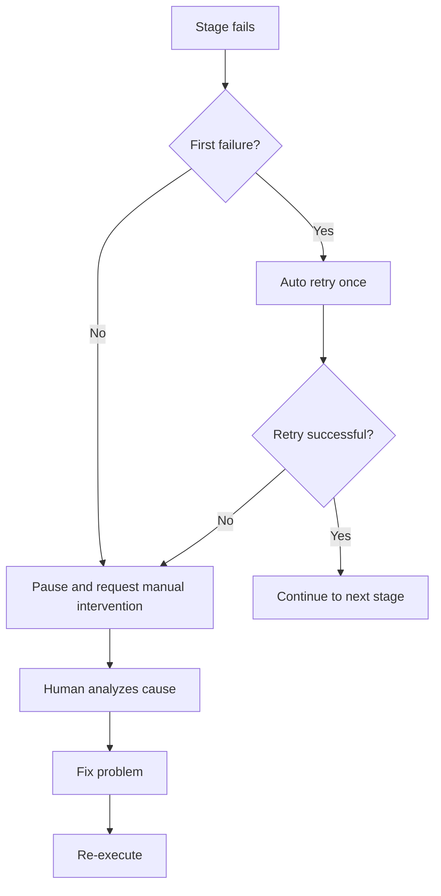
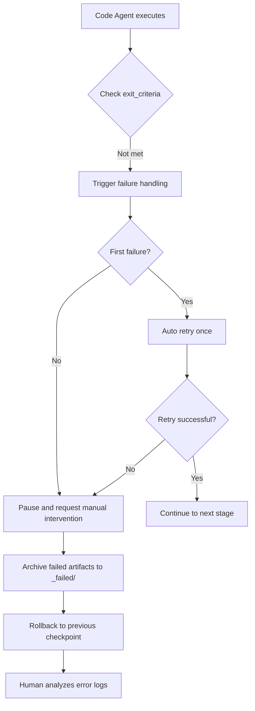
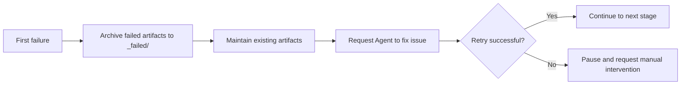
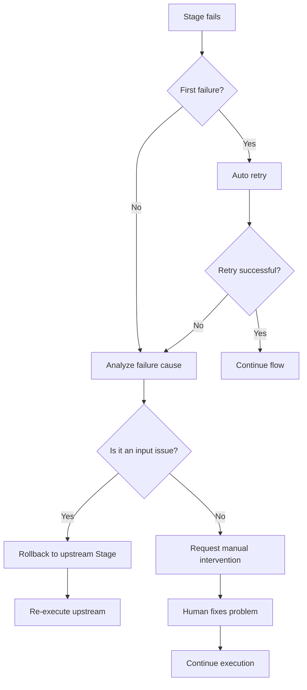

# Failure Handling and Rollback: Intelligent Fault Tolerance and Error Recovery

## What You'll Learn

After completing this lesson, you will be able to:

- **Identify failure types**: Quickly diagnose output missing, content mismatch, unauthorized writes, and other failure causes
- **Understand retry mechanisms**: Master the automatic retry-once policy and failure archiving rules
- **Execute rollback operations**: Learn to roll back to the latest successful checkpoint and restore stable state
- **Handle manual intervention**: Know when human intervention is needed, how to analyze failure causes, and fix issues
- **Interpret error logs**: Understand `pipeline/error.log` error reports and quickly locate problems

## Your Current Struggle

When the pipeline runs, what concerns you most:

- **What if it fails**: A stage errors out—retry or start over from the beginning?
- **Data contamination**: Do failed artifacts affect subsequent stages? Will they be cleaned up?
- **How to rollback**: How to return to a previous successful state?
- **Manual intervention**: Continuous failures—what do I need to do? How do I read logs?

The failure handling mechanism exists to solve these problems—it defines the complete flow for detecting failures, automatic retry, archiving failed artifacts, rolling back to checkpoints, and manual intervention.

## When to Use This Approach

Use this when the pipeline encounters:

- **Stage failure**: Agent execution fails, output files missing or not meeting expectations
- **Unauthorized operations**: Agent writes to unauthorized directories, triggering security checks
- **Continuous failures**: The same stage fails twice, requiring human intervention for analysis
- **Need to rollback**: Want to return to a previous successful state and restart
- **Log analysis**: Need to view detailed error reports and stack traces

## Core Concept

The failure handling strategy is executed uniformly by the Sisyphus scheduler, which acts like a **fault tolerance engineer**, automatically handling errors or requesting human intervention when the pipeline malfunctions.

### Failure Definition

The following scenarios are considered Stage failures:

| Failure Type | Symptom | Code Location |
|-------------|---------|---------------|
| **Missing output** | Output files specified in `pipeline.yaml` don't exist or have incorrect naming | `failure.policy.md:9` |
| **Doesn't meet exit_criteria** | Output content doesn't satisfy exit conditions in `pipeline.yaml` | `failure.policy.md:10` |
| **Unauthorized write** | Agent writes content to unauthorized directories or files | `failure.policy.md:11` |
| **Other exceptions** | Script errors, unable to read input, etc., preventing task completion | `failure.policy.md:12` |

### Retry Mechanism



**Retry rules** (`failure.policy.md:16-18`):

- Each Stage allows **automatic retry once** by default
- During retry, the scheduler requires the Agent to fix issues while maintaining existing artifacts, not completely redoing them
- If the second attempt still fails, the scheduler must pause the pipeline and enter manual intervention flow

### Rollback and Archiving

**Failure archiving** (`failure.policy.md:22-23`):

```bash
# Move failed artifacts to _failed/ directory
mv artifacts/<stage>/ artifacts/_failed/<stage-id>/attempt-1/
mv artifacts/<stage>/ artifacts/_failed/<stage-id>/attempt-2/
```

**Rollback strategy** (`failure.policy.md:23`):

- The scheduler rolls back to the latest successful checkpoint
- Re-executes from that Stage
- Ensures upstream and downstream artifact consistency, avoiding data contamination

### Manual Intervention

**Intervention timing** (`failure.policy.md:27`):

- After the same Stage fails twice consecutively
- When unauthorized writes are detected

**Intervention flow** (`failure.policy.md:27-29`):

1. Scheduler pauses execution and reports failure cause
2. Human checks if input, configuration, or skills have issues
3. Human modifies input files, adjusts skills, or modifies parameters
4. Continue executing remaining flow

::: warning Scheduler Constraints
The scheduler must not skip failed stages or modify outputs without human confirmation.
:::

## Follow Along

### Step 1: Understand Failure Handling Flow

When you run the pipeline, if a stage fails, the Sisyphus scheduler automatically launches the failure handling flow.

**Example scenario**: Code stage fails



### Step 2: View Error Logs

On failure, the scheduler logs detailed error information to `pipeline/error.log`.

**Error log format** (`failure.policy.md:166-200`):

```bash
cat pipeline/error.log
```

**You should see**:

```log
============================================
ERROR REPORT
============================================
Timestamp: 2026-01-29T10:30:00Z
Stage: code
Attempt: 2/2
Status: FAILED

Error Type: TypeScript Compilation Error
Error Message: Cannot find module '@prisma/client'

Stack Trace:
  at Object.<anonymous> (src/lib/prisma.ts:1:1)
  at Module._compile (node:internal/modules/cjs/loader:1198:14)

Exit Criteria Failed:
  - [ ] Backend can start with no major errors (FAILED)
  - [x] Client can render and be accessed
  - [x] No additional authentication or unrelated features introduced

Failed Artifacts Moved To:
  artifacts/_failed/code/attempt-2/

Recommended Action:
  1. Check if package.json contains @prisma/client
  2. Run npx prisma generate to generate client
  3. Retry Code stage

============================================
```

**Error log interpretation**:

| Field | Description | Example |
|-------|-------------|---------|
| **Timestamp** | Time of failure | 2026-01-29T10:30:00Z |
| **Stage** | Failed stage | code |
| **Attempt** | Retry count | 2/2 (second failure) |
| **Status** | Current status | FAILED |
| **Error Type** | Error type | TypeScript Compilation Error |
| **Error Message** | Error description | Cannot find module '@prisma/client' |
| **Stack Trace** | Stack trace | src/lib/prisma.ts:1:1 |
| **Exit Criteria Failed** | Exit criteria not met | Backend can start with no major errors (FAILED) |
| **Failed Artifacts Moved To** | Failed artifact archive location | artifacts/_failed/code/attempt-2/ |
| **Recommended Action** | Recommended fix steps | 1. Check package.json... |

### Step 3: Understand Retry Mechanism

On first failure, Sisyphus automatically triggers retry.

**Retry flow** (`failure.policy.md:16-18`):



**Important features**:

- **Incremental fix**: During retry, the scheduler requires the Agent to fix issues based on existing artifacts, not completely redoing them
- **Failure archiving**: Each failed artifact is moved to `artifacts/_failed/<stage-id>/attempt-N/` for comparative analysis
- **At most once**: Only allows automatic retry once by default, avoiding infinite loops

### Step 4: View Failure Archives

When a stage fails, all failed artifacts are archived to the `artifacts/_failed/` directory.

**Directory structure**:

```bash
artifacts/
├── _failed/
│   ├── code/
│   │   ├── attempt-1/
│   │   │   ├── backend/
│   │   │   └── client/
│   │   └── attempt-2/
│   │       ├── backend/
│   │       └── client/
│   ├── ui/
│   │   └── attempt-1/
│   └── prd/
│       └── attempt-1/
```

**Archive directory naming rules**:

- `artifacts/_failed/<stage-id>/attempt-N/`
  - `<stage-id>`: Failed stage name (e.g., `code`, `ui`, `prd`)
  - `attempt-N`: Attempt number (1 means first failure, 2 means second failure)

**Why archiving is needed**:

- **Avoid contamination**: Failed artifacts don't affect subsequent stages
- **Facilitate analysis**: Can compare differences between attempts to find root causes
- **Evidence retention**: Preserve failed artifacts for future debugging

### Step 5: Execute Rollback Operations

When you need to return to a previous state, you can use the rollback feature.

**Rollback flow** (`failure.policy.md:23`):

```bash
# Manually rollback to previous checkpoint
factory run <stage-id>

# For example: rollback to tech stage to re-execute
factory run tech
```

**Rollback rules**:

- **Rollback target**: Rollback to the latest successful checkpoint
- **Reset state**: Clear current stage artifacts and failure archives
- **Re-execute**: Re-start execution from target stage

**Rollback example**:

Suppose you failed twice at the Code stage and want to return to the Tech stage to redesign the architecture:

```bash
# 1. Rollback to tech stage
factory run tech

# 2. AI assistant will re-execute Tech Agent
# 3. Regenerate artifacts/tech/ and artifacts/backend/prisma/
# 4. Then continue executing Code stage
```

### Step 6: Manual Intervention

After two consecutive failures, Sisyphus pauses the pipeline and requests manual intervention.

**Intervention decision tree** (`failure.policy.md:204-236`):



**Manual intervention checklist** (`failure.policy.md:240-263`):

#### Environment Check

- [ ] Node.js version >= 18
- [ ] npm version >= 9
- [ ] Sufficient disk space
- [ ] Normal network connection (npm downloads)

#### Status Check

- [ ] `.factory/state.json` status is correct
- [ ] Upstream Stage artifacts are complete
- [ ] Failed artifacts have been archived to `_failed/`

#### Fix Confirmation

- [ ] Failure cause is clear
- [ ] Fix has been implemented
- [ ] Related configurations have been updated

#### Resume Execution

- [ ] Restart from failed Stage
- [ ] Monitor execution logs
- [ ] Verify output artifacts

### Step 7: Handle Common Failure Scenarios

Different stages have different common failure scenarios. Below are handling solutions.

#### 7.1 Bootstrap Stage Failure

**Common errors** (`failure.policy.md:35-48`):

| Error Type | Symptom | Cause | Solution |
|-----------|---------|-------|----------|
| **Missing output** | `input/idea.md` doesn't exist | Agent didn't write file correctly | Retry, check write path |
| **Incomplete content** | idea.md missing key sections | Insufficient user input | Pause, request user to supplement |
| **Format error** | Doesn't match template structure | Agent didn't follow template | Retry, emphasize template requirements |

**Handling flow**:

```bash
# 1. Check if input/ directory exists
ls -la input/

# 2. If not, create directory
mkdir -p input/

# 3. Retry Bootstrap stage
factory run bootstrap
```

#### 7.2 PRD Stage Failure

**Common errors** (`failure.policy.md:50-65`):

| Error Type | Symptom | Cause | Solution |
|-----------|---------|-------|----------|
| **Contains technical details** | PRD includes tech stack descriptions | Agent overstepping boundaries | Retry, emphasize responsibility boundaries |
| **Too many features** | Must Have > 7 | Scope creep | Retry, require simplifying to MVP |
| **Vague user descriptions** | "Everyone", "most users" | Not specific | Retry, require specific user personas |
| **Missing non-goals** | Non-Goals is empty | Boundaries unclear | Retry, require listing non-goals |

**Handling flow**:

```bash
# 1. Verify PRD doesn't contain technical keywords
grep -E "(React|API|database)" artifacts/prd/prd.md

# 2. Verify Must Have feature count ≤ 7
grep -A 100 "Must Have" artifacts/prd/prd.md | wc -l

# 3. Provide specific correction requirements during retry
factory run prd
```

#### 7.3 UI Stage Failure

**Common errors** (`failure.policy.md:67-82`):

| Error Type | Symptom | Cause | Solution |
|-----------|---------|-------|----------|
| **Page limit exceeded** | Page count > 8 | Scope creep | Retry, require reducing pages |
| **Preview won't open** | HTML file corrupted | Generation error | Retry, check HTML syntax |
| **Uses AI style** | Inter font + purple gradient | Didn't follow aesthetic guide | Retry, require choosing distinct aesthetic |
| **Invalid Schema** | YAML parse failed | Syntax error | Retry, verify YAML syntax |

**Handling flow**:

```bash
# 1. Count pages in ui.schema.yaml
grep -c "page:" artifacts/ui/ui.schema.yaml

# 2. Try opening preview in browser
open artifacts/ui/preview.web/index.html

# 3. Verify YAML syntax
npx js-yaml artifacts/ui/ui.schema.yaml

# 4. Check for forbidden AI style elements
grep -E "(Inter|purple|gradient)" artifacts/ui/ui.schema.yaml
```

#### 7.4 Tech Stage Failure

**Common errors** (`failure.policy.md:84-99`):

| Error Type | Symptom | Cause | Solution |
|-----------|---------|-------|----------|
| **Prisma syntax error** | schema.prisma invalid | Syntax issue | Retry, run prisma validate |
| **Over-engineered** | Introduces microservices/cache | Violates MVP principles | Retry, require simplifying architecture |
| **Too many data models** | Table count > 10 | Scope creep | Retry, simplify data models |
| **Missing API definition** | tech.md has no endpoint list | Incomplete content | Retry, require supplementing API |

**Handling flow**:

```bash
# 1. Run Prisma validation
cd artifacts/backend
npx prisma validate

# 2. Check if tech.md contains necessary sections
grep -E "(API|endpoint|route)" artifacts/tech/tech.md

# 3. Count data models
grep -c "model " artifacts/backend/prisma/schema.prisma

# 4. Check for unnecessary complex technologies
grep -E "(microservice|cache|queue)" artifacts/tech/tech.md
```

#### 7.5 Code Stage Failure

**Common errors** (`failure.policy.md:101-131`):

| Error Type | Symptom | Cause | Solution |
|-----------|---------|-------|----------|
| **Dependency install failed** | npm install errors | Package version conflicts | Check package.json, update versions |
| **TypeScript errors** | tsc compilation failed | Type issues | Fix type errors, retry |
| **Missing required files** | Incomplete directory structure | Generation omission | Retry, check file checklist |
| **Tests failed** | npm test failed | Code logic errors | Fix tests, retry |
| **API won't start** | Port listen failed | Configuration issue | Check environment variable configuration |

**Handling flow**:

```bash
# 1. Run dependency check
cd artifacts/backend
npm install --dry-run

# 2. Run type check
npx tsc --noEmit

# 3. Check directory structure against file checklist
ls -la src/

# 4. Run tests
npm test

# 5. If all above pass, try starting service
npm run dev
```

**Common dependency issue fixes** (`failure.policy.md:120-131`):

```bash
# Version conflict
rm -rf node_modules package-lock.json
npm install

# Prisma version mismatch
npm install @prisma/client@latest prisma@latest

# React Native dependency issues
cd artifacts/client
npx expo install --fix
```

#### 7.6 Validation Stage Failure

**Common errors** (`failure.policy.md:133-147`):

| Error Type | Symptom | Cause | Solution |
|-----------|---------|-------|----------|
| **Incomplete validation report** | report.md missing sections | Agent didn't complete | Retry |
| **Too many critical issues** | Error count > 10 | Code stage poor quality | Rollback to Code stage |
| **Security issues** | Hardcoded keys detected | Security violation | Rollback, fix security issues |

**Handling flow**:

```bash
# 1. Parse report.md to confirm all sections exist
grep -E "(## Summary|## Backend|## Frontend|## Issues)" artifacts/validation/report.md

# 2. Count critical issues
grep -c "critical issue" artifacts/validation/report.md

# 3. If critical issues > 10, recommend rolling back to Code stage
factory run code

# 4. Check security scan results
grep -E "(key|password|token)" artifacts/validation/report.md
```

#### 7.7 Preview Stage Failure

**Common errors** (`failure.policy.md:149-162`):

| Error Type | Symptom | Cause | Solution |
|-----------|---------|-------|----------|
| **Incomplete README** | Missing installation steps | Content omission | Retry, supplement steps |
| **Docker build failed** | Dockerfile errors | Configuration issue | Fix Dockerfile |
| **Missing deployment config** | No docker-compose | Not generated | Retry, require generating config |

**Handling flow**:

```bash
# 1. Check README.md contains all necessary sections
grep -E "(## Quick Start|## Installation|## Run)" artifacts/preview/README.md

# 2. Try docker build to verify Dockerfile
cd artifacts/preview
docker build -t test-app .

# 3. Check if deployment config files exist
ls -la docker-compose.yml .github/workflows/
```

## Checkpoint ✅

After completing this lesson, you should:

- [ ] Understand the 4 types of failure handling (missing output, content mismatch, unauthorized, exceptions)
- [ ] Master the automatic retry-once mechanism
- [ ] Know failed artifacts are archived to `artifacts/_failed/`
- [ ] Be able to interpret `pipeline/error.log` error reports
- [ ] Understand the rollback to checkpoint flow
- [ ] Know when manual intervention is needed
- [ ] Master handling solutions for common failure scenarios

## Pitfall Alerts

### Issue 1: Artifacts completely redone on retry

**Symptom**: On second retry, all artifacts are regenerated instead of fixing based on existing ones.

**Cause**: Agent didn't follow the rule of "fix issues based on existing artifacts".

**Solution**:

When retrying, clearly inform the Agent:

```markdown
Please fix issues based on existing artifacts, don't completely redo them.
Keep correct parts that already exist, only modify parts that don't meet exit_criteria.
```

### Issue 2: Failed artifacts contaminate subsequent stages

**Symptom**: Failed artifacts aren't archived, affecting subsequent stage execution.

**Cause**: Failure artifact archiving step wasn't executed.

**Solution**:

Manually archive failed artifacts:

```bash
# Move failed artifacts to _failed/ directory
mv artifacts/<stage-id> artifacts/_failed/<stage-id>/attempt-1/

# Then re-execute that stage
factory run <stage-id>
```

### Issue 3: Artifact inconsistency after rollback

**Symptom**: After rolling back to upstream stage, artifacts are inconsistent with before.

**Cause**: On rollback, only current stage was reset, dependent downstream artifacts weren't cleared.

**Solution**:

Complete rollback flow:

```bash
# 1. Rollback to target stage
factory run <target-stage>

# 2. Clear all downstream stage artifacts
rm -rf artifacts/<downstream-stage-1>/
rm -rf artifacts/<downstream-stage-2>/

# 3. Re-execute
factory run
```

### Issue 4: Continue execution fails after manual intervention

**Symptom**: After fixing the problem and continuing execution, it still fails.

**Cause**: Fix is incomplete or changes weren't saved.

**Solution**:

Manual intervention checklist:

```bash
# 1. Confirm failure cause is clear
cat pipeline/error.log

# 2. Confirm fix has been implemented
# Check modified files

# 3. Confirm related configs have been updated
cat .factory/state.json

# 4. Re-execute
factory run <failed-stage>
```

### Issue 5: Incomplete error logs

**Symptom**: `pipeline/error.log` missing key information.

**Cause**: Scheduler didn't correctly record error logs.

**Solution**:

Check if log file exists:

```bash
# If not, manually create
mkdir -p pipeline
cat > pipeline/error.log << 'EOF'
ERROR REPORT
============================================
Timestamp: $(date -u +"%Y-%m-%dT%H:%M:%SZ")
Stage: <stage-id>
Attempt: 1/1
Status: FAILED

Error Type: Manual Debug
Error Message: Debug information needed

Stack Trace:
  (add stack trace if available)

Exit Criteria Failed:
  - [ ] exit-criteria-1
  - [ ] exit-criteria-2

Failed Artifacts Moved To:
  artifacts/_failed/<stage-id>/attempt-1/

Recommended Action:
  1. Describe the issue
  2. Provide fix steps
  3. Retry the stage

============================================
EOF
```

## Best Practices

### 1. Fail Early

**Principle**: Detect issues as early as possible to avoid wasting time in subsequent stages.

**Practice**:

- In Bootstrap stage, verify user input is complete
- In PRD stage, check if it contains technical details (violating responsibility boundaries)
- In UI stage, verify page count is reasonable

### 2. Detailed Logging

**Principle**: Record sufficient context information to facilitate problem investigation.

**Practice**:

- Error logs include timestamp, stage, attempt count, error type, stack trace
- Recommended fix steps specific to file names and line numbers
- Archive failed artifacts for comparative analysis

### 3. Atomic Operations

**Principle**: Each stage's output should be atomic, facilitating rollback.

**Practice**:

- Generate all artifact files at once, not write step by step
- If failing midway, don't retain incomplete artifacts
- Archive the entire stage's artifacts, not partial files

### 4. Preserve Evidence

**Principle**: Archive failed artifacts before retrying for comparative analysis.

**Practice**:

- Archive each failure to `attempt-N/` subdirectory
- Preserve artifacts from multiple attempts for comparing differences
- Use `git diff` to compare differences between attempts

### 5. Progressive Retry

**Principle**: Provide more specific guidance during retry, not simple repetition.

**Practice**:

```markdown
# First failure
Please generate PRD document.

# Second retry (provide specific guidance)
Please fix the following issues based on existing PRD:
1. Delete all technical details (such as React, API, etc.)
2. Reduce Must Have features from 10 to 7
3. Add specific personas for target users
4. Supplement Non-Goals section and clarify boundaries
```

## Lesson Summary

The failure handling mechanism is AI App Factory's fault tolerance guarantee, ensuring the pipeline can automatically recover or request manual intervention when errors occur.

**Key points**:

1. **Failure definition**: Missing output, content mismatch, unauthorized write, other exceptions
2. **Retry mechanism**: Each stage allows automatic retry once, requests manual intervention after second failure
3. **Failure archiving**: Failed artifacts moved to `artifacts/_failed/<stage-id>/attempt-N/`
4. **Rollback strategy**: Rollback to latest successful checkpoint, ensure upstream and downstream artifact consistency
5. **Manual intervention**: After two consecutive failures, analyze cause, fix issue, re-execute
6. **Error logs**: Detailed error reports include timestamp, stage, error type, stack trace, recommended fix steps
7. **Common scenarios**: Each stage has specific common errors and handling solutions

## Next Lesson Preview

> In the next lesson, we'll learn **[FAQ and Troubleshooting](../../faq/troubleshooting/)**.
>
> You'll learn:
> - Common issues during initialization
> - Troubleshooting during execution
> - Handling deployment-related problems

---

## Appendix: Source Code Reference

<details>
<summary><strong>Click to expand source code locations</strong></summary>

> Last updated: 2026-01-29

| Feature | File Path | Line Range |
|---------|-----------|------------|
| Failure strategy definition | [`source/hyz1992/agent-app-factory/policies/failure.policy.md`](https://github.com/hyz1992/agent-app-factory/blob/main/policies/failure.policy.md) | 1-276 |
| Scheduler failure handling | [`source/hyz1992/agent-app-factory/agents/orchestrator.checkpoint.md`](https://github.com/hyz1992/agent-app-factory/blob/main/agents/orchestrator.checkpoint.md) | 38-46 |
| Capability boundary matrix | [`source/hyz1992/agent-app-factory/policies/capability.matrix.md`](https://github.com/hyz1992/agent-app-factory/blob/main/policies/capability.matrix.md) | 1-40 |

**Failure definition** (`failure.policy.md:5-13`):
- Missing output: Output files specified in `pipeline.yaml` don't exist or have incorrect naming
- Doesn't meet exit_criteria: Output content doesn't satisfy `exit_criteria` in that Stage's `pipeline.yaml`
- Unauthorized write: Agent writes content to unauthorized directories or files
- Other exceptions: Script errors, unable to read input, etc., preventing task completion

**Retry mechanism** (`failure.policy.md:16-18`):
- Each Stage allows automatic retry once by default
- Scheduler should require Agent to fix issues while maintaining existing artifacts, not completely redoing them
- If second attempt still fails, scheduler must pause pipeline and enter manual intervention flow

**Rollback and archiving** (`failure.policy.md:22-23`):
- Failed artifacts moved to `artifacts/_failed/<stage-id>/` directory
- Rollback to latest successful checkpoint, re-execute from that Stage

**Manual intervention** (`failure.policy.md:27-29`):
- When same Stage fails twice consecutively, scheduler must pause execution and report failure cause
- After human intervention, can modify input files, adjust skills or modify parameters, then continue remaining flow
- Scheduler must not skip failed stages or modify outputs without human confirmation

**Error log format** (`failure.policy.md:166-200`):
- Timestamp, Stage, Attempt, Status
- Error Type, Error Message, Stack Trace
- Exit Criteria Failed
- Failed Artifacts Moved To
- Recommended Action

**Common failure scenarios** (`failure.policy.md:33-162`):
- Bootstrap stage: Missing output, incomplete content, format error
- PRD stage: Contains technical details, too many features, vague user descriptions, missing non-goals
- UI stage: Page limit exceeded, preview won't open, uses AI style, invalid Schema
- Tech stage: Prisma syntax error, over-engineered, too many data models, missing API definition
- Code stage: Dependency install failed, TypeScript errors, missing required files, tests failed, API won't start
- Validation stage: Incomplete validation report, too many critical issues, security issues
- Preview stage: Incomplete README, Docker build failed, missing deployment config

**Scheduler failure handling flow** (`orchestrator.checkpoint.md:38-46`):
- Read `policies/failure.policy.md`, execute according to policy
- Require Agent to fix issues based on existing artifacts and retry
- Move failed artifacts to `artifacts/_failed/<stage-id>/` directory
- After two consecutive failures, pause pipeline, report failure cause and wait for human intervention

**Unauthorized handling** (`orchestrator.checkpoint.md:48-52`):
- Check if output paths are limited to authorized directories
- If unauthorized write detected, move that artifact to `artifacts/_untrusted/<stage-id>/`
- Pause execution and report

**Manual intervention decision tree** (`failure.policy.md:204-236`):
- First failure → Auto retry → Retry successful? → Continue / Second failure
- Second failure → Analyze failure cause → Is it input issue? → Rollback to upstream Stage / Request manual intervention

**Failure recovery checklist** (`failure.policy.md:240-263`):
- Environment check: Node.js version, npm version, disk space, network connection
- Status check: `.factory/state.json`, upstream Stage artifacts, failed artifact archiving
- Fix confirmation: Failure cause, fix, related configs
- Resume execution: Restart from failed Stage, monitor logs, verify artifacts

**Best practices** (`failure.policy.md:267-274`):
- Fail early: Detect issues early to avoid wasting time in subsequent Stages
- Detailed logging: Record sufficient context information for troubleshooting
- Atomic operations: Each Stage's output should be atomic for rollback
- Preserve evidence: Archive failed artifacts before retry for comparative analysis
- Progressive retry: Provide more specific guidance during retry, not simple repetition

</details>
