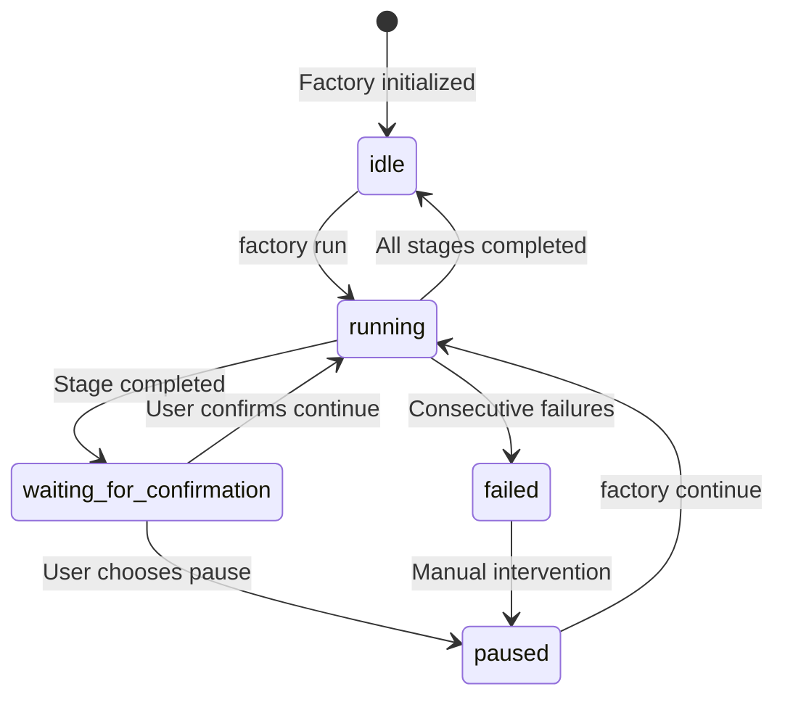
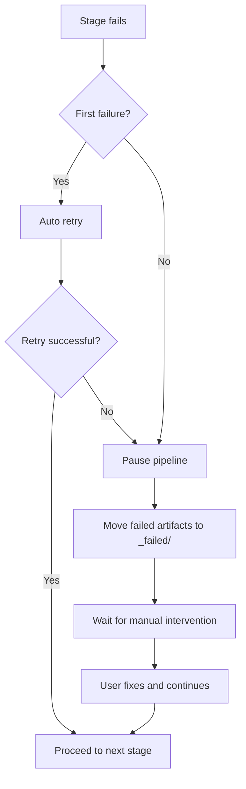

# Sisyphus Scheduler Deep Dive: Pipeline Coordination and State Management

## What You'll Learn

After completing this lesson, you will be able to:

- Understand how the scheduler coordinates the 7-stage pipeline execution
- Grasp state machine principles and state transition rules
- Master permission checking mechanisms in the capability boundary matrix
- Handle failure scenarios (retry, rollback, manual intervention)
- Use the `factory continue` command to optimize Token consumption

## Your Current Struggle

You've run a few pipelines, but you might still be unclear about these questions:

- What exactly does Sisyphus do? How does it differ from other Agents?
- Why can Agents only read/write in certain directories? What happens when they exceed permissions?
- How does the scheduler handle failures? Why does it sometimes auto-retry and sometimes require manual intervention?
- How does the `factory continue` command save Tokens? What's the underlying mechanism?

If you're curious about these questions, this chapter will help you understand them thoroughly.

## When to Use This Approach

When you need to:

- **Debug pipeline issues**: Understand what the scheduler did at a specific stage and why it failed
- **Optimize Token consumption**: Use `factory continue` to start a new session at each stage
- **Extend the pipeline**: Add new Agents or modify existing logic
- **Handle failure scenarios**: Understand why a specific stage failed and how to recover
- **Check permission issues**: Confirm why an Agent cannot access certain files

## Core Concept

Sisyphus scheduler is the "commander" of the entire AI App Factory.

**Remember this analogy**:

- Other Agents (bootstrap, prd, ui, tech, code, validation, preview) are workers executing tasks
- Sisyphus is the foreman responsible for scheduling workers, checking work quality, and handling exceptions

**What makes Sisyphus unique**:

| Feature | Sisyphus | Other Agents |
| --- | --- | --- |
| **Responsibility** | Coordination, validation, state management | Generate specific artifacts |
| **Output** | Update state.json | Generate PRD, code, documentation, etc. |
| **Permissions** | Read/write state.json | Read/write specific artifacts/ subdirectories |
| **Content Generation** | Does not generate business content | Generate specific business artifacts |

**Key principles**:

1. **Strict sequential execution**: Must execute in the order defined by pipeline.yaml; cannot skip or run in parallel
2. **Single-stage execution**: Only one Agent can be active at a time
3. **Separation of concerns**: Sisyphus does not modify business artifacts; it only coordinates and validates
4. **Quality gate**: Each stage must verify that artifacts meet exit_criteria before proceeding

## State Machine Model

Sisyphus runs the entire process as a state machine. Understanding the state machine is key to mastering the scheduler.

### 5 States



### State Details

| State | Description | Trigger Condition |
| --- | --- | --- |
| **idle** | Waiting to start | Project initialization complete, or all pipeline stages completed |
| **running** | Executing a Stage | After factory run or factory continue |
| **waiting_for_confirmation** | Waiting for manual confirmation | After current Stage completes, waiting for user to choose next step |
| **paused** | Manually paused | User chooses pause, or paused after consecutive failures |
| **failed** | Unhandled failure detected | Agent fails twice consecutively, or unauthorized write detected |

::: info State File
All states are saved in the `.factory/state.json` file. Sisyphus has exclusive write permission to this file.
:::

### State Transition Examples

**Scenario 1: Normal execution**

```
idle → running (factory run)
   ↓
waiting_for_confirmation (bootstrap completed)
   ↓
running (user chooses continue)
   ↓
waiting_for_confirmation (prd completed)
   ↓
... (repeat until all stages completed)
   ↓
idle
```

**Scenario 2: Failure recovery**

```
running → failed (code stage fails twice consecutively)
   ↓
paused (manual intervention to fix code)
   ↓
running (factory continue to retry code)
   ↓
waiting_for_confirmation
```

## Capability Boundary Matrix

### Why is Permission Control Needed?

Imagine this:

- If the PRD Agent modifies files generated by the UI Agent, what problems would arise?
- If the Tech Agent reads code generated by the Code Agent, what consequences would result?

**Answer**: Confusion of responsibilities, untraceable artifacts, and unguaranteed quality.

The capability boundary matrix ensures separation of concerns by restricting each Agent's read/write permissions.

### Permission Matrix

| Agent | Readable Directories | Writable Directories | Description |
| --- | --- | --- | --- |
| **bootstrap** | None | `input/` | Only create or modify `idea.md` in the `input/` directory |
| **prd** | `input/` | `artifacts/prd/` | Read idea file, generate PRD |
| **ui** | `artifacts/prd/` | `artifacts/ui/` | Read PRD, generate UI Schema and preview |
| **tech** | `artifacts/prd/` | `artifacts/tech/`, `artifacts/backend/prisma/` | Read PRD, generate technical design and data model |
| **code** | `artifacts/ui/`, `artifacts/tech/`, `artifacts/backend/prisma/` | `artifacts/backend/`, `artifacts/client/` | Generate code based on UI and technical design |
| **validation** | `artifacts/backend/`, `artifacts/client/` | `artifacts/validation/` | Validate code quality, generate validation report |
| **preview** | `artifacts/backend/`, `artifacts/client/` | `artifacts/preview/` | Read generated code, write demo instructions |

### Permission Check Flow

**Before execution**:

1. Sisyphus reads capability.matrix.md
2. Informs the Agent of allowed read and write directories
3. Agent must operate within permission boundaries

**After execution**:

1. Sisyphus scans newly created or modified files
2. Checks if files are within authorized directory ranges
3. If unauthorized writes are detected, handles them immediately

### Unauthorized Write Handling

If an Agent writes to an unauthorized directory:

1. **Isolate artifacts**: Move unauthorized files to `artifacts/_untrusted/<stage-id>/`
2. **Record failure**: Mark the event as failed
3. **Pause pipeline**: Wait for manual intervention
4. **Provide fix suggestions**: Tell users how to handle untrusted files

**Example**:

```
⚠️  Unauthorized writes detected for stage "prd":
   - artifacts/ui/ui.schema.yaml

Files moved to quarantine: artifacts/_untrusted/prd

Please review these files before proceeding.
```

## Checkpoint Mechanism

After each stage completes, Sisyphus pauses and waits for manual confirmation. This is the checkpoint mechanism.

### Value of Checkpoints

- **Quality control**: Manually verify artifacts from each stage
- **Flexible control**: Can pause, retry, or skip at any time
- **Easy debugging**: Issues can be discovered early, avoiding accumulation to later stages

### Checkpoint Output Template

After each stage completes, Sisyphus presents options in the following format:

```
✓ prd completed!

Generated artifacts:
- artifacts/prd/prd.md

┌─────────────────────────────────────────────────────────────┐
│  📋 Please select next action                                 │
│  Enter option number (1-5), then press Enter to confirm       │
└─────────────────────────────────────────────────────────────┘

┌──────┬──────────────────────────────────────────────────────┐
│ Option │ Description                                          │
├──────┼──────────────────────────────────────────────────────┤
│  1   │ Continue to next stage (same session)                 │
│      │ I will continue executing the ui stage                 │
├──────┼──────────────────────────────────────────────────────┤
│  2   │ Continue in new session ⭐ Recommended, saves Tokens │
│      │ Execute in new terminal: factory continue             │
│      │ (Automatically starts new Claude Code window and continues pipeline) │
├──────┼──────────────────────────────────────────────────────┤
│  3   │ Re-run current stage                                  │
│      │ Re-execute prd stage                                  │
├──────┼──────────────────────────────────────────────────────┤
│  4   │ Modify artifacts and re-run                            │
│      │ Modify input/idea.md and re-execute                   │
├──────┼──────────────────────────────────────────────────────┤
│  5   │ Pause pipeline                                         │
│      │ Save current progress, resume later                    │
└──────┴──────────────────────────────────────────────────────┘

💡 Tip: Enter a number between 1-5, then press Enter to confirm your choice
```

::: tip Recommended Practice
**Option 2 (Continue in new session) is the best practice**—see the next section "Context Optimization" for reasons.
:::

## Failure Handling Strategy

When a stage fails, Sisyphus handles it according to predefined strategies.

### Failure Definition

**Cases Sisyphus considers a failure**:

- Missing output files (required generated files do not exist)
- Output content does not meet exit_criteria (e.g., PRD missing user stories)
- Agent writes outside permissions (writes to unauthorized directory)
- Agent execution errors (script errors, unable to read input)

### Failure Handling Flow



### Auto Retry Mechanism

- **Default rule**: Each stage allows one automatic retry
- **Retry strategy**: Fix issues based on existing artifacts
- **Failure archiving**: After retry fails, artifacts are moved to `artifacts/_failed/<stage-id>/attempt-2/`

### Manual Intervention Scenarios

**Cases requiring manual intervention**:

1. **Two consecutive failures**: Still failing after auto retry
2. **Unauthorized writes**: Agent wrote to unauthorized directory
3. **Script errors**: Agent threw exception during execution

**Manual intervention flow**:

1. Sisyphus pauses the pipeline
2. Displays failure reason and error messages
3. Provides fix suggestions:
   - Modify input files
   - Adjust Agent definitions
   - Update Skill files
4. After user fixes, execute `factory continue` to continue

## Context Optimization (Saving Tokens)

### Problem Description

If you execute 7 stages consecutively in the same session, you'll face these issues:

- **Context accumulation**: AI needs to remember all historical conversations
- **Token waste**: Repeatedly reading historical artifacts
- **Increased cost**: Long sessions consume more Tokens

### Solution: Per-Session Execution

**Core idea**: Execute each stage in a new session.

```
Session 1: bootstrap
  ├─ Generate input/idea.md
  ├─ Update state.json
  └─ End session

Session 2: prd
  ├─ Read state.json (only load current state)
  ├─ Read input/idea.md (only read input file)
  ├─ Generate artifacts/prd/prd.md
  ├─ Update state.json
  └─ End session

Session 3: ui
  ├─ Read state.json
  ├─ Read artifacts/prd/prd.md
  ├─ Generate artifacts/ui/ui.schema.yaml
  ├─ Update state.json
  └─ End session
```

### How to Use

**Step 1**: After completing a stage in the current session, choose "Continue in new session"

```
┌──────┬──────────────────────────────────────────────────────┐
│ Option │ Description                                          │
├──────┼──────────────────────────────────────────────────────┤
│  2   │ Continue in new session ⭐ Recommended, saves Tokens │
│      │ Execute in new terminal: factory continue             │
│      │ (Automatically starts new Claude Code window and continues pipeline) │
└──────┴──────────────────────────────────────────────────────┘
```

**Step 2**: Open a new terminal window and execute:

```bash
factory continue
```

This command automatically:
1. Reads `.factory/state.json` to get current progress
2. Starts a new Claude Code window
3. Continues from the next pending stage

### Benefits of Context Isolation

| Benefit | Description |
| --- | --- |
| **Save Tokens** | No need to load historical conversations and artifacts |
| **Improved stability** | Avoids AI deviating from target due to context explosion |
| **Easy debugging** | Each stage is independent, making issues easier to locate |
| **Interrupt recovery** | Can resume after interrupting at any checkpoint |

## Mandatory Skill Usage Validation

Certain stages require using specific skills to ensure output quality. Sisyphus validates these skills' usage.

### bootstrap Stage

**Mandatory requirement**: Must use `superpowers:brainstorm` skill

**Validation method**:

1. Check if Agent output explicitly states that this skill was used
2. If not mentioned, reject the artifact
3. Prompt to re-execute, explicitly emphasizing the need to use this skill

**Failure prompt**:

```
❌ Detected superpowers:brainstorm skill not used
Please use this skill to deeply explore user ideas before generating idea.md
```

### ui Stage

**Mandatory requirement**: Must use `ui-ux-pro-max` skill

**Validation method**:

1. Check if Agent output explicitly states that this skill was used
2. Check design system configuration in `ui.schema.yaml`
3. If design system configuration is not professionally recommended, reject the artifact

**Failure prompt**:

```
❌ Detected ui-ux-pro-max skill not used
Please use this skill to generate professional design system and UI prototype
```

### Consecutive Failure Handling

If a stage fails twice consecutively due to skill validation:

1. Pause the pipeline
2. Request manual intervention
3. Check Agent definitions and Skill configuration

## Practical Exercise: Debugging a Failed Stage

Assume the code stage failed. Let's see how to debug it.

### Step 1: View state.json

```bash
cat .factory/state.json
```

**Example output**:

```json
{
  "version": "1.0",
  "status": "failed",
  "currentStage": "code",
  "completedStages": ["bootstrap", "prd", "ui", "tech"],
  "failedStages": ["code"],
  "stageHistory": [
    {
      "stageId": "code",
      "status": "failed",
      "startTime": "2026-01-29T10:00:00Z",
      "endTime": "2026-01-29T10:15:00Z",
      "attempts": 2,
      "error": "Exit criteria not met: Missing package.json"
    }
  ],
  "lastCheckpoint": "tech",
  "createdAt": "2026-01-29T09:00:00Z",
  "updatedAt": "2026-01-29T10:15:00Z"
}
```

**Key information**:

- `status: failed` - Pipeline failed
- `currentStage: code` - Currently failed stage
- `completedStages` - 4 stages completed
- `error: "Exit criteria not met: Missing package.json"` - Failure reason

### Step 2: Check Failed Artifacts

```bash
ls -la artifacts/_failed/code/attempt-2/
```

**Example output**:

```
drwxr-xr-x  5 user  staff  160 Jan 29 10:15 .
drwxr-xr-x  3 user  staff   96 Jan 29 10:15 ..
-rw-r--r--  1 user  staff 2.1K Jan 29 10:15 server.ts
-rw-r--r--  1 user  staff 1.5K Jan 29 10:15 client.ts
```

**Issue discovered**: Missing `package.json` file!

### Step 3: View exit_criteria

```bash
cat .factory/pipeline.yaml | grep -A 10 'code:'
```

**Example output**:

```yaml
code:
  agent: agents/code.agent.md
  inputs:
    - artifacts/ui/ui.schema.yaml
    - artifacts/tech/tech.md
    - artifacts/backend/prisma/schema.prisma
  outputs:
    - artifacts/backend/package.json
    - artifacts/backend/server.ts
    - artifacts/client/package.json
    - artifacts/client/app.ts
  exit_criteria:
    - package.json exists
    - Contains correct dependencies
    - Code passes type checking
```

**Confirm issue**: Code Agent did not generate `package.json`, violating exit_criteria.

### Step 4: Fix Issue

**Option 1**: Modify Code Agent definition

```bash
nano .factory/agents/code.agent.md
```

Explicitly require generating `package.json` in the Agent definition:

```markdown
## Must-Generate Files

You must generate the following files:
- artifacts/backend/package.json (with correct dependencies)
- artifacts/backend/server.ts
- artifacts/client/package.json
- artifacts/client/app.ts
```

**Option 2**: Modify input files

If the issue stems from the Tech design stage, modify the technical design:

```bash
nano artifacts/tech/tech.md
```

Add explicit dependency descriptions.

### Step 5: Continue Pipeline

After fixing the issue, re-execute:

```bash
factory continue
```

Sisyphus will:
1. Read state.json (status is failed)
2. Continue from lastCheckpoint (tech)
3. Re-execute code stage
4. Verify artifacts meet exit_criteria

## Lesson Summary

Sisyphus scheduler is the "commander" of AI App Factory, responsible for:

- **Pipeline coordination**: Execute 7 stages in sequence
- **State management**: Maintain state.json, track progress
- **Permission checking**: Ensure Agents only read/write in authorized directories
- **Failure handling**: Auto retry, archive failed artifacts, wait for manual intervention
- **Quality gate**: Verify each stage's artifacts meet exit_criteria

**Core principles**:

1. Execute strictly in sequence; cannot skip or run in parallel
2. Only one Agent can be active at a time
3. All artifacts must be written to artifacts/ directory
4. Manual confirmation required after each stage completes
5. Recommended to use `factory continue` to save Tokens

**Remember this flowchart**:

```
factory run → Read pipeline.yaml → Execute stage → Verify artifacts → Checkpoint confirmation
     ↑                                                                      │
     └──────────────────── factory continue (new session)←──────────────────────┘
```

## Next Lesson Preview

> In the next lesson, we'll learn **[Context Optimization: Per-Session Execution](../context-optimization/)**.
>
> You'll learn:
> - How to use the `factory continue` command
> - Why per-session execution saves Tokens
> - How to test the scheduler in development environment
> - Common debugging tips and log analysis

## Appendix: Source Code Reference

<details>
<summary><strong>Click to expand source code locations</strong></summary>

> Last updated: 2026-01-29

| Feature | File Path | Line Range |
| --- | --- | --- |
| Scheduler core definition | [`source/hyz1992/agent-app-factory/agents/orchestrator.checkpoint.md`](https://github.com/hyz1992/agent-app-factory/blob/main/agents/orchestrator.checkpoint.md) | Full text |
| Scheduler implementation guide | [`source/hyz1992/agent-app-factory/agents/orchestrator-implementation.md`](https://github.com/hyz1992/agent-app-factory/blob/main/agents/orchestrator-implementation.md) | Full text |
| Capability boundary matrix | [`source/hyz1992/agent-app-factory/policies/capability.matrix.md`](https://github.com/hyz1992/agent-app-factory/blob/main/policies/capability.matrix.md) | Full text |
| Failure handling strategy | [`source/hyz1992/agent-app-factory/policies/failure.policy.md`](https://github.com/hyz1992/agent-app-factory/blob/main/policies/failure.policy.md) | Full text |
| Pipeline definition | [`source/hyz1992/agent-app-factory/pipeline.yaml`](https://github.com/hyz1992/agent-app-factory/blob/main/pipeline.yaml) | Full text |

**Key functions**:

- `executeStage()` - Execute single stage (lines 117-189)
- `waitForCheckpointConfirmation()` - Wait for checkpoint confirmation (lines 195-236)
- `handleStageFailure()` - Handle stage failure (lines 242-289)
- `checkUnauthorizedWrites()` - Check unauthorized writes (lines 295-315)
- `getPermissions()` - Get permission matrix (lines 429-467)

**Key constants**:

- State enumeration: `idle`, `running`, `waiting_for_confirmation`, `paused`, `failed`
- Maximum retry count: 2 (line 269)
- Path resolution priority: `.factory/` → root directory (lines 31-33)

</details>
