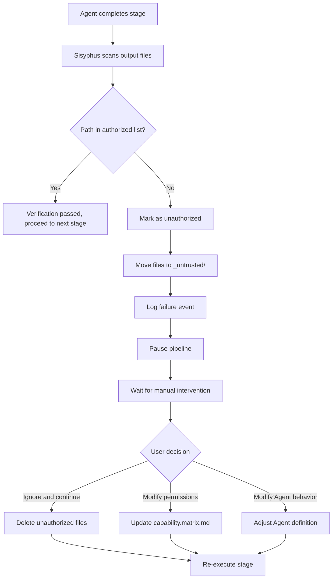

# Security and Permissions: Capability Boundary Matrix and Privilege Protection

## What You'll Learn

- Understand the design principles of the Capability Boundary Matrix and permission isolation mechanisms
- Learn to configure Claude Code permission files, avoiding the use of `--dangerously-skip-permissions`
- Master the handling process and recovery methods for unauthorized operations
- Understand the mandatory skill usage verification mechanism
- Be able to identify and fix permission-related security issues

## Your Current Pain Points

You may have encountered these situations:

- You don't know why the Agent cannot access certain files
- When executing `factory run`, you're always prompted for permissions, so you directly used `--dangerously-skip-permissions` to skip
- You're unclear about permission boundaries between Agents, worrying that unauthorized operations might cause data contamination
- After unauthorized operations occur, you don't know how to handle and recover

If these problems are troubling you, this chapter will help you build a complete understanding of permissions and security.

## When to Use This

When you need to:

- **Configure Claude Code**: Set up correct permission files for Factory projects
- **Debug permission issues**: Troubleshoot why Agents cannot read/write specific files
- **Handle privilege exceptions**: Recover interrupted pipelines caused by unauthorized operations
- **Extend Agents**: Define permission boundaries when adding new Agents
- **Security audit**: Check whether permission configurations in existing projects are reasonable

## Core Concept

The security mechanism of AI App Factory is based on the **Capability Boundary Matrix**, ensuring that each Agent can only operate within authorized directories.

**Remember this analogy**:

- Agents are like **skilled workers** in a factory
- The Capability Boundary Matrix is like a **work permit**, clearly specifying which workshops each worker can enter and which equipment they can operate
- The Sisyphus scheduler is like a **security supervisor**, checking permits when workers enter and exit workshops to ensure no unauthorized behavior occurs

**Three-layer protection mechanism**:

| Layer | Responsibility | Check Timing |
| --- | --- | --- |
| **Claude Code Permissions** | File system read/write permissions | When AI assistant starts |
| **Capability Boundary Matrix** | Agent directory access permissions | Before and after stage execution |
| **Mandatory Skill Verification** | Skill usage requirements for specific stages | bootstrap and ui stages |

## Capability Boundary Matrix Explained

### Why Do We Need Permission Isolation?

Imagine what would happen without permission restrictions:

- **PRD Agent modifies UI files**: UI design gets messed up, making it untraceable
- **Tech Agent reads Code files**: Technical architecture gets influenced by code implementation, deviating from MVP principles
- **Code Agent modifies PRD**: Requirement documents get "polluted" by code logic, causing confusion of responsibilities

**Answer**: Unclear responsibility boundaries, untraceable artifacts, and unguaranteed quality.

The Capability Boundary Matrix ensures responsibility separation by restricting each Agent's read/write permissions.

### Permission Matrix Table

| Agent | Readable Directories | Writable Directories | Description |
| --- | --- | --- | --- |
| **bootstrap** | None | `input/` | Only create or modify `idea.md` in the `input/` directory |
| **prd** | `input/` | `artifacts/prd/` | Read idea files, generate PRD; forbidden to write to other directories |
| **ui** | `artifacts/prd/` | `artifacts/ui/` | Read PRD, generate UI Schema and preview |
| **tech** | `artifacts/prd/` | `artifacts/tech/`, `artifacts/backend/prisma/` | Read PRD, generate technical design and data model |
| **code** | `artifacts/ui/`, `artifacts/tech/`, `artifacts/backend/prisma/` | `artifacts/backend/`, `artifacts/client/` | Generate backend and client code based on UI and technical design; must not modify upstream artifacts |
| **validation** | `artifacts/backend/`, `artifacts/client/` | `artifacts/validation/` | Verify code quality, generate validation report; read-only, no modification of code |
| **preview** | `artifacts/backend/`, `artifacts/client/` | `artifacts/preview/` | Read generated services and client, write demo documentation |

::: tip Core Principles
- **One-way dependency**: Agents can only read artifacts from upstream stages, not downstream or same-level artifacts
- **Independent responsibility**: Each Agent can only write to its own output directory
- **Prohibit unauthorized operations**: Unauthorized read/write operations are considered security violations
:::

### Permission Check Process

The Sisyphus scheduler performs permission checks before and after each stage execution:

**Before execution (inform permissions)**:

```
1. Sisyphus reads capability.matrix.md
2. Passes the current Agent's readable and writable directories to the AI assistant
3. The AI assistant must abide by these restrictions during execution
```

**After execution (verify output)**:

```
1. Sisyphus scans newly created or modified files
2. Checks if file paths are within the Agent's authorized directory range
3. If unauthorized operations are detected, handle immediately (see unauthorized operation handling mechanism)
```

::: info Automation vs Manual
Permission checks are mainly completed automatically by the AI assistant's (Claude Code) permission system and Sisyphus verification logic. Manual intervention is only required in exceptional situations such as unauthorized operations.
:::

## Configuring Claude Code Permissions

### Why Not Recommend --dangerously-skip-permissions?

You may have seen this command:

```bash
claude --dangerously-skip-permissions
```

**Problems with this option**:

| Issue | Description | Risk |
| --- | --- | --- |
| **Skip all checks** | Claude Code no longer validates any file operations | AI may accidentally delete or modify system files |
| **Security vulnerability** | Agents can read/write arbitrary directories | Unauthorized operations cannot be intercepted |
| **Untraceable** | No permission boundaries, difficult to locate problems | Difficult to debug and maintain |

### Factory Automatically Generates Permission Configuration

The Factory CLI automatically generates `.claude/settings.local.json` when initializing the project, configuring precise permissions:

**Generation timing**: When `factory init` command is executed

**Configuration content** (source location: `cli/utils/claude-settings.js:41-91`):

```json
{
  "permissions": {
    "allow": [
      // ========== File Operation Permissions ==========
      "Read(/path/to/project/**)",
      "Write(/path/to/project/**)",
      "Glob(/path/to/project/**)",
      "Edit(/path/to/project/*,**)",
      
      // ========== Git Operation Permissions ==========
      "Bash(git add:*)",
      "Bash(git commit:*)",
      "Bash(git push:*)",
      // ... more git commands
      
      // ========== Build Tool Permissions ==========
      "Bash(npm install:*)",
      "Bash(npm run:*)",
      "Bash(npx:*)",
      
      // ========== TypeScript Permissions ==========
      "Bash(tsc:*)",
      "Bash(npx type-check:*)",
      
      // ========== Database (Prisma) Permissions ==========
      "Bash(npx prisma validate:*)",
      "Bash(npx prisma generate:*)",
      "Bash(npx prisma migrate dev:*)",
      
      // ========== Factory CLI Permissions ==========
      "Bash(factory init:*)",
      "Bash(factory run:*)",
      "Bash(factory continue:*)",
      
      // ========== Docker Permissions ==========
      "Bash(docker compose:*)",
      "Bash(docker build:*)",
      
      // ========== Skill (Plugins) Permissions ==========
      "Skill(superpowers:brainstorming)",
      "Skill(superpowers:writing-plans)",
      "Skill(ui-ux-pro-max)",
      "Skill(*)",
      
      // ========== Web Operation Permissions ==========
      "WebFetch(domain:github.com)",
      "WebFetch(domain:npmjs.org)",
      
      // ========== Common Tool Permissions ==========
      "Bash(curl:*)",
      "Bash(grep:*)",
      "Bash(find:*)"
    ]
  },
  "features": {
    "autoSave": true,
    "telemetry": false
  }
}
```

**Permission configuration features**:

| Feature | Description | Example |
| --- | --- | --- |
| **Project-level restriction** | Only allows reading/writing the current project directory | `Read(/Users/xxx/my-app/**)` |
| **Command-level precise control** | Each command has explicit permission patterns | `Bash(npm install:*)` does not allow `npm install --global` |
| **Cross-platform support** | Automatically adapts to Windows and Unix paths | Windows uses `//d/**`, Unix uses `/path/**` |
| **Skill whitelist** | Explicitly lists allowed skills | `Skill(superpowers:brainstorming)` |

**Check if configuration is effective**:

```bash
# View generated permission configuration
cat .claude/settings.local.json

# Verify file exists
ls -la .claude/settings.local.json
```

::: warning Platform Differences
Windows and Unix/macOS have different path formats:
- Windows: `//C/**` or `//d/**` (drive letter)
- Unix/macOS: `/Users/username/project/**`

Factory will automatically detect the current platform and generate the correct path format.
:::

## Unauthorized Operation Handling Mechanism

### What Is an Unauthorized Operation?

**Unauthorized operation definition**: An Agent wrote to a directory not in its authorized list.

**Typical scenarios**:

| Agent | Authorized Write Directory | Unauthorized Write Directory | Problem |
| --- | --- | --- | --- |
| **prd** | `artifacts/prd/` | `artifacts/ui/` | PRD Agent crossed boundaries and modified UI files |
| **tech** | `artifacts/tech/` | `artifacts/prd/` | Tech Agent modified requirement documents |
| **code** | `artifacts/backend/` | `artifacts/prd/` | Code Agent reverse-modified upstream artifacts |

### Unauthorized Operation Handling Process

When Sisyphus detects unauthorized writes:



### Unauthorized Artifact Isolation

Unauthorized files are moved to the `artifacts/_untrusted/<stage-id>/` directory:

**Example**: PRD Agent wrote to `artifacts/ui/` without authorization

```
artifacts/
├── prd/
│   └── prd.md
├── ui/
│   └── ui.schema.yaml  ← Should be here, but was written by PRD Agent
└── _untrusted/
    └── prd/
        └── ui/
            └── ui.schema.yaml  ← Unauthorized file moved here
```

**Error prompt**:

```
⚠️  Unauthorized writes detected for stage "prd":

Untrusted files:
  - artifacts/ui/ui.schema.yaml

Files moved to quarantine: artifacts/_untrusted/prd/artifacts/ui/ui.schema.yaml

Pipeline paused. Please review these files before proceeding.

Choose action:
  1. Delete untrusted files and retry
  2. Adjust permissions in capability.matrix.md
  3. Modify Agent behavior in .factory/agents/prd.agent.md
  4. Continue (accept untrusted files) - Not recommended
```

### Manual Intervention Handling

**Option 1: Delete unauthorized files and re-execute** (recommended)

```bash
# View unauthorized files
ls -la artifacts/_untrusted/prd/

# Delete unauthorized files
rm -rf artifacts/_untrusted/prd/

# Re-execute stage
factory continue
```

**Option 2: Adjust permission matrix**

If the unauthorized operation is reasonable (for example, an Agent does need to write to an additional directory):

```bash
# Edit permission matrix
nano .factory/policies/capability.matrix.md

# Modify Agent's writable directories
# For example: add `artifacts/ui/` write permission to prd Agent

# Re-execute
factory continue
```

**Option 3: Modify Agent behavior**

If the unauthorized operation is an Agent mistake:

```bash
# Edit Agent definition
nano .factory/agents/prd.agent.md

# Explicitly prohibit writing to unauthorized directories
# Add instruction: "Prohibit writing to artifacts/ui/ or other unauthorized directories"

# Re-execute
factory continue
```

::: danger Warning
Option 4 (accept unauthorized files) is **highly not recommended** because:
- It violates the design principle of permission isolation
- It leads to confusion of responsibilities, making it difficult to trace
- Subsequent stages may fail due to incorrect artifacts
:::

## Mandatory Skill Usage Verification

Certain stages require the use of specific skills to ensure output quality. Sisyphus verifies the usage of these skills.

### bootstrap Stage Verification

**Mandatory requirement**: Must use `superpowers:brainstorm` skill

**Why?**

- Brainstorming skill provides a structured thinking framework
- Ensures product ideas are thoroughly explored, not superficially described
- Prevents Agents from skipping critical analysis steps

**Verification method**:

1. Check if the Agent's output message explicitly states that the skill has been used
2. If not mentioned, reject the artifact
3. Prompt to re-execute, explicitly emphasizing the need to use this skill

**Failure prompt**:

```
❌ Detected that superpowers:brainstorm skill was not used

Bootstrap Agent must use the superpowers:brainstorm skill to deeply explore user ideas.

Please re-execute the bootstrap stage and explicitly state in the output:
"I have used the superpowers:brainstorm skill to analyze user ideas..."
```

**Correct example**:

```
I have used the superpowers:brainstorm skill to deeply analyze user ideas.

Through the brainstorming skill, I identified the following key points:
- Core problem: [problem description]
- Target users: [user persona]
- Value proposition: [value points]
- Key assumptions: [assumption list]

Generated idea document: input/idea.md
```

### ui Stage Verification

**Mandatory requirement**: Must use `ui-ux-pro-max` skill

**Why?**

- UI/UX Pro Max skill provides a professional design system framework
- Avoids "AI default style" (Inter font, purple gradient, etc.)
- Ensures design scheme consistency and maintainability

**Verification method**:

1. Check if the Agent's output message explicitly states that the skill has been used
2. Check if the design system configuration in `ui.schema.yaml` is professional
3. If the design system configuration is not professionally recommended, reject the artifact

**Failure prompt**:

```
❌ Detected that ui-ux-pro-max skill was not used

UI Agent must use the ui-ux-pro-max skill to generate professional design systems and UI prototypes.

Please re-execute the ui stage and explicitly state in the output:
"I have used the ui-ux-pro-max skill to design UI systems..."
```

**Correct example**:

```
I have used the ui-ux-pro-max skill to design UI systems and prototypes.

Through the ui-ux-pro-max skill, I selected:
- Design direction: [specific style, such as: minimalism / cyberpunk]
- Color system: [color scheme]
- Typography system: [font selection]
- Component library: [component specifications]

Generated UI artifacts:
- artifacts/ui/ui.schema.yaml
- artifacts/ui/preview.web/index.html
```

### Continuous Failure Handling

If a stage fails twice in a row due to skill verification:

1. Pause the pipeline
2. Request manual intervention
3. Check the following possible issues:
   - Has the AI assistant installed the corresponding skill (Plugin)?
   - Does the Agent definition explicitly require using that skill?
   - Is the skill file path correct?

## Practical Exercise: Handling Unauthorized Operation Exceptions

Assume the PRD Agent wrote to the UI directory without authorization. Let's look at the complete handling process.

### Step 1: Identify Unauthorized Operation

After the PRD stage completes, Sisyphus reports:

```
⚠️  Unauthorized writes detected for stage "prd":

Untrusted files:
  - artifacts/ui/ui.schema.yaml

Files moved to quarantine: artifacts/_untrusted/prd/artifacts/ui/ui.schema.yaml

Pipeline paused.
```

### Step 2: View Unauthorized Files

```bash
# View unauthorized file content
cat artifacts/_untrusted/prd/artifacts/ui/ui.schema.yaml

# Example output:
```
```yaml
# UI Schema generated by PRD Agent (unauthorized artifact)
pages:
  - name: Home
    components:
      - Hero
      - Features
```

### Step 3: Analyze Cause

**Possible causes**:

| Cause | Description | Evidence |
| --- | --- | --- |
| **Agent mistake** | PRD Agent incorrectly generated UI files | File content does contain UI structure |
| **Unclear prompt** | Agent definition didn't prohibit writing to other directories | Need to check `.factory/agents/prd.agent.md` |
| **Incorrect permission configuration** | PRD Agent's write permissions are too broad | Need to check `capability.matrix.md` |

**Check Agent definition**:

```bash
cat .factory/agents/prd.agent.md
```

**Check permission matrix**:

```bash
cat .factory/policies/capability.matrix.md | grep -A 1 "prd"
```

**Output**:

```
| **prd** | `input/` | `artifacts/prd/` | Read idea files, generate PRD; prohibit writing to other directories |
```

The permission matrix is correct, the problem lies in Agent behavior.

### Step 4: Fix Agent Definition

Edit the Agent definition, adding explicit prohibition instructions:

```bash
nano .factory/agents/prd.agent.md
```

**Add content**:

```markdown
## Prohibitions

- ❌ **Prohibit writing to `artifacts/ui/` directory**: UI design is handled by UI Agent
- ❌ **Prohibit writing to `artifacts/tech/` directory**: Technical architecture is handled by Tech Agent
- ❌ **Prohibit writing to `artifacts/backend/` or `artifacts/client/`**: Code generation is handled by Code Agent
- ✅ **Only write to `artifacts/prd/` directory**: Generate PRD documents
```

### Step 5: Delete Unauthorized Files and Re-execute

```bash
# Delete unauthorized files
rm -rf artifacts/_untrusted/prd/

# Re-execute PRD stage
factory continue
```

### Step 6: Verify Fix

Check if the PRD stage performs unauthorized operations again:

```bash
# View generated artifacts
ls -la artifacts/prd/

# Confirm no writes to other directories
ls -la artifacts/_untrusted/prd/

# Output should be empty, indicating no new unauthorized operations
```

**Success indicator**:

```
✓ prd completed!

Generated artifacts:
- artifacts/prd/prd.md

... (checkpoint options)

No unauthorized operation warnings appeared
```

## Security Best Practices

### 1. Check Permission Configuration During Initialization

```bash
# Immediately check after executing factory init
cat .claude/settings.local.json

# Verify the following:
# ✅ permissions.allow array exists
# ✅ Project path is correct (Windows is //d/**, Unix is /path/**)
# ✅ Contains necessary command permissions (npm, git, factory, docker, etc.)
# ✅ Contains skill permissions (superpowers, ui-ux-pro-max)
```

### 2. Regularly Review Permission Matrix

```bash
# Check permission matrix
cat .factory/policies/capability.matrix.md

# Confirm:
# ✅ Read/write permissions for each Agent are reasonable
# ✅ No over-authorization (for example, Code Agent should not write to PRD)
# ✅ Unauthorized operation handling mechanism is clear
```

### 3. Monitor Unauthorized Events

```bash
# Check if there are unauthorized files
ls -la artifacts/_untrusted/

# If unauthorized files exist, analyze the cause:
# - Is it an Agent mistake?
# - Is the permission configuration unreasonable?
# - Is it necessary to adjust Agent definitions?
```

### 4. Use Version Control to Protect Configuration Files

```bash
# Add key configuration files to Git
git add .claude/settings.local.json
git add .factory/policies/capability.matrix.md
git commit -m "chore: add security configuration files"
```

**Reasons**:

- Prevent accidental deletion or modification of configurations
- Support version tracking of permission configurations
- Maintain permission consistency during team collaboration

::: warning Should settings.local.json be committed?
Although the name contains `local`, the `.claude/settings.local.json` generated by Factory is a project-level permission configuration and should be included in version control. All team members should use the same permission configuration.
:::

### 5. Regularly Update Permission Configuration

Permission configurations need to be updated when the following situations occur:

| Trigger Condition | Configuration to Update |
| --- | --- |
| Add new Agent | Update `capability.matrix.md` |
| Introduce new build tools | Update Bash permissions in `settings.local.json` |
| Add new skills (Plugins) | Update Skill permissions in `settings.local.json` |
| Adjust Agent responsibilities | Update `capability.matrix.md` |

**Update process**:

```bash
# 1. Modify configuration files
nano .claude/settings.local.json
# or
nano .factory/policies/capability.matrix.md

# 2. Commit changes
git add .claude/settings.local.json
git add .factory/policies/capability.matrix.md
git commit -m "security: update permissions for new Agent/Tool"

# 3. Re-initialize permissions (optional)
# If capability.matrix.md was modified, no additional operation is needed, Sisyphus will automatically read it
# If settings.local.json was modified, you may need to restart Claude Code
```

## Common Security Issue Troubleshooting

### Issue 1: Agent Cannot Read Files

**Symptoms**:

```
❌ Error: Cannot read file: artifacts/prd/prd.md
```

**Troubleshooting steps**:

1. Check if the file exists
   ```bash
   ls -la artifacts/prd/prd.md
   ```

2. Check the Agent's read permissions
   ```bash
   cat .factory/policies/capability.matrix.md | grep -A 1 "prd"
   ```
   Confirm that the Agent's readable directories include the directory containing the file.

3. Check Claude Code permission configuration
   ```bash
   cat .claude/settings.local.json | grep "Read"
   ```
   Confirm that the Read permission for the project directory exists.

### Issue 2: Agent Cannot Write Files

**Symptoms**:

```
❌ Error: Cannot write file: artifacts/prd/prd.md
```

**Troubleshooting steps**:

1. Check the Agent's write permissions
   ```bash
   cat .factory/policies/capability.matrix.md | grep -A 1 "prd"
   ```
   Confirm that the Agent's writable directories include the target directory.

2. Check Claude Code permission configuration
   ```bash
   cat .claude/settings.local.json | grep "Write"
   ```
   Confirm that the Write permission for the project directory exists.

3. Check if the directory exists
   ```bash
   ls -la artifacts/prd/
   ```
   If the directory doesn't exist, the Agent will create it automatically, but needs Write permission.

### Issue 3: Frequent Unauthorized Operation Warnings

**Symptoms**:

The same Agent frequently shows unauthorized operation warnings.

**Troubleshooting steps**:

1. Analyze unauthorized operation pattern
   ```bash
   ls -la artifacts/_untrusted/<stage-id>/
   ```
   See which directories the Agent always writes to.

2. Check Agent definition
   ```bash
   cat .factory/agents/<stage>.agent.md
   ```
   Confirm if there are explicit prohibition instructions.

3. Consider whether permissions need to be adjusted
   - If the unauthorized operation is reasonable → Update `capability.matrix.md`
   - If the unauthorized operation is a mistake → Modify Agent definition

### Issue 4: Skill Verification Failure

**Symptoms**:

```
❌ Detected that superpowers:brainstorm skill was not used
```

**Troubleshooting steps**:

1. Confirm the skill is installed
   - Check if the AI assistant has installed the corresponding Plugin
   - Claude Code: Check Skill permissions in `settings.local.json`
   - OpenCode: Check the Plugin list

2. Check Agent definition
   ```bash
   cat .factory/agents/<stage>.agent.md
   ```
   Confirm that the Agent explicitly requires using that skill.

3. Check skill file path
   ```bash
   ls -la .factory/skills/<stage>/skill.md
   ```
   Confirm that the skill file exists and the path is correct.

## Lesson Summary

The permission and security mechanism is the core protection system of AI App Factory, including:

**Three-layer protection**:

1. **Claude Code Permissions**: File system read/write permissions, configured by `settings.local.json`
2. **Capability Boundary Matrix**: Agent directory access permissions, defined by `capability.matrix.md`
3. **Mandatory Skill Verification**: Skill usage requirements for specific stages, verified by Sisyphus

**Core principles**:

- Responsibility separation: Each Agent can only read/write authorized directories
- One-way dependency: Agents can only read upstream artifacts, not downstream or same-level artifacts
- Unauthorized operation isolation: Unauthorized files are automatically moved to `_untrusted/`, waiting for manual handling
- Skill guarantee: Bootstrap and UI stages must use specified skills

**Practice points**:

- Check if permission configuration is correctly generated during initialization
- Regularly review the capability boundary matrix to ensure permissions are reasonable
- Monitor unauthorized operation events and fix Agent behavior in a timely manner
- Use version control to protect configuration files
- When encountering issues, follow the troubleshooting process to identify the cause

**Remember this process**:

```
factory init → Generate permission configuration → Execute pipeline → Sisyphus checks permissions
       ↓                                                      │
       └── Unauthorized? → Move to _untrusted/ → Manual intervention → Fix → Continue ──┘
```

## Next Up

> In the next lesson, we'll learn **[Failure Handling and Rollback](../failure-handling/)**.
>
> You will learn:
> - Failure identification mechanisms (missing output, content mismatch, unauthorized operations)
> - Automatic retry strategies and failure archiving processes
> - Rollback mechanisms and manual intervention processes
> - How to recover pipelines from failures

## Appendix: Source Code Reference

<details>
<summary><strong>Click to expand source code locations</strong></summary>

> Last updated: 2026-01-29

| Function | File Path | Lines |
| --- | --- | --- |
| Capability Boundary Matrix definition | [`source/hyz1992/agent-app-factory/policies/capability.matrix.md`](https://github.com/hyz1992/agent-app-factory/blob/main/policies/capability.matrix.md) | Full text (1-23 lines) |
| Claude Code permission generation | [`source/hyz1992/agent-app-factory/cli/utils/claude-settings.js`](https://github.com/hyz1992/agent-app-factory/blob/main/cli/utils/claude-settings.js) | 38-91 lines |
| Permission check logic | [`source/hyz1992/agent-app-factory/agents/orchestrator.checkpoint.md`](https://github.com/hyz1992/agent-app-factory/blob/main/agents/orchestrator.checkpoint.md) | 47-53 lines |
| Unauthorized operation handling strategy | [`source/hyz1992/agent-app-factory/agents/orchestrator.checkpoint.md`](https://github.com/hyz1992/agent-app-factory/blob/main/agents/orchestrator.checkpoint.md) | 19-21 lines |
| Bootstrap skill verification | [`source/hyz1992/agent-app-factory/agents/orchestrator.checkpoint.md`](https://github.com/hyz1992/agent-app-factory/blob/main/agents/orchestrator.checkpoint.md) | 58-70 lines |
| UI skill verification | [`source/hyz1992/agent-app-factory/agents/orchestrator.checkpoint.md`](https://github.com/hyz1992/agent-app-factory/blob/main/agents/orchestrator.checkpoint.md) | 72-84 lines |

**Key functions**:

- `generatePermissions(projectDir)` - Generate Claude Code permission configuration (lines 41-91)
- `generateClaudeSettings(projectDir)` - Generate and write `settings.local.json` (lines 256-275)
- `getPathPatterns()` - Get platform-specific path patterns (lines 14-36)

**Key constants**:

- Unauthorized operation isolation directory: `artifacts/_untrusted/<stage-id>/`
- Skill names:
  - Bootstrap: `superpowers:brainstorm`
  - UI: `ui-ux-pro-max`
- Platform path formats:
  - Windows: `//{drive}/**`
  - Unix/macOS: `/path/to/project/**`

</details>
