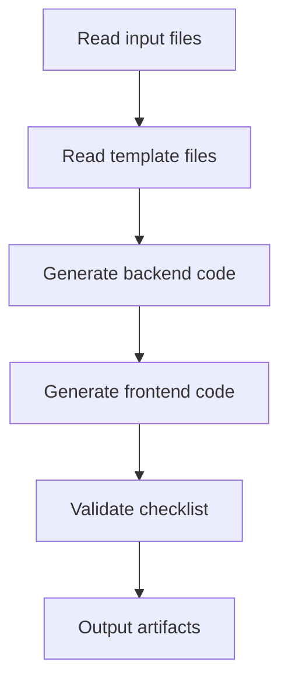

# Stage 5: Code - Generate Runnable Code

## What You'll Learn

After completing this lesson, you will be able to:

- **One-click full-stack code generation**: Automatically generate runnable frontend and backend applications from UI Schema and Tech designs
- **Understand code generation workflow**: Master how Code Agent transforms design documents into production-ready code
- **Validate code quality**: Learn to check the completeness, test coverage, and security standards of generated code
- **Debug common issues**: Resolve dependency installation, type checking, and API connection problems

## Your Current Struggle

You have completed structured product ideation, PRD generation, UI design, and technical architecture design. Now the most challenging part is:

- **How to transform designs into code**: UI Schema and Tech designs are in documents, but how to implement them?
- **Full-stack development is too complex**: Backend requires Express + Prisma, frontend requires React Native—where to start?
- **Code quality is hard to guarantee**: How to ensure generated code has tests, documentation, and meets security standards?
- **Not enough time**: Writing an MVP takes several days—is there a faster way?

The Code stage is designed to solve these problems—it automatically generates production-ready full-stack code based on designs from previous stages.

## When to Use This Approach

When you need to:

- **Quickly validate ideas**: Use code to validate product ideas instead of directly investing in development
- **Create application skeleton**: Provide a runnable foundation for subsequent development instead of starting from scratch
- **Unify tech stack**: Ensure frontend and backend code follow unified architecture and standards
- **Save development time**: Complete MVP framework from design to code in minutes

## Core Concept

Code Agent is a **full-stack engineer** whose task is to transform design documents from previous stages into runnable code. Its core characteristics:

### Input/Output

| Type | Content |
|------|---------|
| **Input** | UI Schema (interface structure), Tech Design (technical solution), Prisma Schema (data model) |
| **Output** | `artifacts/backend/` (backend code), `artifacts/client/` (frontend code) |

### Tech Stack

| Part | Tech Stack |
|------|------------|
| **Backend** | Express + Prisma + TypeScript |
| **Frontend** | React Native Web + Expo + TypeScript |
| **Database** | SQLite (development) / PostgreSQL (production) |

### Execution Constraints

::: warning Strict Scope
Code Agent **only implements** features confirmed in PRD and UI Schema, **does not add**:
- Authentication and authorization systems
- Complex state management (like Redux)
- Non-core feature attributes
:::
## Follow Along

### Step 1: Enter Code Stage

Assume you have completed the Tech stage and are ready to start generating code.

```bash
# If in the pipeline, proceed to the next stage
factory run code

# Or restart from a specific stage
factory run code
```

**You should see**: CLI will display Code stage information, including input files and expected outputs.

### Step 2: AI Assistant Executes Code Agent

The AI assistant will load `agents/code.agent.md` and `skills/code/skill.md`, then start execution.

Code Agent execution flow:



**What the AI assistant will do**:

1. **Read template files** (`skills/code/references/backend-template.md` and `frontend-template.md`)
   - Understand project structure and code organization
   - Learn how to organize directories and configuration files

2. **Analyze input files**
   - Understand page structure and components from `ui.schema.yaml`
   - Understand technical architecture and API design from `tech.md`
   - Understand data model from `schema.prisma`

3. **Generate backend code**
   - Create Express + Prisma project structure
   - Generate API routes and controllers
   - Implement data validation and error handling
   - Add tests and documentation

4. **Generate frontend code**
   - Create React Native + Expo project structure
   - Generate page components and UI components
   - Implement data state management and API calls
   - Add tests and navigation configuration

5. **Validate checklist**
   - Compare against checklist in Code Skill
   - Ensure all mandatory items are completed

6. **Output artifacts**
   - Generate `artifacts/backend/` and `artifacts/client/` directories

### Step 3: Verify Generated Code

After Code Agent completes, it will generate a complete code directory structure.

**Backend directory structure**:

```
backend/
├── package.json          # Dependencies and scripts
├── tsconfig.json         # TypeScript configuration
├── .env.example          # Environment variable template
├── .gitignore            # Git ignore file
├── README.md             # Project description
├── GETTING_STARTED.md    # Quick start guide
├── prisma/
│   ├── schema.prisma     # Data model (copied from Tech stage)
│   └── seed.ts           # Seed data
└── src/
    ├── index.ts          # Application entry point
    ├── app.ts            # Express app configuration
    ├── config/           # Environment variable configuration
    ├── lib/              # Prisma client
    ├── middleware/       # Error handling, logging
    ├── routes/           # API routes
    ├── controllers/      # Controllers
    ├── services/         # Business logic
    ├── validators/       # Input validation (Zod)
    └── __tests__/        # Test files
```

**Frontend directory structure**:

```
client/
├── package.json          # Dependencies and scripts
├── tsconfig.json         # TypeScript configuration
├── app.json              # Expo configuration
├── babel.config.js       # Babel configuration
├── .env.example          # Environment variable template
├── .gitignore            # Git ignore file
├── README.md             # Project description
├── GETTING_STARTED.md    # Quick start guide
├── App.tsx               # Application entry point
└── src/
    ├── config/           # Environment variable configuration
    ├── api/              # API client
    ├── components/       # UI components
    ├── hooks/            # Custom Hooks
    ├── navigation/       # Navigation configuration
    ├── screens/          # Page components
    ├── styles/           # Theme and styles
    └── types/            # Type definitions
```

**Checkpoint ✅**: Confirm that the following files exist:

| File | Backend | Frontend |
|------|---------|----------|
| `package.json` | ✅ | ✅ |
| `tsconfig.json` | ✅ | ✅ |
| `.env.example` | ✅ | ✅ |
| `README.md` | ✅ | ✅ |
| `GETTING_STARTED.md` | ✅ | ✅ |
| Test files | ✅ | ✅ |
| Prisma Schema | ✅ | - |

### Step 4: Start Backend Service

Follow the guide in `backend/GETTING_STARTED.md` to start the service.

```bash
# Enter backend directory
cd artifacts/backend

# Install dependencies
npm install

# Configure environment variables
cp .env.example .env

# Initialize database
npx prisma generate
npx prisma migrate dev
npm run db:seed

# Start development server
npm run dev
```

**You should see**:

```
Server running on http://localhost:3000
Environment: development
Database connected
```

**Checkpoint ✅**: Visit the health check endpoint to confirm the service is running.

```bash
curl http://localhost:3000/health
```

Should return:

```json
{
  "status": "ok",
  "timestamp": "2024-01-29T12:00:00.000Z"
}
```
### Step 5: Start Frontend Application

Follow the guide in `client/GETTING_STARTED.md` to start the application.

```bash
# Open a new terminal, enter frontend directory
cd artifacts/client

# Install dependencies
npm install

# Configure environment variables
cp .env.example .env

# Start development server
npm start
```

**You should see**: Metro Bundler starts, displaying run options.

```
› Metro waiting on exp://192.168.x.x:19000
› Scan the QR code above with Expo Go (Android) or the Camera app (iOS)
› Press a │ open Android
› Press i │ open iOS simulator
› Press w │ open web

Logs for your project will appear below.
```

Select platform:
- Press `w` - Open in browser (most convenient for testing)

**Checkpoint ✅**: Application can open in browser and display the frontend interface.

### Step 6: Test Frontend and Backend Integration

1. **Visit API documentation**: http://localhost:3000/api-docs
   - View Swagger UI documentation
   - Confirm all endpoints are defined

2. **Test frontend functionality**:
   - Create new data
   - Edit data
   - Delete data
   - List refresh

3. **Check console logs**:
   - Frontend API call errors
   - Backend request logs
   - Unhandled exceptions

### Step 7: Confirm Checkpoint

When the AI assistant confirms Code stage completion, you should see:

```
✅ Code stage completed

Generated files:
- Backend: artifacts/backend/ (Express + Prisma + TypeScript)
- Frontend: artifacts/client/ (React Native + Expo + TypeScript)

Checkpoint options:
[1] Continue - Enter Validation stage
[2] Retry - Regenerate code
[3] Pause - Save current state
```

Select **Continue** to proceed to the next stage.

## Checkpoint ✅

After completing the Code stage, you should:

- [ ] Backend code can start normally (`npm run dev`)
- [ ] Frontend application can open in browser
- [ ] Health check endpoint returns normally
- [ ] API documentation is accessible (`/api-docs`)
- [ ] Frontend can call backend API
- [ ] Frontend handles Loading and Error states
- [ ] Test files exist and are runnable (`npm test`)

## Pitfall Alerts

### Issue 1: Dependency Installation Failure

**Symptom**: `npm install` reports error

**Solution**:

```bash
# Clear cache and retry
rm -rf node_modules package-lock.json
npm cache clean --force
npm install
```

### Issue 2: Prisma Migration Failure

**Symptom**: `npx prisma migrate dev` reports error

**Solution**:

```bash
# Reset database
npx prisma migrate reset

# Or manually delete database file
rm prisma/dev.db
npx prisma migrate dev
```

### Issue 3: Frontend Cannot Connect to Backend

**Symptom**: Frontend reports `Network Error` or `ECONNREFUSED`

**Checklist**:

1. Confirm backend is started: `curl http://localhost:3000/health`
2. Check frontend `.env` configuration: `EXPO_PUBLIC_API_URL=http://localhost:3000/api`
3. If testing on real device, change to LAN IP (e.g., `http://192.168.1.100:3000/api`)

### Issue 4: Test Failure

**Symptom**: `npm test` reports error

**Solution**:

- Confirm test files exist: `src/__tests__/`
- Check if test dependencies are installed: `npm install --save-dev vitest @testing-library/react-native`
- Review error messages and fix issues in the code
## Code Agent Special Requirements

Code Agent has some special constraints and requirements that require particular attention:

### 1. Must Read Template Files

Before generating code, Code Agent **must completely read**:
- `skills/code/references/backend-template.md`
- `skills/code/references/frontend-template.md`

These two template files demonstrate production-ready project structures and example code.

### 2. Prohibit Adding Authentication and Authorization

::: warning Scope Limitation
Code Agent **absolutely prohibits** adding:
- Login/registration functionality
- Token authentication
- Permission control
- Complex state management (like Redux)
:::

These features will be added in subsequent iterations. MVP stage only focuses on core business logic.

### 3. Code Quality Requirements

Generated code must meet:

| Requirement | Description |
|------------|-------------|
| **TypeScript** | Strict mode, no `any` types |
| **Testing** | Health check, CRUD endpoints, input validation tests |
| **API Documentation** | Swagger/OpenAPI specification (`/api-docs`) |
| **Error Handling** | Unified error handling middleware |
| **Logging** | Structured logging (winston/pino) |
| **Security** | Zod validation, helmet, CORS whitelist |
| **Documentation** | README and quick start guide |

## Code Generation Checklist

Code Agent will generate code against the following checklist.

### Backend Mandatory Items

- [ ] Environment variable support (dotenv)
- [ ] Dependency version locking (Prisma 5.x)
- [ ] Type definitions (JSON field handling)
- [ ] Core dependencies: Express + Prisma + Zod + Helmet
- [ ] API endpoints: Health check + CRUD
- [ ] Unified response format
- [ ] Input validation (Zod Schema)
- [ ] Error handling middleware
- [ ] Test files (health check + CRUD + validation)
- [ ] Swagger API documentation
- [ ] Seed data (`prisma/seed.ts`)

### Frontend Mandatory Items

- [ ] Core dependencies: React Native Web + Expo + React Navigation
- [ ] Persistent storage (AsyncStorage)
- [ ] Navigation configuration (React Navigation 6+)
- [ ] Safe area (SafeAreaView)
- [ ] API Client (Axios + interceptors)
- [ ] Custom Hooks (data management)
- [ ] Basic UI components (Button, Input, Card, Loading)
- [ ] Page components (at least home page and detail page)
- [ ] Loading and Error state handling
- [ ] Pull-to-refresh (RefreshControl)
- [ ] Test files (page rendering + components + Hooks)

## Testing and Quality Assurance

Even in the MVP stage, Code Agent will generate basic test code.

### Backend Test Example

```typescript
// src/__tests__/items.test.ts
import { describe, it, expect } from 'vitest';
import request from 'supertest';
import app from '../app';

describe('Items API', () => {
  it('should return health check', async () => {
    const res = await request(app).get('/health');
    expect(res.status).toBe(200);
  });

  it('should create a new item', async () => {
    const res = await request(app)
      .post('/api/items')
      .send({ title: 'Test Item', amount: 100 });

    expect(res.status).toBe(201);
    expect(res.body.data).toHaveProperty('id');
  });

  it('should reject invalid item', async () => {
    const res = await request(app)
      .post('/api/items')
      .send({ title: '' }); // Missing required field

    expect(res.status).toBe(400);
  });
});
```

### Frontend Test Example

```typescript
// src/screens/__tests__/HomeScreen.test.tsx
import React from 'react';
import { render, screen } from '@testing-library/react-native';
import HomeScreen from '../HomeScreen';

describe('HomeScreen', () => {
  it('should render without crashing', () => {
    render(<HomeScreen />);
    expect(screen.getByText(/home/i)).toBeTruthy();
  });

  it('should show loading state initially', () => {
    render(<HomeScreen />);
    expect(screen.getByTestId('loading-indicator')).toBeTruthy();
  });
});
```

## Quick Start Guide

Each generated project will include `GETTING_STARTED.md` to help you run the project within 5 minutes.

### Backend Quick Start

```bash
# 1. Clone project
cd artifacts/backend

# 2. Install dependencies
npm install

# 3. Configure environment variables
cp .env.example .env

# 4. Initialize database
npx prisma generate
npx prisma migrate dev
npm run db:seed

# 5. Start service
npm run dev
```

### Frontend Quick Start

```bash
# 1. Clone project
cd artifacts/client

# 2. Install dependencies
npm install

# 3. Configure environment variables
cp .env.example .env

# 4. Start application
npm start
```

**Note**: Ensure the backend is started, otherwise the frontend cannot connect to the API.
## Lesson Summary

The Code stage is one of the core links in the pipeline, transforming designs from previous stages into runnable code.

**Key Points**:

1. **Input/Output**: Code Agent generates frontend and backend code based on UI Schema, Tech Design, and Prisma Schema
2. **Tech Stack**: Backend uses Express + Prisma, frontend uses React Native Web + Expo
3. **Scope Control**: Only implements features in PRD and UI Schema, does not add authentication and authorization
4. **Quality Assurance**: Generates tests, API documentation, and quick start guides
5. **Validation Standards**: Backend can start, frontend can render, API can be called

## Next Lesson Preview

> In the next lesson, we'll learn **[Validation Stage](../stage-validation/)**.
>
> You'll learn:
> - How to validate generated code quality
> - Dependency installation and type checking
> - Prisma Schema validation
> - Generate validation report

---

## Appendix: Source Code Reference

<details>
<summary><strong>Click to expand source code locations</strong></summary>

> Last updated: 2026-01-29

| Feature | File Path | Line Range |
|---------|-----------|------------|
| Code Agent definition | [`agents/code.agent.md`](https://github.com/hyz1992/agent-app-factory/blob/main/agents/code.agent.md) | 1-82 |
| Code Skill | [`skills/code/skill.md`](https://github.com/hyz1992/agent-app-factory/blob/main/skills/code/skill.md) | 1-1488 |
| Backend template | [`skills/code/references/backend-template.md`](https://github.com/hyz1992/agent-app-factory/blob/main/skills/code/references/backend-template.md) | 1-670 |
| Frontend template | [`skills/code/references/frontend-template.md`](https://github.com/hyz1992/agent-app-factory/blob/main/skills/code/references/frontend-template.md) | 1-1231 |
| Pipeline definition | [`pipeline.yaml`](https://github.com/hyz1992/agent-app-factory/blob/main/pipeline.yaml) | 63-77 |

**Key constraints**:
- Only implement features in PRD and UI Schema (`code.agent.md:25`)
- Prohibit adding authentication, authorization, or complex state management (`code.agent.md:28`)
- Must completely read template files (`code/skill.md:1476`)
- All database operations go through Service layer (`backend-template.md:665`)
- All inputs must be validated through Zod (`backend-template.md:666`)

**Key checklists**:
- Backend mandatory items: Environment variables, dependency locking, type definitions (`code.agent.md:37-47`)
- Frontend mandatory items: Core dependencies, import paths, configuration files (`code.agent.md:50-64`)
- Common error prevention (`code.agent.md:65-74`)

</details>
