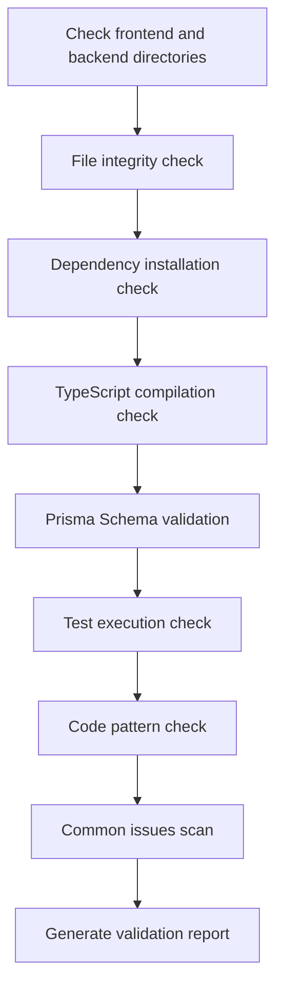

# Stage 6: Validation - Verify Code Quality

## What You'll Learn

- **Automated Code Verification**: One-click check of frontend and backend code for dependency installation, type checking, and basic testing
- **Interpret Validation Reports**: Understand detailed reports and issue classification generated by Validation Agent
- **Quickly Identify Issues**: Fix code errors based on specific locations and recommendations in the report
- **Ensure Code Quality**: Verify generated code meets production-ready standards

## Your Current Problem

You've completed the Code stage and generated frontend and backend code, but the biggest headache is:

- **Will the code run?**: Are dependencies installed correctly? Will type checking pass?
- **Is Prisma correct?**: Are there schema syntax errors? Can the client be generated?
- **Are tests reliable?**: Are there tests? Do they pass?
- **Are there pitfalls?**: Are environment variables configured correctly? Are import paths correct?

Manually checking each of these issues takes a long time and it's easy to miss things. The Validation stage exists to solve these problems—it automatically verifies code quality and generates detailed reports.

## When to Use This

When you need to:

- **Quickly verify code**: Confirm generated code meets basic quality standards
- **Discover potential issues**: Identify dependency, type, and test problems before deployment
- **Code quality assurance**: Ensure both frontend and backend code pass basic checks
- **Avoid deployment failures**: Identify issues early and reduce rework costs

## Core Concept

The Validation Agent is a **quality inspector**. Its task is to verify that the code generated by the Code Agent meets quality standards. Its key features:

### Input/Output

| Type | Content |
|------|---------|
| **Input** | `artifacts/backend/` (backend code), `artifacts/client/` (frontend code) |
| **Output** | `artifacts/validation/report.md` (validation report) |

### Validation Checks

The Validation Agent executes 8 categories of checks:

| Check | Description |
|-------|-------------|
| **File Integrity** | Confirm all required files exist |
| **Dependency Installation** | Verify `package.json` dependencies can be resolved |
| **TypeScript Compilation** | Check if code passes type checking |
| **Prisma Schema** | Verify data model syntax is correct |
| **Test Execution** | Confirm tests exist and pass |
| **Code Standards** | Check lint script configuration |
| **Key Patterns** | Scan code for key patterns (error handling, health checks, etc.) |
| **Common Issues** | Identify known error patterns |

### Execution Constraints

::: warning Read-Only Mode
The Validation Agent **verifies but does not modify**:
- Modifying any code files is prohibited
- Actually installing dependencies is prohibited (use `--dry-run`)
- Executing commands with side effects is prohibited
:::

## Follow Along

### Step 1: Enter Validation Stage

Assume you've completed the Code stage and are now ready to verify code quality.

```bash
# If in pipeline, proceed directly to the next stage
factory run validation

# Or restart from a specific stage
factory run validation
```

**What you should see**: The CLI will display information about the Validation stage, including input files and expected output.

### Step 2: AI Assistant Executes Validation Agent

The AI assistant will load `agents/validation.agent.md` and begin execution.

The Validation Agent's execution flow:



**What the AI assistant will do**:

1. **Check backend directory**
   - Confirm `artifacts/backend/` exists
   - Check required files: `package.json`, `tsconfig.json`, `.env.example`, `prisma/schema.prisma`

2. **Check frontend directory**
   - Confirm `artifacts/client/` exists
   - Check required files: `package.json`, `tsconfig.json`, `app.json`, `App.tsx`

3. **Dependency installation check**
   - Backend: `cd artifacts/backend && npm install --dry-run`
   - Frontend: `cd artifacts/client && npm install --dry-run`
   - Verify dependencies can be resolved

4. **TypeScript compilation check**
   - Backend: `cd artifacts/backend && npx tsc --noEmit`
   - Frontend: `cd artifacts/client && npx tsc --noEmit`
   - Check if code passes type checking

5. **Prisma Schema validation**
   - `cd artifacts/backend && npx prisma validate`
   - Verify data model syntax is correct

6. **Test execution check**
   - Backend: `cd artifacts/backend && npm test`
   - Frontend: `cd artifacts/client && npm test`
   - Confirm tests exist and pass

7. **Code pattern check**
   - Scan key patterns: error handling, health checks, SafeAreaView, etc.
   - Check dependency configuration: dotenv, React Native Web, etc.

8. **Common issues scan**
   - SQLite using `type` definitions
   - Environment variable values have quotes
   - Incorrect import paths
   - Missing necessary imports

9. **Generate validation report**
   - Summarize all check results
   - List discovered issues
   - Provide fix recommendations
   - Save to `artifacts/validation/report.md`

### Step 3: View Validation Report

After the Validation Agent completes, it will generate a detailed validation report.

Open `artifacts/validation/report.md`:

```bash
cat artifacts/validation/report.md
```

**What you should see**:

```markdown
# Code Validation Report

**Generated at**: 2026-01-29 12:00:00
**Validation result**: ✅ Passed

## Summary

- Backend validation: ✅
- Frontend validation: ✅
- Overall assessment: Code quality meets MVP standards, ready to proceed to Preview stage

---

## Backend Validation Details

### File Integrity
| File | Status |
|------|--------|
| package.json | ✅ |
| tsconfig.json | ✅ |
| .env.example | ✅ |
| prisma/schema.prisma | ✅ |
| src/index.ts | ✅ |
| src/app.ts | ✅ |

### Dependency Installation
- Status: ✅
- Details: All dependencies can be resolved

### TypeScript Compilation
- Status: ✅
| Test count | Passed | Failed |
|-----------|--------|--------|
| 12 | 12 | 0 |

### Prisma Validation
- Status: ✅
- Details: Prisma schema syntax is correct

### Test Execution
- Status: ✅
| Test count | Passed | Failed |
|-----------|--------|--------|
| 12 | 12 | 0 |

### Code Pattern Check
| Check | Status |
|-------|--------|
| Error handling middleware | ✅ |
| Health check endpoint | ✅ |
| Environment variable usage | ✅ |
| Prisma Client import | ✅ |
| Test files exist | ✅ |
| dotenv first-line import | ✅ |

---

## Frontend Validation Details

### File Integrity
| File | Status |
|------|--------|
| package.json | ✅ |
| tsconfig.json | ✅ |
| app.json | ✅ |
| App.tsx | ✅ |
| src/navigation/index.tsx | ✅ |

### Dependency Installation
- Status: ✅
- Details: All dependencies can be resolved

### TypeScript Compilation
- Status: ✅
| Test count | Passed | Failed |
|-----------|--------|--------|
| 8 | 8 | 0 |

### Test Execution
- Status: ✅
| Test count | Passed | Failed |
|-----------|--------|--------|
| 8 | 8 | 0 |

### Code Pattern Check
| Check | Status |
|-------|--------|
| SafeAreaView usage | ✅ |
| Loading component | ✅ |
| Error handling | ✅ |
| API call wrapper | ✅ |
| React Native Web dependency | ✅ |
| async-storage dependency | ✅ |

---

## Issues Found

No critical issues or warnings

---

## Fix Recommendations

No fixes required

---

## Conclusion

Code quality meets MVP standards, recommended to proceed to Preview stage.
```

### Step 4: Handle Validation Failures

If validation fails, the report will list specific issues and fix recommendations.

**Example: Partially passed validation report**

```markdown
**Validation result**: ⚠️ Partially passed

## Issues Found

### Critical Issues (Must Fix)

1. TypeScript compilation error
   - Location: src/controllers/items.ts:15
   - Error: Property 'title' does not exist on type 'any'
   - Recommendation: Add type definition `const item: Item = req.body;`

2. Prisma schema validation failed
   - Location: prisma/schema.prisma:10
   - Error: Invalid datasource provider 'sqlite'
   - Recommendation: Change `provider = "sqlite"` to `provider = "postgresql"` (production environment)

### Warnings (Recommended to Fix)

1. Missing test file
   - Location: src/controllers/
   - Recommendation: Add test file for each controller

2. Incomplete environment variable configuration
   - Location: .env.example
   - Recommendation: Add `DATABASE_URL` example

## Fix Recommendations

1. Fix TypeScript error: Add type definition in `src/controllers/items.ts`
2. Update Prisma schema: Modify datasource provider
3. Add test files: Write tests for controllers
4. Complete environment variables: Add to `.env.example`
```

**Fix steps**:

1. **Locate problem file**
   ```bash
   # Open the problem file
   vim artifacts/backend/src/controllers/items.ts
   ```

2. **Fix code**
   ```typescript
   // Add type definition
   const item: Item = req.body;
   ```

3. **Update Prisma schema**
   ```prisma
   datasource db {
     provider = "postgresql"  // Changed to postgresql
     url      = env("DATABASE_URL")
   }
   ```

4. **Re-validate**
   ```bash
   # Re-run Validation stage
   factory run validation
   ```

### Step 5: Confirm Checkpoint

When the AI assistant confirms Validation stage completion, you will see:

```
✅ Validation stage completed

Generated files:
- Validation report: artifacts/validation/report.md

Validation result: ✅ Passed / ⚠️ Partially passed / ❌ Failed

Checkpoint options:
[1] Continue - Proceed to Preview stage
[2] Retry - Re-validate code
[3] Pause - Save current state
```

- If validation passes, select **Continue** to proceed to the next stage
- If there are issues, fix them and select **Retry** to re-validate
- If you need time to fix, select **Pause** to save current state

## Checkpoint ✅

After completing the Validation stage, you should have:

- [ ] All required files exist for both backend and frontend
- [ ] Dependencies can be resolved (`npm install --dry-run`)
- [ ] TypeScript compilation passes without errors (`npx tsc --noEmit`)
- [ ] Prisma schema validation passes (`npx prisma validate`)
- [ ] Test files exist and pass (`npm test`)
- [ ] All key pattern checks pass
- [ ] Validation report generated (`artifacts/validation/report.md`)
## Common Pitfalls

### Issue 1: Dependency Installation Fails

**Symptom**: `npm install --dry-run` reports error

**Solution**:

```bash
# Check package.json syntax
cat artifacts/backend/package.json

# Common issues:
# - Missing quotes
# - Incorrect dependency names
# - Wrong version format

# Re-validate after fixing
factory run validation
```

### Issue 2: TypeScript Compilation Errors

**Symptom**: `npx tsc --noEmit` reports error

**Common error types**:

| Error | Cause | Solution |
|-------|-------|----------|
| `Property does not exist` | Type not defined | Add type definition |
| `Module not found` | Incorrect import path | Check import path |
| `Implicit any` | Implicit any type | Enable strict mode and add type |

### Issue 3: Prisma Schema Validation Fails

**Symptom**: `npx prisma validate` reports error

**Common errors**:

| Error | Cause | Solution |
|-------|-------|----------|
| `Invalid datasource provider` | Wrong provider | Use `postgresql` or `sqlite` |
| `Error parsing` | Syntax error | Check model definition |
| `Relation error` | Incorrect relation definition | Check `@relation` fields |

### Issue 4: Test Failures

**Symptom**: `npm test` reports error

**Solution**:

```bash
# Check if test files exist
find artifacts/backend -name "*.test.ts"

# Check if test dependencies are installed
cat artifacts/backend/package.json | grep -A 5 "devDependencies"

# If test dependencies are missing, install manually
cd artifacts/backend
npm install --save-dev vitest @testing-library/react-native
```

### Issue 5: Key Pattern Check Fails

**Symptom**: Report shows missing key patterns

**Common missing patterns**:

| Pattern | Location | Fix method |
|---------|----------|------------|
| Error handling middleware | `src/middleware/error.ts` | Add error handling middleware |
| Health check endpoint | `src/routes/health.ts` | Add `/health` route |
| dotenv first-line import | `src/index.ts:1` | Add `import 'dotenv/config';` |
| SafeAreaView | `src/screens/Home.tsx` | Wrap content with SafeAreaView |

## Validation Agent Special Requirements

The Validation Agent has special constraints and requirements that require special attention:

### 1. Read-Only Mode

::: warning Code Modification Prohibited
The Validation Agent **strictly prohibits** modifying any code files, only performing verification and report generation.
:::

### 2. Dry-run Installation

Dependency installation check uses the `--dry-run` parameter and will not actually install dependencies:

```bash
npm install --dry-run  # Only checks if dependencies can be resolved
```

### 3. Complete Report

The Validation Agent **must** generate a complete validation report, including:

| Section | Content |
|---------|---------|
| **Summary** | Backend/frontend validation status and overall assessment |
| **Backend Details** | File integrity, dependencies, compilation, Prisma, tests, pattern checks |
| **Frontend Details** | File integrity, dependencies, compilation, tests, pattern checks |
| **Issues Found** | List of critical issues and warnings |
| **Fix Recommendations** | Specific fix steps for issues |
| **Conclusion** | Overall assessment and next steps |

### 4. Issue Classification

The Validation Agent classifies issues into three levels:

| Level | Criteria | Handling |
|-------|----------|----------|
| **Critical** | Must be fixed to pass | Marked as "Must fix" in report |
| **Warning** | Recommended to fix but not fatal | Marked as "Recommended to fix" in report |
| **Info** | For reference only | Does not affect validation result |

## Validation Result Determination

The Validation Agent determines validation status based on check results.

### Pass Conditions (✅ Passed)

- All required files exist
- Dependency installation has no errors
- TypeScript compilation has no errors
- Prisma schema validation passes
- Basic tests exist and all pass
- All key pattern checks pass

### Partial Pass Conditions (⚠️ Partially Passed)

- Required files exist
- Dependency installation has no errors
- TypeScript compilation has warnings but no errors
- Tests exist but some fail (< 30% failure rate)
- Non-critical issues exist

### Fail Conditions (❌ Failed)

- Required files missing
- Dependency installation fails
- TypeScript compilation has errors
- Prisma schema validation fails
- Tests missing or large number of failures (≥ 30% failure rate)

## Code Quality Checklist

The Validation Agent validates against the following checklist.

### Backend Requirements

- [ ] `package.json` exists
- [ ] `tsconfig.json` exists
- [ ] `.env.example` exists
- [ ] `prisma/schema.prisma` exists
- [ ] `src/index.ts` exists
- [ ] `src/app.ts` exists
- [ ] `src/index.ts` imports dotenv on first line
- [ ] dotenv is in dependencies
- [ ] Error handling middleware exists
- [ ] Health check endpoint exists (`/health`)
- [ ] Environment variables use `process.env`
- [ ] Prisma Client import is correct
- [ ] At least one test file exists
- [ ] package.json includes `test` script

### Frontend Requirements

- [ ] `package.json` exists
- [ ] `tsconfig.json` exists
- [ ] `app.json` exists
- [ ] `App.tsx` exists
- [ ] `src/navigation/index.tsx` exists
- [ ] SafeAreaView usage exists
- [ ] Loading component exists
- [ ] Error handling exists
- [ ] API calls use wrapper layer
- [ ] Includes React Native Web dependency
- [ ] Includes async-storage dependency
- [ ] `app.json` does not reference non-existent image files

## Common Issues Scan

The Validation Agent scans for the following known issue patterns:

| Check | Detection Method | Fix Recommendation |
|-------|-----------------|--------------------|
| SQLite using `type` definitions | Check if schema.prisma contains `type Xxx` | Remove `type` definition |
| Environment variable values have quotes | Check if .env contains `="xxx"` or `='xxx'` | Remove quotes |
| Prisma version is 7.x | Check if prisma version in package.json is ^7 | Use Prisma 5.x instead |
| Incorrect import paths | Check if screens has `from './ui/'` | Change to `from '../components/ui/'` |
| Missing View import | Check if component uses View but not imported | Add `import { View } from 'react-native'` |
| Unterminated strings | Check if .tsx files have consecutive quotes | Add missing quote |

## Validation Report Examples

### Passed Validation Report

```markdown
# Code Validation Report

**Generated at**: 2026-01-29 12:00:00
**Validation result**: ✅ Passed

## Summary

- Backend validation: ✅
- Frontend validation: ✅
- Overall assessment: Code quality meets MVP standards, ready to proceed to Preview stage

---

## Backend Validation Details

### File Integrity
| File | Status |
|------|--------|
| package.json | ✅ |
| tsconfig.json | ✅ |
| .env.example | ✅ |
| prisma/schema.prisma | ✅ |
| src/index.ts | ✅ |
| src/app.ts | ✅ |

### Dependency Installation
- Status: ✅
- Details: All dependencies can be resolved

### TypeScript Compilation
- Status: ✅
| Test count | Passed | Failed |
|-----------|--------|--------|
| 12 | 12 | 0 |

### Prisma Validation
- Status: ✅
- Details: Prisma schema syntax is correct

### Test Execution
- Status: ✅
| Test count | Passed | Failed |
|-----------|--------|--------|
| 12 | 12 | 0 |

### Code Pattern Check
| Check | Status |
|-------|--------|
| Error handling middleware | ✅ |
| Health check endpoint | ✅ |
| Environment variable usage | ✅ |
| Prisma Client import | ✅ |
| Test files exist | ✅ |
| dotenv first-line import | ✅ |

---

## Frontend Validation Details

### File Integrity
| File | Status |
|------|--------|
| package.json | ✅ |
| tsconfig.json | ✅ |
| app.json | ✅ |
| App.tsx | ✅ |
| src/navigation/index.tsx | ✅ |

### Dependency Installation
- Status: ✅
- Details: All dependencies can be resolved

### TypeScript Compilation
- Status: ✅
| Test count | Passed | Failed |
|-----------|--------|--------|
| 8 | 8 | 0 |

### Test Execution
- Status: ✅
| Test count | Passed | Failed |
|-----------|--------|--------|
| 8 | 8 | 0 |

### Code Pattern Check
| Check | Status |
|-------|--------|
| SafeAreaView usage | ✅ |
| Loading component | ✅ |
| Error handling | ✅ |
| API call wrapper | ✅ |
| React Native Web dependency | ✅ |
| async-storage dependency | ✅ |

---

## Issues Found

No critical issues or warnings

---

## Fix Recommendations

No fixes required

---

## Conclusion

Code quality meets MVP standards, recommended to proceed to Preview stage.
```

### Failed Validation Report

```markdown
# Code Validation Report

**Generated at**: 2026-01-29 12:00:00
**Validation result**: ❌ Failed

## Summary

- Backend validation: ❌
- Frontend validation: ⚠️
- Overall assessment: Backend has critical issues, must fix before proceeding

---

## Issues Found

### Critical Issues (Must Fix)

1. TypeScript compilation error
   - Location: src/controllers/items.ts:15
   - Error: Property 'title' does not exist on type 'any'
   - Recommendation: Add type definition `const item: Item = req.body;`

2. Prisma schema validation failed
   - Location: prisma/schema.prisma:10
   - Error: Invalid datasource provider 'sqlite'
   - Recommendation: Change `provider = "sqlite"` to `provider = "postgresql"`

3. Missing required files
   - Location: src/
   - Files: src/middleware/error.ts
   - Recommendation: Create error handling middleware

### Warnings (Recommended to Fix)

1. Frontend test failures
   - Location: src/screens/__tests__/HomeScreen.test.tsx
   - Failures: 2/8 tests failed
   - Recommendation: Fix test cases

2. Missing Loading component
   - Location: src/components/
   - Recommendation: Create Loading component and use it correctly

---

## Fix Recommendations

1. Fix TypeScript error: Add type definition in `src/controllers/items.ts`
2. Update Prisma schema: Change datasource provider to postgresql
3. Create error handling middleware: Add `src/middleware/error.ts`
4. Fix frontend tests: Check and fix failing test cases
5. Create Loading component: Add `src/components/Loading.tsx`

---

## Conclusion

Backend has critical issues, must fix before proceeding. Recommendations:
1. Fix TypeScript compilation errors
2. Update Prisma schema
3. Add missing files
4. Re-run Validation stage
```
## Lesson Summary

The Validation stage is the quality assurance step in the pipeline, ensuring generated code meets basic quality standards.

**Key Takeaways**:

1. **Validation Flow**: The Validation Agent automatically checks file integrity, dependencies, compilation, tests, etc.
2. **Read-Only Mode**: Verifies but does not modify, using `--dry-run` to avoid side effects
3. **Issue Classification**: Issues are classified as critical, warning, or info
4. **Detailed Report**: Generates validation reports with specific locations and fix recommendations
5. **Result Determination**: Determines passed/partially passed/failed based on check results

## Next Lesson Preview

> In the next lesson, we'll learn about the **[Preview Stage](../stage-preview/)**.
>
> You will learn:
> - How to generate running documentation
> - Quick start guides
> - Deployment configuration (Docker, CI/CD)

---

## Appendix: Source Code Reference

<details>
<summary><strong>Click to expand source code locations</strong></summary>

> Last updated: 2026-01-29

| Feature | File Path | Line Number |
|---------|-----------|-------------|
| Validation Agent definition | [`agents/validation.agent.md`](https://github.com/hyz1992/agent-app-factory/blob/main/agents/validation.agent.md) | 1-320 |
| Pipeline definition | [`pipeline.yaml`](https://github.com/hyz1992/agent-app-factory/blob/main/pipeline.yaml) | 79-96 |

**Key constraints**:
- Modifying any code files is prohibited (`validation.agent.md:293`)
- Actually installing dependencies is prohibited, use `--dry-run` (`validation.agent.md:294`)
- Must generate complete validation report (`validation.agent.md:296`)
- Must provide specific fix recommendations (`validation.agent.md:298`)

**Validation check items**:
- File integrity check (`validation.agent.md:24-42`)
- Dependency installation check (`validation.agent.md:43-53`)
- TypeScript compilation check (`validation.agent.md:55-65`)
- Prisma Schema validation (`validation.agent.md:67-73`)
- Test execution check (`validation.agent.md:75-85`)
- Code standards check (`validation.agent.md:87-97`)
- Key pattern check (`validation.agent.md:99-122`)
- Common issues scan (`validation.agent.md:124-136`)

**Validation result determination**:
- Pass conditions (`validation.agent.md:268-274`)
- Partial pass conditions (`validation.agent.md:276-281`)
- Fail conditions (`validation.agent.md:283-288`)

**Execution flow**:
- Operation steps (`validation.agent.md:303-313`)
- Output format (`validation.agent.md:139-262`)

</details>
