# 7-Stage Pipeline Overview

## What You'll Learn

After completing this lesson, you will be able to:

- Understand the complete workflow of the 7-stage pipeline and the responsibilities of each stage
- Know the input, output, and exit criteria for each stage
- Understand how the checkpoint mechanism ensures quality
- Understand how the Sisyphus scheduler coordinates Agent execution
- Master how the permission matrix prevents Agents from overstepping
- Learn to use "continue in new session" to save tokens

## Core Concept

**What is a pipeline?**

The AI App Factory pipeline is an automated production line that transforms your product idea step by step into a runnable application. Like a factory production line, raw materials (product ideas) pass through 7 processes (stages) to ultimately produce the finished product (complete application).

Each process is handled by a dedicated Agent, with clear responsibilities and no interference:

| Stage    | Agent               | Responsibility                         | Output                                          |
| -------- | ------------------- | -------------------------------------- | ----------------------------------------------- |
| Bootstrap | Bootstrap Agent     | Deep dive into product ideas          | `input/idea.md`                                |
| PRD      | PRD Agent           | Generate product requirements document | `artifacts/prd/prd.md`                         |
| UI       | UI Agent            | Design interface and prototype         | `artifacts/ui/ui.schema.yaml` + preview page  |
| Tech     | Tech Agent          | Design technical architecture         | `artifacts/tech/tech.md` + Prisma Schema      |
| Code     | Code Agent          | Generate runnable code                 | `artifacts/backend/` + `artifacts/client/`     |
| Validation | Validation Agent   | Verify code quality                    | `artifacts/validation/report.md`              |
| Preview  | Preview Agent       | Generate deployment guide              | `artifacts/preview/README.md`                  |

**Key Features**

1. **Checkpoint Mechanism**: Pause after each stage and wait for your confirmation before continuing
2. **Permission Isolation**: Each Agent can only read/write authorized directories, preventing contamination
3. **Failure Rollback**: Automatically retry on stage failure, rollback to last successful checkpoint on consecutive failures
4. **Context Optimization**: Support continuing execution in a new session to save tokens

## Pipeline Overview

```mermaid
graph LR
    A[Bootstrap<br/>Structure Product Idea] -->|idea.md| B[PRD<br/>Generate Requirements]
    B -->|prd.md| C[UI<br/>Design Interface Prototype]
    C -->|ui.schema.yaml| D[Tech<br/>Design Technical Architecture]
    D -->|tech.md + schema.prisma| E[Code<br/>Generate Runnable Code]
    E -->|backend + client| F[Validation<br/>Verify Code Quality]
    F -->|Validation Report| G[Preview<br/>Generate Deployment Guide]
    
    style A fill:#e0f2fe
    style B fill:#f0fdf4
    style C fill:#fef3c7
    style D fill:#ede9fe
    style E fill:#fce7f3
    style F fill:#dbeafe
    style G fill:#d1fae5
```



**Pipeline Execution Rules**

::: tip Execution Rules

1. **Strict Order**: Must start from Bootstrap and execute sequentially to Preview, cannot skip or run in parallel
2. **Single Agent Activation**: Only one Agent can work at a time
3. **No Backtracking**: Confirmed artifacts cannot be modified, can only re-execute the stage

Note: These are pipeline execution rules, not the number of checkpoint options. After each stage completes, Sisyphus provides 5 checkpoint options (see "Checkpoint Mechanism" section below).

:::

## Stage Details

### Stage 1: Bootstrap - Structure Product Idea

**What it does**

Transforms your natural language product description into a structured document, deeply exploring problems, users, value, and assumptions.

**Why it's important**

A clear product definition is the foundation of the entire pipeline. If this step is not done well, all subsequent stages will go off track.

**Input and Output**

| Type   | Path                     | Description                                       |
| ------ | ------------------------ | ------------------------------------------------- |
| Input  | User natural language description | Example: "I want to make a bookkeeping app" |
| Output | `input/idea.md`          | Structured product idea document                  |

**Exit Criteria**

- [ ] `idea.md` exists
- [ ] Describes a coherent product idea
- [ ] Agent used `superpowers:brainstorm` skill for deep exploration

**Required Skill Usage**

::: warning Must Use superpowers:brainstorm

The Bootstrap stage must use the `superpowers:brainstorm` skill for deep exploration. If the Agent does not mention using this skill, the artifact will be rejected and require re-execution.

:::

### Stage 2: PRD - Generate Product Requirements Document

**What it does**

Transforms the structured product idea into an MVP-level product requirements document, defining feature scope, non-goals, and user stories.

**Why it's important**

The PRD is the "contract" for design and development, clarifying "what to do" and "what not to do," preventing scope creep.

**Input and Output**

| Type   | Path                      | Description                                 |
| ------ | ------------------------- | ------------------------------------------- |
| Input  | `input/idea.md`           | Structured idea from Bootstrap stage       |
| Output | `artifacts/prd/prd.md`    | MVP-level product requirements document     |

**Exit Criteria**

- [ ] PRD includes target users
- [ ] PRD defines MVP scope
- [ ] PRD lists non-goals
- [ ] PRD contains no technical implementation details

**Note: PRD Should Not Include Technical Details**

The PRD should describe "what users need," not "how to implement." Technical implementation details are handled by the Tech and Code stages.

### Stage 3: UI - Design Interface and Prototype

**What it does**

Designs UI structure and color schemes based on the PRD, and generates HTML prototypes that can be previewed in a browser.

**Why it's important**

Visual design lets the team and early users intuitively understand the product form, reducing development rework.

**Input and Output**

| Type   | Path                                | Description                     |
| ------ | ----------------------------------- | ------------------------------- |
| Input  | `artifacts/prd/prd.md`              | PRD document                    |
| Output | `artifacts/ui/ui.schema.yaml`      | UI structure definition         |
| Output | `artifacts/ui/preview.web/index.html` | Previewable HTML prototype     |

**Exit Criteria**

- [ ] `ui.schema.yaml` exists
- [ ] Number of pages does not exceed 3
- [ ] Preview page can be opened in a browser
- [ ] Agent used `ui-ux-pro-max` skill

**Required Skill Usage**

::: warning Must Use ui-ux-pro-max

The UI stage must use the `ui-ux-pro-max` skill to generate a professional design system. This skill includes 67 styles, 96 color palettes, and 100 industry rules.

:::

### Stage 4: Tech - Design Technical Architecture

**What it does**

Designs a minimal viable technical architecture and data model, selects the tech stack, and defines API endpoints.

**Why it's important**

Technical architecture determines code maintainability, scalability, and performance. Over-design makes development difficult, while under-design cannot support requirements.

**Input and Output**

| Type   | Path                                      | Description                     |
| ------ | ----------------------------------------- | ------------------------------- |
| Input  | `artifacts/prd/prd.md`                    | PRD document                    |
| Output | `artifacts/tech/tech.md`                  | Technical architecture document |
| Output | `artifacts/backend/prisma/schema.prisma`   | Prisma data model               |

**Exit Criteria**

- [ ] Tech stack explicitly declared
- [ ] Data model consistent with PRD
- [ ] No premature optimization or over-design

**Default Tech Stack Choices**

- Backend: Node.js + Express + Prisma
- Database: SQLite (development) / PostgreSQL (production)
- Frontend: React Native + Expo

### Stage 5: Code - Generate Runnable Code

**What it does**

Generates complete frontend and backend code, tests, configuration, and documentation based on UI Schema, Tech design, and Prisma Schema.

**Why it's important**

This is the key step from "idea to application," generating runnable, production-ready code.

**Input and Output**

| Type   | Path                                      | Description                     |
| ------ | ----------------------------------------- | ------------------------------- |
| Input  | `artifacts/ui/ui.schema.yaml`             | UI structure definition         |
| Input  | `artifacts/tech/tech.md`                  | Technical architecture document |
| Input  | `artifacts/backend/prisma/schema.prisma`  | Data model                     |
| Output | `artifacts/backend/`                      | Backend code (Express + Prisma)|
| Output | `artifacts/client/`                       | Frontend code (React Native)   |

**Exit Criteria**

- [ ] Backend can start without major errors
- [ ] Client can render and be accessed
- [ ] No additional authentication or unrelated features introduced

**Generated Content**

The Code Agent generates the following:

**Backend**:
- Express server + routes
- Prisma ORM + data model
- Unit tests and integration tests (Vitest)
- API documentation (Swagger/OpenAPI)
- Seed data (`prisma/seed.ts`)
- Docker configuration
- Logging and monitoring

**Frontend**:
- React Native pages and components
- React Navigation routing
- Unit tests (Jest + React Testing Library)
- Environment configuration

::: info Why Not Generate Authentication Features?

AI App Factory focuses on MVP and does not generate authentication, authorization, or other complex features by default. These can be added in subsequent iterations.

:::

### Stage 6: Validation - Verify Code Quality

**What it does**

Verifies that the generated code can install dependencies normally, pass type checking, and comply with code standards.

**Why it's important**

Discover issues before running code to avoid discovering errors after deployment, saving debugging time.

**Input and Output**

| Type   | Path                      | Description                       |
| ------ | ------------------------- | --------------------------------- |
| Input  | `artifacts/backend/`      | Backend code                      |
| Input  | `artifacts/client/`       | Frontend code                     |
| Output | `artifacts/validation/report.md` | Validation report            |

**Exit Criteria**

- [ ] Validation report generated
- [ ] Backend dependencies resolve successfully
- [ ] Frontend dependencies resolve successfully
- [ ] TypeScript compilation passes without serious errors
- [ ] Prisma schema validation passes

**Validation Content**

The Validation Agent checks:

1. **Dependency Resolution**: Does `npm install` succeed?
2. **Type Checking**: Does `tsc --noEmit` pass?
3. **Code Standards**: Does it comply with `policies/code-standards.md`?
4. **Prisma Schema**: Does `prisma validate` pass?
5. **Test Pass Rate**: Do tests exist and can they execute?

**Failure Handling**

If validation fails, the Validation Agent generates a detailed error report pointing out specific issues and fix suggestions.

### Stage 7: Preview - Generate Deployment Guide

**What it does**

Summarizes all artifacts and generates complete run instructions, deployment configuration, and demo process documentation.

**Why it's important**

This is the final stage of the pipeline, allowing you to quickly run and deploy the generated application.

**Input and Output**

| Type   | Path                      | Description                     |
| ------ | ------------------------- | ------------------------------- |
| Input  | `artifacts/backend/`      | Backend code                    |
| Input  | `artifacts/client/`       | Frontend code                   |
| Output | `artifacts/preview/README.md` | Complete run instructions  |
| Output | `artifacts/preview/GETTING_STARTED.md` | Quick start guide |

**Exit Criteria**

- [ ] README includes installation steps
- [ ] README includes run commands
- [ ] README lists access URLs and demo process

**Generated Content**

The Preview Agent generates:

- Local run instructions (Web, iOS, Android)
- Docker deployment configuration (`docker-compose.yml`)
- CI/CD configuration reference (GitHub Actions)
- Git Hooks configuration reference (Husky)
- Database migration guide (SQLite → PostgreSQL)

## Checkpoint Mechanism

**What is a checkpoint?**

After each stage completes, the pipeline pauses and displays a list of generated artifacts, allowing you to confirm whether they meet expectations. If not, you can choose "retry" or "modify and re-run."

**Why do we need checkpoints?**

- **Prevent error accumulation**: If early-stage problems are not resolved in the current stage, subsequent stages will amplify errors
- **Ensure quality**: Each stage ensures output meets expectations, avoiding generating unusable code
- **Flexible control**: You can pause, retry, or modify input at any checkpoint

**Checkpoint Options**

After each stage completes, the Sisyphus scheduler displays the following options:

```
┌──────┬──────────────────────────────────────────────────────┐
│ Option │ Description                                          │
├──────┼──────────────────────────────────────────────────────┤
│  1   │ Continue to next stage (same session)                 │
│      │ I will continue executing the [next stage name] stage │
├──────┼──────────────────────────────────────────────────────┤
│  2   │ Continue in new session ⭐ Recommended, saves tokens  │
│      │ Execute in new terminal window: factory continue      │
│      │ (Will automatically start new Claude Code window and  │
│      │  continue pipeline)                                   │
├──────┼──────────────────────────────────────────────────────┤
│  3   │ Rerun current stage                                   │
│      │ Re-execute the [current stage name] stage            │
├──────┼──────────────────────────────────────────────────────┤
│  4   │ Modify artifacts and re-run                           │
│      │ Re-execute after modifying [some input file]         │
├──────┼──────────────────────────────────────────────────────┤
│  5   │ Pause pipeline                                        │
│      │ Save current progress and continue later              │
└──────┴──────────────────────────────────────────────────────┘
```

**Recommended Practice**

::: tip Choose "Continue in New Session" to Save Tokens

After each stage completes, it's recommended to choose "Continue in new session" (Option 2):

1. Execute `factory continue` in a new terminal window
2. The command will automatically start a new Claude Code window
3. Each stage gets a clean context, avoiding token accumulation

:::

## Permission Matrix

**Why do we need permission isolation?**

If Agents can arbitrarily read/write any directory, it could lead to:

- Bootstrap Agent accidentally modifying a completed PRD
- Code Agent accidentally deleting UI design
- Validation Agent mistakenly modifying backend code

**Capability Boundary Matrix**

The Sisyphus scheduler checks Agent permissions before and after each stage execution:

| Agent     | Can Read               | Can Write                      |
| --------- | ---------------------- | ------------------------------ |
| bootstrap | None                   | `input/`                       |
| prd       | `input/`               | `artifacts/prd/`              |
| ui        | `artifacts/prd/`       | `artifacts/ui/`                |
| tech      | `artifacts/prd/`       | `artifacts/tech/`, `artifacts/backend/prisma/` |
| code      | `artifacts/ui/`, `artifacts/tech/`, `artifacts/backend/prisma/` | `artifacts/backend/`, `artifacts/client/` |
| validation| `artifacts/backend/`, `artifacts/client/` | `artifacts/validation/` |
| preview   | `artifacts/backend/`, `artifacts/client/` | `artifacts/preview/` |

**Permission Violation Handling**

If an Agent writes to an unauthorized directory, the Sisyphus scheduler moves the file to `artifacts/_untrusted/<stage-id>/`, pauses the pipeline, and reports.

::: warning Permission Violation Example

Suppose the PRD Agent writes `artifacts/ui/ui.schema.yaml` (which is not within its permission scope). The scheduler will:

1. Move the file to `artifacts/_untrusted/prd/ui.schema.yaml`
2. Pause the pipeline
3. Report: Unauthorized write detected, please handle manually

:::

## Failure Handling

**What counts as failure?**

- Output file missing
- Artifact content does not meet `exit_criteria`
- Agent wrote to unauthorized directory
- Script error or unable to read input

**Default Handling Strategy**

1. **Auto Retry**: Each stage allows one automatic retry
2. **Failure Archival**: Failed artifacts are moved to `artifacts/_failed/<stage-id>/`
3. **Pause Pipeline**: After two consecutive failures, wait for manual intervention
4. **Rollback Mechanism**: Rollback to the last successful checkpoint to re-execute

::: tip Handling After Manual Intervention

If there are two consecutive failures, you can:

1. Modify input files (such as `input/idea.md`)
2. Adjust Agent prompts
3. Fix permission issues
4. Execute `factory run [stage]` to restart from that stage

:::

## State Management

**State File**

All pipeline states are saved in `.factory/state.json`, including:

```json
{
  "version": 1,
  "status": "waiting_for_confirmation",
  "current_stage": "prd",
  "completed_stages": ["bootstrap"],
  "started_at": "2026-01-29T10:00:00Z",
  "last_updated": "2026-01-29T10:30:00Z"
}
```

**State Machine**

| State                   | Meaning                     | Trigger Condition            |
| ----------------------- | --------------------------- | ----------------------------- |
| idle                    | Not started                 | Waiting for `factory run`     |
| running                 | Executing                   | Started executing a Stage     |
| waiting_for_confirmation| Waiting for confirmation    | Stage completed               |
| paused                  | Paused                      | User chose to pause           |
| failed                  | Failed, needs intervention  | Consecutive failures or unauthorized operations |

Only the Sisyphus scheduler has permission to update state.

## Pitfall Alerts

### Common Error 1: Bootstrap Stage Did Not Use brainstorm Skill

**Symptom**: Sisyphus refuses to accept `input/idea.md` and prompts "Detected that superpowers:brainstorm skill was not used."

**Cause**: Bootstrap Agent did not use the `superpowers:brainstorm` skill to deeply explore product ideas.

**Solution**: When confirming artifacts, choose "Rerun current stage" and explicitly require the Agent to use the `superpowers:brainstorm` skill.

### Common Error 2: UI Stage Design Is Mediocre

**Symptom**: Generated UI designs all look the same—purple gradients and Inter fonts.

**Cause**: UI Agent did not use the `ui-ux-pro-max` skill.

**Solution**: When confirming artifacts, choose "Rerun current stage" and explicitly require the Agent to use the `ui-ux-pro-max` skill, specifying a distinct aesthetic direction (such as "Cyberpunk" or "Minimalism").

### Common Error 3: Code Stage Generated Authentication Features

**Symptom**: Generated backend code includes JWT authentication, user login, and other complex features.

**Cause**: Code Agent exceeded the MVP scope.

**Solution**: Modify the PRD, explicitly listing "Non-goals" (such as "No user login support," "No multi-user collaboration"), then re-execute the Code stage.

### Common Error 4: Excessive Token Consumption

**Symptom**: Token consumption spikes in the later stages of pipeline execution, and AI assistant responses become slow.

**Cause**: Executing multiple stages in the same session causes context to continuously accumulate.

**Solution**: **Always choose "Continue in New Session"** (Option 2), giving each stage a clean context.

## Lesson Summary

- The pipeline includes 7 stages: Bootstrap → PRD → UI → Tech → Code → Validation → Preview
- Pause for confirmation after each stage to ensure output meets expectations
- Sisyphus scheduler coordinates Agent execution, manages state and permissions
- Capability boundary matrix prevents Agents from overstepping, ensuring separation of concerns
- Choosing "Continue in New Session" can significantly save tokens

## Next Lesson Preview

> In the next lesson, we'll learn **[Claude Code Integration Guide](../../platforms/claude-code/)**.
>
> You'll learn:
> - How to configure Claude Code permissions
> - How to run the pipeline
> - Claude Code best practices

---

## Appendix: Source Code Reference

<details>
<summary><strong>Click to expand source code locations</strong></summary>

> Last updated: 2026-01-29

| Feature                | File Path                                                                      | Line Range |
| ---------------------- | ----------------------------------------------------------------------------- | ---------- |
| Pipeline definition    | [`pipeline.yaml`](https://github.com/hyz1992/agent-app-factory/blob/main/pipeline.yaml) | 1-111      |
| Scheduler core         | [`agents/orchestrator.checkpoint.md`](https://github.com/hyz1992/agent-app-factory/blob/main/agents/orchestrator.checkpoint.md) | 1-302      |
| Project README         | [`README.md`](https://github.com/hyz1992/agent-app-factory/blob/main/README.md) | 1-253      |

**Key Constants**:
- Pipeline mode: `checkpoint` (checkpoint mode, pause for confirmation after each stage)

**Key Agent Definitions**:
- **Bootstrap Agent**: Uses `superpowers:brainstorm` skill, generates `input/idea.md`
- **PRD Agent**: Reads `input/idea.md`, generates `artifacts/prd/prd.md`
- **UI Agent**: Uses `ui-ux-pro-max` skill, generates `artifacts/ui/ui.schema.yaml` and preview page
- **Tech Agent**: Generates `artifacts/tech/tech.md` and `artifacts/backend/prisma/schema.prisma`
- **Code Agent**: Generates `artifacts/backend/` and `artifacts/client/` based on UI, Tech, Schema
- **Validation Agent**: Validates code quality, generates `artifacts/validation/report.md`
- **Preview Agent**: Generates `artifacts/preview/README.md`

</details>
