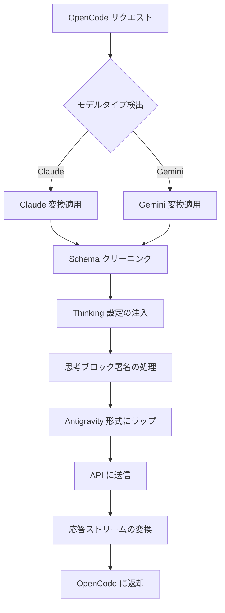

# リクエスト変換メカニズム: マルチモデルプロトコル対応

## 学習後にできること

- プラグインが OpenCode と Antigravity API 間でリクエスト形式をどのように変換するかを理解する
- Claude と Gemini モデルのプロトコル違いと変換ルールを習得する
- Schema 非互換性による 400 エラーの解決方法を身につける
- Thinking 設定を最適化して最高のパフォーマンスを得る

## 現在の課題

以下のような問題に遭遇しているかもしれません：

- ❌ MCP サーバーが `400 Unknown name 'parameters'` エラーを返す
- ❌ Gemini モデル使用時に `400 Unknown name 'const'` エラーが表示される
- ❌ Thinking モデルの思考ブロック表示形式が正しくない
- ❌ ツール呼び出しが失敗し、署名検証エラーが表示される
- ❌ プラグインが Claude と Gemini の両方をサポートできる理由が理解できない

## いつ使うか

以下の場合に必要です：

| シナリオ | 変換メカニズム理解が必要な理由 |
|---|---|
| カスタム MCP サーバーの開発 | Antigravity API 互換のツール Schema を確保するため |
| 400/500 エラーの解決 | Schema 問題と変換ロジック問題を区別するため |
| Thinking パフォーマンスの最適化 | 思考ブロック署名とキャッシュメカニズムを理解するため |
| ツール呼び出し失敗のデバッグ | ツール ID 割り当てとパラメータ署名を確認するため |

::: warning 前提チェック
本チュートリアルを開始する前に、以下を確認してください：
- ✅ opencode-antigravity-auth プラグインがインストールされている
- ✅ 使用可能なモデルとそのバリエーションについて理解している
- ✅ Thinking モデルの基本概念について理解している

[モデル一覧チュートリアル](../../platforms/available-models/) | [Thinking モデルチュートリアル](../../platforms/thinking-models/)
:::

## 核心コンセプト

リクエスト変換はプラグインの核心メカニズムであり、3 つの機能を提供します：

1. **OpenCode リクエストの攔截** — `fetch(generativeLanguage.googleapis.com)` 呼び出しを攔截する
2. **モデル変換の適用** — モデルタイプ（Claude/Gemini）に応じて形式を変換する
3. **ラッピングと送信** — Antigravity 形式にラップして API を呼び出す
4. **応答の変換** — 応答を OpenCode が認識できる形式に変換する

**変換フロー図**：



**主要変換ポイント**：

| 変換タイプ | 目的 | ソースコード位置 |
|---|---|---|
| Schema クリーニング | Antigravity API 非対応フィールドの削除 | `src/plugin/request-helpers.ts` |
| Thinking 設定 | モデル族に応じた正しい思考設定の注入 | `src/plugin/transform/claude.ts`, `src/plugin/transform/gemini.ts` |
| 思考ブロック処理 | 履歴思考ブロックの剥離と署名注入 | `src/plugin/request.ts` |
| 応答ストリーム変換 | SSE イベントの OpenCode 形式への変換 | `src/plugin/core/streaming.ts` |

## 実践ガイド

### ステップ 1: Claude 変換ルールを理解する

**理由**
Claude モデルは異なるプロトコル形式（snake_case、VALIDATED モード）を使用するため、特別な処理が必要です。

**主要変換ルール**

| 元の形式 | 変換後の形式 | 説明 |
|---|---|---|
| `toolConfig.functionCallingConfig.mode` | `"VALIDATED"` | ツール呼び出し検証を強制的に有効化 |
| `thinkingConfig.includeThoughts` | `include_thoughts` | snake_case 形式 |
| `thinkingConfig.thinkingBudget` | `thinking_budget` | snake_case 形式 |
| `maxOutputTokens` | 自動的に 64,000 に調整 | Thinking モデルにより大きな出力空間が必要 |

**コード位置**：[`src/plugin/transform/claude.ts:43-56`](https://github.com/NoeFabris/opencode-antigravity-auth/blob/main/src/plugin/transform/claude.ts#L43-L56)

**サンプル**

```typescript
// 変換前（OpenCode 形式）
{
  "toolConfig": {
    "functionCallingConfig": {
      "mode": "AUTO"
    }
  },
  "thinkingConfig": {
    "includeThoughts": true,
    "thinkingBudget": 32000
  }
}

// 変換後（Antigravity 形式）
{
  "toolConfig": {
    "functionCallingConfig": {
      "mode": "VALIDATED"  // VALIDATED を強制
    }
  },
  "thinkingConfig": {
    "include_thoughts": true,  // snake_case
    "thinking_budget": 32000   // snake_case
  },
  "generationConfig": {
    "maxOutputTokens": 64000   // Thinking モデル自動調整
  }
}
```

**確認すべきポイント**：
- Claude モデルのすべての変換は snake_case 命名規則に従う
- `maxOutputTokens` は十分な大きな値（`CLAUDE_THINKING_MAX_OUTPUT_TOKENS = 64,000`）に自動調整される

### ステップ 2: Gemini 変換ルールを理解する

**理由**
Gemini モデルは camelCase 形式を使用し、JSON Schema に厳格な要件（type は大文字）があります。

**主要変換ルール**

| 元の形式 | 変換後の形式 | 説明 |
|---|---|---|
| JSON Schema `type: "object"` | `type: "OBJECT"` | 型は大文字である必要がある |
| `additionalProperties: false` | 削除 | Gemini API はサポートしない |
| `$ref: "#/$defs/Foo"` | `description: "See: Foo"` に変換 | 参照を説明に変換 |
| `const: "foo"` | `enum: ["foo"]` | const を enum に変換 |
| `enum: ["a", "b"]` | 説明ヒント `(Allowed: a, b)` を追加 | 2-10 項目の enum に自動追加 |

**コード位置**：[`src/plugin/transform/gemini.ts:52-124`](https://github.com/NoeFabris/opencode-antigravity-auth/blob/main/src/plugin/transform/gemini.ts#L52-L124)

**サンプル**

```json
// 変換前（OpenCode 形式）
{
  "parameters": {
    "type": "object",
    "properties": {
      "status": {
        "type": "string",
        "const": "active",
        "enum": ["active", "inactive"]
      }
    }
  }
}

// 変換後（Gemini 形式）
{
  "parameters": {
    "type": "OBJECT",  // 大文字
    "properties": {
      "status": {
        "type": "STRING",  // 大文字
        "enum": ["active", "inactive"],  // const が削除される
        "description": "(Allowed: active, inactive)"  // 自動追加されたヒント
      }
    }
  }
}
```

**確認すべきポイント**：
- Gemini Schema のすべての型は大文字に変換される（`STRING`、`OBJECT`、`ARRAY`）
- `const` フィールドは削除され `enum` に変換される
- サポートされていないフィールド（`$ref`、`additionalProperties`）は削除される

### ステップ 3: Schema クリーニングフローを理解する

**理由**
Antigravity API は厳格な protobuf-backed バリデーションを使用し、標準 JSON Schema のすべてのフィールドをサポートしていません。

**4 段階クリーニングフロー**

1. **フェーズ 1a: $ref を説明に変換**
   - `$ref: "#/$defs/Foo"` → `{ description: "See: Foo" }`

2. **フェーズ 1b: const を enum に変換**
   - `const: "foo"` → `enum: ["foo"]`

3. **フェーズ 1c: 列挙ヒントを追加**
   - `enum: ["a", "b"]` → 説明に `(Allowed: a, b)` を追加

4. **フェーズ 1d: サポートされていないフィールドを削除**
   - 削除対象: `$schema`、`$defs`、`additionalProperties`、`pattern`、`minLength`、`maxLength` など

**コード位置**：[`src/plugin/request-helpers.ts:20-280`](https://github.com/NoeFabris/opencode-antigravity-auth/blob/main/src/plugin/request-helpers.ts#L20-L280)

**サポートされていないフィールド一覧**：

| フィールド | サポートされていない理由 | 代替案 |
|---|---|---|
| `$ref` | 参照は許可されていない | 説明ヒントに変換 |
| `const` | 定数は許可されていない | `enum` を使用 |
| `additionalProperties` | 追加プロパティは検証されない | 説明に記載 |
| `$schema`、`$defs` | JSON Draft は使用しない | 削除 |
| `pattern`、`minLength`、`maxLength` | 文字列制約はサーバー側で処理 | 削除 |
| `minItems`、`maxItems` | 配列制約はサーバー側で処理 | 削除 |

**確認すべきポイント**：
- MCP サーバーの Schema は Antigravity 互換形式にクリーニングされる
- 400 エラーが減少し、エラーメッセージがより明確になる

### ステップ 4: 思考ブロック処理メカニズムを理解する

**理由**
Claude および Gemini 3 モデルには、安定した思考ブロック署名が必要です。そうでないと、署名検証エラーが発生します。

**3 段階処理フロー**

1. **履歴思考ブロックの剥離**
   - すべての履歴 `thinking` ブロックを再帰的に削除（署名競合を回避）
   - キャッシュを使用して署名の有効性を検証

2. **新しい思考署名の注入**
   - 新しい思考ブロックに安定した署名を生成
   - マルチターン会話のために署名をキャッシュ

3. **思考ブロック順序の保証**
   - Claude: thinking は tool_use より前にある必要がある
   - Gemini: thinking は任意の位置に出現可能

**コード位置**：
- [`src/plugin/request.ts:711-724`](https://github.com/NoeFabris/opencode-antigravity-auth/blob/main/src/plugin/request.ts#L711-L724)

**思考ブロック署名のサンプル**：

```typescript
// Claude Thinking ブロック形式
{
  "type": "thinking",
  "text": "ユーザーのニーズを分析する必要があります...",
  "signature": "sig-abc123",  // プラグインが注入する署名
  "cache_control": { "type": "ephemeral" }  // キャッシュ制御
}

// 履歴思考ブロック（剥離される）
{
  "type": "thinking",
  "text": "古い分析...",  // 削除される
  "signature": "sig-old456"  // 署名が無効
}
```

**確認すべきポイント**：
- マルチターン会話中、履歴思考ブロックは繰り返し表示されない
- 新しい思考ブロックは正しい署名を持つ
- ツール呼び出しの前に完全な思考プロセスがある

### ステップ 5: 応答ストリーミング変換を理解する

**理由**
Antigravity API は SSE（Server-Sent Events）ストリームを返し、OpenCode が認識できる形式に変換する必要があります。

**主要変換ルール**

| 元の形式 | 変換後の形式 | 説明 |
|---|---|---|
| `thought: true` | `type: "reasoning"` | 思考ブロック形式の変換 |
| `text` | 変更なし | テキストコンテンツ |
| `tool_use` | 変更なし | ツール呼び出し |
| `tool_result` | 変更なし | ツール結果 |

**コード位置**：[`src/plugin/core/streaming.ts`](https://github.com/NoeFabris/opencode-antigravity-auth/blob/main/src/plugin/core/streaming.ts)

**SSE イベントのサンプル**：

```
// Antigravity API が返す
{"type": "thinking", "text": "分析中...", "thought": true}

// 変換後
data: {"type": "reasoning", "text": "分析中..."}

// テキストイベント
{"type": "text", "text": "こんにちは"}

// ツール呼び出しイベント
{"type": "tool_use", "id": "tool-123", "name": "my_function"}
```

**確認すべきポイント**：
- 思考ブロックはインターフェースで `reasoning` タイプとして正しく表示される
- ストリーミング応答に遅延がなく、行ごとに変換される
- ツール呼び出しイベント形式が正しい

## チェックポイント ✅

上記のステップを完了したら、以下の質問に答えられるはずです：

- [ ] Claude モデルの `toolConfig.mode` は何に設定されますか？
- [ ] Gemini Schema の `type: "string"` は何に変換されますか？
- [ ] なぜ履歴思考ブロックを剥離する必要があるのですか？
- [ ] `const` フィールドは何の形式に変換されますか？
- [ ] 思考ブロックの署名には何の役割がありますか？

## よくある落とし穴

### 落とし穴 1: MCP Schema に $ref が含まれて 400 エラーになる

**エラーメッセージ**：`400 Unknown name 'parameters'`

**原因**：MCP サーバーが JSON Schema の `$ref` 参照を使用しているが、Antigravity API はサポートしていません。

**解決策**：
- MCP サーバーの Schema 定義を確認する
- `$ref` を削除し、オブジェクト構造を直接展開する
- または MCP サーバーコードを修正する

**サンプル**：

```json
// ❌ エラー: $ref を使用
{
  "properties": {
    "data": { "$ref": "#/$defs/DataModel" }
  },
  "$defs": {
    "DataModel": { "type": "string" }
  }
}

// ✅ 正解: 直接展開
{
  "properties": {
    "data": { "type": "string" }
  }
}
```

### 落とし穴 2: const フィールドが Gemini モデルで 400 エラーになる

**エラーメッセージ**：`400 Unknown name 'const'`

**原因**：Antigravity API の Gemini エンドポイントは `const` フィールドをサポートしていません。

**解決策**：
- `const` を手動で `enum` に変換する
- またはプラグインの自動変換に任せる（実装済み）

**サンプル**：

```json
// ❌ エラー: const を使用
{
  "properties": {
    "status": { "type": "string", "const": "active" }
  }
}

// ✅ 正解: enum を使用
{
  "properties": {
    "status": { "type": "string", "enum": ["active"] }
  }
}
```

### 落とし穴 3: Thinking モデルで文字化けする

**エラーメッセージ**：思考ブロックが `[object Object]` として表示されるか、形式が正しくない

**原因**：応答変換ロジックにバグがあるか、署名キャッシュが無効になっている

**解決策**：
1. デバッグログを確認：`opencode --debug`
2. 署名キャッシュをクリア：`~/.config/opencode/antigravity-accounts.json` のキャッシュフィールドを削除
3. OpenCode を再起動

### 落とし穴 4: ツール呼び出しが失敗し、署名エラーが表示される

**エラーメッセージ**：`tool_result_missing` または署名検証失敗

**原因**：
- 思考ブロックの順序が間違っている（thinking は tool_use の前に必要）
- 署名キャッシュに不整合がある
- ツール ID の割り当てが間違っている

**解決策**：
- プラグインは自動的に再試行する（セッション復旧メカニズム）
- デバッグモードを有効にして詳細エラーを確認
- ツール定義が正しいか確認

## 本レッスンのまとめ

リクエスト変換メカニズムの核心ポイント：

1. **モデル族が変換ルールを決定する** — Claude（snake_case、VALIDATED）vs Gemini（camelCase、Schema 大文字）
2. **Schema クリーニングは必須** — `$ref`、`const`、`additionalProperties` などの非対応フィールドを削除
3. **思考ブロック署名が鍵** — 安定した署名がマルチターン会話の一貫性を確保
4. **応答ストリーミング変換** — SSE イベントをリアルタイムで OpenCode 形式に変換

**主要ソースコード位置**：
- 主リクエスト変換：[`src/plugin/request.ts:585`](https://github.com/NoeFabris/opencode-antigravity-auth/blob/main/src/plugin/request.ts#L585)
- Claude 変換：[`src/plugin/transform/claude.ts`](https://github.com/NoeFabris/opencode-antigravity-auth/blob/main/src/plugin/transform/claude.ts)
- Gemini 変換：[`src/plugin/transform/gemini.ts`](https://github.com/NoeFabris/opencode-antigravity-auth/blob/main/src/plugin/transform/gemini.ts)
- Schema クリーニング：[`src/plugin/request-helpers.ts`](https://github.com/NoeFabris/opencode-antigravity-auth/blob/main/src/plugin/request-helpers.ts)
- ストリーミング変換：[`src/plugin/core/streaming.ts`](https://github.com/NoeFabris/opencode-antigravity-auth/blob/main/src/plugin/core/streaming.ts)

## 次回レッスンの予告

> 次回は **[セッション復旧メカニズム](../session-recovery/)** を学びます。
>
> 学ぶ内容：
> - セッション復旧の仕組み
> - ツール呼び出し失敗の自動処理方法
> - 破損した思考ブロック順序の修復方法

---

## 付録：ソースコードリファレンス

<details>
<summary><strong>クリックしてソースコード位置を表示</strong></summary>

> 更新日：2026-01-23

| 機能 | ファイルパス | 行番号 |
|---|---|---|
| 主リクエスト変換エントリポイント | [`src/plugin/request.ts`](https://github.com/NoeFabris/opencode-antigravity-auth/blob/main/src/plugin/request.ts#L585) | 585-1443 |
| 応答変換エントリポイント | [`src/plugin/request.ts`](https://github.com/NoeFabris/opencode-antigravity-auth/blob/main/src/plugin/request.ts#L1445) | 1445-1663 |
| Claude モデル検出 | [`src/plugin/transform/claude.ts`](https://github.com/NoeFabris/opencode-antigravity-auth/blob/main/src/plugin/transform/claude.ts#L27) | 27-29 |
| Claude Thinking 設定 | [`src/plugin/transform/claude.ts`](https://github.com/NoeFabris/opencode-antigravity-auth/blob/main/src/plugin/transform/claude.ts#L62) | 62-72 |
| Claude Tool 設定 | [`src/plugin/transform/claude.ts`](https://github.com/NoeFabris/opencode-antigravity-auth/blob/main/src/plugin/transform/claude.ts#L43) | 43-57 |
| Gemini モデル検出 | [`src/plugin/transform/gemini.ts`](https://github.com/NoeFabris/opencode-antigravity-auth/blob/main/src/plugin/transform/gemini.ts#L129) | 129-132 |
| Gemini 3 Thinking 設定 | [`src/plugin/transform/gemini.ts`](https://github.com/NoeFabris/opencode-antigravity-auth/blob/main/src/plugin/transform/gemini.ts) | `buildGemini3ThinkingConfig` を検索 |
| Gemini Schema 変換 | [`src/plugin/transform/gemini.ts`](https://github.com/NoeFabris/opencode-antigravity-auth/blob/main/src/plugin/transform/gemini.ts#L52) | 52-124 |
|---|---|---|
|---|---|---|
|---|---|---|
| 思考ブロック剥離 | [`src/plugin/request-helpers.ts`](https://github.com/NoeFabris/opencode-antigravity-auth/blob/main/src/plugin/request-helpers.ts) | `deepFilterThinkingBlocks` を検索 |
| 思考ブロック署名注入 | [`src/plugin/request.ts`](https://github.com/NoeFabris/opencode-antigravity-auth/blob/main/src/plugin/request.ts#L715) | 715-720 |
| ストリーミング応答変換 | [`src/plugin/core/streaming.ts`](https://github.com/NoeFabris/opencode-antigravity-auth/blob/main/src/plugin/core/streaming.ts) | 全文 |

**重要定数**：
- `CLAUDE_THINKING_MAX_OUTPUT_TOKENS = 64_000`（[`src/plugin/transform/claude.ts:18`](https://github.com/NoeFabris/opencode-antigravity-auth/blob/main/src/plugin/transform/claude.ts#L18)）：Claude Thinking モデルの最大出力トークン制限
- `UNSUPPORTED_SCHEMA_FIELDS`（[`src/plugin/transform/gemini.ts:27`](https://github.com/NoeFabris/opencode-antigravity-auth/blob/main/src/plugin/transform/gemini.ts#L27)）：Gemini API がサポートしない Schema フィールドのセット

**重要関数**：
- `prepareAntigravityRequest()`（[`src/plugin/request.ts:585`](https://github.com/NoeFabris/opencode-antigravity-auth/blob/main/src/plugin/request.ts#L585)）：Antigravity API リクエストを準備するメイン関数
- `transformAntigravityResponse()`（[`src/plugin/request.ts:1445`](https://github.com/NoeFabris/opencode-antigravity-auth/blob/main/src/plugin/request.ts#L1445)）：Antigravity API 応答を変換するメイン関数
- `toGeminiSchema()`（[`src/plugin/transform/gemini.ts:52`](https://github.com/NoeFabris/opencode-antigravity-auth/blob/main/src/plugin/transform/gemini.ts#L52)）：JSON Schema を Gemini 互換形式に変換
- `cleanJSONSchemaForAntigravity()`（[`src/plugin/request-helpers.ts`](https://github.com/NoeFabris/opencode-antigravity-auth/blob/main/src/plugin/request-helpers.ts)）：4 段階 Schema クリーニング
- `createStreamingTransformer()`（[`src/plugin/core/streaming.ts`](https://github.com/NoeFabris/opencode-antigravity-auth/blob/main/src/plugin/core/streaming.ts)）：SSE ストリーミング変換器を作成

</details>
