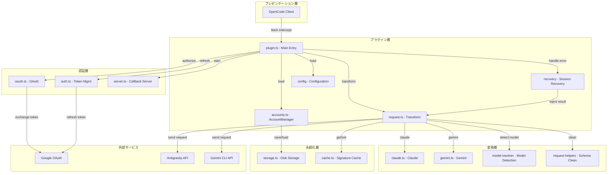
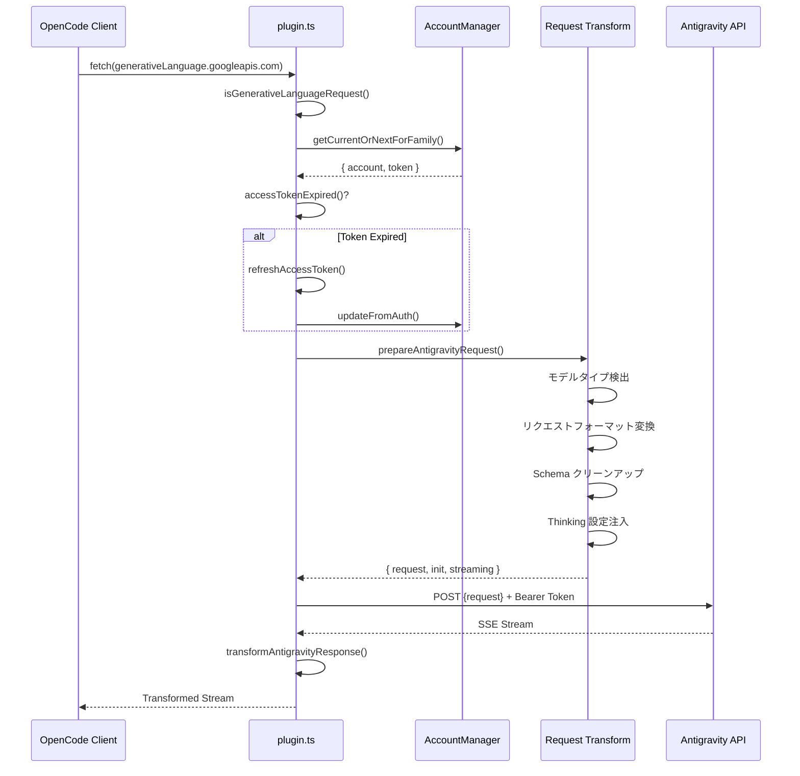
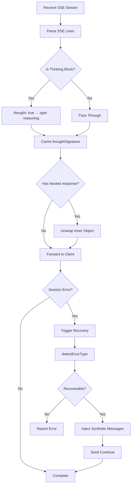
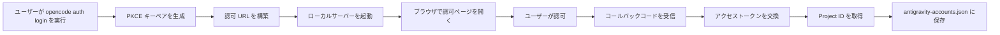

# プラグインアーキテクチャ概要：OpenCode Antigravity Auth の内部設計を理解する

## 学習後の目標

このコースでは、Antigravity Auth プラグインのアーキテクチャ設計と内部動作原理を深く理解します。学習を完了すると、以下のことができるようになります：

- プラグインのモジュール構造と各モジュールの責務を理解する
- OpenCode から Antigravity API へのリクエスト完全処理フローを習得する
- マルチアカウント管理のロードバランシングメカニズムを理解する
- セッション回復の動作原理を理解する
- リクエストフォーマット変換の技術詳細を習得する

## プラグインのコア価値

Antigravity Auth プラグインのコア役割は、OpenCode と Antigravity API の間に「翻訳ブリッジ」を構築することです：

1. **プロトコル変換** - OpenCode のリクエストフォーマットを Antigravity API が要求するフォーマットに変換
2. **認証管理** - Google OAuth 2.0 PKCE 経由でアクセストークンを安全に取得・更新
3. **ロードバランシング** - マルチアカウントプーリング、自動ローテーションによるレート制限回避
4. **エラー回復** - セッション中断の自動検出と修復

::: info なぜアーキテクチャ理解が必要ですか？
プラグインアーキテクチャを理解すると、以下が可能になります：
- 問題があるモジュールを迅速に特定
- 設定項目の作用範囲を理解
- マルチアカウント利用戦略の最適化
- プラグインの開発とデバッグへの参加
:::

## モジュール構造概要

プラグインはレイヤードアーキテクチャを採用し、各モジュールの責務が明確です：



### 各モジュールの責務

| モジュール | ファイル | 責務 |
|--- | --- | ---|
| **メインエントリ** | `plugin.ts` | fetch インターセプター、プラグイン初期化、イベント処理 |
| **アカウント管理** | `accounts.ts` | マルチアカウントプール、ロードバランシング戦略、レート制限追跡 |
| **リクエスト変換** | `request.ts` | リクエストフォーマット変換、レスポンスストリーミング処理 |
| **モデル変換** | `transform/` | Claude/Gemini 固有変換ロジック |
| **OAuth 認証** | `antigravity/oauth.ts` | PKCE 認証フロー、トークン交換 |
| **セッション回復** | `recovery/` | エラー検出、中断セッションの自動修復 |
| **設定管理** | `config/` | 設定ロード、Schema 検証 |
| **ストレージ層** | `storage.ts` | アカウント永続化（JSON ファイル） |
| **キャッシュ層** | `cache.ts` | 署名キャッシュ、重複計算の削減 |
| **デバッグログ** | `debug.ts` | 構造化ログ、トラブルシューティング |

## リクエスト処理フロー

OpenCode からモデルリクエストが送信されると、プラグインは完全な処理チェーンを通過します：



### ステップ詳細解説

**ステップ 1：リクエストインターセプト**
- プラグインは `fetch` インターセプター経由で `generativelanguage.googleapis.com` へのすべてのリクエストをキャプチャ
- `isGenerativeLanguageRequest()` を使用して Antigravity 関連リクエストかどうかを判定
- 対象外リクエストはそのまま透過し、他の機能への影響を回避

**ステップ 2：アカウント選択**
- アカウントプールから利用可能なアカウントを選択（設定された戦略に基づき：sticky/round-robin/hybrid）
- トークンが有効期限切れかどうかを確認し、期限切れの場合は自動更新
- PID オフセットを適用（有効な場合）、マルチエージェントシナリオでアカウント分散を確保

**ステップ 3：リクエスト変換** (`request.ts`)
- **モデル検出**：Claude モデルか Gemini モデルかを識別
- **Thinking 処理**：
  - Claude：すべての履歴思考ブロックを削除し、署名競合を回避
  - Gemini：`thinkingConfig` 設定を追加
- **Tool 変換**：OpenCode tools を `functionDeclarations` フォーマットに変換
- **Schema クリーンアップ**：サポートされていない JSON Schema フィールド（`const`, `$ref`, `$defs` など）を削除
- **リクエストラップ**：`{ project, model, request: {...} }` フォーマットにカプセル化

**ステップ 4：リクエスト送信**
- Antigravity 専用ヘッダーを追加（User-Agent, Client-Metadata）
- Bearer Token 認証を使用
- endpoint fallback をサポート（daily → autopush → prod）

**ステップ 5：レスポンス変換**
- SSE ストリーミング受信、行ごとに変換
- `thought: true` を `type: "reasoning"` に変換
- Thinking 署名をキャッシュし、後続リクエストで使用
- 内部 `response` オブジェクトを展開し、フォーマットの一貫性を維持


## レスポンス処理フロー

レスポンス処理は主にストリーミング変換とセッション回復に関わります：



### 重要な処理メカニズム

**1. 思考ブロック変換**

Antigravity API が返す思考ブロックフォーマット：
```json
{ "thought": true, "text": "思考内容" }
```

プラグインはこれを OpenCode 互換フォーマットに変換：
```json
{ "type": "reasoning", "reasoning": "思考内容" }
```

**2. 署名キャッシュ**

Claude と Gemini 3 モデルはマルチターン対話で思考ブロック署名の一致を必要とします：
- レスポンスから `thoughtSignature` を抽出
- `cacheSignature()` を使用してメモリとディスクに保存
- 次回リクエスト時に `getCachedSignature()` 経由で取得し注入

::: tip なぜ署名キャッシュが必要ですか？
Claude と Gemini 3 API はツール呼び出し前の思考ブロックに正しい署名が必要です。署名キャッシュは：
- 署名エラーによるリクエスト失敗を回避
- 同じ思考内容の重複生成を削減
- マルチターン対話の一貫性を向上
:::

**3. セッション回復**

セッションエラーが検出されたとき：
1. `session.error` イベント経由でエラーをキャプチャ
2. `detectErrorType()` を呼び出して回復可能かどうかを判定
3. `tool_result_missing` エラーの場合：
   - 失敗した `tool_use` ID を抽出
   - synthetic `tool_result` メッセージを注入
   - 自動的に "continue" を送信（有効な場合）
4. 思考ブロック順序エラーの場合：
   - 対話状態を分析
   - 破損した turn を閉じる
   - 新しい turn を開始し、モデルに再生成させる


## コアメカニズム詳細解説

### OAuth 認証メカニズム

プラグインは OAuth 2.0 with PKCE（Proof Key for Code Exchange）フローを使用します：



**PKCE セキュリティ**：
- ランダムな `code_verifier` と `code_challenge` を生成
- 認可 URL に `code_challenge` を含め、中間者攻撃を防止
- トークン交換時に `code_verifier` を検証し、同一クライアントからのリクエストを確保

**トークン管理**：
- Access Token：デフォルトで 1 時間有効、期限切れ 30 分前に自動更新
- Refresh Token：長期有効、新しい Access Token 取得に使用
- `~/.config/opencode/antigravity-accounts.json` に永続化

### マルチアカウント管理メカニズム

マルチアカウント管理はプラグインのコア機能の一つであり、以下の主要コンポーネントを含みます：

**1. アカウントプール構造**

```typescript
interface AccountPool {
  version: 3;
  accounts: Account[];
  activeIndex: number;
  activeIndexByFamily: {
    claude: number;
    gemini: number;
  };
}
```

**2. アカウント選択戦略**

| 戦略 | 説明 | 適用シナリオ |
|--- | --- | ---|
| **sticky** | レート制限まで現在のアカウントを維持 | 単一セッション使用、プロンプトキャッシュを保持 |
| **round-robin** | 各リクエストごとに次のアカウントにローテーション | マルチセッション並列、スループット最大化 |
| **hybrid** | 健康スコア + Token bucket + LRU 総合判断 | デフォルト戦略、パフォーマンスと信頼性をバランス |

**3. レート制限追跡**

各アカウントはモデルファミリーごとに独立して追跡：
- `claude`：Claude モデルのクォータ
- `gemini-antigravity`：Gemini Antigravity クォータ
- `gemini-cli`：Gemini CLI クォータ

レート制限ステータスには以下が含まれます：
- `rateLimitResetTimes`：各クォータのリセット時刻
- `cooldownEndAt`：アカウントクールダウン終了時刻
- `consecutiveFailures`：連続失敗回数

**4. デュアルクォータプール（Gemini 専用）**

Gemini モデルは 2 つの独立したクォータプールをサポート：
- **Antigravity クォータ**：日常のサンドボックス環境
- **Gemini CLI クォータ**：本番環境

`quota_fallback` 設定経由で：
- 優先クォータ（モデルサフィックスで決定）を優先使用
- 優先クォータ枯渇後、バックアップクォータを試行
- 両プール枯渇時、次のアカウントに切り替え

**5. PID オフセット最適化**

`pid_offset_enabled` を有効にすると：
- 異なるプロセス（PID）のエージェントが異なるアカウントから開始
- すべてのエージェントが同一アカウントを競合することを回避
- マルチエージェント並列シナリオに適用


### リクエスト変換メカニズム

リクエスト変換はプラグインで最も複雑な部分であり、異なるモデルのプロトコル差異を処理する必要があります：

**Claude モデル変換のポイント**：

1. **思考ブロック処理**
   ```typescript
   // すべての履歴思考ブロックを削除（署名競合を回避）
   const filteredContents = deepFilterThinkingBlocks(contents);

   // 新しい thinkingConfig を構築
   const thinkingConfig = {
     budgetTokens: variantThinkingConfig?.budget || DEFAULT_THINKING_BUDGET,
   };
   ```

2. **Tool Schema クリーンアップ**
   - ホワイトリスト保持：`type`, `properties`, `required`, `description`, `enum`, `items`
   - 削除フィールド：`const`, `$ref`, `$defs`, `default`, `examples`, `additionalProperties`, `$schema`, `title`
   - 特別変換：`const: "value"` → `enum: ["value"]`

3. **ツールパラメータ署名注入**
   ```typescript
   injectParameterSignatures(tool, signature) {
     tool.description += `\n\nParameters: ${signature}`;
   }
   ```

**Gemini モデル変換のポイント**：

1. **Thinking 設定**
   ```typescript
   // Gemini 3 Pro/Flash
   if (isGemini3Model(model)) {
     request.thinkingConfig = {
       thinkingLevel: "high" | "medium" | "low" | "minimal",
     };
   }

   // Gemini 2.5
   else if (isGemini2Model(model)) {
     request.thinkingConfig = {
       thinkingLevel: "high" | "medium" | "low",
     };
   }
   ```

2. **Google Search Grounding**
   ```typescript
   if (webSearchConfig) {
     request.generationConfig = {
       ...request.generationConfig,
       dynamicRetrievalConfig: {
         mode: webSearchConfig.mode, // "auto" | "off"
         dynamicRetrievalConfig: {
           scoreThreshold: webSearchConfig.threshold, // 0.0 - 1.0
         },
       },
     };
   }
   ```

3. **画像生成設定**
   ```typescript
   if (isImageGenerationModel(model)) {
     request.generationConfig = {
       ...request.generationConfig,
       responseModalities: ["IMAGE", "TEXT"],
     };
   }
   ```

### セッション回復メカニズム

セッション回復メカニズムは、予期せぬ中断後に対話を継続できるようにします：

**1. エラー検出**

```typescript
function detectErrorType(error: unknown): RecoverableError | null {
  if (errorString.includes("tool_use ids were found without tool_result")) {
    return { type: "tool_result_missing" };
  }
  if (errorString.includes("Expected thinking but found text")) {
    return { type: "thinking_order_error" };
  }
  return null;
}
```

**2. Turn 境界検出**

```typescript
// Turn 境界 = ユーザーメッセージ後の最初のアシスタントメッセージ
function analyzeConversationState(messages: Message[]): ConversationState {
  const lastUserMessage = findLastMessageByRole(messages, "user");
  const firstAssistantAfterUser = messages.find(m =>
    m.role === "assistant" && m.timestamp > lastUserMessage.timestamp
  );

  return {
    isTurnStart: true,
    turnAssistantMessage: firstAssistantAfterUser,
  };
}
```

**3. Synthetic メッセージ注入**

```typescript
// synthetic tool_result を注入
function createSyntheticErrorResponse(toolUseIds: string[]): Message[] {
  return toolUseIds.map(id => ({
    type: "tool_result",
    tool_use_id: id,
    content: "Operation cancelled",
    isSynthetic: true,
  }));
}

// 破損した turn を閉じる
function closeToolLoopForThinking(sessionId: string): Message[] {
  return [
    {
      type: "text",
      text: "[Conversation turn closed due to error]",
      isSynthetic: true,
    },
  ];
}
```

**4. Auto-Resume**

`auto_resume` を有効にすると、回復フローは自動的に継続命令を送信します：
```typescript
await client.session.prompt({
  path: { id: sessionID },
  body: { parts: [{ type: "text", text: config.resume_text }] },
  query: { directory },
});
```


## 本レッスンまとめ

このレッスンでは、Antigravity Auth プラグインのアーキテクチャ設計を深く解析しました：

**コアアーキテクチャ**：
- レイヤードモジュール設計、責務が明確
- プラグイン層、認証層、変換層、永続化層がそれぞれの役割を果たす
- `plugin.ts` を統一エントリとして各モジュールを調整

**リクエストフロー**：
- インターセプト → アカウント選択 → トークン更新 → リクエスト変換 → リクエスト送信 → レスポンス変換
- 各ステップで詳細なエラー処理とリトライメカニズム

**重要なメカニズム**：
- **OAuth 2.0 PKCE**：安全な認証フロー
- **マルチアカウント管理**：ロードバランシング、レート制限追跡、デュアルクォータプール
- **リクエスト変換**：プロトコル互換、Schema クリーンアップ、Thinking 処理
- **セッション回復**：エラー自動検出、synthetic メッセージ注入、Auto-Resume

これらのメカニズムを理解することで、プラグインの設定をより適切に使用・最適化でき、プラグインの開発とデバッグに参加できるようになります。

## 次のレッスンの予告

> 次のレッスンでは **[Antigravity API 内部仕様](../api-spec/)** を学びます。
>
> 以下を学習できます：
> - Antigravity API のリクエストとレスポンスフォーマット
> - 各エンドポイントの機能とパラメータ
> - エラーコードとステータスコードの意味
> - 高度な機能と実験的機能

---

## 付録：ソースコード参照

<details>
<summary><strong>クリックしてソースコードの場所を表示</strong></summary>

> 更新日：2026-01-23

| 機能 | ファイルパス | 行番号 |
|--- | --- | ---|
| プラグインメインエントリ、fetch インターセプター | [`src/plugin.ts`](https://github.com/NoeFabris/opencode-antigravity-auth/blob/main/src/plugin.ts) | 654-1334 |
| アカウントマネージャー、ロードバランシング | [`src/plugin/accounts.ts`](https://github.com/NoeFabris/opencode-antigravity-auth/blob/main/src/plugin/accounts.ts) | 1-715 |
| リクエスト変換、レスポンスストリーミング | [`src/plugin/request.ts`](https://github.com/NoeFabris/opencode-antigravity-auth/blob/main/src/plugin/request.ts) | 1-1664 |
| Claude モデル変換 | [`src/plugin/transform/claude.ts`](https://github.com/NoeFabris/opencode-antigravity-auth/blob/main/src/plugin/transform/claude.ts) | 全文 |
| Gemini モデル変換 | [`src/plugin/transform/gemini.ts`](https://github.com/NoeFabris/opencode-antigravity-auth/blob/main/src/plugin/transform/gemini.ts) | 全文 |
| セッション回復 | [`src/plugin/recovery/index.ts`](https://github.com/NoeFabris/opencode-antigravity-auth/blob/main/src/plugin/recovery/index.ts) | 全文 |
| 思考ブロック回復 | [`src/plugin/recovery/thinking-recovery.ts`](https://github.com/NoeFabris/opencode-antigravity-auth/blob/main/src/plugin/recovery/thinking-recovery.ts) | 全文 |
| OAuth 認証 | [`src/antigravity/oauth.ts`](https://github.com/NoeFabris/opencode-antigravity-auth/blob/main/src/antigravity/oauth.ts) | 1-271 |
| トークン管理 | [`src/plugin/token.ts`](https://github.com/NoeFabris/opencode-antigravity-auth/blob/main/src/plugin/token.ts) | 全文 |
| 設定 Schema | [`src/plugin/config/schema.ts`](https://github.com/NoeFabris/opencode-antigravity-auth/blob/main/src/plugin/config/schema.ts) | 1-373 |
| アカウントストレージ | [`src/plugin/storage.ts`](https://github.com/NoeFabris/opencode-antigravity-auth/blob/main/src/plugin/storage.ts) | 全文 |
| 署名キャッシュ | [`src/plugin/cache.ts`](https://github.com/NoeFabris/opencode-antigravity-auth/blob/main/src/plugin/cache.ts) | 全文 |
| デバッグログ | [`src/plugin/debug.ts`](https://github.com/NoeFabris/opencode-antigravity-auth/blob/main/src/plugin/debug.ts) | 全文 |

**重要な定数**：
- `MAX_OAUTH_ACCOUNTS = 10`：最大アカウント数
- `RATE_LIMIT_DEDUP_WINDOW_MS = 2000`：レート制限重複排除ウィンドウ（2 秒）
- `RATE_LIMIT_STATE_RESET_MS = 120000`：レート制限状態リセット時間（2 分）
- `FAILURE_COOLDOWN_MS = 30000`：アカウントクールダウン時間（30 秒）

**重要な関数**：
- `createAntigravityPlugin()`：プラグインメインエントリ関数
- `prepareAntigravityRequest()`：リクエスト変換メイン関数
- `transformAntigravityResponse()`：レスポンスストリーミング変換関数
- `AccountManager.getCurrentOrNextForFamily()`：アカウント選択関数
- `handleSessionRecovery()`：セッション回復処理関数
- `refreshAccessToken()`：トークン更新関数

</details>
