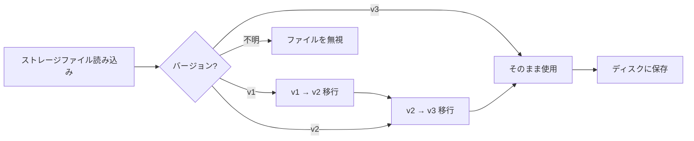

# アカウントストレージ形式とバージョン管理

## このレッスンで学べること

- アカウントストレージファイルの構造と各フィールドの意味を理解する
- ストレージファイルを手動で編集する（必要な場合のみ）
- バージョン移行メカニズムと互換性を理解する
- マシン間でアカウント設定を移行する

## 現在直面している課題

以下のような状況に遭遇しているかもしれません：

- アカウントをバックアップしたり、別のマシンに移行したい
- `projectId` を手動で変更したり、無効なアカウントを削除したい
- バージョン警告や移行ログが表示され、何が起きているか知りたい
- 複数のマシン間でアカウント状態を同期したい

## ファイルの場所

アカウントストレージファイルの場所：

| OS | パス |
| --- | --- |
| macOS/Linux | `~/.config/opencode/antigravity-accounts.json` |
| Windows | `%APPDATA%\opencode\antigravity-accounts.json` |

::: warning セキュリティに関する注意
このファイルには **OAuth refresh tokens** が含まれており、パスワードファイルと同等です。他人と共有したり、Git リポジトリにコミットしないでください。
:::

## ストレージ形式のバージョン

ストレージ形式にはバージョン管理があり、現在は **v3** です。プラグインはバージョン移行を自動的に処理するため、手動での介入は不要です。

### v3 形式（現行バージョン）

```json
{
  "version": 3,
  "accounts": [
    {
      "email": "user1@gmail.com",
      "refreshToken": "1//0abc...",
      "projectId": "my-gcp-project",
      "managedProjectId": "managed-project-123",
      "addedAt": 1737600000000,
      "lastUsed": 1737603600000,
      "lastSwitchReason": "initial",
      "rateLimitResetTimes": {
        "claude": 1737607200000,
        "gemini-antigravity": 1737607200000,
        "gemini-cli": 1737607200000
      },
      "coolingDownUntil": 1737600000000,
      "cooldownReason": "auth-failure"
    }
  ],
  "activeIndex": 0,
  "activeIndexByFamily": {
    "claude": 0,
    "gemini": 0
  }
}
```

**フィールドの説明**：

| フィールド | 型 | 必須 | 説明 |
| --- | --- | --- | --- |
| `version` | number | Y | ストレージ形式のバージョン（固定値 3） |
| `accounts` | array | Y | アカウントリスト |
| `activeIndex` | number | Y | 現在のアクティブアカウントのインデックス（0 から開始） |
| `activeIndexByFamily` | object | N | モデルファミリー別のアクティブアカウント追跡（`claude`/`gemini`） |

**アカウントオブジェクトのフィールド**：

| フィールド | 型 | 必須 | 説明 |
| --- | --- | --- | --- |
| `email` | string | N | Google アカウントのメールアドレス |
| `refreshToken` | string | Y | OAuth refresh トークン（一意の識別子） |
| `projectId` | string | N | GCP プロジェクト ID（Gemini CLI モデルに必要） |
| `managedProjectId` | string | N | マネージドプロジェクト ID |
| `addedAt` | number | Y | 追加日時のタイムスタンプ（Unix ミリ秒） |
| `lastUsed` | number | Y | 最終使用日時のタイムスタンプ |
| `lastSwitchReason` | string | N | 切り替え理由：`"rate-limit"` / `"initial"` / `"rotation"` |
| `rateLimitResetTimes` | object | N | レート制限リセット時刻（クォータプール別に追跡） |
| `coolingDownUntil` | number | N | アカウントクールダウン終了時刻のタイムスタンプ |
| `cooldownReason` | string | N | クールダウン理由：`"auth-failure"` / `"network-error"` / `"project-error"` |

### v2 形式（旧バージョン）

v2 形式は v3 と似ていますが、以下の違いがあります：

- `rateLimitResetTimes` には `claude` と `gemini` の 2 つのフィールドのみ
- `coolingDownUntil` と `cooldownReason` がない
- `activeIndexByFamily` がない（すべてのモデルで 1 つのアクティブアカウントを共有）

移行時、`gemini` フィールドは `gemini-antigravity` にマッピングされ、`gemini-cli` クォータプールは空で初期化されます。

### v1 形式（旧バージョン）

v1 形式はブール値フラグと単一のタイムスタンプを使用：

```json
{
  "version": 1,
  "accounts": [
    {
      "email": "user1@gmail.com",
      "refreshToken": "1//0abc...",
      "isRateLimited": true,
      "rateLimitResetTime": 1737607200000
    }
  ],
  "activeIndex": 0
}
```

移行時、`isRateLimited` が `true` で `rateLimitResetTime` が期限切れでない場合、`claude` と `gemini` の両方のリセット時刻が設定されます。

## バージョン移行メカニズム

プラグインはストレージファイルの読み込み時にバージョンを自動検出し、移行を実行します：



**移行ルール**：

1. **自動移行**：移行後、新しい形式が自動的にディスクに保存される
2. **データ保持**：期限切れでないレート制限状態は保持される
3. **失敗時のフォールバック**：保存に失敗した場合、メモリ内で移行後のデータを使用し続ける
4. **前方互換性**：新しいバージョンのプラグインは古い形式のファイルを読み取れる

## ストレージメカニズムの詳細

### ファイルロック

`proper-lockfile` を使用してマルチプロセスでの安全なアクセスを確保：

- **ロックメカニズム**：書き込み時にロックファイル（`.antigravity-accounts.json.lock`）を作成
- **タイムアウト設定**：ロックファイルは 10 秒後に期限切れ（デッドロック防止）
- **リトライ戦略**：最大 5 回リトライ、バックオフ時間 100ms → 1000ms
- **アトミック書き込み**：まず一時ファイル（`.tmp`）に書き込み、その後ターゲットファイルにリネーム

### アカウントのマージ

複数のプロセスが同時にストレージファイルに書き込む場合、マージ戦略が実行されます：

```typescript
// マージロジック
function mergeAccountStorage(existing, incoming) {
  // refreshToken をキーとしてアカウントをマージ
  // 手動設定された projectId/managedProjectId を保持
  // rateLimitResetTimes をマージ
  // より大きい lastUsed を保持
}
```

### 重複排除メカニズム

`email` に基づいて重複を排除し、各メールアドレスの最新アカウント（`lastUsed` 順、次に `addedAt` 順）を保持：

```typescript
// 重複排除ルール
1. email がないアカウント → 保持（重複排除不可）
2. 同じ email のアカウント → lastUsed が最大のものを保持
3. lastUsed が同じ → addedAt が最大のものを保持
```

## 手動編集ガイド

::: danger 手動編集のリスク
ストレージファイルを編集する際、プラグインプロセスが実行中であってはなりません。そうでないと上書きされる可能性があります。編集前に OpenCode を停止することをお勧めします。
:::

### アカウントの追加

アカウントを手動で追加する場合、少なくとも `refreshToken` を提供する必要があります：

```json
{
  "accounts": [
    {
      "refreshToken": "他のマシンからコピーするか OAuth フローから取得",
      "email": "user@example.com",
      "addedAt": Date.now(),
      "lastUsed": Date.now()
    }
  ]
}
```

### アカウントの削除

`accounts` 配列から対応するエントリを削除し、`activeIndex` を調整します：

```json
{
  "accounts": [
    { "email": "user1@gmail.com", "refreshToken": "..." },  // 保持
    // { "email": "user2@gmail.com", "refreshToken": "..." },  // 削除
    { "email": "user3@gmail.com", "refreshToken": "..." }   // 保持
  ],
  "activeIndex": 0  // インデックスが有効な範囲内であることを確認
}
```

### projectId の変更

アカウントに `projectId` を追加または変更：

```json
{
  "accounts": [
    {
      "email": "user@gmail.com",
      "refreshToken": "1//0abc...",
      "projectId": "your-gcp-project-id"  // 追加または変更
    }
  ]
}
```

### レート制限状態のクリア

レート制限フラグを手動でクリア：

```json
{
  "accounts": [
    {
      "email": "user@gmail.com",
      "refreshToken": "1//0abc...",
      "rateLimitResetTimes": {}  // 空にするかこのフィールドを削除
    }
  ]
}
```

## マシン間の移行

### シンプルな移行

ストレージファイルをターゲットマシンの設定ディレクトリに直接コピー：

```bash
# macOS/Linux
cp ~/.config/opencode/antigravity-accounts.json /path/to/backup/

# Windows
copy %APPDATA%\opencode\antigravity-accounts.json backup\
```

### アカウントのマージ

ターゲットマシンに既にアカウントがある場合、プラグインは自動的にマージします（`refreshToken` に基づいて重複排除）。

**手動マージの手順**：

1. 両方のマシンのストレージファイルをバックアップ
2. 両方のファイルを開き、ターゲットアカウント配列をソースファイルにコピー
3. `activeIndex` と `activeIndexByFamily` を調整
4. 保存してプラグインを再起動

## よくある質問

### 移行に失敗した場合は？

移行に失敗すると、プラグインはログに警告を記録します：

```
Failed to persist migrated storage: { error: "..." }
```

**解決方法**：

1. ファイルのパーミッションを確認
2. ディスク容量が十分であることを確認
3. 古いファイルを手動でバックアップしてから削除し、アカウントを再追加

### バージョン非互換エラー

「Unknown storage version」エラーが表示された場合：

```json
{
  "version": 99  // 不明なバージョン
}
```

**解決方法**：

1. 現在のファイルをバックアップ
2. `version` を手動で `2` または `3` に変更
3. プラグインを再起動して移行をトリガー
4. 移行に失敗した場合、ファイルを削除してアカウントを再追加

### アカウントの重複排除による消失

重複アカウントが削除されていることに気づいた場合：

**原因**：プラグインは `email` に基づいて重複を排除し、最後に使用されたアカウントを保持します。

**解決方法**：同じメールアドレスの 2 つのアカウントを保持する必要がある場合（まれなケース）、ファイルを手動で編集し、`email` フィールドを空にするか異なる値にしてください。

## このレッスンのまとめ

- ストレージファイルの場所：`~/.config/opencode/antigravity-accounts.json`
- 現行バージョン：v3、デュアルクォータプールとクールダウンメカニズムをサポート
- 自動移行：v1/v2 は自動的に v3 にアップグレード
- ファイルロック：`proper-lockfile` を使用して並行処理の安全性を確保
- 手動編集：上書きを避けるため、プラグインを停止してから編集することを推奨

## 次のレッスンの予告

> 次のレッスンでは **[すべての設定オプション](../all-config-options/)** を学びます。
>
> 学べること：
> - 完全な設定オプションリスト
> - 各オプションのデフォルト値とスコープ
> - 高度な設定テクニック

---

## 付録：ソースコード参照

<details>
<summary><strong>クリックしてソースコードの場所を表示</strong></summary>

> 更新日：2026-01-23

| 機能 | ファイルパス | 行番号 |
| --- | --- | --- |
| ストレージ形式定義 | [`src/plugin/storage.ts`](https://github.com/NoeFabris/opencode-antigravity-auth/blob/main/src/plugin/storage.ts) | 128-198 |
| v1 → v2 移行 | [`src/plugin/storage.ts`](https://github.com/NoeFabris/opencode-antigravity-auth/blob/main/src/plugin/storage.ts) | 366-395 |
| v2 → v3 移行 | [`src/plugin/storage.ts`](https://github.com/NoeFabris/opencode-antigravity-auth/blob/main/src/plugin/storage.ts) | 397-431 |
| アカウント読み込み | [`src/plugin/storage.ts`](https://github.com/NoeFabris/opencode-antigravity-auth/blob/main/src/plugin/storage.ts) | 433-518 |
| アカウント保存 | [`src/plugin/storage.ts`](https://github.com/NoeFabris/opencode-antigravity-auth/blob/main/src/plugin/storage.ts) | 520-536 |
| ファイルロックメカニズム | [`src/plugin/storage.ts`](https://github.com/NoeFabris/opencode-antigravity-auth/blob/main/src/plugin/storage.ts) | 219-257 |
| アカウントマージ | [`src/plugin/storage.ts`](https://github.com/NoeFabris/opencode-antigravity-auth/blob/main/src/plugin/storage.ts) | 259-299 |
| 重複排除メカニズム | [`src/plugin/storage.ts`](https://github.com/NoeFabris/opencode-antigravity-auth/blob/main/src/plugin/storage.ts) | 301-364 |

**主要な型定義**：

- `AccountStorageV1`：v1 ストレージ形式
- `AccountStorageV2`：v2 ストレージ形式
- `AccountStorageV3`：v3 ストレージ形式（現行）
- `RateLimitStateV3`：v3 レート制限状態（マルチクォータプール対応）

**主要な関数**：

- `loadAccounts()`：アカウントを読み込み、移行を実行
- `saveAccounts()`：アカウントを保存（ファイルロックとマージ付き）
- `migrateV1ToV2()`：v1 → v2 移行
- `migrateV2ToV3()`：v2 → v3 移行
- `mergeAccountStorage()`：2 つのストレージオブジェクトをマージ
- `deduplicateAccountsByEmail()`：email に基づく重複排除

</details>
