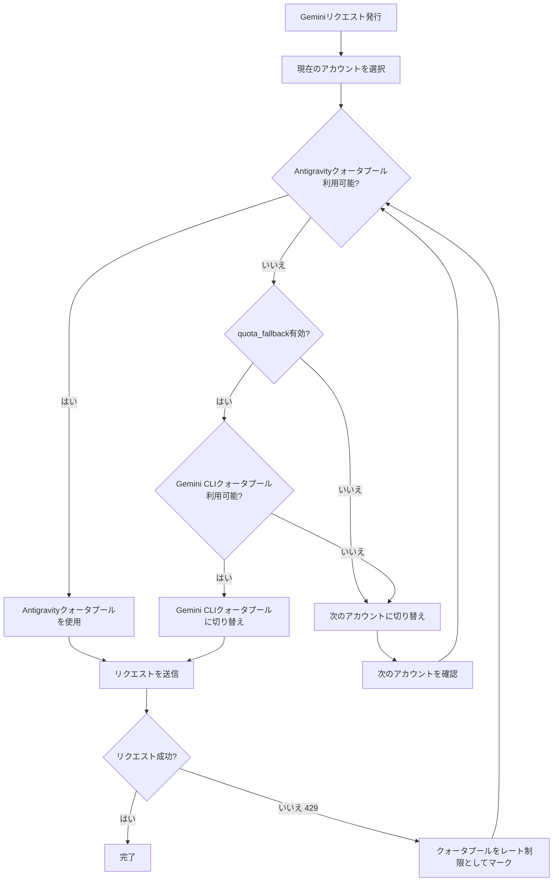

# デュアルクォータシステム: AntigravityとGemini CLIクォータプールの理解

## 学習後にできること

- 各アカウントが2つの独立したGeminiクォータプールを持つ仕組みを理解する
- AntigravityとGemini CLIクォータプール間で自動フォールバックを有効化する
- 特定のクォータプールを明示的に指定してモデルを使用する
- デュアルクォータシステムを通じてクォータ利用率を最大化する

---

## 現在の課題

Antigravity Authプラグインを使用してGeminiモデルを呼び出している場合、クォータ制限に頻繁に遭遇する可能性がありますが、**デュアルクォータシステム**について理解していないかもしれません：

- 1つのリクエストがレート制限されると、クォータがリセットされるまで待つ必要がある
- 複数のアカウントを設定しているが、各アカウントのGeminiクォータは依然として不足している
- なぜ一部のモデルはリクエストできるが、一部は頻繁に429エラーを返すのか分からない

**核心的な問題**：各アカウントにはGeminiクォータプールが1つしかないと思い込んでいますが、実際には各アカウントは**2つの独立した**クォータプールを持っており、適切に設定すればGeminiクォータを倍増させることができます。

---

## 核心的なアイデア

### デュアルクォータシステムとは？

**デュアルクォータシステム**は、Antigravity Authプラグインが各アカウントに対して2つの独立したGeminiクォータプールを維持する仕組みです。AntigravityとGemini CLIのクォータプールは独立してレート制限状態を追跡し、Antigravityがレート制限された場合はCLIクォータプールに切り替えて、クォータを倍増させます。

Antigravity Authプラグインは各Googleアカウントに対して**2つの独立したGeminiクォータプール**を維持します：

| クォータプール | タイプ | 優先度 | リセットルール |
| --- | --- | --- | --- |
| **Antigravity** | 主要クォータプール | 優先使用 | サーバーから返されたリセット時間に基づいて動的に計算 |
| **Gemini CLI** | バックアップクォータプール | fallback使用 | サーバーから返されたリセット時間に基づいて動的に計算 |

各クォータプールのレート制限状態は独立して追跡され、互いに影響を与えません。つまり：

- Antigravityクォータプールがレート制限されても、Gemini CLIクォータプールが利用可能であれば自動的に切り替えられる
- 各アカウントのGeminiクォータが**倍増**するのと同じ効果がある

### 明示的指定 vs 自動フォールバック

デュアルクォータシステムを使用する方法は2つあります：

1. **明示的指定**：モデル名の後に`:antigravity`または`:gemini-cli`サフィックスを追加して、特定のクォータプールを強制的に使用する
2. **自動フォールバック**：`quota_fallback`設定を有効にして、プラグインが2つのクォータプール間で自動的に切り替えるようにする

**デフォルトの動作**：自動フォールバックは有効化されておらず、Antigravityクォータプールのみを使用する

---

## 実践手順

### ステップ1：自動フォールバックを有効化

`~/.config/opencode/antigravity.json`設定ファイルを開きます：

```bash
cat ~/.config/opencode/antigravity.json
```

`quota_fallback`設定を追加または変更します：

```json
{
  "quota_fallback": true
}
```

**理由**：デフォルトでは`quota_fallback`は`false`で、プラグインはAntigravityクォータプールのみを使用します。有効化すると、Antigravityがレート制限されたときに自動的にGemini CLIクォータプールを試行します。

設定ファイルが更新されていることを確認してください。

---

### ステップ2：自動フォールバックの動作を観察

Geminiモデルリクエストを発行します（例：Gemini 3 Flashを使用）：

```bash
opencode run "量子コンピューティングとは何か説明して" --model=google/antigravity-gemini-3-flash
```

Antigravityクォータプールがレート制限されている場合、以下の自動フォールバック動作が表示されます：

```
[Toast通知] Antigravity quota exhausted, using Gemini CLI quota
```

プラグインは以下の処理を行います：

1. Antigravityクォータプールのレート制限を検出（429レスポンス）
2. Gemini CLIクォータプールへの切り替えを試行（レート制限されていない場合）
3. 新しいクォータプールを使用してリクエストを再送信
4. 切り替え動作を通知するトースト通知を表示

**理由**：これが自動フォールバックの核心的なロジックです——すぐに次のアカウントに切り替えるのではなく、同じアカウントの2つのクォータプール間で切り替えます。

リクエストが成功して完了し、クォータ制限による失敗ではないことを確認してください。

---

### ステップ3：クォータプールを明示的に指定

特定のクォータプールを強制的に使用したい場合は、モデル名の後にサフィックスを追加します：

**Antigravityクォータプールを使用**（`antigravity-`プレフィックスを使用）：

```bash
opencode run "量子コンピューティングとは何か説明して" --model=google/antigravity-gemini-3-flash
```

**Gemini CLIクォータプールを使用**（`antigravity-`プレフィックスなし）：

```bash
opencode run "量子コンピューティングとは何か説明して" --model=google/gemini-3-flash-preview
```

**理由**：`antigravity-`プレフィックスを使用すると、Antigravityクォータプールの使用を明示的に指定できます。プレフィックスなしではGemini CLIクォータプールが使用されます。この場合、プラグインは`quota_fallback`設定を無視し、指定されたクォータプールがレート制限されている場合はすぐに次のアカウントに切り替わり、別のクォータプールは試行されません。

リクエストが指定されたクォータプールにルーティングされることを確認してください。

---

### ステップ4：クォータ状態を確認（デバッグモード）

各クォータプールのレート制限状態を確認したい場合は、デバッグモードを有効化します：

`~/.config/opencode/antigravity.json`を編集：

```json
{
  "quota_fallback": true,
  "debug": true
}
```

リクエストを発行後、ログファイルを確認します：

```bash
tail -f ~/.config/opencode/antigravity-logs/*.log
```

以下のようなログが表示されます：

```
[DEBUG] headerStyle=antigravity explicit=false
[DEBUG] quota fallback: gemini-cli
[INFO] rate-limit triggered for account 0, family gemini, quota: gemini-antigravity
```

**理由**：デバッグログを使用すると、プラグインがどのクォータプールを選択したか、およびいつフォールバックがトリガーされたかを明確に確認できます。これはクォータ問題のトラブルシューティングに非常に役立ちます。

詳細なクォータ切り替えログが表示されることを確認してください。

---

## チェックポイント ✅

### 自動フォールバックが有効化されていることを確認

```bash
cat ~/.config/opencode/antigravity.json | grep quota_fallback
```

以下が表示されるはずです：

```json
"quota_fallback": true
```

### 明示的指定サフィックスを確認

サフィックス付きのモデル名を使用して、エラーが発生しないことを確認します：

```bash
opencode run "テスト" --model=google/antigravity-gemini-3-flash:gemini-cli
```

リクエストが正常に完了することを確認してください。

### デバッグログを確認

```bash
ls -la ~/.config/opencode/antigravity-logs/
```

ログファイルが存在し、クォータ切り替えに関連する情報が含まれていることを確認してください。

---

## よくある落とし穴

### 落とし穴1：明示的指定サフィックス使用時にフォールバックが機能しない

**問題**：モデル名の後に`:antigravity`または`:gemini-cli`サフィックスを追加しましたが、`quota_fallback`が機能していないようです。

**原因**：明示的指定サフィックスを使用すると、プラグインは`quota_fallback`設定を無視し、指定されたクォータプールを強制的に使用します。そのクォータプールがレート制限されている場合、別のクォータプールを試行するのではなく、すぐに次のアカウントに切り替わります。

**解決策**：
- 自動フォールバックを使用したい場合は、モデル名の後にサフィックスを追加しないでください
- 特定のクォータプールを強制的に使用したい場合は、サフィックスを追加してください

### 落とし穴2：Claudeモデルにはデュアルクォータシステムがない

**問題**：`quota_fallback`を有効化しましたが、Claudeモデルにフォールバック動作がないようです。

**原因**：デュアルクォータシステムは**Geminiモデルにのみ適用されます**。ClaudeモデルはAntigravityクォータプールのみを使用し、Gemini CLIクォータプールはありません。

**解決策**：
- Claudeモデルではデュアルクォータシステムを設定する必要はありません
- Claudeクォータを増やすには、マルチアカウントローテーションのみが有効です

### 落とし穴3：デバッグログが多すぎてパフォーマンスに影響

**問題**：`debug: true`を有効化しましたが、ログファイルの成長が速すぎます。

**原因**：デバッグモードは、クォータ切り替え、アカウント選択など、すべてのリクエストの詳細を記録します。

**解決策**：
- デバッグが完了したら、`debug`設定をオフにしてください
- または、ログファイルを定期的にクリーンアップしてください：`rm ~/.config/opencode/antigravity-logs/*.log`

---

## デュアルクォータシステムワークフロー図

以下は自動フォールバックのワークフローです：



---

## デュアルクォータプールの独立追跡メカニズム

### クォータキー定義

プラグインは以下のクォータキーを使用してレート制限を追跡します（ソース：`accounts.ts:77`）：

| クォータキー | 意味 |
| --- | --- |
| `claude` | Claudeモデルクォータ |
| `gemini-antigravity` | Gemini Antigravityクォータプール |
| `gemini-cli` | Gemini CLIクォータプール |

各アカウントの`rateLimitResetTimes`オブジェクトは、これらのクォータキーのリセットタイムスタンプを保存します：

```json
{
  "rateLimitResetTimes": {
    "claude": 1234567890,
    "gemini-antigravity": 1234567890,
    "gemini-cli": 1234567890
  }
}
```

### 利用可能なクォータプールチェック

クォータプールを選択する際、プラグインは以下の順序でチェックします（ソース：`accounts.ts:545-557`）：

1. **Antigravityクォータプール**：レート制限されていない場合、直接使用
2. **Gemini CLIクォータプール**：Antigravityがレート制限されていて、このプールが利用可能な場合、これを使用
3. **nullを返す**：両方のプールがレート制限されている場合、アカウント切り替えをトリガー

---

## クォータプール切り替えのトリガー条件

自動フォールバックは以下の条件が満たされたときにトリガーされます：

| 条件 | 説明 | ソース位置 |
| --- | --- | --- |
| `quota_fallback = true` | 自動フォールバックが有効化されている | `config/schema.ts:234` |
| 現在のアカウントのAntigravityクォータプールがレート制限されている | 429レスポンスを受信 | `plugin.ts:1149` |
| モデルがクォータプールを明示的に指定していない | モデル名に`:antigravity`または`:gemini-cli`サフィックスが含まれていない | `plugin.ts:1151` |
| 現在のアカウントのGemini CLIクォータプールが利用可能である | レート制限されていない | `accounts.ts:553` |

いずれかの条件が満たされない場合、プラグインは別のクォータプールを試行するのではなく、すぐに次のアカウントに切り替わります。

---

## 本レッスンのまとめ

本レッスンでは、Antigravity Authプラグインのデュアルクォータシステムを学習しました：

- **デュアルクォータプール**: 各アカウントはAntigravityとGemini CLIの2つの独立したGeminiクォータプールを持つ
- **自動フォールバック**: `quota_fallback`を有効化すると、Antigravityがレート制限されたときに自動的にGemini CLIクォータプールを試行する
- **明示的指定**: `:antigravity`または`:gemini-cli`サフィックスを使用して、特定のクォータプールを強制的に使用する
- **独立追跡**: 各クォータプールのレート制限状態は独立して保存およびチェックされる
- **Geminiのみ**: デュアルクォータシステムはGeminiモデルにのみ適用され、ClaudeモデルはAntigravityクォータプールのみを持つ

デュアルクォータシステムを適切に使用することで、各アカウントのGeminiクォータを倍増させ、クォータ制限によるリクエスト失敗を減らすことができます。

---

## 次のレッスンの予告

> 次のレッスンでは、**[マルチアカウント設定: ロードバランシングによるクォータ向上](../../advanced/multi-account-setup/)**を学習します。
>
> 学べる内容：
> - 複数のGoogleアカウントを追加する方法
> - 異なるアカウント選択戦略を設定するベストプラクティス
> - マルチアカウントシナリオでのクォータプール使用テクニック

---

## 付録: ソースコード参照

<details>
<summary><strong>ソースコード位置を表示</strong></summary>

> 最終更新: 2026-01-23

| 機能 | ファイルパス | 行番号 |
| --- | --- | --- |
| クォータキー定義（BaseQuotaKey） | [`src/plugin/accounts.ts`](https://github.com/NoeFabris/opencode-antigravity-auth/blob/main/src/plugin/accounts.ts#L77-L78) | 77-78 |
| クォータキー取得（getQuotaKey） | [`src/plugin/accounts.ts`](https://github.com/NoeFabris/opencode-antigravity-auth/blob/main/src/plugin/accounts.ts#L107-L116) | 107-116 |
| クォータプールレート制限状態チェック | [`src/plugin/accounts.ts`](https://github.com/NoeFabris/opencode-antigravity-auth/blob/main/src/plugin/accounts.ts#L134-L152) | 134-152 |
| 利用可能なクォータプール取得 | [`src/plugin/accounts.ts`](https://github.com/NoeFabris/opencode-antigravity-auth/blob/main/src/plugin/accounts.ts#L545-L557) | 545-557 |
| quota_fallback設定定義 | [`src/plugin/config/schema.ts`](https://github.com/NoeFabris/opencode-antigravity-auth/blob/main/src/plugin/config/schema.ts#L224-L234) | 224-234 |
| 自動フォールバックロジック | [`src/plugin/plugin.ts`](https://github.com/NoeFabris/opencode-antigravity-auth/blob/main/src/plugin/plugin.ts#L1151-L1163) | 1151-1163 |
| デュアルクォータシステムドキュメント | [`docs/MULTI-ACCOUNT.md`](https://github.com/NoeFabris/opencode-antigravity-auth/blob/main/docs/MULTI-ACCOUNT.md#L21-L31) | 21-31 |

**重要な定数**：
- `BaseQuotaKey = "claude" | "gemini-antigravity" | "gemini-cli"`：クォータキータイプ定義

**重要な関数**：
- `getAvailableHeaderStyle()`：現在のアカウントのクォータプール状態に基づいて利用可能なクォータプールを返す
- `isRateLimitedForHeaderStyle()`：指定されたクォータプールがレート制限されているかチェック
- `getQuotaKey()`：モデルファミリーとheaderStyleに基づいてクォータキーを生成

</details>
