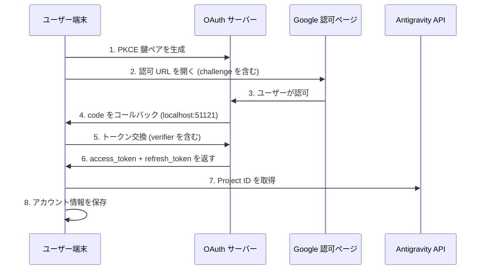

# OAuth 2.0 PKCE 認証：初回ログインを完了する

## 学習内容

- OAuth 2.0 PKCE 認証フローのセキュリティメカニズムを理解する
- プラグインの初回ログインを完了し、Antigravity API へのアクセス権限を取得する
- Project ID の自動取得と保存メカニズムを理解する
- トークンリフレッシュの自動処理について学ぶ

## 現在の問題点

プラグインはインストールされ、モデル定義も設定されましたが、まだ実際に使用していません。毎回 `opencode run` を実行すると「認証が必要」と表示されますが、以下の点が不明です：

- OAuth とは何か？なぜこれほど複雑な認証方式を使用するのか？
- 認証プロセスで何が起きているのか？安全なのか？
- 初回ログインには何が必要か？どのような選択肢があるのか？
- トークンが期限切れになったらどうするのか？再ログインが必要なのか？

## この手法を使用するタイミング

- **プラグイン初回インストール後**：初回使用前に認証を完了する必要があります
- **新しいアカウント追加時**：複数アカウントのローテーションを設定する場合、各アカウントで認証が必要です
- **トークン失効後**：アカウントが取り消されたり、パスワードが変更された場合、再認証が必要です
- **新しいデバイスへの切り替え時**：アカウントを移行する際、新しいデバイスで再ログインが必要です

## 🎒 開始前の準備

::: warning 事前確認

以下の手順が完了していることを確認してください：

1. **プラグインがインストール済み**：[クイックインストール](/ja/NoeFabris/opencode-antigravity-auth/start/quick-install/)を参照
2. **モデルが設定済み**：モデル定義を `~/.config/opencode/opencode.json` に追加済み
3. **利用可能な Google アカウントがあること**：信頼関係が構築済みのアカウントを使用することをお勧めします。新しく作成したアカウントは避けてください

:::

## 基本概念

### OAuth 2.0 PKCE とは？

**OAuth 2.0**（Open Authorization 2.0）は、サードパーティアプリ（本プラグイン）がユーザーのパスワードを直接取得することなく、Google API へのアクセス権限を取得できるようにする認可プロトコルです。

**PKCE**（Proof Key for Code Exchange）は、公開クライアント（CLI ツールなど）向けに設計された OAuth 2.0 のセキュリティ拡張です。以下のメカニズムにより、認可コードの傍受攻撃を防ぎます：

```
┌─────────────────────────────────────────────────────────────────┐
│  PKCE 防護メカニズム                                             │
├─────────────────────────────────────────────────────────────────┤
│  1. クライアントが鍵ペアを生成：                                │
│     - code_verifier（ランダム文字列、秘密）                      │
│     - code_challenge（verifier のハッシュ値、公開）              │
│  2. 認可 URL に code_challenge を含める                       │
│  3. コールバックサーバーが code を受け取り、verifier で検証     │
│  4. 攻撃者が code を傍受しても、verifier なしではトークン交換不可 │
└─────────────────────────────────────────────────────────────────┘
```

::: info

**PKCE vs 従来の OAuth**

従来の OAuth は `client_secret` で認証を行いますが、これはクライアントが秘密鍵を安全に保存できることを前提としています。CLI ツールではこれができないため、PKCE は動的に生成される `verifier` を使用して静的な秘密鍵の代わりとし、同様にセキュリティを保ちながら事前保存された秘密に依存しません。

:::

### 認証フローの概要



## 実践ガイド

### ステップ 1：OAuth ログインを開始

**なぜ必要か**

`opencode auth login` コマンドはローカル OAuth サーバーを起動し、認可 URL を生成して Google からのコールバックを待機します。

**コマンドを実行**：

```bash
opencode auth login
```

**期待される出力**：

```
🔑 Initializing Antigravity OAuth...
📋 Starting local OAuth server on http://127.0.0.1:51121
🌐 Opening browser for authorization...

If the browser doesn't open, visit this URL manually:
https://accounts.google.com/o/oauth2/v2/auth?client_id=...&code_challenge=...
```

::: tip

**環境自動検出**

プラグインは実行環境を自動的に検出します：

| 環境 | バインドアドレス | 理由 |
|--- | --- | ---|
| ローカル macOS/Linux/Windows | `127.0.0.1` | 最も安全、ローカル接続のみ許可 |
| WSL / Docker / SSH リモート | `0.0.0.0` | ホストマシンからのブラウザアクセスを許可 |

環境変数 `OPENCODE_ANTIGRAVITY_OAUTH_BIND` でデフォルト設定を上書きできます。

:::

### ステップ 2：ブラウザで認可する

**なぜ必要か**

Google 認可ページにはプラグインが要求する権限（Scope）が表示され、明確な同意が必要です。

**表示される内容**：

Google OAuth 認可ページに以下が表示されます：
- リクエスト元：Antigravity Auth Plugin
- 要求権限：
  - あなたのメールアドレスを表示
  - あなたのプロフィール情報を表示
  - Cloud Platform プロジェクトへのアクセス
  - Google Cloud のログと実験構成へのアクセス

**操作手順**：

1. 要求されている権限が期待通りであることを確認（範囲外の機密権限がないこと）
2. 「許可」または「承認」ボタンをクリック
3. ページが `http://localhost:51121/oauth-callback` にリダイレクトされるのを待つ

**期待される出力**：

```html
<!DOCTYPE html>
<html>
  <!-- ... -->
  <h1>All set!</h1>
  <p>You've successfully authenticated with Antigravity.</p>
  <!-- ... -->
</html>
```

::: warning

**認可ページが閉じない問題**

認証成功後にブラウザが自動的に閉じない場合、手動でタブを閉じてください。これはブラウザのセキュリティ制限によるもので、認証結果には影響しません。

:::

### ステップ 3：自動トークン交換と Project ID 取得

**なぜ必要か**

認可コードは一時的な資格情報であり、長期間有効な `refresh_token` に交換する必要があります。同時に Antigravity プロジェクトに必要な `Project ID` も取得します。

**バックグラウンドで自動実行される処理**：

プラグインは以下の操作を自動的に実行します（ユーザーの介入は不要）：

1. **PKCE 検証**：`code_verifier` で認可コードの有効性を検証
2. **トークン交換**：`oauth2.googleapis.com/token` に POST リクエストを送信

   ```typescript
   // ソースコード：src/antigravity/oauth.ts:209
   POST https://oauth2.googleapis.com/token
   Content-Type: application/x-www-form-urlencoded

   {
     client_id: "...",
     client_secret: "...",
     code: "認可コード",
     grant_type: "authorization_code",
     redirect_uri: "http://localhost:51121/oauth-callback",
     code_verifier: "PKCE verifier"
   }
   ```

3. **ユーザー情報の取得**：メールアドレスを検証

   ```typescript
   // ソースコード：src/antigravity/oauth.ts:231
   GET https://www.googleapis.com/oauth2/v1/userinfo?alt=json
   Authorization: Bearer {access_token}
   ```

4. **Project ID の自動取得**：Antigravity API からプロジェクト ID を取得しようとします

   ```typescript
   // ソースコード：src/antigravity/oauth.ts:131
   // 優先順位に従って複数のエンドポイントを試行
   - https://cloudcode-pa.googleapis.com/v1internal:loadCodeAssist (prod)
   - https://daily-cloudcode-pa.sandbox.googleapis.com/v1internal:loadCodeAssist (daily)
   - https://autopush-cloudcode-pa.sandbox.googleapis.com/v1internal:loadCodeAssist (autopush)
   ```

5. **アカウント情報の保存**：`~/.config/opencode/antigravity-accounts.json` に保存

   ```json
   {
     "version": 3,
     "accounts": [
       {
         "email": "your.email@gmail.com",
         "refreshToken": "1//0g...|rising-fact-p41fc",
         "projectId": "rising-fact-p41fc",
         "addedAt": 1737609600000,
         "lastUsed": 1737609600000
       }
     ]
   }
   ```

::: details

**Project ID の役割**

Project ID は Google Cloud プロジェクトの一意の識別子であり、API 呼び出しがどのプロジェクトに属するかを決定するために使用されます。Antigravity は Project ID に基づいてクォータの使用状況を追跡します。

- **自動取得成功**：実際の Project ID を使用（推奨）
- **自動取得失敗**：デフォルト Project ID (`rising-fact-p41fc`) を使用

:::

**期待される出力**：

```
✅ Authentication successful
📧 Account: your.email@gmail.com
🆔 Project ID: rising-fact-p41fc
💾 Saved to: ~/.config/opencode/antigravity-accounts.json
```

### チェックポイント ✅

**アカウントが正しく保存されていることを確認**：

```bash
cat ~/.config/opencode/antigravity-accounts.json
```

**期待される出力**：

```json
{
  "version": 3,
  "accounts": [
    {
      "email": "your.email@gmail.com",
      "refreshToken": "1//0g...|rising-fact-p41fc",
      "projectId": "rising-fact-p41fc",
      "addedAt": 1737609600000,
      "lastUsed": 1737609600000
    }
  ]
}
```

::: tip

**アカウント保存形式**

`refreshToken` フィールドの形式は `{refresh_token}|{project_id}` です。この設計により、トークンとプロジェクト ID を単一のフィールドに格納でき、保存ロジックを簡素化できます。

:::

## よくある問題の解決

### 問題 1：ポートが使用中

**エラーメッセージ**：

```
❌ Port 51121 is already in use.
Another process is occupying this port.
```

**原因**：別の OpenCode プロセスが実行中か、他のプログラムがポートを使用しています。

**解決策**：

1. ポートを使用しているプロセスを確認して終了：

   ```bash
   # macOS/Linux
   lsof -ti:51121 | xargs kill -9

   # Windows
   netstat -ano | findstr :51121
   taskkill /PID <PID> /F
   ```

2. `opencode auth login` を再実行

### 問題 2：ブラウザが自動的に開かない

**原因**：WSL、Docker、またはリモート環境では `localhost` がホストマシンのアドレスと一致しません。

**解決策**：

プラグインは環境を自動的に検出し、手動アクセス用の URL を表示します：

```
🌐 Opening browser for authorization...

If the browser doesn't open, visit this URL manually:
https://accounts.google.com/o/oauth2/v2/auth?...
```

URL をコピーしてホストマシンのブラウザでアクセスしてください。

### 問題 3：Project ID の取得に失敗

**警告メッセージ**：

```
⚠️ Failed to resolve Antigravity project via loadCodeAssist
Using default project ID: rising-fact-p41fc
```

**原因**：一部の企業アカウントや特殊な権限設定では、`loadCodeAssist` API にアクセスできません。

**解決策**：

1. Antigravity モデルのみを使用する場合（`:antigravity` サフィックス付き）、デフォルト Project ID を使用できます
2. Gemini CLI モデル（例：`gemini-2.5-pro`）を使用する必要がある場合、Project ID を手動で設定：

   ```json
   // ~/.config/opencode/antigravity-accounts.json を編集
   {
     "accounts": [
       {
         "email": "your.email@gmail.com",
         "refreshToken": "1//0g...|your-custom-project-id",
         "projectId": "your-custom-project-id"
       }
     ]
   }
   ```

   Project ID の取得手順：
   - [Google Cloud Console](https://console.cloud.google.com/) にアクセス
   - プロジェクトを作成または選択
   - **Gemini for Google Cloud API** を有効化
   - プロジェクト ID をコピー（形式：`rising-fact-p41fc`）

### 問題 4：invalid_grant エラー

**エラーメッセージ**：

```
❌ Token exchange failed: invalid_grant
```

**原因**：
- 認可コードの有効期限切れ（有効期間は通常 10 分）
- ユーザーが認可後にアプリへのアクセス権限を取り消した
- アカウントのパスワード変更またはセキュリティイベントのトリガー

**解決策**：`opencode auth login` を再実行

## トークンリフレッシュメカニズム

**自動リフレッシュ**：トークンの期限切れについて心配する必要はありません。

プラグインは以下の状況で自動的にリフレッシュします：

| トリガー条件 | 動作 | ソースコード位置 |
|--- | --- | ---|
| トークン有効期限の 60 秒前 | 自動リフレッシュ | `src/plugin/auth.ts:33` |
| 401 Unauthorized 受信時 | リフレッシュを試行 | `src/plugin/auth.ts:33` |
| リフレッシュ失敗時 | 再ログインを促す | `src/plugin.ts:995` |

**リフレッシュロジック**：

```typescript
// ソースコード：src/plugin/auth.ts:33
export function accessTokenExpired(auth: OAuthAuthDetails): boolean {
  // 60 秒前にリフレッシュ（時計のずれを考慮）
  return auth.expires <= Date.now() + 60 * 1000;
}
```

## まとめ

OAuth 2.0 PKCE 認証フローの重要ポイント：

1. **PKCE セキュリティメカニズム**：動的な `verifier` で静的な秘密鍵を置き換え、認可コードの傍受を防止
2. **ローカルコールバックサーバー**：`localhost:51121` を監視し、Google 認可コールバックを受信
3. **トークン交換**：認可コードを `access_token` と `refresh_token` と交換
4. **自動 Project ID**：Antigravity API から取得を試行し、失敗時はデフォルト値を使用
5. **自動リフレッシュ**：トークンの有効期限 60 秒前に自動リフレッシュ、手動介入は不要
6. **アカウント保存**：すべての情報を `~/.config/opencode/antigravity-accounts.json` に保存

最初のモデルリクエストを送信できるようになりました！

## 次回の予定

> 次回は **[最初のモデルリクエストの送信](/ja/NoeFabris/opencode-antigravity-auth/start/first-request/)** について学習します。
>
> 学習内容：
> - `opencode run` を使用してリクエストを送信する方法
> - 認証が成功したことを確認する方法
> - モデルバリアントの設定方法を理解する

---

## 付録：ソースコード参照

<details>
<summary><strong>クリックしてソースコード位置を展開</strong></summary>

> 更新日時：2026-01-23

| 機能        | ファイルパス                                                                                               | 行番号    |
|--- | --- | ---|
| PKCE 鍵生成 | [`src/antigravity/oauth.ts`](https://github.com/NoeFabris/opencode-antigravity-auth/blob/main/src/antigravity/oauth.ts#L91-L113)         | 91-113  |
| 認可 URL の構築   | [`src/antigravity/oauth.ts`](https://github.com/NoeFabris/opencode-antigravity-auth/blob/main/src/antigravity/oauth.ts#L91-L113)         | 91-113  |
| トークン交換     | [`src/antigravity/oauth.ts`](https://github.com/NoeFabris/opencode-antigravity-auth/blob/main/src/antigravity/oauth.ts#L201-L270)         | 201-270 |
| ユーザー情報の取得   | [`src/antigravity/oauth.ts`](https://github.com/NoeFabris/opencode-antigravity-auth/blob/main/src/antigravity/oauth.ts#L231-L242)         | 231-242 |
| Project ID の自動取得 | [`src/antigravity/oauth.ts`](https://github.com/NoeFabris/opencode-antigravity-auth/blob/main/src/antigravity/oauth.ts#L131-L196)      | 131-196 |
| 環境検出       | [`src/plugin/server.ts`](https://github.com/NoeFabris/opencode-antigravity-auth/blob/main/src/plugin/server.ts#L31-L134)           | 31-134  |
| OAuth コールバックサーバー | [`src/plugin/server.ts`](https://github.com/NoeFabris/opencode-antigravity-auth/blob/main/src/plugin/server.ts#L140-L366)           | 140-366 |
| トークン期限切れチェック   | [`src/plugin/auth.ts`](https://github.com/NoeFabris/opencode-antigravity-auth/blob/main/src/plugin/auth.ts#L33-L38)               | 33-38   |
| トークン有効期限の計算 | [`src/plugin/auth.ts`](https://github.com/NoeFabris/opencode-antigravity-auth/blob/main/src/plugin/auth.ts#L45-L52)               | 45-52   |

**重要な定数**：
- `ANTIGRAVITY_CLIENT_ID`：OAuth クライアント ID（`constants.ts:4`）
- `ANTIGRAVITY_CLIENT_SECRET`：OAuth クライアントシークレット（`constants.ts:9`）
- `ANTIGRAVITY_REDIRECT_URI`：OAuth コールバックアドレス `http://localhost:51121/oauth-callback`（`constants.ts:25`）
- `ANTIGRAVITY_SCOPES`：要求権限リスト（`constants.ts:14-20`）
- `ANTIGRAVITY_DEFAULT_PROJECT_ID`：デフォルトプロジェクト ID `rising-fact-p41fc`（`constants.ts:71`）

**重要な関数**：
- `authorizeAntigravity()`：PKCE 鍵ペアと認可 URL を生成（`oauth.ts:91`）
- `exchangeAntigravity()`：認可コードをアクセストークンと交換（`oauth.ts:201`）
- `fetchProjectID()`：Antigravity API からプロジェクト ID を取得（`oauth.ts:131`）
- `startOAuthListener()`：ローカル OAuth サーバーを起動（`server.ts:140`）
- `accessTokenExpired()`：トークンの期限切れをチェック（`auth.ts:33`）

**重要なビジネスルール**：
- PKCE は S256 ハッシュアルゴリズムを使用（`oauth.ts:100`）
- トークン有効期限 60 秒前に自動リフレッシュ（`auth.ts:3`）
- オフラインアクセスをサポート（`access_type=offline`）（`oauth.ts:105`）
- Project ID エンドポイントのフォールバック順序：prod → daily → autopush（`oauth.ts:141-143`）

</details>
