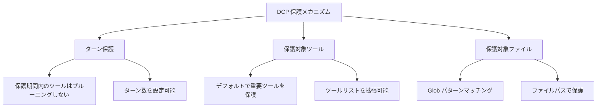

# 保護メカニズム：重要コンテンツの誤削除を防ぐ

## 学習目標

- ターン保護を設定し、AI が最近のツール出力を参照する時間を確保する
- 保護対象ツールリストを拡張し、重要な操作がプルーニングされるのを防ぐ
- 保護対象ファイルパターンを設定し、特定のファイルが誤ってプルーニングされるのを防ぐ
- サブエージェント保護メカニズムを理解し、要約動作への影響を回避する

## こんな問題に困っていませんか？

DCP は会話履歴内の冗長なツール呼び出しを自動的にプルーニングします。これはトークンの節約に効果的ですが、時として問題が発生します：

- AI がファイルを読み取った直後に、その内容に基づいて分析しようとしたところ、DCP によってプルーニングされてしまった
- `write` ツールで設定ファイルを作成し、後で読み取ろうとしたが、プルーニング後にファイルパスが見つからない
- AI が「上記のコードによると」と言っているが、そのコードはすでにコンテキストから消えている

これらの状況は、**一部のコンテンツは保護が必要で、プルーニングしてはならない**ことを示しています。

## このテクニックを使うタイミング

- AI が以前読み取ったファイルの内容を参照する必要がある場合
- 重要な操作（設定の書き込み、タスク計画など）を保護する必要がある場合
- 特定のファイルパス（secrets、キーなど）に特別な保護が必要な場合
- サブエージェント機能を開発する場合（DCP は自動的にスキップします）

## 基本的な考え方

DCP は**3 層の保護メカニズム**を提供し、異なる観点から重要コンテンツの誤削除を防ぎます：



**保護レベル**：
1. **ターン保護**（時間軸）：直近 N ターンのツールを自動保護
2. **ツール保護**（ツール軸）：特定のツールは絶対にプルーニングされない
3. **ファイル保護**（パス軸）：特定のファイルを操作するツールはプルーニングされない

これら 3 つを組み合わせて、多層的な保護ネットワークを形成できます。

---

## ターン保護

### ターン保護とは

ターン保護（Turn Protection）は、DCP が提供する**時間ウィンドウ保護メカニズム**です。有効にすると、保護期間内のツール呼び出しはプルーニングキャッシュに追加されず、どの戦略によってもプルーニングされません。

**目的**：AI が最近のツール出力を参照する時間を確保し、「言った直後に削除される」という問題を回避します。

### ターン保護の設定

設定ファイルに以下を追加します：

```jsonc
{
  "turnProtection": {
    "enabled": true,
    "turns": 4
  }
}
```

**パラメータの説明**：
- `enabled`：ターン保護を有効にするかどうか（デフォルト `false`）
- `turns`：保護ターン数（デフォルト `4`）、直近 4 ターンのツールはプルーニングされません

### ターン保護の仕組み

DCP はツールキャッシュを同期する際（AI がメッセージを送信する前に毎回）、各ツールのターン数を計算します：

```typescript
// 現在のターン - ツール作成ターン < 保護ターン数
// の場合、そのツールはプルーニングされない
state.currentTurn - turnCounter < turnProtectionTurns
```

**例**：
- 現在のターン：10
- ツール作成ターン：8
- 保護ターン数：4
- 結果：10 - 8 = 2 < 4 → **保護対象、プルーニングされない**

**効果**：
- 保護期間内のツールは `<prunable-tools>` リストに表示されない
- 自動戦略の影響を受けない（重複排除、上書き書き込み、エラークリア）
- AI は `discard`/`extract` ツールでそれらをプルーニングできない

### 推奨設定

| シナリオ | 推奨ターン数 | 説明 |
| --- | --- | --- |
| 長い会話（10+ ターン） | 4-6 | AI が履歴コンテンツを参照する十分な時間を確保 |
| 短い会話（< 5 ターン） | 2-3 | 長い保護期間は不要 |
| コンテキストに大きく依存するタスク | 6-8 | コードリファクタリング、長文ドキュメント分析など |
| デフォルト（コンテキスト非依存） | 0-2 | 無効化または最小値を使用 |

::: tip 注意
ターン保護はコンテキストサイズを増加させます。より多くのツール出力が保持されるためです。トークン消費が著しく増加した場合は、保護ターン数を適宜減らしてください。
:::

---

## 保護対象ツール

### デフォルトの保護対象ツール

DCP はデフォルトで以下のツールを保護し、これらは**絶対に**プルーニングされません：

| ツール名 | 説明 |
| --- | --- |
| `task` | タスク管理ツール |
| `todowrite` | TODO 項目の書き込み |
| `todoread` | TODO 項目の読み取り |
| `discard` | DCP の破棄ツール（プルーニング操作自体） |
| `extract` | DCP の抽出ツール（プルーニング操作自体） |
| `batch` | バッチ操作ツール |
| `write` | ファイル書き込みツール |
| `edit` | ファイル編集ツール |
| `plan_enter` | 計画開始マーカー |
| `plan_exit` | 計画終了マーカー |

**これらのツールが保護される理由**：
- `task`、`todowrite`、`todoread`：タスク管理はセッション状態の核心であり、削除するとコンテキストが失われる
- `discard`、`extract`：DCP 自身のプルーニングツールであり、自分自身をプルーニングすることはできない
- `batch`、`write`、`edit`：ファイル操作は AI とユーザーコードの相互作用の核心
- `plan_enter`、`plan_exit`：計画マーカーはセッション構造の理解を助ける

### 保護対象ツールリストの拡張

より多くのツールを保護する必要がある場合は、設定で拡張できます：

```jsonc
{
  "tools": {
    "settings": {
      "protectedTools": [
        "task",
        "todowrite",
        "todoread",
        "discard",
        "extract",
        "batch",
        "write",
        "edit",
        "plan_enter",
        "plan_exit",
        // 保護が必要なツールを追加
        "read",
        "filesearch"
      ]
    }
  }
}
```

**グローバルツール保護**：
- `tools.settings.protectedTools` 内のツールはすべての戦略で保護される
- どの戦略でもプルーニングさせたくないツールに適用

### 戦略レベルのツール保護

特定の戦略に対して保護対象ツールを設定することもできます：

```jsonc
{
  "strategies": {
    "deduplication": {
      "enabled": true,
      "protectedTools": [
        "read",  // 重複排除時に read ツールを保護
        "filesearch"
      ]
    },
    "purgeErrors": {
      "enabled": true,
      "turns": 4,
      "protectedTools": [
        "write"  // エラークリア時に write ツールを保護
      ]
    }
  }
}
```

**使用シナリオ**：
- 特定の戦略でのみツールを保護し、他の戦略ではプルーニングを許可
- 例：重複排除で `read` のプルーニングを許可するが、エラークリア戦略では `write` をプルーニングしない

::: info ツール保護とターン保護の違い
- **ツール保護**：ツールがどのターンで作成されたかに関係なく、保護リストにある限り絶対にプルーニングされない
- **ターン保護**：すべてのツール（保護対象ツールを除く）は保護期間内はプルーニングされないが、保護期間後はプルーニングされる可能性がある
:::

---

## 保護対象ファイルパターン

### 保護対象ファイルパターンとは

保護対象ファイルパターンを使用すると、Glob パターンを通じて**特定のファイルパスに対する操作がプルーニングされないように保護**できます。

**適用シナリオ**：
- キーファイルの保護（`.env`、`secrets.json`）
- 設定ファイルの保護（重要な設定は失われてはならない）
- プロジェクトのコアファイルの保護（エントリーファイル、コアライブラリ）
- 機密ディレクトリの保護（`src/api/`、`tests/fixtures/` など）

### 保護対象ファイルパターンの設定

設定ファイルに以下を追加します：

```jsonc
{
  "protectedFilePatterns": [
    "**/.env*",
    "**/secrets.json",
    "**/config/*.json",
    "src/core/**/*.ts",
    "tests/fixtures/**/*"
  ]
}
```

### Glob パターンの説明

DCP は標準の Glob パターンをサポートしています：

| パターン | 説明 | マッチ例 |
| --- | --- | --- |
| `**` | 任意の階層のディレクトリにマッチ | `src/`、`src/components/`、`a/b/c/` |
| `*` | 単一階層のディレクトリ内の任意のファイルにマッチ | `src/*.ts` は `src/index.ts` にマッチ |
| `?` | 単一の文字にマッチ | `file?.txt` は `file1.txt`、`file2.txt` にマッチ |
| `*.json` | 特定の拡張子にマッチ | `config.json`、`data.json` |
| `**/*.json` | 任意の階層の JSON ファイルにマッチ | `a/b/c.json`、`d.json` |

**注意事項**：
- `*` と `?` は `/`（ディレクトリ区切り文字）にはマッチしない
- マッチングは完全なファイルパスに対して行われる
- パス区切り文字は `/` に統一（Windows でも同様）

### 実践例

#### ケース 1：環境変数ファイルの保護

```jsonc
{
  "protectedFilePatterns": [
    "**/.env",
    "**/.env.local",
    "**/.env.production"
  ]
}
```

**効果**：`.env` ファイルを操作するすべてのツールはプルーニングされません。

#### ケース 2：プロジェクトのコアファイルの保護

```jsonc
{
  "protectedFilePatterns": [
    "src/index.ts",
    "src/core/**/*.ts",
    "src/api/**/*.ts"
  ]
}
```

**効果**：コアモジュールと API を操作するツール出力が保持され、AI が常にプロジェクト構造を把握できます。

#### ケース 3：テストフィクスチャの保護

```jsonc
{
  "protectedFilePatterns": [
    "tests/fixtures/**/*",
    "tests/mocks/**/*.json"
  ]
}
```

**効果**：テスト用のモックデータと固定入力がプルーニングされず、テスト結果の一貫性が保たれます。

---

## サブエージェント保護

### サブエージェントとは

サブエージェント（Subagent）は OpenCode のメカニズムの一つで、メインエージェントが特定のタスク（ファイル検索、コード分析など）を処理するためにサブエージェントを派生させることができます。サブエージェントは結果を要約してメインエージェントに返します。

### DCP のサブエージェント保護

DCP はサブエージェントセッションを自動的に検出し、**すべてのプルーニング操作をスキップ**します。

**実装原理**：
```typescript
// lib/state/utils.ts
export async function isSubAgentSession(client: any, sessionID: string): Promise<boolean> {
    const result = await client.session.get({ path: { id: sessionID } })
    return !!result.data?.parentID  // parentID があればサブエージェント
}
```

**保護が必要な理由**：
- サブエージェントの出力はメインエージェント向けの要約
- サブエージェントのツール出力をプルーニングすると、メインエージェントがコンテキストを理解できなくなる可能性がある
- サブエージェントのタスクは「効率的な実行」であり、「トークンの節約」ではない

::: info ユーザーへの影響
サブエージェント保護は自動的に行われ、設定は不要です。DCP は検出されたサブエージェントセッションをログに記録します。
:::

---

## ハンズオン：保護メカニズムの設定

### ステップ 1：設定ファイルの編集

グローバル設定ファイル（またはプロジェクト設定ファイル）を開きます：

```bash
# macOS/Linux
code ~/.config/opencode/dcp.jsonc

# Windows
code $env:APPDATA\opencode\dcp.jsonc
```

### ステップ 2：保護設定の追加

```jsonc
{
  "$schema": "https://raw.githubusercontent.com/Opencode-DCP/opencode-dynamic-context-pruning/main/dcp.schema.json",
  "enabled": true,
  "debug": false,

  // ターン保護
  "turnProtection": {
    "enabled": true,
    "turns": 4
  },

  // 保護対象ファイルパターン
  "protectedFilePatterns": [
    "**/.env*",
    "**/secrets.json"
  ],

  // 保護対象ツールの拡張
  "tools": {
    "settings": {
      "nudgeEnabled": true,
      "nudgeFrequency": 10,
      "protectedTools": [
        "task",
        "todowrite",
        "todoread",
        "discard",
        "extract",
        "batch",
        "write",
        "edit",
        "plan_enter",
        "plan_exit",
        "read"
      ]
    },
    "discard": {
      "enabled": true
    },
    "extract": {
      "enabled": true,
      "showDistillation": false
    }
  },

  // 戦略レベルの保護
  "strategies": {
    "deduplication": {
      "enabled": true,
      "protectedTools": ["filesearch"]
    },
    "supersedeWrites": {
      "enabled": false
    },
    "purgeErrors": {
      "enabled": true,
      "turns": 4,
      "protectedTools": ["write"]
    }
  }
}
```

### ステップ 3：OpenCode の再起動

設定を変更した後、OpenCode を再起動して設定を反映させます：

- macOS/Linux：Dock の OpenCode アイコンを右クリック → 終了 → 再度開く
- Windows：タスクバーの OpenCode を右クリック → ウィンドウを閉じる → 再度開く

### ステップ 4：保護メカニズムの確認

OpenCode の会話で `/dcp context` と入力し、現在のコンテキスト分析を確認します：

```
Session Context Breakdown:
──────────────────────────────────────────────────────────

System         15.2% │████████████████▒▒▒▒▒▒▒▒▒▒▒▒▒▒▒▒▒▒▒▒▒▒▒│  25.1K tokens
User            5.1% │████▒▒▒▒▒▒▒▒▒▒▒▒▒▒▒▒▒▒▒▒▒▒▒▒▒▒▒▒▒▒▒▒▒▒▒▒▒▒│   8.4K tokens
Assistant       35.8% │██████████████████████████████████████▒▒▒▒▒▒▒│  59.2K tokens
Tools (45)      43.9% │████████████████████████████████████████████████│  72.6K tokens

──────────────────────────────────────────────────────────

Summary:
  Pruned:          12 tools (~15.2K tokens)
  Current context: ~165.3K tokens
  Without DCP:     ~180.5K tokens
```

**確認すべき点**：
- `Pruned` の数が減少している可能性がある（保護対象ツールはプルーニングされないため）
- `Current context` が増加している可能性がある（ターン保護によりより多くのコンテンツが保持されるため）

---

## よくある落とし穴

### ❌ 誤解 1：過度な保護によるトークンの浪費

**問題**：保護ターン数を長く設定しすぎたり、保護対象ツールを追加しすぎたりして、コンテキストが常に大きくなる。

**解決策**：
- ターン保護は通常 2-4 ターンで十分
- 本当に重要なツール（`task`、`write` など）のみを保護
- 定期的に `/dcp context` を確認し、コンテキストサイズを監視

### ❌ 誤解 2：Glob パターンのマッチング失敗

**問題**：`*.json` を設定したが、一部の JSON ファイルがまだプルーニングされる。

**原因**：`*` は `/` にマッチしないため、`a/b/c.json` はマッチしない。

**解決策**：任意の階層の JSON ファイルにマッチさせるには `**/*.json` を使用。

### ❌ 誤解 3：OpenCode の再起動を忘れる

**問題**：設定を変更したが、保護メカニズムが有効にならない。

**原因**：DCP は起動時にのみ設定ファイルを読み込む。

**解決策**：設定変更後は必ず OpenCode を再起動。

### ❌ 誤解 4：保護対象ツールがプルーニングリストに表示される

**問題**：保護対象ツールを設定したが、`<prunable-tools>` リストに表示される。

**原因**：保護対象ツールはプルーニングされませんが、保護期間外の場合は `<prunable-tools>` リストに表示されます（AI が確認できるように）。ただし、AI がプルーニングしようとしても失敗します。

**解決策**：これは正常な動作です。AI が保護対象ツールをプルーニングしようとすると、DCP は操作を拒否してエラーを返します。

---

## このレッスンのまとめ

DCP の保護メカニズムは 3 層で構成されています：

1. **ターン保護**：保護期間内のツールはプルーニングされず、AI が履歴コンテンツを参照する時間を確保
2. **保護対象ツール**：特定のツール（`task`、`write` など）は絶対にプルーニングされず、カスタムリストで拡張可能
3. **保護対象ファイルパターン**：Glob パターンで特定のファイルパスに対する操作を保護
4. **サブエージェント保護**：DCP はサブエージェントセッションを自動検出し、プルーニング操作をスキップ

**推奨設定戦略**：
- 開発段階：ターン保護を有効化（2-4 ターン）、設定ファイルとコアモジュールを保護
- 本番段階：実際のニーズに応じて調整し、トークン節約とコンテキストの完全性のバランスを取る
- 重要なタスク：すべての保護メカニズムを有効化し、重要なコンテンツが失われないようにする

---

## 次のレッスンの予告

> 次のレッスンでは **[状態の永続化](../state-persistence/)** を学びます。
>
> 学べること：
> - DCP がセッション間でプルーニング状態と統計データをどのように保持するか
> - 永続化ファイルの場所と形式
> - 累積トークン節約効果の確認方法
> - 永続化データのクリア方法

---

## 付録：ソースコード参照

<details>
<summary><strong>クリックしてソースコードの場所を表示</strong></summary>

> 更新日：2026-01-23

| 機能 | ファイルパス | 行番号 |
| --- | --- | --- |
| ターン保護ロジック | [`lib/state/tool-cache.ts`](https://github.com/Opencode-DCP/opencode-dynamic-context-pruning/blob/main/lib/state/tool-cache.ts#L39-L44) | 39-44 |
| デフォルト保護対象ツール | [`lib/config.ts`](https://github.com/Opencode-DCP/opencode-dynamic-context-pruning/blob/main/lib/config.ts#L68-L79) | 68-79 |
| 保護対象ファイルマッチング | [`lib/protected-file-patterns.ts`](https://github.com/Opencode-DCP/opencode-dynamic-context-pruning/blob/main/lib/protected-file-patterns.ts#L77-L82) | 77-82 |
| サブエージェント検出 | [`lib/state/utils.ts`](https://github.com/Opencode-DCP/opencode-dynamic-context-pruning/blob/main/lib/state/utils.ts#L1-L8) | 1-8 |
| 重複排除戦略の保護チェック | [`lib/strategies/deduplication.ts`](https://github.com/Opencode-DCP/opencode-dynamic-context-pruning/blob/main/lib/strategies/deduplication.ts#L49-L57) | 49-57 |
| Discard ツールの保護チェック | [`lib/strategies/tools.ts`](https://github.com/Opencode-DCP/opencode-dynamic-context-pruning/blob/main/lib/strategies/tools.ts#L89-L112) | 89-112 |

**主要な定数**：
- `DEFAULT_PROTECTED_TOOLS = ["task", "todowrite", "todoread", "discard", "extract", "batch", "write", "edit", "plan_enter", "plan_exit"]`：デフォルトの保護対象ツールリスト

**主要な関数**：
- `isProtectedFilePath(filePath, patterns)`：ファイルパスが保護パターンにマッチするかチェック
- `isSubAgentSession(client, sessionID)`：セッションがサブエージェントかどうかを検出

</details>
