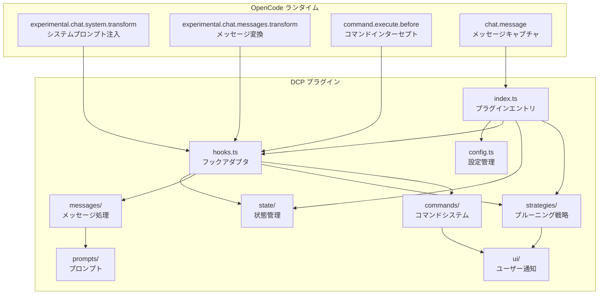
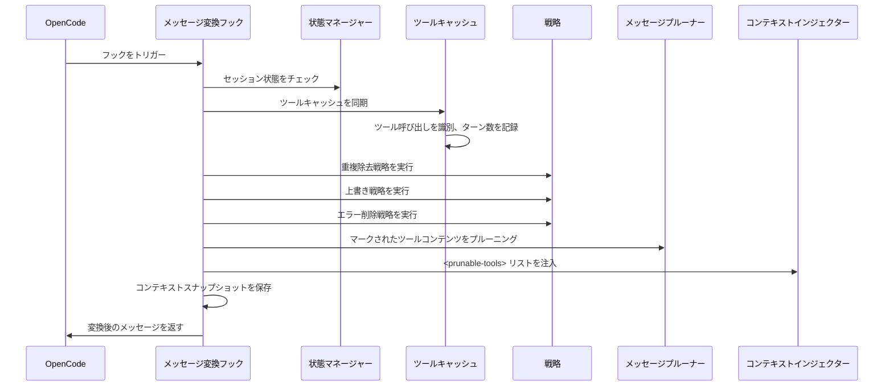
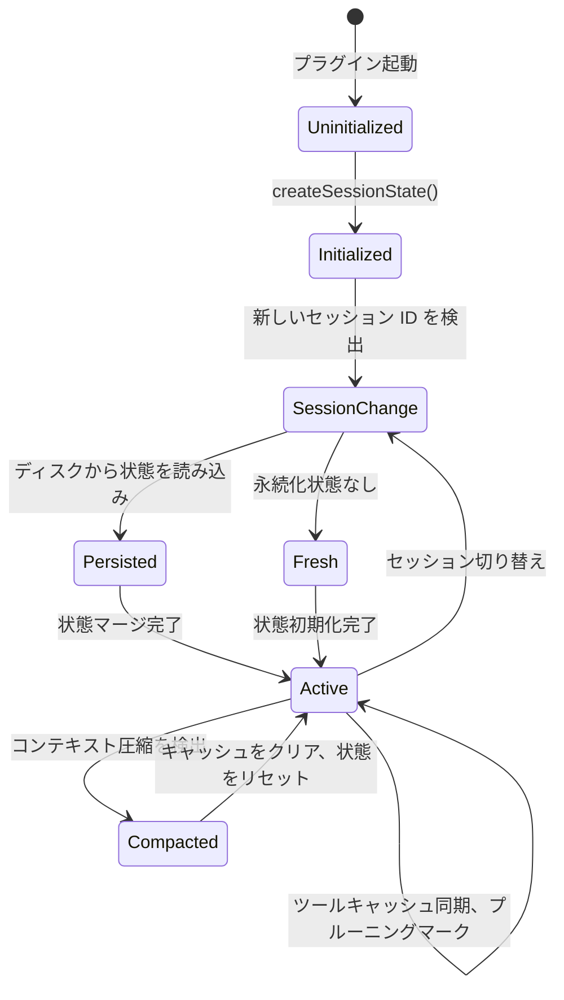
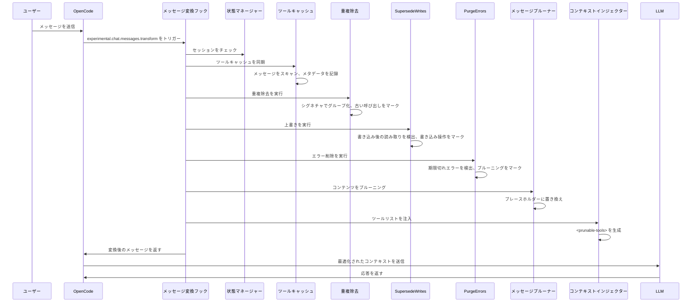
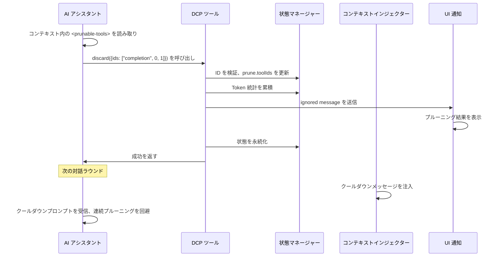

# アーキテクチャ概要: DCP の内部動作原理

## 学習後にできること

本節では操作ではなく、DCP の内部設計を深く理解することを目的としています。学習後、以下のことができるようになります：
- DCP が OpenCode フックシステムを通じて対話フローと統合される仕組みを理解する
- 各モジュールの責任範囲と相互作用方式を掌握する
- メッセージ受信からプルーニング完了までの完全な呼び出しチェーンを理解する
- 状態管理、メッセージ処理、プルーニング戦略の設計思想を理解する

## 核心的な考え方

DCP は OpenCode Plugin SDK をベースとしたプラグインで、フックとツールを登録することで OpenCode の対話機能を拡張します。システム全体は「メッセージ変換」（message transform）という核心的な概念を中心に構築されています——AI がユーザーに応答する準備をするたびに、DCP は対話履歴をスキャン、分析、プルーニングし、最適化されたコンテキストを LLM に送信します。

::: info なぜ「メッセージ変換」なのか？

OpenCode は `experimental.chat.messages.transform` フックを提供しており、プラグインがメッセージを LLM に送信する前に変更できるようにしています。これはまさに DCP に必要な機能です——LLM がコンテキストを見る前に、冗長なツール呼び出しを削除するのです。

:::

システムはモジュール化設計を採用しており、各モジュールの責任は明確です：
- **config**：設定管理、多層級の上書きをサポート
- **state**：状態管理、セッション単位の実行時状態を維持
- **messages**：メッセージ処理、実際のプルーニングと注入操作を実行
- **strategies**：プルーニング戦略、自動クリーンアップルールを定義
- **commands**：コマンドシステム、手動制御と統計クエリを提供
- **hooks**：フックアダプタ、OpenCode と DCP モジュールを接続
- **ui**：ユーザー通知、プルーニング結果と統計情報を表示

## モジュールアーキテクチャ図



## プラグインエントリと初期化

プラグインエントリは `index.ts` で定義され、DCP と OpenCode Plugin API の唯一の接続点です。

### プラグイン登録フロー

```typescript
const plugin: Plugin = (async (ctx) => {
  const config = getConfig(ctx)
  if (!config.enabled) {
    return {}
  }

  const logger = new Logger(config.debug)
  const state = createSessionState()

  return {
    "experimental.chat.system.transform": createSystemPromptHandler(...),
    "experimental.chat.messages.transform": createChatMessageTransformHandler(...),
    "chat.message": async (input, _output) => { /* variant をキャッシュ */ },
    "command.execute.before": createCommandExecuteHandler(...),
    tool: {
      discard: createDiscardTool(...),
      extract: createExtractTool(...),
    },
    config: async (opencodeConfig) => { /* OpenCode 設定を変更 */ },
  }
}) satisfies Plugin
```

**初期化フェーズ**：
1. 設定を読み込み（多層級マージをサポート：デフォルト値 → グローバル → 環境変数 → プロジェクト）
2. プラグインが無効化されている場合、即座に空のオブジェクトを返す
3. ログシステムとセッション状態オブジェクトを作成
4. 4つのフックと2つのツールを登録

**設定変更フェーズ**：
- `config` フックを通じて、`discard` と `extract` ツールを `experimental.primary_tools` に追加
- `/dcp` コマンドを登録

## フックシステムとメッセージ変換

`hooks.ts` は OpenCode のフックイベントを DCP 内部モジュール呼び出しに変換する責任を持ちます。これは DCP の核心的なスケジューリング層です。

### システムプロンプト注入フック

```typescript
createSystemPromptHandler(state, logger, config)
```

**呼び出しタイミング**：システムプロンプトを構築するたび

**主な責任**：
1. サブエージェントセッションを検出（サブエージェントの場合、注入をスキップ）
2. 内部エージェントを検出（対話サマリージェネレーターなど、注入をスキップ）
3. 設定に基づいて適切なプロンプトテンプレートを選択：
   - discard と extract の両方を有効化：`system/system-prompt-both`
   - discard のみ有効化：`system/system-prompt-discard`
   - extract のみ有効化：`system/system-prompt-extract`
4. ツール説明をシステムプロンプトに注入

**なぜシステムプロンプト注入が必要なのか？**

AI は `discard` と `extract` ツールを使用してコンテキストを最適化できることを知る必要があります。システムプロンプトでこれらのツールの用途を説明することで、AI は自律的にいつ呼び出すかを判断できます。

### メッセージ変換フック

```typescript
createChatMessageTransformHandler(ctx.client, state, logger, config)
```

**呼び出しタイミング**：AI がメッセージに応答する準備をするたび（LLM に送信する前）

**処理フロー**：



**核心的なステップ**：

1. **セッションチェック**（`checkSession`）
   - セッション ID の変化を検出
   - 新しいセッションの場合、ディスクから永続化状態を読み込み
   - コンテキスト圧縮（OpenCode の summary メカニズム）を検出、圧縮が検出された場合はツールキャッシュをクリア

2. **ツールキャッシュ同期**（`syncToolCache`）
   - すべてのメッセージ内のツール呼び出しをスキャン
   - 各ツールの `callID`、ツール名、パラメータ、状態、ターン数を記録
   - 保護されたツールとターン保護期間内のツールをスキップ
   - `nudgeCounter`（未プルーニングツールカウント）を維持

3. **自動戦略の実行**
   - `deduplicate`：重複除去、最新の呼び出しを保持
   - `supersedeWrites`：読み取りによって上書きされた書き込み操作をクリーンアップ
   - `purgeErrors`：期限切れエラーツールの入力をクリーンアップ

4. **コンテンツのプルーニング**（`prune`）
   - マークされたツールの `output` をプレースホルダーに置き換え
   - エラーツールの `input` をプレースホルダーに置き換え

5. **ツールリストの注入**（`insertPruneToolContext`）
   - `<prunable-tools>` リストを生成（数字 ID、ツール名、パラメータサマリーを含む）
   - 必要に応じてリマインダーメッセージ（nudge）を注入
   - 前回の操作がプルーニングだった場合、クールダウンメッセージを注入

6. **コンテキストスナップショットの保存**
   - 変換後のメッセージをログディレクトリに保存し、デバッグを容易にする

### コマンドインターセプトフック

```typescript
createCommandExecuteHandler(ctx.client, state, logger, config, ctx.directory)
```

**呼び出しタイミング**：ユーザーがコマンドを実行する時

**主な責任**：
- `/dcp` で始まるコマンドをインターセプト
- 対応するコマンドハンドラーにディスパッチ：
  - `/dcp` → ヘルプを表示
  - `/dcp context` → Token 使用分析を表示
  - `/dcp stats` → 累計プルーニング統計を表示
  - `/dcp sweep [n]` → ツールを手動でプルーニング
- 特殊なエラー（`__DCP_*_HANDLED__`）を投げて、OpenCode のデフォルトコマンド処理を阻止

## 状態管理

`state/` モジュールはセッション単位の実行時状態と永続化を維持する責任を持ちます。

### 核心的なデータ構造

**SessionState**（メモリ状態）：
```typescript
{
  sessionId: string | null, // 現在のセッション ID
  isSubAgent: boolean, // サブエージェントセッションかどうか
  prune: { toolIds: string[] }, // マークされたプルーニングツール ID リスト
  stats: {
    pruneTokenCounter: number, // 現在のセッションでプルーニングした Token 数
    totalPruneTokens: number, // 履歴累計プルーニング Token 数
  },
  toolParameters: Map<string, ToolParameterEntry>, // ツール呼び出しキャッシュ
  nudgeCounter: number, // 未プルーニングツールカウント（リマインダー発火用）
  lastToolPrune: boolean, // 前回の操作がツールプルーニングだったか
  lastCompaction: number, // 最後のコンテキスト圧縮タイムスタンプ
  currentTurn: number, // 現在のターン数
  variant: string | undefined, // モデルバリアント（例：claude-3.5-sonnet）
}
```

**ToolParameterEntry**（ツールメタデータ）：
```typescript
{
  tool: string, // ツール名
  parameters: any, // ツールパラメータ
  status: ToolStatus | undefined, // 実行状態
  error: string | undefined, // エラー情報
  turn: number, // この呼び出しを作成したターン数
}
```

### 状態ライフサイクル



**重要な状態遷移**：

1. **セッション初期化**（`ensureSessionInitialized`）
   - `sessionID` の変化を検出
   - サブエージェントかどうかを検出（`session.parentID` を通じて）
   - ディスクから `PersistedSessionState` を読み込み
   - ターンカウンターと圧縮タイムスタンプを初期化

2. **コンテキスト圧縮処理**
   - OpenCode の `summary` メッセージを検出（`msg.info.summary === true`）
   - ツールキャッシュとプルーニングリストをクリア
   - 圧縮タイムスタンプを記録し、重複クリーンアップを防止

3. **永続化**
   - プルーニング操作完了後、非同期で `~/.local/share/opencode/storage/plugin/dcp/{sessionId}.json` に保存
   - セッション名、プルーニングリスト、統計データ、最終更新時刻を含む

## メッセージ処理モジュール

`messages/` モジュールは実際のプルーニングと注入操作を担当します。

### プルーニング操作（prune.ts）

**核心関数**：`prune(state, logger, config, messages)`

**3つのサブ関数**：

1. **`pruneToolOutputs`**
   - マークされたツールの `output` をプレースホルダーに置き換え
   - 状態が `completed` のツールのみ処理
   - `question` ツールをスキップ（質問ツールの特殊処理）

2. **`pruneToolInputs`**
   - `question` ツールのみ処理
   - `questions` フィールドをプレースホルダーに置き換え（ユーザー回答は保持）

3. **`pruneToolErrors`**
   - エラーツールの入力パラメータをクリーンアップ
   - エラーメッセージは保持し、文字列入力のみ削除（大きなパラメータの可能性があるため）

**プレースホルダー設計**：
```
[Output removed to save context - information superseded or no longer needed]
[input removed due to failed tool call]
[questions removed - see output for user's answers]
```

### コンテキスト注入（inject.ts）

**核心関数**：`insertPruneToolContext(state, config, logger, messages)`

**フロー**：

1. **ツールリストの生成**（`buildPrunableToolsList`）
   - ツールキャッシュを走査し、以下を除外：
     - 既にプルーニングされたツール
     - 保護されたツール（`task`、`write`、`edit` など）
     - 保護されたファイルパス（`protectedFilePatterns` にマッチ）
   - 各ツールに説明を生成：`{numericId}: {toolName}, {paramKey}`
   - 例：`3: read, src/config.ts`

2. **`<prunable-tools>` タグへのラップ**
   ```html
   <prunable-tools>
   The following tools have been invoked and are available for pruning. This list does not mandate immediate action. Consider your current goals and resources you need before discarding valuable tool inputs or outputs. Consolidate your prunes for efficiency; it is rarely worth pruning a single tiny tool output. Keep your context free of noise.
   0: read, src/config.ts
   1: read, src/config.ts
   2: read, src/utils.ts
   </prunable-tools>
   ```

3. **クールダウン状態の処理**
   - 前回の操作が `discard` または `extract` だった場合、クールダウンメッセージを注入：
   ```html
   <prunable-tools>
   Context management was just performed. Do not use discard or extract tools again. A fresh list will be available after your next tool use.
   </prunable-tools>
   ```

4. **リマインダーメッセージの注入**
   - `nudgeCounter >= nudgeFrequency` の場合、リマインダーテキストを追加
   - リマインダー形式：`"You have not used context pruning in a while. Consider using discard/extract tools to reduce token usage."`

5. **メッセージ挿入位置の選択**
   - 最後のメッセージがユーザーメッセージの場合、合成ユーザーメッセージを挿入
   - それ以外の場合、合成アシスタントメッセージを挿入
   - `variant` を使用して、異なるモデルとのメッセージ形式互換性を確保

## プルーニング戦略モジュール

`strategies/` モジュールは自動クリーンアップルールを定義します。

### 重複除去戦略（deduplication.ts）

**核心関数**：`deduplicate(state, logger, config, messages)`

**アルゴリズム**：
1. すべてのツール ID の時系列リストを構築
2. 各ツールの「シグネチャ」を計算：`tool::normalizedParameters`
   - パラメータの正規化：`null`/`undefined` を削除
   - キー順序のソート：`{"b":1,"a":2}` と `{"a":2,"b":1}` が同じシグネチャを生成するように
3. シグネチャでグループ化
4. 各グループで、最後のもの（最新）を保持し、他をプルーニング用にマーク

**例**：
```typescript
// 元のツール呼び出し
Tool Call 1: read({filePath: "src/config.ts"})
Tool Call 2: read({filePath: "src/config.ts"})
Tool Call 3: read({filePath: "src/utils.ts"})

// シグネチャグループ化
Signature 1: "read::{\"filePath\":\"src/config.ts\"}" → [Tool Call 1, Tool Call 2]
Signature 2: "read::{\"filePath\":\"src/utils.ts\"}" → [Tool Call 3]

// プルーニング結果
マークされたプルーニング: [Tool Call 1] // Tool Call 2（最新）を保持
保持: [Tool Call 2, Tool Call 3]
```

### 上書き戦略（supersede-writes.ts）

**核心関数**：`supersedeWrites(state, logger, config, messages)`

**アルゴリズム**：
1. すべてのツール呼び出しを時系列でスキャン
2. ファイル追跡テーブルを維持：
```typescript
{
  "src/config.ts": {
    lastWrite: callId,
    lastWriteTime: timestamp,
    lastRead: callId,
    lastReadTime: timestamp,
  }
}
```
3. パターンを検出：
   - ファイルの `lastWriteTime < lastReadTime` の場合、書き込み操作が読み取りによって上書きされたことを示す
   - その書き込み操作の `input` をプルーニング用にマーク

**シナリオ**：
```typescript
// タイムライン
Turn 1: write({filePath: "src/config.ts", content: "..."}) // lastWrite = call1
Turn 2: read({filePath: "src/config.ts"}) // lastRead = call2 (書き込みを上書き)
Turn 3: read({filePath: "src/config.ts"}) // 最新の読み取りを保持

// プルーニング結果
マークされたプルーニング: [Turn 1 の write 呼び出し]
```

### エラー削除戦略（purge-errors.ts）

**核心関数**：`purgeErrors(state, logger, config, messages)`

**アルゴリズム**：
1. 状態が `error` のすべてのツールをスキャン
2. 現在のターン数とツール作成ターンの差をチェック
3. 差値 > `strategies.purgeErrors.turns`（デフォルト 4）の場合、プルーニング用にマーク

**保護メカニズム**：
- エラーメッセージは保持（`part.state.error`）
- 入力パラメータのみ削除（`part.state.input`）、エラー入力が大きい可能性があるため

**シナリオ**：
```typescript
Turn 1: read({filePath: "nonexistent.txt"}) → error
Turn 2-5: その他の操作
Turn 6: ユーザーが対話を続行

// purgeErrors.turns = 4 の場合
// Turn 6 - Turn 1 = 5 > 4
// Turn 1 のエラー入力をプルーニング用にマーク
```

### LLM 駆動ツール（tools.ts）

**Discard ツール**：
```typescript
{
  name: "discard",
  description: "Remove completed task or noise tool outputs",
  parameters: {
    ids: ["completion", 0, 1, 2] // 最初の要素は理由：'completion' または 'noise'
  }
}
```

**Extract ツール**：
```typescript
{
  name: "extract",
  description: "Extract key findings then remove original tool outputs",
  parameters: {
    ids: [0, 1, 2],
    distillation: ["key finding 1", "key finding 2", "key finding 3"]
  }
}
```

**処理フロー**：
1. AI がツールを呼び出し、数字 ID リストを提供
2. 数字 ID を実際の `callID` にマッピング
3. ツールが保護リストにないことを検証
4. `prune.toolIds` を更新
5. `ignored message` を通じてプルーニング結果を表示
6. 状態を永続化

## コマンドシステム

`commands/` モジュールは手動制御と統計クエリを提供します。

### Context コマンド

```bash
/dcp context
```

**出力**：Token 使用分析（棒グラフ形式）
```
╭───────────────────────────────────────────────────────────╮
│ DCP Context Analysis                                      │
╰───────────────────────────────────────────────────────────╯

Session Context Breakdown:
───────────────────────────────────────────────────────────

System      15.2% │████████████████▒▒▒▒▒▒▒▒▒▒▒▒▒▒▒▒▒▒▒▒▒▒▒│ 25.1K tokens
User         5.1% │████▒▒▒▒▒▒▒▒▒▒▒▒▒▒▒▒▒▒▒▒▒▒▒▒▒▒▒▒▒▒▒▒▒▒▒▒▒▒│  8.4K tokens
Assistant   35.8% │██████████████████████████████████████▒▒▒▒▒▒▒│ 59.2K tokens
Tools (45)  43.9% │████████████████████████████████████████████████│ 72.6K tokens

───────────────────────────────────────────────────────────

Summary:
Pruned: 12 tools (~15.2K tokens)
Current context: ~165.3K tokens
Without DCP: ~180.5K tokens
```

**計算ロジック**：
- System：`firstAssistant.input + cache.read - tokenizer(firstUserMessage)`
- User：`tokenizer(all user messages)`
- Tools：`tokenizer(toolInputs + toolOutputs) - prunedTokens`
- Assistant：残差計算

### Stats コマンド

```bash
/dcp stats
```

**出力**：累計プルーニング統計
```
╭───────────────────────────────────────────────────────────╮
│ DCP Statistics                                            │
╰───────────────────────────────────────────────────────────╯

Session Pruning:
Tools pruned: 12
Tokens saved: ~15.2K
Last prune: discard (2 turns ago)

Lifetime Statistics:
Total tokens saved: ~145.8K
```

### Sweep コマンド

```bash
/dcp sweep [n]
```

**2つのモード**：
1. デフォルト：前回のユーザーメッセージ後のすべてのツールをプルーニング
2. 指定：`/dcp sweep 5`、最後の 5 つのツールをプルーニング

**処理フロー**：
1. 前回のユーザーメッセージの位置を見つける
2. 後続のツール呼び出しを抽出
3. 保護されたツールと保護されたファイルをフィルタリング
4. プルーニング用にマーク
5. 結果と Token 節約を表示

## 設定システム

`config.ts` は設定の読み込みと検証を担当します。

### 設定優先順位

```
デフォルト値 (1) < グローバル (2) < 環境変数 (3) < プロジェクト (4)
```

**設定パス**：
- グローバル：`~/.config/opencode/dcp.jsonc`
- 環境変数：`$OPENCODE_CONFIG_DIR/dcp.jsonc`
- プロジェクト：`<project>/.opencode/dcp.jsonc`

### 設定マージフロー

```typescript
const defaultConfig = { /* ハードコードされたデフォルト値 */ }
const globalConfig = loadConfig(globalPath) || {}
const envConfig = loadConfig(envPath) || {}
const projectConfig = loadConfig(projectPath) || {}

const finalConfig = {
  ...defaultConfig,
  ...globalConfig,
  ...envConfig,
  ...projectConfig,
}
```

### 検証メカニズム

- Zod Schema を使用して設定構造を定義
- 設定が無効な場合、Toast 警告を表示しデフォルト値にフォールバック
- 設定ファイルが存在しない場合、自動的にデフォルト設定を作成

## モジュール依存関係

| モジュール | 責任 | 依存モジュール | 被依存モジュール |
|---|---|---|---|
| config | 設定管理 | - | index, hooks, strategies, commands |
| hooks | フックアダプタ | config, state, logger, messages, strategies, commands | index |
| state | 状態管理 | logger | index, hooks, strategies |
| messages | メッセージ処理 | state, logger, prompts, ui, protected-file-patterns | hooks |
| strategies | プルーニング戦略 | state, logger, messages, ui, protected-file-patterns | hooks |
| commands | コマンド処理 | state, logger, messages, ui, strategies | hooks |
| ui | ユーザー通知 | state, logger, prompts | strategies, commands |
| prompts | プロンプト管理 | - | hooks, messages, strategies |
| logger | ログシステム | - | index, config, hooks, strategies, state, ui, commands |

## 完全な呼び出しチェーン

### 自動プルーニングフロー



### LLM 駆動プルーニングフロー



## パフォーマンス考慮事項

### ツールキャッシュ制限

- 最大容量：1000 エントリ（`MAX_TOOL_CACHE_SIZE`）
- クリーンアップ戦略：FIFO（先入れ先出し）
- トリガー条件：同期後にサイズをチェック

### ログシステム

- デバッグログ：`~/.config/opencode/logs/dcp/daily/YYYY-MM-DD.log`
- コンテキストスナップショット：`~/.config/opencode/logs/dcp/context/{sessionId}/`
- ログレベル：設定可能（`config.debug`）

### サブエージェント検出

- 検出方式：`session.parentID` が存在するかどうか
- 処理戦略：すべてのプルーニング操作をスキップ（重複プルーニングを回避）

## 本レッスンのまとめ

DCP のアーキテクチャ設計は「メッセージ変換」という核心を中心に展開され、OpenCode のフックシステムを通じて対話フローとシームレスに統合されます。システムはモジュール化設計を採用し、各モジュールの責任は明確です：

- **プラグインエントリ**（`index.ts`）はフックとツールの登録を担当
- **フックシステム**（`hooks.ts`）はイベントディスパッチとスケジューリングを担当
- **状態管理**（`state/`）はセッション単位の状態と永続化を担当
- **メッセージ処理**（`messages/`）は実際のプルーニングと注入を担当
- **プルーニング戦略**（`strategies/`）は自動クリーンアップルールを定義
- **コマンドシステム**（`commands/`）は手動制御を提供
- **設定システム**（`config.ts`）は多層級設定をサポート

全体のフローは `experimental.chat.messages.transform` フック内で完了します：ツールキャッシュ同期 → 自動戦略実行 → コンテンツプルーニング → ツールリスト注入。この設計により、DCP は LLM がコンテキストを見る前に最適化を完了し、同時にプラグインの保守性と拡張性を保持します。

---

## 付録：ソースコードリファレンス

<details>
<summary><strong>クリックしてソースコード位置を表示</strong></summary>

> 更新日時：2026-01-23

| 機能 | ファイルパス | 行番号 |
|---|---|---|
| プラグインエントリとフック登録 | [`index.ts`](https://github.com/Opencode-DCP/opencode-dynamic-context-pruning/blob/main/index.ts) | 12-102 |
| システムプロンプト注入フック | [`lib/hooks.ts`](https://github.com/Opencode-DCP/opencode-dynamic-context-pruning/blob/main/lib/hooks.ts) | 20-53 |
| メッセージ変換フック | [`lib/hooks.ts`](https://github.com/Opencode-DCP/opencode-dynamic-context-pruning/blob/main/lib/hooks.ts) | 55-82 |
| コマンドインターセプトフック | [`lib/hooks.ts`](https://github.com/Opencode-DCP/opencode-dynamic-context-pruning/blob/main/lib/hooks.ts) | 84-156 |
| セッション状態管理 | [`lib/state/state.ts`](https://github.com/Opencode-DCP/opencode-dynamic-context-pruning/blob/main/lib/state/state.ts) | 7-143 |
| ツールキャッシュ同期 | [`lib/state/tool-cache.ts`](https://github.com/Opencode-DCP/opencode-dynamic-context-pruning/blob/main/lib/state/tool-cache.ts) | 11-86 |
| 状態永続化 | [`lib/state/persistence.ts`](https://github.com/Opencode-DCP/opencode-dynamic-context-pruning/blob/main/lib/state/persistence.ts) | - |
| メッセージプルーニング | [`lib/messages/prune.ts`](https://github.com/Opencode-DCP/opencode-dynamic-context-pruning/blob/main/lib/messages/prune.ts) | 11-106 |
| コンテキスト注入 | [`lib/messages/inject.ts`](https://github.com/Opencode-DCP/opencode-dynamic-context-pruning/blob/main/lib/messages/inject.ts) | 102-157 |
| 重複除去戦略 | [`lib/strategies/deduplication.ts`](https://github.com/Opencode-DCP/opencode-dynamic-context-pruning/blob/main/lib/strategies/deduplication.ts) | 13-83 |
| 上書き戦略 | [`lib/strategies/supersede-writes.ts`](https://github.com/Opencode-DCP/opencode-dynamic-context-pruning/blob/main/lib/strategies/supersede-writes.ts) | - |
| エラー削除戦略 | [`lib/strategies/purge-errors.ts`](https://github.com/Opencode-DCP/opencode-dynamic-context-pruning/blob/main/lib/strategies/purge-errors.ts) | - |
| LLM 駆動ツール | [`lib/strategies/tools.ts`](https://github.com/Opencode-DCP/opencode-dynamic-context-pruning/blob/main/lib/strategies/tools.ts) | - |
| Context コマンド | [`lib/commands/context.ts`](https://github.com/Opencode-DCP/opencode-dynamic-context-pruning/blob/main/lib/commands/context.ts) | - |
| Stats コマンド | [`lib/commands/stats.ts`](https://github.com/Opencode-DCP/opencode-dynamic-context-pruning/blob/main/lib/commands/stats.ts) | - |
| Sweep コマンド | [`lib/commands/sweep.ts`](https://github.com/Opencode-DCP/opencode-dynamic-context-pruning/blob/main/lib/commands/sweep.ts) | - |
| 設定管理 | [`lib/config.ts`](https://github.com/Opencode-DCP/opencode-dynamic-context-pruning/blob/main/lib/config.ts) | - |
| ログシステム | [`lib/logger.ts`](https://github.com/Opencode-DCP/opencode-dynamic-context-pruning/blob/main/lib/logger.ts) | - |

**重要な定数**：
- `MAX_TOOL_CACHE_SIZE = 1000`：ツールキャッシュの最大容量、メモリの無限増加を防止（`lib/state/tool-cache.ts:6`）

**重要な関数**：
- `createSystemPromptHandler()`：システムプロンプト注入フックを作成、AI に利用可能なプルーニングツールを説明（`lib/hooks.ts:20-53`）
- `createChatMessageTransformHandler()`：メッセージ変換フックを作成、DCP の核心スケジューラーで、状態管理、戦略実行、メッセージプルーニング、コンテキスト注入を調整（`lib/hooks.ts:55-82`）
- `syncToolCache()`：ツールパラメータキャッシュを同期、各ツール呼び出しのメタデータ（callID、パラメータ、状態、ターン数）を記録し、後続のプルーニング戦略に使用（`lib/state/tool-cache.ts:11-86`）
- `deduplicate()`：重複除去戦略、シグネチャマッチングで重複ツール呼び出しを識別し、最新のものを保持（`lib/strategies/deduplication.ts:13-83`）
- `supersedeWrites()`：上書き戦略、後続の読み取りによって上書きされた書き込み操作の入力をクリーンアップ（`lib/strategies/supersede-writes.ts`）
- `purgeErrors()`：エラー削除戦略、期限切れエラーツールの入力パラメータをクリーンアップ（`lib/strategies/purge-errors.ts`）
- `prune()`：メッセージプルーニングメイン関数、3つのサブ関数を呼び出してツール出力、ツール入力、エラー入力をそれぞれプルーニング（`lib/messages/prune.ts:11-20`）
- `insertPruneToolContext()`：`<prunable-tools>` リストをコンテキストに注入、AI がプルーニング可能なツールを識別できるように提供（`lib/messages/inject.ts:102-157`）
- `createDiscardTool()`：discard ツール仕様を作成、AI が完了したタスクまたはノイズツール出力を削除できるようにする（`lib/strategies/tools.ts`）
- `createExtractTool()`：extract ツール仕様を作成、AI が重要な発見を抽出した後に元のツール出力を削除できるようにする（`lib/strategies/tools.ts`）
- `createSessionState()`：新しいセッション状態オブジェクトを作成、すべての状態フィールドを初期化（`lib/state/state.ts:42-60`）
- `ensureSessionInitialized()`：セッション初期化を確保、セッション切り替え、サブエージェント検出、状態読み込みを処理（`lib/state/state.ts:80-116`）

**重要なデータ構造**：
- `SessionState`：セッション単位の実行時状態、sessionId、プルーニングリスト、統計データ、ツールキャッシュ、ターンカウンターなどを含む（`lib/state/types.ts:27-38`）
- `ToolParameterEntry`：単一ツール呼び出しのメタデータキャッシュ、ツール名、パラメータ、状態、エラー情報、ターン数を含む（`lib/state/types.ts:10-16`）
- `Prune`：プルーニング状態、プルーニング用にマークされたツール呼び出し ID リストを記録（`lib/state/types.ts:23-25`）
- `SessionStats`：セッション統計データ、現在のセッションでプルーニングした Token 数と履歴累計プルーニング Token 数を含む（`lib/state/types.ts:18-21`）

**重要な型定義**：
- `ToolStatus`：ツール実行状態列挙型、pending（実行待ち）、running（実行中）、completed（完了）、error（失敗）を含む（`lib/state/types.ts:8`）

</details>

---

## 次のレッスン予告

> 次のレッスンでは **[Token 計算原理](../token-calculation/)** を学習します。
>
> 学習内容：
> - DCP が Token 使用量を正確に計算する方法
> - 異なるメッセージタイプ（System、User、Assistant、Tools）の計算方式
> - Token 節約統計の累積メカニズム
> - Token 計算問題のデバッグ方法
