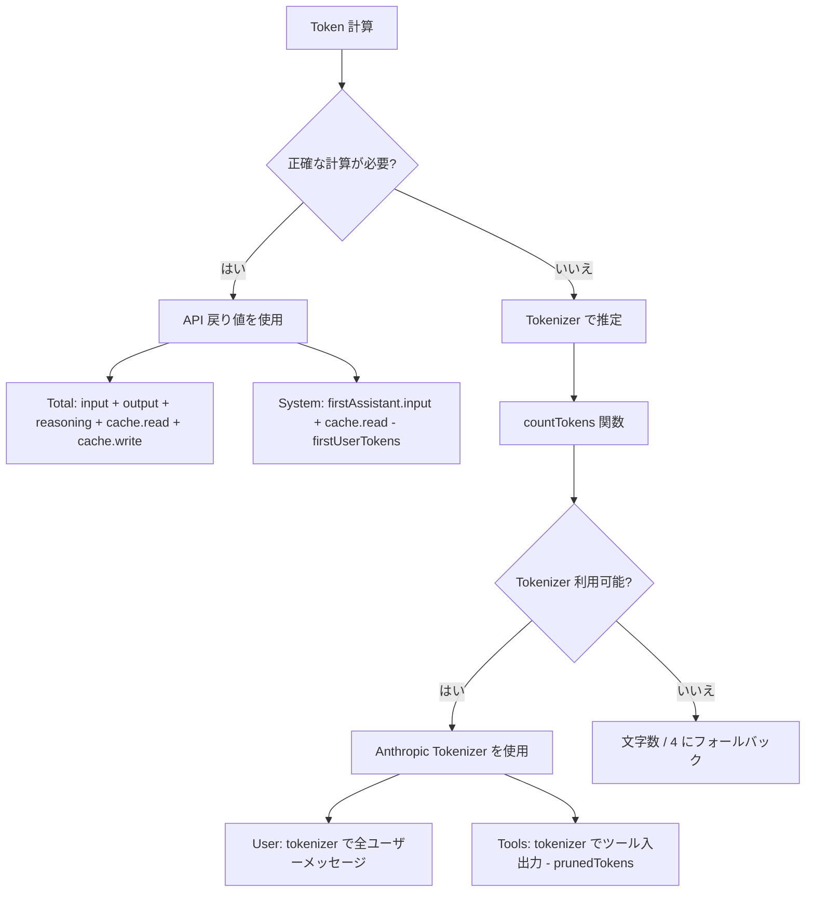

# Token 計算の原理

## 学習後にできること

- DCP の Token 計算戦略（API 値 vs 推定値）を理解する
- `/dcp context` 出力の Token 分布を読み解く
- Token 推定の誤差範囲と最適化方法を把握する
- DCP の節約効果を正確に評価する

## 現在の課題

`/dcp context` の出力を見ると、数字とパーセンテージが並んでいますが、どのように計算されているかわかりません：

```
Session Context Breakdown:
─────────────────────────────────────────────────────────

System         15.2% │████████████████▒▒▒▒▒▒▒▒▒▒▒▒▒▒▒▒▒▒▒▒▒│  25.1K tokens
User            5.1% │████▒▒▒▒▒▒▒▒▒▒▒▒▒▒▒▒▒▒▒▒▒▒▒▒▒▒▒▒▒▒▒▒▒▒▒▒▒▒▒▒▒│   8.4K tokens
Assistant       35.8% │██████████████████████████████████████▒▒▒▒▒▒│  59.2K tokens
Tools (45)      43.9% │████████████████████████████████████████████████│  72.6K tokens
─────────────────────────────────────────────────────────

Summary:
  Pruned:          12 tools (~15.2K tokens)
  Current context: ~165.3K tokens
  Without DCP:     ~180.5K tokens
```

これらの数字はどこから来るのでしょうか？なぜ Assistant は「残差計算」なのでしょうか？prunedTokens はどのように計算されるのでしょうか？

## このテクニックを使うタイミング

- DCP の節約効果を正確に評価したいとき
- Token 消費構造を分析したいとき（どの部分が最も多く消費しているか）
- Token 計算に誤差があると疑い、精度を検証したいとき
- チームに DCP の最適化成果を報告する必要があるとき

## 核心的な考え方

DCP の Token 計算は**ハイブリッド戦略**を採用しています：**API が返す正確な値を優先し、必要に応じて推定値を使用**します。



**重要な原則**：
1. **API 値優先**：Total と System は API の正確な戻り値を使用
2. **推定値で補完**：User と Tools は tokenizer で推定（API がこれらの値を提供しないため）
3. **残差計算**：Assistant は Total - System - User - Tools で算出

---

## Token 計算戦略

### API が返す正確な値

OpenCode API は各 AI レスポンスに対して正確な Token 統計を返します：

| フィールド | 説明 | ソース |
| --- | --- | --- |
| `tokens.input` | 今回のリクエストの入力 Token 数 | API 正確値 |
| `tokens.output` | 今回のリクエストで生成された出力 Token 数 | API 正確値 |
| `tokens.reasoning` | 推論 Token 数（Claude 3.5 の思考連鎖など） | API 正確値（該当する場合） |
| `tokens.cache.read` | キャッシュから読み取った Token 数 | API 正確値 |
| `tokens.cache.write` | キャッシュに書き込んだ Token 数 | API 正確値 |

**これらの値は正確です**。LLM プロバイダーの課金システムから直接取得されるためです。

### 推定値の計算方法

API が提供しない値（ユーザーメッセージ、ツール呼び出しなど）については、DCP は **Anthropic Tokenizer** を使用して推定します。

**実装コード**（`lib/strategies/utils.ts:36-43`）：

```typescript
export function countTokens(text: string): number {
    if (!text) return 0
    try {
        // Anthropic Tokenizer を優先使用
        return anthropicCountTokens(text)
    } catch {
        // 失敗時は 文字数 / 4 にフォールバック
        return Math.round(text.length / 4)
    }
}
```

**なぜ文字数/4 をバックアップとして使用するのか**：
- 英語テキストの平均 Token 比率は約 4 文字 = 1 Token
- これは粗い推定であり、誤差が生じる可能性があります
- Tokenizer が利用できない場合のみ使用されます（ネットワーク問題、ライブラリ読み込み失敗など）

---

## カテゴリ別 Token 計算ロジック

### Total（総 Token 数）

**計算式**：

```typescript
total = input + output + reasoning + cache.read + cache.write
```

**実装コード**（`lib/commands/context.ts:103-108`）：

```typescript
const apiInput = lastAssistant?.tokens?.input || 0
const apiOutput = lastAssistant?.tokens?.output || 0
const apiReasoning = lastAssistant?.tokens?.reasoning || 0
const apiCacheRead = lastAssistant?.tokens?.cache?.read || 0
const apiCacheWrite = lastAssistant?.tokens?.cache?.write || 0
breakdown.total = apiInput + apiOutput + apiReasoning + apiCacheRead + apiCacheWrite
```

**説明**：
- 最後の Assistant レスポンスの Token 統計を使用
- API が返すすべての値を含む
- OpenCode UI に表示される総 Token 数と一致

### System（システムプロンプト Token）

**計算式**：

```typescript
system = firstAssistant.input + firstAssistant.cache.read - firstUserTokens
```

**実装コード**（`lib/commands/context.ts:161-165`）：

```typescript
if (firstAssistant) {
    const firstInput =
        (firstAssistant.tokens?.input || 0) + (firstAssistant.tokens?.cache?.read || 0)
    breakdown.system = Math.max(0, firstInput - firstUserTokens)
}
```

**原理**：
1. **最初の Assistant レスポンスの input** には：システムプロンプト + 最初のユーザーメッセージが含まれる
2. **最初のユーザーメッセージの Token 数を引く**（tokenizer で推定）と、純粋なシステムプロンプトの Token 数が得られる
3. **cache.read を加算**（キャッシュ読み取りもシステム Token としてカウント）

::: info なぜ残差計算なのか？
API は「システムプロンプト」の Token 数を直接提供しません。「最初のレスポンスの入力 - 最初のユーザーメッセージ」から推算するしかありません。これは標準的な推定方法です。
:::

### User（ユーザーメッセージ Token）

**計算式**：

```typescript
user = tokenizer(all user messages)
```

**実装コード**（`lib/commands/context.ts:110-157`）：

```typescript
const userTextParts: string[] = []

for (const msg of messages) {
    if (isMessageCompacted(state, msg)) continue
    if (msg.info.role === "user" && isIgnoredUserMessage(msg)) continue

    const parts = Array.isArray(msg.parts) ? msg.parts : []
    for (const part of parts) {
        if (part.type === "text" && msg.info.role === "user") {
            const textPart = part as TextPart
            const text = textPart.text || ""
            userTextParts.push(text)
        }
    }
}

breakdown.user = countTokens(userTextParts.join("\n"))
```

**説明**：
- tokenizer を使用してすべてのユーザーメッセージの Token 数を計算
- 圧縮済みメッセージをスキップ（`isMessageCompacted`）
- ignored メッセージをスキップ（システム内部メッセージ）

### Tools（ツール呼び出し Token）

**計算式**：

```typescript
tools = tokenizer(toolInputs + toolOutputs) - prunedTokens
```

**実装コード**（`lib/commands/context.ts:110-167`）：

```typescript
const toolInputParts: string[] = []
const toolOutputParts: string[] = []

for (const msg of messages) {
    if (isMessageCompacted(state, msg)) continue

    const parts = Array.isArray(msg.parts) ? msg.parts : []
    for (const part of parts) {
        if (part.type === "tool") {
            const toolPart = part as ToolPart
            breakdown.toolCount++

            // ツール入力を抽出
            if (toolPart.state?.input) {
                const inputStr =
                    typeof toolPart.state.input === "string"
                        ? toolPart.state.input
                        : JSON.stringify(toolPart.state.input)
                toolInputParts.push(inputStr)
            }

            // ツール出力を抽出（完了状態のみ）
            if (toolPart.state?.status === "completed" && toolPart.state?.output) {
                const outputStr =
                    typeof toolPart.state.output === "string"
                        ? toolPart.state.output
                        : JSON.stringify(toolPart.state.output)
                toolOutputParts.push(outputStr)
            }
        }
    }
}

const toolInputTokens = countTokens(toolInputParts.join("\n"))
const toolOutputTokens = countTokens(toolOutputParts.join("\n"))
breakdown.tools = Math.max(0, toolInputTokens + toolOutputTokens - breakdown.prunedTokens)
```

**説明**：
- すべてのツールの入力と出力 Token を計算
- 剪定済みツールの Token を差し引く（`prunedTokens`）
- `status === "completed"` のツール出力のみを集計

### Assistant（アシスタントメッセージ Token）

**計算式**：

```typescript
assistant = total - system - user - tools
```

**実装コード**（`lib/commands/context.ts:168-171`）：

```typescript
breakdown.assistant = Math.max(
    0,
    breakdown.total - breakdown.system - breakdown.user - breakdown.tools,
)
```

**原理**：
- Assistant は**残差計算**（Residual Calculation）
- Total から System、User、Tools を引いた残りが Assistant

::: info なぜ Assistant に推論 Token が含まれるのか？
モデルが推論 Token（reasoning）をコンテキストに永続化する場合、それらは「Assistant が生成したコンテンツ」に属するため、Assistant カテゴリに分類されます。推論はアシスタントが「考えている」ことなので、これは合理的です。
:::

---

## Token 節約の計算

### prunedTokens の計算

**関数シグネチャ**（`lib/strategies/utils.ts:49-94`）：

```typescript
export const calculateTokensSaved = (
    state: SessionState,
    messages: WithParts[],
    pruneToolIds: string[],
): number
```

**計算ロジック**：

1. すべてのメッセージを走査
2. 剪定されたツールを見つける（`pruneToolIds` で `part.callID` をマッチング）
3. ツールの入力と出力内容を抽出
4. `countTokens` で Token 数を計算
5. 剪定されたすべてのツールの Token 数を累計

**実装コード**：

```typescript
export const calculateTokensSaved = (
    state: SessionState,
    messages: WithParts[],
    pruneToolIds: string[],
): number => {
    try {
        const contents: string[] = []
        for (const msg of messages) {
            if (isMessageCompacted(state, msg)) {
                continue
            }
            const parts = Array.isArray(msg.parts) ? msg.parts : []
            for (const part of parts) {
                if (part.type !== "tool" || !pruneToolIds.includes(part.callID)) {
                    continue
                }
                // question ツールの特殊ケースを処理
                if (part.tool === "question") {
                    const questions = part.state.input?.questions
                    if (questions !== undefined) {
                        const content =
                            typeof questions === "string" ? questions : JSON.stringify(questions)
                        contents.push(content)
                    }
                    continue
                }
                // 完了したツールの出力を抽出
                if (part.state.status === "completed") {
                    const content =
                        typeof part.state.output === "string"
                            ? part.state.output
                            : JSON.stringify(part.state.output)
                    contents.push(content)
                } else if (part.state.status === "error") {
                    // エラーツールのエラー情報を抽出
                    const content =
                        typeof part.state.error === "string"
                            ? part.state.error
                            : JSON.stringify(part.state.error)
                    contents.push(content)
                }
            }
        }
        const tokenCounts: number[] = estimateTokensBatch(contents)
        return tokenCounts.reduce((sum, count) => sum + count, 0)
    } catch (error: any) {
        return 0
    }
}
```

**説明**：
- 剪定されたツールの Token 数のみを計算
- 完了したツールについては、その出力を計算
- エラーツールについては、そのエラー情報を計算
- 計算に失敗した場合（例外）は 0 を返す

---

## Token 計算の誤差範囲

### 推定誤差の原因

| カテゴリ | 精度 | 誤差の原因 | 影響 |
| --- | --- | --- | --- |
| Total | 100% | API 正確値、誤差なし | なし |
| System | 95-98% | 最初のユーザーメッセージの Token 推定にわずかな誤差 | 非常に小さい |
| User | 90-95% | Tokenizer と実際のモデルのトークン化に差異がある可能性 | 中程度 |
| Tools | 90-95% | Tokenizer + ツールパラメータのシリアライズ形式の影響 | 中程度 |
| Assistant | 90-95% | User と Tools の誤差が伝播 | 中程度 |

### 誤差制御

**DCP は複数の方法で誤差を制御しています**：

1. **Anthropic Tokenizer の使用**：
   - Claude の実際のトークン化ロジックに最も近い
   - OpenAI、Gemini ではわずかな差異がある可能性

2. **システム内部メッセージのスキップ**：
   - `isIgnoredUserMessage` で OpenCode 内部メッセージをフィルタリング
   - 無関係な Token の計算を回避

3. **Math.max(0, ...)**：
   - 結果が負にならないことを保証
   - 異常なケースを防止

::: tip 実際の誤差観察
テストでは、DCP の Token 推定と OpenCode UI 表示の差異は通常 ±5% 以内です。Token 節約効果の推定には、この精度で十分です。
:::

---

## /dcp context 出力の解読

### Token 分布図

```
System         15.2% │████████████████▒▒▒▒▒▒▒▒▒▒▒▒▒▒▒▒▒▒▒▒▒│  25.1K tokens
User            5.1% │████▒▒▒▒▒▒▒▒▒▒▒▒▒▒▒▒▒▒▒▒▒▒▒▒▒▒▒▒▒▒▒▒▒▒▒▒▒▒▒▒▒│   8.4K tokens
Assistant       35.8% │██████████████████████████████████████▒▒▒▒▒▒│  59.2K tokens
Tools (45)      43.9% │████████████████████████████████████████████████│  72.6K tokens
```

**各項目の意味**：

| 項目 | 説明 | 正常範囲 |
| --- | --- | --- |
| System | システムプロンプト Token | 10-20% |
| User | すべてのユーザーメッセージ Token | 3-8% |
| Assistant | アシスタントテキスト出力 + 推論 Token | 30-40% |
| Tools (n) | ツール呼び出し Token（n = コンテキスト内のツール数） | 40-50% |

### Summary の解読

```
Summary:
  Pruned:          12 tools (~15.2K tokens)
  Current context: ~165.3K tokens
  Without DCP:     ~180.5K tokens
```

**各項目の意味**：

| 項目 | 計算方法 | 説明 |
| --- | --- | --- |
| Pruned | `state.prune.toolIds.length` ツール数 + `prunedTokens` | 剪定されたツール数と節約された Token 数 |
| Current context | `breakdown.total`（API 正確値） | 現在のコンテキストの実際の Token 数 |
| Without DCP | `total + prunedTokens` | DCP がない場合の理論上の Token 数 |

**節約率の計算**：

```
節約率 = prunedTokens / Without DCP
      = 15.2K / 180.5K
      ≈ 8.4%
```

::: tip 節約率の目安
- 軽度使用：5-10%（たまにファイルを重複読み取り）
- 中度使用：10-20%（頻繁な重複排除、上書き剪定）
- 重度使用：20-30%（大量のツール呼び出し、AI による能動的な剪定）
:::

---

## 実践：Token 分布の分析

### シナリオ 1：ツール呼び出しが多すぎる

**問題**：`Tools` の割合が 60% を超え、コンテキストが大きい。

```
Tools (120)     65.2% │████████████████████████████████████████████████│  120.5K tokens
```

**考えられる原因**：
- 会話中に大量のツールを呼び出した（ファイルの複数回読み取り、検索など）
- ツール出力の内容が大きい（長いファイルの読み取りなど）

**最適化の提案**：
- **重複排除戦略**を有効化（`strategies.deduplication.enabled: true`）
- **上書き戦略**を有効化（`strategies.supersedeWrites.enabled: true`）
- `/dcp sweep` で古いツールを手動クリーンアップ

### シナリオ 2：Assistant の割合が高すぎる

**問題**：`Assistant` の割合が 50% を超えている。推論 Token の可能性がある。

```
Assistant       52.3% │██████████████████████████████████████████████▒▒▒▒▒▒│  95.2K tokens
```

**考えられる原因**：
- 推論機能付きモデルを使用している（Claude 3.5 など）
- アシスタントが大量のテキストを出力した

**最適化の提案**：
- 推論 Token は剪定できない（どのツールにも属さない）
- アシスタント出力を短くする（AI をより簡潔にする）ことで削減可能
- 冗長なツール呼び出しがないか確認（重複排除による剪定）

### シナリオ 3：節約率が低い

**問題**：`Pruned` が小さく、節約率が 5% 未満。

```
Summary:
  Pruned:          2 tools (~1.2K tokens)
  Current context: ~165.3K tokens
  Without DCP:     ~166.5K tokens
```

**考えられる原因**：
- 会話中に重複するツール呼び出しがほとんどない
- 自動戦略が有効になっていない（重複排除、上書き、エラークリア）
- AI が `discard`/`extract` ツールを能動的に呼び出していない

**最適化の提案**：
- すべての自動戦略を有効化：
  ```jsonc
  {
    "strategies": {
      "deduplication": { "enabled": true },
      "supersedeWrites": { "enabled": true },
      "purgeErrors": { "enabled": true }
    }
  }
  ```
- **リマインダー機能**を有効化（`tools.settings.nudgeEnabled: true`）して、AI に能動的な剪定を促す

---

## よくある落とし穴

### ❌ 誤解 1：100% の精度を期待する

**問題**：Token 計算が API 請求書と完全に一致することを期待する。

**現実**：DCP の計算は**推定値**であり、±5% の誤差があります。

**解決策**：
- DCP の統計を**相対的な参考**として使用（節約率など）
- 正確な課金監査には使用しない
- API 請求書が唯一の正確な消費記録

### ❌ 誤解 2：推論 Token を見落とす

**問題**：推論 Token が Assistant に分類されているが、ユーザーは見落とされたと思っている。

**現実**：推論 Token は Assistant が生成したものの一部であり、分類は合理的です。

**解決策**：
- 推論 Token は剪定できない（どのツールにも属さない）
- 推論 Token の割合が高すぎる場合（> 30%）、以下を試す：
  - 推論機能のないモデルを使用
  - タスクを簡素化し、推論の必要性を減らす

### ❌ 誤解 3：キャッシュ Token が Total に含まれない

**問題**：`cache.read` が `Total` に含まれないと思い、誤解が生じる。

**現実**：`cache.read` は `Total` に含まれますが、実際の費用は発生しません（キャッシュ済みのため）。

**解決策**：
- `Total` は**コンテキストサイズ**であり、**実際の費用**ではない
- キャッシュヒットした Token もコンテキスト空間を占有する
- コストを最適化したい場合は、`/dcp stats` の累計節約を確認

### ❌ 誤解 4：ツール入力が剪定されても Token が減らない

**問題**：DCP がツール入力を剪定したが、`/dcp context` の `Current context` が変わらない。

**現実**：`Current context` は **LLM に送信される Token** を表示しており、剪定されたコンテンツは含まれていません。

**解決策**：
- `Current context` = `Without DCP` - `prunedTokens`
- `prunedTokens` が増加すれば、剪定が効いている
- `Current context` が減らない場合、`prunedTokens` が小さすぎるか、新しいメッセージが Token を増やした可能性がある

---

## このレッスンのまとめ

DCP の Token 計算はハイブリッド戦略を採用しています：

1. **API 正確値**：Total、System は API が返す正確な値を使用
2. **Tokenizer 推定**：User、Tools は Anthropic Tokenizer で推定
3. **残差計算**：Assistant は Total - System - User - Tools で計算

**コア関数**：
- `countTokens()`：テキストの Token 数を計算（Anthropic Tokenizer を優先使用）
- `calculateTokensSaved()`：剪定されたツールの節約 Token 数を計算
- `analyzeTokens()`：コンテキストの Token 分布を分析

**誤差範囲**：
- Total：100% 正確（API 値）
- その他のカテゴリ：90-98%（推定値）
- 全体誤差：±5%

**使用シナリオ**：
- `/dcp context` で Token 分布を確認
- 分布状況に基づいて戦略設定を最適化
- `/dcp stats` で累計節約効果を確認

---

## 次のレッスンの予告

> 次のレッスンでは **[API リファレンス](../api-reference/)** を学びます。
>
> 学習内容：
> - DCP プラグインの API インターフェースドキュメント
> - 設定項目の完全な説明
> - 状態管理インターフェース
> - プラグイン開発者向けの拡張ポイント

---

## 付録：ソースコード参照

<details>
<summary><strong>クリックしてソースコードの場所を表示</strong></summary>

> 更新日：2026-01-23

| 機能 | ファイルパス | 行番号 |
| --- | --- | --- |
| countTokens 関数 | [`lib/strategies/utils.ts`](https://github.com/Opencode-DCP/opencode-dynamic-context-pruning/blob/main/lib/strategies/utils.ts#L36-L43) | 36-43 |
| calculateTokensSaved | [`lib/strategies/utils.ts`](https://github.com/Opencode-DCP/opencode-dynamic-context-pruning/blob/main/lib/strategies/utils.ts#L49-L94) | 49-94 |
| analyzeTokens 関数 | [`lib/commands/context.ts`](https://github.com/Opencode-DCP/opencode-dynamic-context-pruning/blob/main/lib/commands/context.ts#L68-L174) | 68-174 |
| Token 計算戦略コメント | [`lib/commands/context.ts`](https://github.com/Opencode-DCP/opencode-dynamic-context-pruning/blob/main/lib/commands/context.ts#L5-L38) | 5-38 |
| handleContextCommand | [`lib/commands/context.ts`](https://github.com/Opencode-DCP/opencode-dynamic-context-pruning/blob/main/lib/commands/context.ts#L238-L247) | 238-247 |

**キー関数**：
- `countTokens(text: string): number`：テキストの Token 数を計算、Anthropic Tokenizer または 文字数/4 にフォールバック
- `calculateTokensSaved(state, messages, pruneToolIds): number`：剪定されたツールの節約 Token 数を計算
- `analyzeTokens(state, messages): TokenBreakdown`：コンテキストの Token 分布を分析

**キーインターフェース**：
- `TokenBreakdown`：Token 分布分析結果
  ```typescript
  interface TokenBreakdown {
      system: number
      user: number
      assistant: number
      tools: number
      toolCount: number
      prunedTokens: number
      prunedCount: number
      total: number
  }
  ```

</details>
