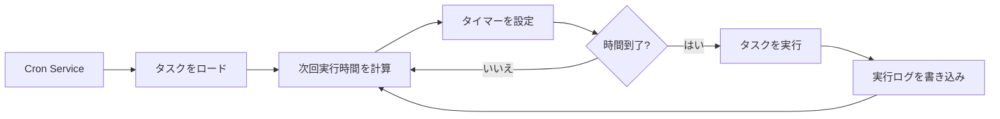

# Cron スケジュールタスクと Webhook

## 学習後できること

このレッスンを学習すると、次のことができるようになります：

- 指定された時間や周期で自動的に AI タスクを実行する Cron スケジュールタスクを作成する
- 3 つのスケジューリング方式（at、every、cron）の使用シナリオを理解する
- 外部イベントトリガーを受信する Webhook を設定する
- メールトリガーで AI レスポンスを実現する Gmail Pub/Sub 統合を設定する
- タスク実行履歴とログを管理する

## 現在の課題

次のような状況に直面しているかもしれません：

- 特定の時間に自分をリマインドしたい
- 定期的に作業進捗を要約したりレポートを生成したい
- 特定のメールを受信したときに自動的に AI 分析をトリガーしたい
- 毎回手動で AI にメッセージを送りたくない

## いつ使うべきか

**Cron スケジュールタスク**は次のシナリオに適しています：

| シナリオ | 例 | スケジュール方式 |
|---------|-----|------------------|
| 一回限りのリマインダー | 「明日の朝 9 時に会議をリマインドして」 | at |
| 定期チェック | 「30 分ごとにシステム状態をチェックして」 | every |
| 時刻指定実行 | 「毎日午後 5 時に日報を生成して」 | cron |
| 複雑な周期 | 「月曜から金曜の朝 9 時に」 | cron |

**Webhook**は次のシナリオに適しています：

- GitHub、GitLab のプッシュ通知を受信する
- Stripe の支払い成功通知を受信する
- Twilio の着信通知を受信する
- HTTP POST を送信できるサービスなら何でも可能

**Gmail Pub/Sub**は次のシナリオに適しています：

- 重要なメールを受信したときに自動分析する
- メールの分類と自動返信
- メールコンテンツの抽出とアーカイブ

---

## コア概念

### Cron タスクのワークフロー



### 3 つのスケジューリング方式の比較

| 方式 | 使用シナリオ | 例 | 精度 |
|------|------------|-----|------|
| `at` | 一回限りのタスク | 2026-01-27 09:00:00 | ミリ秒単位 |
| `every` | 固定間隔 | 30 分ごと | ミリ秒単位 |
| `cron` | 複雑な周期 | 毎朝 9 時 | 分単位 |

### 2 つのセッションターゲット

| セッションターゲット | Payload タイプ | 説明 |
|-------------------|---------------|------|
| `main` | `systemEvent` | メインセッションにシステムイベントを注入 |
| `isolated` | `agentTurn` | 分離されたセッションで Agent を実行 |

**重要な制約**：
- `sessionTarget="main"` は `payload.kind="systemEvent"` を使用する必要があります
- `sessionTarget="isolated"` は `payload.kind="agentTurn"` を使用する必要があります

---

## 🎒 開始前の準備

開始する前に、次のことを確認してください：

::: warning 事前チェック
- [ ] Gateway が起動している（[Gateway の起動](../../start/gateway-startup/)）
- [ ] AI モデルが設定されている（[AI モデルの設定](../models-auth/)）
- [ ] Cron 式の基本的な構文を理解している（cron スケジュールを使用する場合）
:::

---

## 実践

### ステップ 1：Cron サービスの状態を確認

**なぜ**：Cron サービスが有効で実行中であることを確認するため

```bash
## CLI で Cron 状態を確認
clawdbot cron status
```

**次のように表示されます**：

```
✓ Cron enabled
  Store: ~/.clawdbot/cron.json
  Jobs: 0
  Next wake: null
```

`disabled` と表示される場合、設定ファイルで有効にする必要があります：

```json
{
  "cron": {
    "enabled": true,
    "store": "~/.clawdbot/cron.json",
    "maxConcurrentRuns": 5
  }
}
```

---

### ステップ 2：一回限りのスケジュールタスクを作成

**なぜ**：最も基本的な `at` スケジューリング方式を学ぶため

cron ツールを使用して 1 分後に実行するタスクを追加します：

```json
{
  "action": "add",
  "job": {
    "name": "テストリマインダー",
    "enabled": true,
    "schedule": {
      "kind": "at",
      "atMs": 1738000000000
    },
    "sessionTarget": "main",
    "wakeMode": "next-heartbeat",
    "payload": {
      "kind": "systemEvent",
      "text": "これはテストリマインダーです：作業進捗を確認"
    }
  }
}
```

**次のように表示されます**：

```
✓ Job added: job_xxx
  Name: テストリマインダー
  Next run: 2026-01-27 10:00:00
```

**ヒント**：`atMs` は Unix タイムスタンプ（ミリ秒）です。JavaScript で計算できます：

```javascript
Date.now() + 60 * 1000  // 1 分後
```

---

### ステップ 3：繰り返しインターバルタスクを作成

**なぜ**：定期チェックに適した `every` スケジューリング方式を学ぶため

30 分ごとに実行するタスクを作成します：

```json
{
  "action": "add",
  "job": {
    "name": "30分ごとにシステムをチェック",
    "enabled": true,
    "schedule": {
      "kind": "every",
      "everyMs": 1800000
    },
    "sessionTarget": "main",
    "wakeMode": "next-heartbeat",
    "payload": {
      "kind": "systemEvent",
      "text": "システム状態をチェック：CPU、メモリ、ディスク"
    }
  }
}
```

**次のように表示されます**：

```
✓ Job added: job_xxx
  Name: 30分ごとにシステムをチェック
  Interval: 30 minutes
  Next run: 2026-01-27 10:00:00
```

**パラメータの説明**：
- `everyMs`: 間隔時間（ミリ秒）
  - 1 分 = 60,000 ms
  - 5 分 = 300,000 ms
  - 30 分 = 1,800,000 ms
  - 1 時間 = 3,600,000 ms
- `anchorMs`（オプション）：初回実行の開始時間

---

### ステップ 4：Cron 式タスクを作成

**なぜ**：複雑な周期に適した `cron` スケジューリング方式を学ぶため

毎朝 9 時に実行するタスクを作成します：

```json
{
  "action": "add",
  "job": {
    "name": "毎朝9時に日報",
    "enabled": true,
    "schedule": {
      "kind": "cron",
      "expr": "0 9 * * *",
      "tz": "Asia/Shanghai"
    },
    "sessionTarget": "main",
    "wakeMode": "next-heartbeat",
    "payload": {
      "kind": "systemEvent",
      "text": "本日の作業日報を生成"
    }
  }
}
```

**次のように表示されます**：

```
✓ Job added: job_xxx
  Name: 毎朝9時に日報
  Schedule: 0 9 * * * (Asia/Shanghai)
  Next run: 2026-01-27 09:00:00
```

**Cron 式の形式**：

```
┌───────────── 分 (0 - 59)
│ ┌─────────── 時 (0 - 23)
│ │ ┌───────── 日 (1 - 31)
│ │ │ ┌─────── 月 (1 - 12)
│ │ │ │ ┌───── 曜日 (0 - 7, 0 と 7 は日曜日)
│ │ │ │ │
* * * * *
```

**よく使われる式**：

| 式 | 説明 |
|----|------|
| `0 9 * * *` | 毎朝 9 時 |
| `0 9 * * 1-5` | 月曜から金曜の朝 9 時 |
| `0 */6 * * *` | 6 時間ごと |
| `0 0 * * 0` | 毎週日曜日の深夜 |
| `0 9,17 * * *` | 毎日 9 時と 17 時 |

::: info タイムゾーンの設定
Cron 式はデフォルトで UTC タイムゾーンを使用します。`tz` フィールドでタイムゾーンを指定すると（例：`"Asia/Shanghai"`）、タスクが期待する時刻に実行されます。
:::

---

### ステップ 5：分離セッションでタスクを実行

**なぜ**：分離された環境で AI タスクを実行し、メインセッションへの干渉を避けるため

分離されたセッションで実行するタスクを作成します：

```json
{
  "action": "add",
  "job": {
    "name": "毎日の要約",
    "enabled": true,
    "schedule": {
      "kind": "cron",
      "expr": "0 18 * * *",
      "tz": "Asia/Shanghai"
    },
    "sessionTarget": "isolated",
    "wakeMode": "next-heartbeat",
    "payload": {
      "kind": "agentTurn",
      "message": "今日の作業を要約：1. 完了したタスク 2. 発生した問題 3. 明日の計画",
      "model": "anthropic/claude-sonnet-4-20250514",
      "thinking": "low"
    }
  }
}
```

**次のように表示されます**：

```
✓ Job added: job_xxx
  Name: 毎日の要約
  Session: isolated
  Next run: 2026-01-27 18:00:00
```

**`agentTurn` Payload パラメータ**：

| パラメータ | タイプ | 説明 |
|-----------|--------|------|
| `message` | string | Agent に送信するプロンプト |
| `model` | string | 使用するモデルをオーバーライド（オプション） |
| `thinking` | string | 思考レベル："off" \| "minimal" \| "low" \| "medium" \| "high" |
| `timeoutSeconds` | number | タイムアウト時間（秒） |
| `deliver` | boolean | 結果をチャネルに送信するかどうか |
| `channel` | string | ターゲットチャネル（例：`"whatsapp"`、`"telegram"`） |
| `to` | string | 受信者識別子 |
| `bestEffortDeliver` | boolean | 指定されたチャネルに送信できない場合、他のチャネルを試すかどうか |

**分離セッション設定**（オプション）：

```json
{
  "isolation": {
    "postToMainPrefix": "📊 毎日の要約:",
    "postToMainMode": "summary",
    "postToMainMaxChars": 8000
  }
}
```

| パラメータ | 説明 |
|-----------|------|
| `postToMainPrefix` | メインセッションに結果を転送するときのプレフィックス |
| `postToMainMode` | "summary"（要約）または "full"（全文） |
| `postToMainMaxChars` | `postToMainMode="full"` の場合の最大文字数 |

---

### ステップ 6：タスクリストの表示と管理

**なぜ**：すべてのタスクを表示してその状態を管理するため

**すべてのタスクを表示**：

```bash
clawdbot cron list
```

**次のように表示されます**：

```
Jobs: 3
  ✓ job_xxx: テストリマインダー (enabled, next: 2026-01-27 10:00:00)
  ✓ job_yyy: 30分ごとにシステムをチェック (enabled, next: 2026-01-27 10:00:00)
  ✓ job_zzz: 毎朝9時に日報 (enabled, next: 2026-01-27 09:00:00)
```

**無効なタスクも含める**：

```bash
clawdbot cron list --include-disabled
```

**タスクを無効化**：

```json
{
  "action": "update",
  "jobId": "job_xxx",
  "patch": {
    "enabled": false
  }
}
```

**タスクを有効化**：

```json
{
  "action": "update",
  "jobId": "job_xxx",
  "patch": {
    "enabled": true
  }
}
```

**タスクを削除**：

```json
{
  "action": "remove",
  "jobId": "job_xxx"
}
```

---

### ステップ 7：タスクを即座に実行

**なぜ**：タスクが正常に動作しているかをテストするため、スケジュールを待つ必要がない

```json
{
  "action": "run",
  "jobId": "job_xxx"
}
```

**次のように表示されます**：

```
✓ Job ran: job_xxx
  Status: ok
  Duration: 1234ms
```

**実行履歴を表示**：

```json
{
  "action": "runs",
  "jobId": "job_xxx",
  "limit": 10
}
```

**次のように表示されます**：

```
Runs for job_xxx (10 most recent):
  2026-01-27 10:00:00 - ok - 1234ms
  2026-01-26 10:00:00 - ok - 1189ms
  2026-01-25 10:00:00 - ok - 1245ms
```

---

### ステップ 8：リマインタスクにコンテキストを追加

**なぜ**：AI に最近の会話コンテキストを理解させ、関連性の高いリマインダーを提供するため

`contextMessages` パラメータを使用して最近のメッセージ履歴を追加します：

```json
{
  "action": "add",
  "job": {
    "name": "タスクフォローアップリマインダー",
    "enabled": true,
    "schedule": {
      "kind": "cron",
      "expr": "0 10,16 * * *",
      "tz": "Asia/Shanghai"
    },
    "sessionTarget": "main",
    "wakeMode": "next-heartbeat",
    "payload": {
      "kind": "systemEvent",
      "text": "タスク進捗をフォローアップ：1. タスクリストを確認 2. プロジェクトステータスを更新"
    },
    "contextMessages": 5
  }
}
```

**コンテキストメッセージの制限**：
- 最大メッセージ数：10 件
- 各メッセージの最大文字数：220
- 総文字数制限：700
- 形式：`- User: ...\n- Assistant: ...`

**自動的に追加されるコンテキスト**：

```
タスク進捗をフォローアップ：1. タスクリストを確認 2. プロジェクトステータスを更新

Recent context:
- User: 今日中にレポートを完了する必要があります
- Assistant: 分かりました。どのようなタイプのレポートですか？
- User: 週報で、今週の作業要約が含まれます
```

---

## Webhook 設定

### Webhook の概要

Webhook は外部サービスが HTTP POST リクエストを通じて Clawdbot の内部イベントをトリガーすることを可能にします。一般的な用途：

- **GitHub/GitLab**: プッシュ通知で CI/CD プロセスをトリガー
- **Stripe**: 支払い成功通知で注文処理をトリガー
- **Twilio**: 着信通知で AI 音声応答をトリガー
- **Jira**: チケット作成通知で自動返信をトリガー

### Webhook の設定

**Hooks システムを有効化**：

```json
{
  "hooks": {
    "enabled": true,
    "path": "/hooks",
    "token": "your-secret-token-here"
  }
}
```

**マッピングルールを設定**：

```json
{
  "hooks": {
    "enabled": true,
    "token": "your-secret-token-here",
    "mappings": [
      {
        "id": "github-push",
        "match": {
          "path": "/hooks/github"
        },
        "action": "wake",
        "wakeMode": "now",
        "sessionKey": "main",
        "messageTemplate": "GitHub プッシュ通知: {{ repository }} - {{ ref }}"
      }
    ]
  }
}
```

**マッピング設定パラメータ**：

| パラメータ | 説明 |
|-----------|------|
| `match.path` | 一致する URL パス |
| `match.source` | 一致するリクエストソースヘッダー |
| `action` | `"wake"` または `"agent"` |
| `wakeMode` | `"now"` または `"next-heartbeat"` |
| `sessionKey` | ターゲットセッションキー（例：`"main"`） |
| `messageTemplate` | Mustache 構文を使用したメッセージテンプレート |
| `deliver` | チャネルに送信するかどうか |
| `channel` | ターゲットチャネル（例：`"whatsapp"`） |
| `to` | 受信者識別子 |
| `transform` | 変換モジュール（リクエストボディを処理） |

---

## Gmail Pub/Sub 統合

### Gmail Pub/Sub の概要

Gmail Pub/Sub は新しいメールを受信したときにリアルタイムで Clawdbot をトリガーし、メール駆動型の AI レスポンスを実現します。

### Gmail Pub/Sub の設定

**基本設定**：

```json
{
  "hooks": {
    "enabled": true,
    "token": "your-hook-token",
    "gmail": {
      "account": "your-email@gmail.com",
      "label": "INBOX",
      "topic": "projects/your-project-id/topics/gmail-topic",
      "subscription": "gmail-subscription",
      "pushToken": "your-push-token",
      "hookUrl": "http://127.0.0.1:18789/hooks/gmail",
      "includeBody": true,
      "maxBytes": 20000,
      "renewEveryMinutes": 720
    }
  }
}
```

**設定パラメータの説明**：

| パラメータ | 説明 | デフォルト値 |
|-----------|------|------------|
| `account` | Gmail アカウントアドレス | - |
| `label` | 監視する Gmail ラベル | `INBOX` |
| `topic` | Google Cloud Pub/Sub トピックパス | - |
| `subscription` | Pub/Sub サブスクリプション名 | `gmail-subscription` |
| `pushToken` | Gmail プッシュトークン | - |
| `hookUrl` | Webhook 受信 URL | 自動生成 |
| `includeBody` | メール本文を含めるかどうか | `true` |
| `maxBytes` | 最大メールバイト数 | `20000` |
| `renewEveryMinutes` | サブスクリプション更新間隔（分） | `720`（12 時間） |

### Tailscale 統合（オプション）

**Tailscale Serve を使用して Webhook を公開**：

```json
{
  "hooks": {
    "gmail": {
      "tailscale": {
        "mode": "serve",
        "path": "/gmail-pubsub",
        "target": "10000"
      }
    }
  }
}
```

**Tailscale Funnel を使用**：

```json
{
  "hooks": {
    "gmail": {
      "tailscale": {
        "mode": "funnel",
        "path": "/gmail-pubsub"
      }
    }
  }
}
```

| モード | 説明 |
|-------|------|
| `off` | Tailscale を使用しない |
| `serve` | Tailscale Serve を通じてローカルサービスを公開 |
| `funnel` | Tailscale Funnel を通じてインターネットからアクセス |

### Gmail Watcher の起動

**Gmail Watcher サービスを起動**：

```bash
clawdbot hooks gmail-watch
```

**次のように表示されます**：

```
✓ Gmail watcher started
  Account: your-email@gmail.com
  Label: INBOX
  Watching...
```

**Gmail Watcher は以下を行います**：
1. Gmail のラベル変更を購読
2. 新しいメールプッシュを受信
3. メール情報を Webhook に送信
4. Clawdbot の内部イベントをトリガー

---

## チェックポイント ✅

**理解できたことを確認**：

- [ ] 3 つのタイプの Cron タスク（at、every、cron）を作成できる
- [ ] `main` と `isolated` セッションターゲットの違いを理解できる
- [ ] タスクリストの表示、有効化、無効化、削除ができる
- [ ] タスクの実行履歴を表示できる
- [ ] Webhook の設定と動作原理を理解できる
- [ ] Gmail Pub/Sub 統合を設定できる

---

## トラブルシューティング

### タスクが実行されない

**問題**：タスクは追加されたが実行されない

**考えられる原因**：

| 原因 | 解決方法 |
|------|---------|
| Cron サービスが有効でない | `cron.enabled` 設定を確認 |
| 時間がまだ来ていない | `clawdbot cron list` で次回実行時間を確認 |
| タイムゾーンが間違っている | `tz` フィールドが正しいか確認 |
| タスクが無効化されている | `--include-disabled` でタスク状態を確認 |

### Cron 式のエラー

**問題**：タスクが間違った時刻に実行される

**よくあるエラー**：

| エラー | 正しい | 説明 |
|--------|--------|------|
| `9 * * *` | `0 9 * * *` | 分フィールドが欠けている |
| `0 9 * * * *` | `0 9 * * *` | フィールドが 1 つ多い |
| `0 9 1-5 * *` | `0 9 * * 1-5` | 曜日フィールドの位置が間違っている |

**検証ツール**：[crontab.guru](https://crontab.guru/) を使用して Cron 式を検証します。

### Gmail Pub/Sub が動作しない

**問題**：メールを受信したがトリガーされない

**チェックリスト**：

- [ ] Gmail Watcher サービスが実行中かどうか
- [ ] `hookUrl` にアクセスできるかどうか（curl でテスト）
- [ ] `token` が正しく設定されているかどうか
- [ ] Pub/Sub トピックとサブスクリプションが正しく作成されているかどうか
- [ ] ネットワーク接続が正常かどうか（Tailscale 使用時）

### 分離セッションが応答しない

**問題**：`sessionTarget="isolated"` のタスクが出力されない

**考えられる原因**：

- `model` フィールドが欠けており、デフォルトモデルが使用されているが設定されていない
- `message` プロンプトが不明確
- `timeoutSeconds` が短すぎてタスクがタイムアウトする
- `deliver=false` だが `postToMainMode` が設定されていない

**解決方法**：

1. ログの詳細度を増やす
2. Gateway ログを確認する
3. `bestEffortDeliver=true` を使用して、結果が少なくともメインセッションに転送されるようにする

---

## レッスンまとめ

Cron と Webhook は Clawdbot の強力な自動化ツールです：

**Cron システム**：
- 3 つのスケジューリング方式：`at`（一回限り）、`every`（間隔）、`cron`（複雑な周期）
- 2 つのセッションターゲット：`main`（システムイベントを注入）、`isolated`（Agent を実行）
- タスク履歴と実行ログをサポート
- 関連性の高いリマインダーを提供するためにコンテキストメッセージを追加可能

**Webhook システム**：
- 外部 HTTP POST リクエストを受信
- マッピングルールとメッセージテンプレートをサポート
- インターネット公開用に Tailscale を設定可能

**Gmail Pub/Sub**：
- 新しいメールをリアルタイムで監視
- ラベルフィルタリングをサポート
- Tailscale Serve/Funnel と統合

これらの機能を適切に設定することで、完全に自動化された AI アシスタントを構築し、適切なタイミングで応答させることができます。

---

## 次のレッスンのプレビュー

> 次のレッスンでは **[メモリシステムとベクトル検索](../memory-system/)** を学習します。
>
> 次のことができるようになります：
> - メモリシステムのファイル構造とインデックスメカニズム
> - ベクトル検索プロバイダーの設定（OpenAI、Gemini、ローカル）
> - ハイブリッド検索（BM25 + ベクトル）を使用して検索精度を向上
> - CLI によるメモリインデックスと検索の管理

---

## 付録：ソースコードリファレンス

<details>
<summary><strong>クリックしてソースコードの場所を表示</strong></summary>

> 更新日時：2026-01-27

| 機能 | ファイルパス | 行番号 |
|------|-----------|--------|
| Cron 設定型定義 | [`src/config/types.cron.ts`](https://github.com/clawdbot/clawdbot/blob/main/src/config/types.cron.ts#L1-L6) | 1-6 |
| Cron コア型定義 | [`src/cron/types.ts`](https://github.com/clawdbot/clawdbot/blob/main/src/cron/types.ts#L1-L95) | 1-95 |
| Cron Service | [`src/cron/service.ts`](https://github.com/clawdbot/clawdbot/blob/main/src/cron/service.ts#L1-L49) | 1-49 |
| Cron 操作実装 | [`src/cron/service/ops.ts`](https://github.com/clawdbot/clawdbot/blob/main/src/cron/service/ops.ts#L1-L141) | 1-141 |
| Cron ツール実装 | [`src/agents/tools/cron-tool.ts`](https://github.com/clawdbot/clawdbot/blob/main/src/agents/tools/cron-tool.ts#L1-L291) | 1-291 |
| Gateway Cron メソッド | [`src/gateway/server-methods/cron.ts`](https://github.com/clawdbot/clawdbot/blob/main/src/gateway/server-methods/cron.ts#L1-L205) | 1-205 |
| Hooks 設定型定義 | [`src/config/types.hooks.ts`](https://github.com/clawdbot/clawdbot/blob/main/src/config/types.hooks.ts#L1-L125) | 1-125 |
| Hooks Gmail ツール | [`src/hooks/gmail.ts`](https://github.com/clawdbot/clawdbot/blob/main/src/hooks/gmail.ts#L1-L267) | 1-267 |
| Hooks 内部イベント | [`src/hooks/hooks.ts`](https://github.com/clawdbot/clawdbot/blob/main/src/hooks/hooks.ts#L1-L15) | 1-15 |
| Hooks CLI コマンド | [`src/cli/hooks-cli.ts`](https://github.com/clawdbot/clawdbot/blob/main/src/cli/hooks-cli.ts#L1-L839) | 1-839 |

**重要な定数**：
- `DEFAULT_GMAIL_LABEL = "INBOX"`: Gmail デフォルトラベル
- `DEFAULT_GMAIL_TOPIC = "gog-gmail-watch"`: Gmail デフォルトトピック名
- `DEFAULT_GMAIL_SUBSCRIPTION = "gog-gmail-watch-push"`: Gmail デフォルトサブスクリプション名
- `DEFAULT_GMAIL_MAX_BYTES = 20000`: Gmail デフォルト最大メールバイト数
- `DEFAULT_GMAIL_RENEW_MINUTES = 720`: Gmail デフォルト更新間隔（12 時間）

**重要な関数**：
- `CronService.start()`: Cron サービスを起動
- `CronService.add()`: スケジュールタスクを追加
- `CronService.update()`: タスクを更新
- `CronService.remove()`: タスクを削除
- `CronService.run()`: タスクを即座に実行
- `createCronTool()`: Cron ツールを作成
- `resolveGmailHookRuntimeConfig()`: Gmail Hook 設定を解析
- `buildGogWatchStartArgs()`: Gmail Watch 起動パラメータを構築
- `buildGogWatchServeArgs()`: Gmail Watch サービスパラメータを構築

</details>
