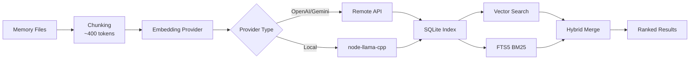

# メモリシステムとベクトル検索の完全ガイド

## 学習後の達成目標

このレッスンを終えると、以下のことができるようになります：

- Clawdbot メモリシステムのファイル構造とインデックスメカニズムを理解する
- ベクトル検索プロバイダー（OpenAI、Gemini、ローカル）を設定する
- ハイブリッド検索（BM25 + ベクトル）を使用して検索精度を向上させる
- CLI を使用してメモリインデックスと検索を管理する
- Embedding キャッシュとインデックスのパフォーマンスを調整する

## 現在の課題

以下のような状況に直面しているかもしれません：

- AI が新しいセッションで以前の会話内容を「忘れる」
- AI に永続的な知識と設定を記憶させたい
- AI に「学習」させ、重要な情報を記憶させる方法が不明
- 過去の会話を検索しても関連するコンテキストが見つからない

## いつ使うか

**メモリシステム**は、以下のシナリオに適しています：

| シナリオ | 例 | 保存場所 |
|------|--------|----------|
| 永続的な知識 | 「ベジタリアンが好きだ、これを記憶して」 | MEMORY.md |
| 日々のノート | 「今日の作業進捗とタスク」 | memory/YYYY-MM-DD.md |
| セッション検索 | 「前回議論したAPIエンドポイントは？」 | ベクトルインデックス |
| 設定情報 | 「Gateway はポート18789で実行中」 | MEMORY.md |

---

## コアコンセプト

### メモリシステムの2層構造

Clawdbot は長期記憶を管理するために **2層のデータ** を使用します：

| レベル | ファイルパス | 用途 | 読み込みタイミング |
|------|----------|------|----------|
| **長期記憶** | `MEMORY.md` | 精選された知識、設定、重要な事実 | メインセッション開始時に読み込み |
| **毎日ログ** | `memory/YYYY-MM-DD.md` | 日々のノート、実行コンテキスト | 今日 + 昨日のものを読み込み |

::: info なぜ2層なのか？
`MEMORY.md` は「ナレッジベース」のようなもので、メインセッションにのみ読み込まれ、機密情報がグループ会話に漏れないようにします。`memory/*.md` は「日記帳」で、日常的な記録を保存し、後で振り返りやすくします。
:::

### ベクトルインデックスのワークフロー



### ハイブリッド検索：BM25 + ベクトル

ベクトル検索は「意味マッチング」に優れていますが、「正確マッチング」には弱いです：

| クエリタイプ | ベクトル検索 | BM25全文 | ハイブリッド検索 |
|----------|----------|-----------|----------|
| "サーバーのIPアドレス" | ❌ 弱い | ✅ 強い | ✅ 最適 |
| "Gatewayをデプロイする方法" | ✅ 強い | ⚠️ 中程度 | ✅ 最適 |
| "APIエンドポイント a828e60" | ❌ 弱い | ✅ 強い | ✅ 最適 |

**融合式**：
```javascript
finalScore = vectorWeight × vectorScore + textWeight × textScore
```

- `vectorWeight + textWeight` は自動的に1.0に正規化されます
- デフォルト：70% ベクトル + 30% キーワード
- `agents.defaults.memorySearch.query.hybrid.*` で調整可能

---

## 🎒 事前準備

開始前に、以下を確認してください：

::: warning 事前チェック
- [ ] Gateway が起動している（[Gatewayの起動](../../start/gateway-startup/)）
- [ ] AIモデルが設定されている（[AIモデル設定](../models-auth/)）
- [ ] 基本的なMarkdownファイルの編集方法を知っている
:::

::: tip 推奨設定
- 優先的に OpenAI または Gemini embeddings を使用（高速で高品質）
- ローカル embeddings には `pnpm rebuild node-llama-cpp` が必要
- 最初のインデックス作成には数分かかる場合がありますが、その後は増分更新が高速です
:::

---

## 実践

### ステップ1：メモリファイルを作成する

**理由**：AI は既存のファイルのみをインデックスするため、先にメモリコンテンツを作成します

Agent 作業ディレクトリ（デフォルト `~/clawd`）でファイルを作成：

```bash
# 長期記憶ファイルを作成
cat > ~/clawd/MEMORY.md << 'EOF'
# 個人の設定

- 食事の好み：ベジタリアン、辛いものは食べない
- 勤務時間：午前9時から午後6時
- よく使うコマンド：`clawdbot gateway status`

# 重要な設定

- Gateway ポート：18789
- データベース：PostgreSQL 15
EOF

# 今日のログを作成
cat > ~/clawd/memory/$(date +%Y-%m-%d).md << 'EOF'
# 今日の作業進捗

- Gatewayの設定を完了
- メモリシステムを学習
- タスク：モデル認証ドキュメントを読む
EOF
```

**期待する表示**：

```bash
# ファイル構造を確認
tree ~/clawd/
# または
ls -la ~/clawd/
ls -la ~/clawd/memory/

# 出力例
~/clawd/
├── MEMORY.md
└── memory/
    └── 2026-01-27.md
```

### ステップ2：メモリシステムの状態を確認する

**理由**：Embedding プロバイダーとインデックスの状態を確認する

```bash
# 基本状態チェック
clawdbot memory status

# 深度チェック（プロバイダーの可用性を検出）
clawdbot memory status --deep

# 深度チェック + 強制再インデックス
clawdbot memory status --deep --index
```

**期待する表示**：

```bash
✓ Memory Search enabled
  Store: ~/.clawdbot/memory/main.sqlite
  Provider: openai
  Model: text-embedding-3-small
  Fallback: openai
  Hybrid: enabled (vectorWeight: 0.7, textWeight: 0.3)
  Cache: enabled (maxEntries: 50000)
  Sources: memory
  Indexed: 2 files, 5 chunks
```

::: tip 深度チェック
- `--deep` は OpenAI/Gemini/Local embeddings が使用可能かどうかを検出します
- `--index` は「ダーティ」なインデックスを検出すると自動的に再インデックスします
- 初回実行時、インデックス作成には数分かかる場合があります
:::

### ステップ3：手動でインデックスをトリガーする

**理由**：新しく作成したメモリファイルがインデックスされることを確認する

```bash
# 手動でインデックスをトリガー
clawdbot memory index

# 詳細ログ付き
clawdbot memory index --verbose

# 特定のエージェントのみ
clawdbot memory index --agent main
```

**期待する表示**：

```bash
Indexing memory for agent: main
  Provider: openai (text-embedding-3-small)
  Sources: memory
  - MEMORY.md (2 chunks)
  - memory/2026-01-27.md (3 chunks)
✓ Indexed 2 files, 5 chunks
```

### ステップ4：意味検索をテストする

**理由**：ベクトル検索とハイブリッド検索が正常に動作しているかを確認する

```bash
# 基本検索
clawdbot memory search "ベジタリアン"

# 正確一致検索（BM25をテスト）
clawdbot memory search "Gateway ポート"

# あいまいな意味検索（ベクトルをテスト）
clawdbot memory search "何を食べるのが好きか"

# 詳細な結果を表示
clawdbot memory search "Gateway" --verbose
```

**期待する表示**：

```bash
Searching memory for: "ベジタリアン"

Results (2):

[1] MEMORY.md:3-5 (score: 0.842)
  - 食事の好み：ベジタリアン、辛いものは食べない

[2] memory/2026-01-27.md:1-3 (score: 0.615)
  - Gatewayの設定を完了
  - メモリシステムを学習
```

### ステップ5：Embedding プロバイダーを設定する

**理由**：ニーズに応じて最適なプロバイダー（リモート vs ローカル）を選択する

#### オプション A：OpenAI embeddings（推奨）

設定ファイル `~/.clawdbot/clawdbot.json` を編集：

```json
{
  "agents": {
    "defaults": {
      "memorySearch": {
        "enabled": true,
        "provider": "openai",
        "model": "text-embedding-3-small",
        "fallback": "openai",
        "remote": {
          "apiKey": "YOUR_OPENAI_API_KEY",
          "batch": {
            "enabled": true,
            "concurrency": 2
          }
        }
      }
    }
  }
}
```

**メリット**：
- 高速で高品質
- バッチインデックスをサポート（コスト効率が良い）
- 大規模なバックフィルに適している

#### オプション B：Gemini embeddings

```json
{
  "agents": {
    "defaults": {
      "memorySearch": {
        "provider": "gemini",
        "model": "gemini-embedding-001",
        "remote": {
          "apiKey": "YOUR_GEMINI_API_KEY"
        },
        "fallback": "openai"
      }
    }
  }
}
```

#### オプション C：ローカル embeddings（プライバシー優先）

```json
{
  "agents": {
    "defaults": {
      "memorySearch": {
        "provider": "local",
        "local": {
          "modelPath": "hf:ggml-org/embeddinggemma-300M-GGUF/embeddinggemma-300M-Q8_0.gguf",
          "modelCacheDir": "~/.cache/embeddings"
        },
        "fallback": "none"
      }
    }
  }
}
```

**注意事項**：

```bash
# 初回ローカル embeddings 使用時にビルドが必要
pnpm approve-builds
# node-llama-cpp を選択
pnpm rebuild node-llama-cpp
```

**期待する表示**：

```bash
✓ node-llama-cpp installed
✓ Local embedding model ready
```

::: warning ローカル embeddings
- 初回はモデルを自動的にダウンロード（~600MB）
- node-llama-cpp のコンパイルが必要（システム環境に依存）
- リモートより遅いが、完全にオフラインでプライバシー優先
:::

### ステップ6：ハイブリッド検索の重みを設定する

**理由**：ユースケースに応じて意味とキーワードの重み比率を調整する

設定を編集：

```json
{
  "agents": {
    "defaults": {
      "memorySearch": {
        "query": {
          "hybrid": {
            "enabled": true,
            "vectorWeight": 0.7,
            "textWeight": 0.3,
            "candidateMultiplier": 4
          }
        }
      }
    }
  }
}
```

**パラメータ説明**：

| パラメータ | デフォルト値 | 説明 | 調整推奨 |
|------|---------|------|----------|
| `vectorWeight` | 0.7 | 意味検索の重み | 「自然言語」クエリには 0.8 に上げる |
| `textWeight` | 0.3 | キーワード検索の重み | 「コード/ID」クエリには 0.5 に上げる |
| `candidateMultiplier` | 4 | 候補乗数 | 再現率を上げるには 6 に増やす |

**効果比較**：

```bash
# 意味クエリをテスト
clawdbot memory search "Gatewayをデプロイする方法"
# vectorWeight: 0.7 → 意味に関連する結果が見つかる
# textWeight: 0.5 → 「デプロイ」、「Gateway」キーワードが見つかる

# 正確クエリをテスト
clawdbot memory search "APIエンドポイント a828e60"
# vectorWeight: 0.3 → 意味を無視、優先一致
# textWeight: 0.7 → "a828e60" を正確に一致
```

### ステップ7：SQLite-vec アクセラレーションを有効にする

**理由**：ベクトルクエリを SQLite にプッシュダウンし、すべての embeddings をロードするのを避ける

設定を編集：

```json
{
  "agents": {
    "defaults": {
      "memorySearch": {
        "store": {
          "vector": {
            "enabled": true,
            "extensionPath": "/path/to/sqlite-vec"
          }
        }
      }
    }
  }
}
```

**sqlite-vec が利用可能か確認**：

```bash
# インデックス状態を確認
clawdbot memory status --deep

# 利用可能な場合、次のように表示されます
✓ SQLite-vec extension loaded
  Vector table: chunks_vec
```

::: info SQLite-vec
- デフォルトで自動的にロードを試みます
- ロードに失敗した場合、自動的に JS 計算にフォールバック（機能には影響しません）
- カスタムパスは特殊ビルドまたは標準以外のインストールにのみ使用されます
:::

---

## チェックポイント ✅

上記の手順を完了した後、以下を確認してください：

| チェック項目 | 検証方法 | 期待される結果 |
|---------|----------|----------|
| メモリファイルが存在 | `ls ~/clawd/` | MEMORY.md と memory/ ディレクトリが存在 |
| インデックスが作成 | `clawdbot memory status` | Indexed > 0 chunks と表示 |
| 検索が正常 | `clawdbot memory search "..."` | 関連する結果が返される |
| Provider が正常 | `clawdbot memory status --deep` | Provider タイプが表示される |

---

## トラブルシューティング

### 問題1：Embedding プロバイダーの失敗

**現象**：

```bash
✗ Memory Search disabled
  Error: No API key found for provider
```

**解決策**：

```bash
# 設定を確認
cat ~/.clawdbot/clawdbot.json | grep -A 5 "memorySearch"

# apiKey が存在することを確認
# または環境変数を設定
export OPENAI_API_KEY="sk-..."
export GEMINI_API_KEY="..."
```

### 問題2：ローカル embeddings がロードできない

**現象**：

```bash
✗ Local embedding provider failed
  Error: Cannot find module 'node-llama-cpp'
```

**解決策**：

```bash
# ビルドを承認
pnpm approve-builds

# 再ビルド
pnpm rebuild node-llama-cpp
```

### 問題3：インデックスが更新されない

**現象**：

```bash
# MEMORY.md を変更した
# しかし検索結果は古いまま
```

**解決策**：

```bash
# 方法1：手動でインデックスをトリガー
clawdbot memory index

# 方法2：Gateway を再起動（onSessionStart インデックスをトリガー）
clawdbot gateway restart

# 方法3：ファイル監視を確認
clawdbot memory status --verbose
# "Watch: true" を確認
```

### 問題4：検索結果が無関係

**現象**：「Gateway」を検索したのに「作業進捗」が返される

**考えられる原因**：

1. **ハイブリッド重みが不適切**：
   - 意味クエリ（「デプロイ方法」）→ `vectorWeight` を上げる
   - キーワードクエリ（「APIエンドポイント」）→ `textWeight` を上げる

2. **インデックスが完全に更新されていない**：
   ```bash
   # 強制再インデックス
   rm ~/.clawdbot/memory/main.sqlite
   clawdbot memory index
   ```

3. **チャンク粒度の問題**：
   - デフォルト 400 トークン、コンテキストが切断される可能性があります
   - `agents.defaults.memorySearch.chunking.tokens` を調整

---

## レッスンのまとめ

このレッスンでは、以下を学びました：

1. **メモリシステムアーキテクチャ**
   - 2層データ構造（MEMORY.md + memory/*.md）
   - ベクトルインデックス + FTS5全文検索
   - ハイブリッド検索（BM25 + ベクトル）

2. **Embedding プロバイダーの設定**
   - OpenAI/Gemini/ローカルの3つのオプション
   - バッチインデックスによる高速化
   - フォールバックメカニズム

3. **CLI ツールの使用**
   - `clawdbot memory status` で状態確認
   - `clawdbot memory index` でインデックストリガー
   - `clawdbot memory search` で検索テスト

4. **パフォーマンス最適化**
   - SQLite-vec ベクトルアクセラレーション
   - Embedding キャッシュ
   - ハイブリッド重みのチューニング

---

## 次のレッスン

> 次のレッスンでは、**[セキュリティとサンドボックス分離](../security-sandbox/)** を学びます。
>
> 学ぶこと：
> - ツール権限制御と allowlist
> - Sandbox セッション分離
> - Exec 承認メカニズム
> - Docker デプロイメント
> - Tailscale 認証

---

## 付録：ソースコード参照

<details>
<summary><strong>クリックしてソースコードの場所を表示</strong></summary>

> 更新日時：2026-01-27

| 機能 | ファイルパス | 行番号 |
|------|----------|------|
| メモリマネージャー | [`src/memory/manager.ts`](https://github.com/clawdbot/clawdbot/blob/main/src/memory/manager.ts) | 1-200 |
| ハイブリッド検索 | [`src/memory/hybrid.ts`](https://github.com/clawdbot/clawdbot/blob/main/src/memory/hybrid.ts) | 1-112 |
| Embedding プロバイダー | [`src/memory/embeddings.ts`](https://github.com/clawdbot/clawdbot/blob/main/src/memory/embeddings.ts) | 1-80 |
| OpenAI embeddings | [`src/memory/embeddings-openai.ts`](https://github.com/clawdbot/clawdbot/blob/main/src/memory/embeddings-openai.ts) | 全文 |
| Gemini embeddings | [`src/memory/embeddings-gemini.ts`](https://github.com/clawdbot/clawdbot/blob/main/src/memory/embeddings-gemini.ts) | 全文 |
| ローカル embeddings | [`src/memory/node-llama.ts`](https://github.com/clawdbot/clawdbot/blob/main/src/memory/node-llama.ts) | 全文 |
| SQLite-vec | [`src/memory/sqlite-vec.ts`](https://github.com/clawdbot/clawdbot/blob/main/src/memory/sqlite-vec.ts) | 全文 |
| バッチインデックス（OpenAI） | [`src/memory/batch-openai.ts`](https://github.com/clawdbot/clawdbot/blob/main/src/memory/batch-openai.ts) | 全文 |
| バッチインデックス（Gemini） | [`src/memory/batch-gemini.ts`](https://github.com/clawdbot/clawdbot/blob/main/src/memory/batch-gemini.ts) | 全文 |
| 検索マネージャー | [`src/memory/manager-search.ts`](https://github.com/clawdbot/clawdbot/blob/main/src/memory/manager-search.ts) | 全文 |
| Memory Schema | [`src/memory/memory-schema.ts`](https://github.com/clawdbot/clawdbot/blob/main/src/memory/memory-schema.ts) | 全文 |

**重要な設定**：
- `agents.defaults.memorySearch.enabled`：メモリ検索の有効/無効
- `agents.defaults.memorySearch.provider`：Embedding プロバイダー（"openai"、"gemini"、"local"）
- `agents.defaults.memorySearch.query.hybrid.vectorWeight`：ベクトル検索の重み（デフォルト 0.7）
- `agents.defaults.memorySearch.query.hybrid.textWeight`：BM25 検索の重み（デフォルト 0.3）
- `agents.defaults.memorySearch.cache.enabled`：Embedding キャッシュ（デフォルト true）
- `agents.defaults.memorySearch.store.vector.enabled`：SQLite-vec アクセラレーション（デフォルト true）

**重要な関数**：
- `mergeHybridResults()`：ベクトル + BM25 結果のマージ（`src/memory/hybrid.ts:39-111`）
- `bm25RankToScore()`：BM25 ランクからスコアへ（`src/memory/hybrid.ts:34-37`）
- `createEmbeddingProvider()`：Embedding プロバイダーの作成（`src/memory/embeddings.ts`）
- `getMemorySearchManager()`：メモリ検索マネージャーの取得（`src/memory/search-manager.ts`）

**CLI コマンド**：
- `clawdbot memory status`：状態確認（`src/cli/commands/memory-cli.ts`）
- `clawdbot memory index`：インデックストリガー（`src/cli/commands/memory-cli.ts`）
- `clawdbot memory search`：メモリ検索（`src/cli/commands/memory-cli.ts`）

</details>
