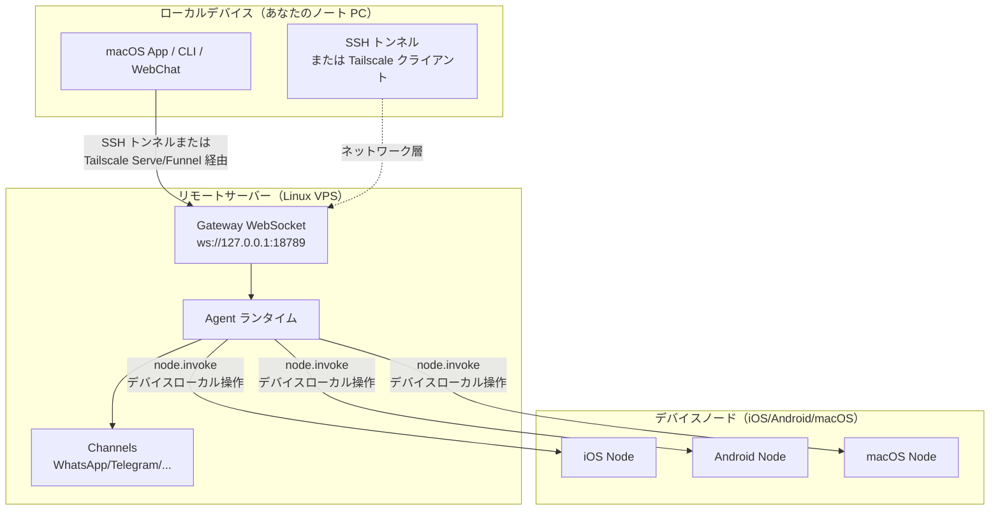

# リモート Gateway：Tailscale と SSH トンネルで Clawdbot にアクセス | Clawdbot チュートリアル

## 学習後のゴール

**リモート Gateway** を使用すると、デバイスの制限から解放され、Always-on の Linux サーバーに AI アシスタントをデプロイできます。このレッスンを完了すると、以下のことができるようになります：

- ✅ Linux サーバーまたは VPS で Clawdbot Gateway を実行する
- ✅ Tailscale Serve/Funnel を使用して Gateway を安全にネットワークに公開する
- ✅ SSH トンネルを使用してクライアントからリモート Gateway に接続する
- ✅ Gateway と Node のアーキテクチャの違いを理解する（exec がどこで実行されるか、デバイス操作がどこで実行されるか）
- ✅ 安全なリモートアクセスポリシーを設定する

## 現在の課題

あなたは次のような問題に直面しているかもしれません：

- 🤔 「私のノート PC は頻繁にスリープしますが、AI アシスタントを常にオンラインにしたいです」
- 🤔 「安価な VPS で Gateway を実行したいですが、安全にアクセスする方法がわかりません」
- 🤔 「Tailscale Serve と Funnel の違いは何ですか？どちらを使えばいいですか？」
- 🤔 「SSH トンネルは面倒です。もっと自動化されたソリューションはありますか？」

## いつ使用すべきか

**リモート Gateway** は次のシナリオに適しています：

| シナリオ | 推奨ソリューション | 理由 |
|--- | --- | ---|
| ノート PC が頻繁にスリープし、AI を常駐させたい | **Tailscale Serve + Linux VPS** | VPS はスリープせず、tailnet を通じて安全にアクセスできます |
| 家庭デスクトップで Gateway を実行し、ノート PC からリモート制御 | **SSH トンネル** または **Tailscale Serve** | Gateway セッションと設定を統一 |
| 公開インターネットからアクセスしたい（一時テスト） | **Tailscale Funnel + パスワード** | 簡単に公開できますが、パスワード保護が必要 |
| 複数のデバイスで 1 つの AI アシスタントを共有 | **Always-on Gateway** | すべてのセッション、設定、履歴を一元管理 |

::: warning 非推奨のシナリオ
1 台のデバイスしか持ち、頻繁に持ち歩いている場合、**リモート Gateway は不要です**。ローカルで Gateway を実行してください。
:::

## 🎒 開始前の準備

開始する前に、以下を確認してください：

- [ ] **[Gateway の起動](/ja/clawdbot/clawdbot/start/gateway-startup/)** レッスンを完了している
- [ ] 基本的な SSH コマンドを理解している（SSH トンネルを使用する場合、オプション）
- [ ] （Tailscale を使用する場合）Tailscale CLI をインストール済みでログインしている
- [ ] リモート Linux サーバーまたは VPS を準備している（推奨：Ubuntu/Debian）

---

## コアコンセプト

### リモート Gateway アーキテクチャ

リモート Gateway の核心理念は：**Gateway は制御センター、クライアントは端末** です。



### 3 つの重要な概念

| 概念 | 説明 | 例 |
|--- | --- | ---|
| **Gateway ホスト** | Gateway サービスを実行するマシン、セッション、認証、チャネル、状態を管理 | Linux VPS、家庭デスクトップ |
| **クライアント** | Gateway に接続するツール（macOS App、CLI、WebChat） | あなたのノート PC、スマートフォン |
| **デバイスノード** | Gateway WebSocket を通じて接続する周辺機器、デバイスローカル操作を実行 | iOS デバイス、Android デバイス、macOS ノードモード |

### コマンドはどこで実行される？

最も一般的な混乱点です：

| 操作タイプ | 実行場所 | 理由 |
|--- | --- | ---|
| `exec` ツール | **Gateway ホスト** | Shell コマンドは Gateway マシンで実行されます |
| `browser` ツール | **Gateway ホスト**（または個別のブラウザ制御サーバー） | ブラウザは Gateway マシンで起動します |
| ノード操作（`camera.snap`、`system.run`）| **デバイスノード** | デバイスローカルリソースにアクセスする必要があります |

**一言で覚える**：
- Gateway ホスト → 汎用コマンドと AI の実行
- デバイスノード → デバイス固有のローカル操作の実行

---

## さあ、やってみよう

### ステップ 1：リモートサーバーに Clawdbot をインストールする

**なぜ？**
Linux サーバーは長時間オンラインの Gateway サービスの実行に適しています。

リモートサーバーで実行します：

```bash
# 1. Node.js をインストール（≥22）
curl -fsSL https://deb.nodesource.com/setup_22.x | sudo -E bash -
sudo apt-get install -y nodejs

# 2. Clawdbot をインストール
npm install -g @clawdbot/cli

# 3. インストールを確認
clawdbot --version
```

**期待される出力**：
```
clawdbot CLI v<version>
```

### ステップ 2：onboarding ウィザードを実行する

**なぜ？**
対話型ウィザードで基本設定を素早く構成できます。

```bash
clawdbot onboard
```

ウィザードに従って以下を完了します：
- チャネルを選択（例：Telegram）
- AI モデルを設定（例：OpenAI、Anthropic）
- Gateway 認証を設定（Token または Password）

::: tip 推奨
`gateway.auth.mode: "password"` を設定すると、リモート接続時にパスワード認証を使用できます：
```bash
export CLAWDBOT_GATEWAY_PASSWORD="your-secure-password"
```
:::

**期待される出力**：
```
✅ Gateway configured successfully
✅ Channels configured: telegram
✅ AI model configured: openai:gpt-4o-mini
```

### ステップ 3：Gateway デーモンを起動する

**なぜ？**
Gateway をバックグラウンドで継続的に実行する必要があります。

```bash
# Gateway を起動（デフォルトで loopback: 127.0.0.1:18789 にバインド）
clawdbot gateway start
```

**期待される出力**：
```
🚀 Gateway starting...
📡 WebSocket: ws://127.0.0.1:18789
🔒 Auth mode: password
```

::: tip systemd を使用した自動起動（Linux）
サービスファイル `/etc/systemd/system/clawdbot.service` を作成します：

```ini
[Unit]
Description=Clawdbot Gateway
After=network.target

[Service]
Type=simple
User=your-user
ExecStart=/usr/bin/clawdbot gateway start
Restart=on-failure
RestartSec=5s
Environment="CLAWDBOT_GATEWAY_PASSWORD=your-secure-password"

[Install]
WantedBy=multi-user.target
```

サービスを起動します：
```bash
sudo systemctl enable clawdbot
sudo systemctl start clawdbot
sudo systemctl status clawdbot
```
:::

---

### ソリューション A：Tailscale Serve を使用する（推奨）

#### ステップ 4：Tailscale をインストールしてログインする

**なぜ？**
Tailscale Serve は安全な HTTPS アクセスを提供し、公開 IP は不要です。

```bash
# Tailscale CLI をインストール
curl -fsSL https://tailscale.com/install.sh | sh

# Tailscale にログイン
sudo tailscale up
```

**期待される出力**：
```
To authenticate, visit:

    https://login.tailscale.com/a/xxxxx

----------------------------------------------------
Copy the URL and open it in your browser.
```

#### ステップ 5：Tailscale Serve を設定する

**なぜ？**
Tailscale Serve を通じて Gateway を tailnet に公開し、Gateway を loopback-only（最も安全）に保ちます。

設定ファイル `~/.clawdbot/clawdbot.json` を変更します：

```json5
{
  "gateway": {
    "bind": "loopback",
    "tailscale": {
      "mode": "serve",
      "resetOnExit": true
    },
    "auth": {
      "mode": "password"
    }
  }
}
```

**設定の説明**：
- `bind: "loopback"`：Gateway はローカルループバックのみをリッスン（最も安全）
- `tailscale.mode: "serve"`：Tailscale Serve を通じて tailnet に公開
- `resetOnExit: true`：終了時に Serve 設定を取り消し

#### ステップ 6：Gateway を再起動する

**なぜ？**
新しい Tailscale 設定を適用します。

```bash
# systemd を使用している場合
sudo systemctl restart clawdbot

# または直接再起動（フォアグラウンドで実行している場合）
clawdbot gateway restart
```

**期待される出力**：
```
🚀 Gateway starting...
📡 WebSocket: ws://127.0.0.1:18789
🌐 Tailscale Serve: https://your-tailnet-name.tailnet-name.ts.net/
🔒 Auth mode: password
```

#### ステップ 7：クライアントから接続する

**なぜ？**
リモート Gateway にアクセスできるかどうかを確認します。

クライアントマシンで：

1. **同じ Tailscale tailnet に参加していることを確認**
2. **Control UI にアクセス**：
    ```
    https://<magicdns>/  # または https://<tailnet-ip>:18789/
    ```
3. **WebSocket に接続**：
    ```bash
    # 接続を確認
    clawdbot health --url ws://<tailnet-ip>:18789 --password your-secure-password
    ```

**期待される出力**：
```
✅ Gateway is healthy
✅ Authenticated successfully
✅ Channels: telegram (connected)
```

---

### ソリューション B：SSH トンネルを使用する（汎用フォールバック）

#### ステップ 4：SSH 鍵認証を設定する

**なぜ？**
SSH 鍵認証はパスワードよりも安全で、接続を自動化できます。

クライアントマシンで鍵ペアを生成します：

```bash
# 鍵ペアを生成（まだない場合）
ssh-keygen -t rsa -b 4096 -f ~/.ssh/clawdbot_gateway
```

**期待される出力**：
```
Generating public/private rsa key pair.
Enter passphrase (empty for no passphrase): [そのまま Enter]
Enter same passphrase again: [そのまま Enter]
Your identification has been saved in ~/.ssh/clawdbot_gateway
Your public key has been saved in ~/.ssh/clawdbot_gateway.pub
```

#### ステップ 5：公開鍵をリモートサーバーにコピーする

**なぜ？**
リモートサーバーがクライアントの鍵を信頼するようにします。

```bash
# 公開鍵をリモートサーバーにコピー
ssh-copy-id -i ~/.ssh/clawdbot_gateway.pub your-user@remote-server-ip
```

**期待される出力**：
```
Number of key(s) added: 1
Now try logging into the machine with:   "ssh 'your-user@remote-server-ip'"
```

#### ステップ 6：SSH 設定を作成する

**なぜ？**
SSH 接続コマンドを簡略化し、その後の使用を容易にします。

クライアントマシンの `~/.ssh/config` を編集します：

```txt
Host clawdbot-remote
    HostName <remote-server-ip>
    User your-user
    IdentityFile ~/.ssh/clawdbot_gateway
    LocalForward 18789 127.0.0.1:18789
    ServerAliveInterval 60
    ServerAliveCountMax 3
```

**設定の説明**：
- `LocalForward 18789 127.0.0.1:18789`：ローカルの 18789 ポートをリモートの 18789 に転送
- `ServerAliveInterval 60`：60 秒ごとにハートビートを送信し、接続をアクティブに保つ

#### ステップ 7：SSH トンネルを確立する

**なぜ？**
ローカルからリモート Gateway への安全なチャネルを作成します。

```bash
# SSH トンネルを起動（バックグラウンドで実行）
ssh -N -f clawdbot-remote
```

**期待される出力**：
（出力なし、コマンドがバックグラウンドで実行中）

#### ステップ 8：接続を確認する

**なぜ？**
SSH トンネルと Gateway の両方が正常に動作しているか確認します。

```bash
# ローカルポートが転送されているか確認
lsof -i :18789

# Gateway 接続をテスト
clawdbot health --url ws://127.0.0.1:18789 --password your-secure-password
```

**期待される出力**：
```
COMMAND   PID   USER   FD   TYPE DEVICE SIZE/OFF NODE NAME
ssh      12345  user   4u  IPv4  0x1234      0t0 TCP *:18789 (LISTEN)

✅ Gateway is healthy
✅ Authenticated successfully
```

#### ステップ 9：SSH トンネルを自動起動する（macOS）

**なぜ？**
起動時に自動起動し、手動操作が不要になります。

`~/Library/LaunchAgents/com.clawdbot.ssh-tunnel.plist` を作成します：

```xml
<?xml version="1.0" encoding="UTF-8"?>
<!DOCTYPE plist PUBLIC "-//Apple//DTD PLIST 1.0//EN" "http://www.apple.com/DTDs/PropertyList-1.0.dtd">
<plist version="1.0">
<dict>
    <key>Label</key>
    <string>com.clawdbot.ssh-tunnel</string>
    <key>ProgramArguments</key>
    <array>
        <string>/usr/bin/ssh</string>
        <string>-N</string>
        <string>-f</string>
        <string>clawdbot-remote</string>
    </array>
    <key>KeepAlive</key>
    <true/>
    <key>RunAtLoad</key>
    <true/>
</dict>
</plist>
```

Launch Agent を読み込みます：

```bash
launchctl bootstrap gui/$UID ~/Library/LaunchAgents/com.clawdbot.ssh-tunnel.plist
```

**期待される出力**：
（出力なし、トンネルがバックグラウンドで自動実行中）

::: tip Linux 自動起動（systemd user service）
`~/.config/systemd/user/clawdbot-ssh-tunnel.service` を作成します：

```ini
[Unit]
Description=Clawdbot SSH Tunnel
After=network.target

[Service]
Type=simple
ExecStart=/usr/bin/ssh -N clawdbot-remote
Restart=on-failure
RestartSec=5s

[Install]
WantedBy=default.target
```

サービスを起動します：
```bash
systemctl --user enable clawdbot-ssh-tunnel
systemctl --user start clawdbot-ssh-tunnel
```
:::

---

### ソリューション C：Tailscale Funnel を使用する（公開アクセス、パスワード必須）

::: danger セキュリティ警告
Tailscale Funnel は Gateway を公開インターネットに公開します！
- **必ず**パスワード認証を使用してください（`gateway.auth.mode: "password"`）
- **推奨**一時テストにのみ使用し、本番環境には適していません
:::

#### ステップ 4：Funnel を設定する

**なぜ？**
Tailscale Funnel を通じて公開 HTTPS アクセスを提供します。

設定ファイル `~/.clawdbot/clawdbot.json` を変更します：

```json5
{
  "gateway": {
    "bind": "loopback",
    "tailscale": {
      "mode": "funnel",
      "resetOnExit": true
    },
    "auth": {
      "mode": "password",
      "password": "${CLAWDBOT_GATEWAY_PASSWORD}"
    }
  }
}
```

**重要**：
- `tailscale.mode: "funnel"`：Tailscale Funnel を使用（公開アクセス）
- `auth.mode: "password"`：Funnel はパスワードを必須（起動を拒否）

#### ステップ 5：Gateway を再起動する

```bash
sudo systemctl restart clawdbot
```

**期待される出力**：
```
🚀 Gateway starting...
🌐 Tailscale Funnel: https://your-funnel-url.ts.net/
🔒 Auth mode: password
```

#### ステップ 6：公開インターネットから接続する

```bash
clawdbot health --url wss://your-funnel-url.ts.net --password your-secure-password
```

---

## チェックポイント ✅

上記のいずれかのソリューションを完了したら、以下を確認します：

| チェック項目 | コマンド | 期待される結果 |
|--- | --- | ---|
| Gateway が実行中か | `clawdbot gateway status` | ✅ Running |
| WebSocket にアクセスできるか | `clawdbot health --url <url>` | ✅ Healthy |
| Channels が接続されているか | `clawdbot channels status` | ✅ connected |
| ノードがペアリング可能か | `clawdbot nodes list` | ノードリストが表示される |

---

## 落とし穴の警告

### トラップ 1：Gateway が loopback 以外にバインドされている

**問題**：
```json5
{
  "gateway": {
    "bind": "lan"  // ❌ 危険！
  }
}
```

**結果**：
- Gateway が LAN または公開 IP でリッスンし、誰でも接続できます
- 認証を設定していない場合、**深刻なセキュリティリスク**

**正しい方法**：
```json5
{
  "gateway": {
    "bind": "loopback",  // ✅ 最も安全
    "tailscale": {
      "mode": "serve"  // ✅ Tailscale Serve を通じて公開
    }
  }
}
```

### トラップ 2：Tailscale Funnel でパスワードを設定しない

**問題**：
```json5
{
  "gateway": {
    "auth": {
      "mode": "token"  // ❌ Funnel では許可されません！
    },
    "tailscale": {
      "mode": "funnel"
    }
  }
}
```

**結果**：
- Gateway が起動を拒否します（Funnel はパスワードを必須）

**正しい方法**：
```json5
{
  "gateway": {
    "auth": {
      "mode": "password",  // ✅ Funnel はパスワード必須
      "password": "${CLAWDBOT_GATEWAY_PASSWORD}"
    },
    "tailscale": {
      "mode": "funnel"
    }
  }
}
```

### トラップ 3：SSH トンネルポートの競合

**問題**：
```
channel_setup_fwd: listen 127.0.0.1:18789: cannot listen to port: Address already in use
```

**原因**：ローカルの 18789 ポートが既に使用されています

**解決策**：
```bash
# ポートを使用しているプロセスを検索
lsof -i :18789

# 競合するプロセスを終了
kill -9 <PID>

# または別のポートを使用して転送（クライアント URL も変更する必要があります）
ssh -N -L 18790:127.0.0.1:18789 clawdbot-remote
```

### トラップ 4：macOS App の SSH 経由 Remote が機能しない

**問題**：macOS App が "Unable to connect to Gateway" と表示します

**チェック**：
1. SSH トンネルが実行中か：
    ```bash
    ps aux | grep "ssh -N clawdbot-remote" | grep -v grep
    ```
2. Gateway Token が設定されているか：
    ```bash
    launchctl getenv CLAWDBOT_GATEWAY_TOKEN
    ```
3. App の設定が正しいか：
    - Settings → General → "Clawdbot runs" → "On a remote machine over SSH"

**解決策**：
- SSH トンネルを再起動します
- macOS App を終了して再起動します

---

## このレッスンのまとめ

### コアポイント

- ✅ **リモート Gateway** により AI アシスタントを常駐オンラインにし、クライアントはいつでも接続できます
- ✅ **Tailscale Serve** は最も安全なソリューション（tailnet-only + HTTPS + loopback）
- ✅ **SSH トンネル** は汎用フォールバックソリューション（Tailscale 不要）
- ✅ **Tailscale Funnel** は一時的な公開アクセスに適しています（パスワード必須）
- ✅ **Gateway ホスト**が `exec` と汎用コマンドを実行し、**デバイスノード**がデバイスローカル操作を実行します

### 設定の比較

| ソリューション | セキュリティ | アクセス範囲 | 設定の複雑さ | 推奨シナリオ |
|--- | --- | --- | --- | ---|
| Tailscale Serve | ⭐⭐⭐⭐⭐ | Tailnet | 中 | **推奨**：Always-on Gateway |
| SSH トンネル | ⭐⭐⭐⭐ | SSH 接続到達可能 | 低 | 汎用フォールバック、家庭デスクトップのリモート制御 |
| Tailscale Funnel | ⭐⭐ | 公開インターネット | 低 | 一時テスト、デモ |

### セキュリティチェックリスト

- [ ] Gateway が `loopback` にバインドされている
- [ ] Tailscale Funnel がパスワード認証を使用している
- [ ] SSH 鍵が設定されている（SSH トンネルを使用する場合）
- [ ] パスワードが環境変数を通じて設定されている（設定ファイルに書き込まない）
- [ ] 定期的に `clawdbot security audit` を実行している

---

## 次のレッスン预告

> 次のレッスンでは、**[スキルプラットフォームと ClawdHub](../skills-platform/)** を学びます。
>
> 学習内容：
> - スキルシステムの概念（Bundled/Managed/Workspace）
> - ClawdHub からサードパーティのスキルをインストールする方法
> - カスタムスキルの作成と管理方法
> - スキルの権限と分離メカニズム

---

## 付録：ソースコードリファレンス

<details>
<summary><strong>クリックしてソースコードの場所を表示</strong></summary>

> 更新日時：2026-01-27

| 機能 | ファイルパス | 行番号 |
|--- | --- | ---|
| Gateway リモート設定 Schema | [`src/config/types.gateway.ts`](https://github.com/clawdbot/clawdbot/blob/main/src/config/types.gateway.ts) | 200-220 |
| Gateway Tailscale 設定 Schema | [`src/config/types.gateway.ts`](https://github.com/clawdbot/clawdbot/blob/main/src/config/types.gateway.ts) | 150-180 |
| Tailscale インテグレーション | [`src/infra/tailscale.ts`](https://github.com/clawdbot/clawdbot/blob/main/src/infra/tailscale.ts) | 1-100 |
| リモート Gateway ドキュメント | [`docs/gateway/remote.md`](https://github.com/clawdbot/clawdbot/blob/main/docs/gateway/remote.md) | 1-123 |
| Tailscale ドキュメント | [`docs/gateway/tailscale.md`](https://github.com/clawdbot/clawdbot/blob/main/docs/gateway/tailscale.md) | 1-147 |
| macOS App リモートアクセスドキュメント | [`docs/gateway/remote-gateway-readme.md`](https://github.com/clawdbot/clawdbot/blob/main/docs/gateway/remote-gateway-readme.md) | 1-154 |
| セキュリティドキュメント | [`docs/gateway/security.md`](https://github.com/clawdbot/clawdbot/blob/main/docs/gateway/security.md) | 1-100 |

**重要な設定フィールド**：

- `gateway.bind`: Gateway バインドアドレス（`loopback`/`lan`/`tailnet`/`auto`）
- `gateway.tailscale.mode`: Tailscale モード（`off`/`serve`/`funnel`）
- `gateway.auth.mode`: 認証モード（`token`/`password`）
- `gateway.auth.allowTailscale`: Tailscale identity ヘッダーを許可するか（`true`/`false`）
- `gateway.remote.url`: リモート Gateway URL（CLI デフォルト）
- `gateway.remote.token`: リモート Gateway Token（CLI 認証）
- `gateway.tailscale.resetOnExit`: 終了時に Serve/Funnel 設定を取り消すか（`true`/`false`）

**重要なビジネスルール**：

- Gateway はデフォルトで loopback（`127.0.0.1`）にバインドされる【事実】
- Tailscale Serve は tailnet-only HTTPS アクセスを提供する【事実】
- Tailscale Funnel はパスワード認証を必須とする（`gateway.auth.mode: "password"`）【事実】
- `gateway.remote.token` はリモート CLI 呼び出し専用で、ローカル認証を有効にしない【事実】
- `gateway.bind: "tailnet"` は Tailnet IP に直接バインドする（Serve/Funnel 不要）【事実】

**セキュリティルール**：

- Loopback + SSH/Tailscale Serve は最も安全なデフォルト設定【事実】
- 非バインド設定（`lan`/`tailnet`/`custom`）は認証トークンまたはパスワードを使用する必要がある【事実】
- Tailscale Serve は identity ヘッダーで認証できる（`gateway.auth.allowTailscale: true`）【事実】
- Funnel は Tailscale identity ヘッダーを注入しない【事実】

</details>
