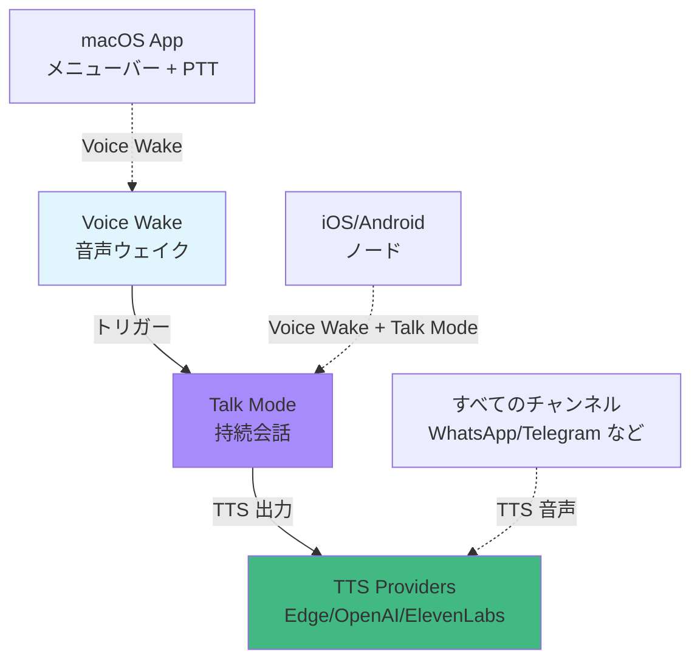

# 音声ウェイクとテキスト読み上げ

## 学習後できること

- Voice Wake 音声ウェイクを設定し、macOS/iOS/Android ノードをサポート
- Talk Mode を使用して持続的音声会話を行う（音声入力 → AI → 音声出力）
- 複数の TTS プロバイダー（Edge、OpenAI、ElevenLabs）と自動フェールオーバーを設定
- 音声ウェイクワード、TTS 音声、会話パラメータをカスタマイズ
- 音声機能の一般的な問題（権限、音声フォーマット、API エラー）をトラブルシューティング

## 現在の課題

音声対話は便利ですが、設定には混乱するかもしれません：

- どの TTS プロバイダーを使用すべきか？Edge は無料だが品質は普通、ElevenLabs は品質が高いが有料
- Voice Wake と Talk Mode の違いは？いつどちらを使うべきか？
- デフォルトの "clawd" ではなくカスタムウェイクワードを設定する方法は？
- 異なるデバイス（macOS、iOS、Android）で音声設定を同期する方法は？
- TTS 出力フォーマットにこだわりがある理由は？なぜ Telegram は Opus を使用し、他のチャンネルは MP3 を使用するのか？

## いつこの機能を使うか

- **Voice Wake**：ハンズフリー音声アシスタント体験が必要な時。例：macOS や iOS/Android で直接話して AI をウェイク、キーボード操作不要。
- **Talk Mode**：持続的音声会話が必要な時。例：運転、料理、歩行中に音声で AI と複数ラウンド会話。
- **TTS 設定**：AI の返信を音声で再生させたい時。例：高齢者や視覚障害者のための音声アシスタント、または個人用音声アシスタント体験。
- **カスタム音声**：デフォルト音声に不満がある時。例：話速、ピッチ、安定性の調整、または中国語音声モデルへの切り替え。

## 🎒 開始前の準備

::: warning 前提条件
このチュートリアルでは、[クイックスタート](../../start/getting-started/) を完了し、Gateway をインストールして起動していることを前提としています。
::

- Gateway デーモンが実行中
- 少なくとも 1 つの AI モデルプロバイダーが設定済み（Anthropic または OpenAI）
- **Voice Wake の場合**：macOS/iOS/Android デバイスがインストールされ、Gateway に接続済み
- **Talk Mode の場合**：iOS または Android ノードが接続済み（macOS メニューバーアプリは Voice Wake のみをサポート）
- **ElevenLabs TTS の場合**：ElevenLabs API Key を準備（高品質音声が必要な場合）
- **OpenAI TTS の場合**：OpenAI API Key を準備（オプション、Edge TTS は無料だが品質は普通）

::: info 権限の注意
Voice Wake と Talk Mode には以下の権限が必要です：
- **マイク権限**：音声入力に必須
- **音声認識権限**（Speech Recognition）：音声からテキストへ
- **補助機能権限**（macOS）：グローバルショートカットの監視（Cmd+Fn プッシュツートークなど）
::

## 核心概念

### 3 つの音声機能の明確な役割分担

Clawdbot の音声機能は 3 つの独立したモジュールに分かれていますが、連携して動作します：



**核心的な違い**：

| 機能 | 用途 | サポートプラットフォーム | トリガー方法 | 会話ラウンド |
|-----|-------|----------|---------|---------|
| | **Voice Wake** | 単発音声コマンド | macOS/iOS/Android | ウェイクワード（例："clawd"） | 単発 |
| | **Talk Mode** | 持続音声会話 | iOS/Android | 手動開始 | 複数ラウンド（ループ） |
| | **TTS** | テキスト読み上げ | すべてのチャンネル | AI 返信で自動トリガー | なし（パッシブ） |

### Voice Wake：グローバルウェイクワードシステム

**重要な設計**：ウェイクワードは **Gateway グローバル設定** であり、ノードのローカル設定ではありません。

- **保存場所**：`~/.clawdbot/settings/voicewake.json`（Gateway ホスト）
- **デフォルトウェイクワード**：`["clawd", "claude", "computer"]`
- **同期メカニズム**：任意のノード/macOS App がウェイクワードを変更後、Gateway がすべてのデバイスにブロードキャスト

```json
{
  "triggers": ["clawd", "claude", "computer"],
  "updatedAtMs": 1737489200000
}
```

**Push-to-Talk（話すボタンを押す）**：
- macOS は `Cmd+Fn` または `右 Option` キーを長押しして直接音声入力を開始、ウェイクワード不要
- iOS/Android は UI ボタンでサポート

### Talk Mode：音声対話ループ

Talk Mode は持続的音声対話ループです：

```
1) 音声入力を監視（音声認識）
2) テキストを AI モデルに送信（chat.send）
3) AI 返信を待機
4) TTS で返信を再生（ストリーミング再生）
5) ステップ 1 に戻る（ループ）
```

**重要な機能**：

| 機能 | 説明 | プラットフォームサポート |
|-----|-------|---------|
| **再生中断** | ユーザーが話し始めると TTS 再生を即座に停止 | iOS/Android |
| **状態遷移** | Listening → Thinking → Speaking の 3 状態ループ | iOS/Android |
| **JSON コマンド** | AI が返信に JSON を埋め込んで音声パラメータを制御 | すべて |
| **ストリーミング TTS** | ElevenLabs ストリーミング API、低遅延再生 | iOS/Android/macOS |

### TTS：複数プロバイダーの自動フェールオーバー

Clawdbot は 3 つの TTS プロバイダーをサポートし、優先順位で自動フェールオーバーします：

```typescript
// 優先順序（ソースコード：src/tts/tts.ts:482-484）
const providers = [primaryProvider, ...otherProviders];

// 例：メイン ElevenLabs、失敗時は OpenAI、最後に Edge
providers = ["elevenlabs", "openai", "edge"];
```

| プロバイダー | 品質 | 速度 | コスト | API Key | 推奨シナリオ |
|-------|-------|------|------|---------|---------|
| **ElevenLabs** | ⭐⭐⭐⭐⭐ | ⭐⭐⭐⭐ | 有料 | 高品質音声、Talk Mode（ストリーミング） |
| **OpenAI** | ⭐⭐⭐⭐ | ⭐⭐⭐ | 有料 | 標準品質、安定した信頼性 |
| **Edge TTS** | ⭐⭐⭐ | ⭐⭐ | 無料 | デフォルト無料、テスト、バックアップ |

::: info Edge TTS の説明
Edge TTS は Microsoft Edge オンラインニューラル TTS サービス（`node-edge-tts` 経由）を使用し、API Key は不要ですが、公式 SLA はありません。無料のバックアップとして適していますが、本番環境での使用は推奨されません。
::

### 出力フォーマット：チャンネルがフォーマットを決定

TTS 出力フォーマットは**ターゲットチャンネル**によって決まり、設定ではありません：

| チャンネル | 出力フォーマット | フォーマット説明 | 理由 |
|-------|---------|---------|------|
| **Telegram** | Opus (`opus_48000_64`) | 48kHz/64kbps | Telegram 音声メッセージは Opus が必要 |
| **他のチャンネル** | MP3 (`mp3_44100_128`) | 44.1kHz/128kbps | 汎用的な互換性が良い |
| **Talk Mode** | PCM (`pcm_44100` / `pcm_24000`) | 生オーディオストリーム | iOS/Android AudioTrack で再生 |

::: tip 自動フォーマット選択
Clawdbot はチャンネルに基づいてフォーマットを自動的に選択します。手動設定は不要です。ただし、`messages.tts.edge.outputFormat` で Edge TTS 出力をカスタマイズできます。
::

## さあやってみよう

### ステップ 1：基本 TTS 設定（最もシンプルな設定）

**なぜ**
Edge TTS は API Key 不要のゼロ設定スタートポイントで、簡単なテストに適しています。

`~/.clawdbot/clawdbot.json` を編集：

```yaml
messages:
  tts:
    auto: "always"  # 自動 TTS を有効化
    provider: "edge"  # Edge TTS を使用
    edge:
      enabled: true
      voice: "zh-CN-XiaoxiaoNeural"  # 中国語音声
      lang: "zh-CN"
      outputFormat: "audio-24khz-48kbitrate-mono-mp3"
```

**期待される結果**：
- AI 返信に自動的にオーディオファイルが添付される
- チャンネル（WhatsApp/Telegram など）で音声メッセージまたはオーディオリンクが受信される
- デフォルト音声は英語（`en-US-MichelleNeural`）、中国語が必要な場合は `voice` フィールドを修正

::: tip 中国語音声の例
Edge TTS は中国語音声をサポート、例：
- `zh-CN-XiaoxiaoNeural`（女性声、優しい）
- `zh-CN-YunxiNeural`（男性声）
- `zh-CN-YunyangNeural`（男性声、落ち着いた）
::

**Gateway を再起動**：

```bash
clawdbot gateway restart
```

### ステップ 2：ElevenLabs TTS 設定（高品質推奨）

**なぜ**
ElevenLabs は業界最高の音声品質と表現力を提供し、ストリーミング TTS（低遅延）をサポート、Talk Mode に適しています。

#### 2.1 API Key の取得

[ElevenLabs コンソール](https://elevenlabs.io/app) にアクセスし、アカウントを作成して API Key を生成。

#### 2.2 認証設定

**方法 A：環境変数（推奨）**

```bash
export ELEVENLABS_API_KEY="xi_..."
# またはエイリアスを使用
export XI_API_KEY="xi_..."
```

**方法 B：設定ファイル**

`~/.clawdbot/clawdbot.json` を編集：

```yaml
messages:
  tts:
    auto: "always"
    provider: "elevenlabs"  # メインは ElevenLabs
    elevenlabs:
      apiKey: "xi_..."  # オプション、環境変数を優先
      baseUrl: "https://api.elevenlabs.io"
      voiceId: "pMsXgVXv3BLzUgSXRplE"  # デフォルト音声
      modelId: "eleven_multilingual_v2"  # 多言語モデル
      voiceSettings:
        stability: 0.5  # 安定性（0-1）
        similarityBoost: 0.75  # 類似度ブースト（0-1）
        style: 0.0  # スタイル（0-1）
        useSpeakerBoost: true
        speed: 1.0  # 話速（0.5-2.0）
```

**期待される結果**：
- AI 返信の音声品質が明らかに向上
- Telegram で丸い音声メッセージバブル（Opus フォーマット）が受信される
- `/tts provider edge` でバックアッププロバイダーに切り替え可能

### ステップ 3：OpenAI TTS をバックアップとして設定

**なぜ**
バックアッププロバイダーを設定することで、メインプロバイダー（ElevenLabs など）が API エラーやクォータ制限に遭遇したときに自動切り替えを確実にします。

`~/.clawdbot/clawdbot.json` を編集：

```yaml
messages:
  tts:
    auto: "always"
    provider: "elevenlabs"  # メイン
    openai:
      apiKey: "sk-..."  # オプション、環境変数を優先
      model: "gpt-4o-mini-tts"  # OpenAI TTS モデル
      voice: "alloy"  # 音声 ID
```

**自動フェールオーバーロジック**（ソースコード：`src/tts/tts.ts:1097-1234`）：

```typescript
// 試行順序
for (const provider of ["elevenlabs", "openai", "edge"]) {
  try {
    // プロバイダーを試行
    if (provider === "elevenlabs") await elevenLabsTTS(...);
    if (provider === "openai") await openaiTTS(...);
    if (provider === "edge") await edgeTTS(...);
    return { success: true, ... };  // 成功なら返す
  } catch (err) {
    lastError = `${provider}: ${err.message}`;
    // 次のプロバイダーを継続試行
  }
}
```

### ステップ 4：Voice Wake ウェイクワード設定

**なぜ**
カスタムウェイクワードで音声アシスタントをより個性的に、または誤トリガーを回避（デフォルトの "computer" は日常会話と競合する可能性があります）。

#### 4.1 macOS App で設定

1. macOS メニューバーアプリを開く
2. **Settings** → **Voice Wake** に移動
3. **Trigger Words** テーブルを編集
4. カスタムウェイクワードを追加（例："助手"、"小助"）
5. 保存で Gateway に自動同期

**期待される結果**：
- `~/.clawdbot/settings/voicewake.json` が更新
- 接続されたすべてのノード（iOS/Android）が新しいウェイクワードを受信
- カスタムウェイクワードを言うと、音声認識がアクティブになる

#### 4.2 Gateway RPC で設定（高度）

```bash
# 現在のウェイクワードを取得
clawdbot gateway rpc voicewake.get

# 新しいウェイクワードを設定
clawdbot gateway rpc voicewake.set '{"triggers":["小助","助手"]}'
```

::: warning ウェイクワードの制限
- 各ウェイクワードは 2-4 音節が推奨（例："clawd" 2 音節）
- 過度に長いウェイクワード（例："嘿你好我的AI助手"）は認識が困難
- デフォルトでは最大 10 個のウェイクワードが許可（ソースコード変更で調整可能）
::

### ステップ 5：Talk Mode 使用（iOS/Android）

**なぜ**
Talk Mode は真の音声アシスタント体験を提供：持続的会話、再生中断、リアルタイムフィードバック。

#### 5.1 前提条件確認

- ✅ iOS または Android ノードが Gateway に接続済み
- ✅ ElevenLabs API Key が設定済み（ストリーミング TTS 推奨）
- ✅ ノードでマイクと音声認識権限が付与済み

::: info Talk Mode プラットフォームサポート
| プラットフォーム | Talk Mode | Voice Wake |
|-------|----------|------------|
| macOS | ❌ サポートなし | ✅ サポート |
| iOS | ✅ サポート | ✅ サポート |
| Android | ✅ サポート | ✅ サポート |

Talk Mode はストリーミング TTS が必要、ElevenLabs 推奨。Edge TTS と OpenAI はストリーミング再生をサポートしません。
::

#### 5.2 iOS App で Talk Mode を有効化

1. iOS Clawdbot アプリを開く
2. **Talk** ボタンをタップして有効化
3. マイク権限を付与（初回使用時）
4. オーバーレイに **Listening**（雲が脈動）が表示される

#### 5.3 音声会話を開始

**フロー体験**：

```
Listening（リスニング）
  → 音声が認識される
    → Thinking（思考中、AI が返信を生成）
      → Speaking（TTS 再生中、雲が拡散）
        → Listening に戻る（ループ）
```

**中断機能**：
- AI が再生中、直接話し始めることができます
- TTS が自動停止、新しい音声認識が即座に開始
- AI は中断タイムスタンプを確認し、次のラウンドでユーザーの中断を認識

#### 5.4 AI 音声コマンド制御

AI は返信に JSON コマンドを埋め込んで音声パラメータを制御できます（ソースコード：`docs/nodes/talk.md:22-41`）：

**返信の例**：

```text
好的、これが必要な内容です。
{"voice":"21m00Tcm4TlvDq8iq1X","speed":1.2}
説明を開始...
```

**サポートされているパラメータ**：

| パラメータ | タイプ | 説明 |
|-----|------|------|
| `voice` / `voice_id` | 文字列 | ElevenLabs Voice ID |
| `model` / `model_id` | 文字列 | TTS モデル ID |
| `speed` | 数値 | 話速（0.5-2.0） |
| `stability` | 数値 | 安定性（0-1） |
| `similarityBoost` | 数値 | 類似度ブースト（0-1） |
| `once` | ブール値 | 現在の返信にのみ有効 |

### ステップ 6：TTS モードと制限の設定

**なぜ**
TTS トリガーと長い返信の処理を制御し、不要なコストと遅延を回避します。

`~/.clawdbot/clawdbot.json` を編集：

```yaml
messages:
  tts:
    auto: "inbound"  # トリガーモード：off/always/inbound/tagged
    mode: "final"  # TTS モード：final（最終返信のみ）/all（ツール呼び出しを含む）
    maxTextLength: 4000  # TTS 入力文字数制限
    summaryModel: "openai/gpt-4o-mini"  # 長テキスト要約モデル
    modelOverrides:
      enabled: true  # AI が TTS コマンドを発行することを許可
```

**TTS 自動モード**（ソースコード：`docs/tts.md:198-203`）：

| モード | 説明 | 使用シナリオ |
|-----|-------|---------|
| `off` | 自動 TTS を無効化 | テキスト対話 |
| `always` | すべての返信を音声に変換 | 音声アシスタント |
| `inbound` | 音声メッセージへの返信時のみ音声に変換 | 対話型音声 |
| `tagged` | `[[tts]]` タグを含む返信のみ音声に変換 | 精密な制御 |

**長テキスト自動要約**（ソースコード：`src/tts/tts.ts:825-903`）：

AI 返信が `maxLength`（デフォルト 1500 文字）を超える場合：
1. `summaryModel` で要約を呼び出し（デフォルトはメイン AI モデルを使用）
2. テキストを約 `maxLength` 長さに圧縮
3. 圧縮されたテキストで TTS を実行

**要約を無効化**：

```bash
# コマンドラインで無効化
/tts summary off

# または設定で無効化
messages:
  tts:
    auto: "always"
# summaryModel を設定しないか、summaryModel: null を設定
```

### ステップ 7：設定の確認

**なぜ**
すべての音声機能が正常に動作することを確認し、権限や API の問題を回避します。

#### 7.1 TTS 確認

テストメッセージを送信：

```bash
clawdbot message send --to +1234567890 --message "中国語で言ってください：こんにちは、これは音声テストです"
```

**期待される結果**：
- チャンネルで音声メッセージ（非テキスト）を受信
- 音声品質が設定されたプロバイダーに一致
- エラーログなし

**TTS 状態の確認**：

```bash
clawdbot gateway rpc tts.status
```

#### 7.2 Voice Wake 確認（macOS）

1. マイク権限が付与されていることを確認
2. ウェイクワードを言う（例："clawd"）
3. 通知音が聞こえるのを待つ（デフォルト macOS "Glass" 音）
4. オーバーレイに部分的なテキストが表示される
5. 話すのを止めると、テキストが送信される

**期待される結果**：
- ウェイクワードトリガー後、オーバーレイが即座に表示
- 音声認識が部分的なテキストをリアルタイム表示
- 話すのを止めると自動送信

#### 7.3 Talk Mode 確認（iOS/Android）

1. ノードアプリを開く
2. **Talk** ボタンをタップ
3. 状態が **Listening** → **Thinking** → **Speaking** とループするのを確認
4. 中断を試す：AI が話しているときに直接話す
5. TTS が即座に停止するか観察

**期待される結果**：
- 3 状態ループがスムーズに遷移
- 中断機能が正常に動作
- AI 返信が TTS で再生される（非テキスト）

## チェックポイント ✅

- [ ] TTS 基本設定完了（Edge または ElevenLabs）
- [ ] 少なくとも 1 つのチャンネルで AI 音声返信を受信
- [ ] Voice Wake ウェイクワードがカスタマイズ済み（必要な場合）
- [ ] iOS/Android Talk Mode を起動して持続的会話が可能
- [ ] TTS 中断機能が正常に動作（Talk Mode）
- [ ] `/tts` コマンドでプロバイダーを切り替え可能
- [ ] Gateway ログに TTS 関連エラーなし

## トラブルシューティング

### Edge TTS が利用できない

**問題**：TTS 失敗、ログに "edge: disabled" または "edge output format failed" が表示される

**原因**：
- `messages.tts.edge.enabled: false`
- 設定された `outputFormat` が Edge サービスでサポートされていない（ソースコード：`docs/tts.md:26-30`）

**修正**：

```yaml
# ✅ Edge TTS を有効化
messages:
  tts:
    edge:
      enabled: true
      outputFormat: "audio-24khz-48kbitrate-mono-mp3"  # 安全なフォーマット
```

::: warning Edge フォーマット制限
Edge TTS はすべての Microsoft Speech フォーマットをサポートしていません。`audio-24khz-48kbitrate-mono-mp3` または `webm-24khz-16bit-mono-opus` の使用を推奨。
::

### ElevenLabs API Key が無効

**問題**：TTS 失敗、ログに "ElevenLabs API error (401)" が表示される

**原因**：
- API Key の形式が間違っている（`xi_...` であるべき、`sk-...` ではない）
- API Key が期限切れまたは取り消された

**修正**：

```bash
# 1. API Key 形式を検証
echo $ELEVENLABS_API_KEY | grep "^xi_"

# 2. API Key を再生成
# https://elevenlabs.io/app/settings/api-keys にアクセス

# 3. 新しい Key をテスト
curl -H "xi-api-key: $ELEVENLABS_API_KEY" \
  https://api.elevenlabs.io/v1/user
```

### Voice Wake が応答しない

**問題**：ウェイクワードを言っても反応がない

**原因**：
- マイク権限が付与されていない
- 音声認識サービスが起動していない（macOS 再起動後に失効）
- ウェイクワードが複雑すぎるか、発音が不明確

**診断手順**：

```bash
# 1. Gateway ログを確認
clawdbot gateway logs

# 2. 現在のウェイクワードを確認
cat ~/.clawdbot/settings/voicewake.json

# 3. macOS：権限を確認
# システム設定 → プライバシーとセキュリティ → マイク
# Clawdbot にチェックが入っていることを確認

# 4. macOS：音声認識を確認
# システム設定 → キーボード → ディクテーション
# 有効になっていることを確認
```

**修正**：

```bash
# Gateway デーモンを再起動
clawdbot gateway restart

# デフォルトウェイクワードに復元
clawdbot gateway rpc voicewake.set '{"triggers":[]}'

# macOS：音声認識サービスを再起動
sudo killall -9 speechrecognitiond
```

### Talk Mode を起動できない

**問題**：iOS/Android で Talk ボタンをタップしても反応がないか、エラーが表示される

**原因**：
- 接続されたモバイルノードがない（iOS/Android のみ Talk Mode をサポート）
- ElevenLabs API Key が設定されていない（Talk Mode はストリーミング TTS 推奨）

**確認**：

```bash
# 接続されたノードを表示
clawdbot nodes list

# ElevenLabs API Key をテスト
clawdbot gateway rpc tts.providers
# elevenlabs が利用可能なリストにあるはず
```

**修正**：

1. iOS/Android ノードが接続されていることを確認（Gateway ホストまたは macOS App 経由）
2. ElevenLabs API Key を設定（上記ステップ 2）
3. Talk Mode の起動を再試行

### TTS 出力品質が低い

**問題**：音声品質が不明瞭、途切れ途切れ、ノイズがある

**原因**：
- Edge TTS を使用している（無料だが品質は普通）
- 出力フォーマットが一致しない（例：低ビットレート）
- ネットワーク遅延によるストリーミング再生の途切れ

**最適化の提案**：

```yaml
# ✅ 高品質プロバイダーを使用
messages:
  tts:
    provider: "elevenlabs"
    elevenlabs:
      voiceId: "21m00Tcm4TlvDq8iq1X"  # 別の音声を試す
      voiceSettings:
        stability: 0.7  # 安定性を向上（途切れを減少）
        useSpeakerBoost: true  # 明瞭度を強化
```

::: tip 音声の選択
ElevenLabs は異なる言語とスタイルの音声を提供：
- **中国語**：`21m00Tcm4TlvDq8iq1X`（女性声）、`ErXwobaKq9rZ5Q4FmQ`（男性声）
- **英語**：`pMsXgVXv3BLzUgSXRplE`（中性）、`XB0fD4X1Wf7Jq3hF9I`（温かみ）
[ElevenLabs Voice Lab](https://elevenlabs.io/app/speech-synthesis/voices) で試聴。
::

### 要約機能による情報の損失

**問題**：長い返信が過度に要約され、重要な情報が失われる

**原因**：
- `maxLength` が小さすぎる（デフォルト 1500 文字）
- 要約モデルの理解が偏っている

**調整**：

```yaml
messages:
  tts:
    maxTextLength: 4000  # 制限を引き上げ
    summaryModel: "anthropic/claude-opus-4-5"  # より強力なモデルで要約
```

または要約を無効化（ただし TTS 失敗の可能性があります）：

```bash
# コマンドラインで無効化
/tts summary off
```

::: info 要約トリガー条件
テキストが `maxLength` を超え、`summarize` が有効な場合のみ要約されます。要約に失敗した場合、TTS はスキップされ、元のテキストが返されます。
::

## 高度な設定

### AI 駆動の TTS コマンド

**なぜ**
コンテンツに応じて AI が音声パラメータを動的に調整できるようにする（例：深刻なコンテンツは低話速、ユーモラスなコンテンツは高話速）。

**AI コマンドを有効化**（ソースコード：`docs/tts.md:232-274`）：

```yaml
messages:
  tts:
    modelOverrides:
      enabled: true  # デフォルトで有効
      allowText: true  # AI が表現タグを提供することを許可
      allowVoice: true  # AI が音声を切り替えることを許可
      allowSpeed: true  # AI が話速を調整することを許可
```

**AI コマンドの例**：

```text
好的、この問題を真面目に答えます。
[[tts:speed=0.8 stability=0.8]]
これは非常に重要な決定です...
[[tts:text]]（笑い声）もちろん、冗談ですよ。[[/tts:text]]
```

**コマンド解析**（ソースコード：`src/tts/tts.ts:553-752`）：

- `[[tts:speed=0.8]]`：現在の返信の話速を 0.8 に設定（デフォルト 1.0）
- `[[tts:text]]...[[/tts:text]]`：表現テキスト（笑い声、効果音の説明など）、TTS にのみ表示され、テキスト返信には影響しない

### 特定コマンドの無効化（セキュリティ）

**理由**：AI の制御範囲を制限し、音声の予期せぬ切り替えやパラメータ調整を防ぐ。

```yaml
messages:
  tts:
    modelOverrides:
      enabled: true
      allowProvider: false  # AI がプロバイダーを切り替えることを禁止
      allowVoice: false  # AI が音声 ID を切り替えることを禁止
      allowSeed: false  # AI がランダムシードを設定することを禁止
```

### Push-to-Talk ショートカット（macOS）

**なぜ**
Push-to-Talk は音声ウェイクよりも正確で、誤トリガーを回避できます。

設定（ソースコード：`docs/platforms/mac/voicewake.md:10-38`）：

1. macOS App Settings を開く
2. **Hold Cmd+Fn to talk** を有効化（macOS ≥ 26 が必要）
3. または **右 Option** キーを使用（デフォルトで有効）

**使用方法**：
1. `Cmd+Fn` または `右 Option` を長押し
2. オーバーレイにリアルタイム音声認識テキストが表示される
3. キーを放すと、テキストが AI に自動送信

::: info 権限の要件
Push-to-Talk には **補助機能**（Accessibility）権限が必要で、グローバルショートカットを監視します。
::

### 環境変数の優先順位

**なぜ**
環境変数で API Key を管理し、機密情報を Git にコミットするのを回避します。

**優先順位**（ソースコード：`src/tts/tts.ts:467-477`）：

```typescript
// 1. 設定ファイル内の API Key
config.elevenlabs.apiKey

// 2. 環境変数
process.env.ELEVENLABS_API_KEY || process.env.XI_API_KEY
process.env.OPENAI_API_KEY

// 3. OpenAI TTS カスタムエンドポイント（Kokoro など互換サービス向け）
process.env.OPENAI_TTS_BASE_URL
```

**設定例**：

```bash
# ~/.zshrc または ~/.bashrc
export ELEVENLABS_API_KEY="xi_..."
export OPENAI_API_KEY="sk-..."
export CLAWDBOT_TTS_PREFS="~/.clawdbot/settings/tts.json"
```

## よくある質問

### Voice Wake と Talk Mode の違いは？

**Voice Wake**：
- 単発トリガー
- ウェイクワードを言う → 認識 → 送信 → 終了
- macOS/iOS/Android をサポート
- クイックコマンドに適している（例："clawd、今日の天気"）

**Talk Mode**：
- 持続ループ
- 認識 → AI → 再生 → 認識 → AI → 再生...
- iOS/Android のみをサポート
- 複数ラウンド会話に適している（例："こんにちは → AI 返信 → 質問 → AI 返信..."）

### TTS プロバイダーを選ぶにはどうすればよい？

| シナリオ | 推奨プロバイダー |
|-------|-----------|
| **無料テスト** | Edge TTS（API Key 不要） |
| **高品質音声** | ElevenLabs（最高の表現力） |
| **安定した信頼性** | OpenAI（標準品質、API が安定） |
| **Talk Mode** | ElevenLabs（ストリーミング TTS） |
| **本番環境** | ElevenLabs または OpenAI（SLA サポートあり） |

::: tip 推奨設定
多くのユーザーの設定：
- メイン：ElevenLabs（高品質）
- バックアップ：OpenAI（安定）
- 緊急時：Edge TTS（無料）
::

### Telegram 音声が丸いバブルで、他のチャンネルはリンクなのはなぜ？

**Telegram の要件**：
- 音声メッセージは **Opus フォーマット**（`opus_48000_64`）である必要がある
- Opus フォーマットのみが丸い音声バブル UX をトリガーする

**他のチャンネル**：
- 標準 **MP3 フォーマット**（`mp3_44100_128`）を使用
- ダウンロード可能なオーディオファイルリンクとして表示

**自動処理**：
Clawdbot はチャンネルに基づいてフォーマットを自動的に選択します。手動設定は不要です（ソースコード：`src/tts/tts.ts:454-457`）。

### TTS 要約にはどれくらい時間がかかりますか？

| プロバイダー | 典型的な遅延 |
|-------|----------|
| Edge TTS | 1-3 秒（ネットワーク次第） |
| OpenAI | 2-4 秒（標準 API） |
| ElevenLabs（ストリーミング） | < 1 秒（Talk Mode リアルタイム再生） |

**遅延に影響する要因**：
- ネットワーク速度（特に Edge TTS）
- テキスト長
- プロバイダーサーバーの負荷
- ストリーミング再生バッファリング（Talk Mode）

### TTS デバッグ情報を確認するには？

```bash
# Gateway ログを確認（TTS 変換時間を含む）
clawdbot gateway logs | grep TTS

# 前回の TTS 試行の状態を確認
clawdbot gateway rpc tts.status

# TTS 設定を確認
cat ~/.clawdbot/clawdbot.json | grep -A 20 "messages.tts"
```

**ログの例**：

```
TTS: converting text (120 chars) with provider elevenlabs
TTS: conversion successful in 847ms
TTS: skipped long text (2500 > 1500), summarization disabled
```

### Edge TTS は無料ですか？

**公式ステータス**：Edge TTS は Microsoft のオンラインサービスで、価格とクォータ制限は公開されていません。

**Clawdbot ドキュメント**（ソースコード：`docs/tts.md:27-30`）：
- 公式 SLA なし
- クォータ保証なし
- **best-effort** バックアップとして推奨

**実装の提案**：
- テストと本番環境では OpenAI または ElevenLabs を使用
- Edge TTS は開発デバッグまたは緊急バックアップのみに使用

## まとめ

- Clawdbot 音声機能は 3 つのモジュールに分かれている：Voice Wake（ウェイク）、Talk Mode（持続会話）、TTS（テキスト読み上げ）
- TTS は 3 つのプロバイダーをサポート：Edge（無料）、OpenAI（安定）、ElevenLabs（高品質）、自動フェールオーバー
- Voice Wake はグローバルウェイクワード設定を使用し、Gateway に保存され、すべてのノードに同期
- Talk Mode は iOS/Android のみをサポートし、Listening → Thinking → Speaking の 3 状態ループと中断機能を提供
- TTS 出力フォーマットはチャンネルによって決まる（Telegram Opus、他は MP3、Talk Mode は PCM）
- AI は返信に TTS コマンドを埋め込んで音声パラメータを動的に調整できる
- 長テキスト自動要約機能は制御または無効化が可能
- 推奨設定：メイン ElevenLabs、バックアップ OpenAI、緊急時 Edge TTS

## 次のレッスン

> 次のレッスンでは **[記憶システムとベクトル検索](../memory-system/)** を学習します。
>
> 学習内容：
> - ベクトル化ストレージとセマンティック検索の原理
> - SQLite-vec と FTS5 混合検索
> - 記憶システムの設定と管理
> - セッションをまたいだ知識の永続化

---

## 付録：ソースコード参照

<details>
<summary><strong>クリックしてソースコードの場所を表示</strong></summary>

> 更新日：2026-01-27

| 機能 | ファイルパス | 行番号 |
| ----- | --------- | ---- |
| TTS コアロジック | [`src/tts/tts.ts`](https://github.com/clawdbot/clawdbot/blob/main/src/tts/tts.ts) | 1-1472 |
| TTS 設定解析 | [`src/tts/tts.ts`](https://github.com/clawdbot/clawdbot/blob/main/src/tts/tts.ts) | 248-303 |
| ElevenLabs TTS | [`src/tts/tts.ts`](https://github.com/clawdbot/clawdbot/blob/main/src/tts/tts.ts) | 916-991 |
| OpenAI TTS | [`src/tts/tts.ts`](https://github.com/clawdbot/clawdbot/blob/main/src/tts/tts.ts) | 993-1037 |
| Edge TTS | [`src/tts/tts.ts`](https://github.com/clawdbot/clawdbot/blob/main/src/tts/tts.ts) | 1050-1069 |
| TTS 自動要約 | [`src/tts/tts.ts`](https://github.com/clawdbot/clawdbot/blob/main/src/tts/tts.ts) | 825-903 |
| TTS コマンド解析 | [`src/tts/tts.ts`](https://github.com/clawdbot/clawdbot/blob/main/src/tts/tts.ts) | 553-752 |
| Voice Wake 設定管理 | [`src/infra/voicewake.ts`](https://github.com/clawdbot/clawdbot/blob/main/src/infra/voicewake.ts) | 1-91 |
| Voice Wake Gateway メソッド | [`src/gateway/server-methods/voicewake.ts`](https://github.com/clawdbot/clawdbot/blob/main/src/gateway/server-methods/voicewake.ts) | 1-35 |
| Talk Mode Gateway メソッド | [`src/gateway/server-methods/talk.ts`](https://github.com/clawdbot/clawdbot/blob/main/src/gateway/server-methods/talk.ts) | 1-39 |

**重要な定数**：
- `DEFAULT_ELEVENLABS_VOICE_ID = "pMsXgVXv3BLzUgSXRplE"`（デフォルト音声 ID）
- `DEFAULT_OPENAI_MODEL = "gpt-4o-mini-tts"`（デフォルト OpenAI TTS モデル）
- `DEFAULT_EDGE_VOICE = "en-US-MichelleNeural"`（デフォルト Edge 音声）
- `DEFAULT_TTS_MAX_LENGTH = 1500`（デフォルト TTS 要約しきい値）
- `DEFAULT_TIMEOUT_MS = 30_000`（デフォルト TTS タイムアウト 30 秒）

**重要な関数**：
- `resolveTtsConfig()`：TTS 設定を解析・マージ（`src/tts/tts.ts:248-303`）
- `textToSpeech()`：メイン TTS 関数、複数プロバイダーフェールオーバーをサポート（`src/tts/tts.ts:1071-1240`）
- `maybeApplyTtsToPayload()`：返信に TTS を自動追加（`src/tts/tts.ts:1336-1458`）
- `parseTtsDirectives()`：AI の TTS コマンドを解析（`src/tts/tts.ts:553-752`）
- `summarizeText()`：長テキスト要約（`src/tts/tts.ts:825-903`）
- `loadVoiceWakeConfig()`：ウェイクワード設定をロード（`src/infra/voicewake.ts:61-74`）
- `setVoiceWakeTriggers()`：ウェイクワードを設定してブロードキャスト（`src/infra/voicewake.ts:76-90`）

**設定ファイルの場所**：
- `~/.clawdbot/clawdbot.json`：メイン設定（TTS 設定）
- `~/.clawdbot/settings/voicewake.json`：ウェイクワード設定（Gateway 所有）
- `~/.clawdbot/settings/tts.json`：TTS ユーザー設定（設定を上書き可）

</details>

