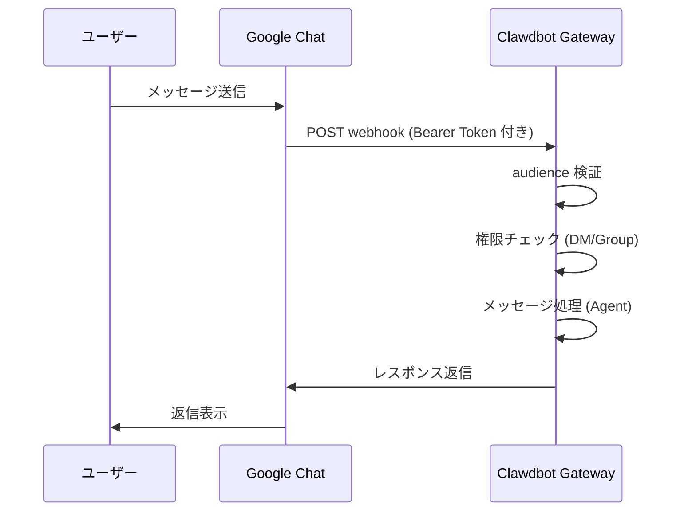

# Google Chat チャンネル設定

## 学べること

- Google Chat で AI アシスタントと 1:1 のプライベートチャットを行う
- Google Chat スペースで @メンションを使って AI アシスタントをトリガーする
- Service Account 認証と Webhook 設定の方法を習得する
- Tailscale Funnel を使って安全に公開 URL を公開する方法を学ぶ

## 現在の課題

会社やチームで Google Chat を通じて AI アシスタントを使用したいが、方法がわからない：

- Google Cloud プロジェクトの作成と設定方法
- Service Account 認証の設定方法
- Google Chat を Gateway に接続するための Webhook 設定方法
- Gateway を安全にインターネットに公開する方法

## いつ使うか

**Google Chat チャンネルが適しているシナリオ**：

- チームが主に Google Chat でコミュニケーションしている
- Google Workspace 環境で AI アシスタントを使用する必要がある
- Google Chat Spaces を通じて協業したい
- 公開 Webhook 経由で Google Chat メッセージを受信する必要がある

**適していないシナリオ**：

- 個人使用（WebChat、Telegram、WhatsApp を推奨）
- OAuth ユーザー認証が必要（Google Chat は Service Account のみサポート）

## コア概念

Google Chat チャンネルのワークフロー：



**主要な概念**：

| 概念 | 説明 |
|--- | ---|
| **Service Account** | Google Cloud 認証方式、ボットのアイデンティティ検証に使用 |
| **Webhook** | Google Chat から Gateway にメッセージを POST する HTTP エンドポイント |
| **Audience** | webhook リクエストを検証するためのターゲット（app-url または project-number） |
| **DM ペアリング** | デフォルトのセキュリティメカニズム、未知の送信者は承認が必要 |

::: tip
Google Chat チャンネルは Service Account 認証のみサポートしており、OAuth ユーザー認証はサポートしていません。ユーザーレベルの権限が必要な場合は、他のチャンネルを検討してください。
:::

## 🎒 事前準備

以下の準備が完了していることを確認してください：

- ✅ [クイックスタート](../../start/getting-started/) を完了し、Clawdbot をインストール済み
- ✅ Gateway が実行中（`clawdbot gateway --port 18789`）
- ✅ Google Cloud アカウントへのアクセス権がある
- ✅ 基本的なターミナルコマンドの使用方法を理解している

::: warning
Google Chat Webhook には公開 HTTPS エンドポイントが必要です。本チュートリアルでは、Tailscale Funnel またはリバースプロキシを使って安全にサービスを公開する方法を紹介します。
:::

## 実践チュートリアル

### ステップ 1：Google Cloud プロジェクトを作成し、Chat API を有効化

**なぜ**
まず、Chat アプリケーションと Service Account をホストするために Google Cloud プロジェクトが必要です。

1. [Google Chat API Credentials](https://console.cloud.google.com/apis/api/chat.googleapis.com/credentials) にアクセス
2. API が有効化されていない場合は、**Enable API** をクリック

**表示される内容**：
- Chat API が有効化され、"API enabled" と表示される
- Credentials 管理ページが表示される

### ステップ 2：Service Account を作成

**なぜ**
Service Account はボットのアイデンティティであり、webhook リクエストの認証に使用されます。

1. Credentials ページで、**Create Credentials** > **Service Account** をクリック
2. 名前を入力（例：`clawdbot-chat`）
3. **Continue** をクリック（権限設定はスキップ）
4. アクセス制御は空のままにして、**Done** をクリック

**表示される内容**：
- 新しく作成された Service Account がリストに表示される

### ステップ 3：JSON Key を作成してダウンロード

**なぜ**
JSON Key は認証情報を含み、Clawdbot が Google Chat リクエストを検証するために必要です。

1. 作成した Service Account をクリック
2. **Keys** タブに移動
3. **Add Key** > **Create new key** をクリック
4. **JSON** フォーマットを選択し、**Create** をクリック
5. ダウンロードされた JSON ファイルは自動的に保存される

**表示される内容**：
- ブラウザが `.json` ファイルをダウンロード

::: warning
⚠️ 重要：この JSON Key は一度しかダウンロードされませんので、大切に保管してください！紛失した場合は再作成が必要です。
:::

### ステップ 4：Service Account ファイルを保存

**なぜ**
Clawdbot が Key ファイルを読み込んで Google Chat リクエストを検証する必要があります。

1. ダウンロードした JSON ファイルを安全な場所に移動：
   ```bash
   mv ~/Downloads/*.json ~/.clawdbot/googlechat-service-account.json
   ```
2. ファイル権限を設定（推奨だがオプション）：
   ```bash
   chmod 600 ~/.clawdbot/googlechat-service-account.json
   ```

**表示される内容**：
- ファイルが `~/.clawdbot/` ディレクトリに保存される
- 権限が所有者のみ読み書き可能に設定される

### ステップ 5：Google Chat アプリを作成

**なぜ**
Chat App はボットの外観、動作、webhook URL を定義します。

1. [Google Cloud Console Chat Configuration](https://console.cloud.google.com/apis/api/chat.googleapis.com/hangouts-chat) にアクセス
2. **Application info** を入力：
   - **App name**: `Clawdbot`（または任意の名前）
   - **Avatar URL**: `https://clawd.bot/logo.png`（オプション）
   - **Description**: `Personal AI Assistant`（オプション）
3. **Interactive features** を有効化
4. **Functionality** で、**Join spaces and group conversations** をチェック
5. **Connection settings** で、**HTTP endpoint URL** を選択
6. **Visibility** で、**Make this Chat app available to specific people and groups in &lt;Your Domain&gt;** を選択
7. Google Workspace メールを入力（例：`user@example.com`）
8. ページ下部の **Save** をクリック

**表示される内容**：
- アプリ設定が保存される
- ページに "App status" セクションが表示される

### ステップ 6：Webhook Triggers を設定

**なぜ**
Triggers は Google Chat が Gateway にメッセージを送信するタイミングを定義します。

1. 保存後にページをリフレッシュ
2. **App status** セクションを見つける（通常は上部または下部）
3. ステータスを **Live - available to users** に変更
4. もう一度 **Save** をクリック

**表示される内容**：
- App status が "Live - available to users" と表示される

::: info
💡 ヒント：Webhook URL はステップ 7 で設定します。まだ確定していない場合は、プレースホルダー `https://example.com/googlechat` を使用し、後で更新できます。
:::

### ステップ 7：Gateway の公開 URL を取得

**なぜ**
Google Chat は webhook リクエストを送信するために公開 HTTPS URL が必要です。

以下のコマンドを実行して Gateway の公開 URL を確認します：

```bash
clawdbot status
```

**表示される内容**：
- 出力に公開 URL が含まれる（例：`https://your-node.tailnet.ts.net`）

::: warning
Gateway が Tailscale またはリバースプロキシで設定されていない場合は、まず公開アクセスを設定する必要があります（次のステップを参照）。
:::

### ステップ 8：Webhook エンドポイントを公開（いずれかを選択）

::: tip
Tailscale Funnel の使用を推奨します。これにより、`/googlechat` パスのみを公開し、他のエンドポイントをプライベートに保つことができます。
:::

#### オプション A：Tailscale Funnel（推奨）

**Tailscale Funnel を選ぶ理由**
- 特定のパスのみを公開し、セキュリティを向上
- 内部ネットワークの Gateway をプライベートに保ち、Webhook のみアクセス可能
- ドメイン購入と SSL 設定が不要

1. **Gateway バインドアドレスを確認**：
   ```bash
   ss -tlnp | grep 18789
   ```
   IP アドレスを記録（例：`127.0.0.1`、`0.0.0.0` または Tailscale IP として `100.x.x.x`）

2. **コントロールパネルのみ tailnet に公開**（ポート 8443）：
   ```bash
   # localhost (127.0.0.1 または 0.0.0.0) にバインドされている場合：
   tailscale serve --bg --https 8443 http://127.0.0.1:18789
   
   # Tailscale IP (例：100.106.161.80) にバインドされている場合：
   tailscale serve --bg --https 8443 http://100.106.161.80:18789
   ```

3. **Webhook パスを公開**：
   ```bash
   # localhost (127.0.0.1 または 0.0.0.0) にバインドされている場合：
   tailscale funnel --bg --set-path /googlechat http://127.0.0.1:18789/googlechat
   
   # Tailscale IP (例：100.106.161.80) にバインドされている場合：
   tailscale funnel --bg --set-path /googlechat http://100.106.161.80:18789/googlechat
   ```

4. **ノードの Funnel アクセスを承認**（プロンプトが表示された場合）：
   - 出力に表示される承認 URL にアクセス
   - Tailscale 管理パネルでそのノードの Funnel を有効化

5. **設定を確認**：
   ```bash
   tailscale serve status
   tailscale funnel status
   ```

**表示される内容**：
- Serve と Funnel が実行中
- 公開 Webhook URL：`https://<node-name>.<tailnet>.ts.net/googlechat`
- プライベートコントロールパネル：`https://<node-name>.<tailnet>.ts.net:8443/`

#### オプション B：Caddy リバースプロキシ

**Caddy を選ぶ理由**
- 自動 HTTPS をサポート
- 柔軟なパスルーティング設定

1. Caddyfile を作成：
   ```txt
   your-domain.com {
       reverse_proxy /googlechat* localhost:18789
   }
   ```

2. Caddy を起動：
   ```bash
   caddy run --config Caddyfile
   ```

**表示される内容**：
- Caddy が起動し、ポート 443 をリッスン
- `your-domain.com/googlechat` パスのみ Gateway にルーティングされる

#### オプション C：Cloudflare Tunnel

**Cloudflare Tunnel を選ぶ理由**
- 無料のグローバル CDN
- シンプルなパスルール設定

1. トンネル入り口ルールを設定：
   - **Path**: `/googlechat` -> `http://localhost:18789/googlechat`
   - **Default Rule**: HTTP 404 (Not Found)

### ステップ 9：Google Chat Webhook URL を更新

**なぜ**
公開 URL ができたので、正しいエンドポイントを指すように Chat App 設定を更新します。

1. Google Cloud Console Chat Configuration ページに戻る
2. **Triggers** セクションで：
   - **Use a common HTTP endpoint URL for all triggers** を選択
   - `<公開 URL>/googlechat` に設定
   - 例：`https://your-node.tailnet.ts.net/googlechat`
3. **Save** をクリック

**表示される内容**：
- Triggers が更新され保存される

### ステップ 10：Clawdbot を設定

**なぜ**
Clawdbot にどの Service Account と Webhook パスを使用するかを伝えます。

**方法 A：環境変数**

```bash
export GOOGLE_CHAT_SERVICE_ACCOUNT_FILE="/path/to/service-account.json"
clawdbot gateway restart
```

**方法 B：設定ファイル**

`~/.clawdbot/clawdbot.json` を編集：

```json5
{
  channels: {
    googlechat: {
      enabled: true,
      serviceAccountFile: "/Users/yourname/.clawdbot/googlechat-service-account.json",
      audienceType: "app-url",
      audience: "https://your-node.tailnet.ts.net/googlechat",
      webhookPath: "/googlechat",
      dm: {
        policy: "pairing",
        allowFrom: ["users/1234567890", "your-email@example.com"]
      },
      groupPolicy: "allowlist",
      groups: {
        "spaces/AAAA": {
          allow: true,
          requireMention: true,
          users: ["users/1234567890"],
          systemPrompt: "Short answers only."
        }
      }
    }
  }
}
```

**Gateway を再起動**：

```bash
clawdbot gateway restart
```

**表示される内容**：
- Gateway が起動し、"Google Chat default: enabled, configured, ..." と表示
- エラーログなし

### ステップ 11：ボットを Google Chat に追加

**なぜ**
最後のステップで、Google Chat でボットを見つけて追加します。

1. [Google Chat](https://chat.google.com/) にアクセス
2. **+**（プラス）アイコンをクリック、**Direct Messages** の隣
3. 検索ボックス（通常連絡先を追加する場所）に **App name**（ステップ 5 で設定した名前）を入力
   - **注意**：ボットは "Marketplace" ブラウズリストには表示されません。プライベートアプリだからです。名前で検索する必要があります。
4. 結果からボットを選択
5. **Add** または **Chat** をクリックして 1:1 チャットを開始

**表示される内容**：
- ボットが連絡先リストに表示される
- チャットウィンドウが開く

### ステップ 12：テストメッセージを送信

**なぜ**
設定が正しく、メッセージが正常に伝達されるかを確認します。

チャットウィンドウに入力：

```
Hello
```

**表示される内容**：
- ボットが挨拶または確認メッセージで返信
- Gateway ログに受信・処理されたメッセージが表示される

## チェックポイント ✅

設定が成功したかを確認します：

```bash
# チャンネルステータスを確認
clawdbot channels status

# 以下が表示されるはずです：
# Google Chat default: enabled, configured, webhook listening
```

::: info
エラーが表示される場合、`clawdbot channels status --probe` を実行して詳細な診断情報を確認してください。
:::

## 設定詳細

### Service Account 認証

| 設定項目 | 型 | デフォルト値 | 説明 |
|--- | --- | --- | ---|
| `serviceAccountFile` | string | - | Service Account JSON ファイルパス |
| `serviceAccount` | string\|object | - | インライン JSON 認証情報（ファイルパスの代わりに使用） |
| `audienceType` | "app-url"\|"project-number" | "app-url" | 検証タイプ：URL またはプロジェクト番号 |
| `audience` | string | - | Audience 値（URL またはプロジェクト番号） |

### DM ポリシー

デフォルトでは、未知の送信者はペアリングが必要です：

| 設定項目 | 型 | デフォルト値 | 説明 |
|--- | --- | --- | ---|
| `dm.enabled` | boolean | 未定義 | DM 受信を有効にするか |
| `dm.policy` | "pairing"|"open" | "pairing" | アクセスポリシー：ペアリングまたはオープン |
| `dm.allowFrom` | array | [] | 許可された送信者リスト（ユーザー ID またはメール） |

**新しい送信者をペアリング**：

```bash
clawdbot pairing approve googlechat <ペアリングコード>
```

### グループポリシー

| 設定項目 | 型 | デフォルト値 | 説明 |
|--- | --- | --- | ---|
| `groupPolicy` | "allowlist"|"disabled" | "allowlist" | グループポリシー：許可リストまたは無効 |
| `requireMention` | boolean | true | @メンションが必要か |
| `groups` | object | {} | スペース ID 別の設定 |

**特定のグループを許可**：

```json5
{
  channels: {
    googlechat: {
      groups: {
        "spaces/AAAA": {
          allow: true,
          requireMention: true,
          users: ["users/1234567890"],
          systemPrompt: "Short answers only."
        }
      }
    }
  }
}
```

### その他の設定

| 設定項目 | 型 | デフォルト値 | 説明 |
|--- | --- | --- | ---|
| `webhookPath` | string | "/googlechat" | Webhook パス |
| `botUser` | string | - | ボットユーザーリソース名（メンション検出用） |
| `typingIndicator` | "none"|"message"|"reaction" | "message" | 入力インジケーターモード |
| `actions.reactions` | boolean | false | 絵文字リアクションをサポートするか |
| `mediaMaxMb` | number | 未定義 | 最大メディアファイルサイズ（MB） |

## よくある問題

### 405 Method Not Allowed

**症状**：Google Cloud Logs Explorer に `405 Method Not Allowed` が表示される

**原因**：Webhook ハンドラーが登録されていない

**解決方法**：

1. 設定に `channels.googlechat` セクションが存在することを確認：
   ```bash
   clawdbot config get channels.googlechat
   ```

2. プラグインステータスを確認：
   ```bash
   clawdbot plugins list | grep googlechat
   ```

3. "disabled" と表示される場合、設定を追加：
   ```json5
   {
     plugins: {
       entries: {
         googlechat: {
           enabled: true
         }
       }
     }
   }
   ```

4. Gateway を再起動：
   ```bash
   clawdbot gateway restart
   ```

### メッセージが受信されない

**症状**：メッセージ送信後に応答がない

**トラブルシューティング手順**：

1. `clawdbot logs --follow` を実行し、テストメッセージを送信
2. Chat App の Webhook URL とイベントサブスクリプションを確認
3. `audience` 設定が正しいか確認
4. メンション gating が返信をブロックしている場合、`botUser` を設定し、`requireMention` を確認

### Tailscale Funnel が起動しない

**症状**：`tailscale funnel` でエラーが発生

**原因**：パスワード認証が設定されていない

**解決方法**：

`~/.clawdbot/clawdbot.json` に追加：

```json5
{
  gateway: {
    auth: {
      mode: "password"
    }
  }
}
```

## まとめ

- Google Cloud プロジェクトと Service Account を作成しました
- Google Chat App と Webhook を設定しました
- Tailscale Funnel またはリバースプロキシでエンドポイントを公開しました
- Clawdbot を Service Account 認証で設定しました
- DM ペアリングとグループ @メンションメカニズムを学びました
- 1:1 とグループメッセージをテストしました

## 次回の予告

> 次回は **[Signal チャンネル](../signal/)** を学習します。
>
> 学ぶこと：
> - signal-cli のインストールと設定方法
> - Signal チャンネルの権限とアクセス制御
> - Google Chat との設定の違い

---

## 付録：ソースコードリファレンス

<details>
<summary><strong>クリックしてソースコードの場所を展開</strong></summary>

> 更新日：2026-01-27

| 機能 | ファイルパス | 行番号 |
|--- | --- | ---|
| Google Chat 設定型定義 | [`src/config/types.googlechat.ts`](https://github.com/clawdbot/clawdbot/blob/main/src/config/types.googlechat.ts) | 1-109 |
| Google Chat Zod Schema | [`src/config/zod-schema.providers-core.ts`](https://github.com/clawdbot/clawdbot/blob/main/src/config/zod-schema.providers-core.ts) | 273-341 |
| チャンネルレジストリ | [`src/channels/registry.ts`](https://github.com/clawdbot/clawdbot/blob/main/src/channels/registry.ts) | 61-67 |
| グループメンション解析 | [`src/channels/plugins/group-mentions.ts`](https://github.com/clawdbot/clawdbot/blob/main/src/channels/plugins/group-mentions.ts) | 158-175 |
| Google Chat ドキュメント | [`docs/channels/googlechat.md`](https://github.com/clawdbot/clawdbot/blob/main/docs/channels/googlechat.md) | 1-221 |

**主要な型**：
- `GoogleChatConfig`: 完全な Google Chat 設定インターフェース
- `GoogleChatDmConfig`: DM アクセスポリシー設定
- `GoogleChatGroupConfig`: グループスペース設定
- `GoogleChatActionConfig`: アクション（絵文字リアクションなど）設定

**主要な設定フィールド**：
- `audienceType`: "app-url" または "project-number"、webhook リクエストを検証するために使用
- `audience`: Webhook URL またはプロジェクト番号、`audienceType` とペアで使用
- `dm.policy`: デフォルト "pairing"、未知の DM アクセスを制御
- `groupPolicy`: グループアクセスポリシー、"allowlist" または "disabled"

**認証メカニズム**：
- Google Service Account JSON 認証情報を使用
- Webhook リクエストは `Authorization: Bearer <token>` ヘッダーで検証
- Token は `audience` 設定項目と比較され、リクエストが正当な送信元からのものであることを確認

</details>
