# iMessage チャネル設定

## 学習内容

- macOS で iMessage を通じて AI アシスタントと 1:1 のプライベートチャットを行う
- iMessage グループで AI アシスタントを使用する（@メンション対応）
- ボットのアイデンティティを分離する専用 Mac ユーザーを設定する
- SSH/Tailscale を通じてリモート Mac 上の iMessage にアクセスする
- DM ペアリングとグループ allowlist アクセス制御をマスターする

## 現在の課題

macOS で iMessage を通じて AI アシスタントと対話したいが、以下の方法がわからない：

- `imsg` CLI ツールのインストールと設定
- Clawdbot に Full Disk Access および Automation 権限を付与する
- ローカルまたはリモート Mac を iMessage ゲートウェイとして設定する
- 複数の iMessage アカウントを設定する
- ボットにメッセージを送信できるユーザーを制御する

## いつ使用すべきか

**iMessage チャネルが適しているシナリオ**：

- 主に macOS で iMessage を使用している
- ローカル iMessage を使用したい（サードパーティサーバーに依存したくない）
- iMessage を通じて AI アシスタントとテキストおよびメディアの対話が必要
- 他のチャネル（WhatsApp、Telegram）と同じ会話体験を維持したい

**適さないシナリオ**：

- macOS 以外のシステム（iMessage チャネルは macOS のみサポート）
- クロスプラットフォーム同期が必要（WebChat、Telegram の使用を検討）
- グループ @メンション機能が必要（iMessage にはネイティブな mention メカニズムがないため、手動設定が必要）

## コアコンセプト

iMessage チャネルのワークフロー：

```mermaid
sequenceDiagram
    participant User as ユーザー
    participant iMsg as Messages App
    participant IMsg as imsg CLI
    participant Clawdbot as Clawdbot Gateway

    User->>iMsg: メッセージ送信/受信
    iMsg->>IMsg: chat.db を監視
    IMsg->>Clawdbot: JSON-RPC over stdio
    Clawdbot->>Clawdbot: 権限チェック (DM/Group)
    Clawdbot->>Clawdbot: メッセージ処理 (Agent)
    Clawdbot->>IMsg: レスポンス送信 (JSON-RPC)
    IMsg->>iMsg: Automation 権限
    iMsg->>User: 返信を表示
```



**重要な概念**：

| 概念 | 説明 |
| ------ | ------ |
| **imsg CLI** | JSON-RPC over stdio を通じて Messages と対話するサードパーティツール |
| **Full Disk Access** | Clawdbot が Messages の chat.db を読み取ることを許可する macOS 権限 |
| **Automation 権限** | imsg が Automation API を通じてメッセージを送信することを許可する macOS 権限 |
| **chat_id** | ルーティングとセッション分離に使用される安定したチャット識別子 |
| **pairing** | デフォルトの DM 保護メカニズム。未知の送信者は承認が必要 |

::: tip ヒント
iMessage チャネルは `imsg` CLI を通じて実装されており、Messages API を直接呼び出すわけではありません。`imsg` は JSON-RPC over stdio を通じて Clawdbot と通信するため、リモート Mac 上で実行できます（SSH 経由）。
:::

## 🎒 事前準備

以下が完了していることを確認してください：

- ✅ [クイックスタート](../../start/getting-started/) を完了し、Clawdbot をインストール済み
- ✅ Gateway が実行中（`clawdbot gateway --port 18789`）
- ✅ macOS で Messages にログイン済み（iMessage 有効化）
- ✅ Homebrew へのアクセス権あり（`imsg` のインストール用）

::: warning 警告
iMessage チャネルは macOS のみサポートしています。Gateway が macOS 上で実行されているか、SSH/Tailscale を通じてリモート Mac に接続されていることを確認してください。
:::

## 実践チュートリアル

### ステップ 1：imsg CLI をインストール

**目的**
`imsg` は iMessage チャネルの中核となる依存関係で、JSON-RPC over stdio を通じて Messages アプリケーションと対話します。

1. Homebrew を使用してインストール：
   ```bash
   brew install steipete/tap/imsg
   ```

**期待される結果**：
- インストール成功後、`imsg` コマンドが使用可能
- `imsg --version` の実行でバージョン情報が表示される

**インストールの検証**：

```bash
# imsg が使用可能かテスト
imsg chats --limit 1
```

**期待される結果**：
- 少なくとも 1 つのチャット履歴が出力される（存在する場合）
- Full Disk Access 権限の付与を求めるプロンプトが表示される

### ステップ 2：Full Disk Access 権限を付与

**目的**
Clawdbot が新しいメッセージを監視するために、Messages の `chat.db` データベースを読み取る必要があります。

1. **システム設定** > **プライバシーとセキュリティ** を開く
2. **フルディスクアクセス** をクリック
3. **+** をクリックして以下のアプリケーションを追加：
   - `/Applications/Clawdbot.app`（macOS アプリを使用する場合）
   - `/usr/local/bin/imsg` または `imsg` の実際のパス
4. Gateway を再起動

::: warning 警告
権限の変更後は、Gateway を再起動する必要があります！
:::

**期待される結果**：
- Gateway 起動ログに権限エラーがない
- `imsg chats --limit 1` が正常にチャットリストを出力する

### ステップ 3：Automation 権限を付与

**目的**
`imsg` は Apple Events Automation API を通じてメッセージを送信するため、ユーザーの承認が必要です。

1. 初回メッセージ送信時、macOS が権限プロンプトを表示
2. **許可** または **OK** をクリック
3. 専用 Mac ユーザーを使用する場合、そのユーザーのセッションでテストを 1 回実行

**Automation 権限のテスト**：

```bash
# テストメッセージを送信（実際の受信者に置き換えてください）
imsg send --to "+15555550123" "Test message"
```

**期待される結果**：
- macOS が権限プロンプトを表示（初回）
- 権限を付与した後、メッセージが正常に送信される
- Messages アプリケーションにテストメッセージが表示される

### ステップ 4：Clawdbot を設定

**目的**
Clawdbot にどの `imsg` パスと Messages データベースの場所を使用するかを指示します。

**方法 A：シンプルな設定（ローカル Mac）**

`~/.clawdbot/clawdbot.json` を編集：

```json5
{
  channels: {
    imessage: {
      enabled: true,
      cliPath: "/usr/local/bin/imsg",
      dbPath: "/Users/<your-username>/Library/Messages/chat.db",
      dmPolicy: "pairing",
      groupPolicy: "allowlist"
    }
  }
}
```

::: info 情報
`<your-username>` を実際の macOS ユーザー名に置き換えてください。
:::

**方法 B：マルチアカウント設定**

```json5
{
  channels: {
    imessage: {
      enabled: true,
      accounts: {
        main: {
          name: "Main Account",
          enabled: true,
          cliPath: "/usr/local/bin/imsg",
          dbPath: "/Users/alice/Library/Messages/chat.db"
        },
        bot: {
          name: "Bot Account",
          enabled: true,
          cliPath: "/path/to/imsg-bot-wrapper",  // ステップ 5 を参照
          dbPath: "/Users/botuser/Library/Messages/chat.db"
        }
      }
    }
  }
}
```

**Gateway の再起動**：

```bash
clawdbot gateway restart
```

**期待される結果**：
- Gateway が起動し、"iMessage default: enabled, configured, ..." と表示される
- 権限またはパスのエラーログがない

### ステップ 5：テストメッセージを送信

**目的**
設定が正しいか、メッセージが正常に転送されるかを検証します。

1. CLI を使用してテストメッセージを送信：
   ```bash
   clawdbot message --to imessage:+15555550123 "Hello from Clawdbot!"
   ```

**期待される結果**：
- Messages アプリケーションがメッセージを受信
- Gateway ログにメッセージ送信が表示される
- AI モデルを設定している場合、AI からの返信を受信

::: info 情報
`imessage:+15555550123` 形式は、iMessage チャネルを通じて電話番号 `+15555550123` に送信することを示します。メールアドレス `imessage:user@example.com` も使用できます。
:::

## チェックポイント ✅

設定が成功したか検証：

```bash
# チャネルステータスを確認
clawdbot channels status

# 以下が表示されるはず：
# iMessage default: enabled, configured, rpc listening
```

::: info 情報
エラーが表示される場合、`clawdbot channels status --probe` を実行して詳細な診断情報を確認してください。
:::

## 高度な設定

### 専用 Mac ユーザーの設定（オプション）

独自の iMessage アイデンティティを使用したい場合（個人の Messages に影響を与えたくない）、専用 Mac ユーザーを作成できます。

**手順**：

1. **専用 Apple ID を作成**：
   - [appleid.apple.com](https://appleid.apple.com) にアクセス
   - 新しい Apple ID を作成（例：`my-cool-bot@icloud.com`）

2. **macOS ユーザーを作成**：
   - **システム設定** > **ユーザーとグループ** を開く
   - **+** をクリックして新しいユーザーを作成（例：`botuser`）
   - 自動ログインを設定するか、パスワードを記憶

3. **専用 iMessage アカウントにログイン**：
   - `botuser` ユーザーに切り替え
   - Messages アプリケーションを開く
   - 専用 Apple ID で iMessage にログイン

4. **リモートログインを有効化**：
   - **システム設定** > **一般** > **共有** を開く
   - **リモートログイン** を有効化

5. **SSH 鍵認証の設定**：
   ```bash
   # メインユーザーから SSH をテスト
   ssh botuser@localhost true

   # パスワードが必要な場合、SSH 鍵を設定：
   ssh-keygen -t ed25519
   ssh-copy-id botuser@localhost
   ```

6. **SSH wrapper スクリプトを作成**：

   `~/.clawdbot/scripts/imsg-bot` を作成（`chmod +x`）：

   ```bash
   #!/usr/bin/env bash
   set -euo pipefail

   # ホストキーを受け入れるために 1 回インタラクティブ SSH を実行：
   #   ssh botuser@localhost true
   exec /usr/bin/ssh -o BatchMode=yes -o ConnectTimeout=5 -T botuser@localhost \
     "/usr/local/bin/imsg" "$@"
   ```

7. **Clawdbot を設定**：

   ```json5
   {
     channels: {
       imessage: {
         enabled: true,
         accounts: {
           bot: {
             name: "Bot",
             enabled: true,
             cliPath: "/Users/<your-username>/.clawdbot/scripts/imsg-bot",
             dbPath: "/Users/botuser/Library/Messages/chat.db"
           }
         }
       }
     }
   }
   ```

::: tip ヒント
初回設定時、`botuser` セッションで `imsg chats --limit 1` または `imsg send ...` を 1 回実行して、Automation 権限を付与してください。
:::

### リモート Mac の設定（オプション）

Gateway が Linux/VM で実行されているが iMessage は Mac 上である必要がある場合、SSH 経由でリモート接続できます。

**アーキテクチャ**：

```
┌──────────────────────────────┐          SSH (imsg rpc)          ┌──────────────────────────┐
│ Gateway host (Linux/VM)      │──────────────────────────────────▶│ Mac with Messages + imsg │
│ - clawdbot gateway           │          SCP (attachments)        │ - Messages signed in     │
│ - channels.imessage.cliPath  │◀──────────────────────────────────│ - Remote Login enabled   │
└──────────────────────────────┘                                   └──────────────────────────┘
              ▲
              │ Tailscale tailnet (hostname or 100.x.y.z)
              ▼
        user@remote-mac
```

**設定手順**：

1. **SSH wrapper を作成**（`~/.clawdbot/scripts/imsg-ssh`）：

   ```bash
   #!/usr/bin/env bash
   exec ssh -T bot@remote-mac imsg "$@"
   ```

2. **Clawdbot を設定**：

   ```json5
   {
     channels: {
       imessage: {
         enabled: true,
         cliPath: "/Users/<your-username>/.clawdbot/scripts/imsg-ssh",
         remoteHost: "bot@remote-mac",
         includeAttachments: true,
         dbPath: "/Users/bot/Library/Messages/chat.db"
       }
     }
   }
   ```

::: info 情報
`remoteHost` は SCP 添付ファイル転送に使用されます。設定されていない場合、Clawdbot は SSH コマンドから自動的に検出しようとします。明示的な設定の方が信頼性が高いです。
:::

**Tailscale 設定例**：

```bash
# SSH wrapper
#!/usr/bin/env bash
exec ssh -T bot@mac-mini.tailnet-1234.ts.net imsg "$@"
```

```json5
{
  channels: {
    imessage: {
      enabled: true,
      cliPath: "~/.clawdbot/scripts/imsg-ssh",
      remoteHost: "bot@mac-mini.tailnet-1234.ts.net",
      includeAttachments: true,
      dbPath: "/Users/bot/Library/Messages/chat.db"
    }
  }
}
```

## 設定の詳細

### 基本設定

| 設定項目 | 型 | デフォルト値 | 説明 |
| -------- | ------ | -------- | ------ |
| `enabled` | boolean | false | iMessage チャネルを有効にするか |
| `cliPath` | string | "imsg" | imsg CLI パス（SSH wrapper も可） |
| `dbPath` | string | - | Messages chat.db パス |
| `remoteHost` | string | - | SSH ホスト（SCP 添付ファイル転送用） |

### DM ポリシー

| 設定項目 | 型 | デフォルト値 | 説明 |
| -------- | ------ | -------- | ------ |
| `dmPolicy` | "pairing"|"allowlist"|"open"|"disabled" | "pairing" | DM アクセスポリシー |
| `allowFrom` | array | [] | 許可された送信者リスト（handles、emails、E.164、`chat_id:*`） |

**新しい送信者をペアリング**：

```bash
# ペアリングコードをリスト
clawdbot pairing list imessage

# ペアリングを承認
clawdbot pairing approve imessage <CODE>
```

::: tip ヒント
iMessage にはユーザー名の概念がなく、handles（電話番号またはメールアドレス）または chat targets（`chat_id`、`chat_guid`、`chat_identifier`）を使用します。
:::

### グループポリシー

| 設定項目 | 型 | デフォルト値 | 説明 |
| -------- | ------ | -------- | ------ |
| `groupPolicy` | "allowlist"|"open"|"disabled" | "allowlist" | グループアクセスポリシー |
| `groupAllowFrom` | array | [] | グループで AI をトリガーできる送信者 |
| `groups` | object | {} | chat_id によるグループ設定 |

**グループ設定例**：

```json5
{
  channels: {
    imessage: {
      groupPolicy: "allowlist",
      groupAllowFrom: ["+15555550123", "alice@example.com"],
      groups: {
        "42": {
          requireMention: false,
          allowFrom: ["bob@example.com"]
        }
      }
    }
  }
}
```

### メディアとテキストの制限

| 設定項目 | 型 | デフォルト値 | 説明 |
| -------- | ------ | -------- | ------ |
| `includeAttachments` | boolean | false | 添付ファイルをコンテキストに含めるか |
| `mediaMaxMb` | number | 16 | 最大メディアファイルサイズ（MB） |
| `textChunkLimit` | number | 4000 | 送信テキストのチャンクサイズ（文字数） |
| `chunkMode` | "length"|"newline" | "length" | チャンクモード：長さまたは空行で分割 |

### 履歴

| 設定項目 | 型 | デフォルト値 | 説明 |
| -------- | ------ | -------- | ------ |
| `historyLimit` | number | - | グループの最大履歴メッセージ数（0 で無効化） |
| `dmHistoryLimit` | number | - | DM 履歴メッセージ制限（ユーザー往復数） |
| `dms["<handle>"].historyLimit` | number | - | handle による DM 履歴制限のオーバーライド |

## トラブルシューティング

### imsg rpc コマンドが使用できない

**症状**：Gateway ログに "imsg CLI does not support 'rpc' subcommand" と表示される

**原因**：`imsg` のバージョンが古く、`rpc` サブコマンドをサポートしていない

**解決方法**：

1. `imsg` を更新：
   ```bash
   brew upgrade steipete/tap/imsg
   ```

2. バージョンを検証：
   ```bash
   imsg rpc --help
   ```

### Full Disk Access 権限の問題

**症状**：`imsg chats --limit 1` が出力されない、または "Permission denied" エラーが発生

**解決方法**：

1. Clawdbot と `imsg` がフルディスクアクセスに追加されていることを確認
2. Gateway を再起動
3. 問題が継続する場合、Mac を再起動

### Automation 権限の問題

**症状**：メッセージ送信に反応がない、Gateway ログにタイムアウトが表示される

**原因**：macOS が Automation 権限を付与していない

**解決方法**：

1. Messages アプリケーションで手動でメッセージを 1 件送信
2. macOS が権限プロンプトを表示するはず
3. **許可** をクリック
4. 専用 Mac ユーザーを使用する場合、そのユーザーに切り替えて手順を繰り返す

### リモート Mac 接続の失敗

**症状**：SSH wrapper がタイムアウトする、または接続が拒否される

**解決方法**：

1. SSH 接続をテスト：
   ```bash
   ssh -T bot@remote-mac imsg --version
   ```

2. リモート Mac で Remote Login が有効になっていることを確認

3. ファイアウォールとポート設定を確認

4. Tailscale を使用して内網アクセスを簡素化

## まとめ

- `imsg` CLI ツールをインストールした
- Full Disk Access および Automation 権限を設定した
- ローカルおよびリモート Mac の設定方法を学んだ
- DM ペアリングとグループ allowlist メカニズムをマスターした
- chat_id、chat_guid、chat_identifier の違いを理解した
- 1:1 およびグループメッセージをテストした

## 次のレッスン

> 次のレッスンでは **[LINE チャネル](../line/)** を学習します。
>
> 学習内容：
> - LINE Messaging API の認証情報を取得する方法
> - LINE Bot の Webhook エンドポイントを設定する
> - LINE チャネルのメッセージ形式と制限
> - iMessage チャネルとの設定の違い

---

## 付録：ソースコード参照

<details>
<summary><strong>クリックしてソースコードの場所を展開</strong></summary>

> 更新日時：2026-01-27

| 機能 | ファイルパス | 行番号 |
| ------ | --------- | ---- |
| iMessage 設定型定義 | [`src/config/types.imessage.ts`](https://github.com/clawdbot/clawdbot/blob/main/src/config/types.imessage.ts) | 1-80 |
| iMessage アカウント解析 | [`src/imessage/accounts.ts`](https://github.com/clawdbot/clawdbot/blob/main/src/imessage/accounts.ts) | 1-83 |
| iMessage プローブ | [`src/imessage/probe.ts`](https://github.com/clawdbot/clawdbot/blob/main/src/imessage/probe.ts) | 1-92 |
| iMessage 送信 | [`src/imessage/send.ts`](https://github.com/clawdbot/clawdbot/blob/main/src/imessage/send.ts) | 1-135 |
| iMessage モニタープロバイダー | [`src/imessage/monitor/monitor-provider.ts`](https://github.com/clawdbot/clawdbot/blob/main/src/imessage/monitor/monitor-provider.ts) | 1-600+ |
| ターゲットアドレス解析 | [`src/imessage/targets.ts`](https://github.com/clawdbot/clawdbot/blob/main/src/imessage/targets.ts) | 1-200+ |
| Onboarding アダプター | [`src/channels/plugins/onboarding/imessage.ts`](https://github.com/clawdbot/clawdbot/blob/main/src/channels/plugins/onboarding/imessage.ts) | 1-262 |
| iMessage ドキュメント | [`docs/channels/imessage.md`](https://github.com/clawdbot/clawdbot/blob/main/docs/channels/imessage.md) | 1-262 |

**重要な型**：
- `IMessageConfig`: 完全な iMessage 設定インターフェース
- `IMessageAccountConfig`: 単一アカウント設定
- `IMessageService`: "imessage" | "sms" | "auto"
- `IMessageTargetKind`: "chat_id" | "chat_guid" | "chat_identifier" | "handle"

**重要な設定フィールド**：
- `cliPath`: imsg CLI パス。ローカルパスまたは SSH wrapper スクリプトを使用可能
- `dbPath`: Messages chat.db データベースパス
- `remoteHost`: SSH ホスト（SCP 添付ファイル転送用）。自動検出または明示的な設定
- `dmPolicy`: デフォルト "pairing"。未知の DM アクセスを制御
- `groupPolicy`: グループアクセスポリシー。"allowlist" または "open"
- `groups`: `chat_id` によるグループ設定。セッション分離とカスタムポリシーをサポート

**重要な関数**：
- `probeIMessage()`: imsg CLI が使用可能で rpc サブコマンドをサポートしているか検証（`probe.ts`）
- `sendMessageIMessage()`: iMessage メッセージを送信。テキストとメディアをサポート（`send.ts`）
- `monitorIMessageProvider()`: iMessage イベントストリームを監視（`monitor-provider.ts`）
- `parseIMessageTarget()`: ターゲットアドレスを解析（chat_id、handle、email など）（`targets.ts`）

**通信メカニズム**：
- `imsg rpc` サブコマンドを通じて JSON-RPC over stdio 通信を実現
- 各アカウントには独立した RPC クライアントインスタンスがある（`createIMessageRpcClient`）
- メッセージイベントは `monitor-provider.ts` を通じて Gateway にストリーミング転送される
- メッセージ送信時、`chat_id`（推奨）、`chat_guid`、`chat_identifier`、または直接 handle をサポート

**マルチアカウント対応**：
- `channels.imessage.accounts` マップを使用して複数のアカウントを設定
- 各アカウントには独立した `cliPath`、`dbPath`、およびポリシー設定がある
- デフォルトのアカウント ID は "default"。`accountId` フィールドで指定可能

</details>
