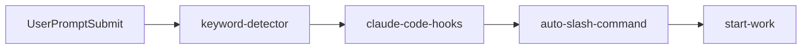
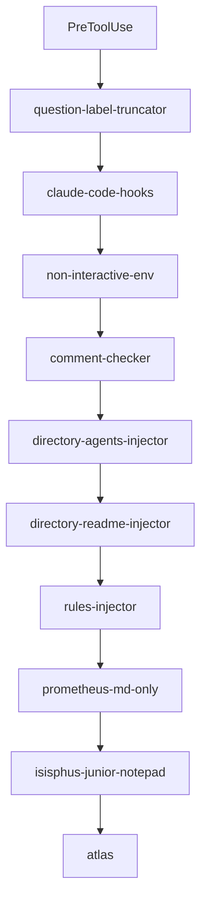
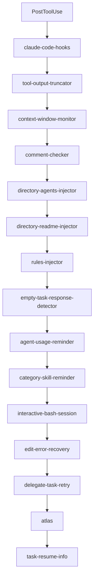
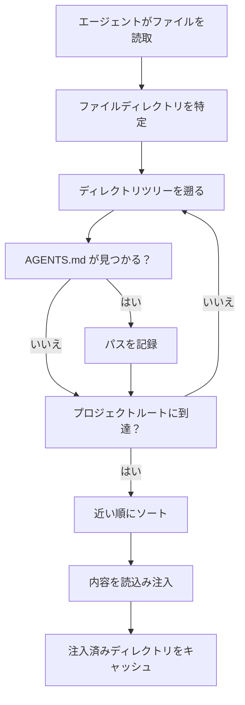
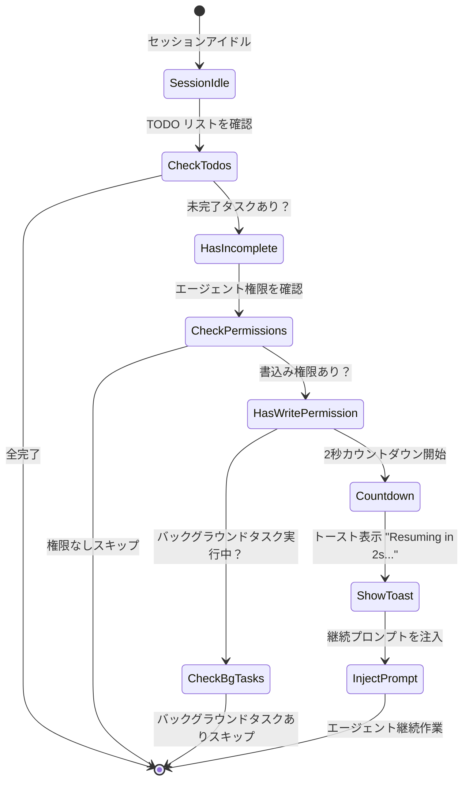
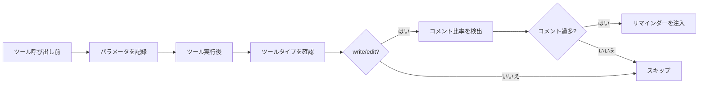

# ライフサイクルフック：自動化されたコンテキストと品質管理

## 学習後にできること

- AI エージェントにプロジェクトコンテキストを自動注入（AGENTS.md、README.md）
- エージェントが途中で諦めるのを防ぎ、TODO リストの強制完了を実現
- 大きすぎるツール出力を自動的に切り詰め、コンテキストウィンドウのオーバーフローを防止
- Ultrawork モードを有効化し、すべての専門エージェントをワンクリックで起動
- フック設定をカスタマイズし、不要な機能を無効化

## 現在の悩み

こんな問題に遭遇していませんか：

- AI エージェントがプロジェクト規約を忘れ、同じミスを繰り返す？
- エージェントが書きかけで止まり、TODO リストが未完了？
- コードベース検索の出力が大きすぎて、コンテキストウィンドウを圧迫？
- 毎回手動でエージェントにどのモードで働くか教える必要がある？

## いつ使うか

ライフサイクルフックは以下のシーンに適しています：

::: tip 典型的なシーン
- **プロジェクトコンテキスト管理**：AGENTS.md と README.md の自動注入
- **品質管理**：コードコメントのチェック、思考ブロックの検証
- **タスク継続性**：すべての TODO タスクの強制完了
- **パフォーマンス最適化**：動的な出力切り詰め、コンテキストウィンドウ管理
- **ワークフロー自動化**：キーワードによるモード起動、自動コマンド実行
:::

## コアコンセプト

### ライフサイクルフックとは？

**ライフサイクルフック**は、エージェントの重要なタイミングにカスタムロジックを挿入できるイベント駆動型メカニズムです。たとえばプロジェクト文書の自動注入、TODO タスクの強制完了、大きすぎる出力の切り詰めなどです。これらのフックは 4 種類のイベントタイプを監視します：ツール実行前、ツール実行後、ユーザーがプロンプトを送信する時、セッションがアイドル時です。フックを適切に設定することで、AI エージェントをよりスマートに、あなたの作業スタイルに合わせたものにできます。

::: info フック vs ミドルウェア
フックは Web フレームワークのミドルウェアによく似ていて、どちらも「特定の時点で特定のことを行う」メカニズムです。違いは：
- **ミドルウェア**：線形実行、リクエストを中断可能
- **フック**：イベント駆動、中断不可、データのみ変更可能
:::

### 32 のフック、7 つのカテゴリー

oh-my-opencode は 32 の組み込みフックを提供し、7 つのカテゴリーに分類されます：

| カテゴリー | フック数 | 主な役割 |
| --- | --- | --- |
| **コンテキスト注入** | 4 | プロジェクト文書、ルールの自動注入 |
| **生産性と制御** | 6 | キーワード検出、モード切り替え、ループ管理 |
| **品質と安全性** | 4 | コードコメントチェック、思考ブロック検証 |
| **回復と安定性** | 3 | セッション回復、エラー処理 |
| **切り詰めとコンテキスト管理** | 2 | 出力の切り詰め、ウィンドウ監視 |
| **通知と UX** | 3 | バージョン更新、バックグラウンドタスク通知、アイドルリマインダー |
| **タスク管理** | 2 | タスク回復、委任リトライ |

## フックイベントタイプ

フックは以下 4 種類のイベントを監視します：

### 1. PreToolUse（ツール実行前）

**トリガータイミング**：エージェントがツールを呼び出す前

**できること**：
- ツール実行の阻止
- ツールパラメータの変更
- コンテキストの注入

**例示フック**：`comment-checker`、`directory-agents-injector`

### 2. PostToolUse（ツール実行後）

**トリガータイミング**：ツール実行完了後

**できること**：
- ツール出力の変更
- 警告情報の追加
- 後続指示の注入

**例示フック**：`tool-output-truncator`、`directory-readme-injector`

### 3. UserPromptSubmit（ユーザーがプロンプトを送信する時）

**トリガータイミング**：ユーザーがセッションにメッセージを送信する時

**できること**：
- 送信の阻止（稀）
- プロンプト内容の変更
- システムメッセージの注入
- ワークモードの有効化

**例示フック**：`keyword-detector`、`auto-slash-command`

### 4. Stop（セッションがアイドル時）

**トリガータイミング**：エージェントの作業が停止し、セッションがアイドル状態になる時

**できること**：
- 後続プロンプトの注入
- 通知の送信
- タスク状態の確認

**例示フック**：`todo-continuation-enforcer`、`session-notification`

## フック実行順序

フックは固定順序で実行され、ロジックの正確性を保証します：

### UserPromptSubmit イベント



**順序の説明**：
1. `keyword-detector`：キーワード検出（ultrawork、search、analyze）
2. `claude-code-hooks`：Claude Code 互換層フックの実行
3. `auto-slash-command`：スラッシュコマンドの自動実行
4. `start-work`：`/start-work` コマンドの処理

### PreToolUse イベント



**順序の説明**：
1. `question-label-truncator`：ツールラベルの切り詰め
2. `claude-code-hooks`：Claude Code 互換層
3. `non-interactive-env`：非対話環境の処理
4. `comment-checker`：コードコメントのチェック
5. `directory-agents-injector`：AGENTS.md の注入
6. `directory-readme-injector`：README.md の注入
7. `rules-injector`：プロジェクトルールの注入
8. `prometheus-md-only`：Prometheus の Markdown のみの出力を強制
9. `sisyphus-junior-notepad`：Sisyphus Junior へのプロンプト注入
10. `atlas`：Atlas メインオーケストレーションロジック

### PostToolUse イベント



**順序の説明**：
1. `claude-code-hooks`：Claude Code 互換層
2. `tool-output-truncator`：ツール出力の切り詰め
3. `context-window-monitor`：コンテキストウィンドウの監視
4. `comment-checker`：コードコメントのチェック
5. `directory-agents-injector`：AGENTS.md の注入
6. `directory-readme-injector`：README.md の注入
7. `rules-injector`：プロジェクトルールの注入
8. `empty-task-response-detector`：空レスポンスの検出
9. `agent-usage-reminder`：専門エージェントの使用をリマインド
10. `category-skill-reminder`：Category/Skill の使用をリマインド
11. `interactive-bash-session`：対話型 Bash セッションの管理
12. `edit-error-recovery`：編集エラーの回復
13. `delegate-task-retry`：失敗した委任タスクのリトライ
14. `atlas`：Atlas メインオーケストレーションロジック
15. `task-resume-info`：タスク回復情報の提供

## コアフック詳解

### 1. directory-agents-injector（AGENTS.md 注入）

**トリガーイベント**：PostToolUse

**機能**：エージェントがファイルを読み取る際、ファイルディレクトリからプロジェクトルートまで遡って、すべてのパスにある `AGENTS.md` ファイルを収集し、エージェントのコンテキストに注入します。

**ワークフロー**：



**例**：

プロジェクト構造：
```
project/
├── AGENTS.md              # プロジェクトレベルコンテキスト
├── src/
│   ├── AGENTS.md          # src レベルコンテキスト
│   └── components/
│       ├── AGENTS.md      # components レベルコンテキスト
│       └── Button.tsx
```

エージェントが `Button.tsx` を読み取る際、自動的に以下を注入：
1. `components/AGENTS.md`（最初に注入）
2. `src/AGENTS.md`
3. `AGENTS.md`（プロジェクトルート）

::: tip ベストプラクティス
- 各主要ディレクトリに `AGENTS.md` を作成し、ディレクトリの役割と規約を記述
- AGENTS.md は「近い順」原則に従い、最も近いものが最優先
- 注入済みのディレクトリはキャッシュされ、重複注入を防ぐ
:::

**ソース位置**：`src/hooks/directory-agents-injector/index.ts` (183 行)

### 2. todo-continuation-enforcer（TODO 強制継続）

**トリガーイベント**：Stop

**機能**：エージェントの TODO リストを検出し、未完了の TODO がある場合、エージェントに作業を強制継続させ、途中で諦めることを防ぎます。

**ワークフロー**：



**カウントダウン機構**：
- デフォルトで 2 秒カウントダウン
- トースト表示：「Resuming in 2s... (X tasks remaining)」
- ユーザーはカウントダウン中に手動でキャンセル可能

**スキップ条件**：
1. エージェントに書込み権限なし（read-only エージェント）
2. エージェントがスキップリストに含まれる（prometheus、compaction）
3. バックグラウンドタスクが実行中
4. セッションが回復中

**ソース位置**：`src/hooks/todo-continuation-enforcer.ts` (490 行)

### 3. keyword-detector（キーワード検出）

**トリガーイベント**：UserPromptSubmit

**機能**：ユーザーからのプロンプト内のキーワードを検出し、対応するモードを自動起動します：

| キーワード | 起動モード | 説明 |
| --- | --- | --- |
| `ultrawork` / `ulw` | **最大性能モード** | すべての専門エージェントと並列タスクを起動 |
| `search` / `find` | **並列探索モード** | explore/librarian を並列起動 |
| `analyze` / `investigate` | **深度分析モード** | 深度探索と分析を有効化 |

**使用例**：

```
ユーザー入力：
ultrawork REST API を開発し、認証と認可を含める

システム応答：
[✅ Ultrawork Mode Activated]
Maximum precision engaged. All agents at your disposal.
```

**実装詳細**：
- キーワード検出はバリアントに対応（ultrawork = ulw）
- メインセッションと非メインセッションの処理が異なる
- モード設定は `message.variant` を介してエージェントに渡される
- バックグラウンドタスクセッションではキーワード検出を行わない

**ソース位置**：`src/hooks/keyword-detector/index.ts` (101 行)

### 4. tool-output-truncator（ツール出力切り詰め）

**トリガーイベント**：PostToolUse

**機能**：大きすぎるツール出力を動的に切り詰め、50% のコンテキストウィンドウ余裕を保ち、最大 50k トークンまで切り詰めます。

**対応ツール**：

```typescript
const TRUNCATABLE_TOOLS = [
  "grep", "Grep", "safe_grep",
  "glob", "Glob", "safe_glob",
  "lsp_diagnostics",
  "ast_grep_search",
  "interactive_bash", "Interactive_bash",
  "skill_mcp",
  "webfetch", "WebFetch",
]
```

**特殊制限**：
- `webfetch` は最大 10k トークン（Web コンテンツはより積極的な切り詰めが必要）
- その他のツールは最大 50k トークン

**切り詰め戦略**：
1. 残りのコンテキストウィンドウに基づき、動的に切り詰めポイントを計算
2. 出力の先頭と末尾を保持し、中央は省略記号で代替
3. 切り詰めヒントを追加：`[Note: Content was truncated to save context window space. For full context, please read file directly: {path}]`

::: warning より積極的な切り詰めを有効化
`oh-my-opencode.json` で設定：
```json
{
  "experimental": {
    "truncate_all_tool_outputs": true
  }
}
```
これにより TRUNCATABLE_TOOLS リスト内のツールだけでなく、すべてのツール出力が切り詰められます。
:::

**ソース位置**：`src/hooks/tool-output-truncator.ts` (62 行)

### 5. comment-checker（コードコメントチェック）

**トリガーイベント**：PreToolUse / PostToolUse

**機能**：エージェントが書き込んだコメントが多すぎないかチェックし、BDD、指示、ドキュメンテーション文字列をスマートに無視します。

**ワークフロー**：



**スマート無視ルール**：
- BDD（ビヘイビア駆動開発）コメント
- 指示コメント（例：`// TODO`, `// FIXME`）
- ドキュメンテーション文字列（Docstrings）

**設定方法**：

```json
{
  "comment_checker": {
    "custom_prompt": "カスタムプロンプト"
  }
}
```

**ソース位置**：`src/hooks/comment-checker/index.ts` (172 行)

## フック設定

### フックの有効化/無効化

`oh-my-opencode.json` で設定：

```json
{
  "disabled_hooks": [
    "comment-checker",
    "auto-update-checker",
    "keyword-detector"
  ]
}
```

### よくある設定シーン

#### シーン 1：コメントチェックを無効化

```json
{
  "disabled_hooks": ["comment-checker"]
}
```

#### シーン 2：キーワード検出を無効化

```json
{
  "disabled_hooks": ["keyword-detector"]
}
```

#### シーン 3：TODO 強制継続を無効化

```json
{
  "disabled_hooks": ["todo-continuation-enforcer"]
}
```

#### シーン 4：積極的な出力切り詰めを有効化

```json
{
  "experimental": {
    "truncate_all_tool_outputs": true
  }
}
```

## 本レッスンのまとめ

本レッスンでは oh-my-opencode の 32 のライフサイクルフックを紹介しました：

**コアコンセプト**：
- フックはイベント駆動型のインターセプトメカニズムです
- 4 つのイベントタイプ：PreToolUse、PostToolUse、UserPromptSubmit、Stop
- 固定順序で実行され、ロジックの正確性を保証

**よく使うフック**：
- `directory-agents-injector`：AGENTS.md の自動注入
- `todo-continuation-enforcer`：TODO リストの強制完了
- `keyword-detector`：キーワード検出によるモード起動
- `tool-output-truncator`：動的な出力切り詰め
- `comment-checker`：コードコメントのチェック

**設定方法**：
- `disabled_hooks` 配列を介して不要なフックを無効化
- `experimental` 設定を介して実験的機能を有効化

## 次回のレッスン予告

> 次回は **[スラッシュコマンド：プリセットワークフロー](../slash-commands/)** を学習します。
>
> 学べること：
> - 6 つの組み込みスラッシュコマンドの使用方法
> - `/ralph-loop` で作業を自動完了
> - `/refactor` でスマートリファクタリング
> - `/start-work` で Prometheus 計画を実行
> - カスタムスラッシュコマンドの作成方法

---

## 付録：ソースリファレンス

<details>
<summary><strong>クリックでソース位置を表示</strong></summary>

> 更新日：2026-01-26

| 機能 | ファイルパス | 行数 |
| --- | --- | --- |
| --- | --- | --- |
| --- | --- | --- |
| --- | --- | --- |
| --- | --- | --- |
| --- | --- | --- |
| --- | --- | --- |
| --- | --- | --- |
| --- | --- | --- |
| --- | --- | --- |

**重要な定数**：
- `AGENTS_FILENAME = "AGENTS.md"`：エージェントコンテキストファイル名（`src/hooks/directory-agents-injector/constants.ts`）
- `DEFAULT_MAX_TOKENS = 50_000`：デフォルトの最大切り詰めトークン数（`src/hooks/tool-output-truncator.ts`）
- `WEBFETCH_MAX_TOKENS = 10_000`：webfetch の最大切り詰めトークン数（`src/hooks/tool-output-truncator.ts`）
- `COUNTDOWN_SECONDS = 2`：TODO 継続のカウントダウン秒数（`src/hooks/todo-continuation-enforcer.ts`）

**重要な関数**：
- `createDirectoryAgentsInjectorHook(ctx)`：AGENTS.md 注入フックの作成
- `createTodoContinuationEnforcer(ctx, options)`：TODO 強制継続フックの作成
- `createKeywordDetectorHook(ctx, collector)`：キーワード検出フックの作成
- `createToolOutputTruncatorHook(ctx, options)`：ツール出力切り詰めフックの作成
- `createCommentCheckerHooks(config)`：コードコメントチェックフックの作成

</details>
