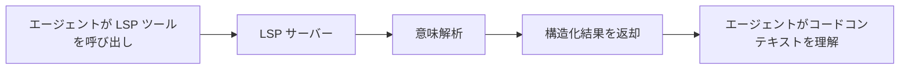
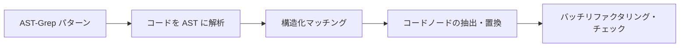

# LSP と AST-Grep：IDE レベルのコード解析・操作能力

## 学習後にできること

- LSP ツールを使ってコードベース内をジャンプ、シンボルを検索、診断情報を取得する
- AST-Grep を使って正確なコードパターン検索と置換を行う
- LSP と AST-Grep の違いと適用場面を理解する
- エージェントに IDE レベルのコード理解・操作能力を持たせる

## 今抱えている課題

従来のコード検索・リファクタリングツールには明確な限界があります：

| 問題 | 従来の解決策 | 実際のニーズ |
|---|---|---|
| **シンボルジャンプが不正確** | 単純な文字列マッチング | コードの意味を理解し、本当の定義へジャンプする必要がある |
| **参照検索が漏れる** | 正規表現検索 | ファイル間・スコープをまたがる正確な参照追跡が必要 |
| **リファクタリングが安全でない** | 手動置換 + grep | コード構造を理解し、破壊的変更を防ぐ必要がある |
| **パターンマッチングが手間** | 正規表現 | AST ベースの構造化パターンマッチングが必要 |

::: info キーコンセプト
**LSP (Language Server Protocol)** は IDE と言語サーバー間の標準プロトコルで、統一インターフェースを通じてコード補完、定義ジャンプ、参照検索、シンボル名変更、診断情報取得、シンボルアウトラインなどの機能を提供し、エディタに強力なコード理解能力を与えます。また型情報や継承関係などの高度な機能もサポートしています。**AST-Grep** は抽象構文木（Abstract Syntax Tree）ベースのコードパターン検索ツールで、単なるテキストではなくコード構造を理解し、メタ変数（`$VAR` で単一ノードを、`$$$` で複数ノードをマッチング）を使って柔軟なパターンマッチングとバッチリファクタリングをサポートしています。TypeScript、Python、Go、Rust など 25 種類のプログラミング言語に対応し、コードリファクタリング、規約チェック、構造化検索に強力なツールです。
:::

## この手法を使うタイミング

| ツール | 適用場面 | 例 |
|---|---|---|
| **LSP ツール** | IDE 機能が必要な場合 | 定義へジャンプ、全参照を検索、エラーリストを取得、シンボル名を変更 |
| **AST-Grep** | コードパターンマッチングが必要な場合 | 特定のコード構造を検索、バッチリファクタリング、コード規約をチェック |
| **Grep/Glob** | 単純なテキスト検索 | 関数名を検索、ファイル名をマッチング |

## 🎒 事前準備

LSP と AST-Grep ツールを使う前に、以下を確認してください：

1. **Language Server がインストールされていること**
   - TypeScript/JavaScript: `npm install -g typescript-language-server`
   - Python: `pip install basedpyright` または `pip install ruff`
   - Go: `go install golang.org/x/tools/gopls@latest`
   - Rust: `rustup component add rust-analyzer`

2. **AST-Grep CLI がインストールされていること**
   ```bash
   bun add -D @ast-grep/cli
   ```

3. **LSP サーバーが設定されていること**
   - LSP サーバー設定は OpenCode の `opencode.json` で行います
   - oh-my-opencode が自動的にこれらの設定を読み込んで使用します

::: tip 環境確認
以下のコマンドで環境を確認してください：
```bash
# LSP サーバーの確認
oh-my-opencode doctor

# AST-Grep の確認
which sg
```
:::

## 核心アイデア

### LSP ツール：IDE レベルのコード理解

LSP ツールは AI エージェントに IDE と同じコード理解能力を与えます：



**核心な利点**：
- ✅ 意味理解であって、単なる文字列マッチングではない
- ✅ ファイル間・スコープをまたがる正確な追跡
- ✅ 型情報や継承関係などの高度な機能をサポート
- ✅ プロジェクト設定と完全に一致（同じ LSP サーバーを使用）

### AST-Grep：構造化コードパターンマッチング

AST-Grep は AI エージェントに正確なコード構造マッチング能力を与えます：



**核心な利点**：
- ✅ テキストではなく、コード構造に基づく
- ✅ メタ変数（`$VAR`、`$$$`）をサポートした柔軟なマッチング
- ✅ 複数の言語をサポート（25 種類）
- ✅ リファクタリング、チェック、コード規約検証に使用可能

## 実践ガイド

### ステップ 1：LSP で定義へジャンプ

**理由**
シンボルの定義位置を確認する必要があるとき、LSP の `goto_definition` ツールは正確なジャンプを提供し、文字列検索よりも信頼性が高いです。

OpenCode では、エージェントが自動的に呼び出せます：

```typescript
// エージェントが自動的に呼び出し
lsp_goto_definition({
  filePath: "src/utils.ts",
  line: 15,
  character: 10
})
```

**期待される出力**：
```
→ 定義が見つかりました：
  ファイル: src/types.ts
  行: 45
  テキスト: export interface UserConfig {
```

::: tip 実際の使用
これらのツールを手動で呼び出す必要はありません。AI エージェントが自動的に使用してコードを理解します。「この関数の定義へジャンプして」や「この変数はどこで定義されている？」と直接尋ねることができます。
:::

### ステップ 2：すべての参照を検索

**理由**
シンボルを変更する必要があるとき、まずすべての参照を検索することで、変更が他の場所の使用を破壊しないことが保証されます。

エージェントは以下を呼び出せます：

```typescript
lsp_find_references({
  filePath: "src/api.ts",
  line: 10,
  character: 5,
  includeDeclaration: true  // 定義自体を含めるかどうか
})
```

**期待される出力**：
```
15 件の参照が見つかりました（最初の 200 件を表示）：
  src/api.ts:10:5  - [定義] fetchData
  src/components/List.tsx:23:12 - [使用] fetchData()
  src/pages/Home.tsx:45:8 - [使用] fetchData()
  ...
```

### ステップ 3：ファイルシンボルとワークスペースシンボルを取得

**理由**
ファイル構造を理解する必要があるとき、またはプロジェクト全体で特定のシンボルタイプを検索するとき、`lsp_symbols` ツールは非常に役立ちます。

**ファイルアウトライン**（scope="document"）：

```typescript
lsp_symbols({
  filePath: "src/app.tsx",
  scope: "document"
})
```

**期待される出力**：
```
12 個のシンボルが見つかりました：
  [Component] App (行: 10-150)
    [Function] useEffect (行: 25-35)
    [Function] handleClick (行: 40-55)
    [Variable] count (行: 15)
  ...
```

**ワークスペース検索**（scope="workspace"）：

```typescript
lsp_symbols({
  filePath: "src/app.tsx",
  scope: "workspace",
  query: "fetchData"
})
```

### ステップ 4：診断情報を取得

**理由**
コードを実行する前に、LSP の診断ツールはエラー、警告、ヒントを事前に発見できます。

```typescript
lsp_diagnostics({
  filePath: "src/utils.ts",
  severity: "error"  // オプション: "error", "warning", "information", "hint", "all"
})
```

**期待される出力**：
```
3 件の診断が見つかりました：
  [Error] src/utils.ts:23:5 - 'result' is used before being assigned
  [Warning] src/utils.ts:45:12 - Unused variable 'temp'
  [Hint] src/utils.ts:67:8 - This can be simplified to const x = value
```

::: tip 事前チェック
コードを書く前に AI エージェントに `lsp_diagnostics` で潜在的な問題をチェックさせることで、繰り返しの修正を避けることができます。
:::

### ステップ 5：シンボルを安全にリネーム

**理由**
シンボルのリネームは一般的なリファクタリング操作ですが、手動での置換はエラーが起きやすいです。LSP の `lsp_rename` ツールはワークスペース全体で安全にシンボルをリネームできます。

**ステップ 1：リネームの検証**

```typescript
lsp_prepare_rename({
  filePath: "src/api.ts",
  line: 10,
  character: 5
})
```

**期待される出力**：
```
リネーム検証：
  現在の名前: fetchData
  プレースホルダー範囲: 行 10, 列 5-14
  ステータス: ✅ 有効
```

**ステップ 2：リネームの実行**

```typescript
lsp_rename({
  filePath: "src/api.ts",
  line: 10,
  character: 5,
  newName: "fetchUserData"
})
```

**期待される出力**：
```
15 ファイルにリネームを適用：
  src/api.ts:10:5 - fetchData → fetchUserData
  src/components/List.tsx:23:12 - fetchData() → fetchUserData()
  src/pages/Home.tsx:45:8 - fetchData → fetchUserData
  ...
```

### ステップ 6：AST-Grep でコードパターンを検索

**理由**
特定のコード構造（例：すべての `console.log` の使用箇所）を検索する必要があるとき、AST-Grep は grep よりも正確です。

**基本パターン検索**：

```typescript
ast_grep_search({
  pattern: "console.log($MSG)",
  lang: "typescript",
  paths: ["src"],
  context: 2  // マッチの前後に表示する行数
})
```

**期待される出力**：
```
src/utils.ts:15:
  13 | function debug(message) {
  14 |   console.log(message)
  15 |   console.log("Debug mode")
  16 | }
  17 | }

src/components/App.tsx:23:
  21 | useEffect(() => {
  22 |   console.log("Component mounted")
  23 | }, [])
```

**メタ変数の使用**：

```typescript
// すべての関数呼び出しをマッチ
ast_grep_search({
  pattern: "$FUNC($$$)",
  lang: "typescript",
  paths: ["src"]
})
```

```typescript
// すべての非同期関数をマッチ
ast_grep_search({
  pattern: "async function $NAME($$$) { $$$ }",
  lang: "typescript",
  paths: ["src"]
})
```

::: warning 重要：パターンは完全な AST ノードでなければならない
❌ 誤り：`export async function $NAME`
✅ 正解：`export async function $NAME($$$) { $$$ }`

パターンは有効なコードスニペットで、完全な関数シグネチャと関数本体を含む必要があります。
:::

### ステップ 7：AST-Grep でバッチ置換

**理由**
コードをバッチリファクタリングする必要があるとき（例：すべての `console.log` を `logger.info` に置き換える）、AST-Grep の置換機能は非常に強力です。

**置換のプレビュー**（dry-run）：

```typescript
ast_grep_replace({
  pattern: "console.log($MSG)",
  rewrite: "logger.info($MSG)",
  lang: "typescript",
  paths: ["src"],
  dryRun: true  // デフォルトは true、プレビューのみで変更しない
})
```

**期待される出力**：
```
変更のプレビュー（dry-run）：
  src/utils.ts:15:2 - console.log("Debug mode")
                 → logger.info("Debug mode")
  src/components/App.tsx:23:4 - console.log("Component mounted")
                               → logger.info("Component mounted")

合計: 2 変更
```

**置換の適用**：

```typescript
ast_grep_replace({
  pattern: "console.log($MSG)",
  rewrite: "logger.info($MSG)",
  lang: "typescript",
  paths: ["src"],
  dryRun: false  // false に設定して変更を適用
})
```

**期待される出力**：
```
2 変更を適用：
  src/utils.ts:15:2 - console.log("Debug mode")
                 → logger.info("Debug mode")
  src/components/App.tsx:23:4 - console.log("Component mounted")
                               → logger.info("Component mounted")
```

::: danger 破壊的な操作
`ast_grep_replace` の `dryRun: false` はファイルを直接変更します。推奨事項：
1. まず `dryRun: true` でプレビューする
2. 問題がないことを確認してから適用する
3. プロジェクトが Git を使用している場合は、まず現在の状態をコミットしておく
:::

## チェックポイント ✅

**LSP ツールの検証**：
- [ ] シンボルの定義へジャンプできるか？
- [ ] すべての参照を検索できるか？
- [ ] 診断情報を取得できるか？
- [ ] シンボルを安全にリネームできるか？

**AST-Grep ツールの検証**：
- [ ] コードパターンを検索できるか？
- [ ] メタ変数を使ってマッチングできるか？
- [ ] プレビューと置換を実行できるか？

## よくある落とし穴

### LSP ツールのよくある問題

| 問題 | 原因 | 解決方法 |
|---|---|---|
| **定義が見つからない** | LSP サーバーが起動していないか設定が間違っている | `opencode.json` の LSP 設定を確認 |
| **参照リストが不完全** | コードにエラーがあり、LSP サーバーが完全に解析できていない | まずコードのエラーを修正 |
| **リネームが失敗** | 新しい名前が既存のシンボルと競合している | より具体的な名前を使用 |

### AST-Grep のよくある問題

| 問題 | 原因 | 解決方法 |
|---|---|---|
| **パターンがマッチしない** | パターンが不完全または構文エラー | パターンが完全な AST ノードであることを確認 |
| **Python パターンの末尾コロン** | Python の `def` と `class` にはコロンが不要 | ❌ `def func():` → ✅ `def func($$$):` |
| **マッチしすぎる** | パターンが広すぎる | より具体的なコンテキストを使用するか、パスを制限 |

### パフォーマンス最適化の提案

```typescript
// ✅ 良い：検索範囲を制限
ast_grep_search({
  pattern: "$FUNC($$$)",
  lang: "typescript",
  paths: ["src/api"],  // 特定のディレクトリのみ検索
  globs: ["*.ts"]      // 特定のファイルのみマッチ
})

// ❌ 悪い：プロジェクト全体を検索
ast_grep_search({
  pattern: "$FUNC($$$)",
  lang: "typescript",
  paths: ["./"]  // すべてのファイルを検索
})
```

## LSP ツール完全リスト

| ツール | 機能 | パラメータ |
|---|---|---|
| `lsp_goto_definition` | シンボルの定義へジャンプ | `filePath`, `line`, `character` |
| `lsp_find_references` | すべての参照を検索 | `filePath`, `line`, `character`, `includeDeclaration?` |
| `lsp_symbols` | ファイルアウトラインまたはワークスペースシンボルを取得 | `filePath`, `scope`, `query?`, `limit?` |
| `lsp_diagnostics` | エラーと警告を取得 | `filePath`, `severity?` |
| `lsp_prepare_rename` | リネーム操作を検証 | `filePath`, `line`, `character` |
| `lsp_rename` | リネーム操作を実行 | `filePath`, `line`, `character`, `newName` |

**制限**：
- シンボル、参照、診断は最大 200 件まで返却（設定可能）
- LSP サーバーは設定済みかつ実行中である必要がある

## AST-Grep ツール完全リスト

| ツール | 機能 | パラメータ |
|---|---|---|
| `ast_grep_search` | AST パターン検索 | `pattern`, `lang`, `paths?`, `globs?`, `context?` |
| `ast_grep_replace` | AST パターン置換 | `pattern`, `rewrite`, `lang`, `paths?`, `globs?`, `dryRun?` |

**対応言語**（25 種類）：
`bash`, `c`, `cpp`, `csharp`, `css`, `elixir`, `go`, `haskell`, `html`, `java`, `javascript`, `json`, `kotlin`, `lua`, `nix`, `php`, `python`, `ruby`, `rust`, `scala`, `solidity`, `swift`, `typescript`, `tsx`, `yaml`

**メタ変数**：
- `$VAR` - 単一ノードをマッチング
- `$$$` - 複数ノードをマッチング

## 実践的なケーススタディ

### ケース 1：API 呼び出しのリファクタリング

**シナリオ**：すべての `fetch` 呼び出しにエラーハンドリングを追加

**AST-Grep でパターンを検索**：

```typescript
ast_grep_search({
  pattern: "fetch($URL).then($RES => $BODY)",
  lang: "typescript",
  paths: ["src/api"]
})
```

**AST-Grep で置換**：

```typescript
ast_grep_replace({
  pattern: "fetch($URL).then($RES => $BODY)",
  rewrite: "fetch($URL).then($RES => $BODY).catch(err => handleError(err))",
  lang: "typescript",
  paths: ["src/api"],
  dryRun: true  // まずプレビュー
})
```

### ケース 2：未使用のインポートを検索

**LSP で参照を検索**：

```typescript
// 各インポートについて
lsp_find_references({
  filePath: "src/utils.ts",
  line: 1,  // import がある行
  character: 10
})

// 1 つの参照（インポート自体）のみ返る場合、未使用
```

### ケース 3：設定変数のリネーム

**ステップ 1：リネームの検証**

```typescript
lsp_prepare_rename({
  filePath: "src/config.ts",
  line: 10,
  character: 4
})
```

**ステップ 2：リネームの実行**

```typescript
lsp_rename({
  filePath: "src/config.ts",
  line: 10,
  character: 4,
  newName: "API_BASE_URL"
})
```

## レッスンのまとめ

このレッスンでは oh-my-opencode の LSP ツールと AST-Grep ツールを紹介しました：

**LSP ツール**：
- IDE レベルのコード理解・操作能力を提供
- 定義ジャンプ、参照検索、診断取得、シンボルリネームをサポート
- プロジェクト設定の LSP サーバーを使用し、IDE と同じ動作

**AST-Grep ツール**：
- AST ベースの構造化コードパターンマッチング
- 柔軟なマッチングのためにメタ変数をサポート
- バッチ置換とリファクタリングをサポート

**ベストプラクティス**：
- LSP は意味理解が必要な場面で使用
- AST-Grep は構造化コードリファクタリングで使用
- 置換前に dryRun でプレビュー

## 次のレッスンの予告

> 次のレッスンでは **[Categories と Skills：動的エージェントコンポジション](../categories-skills/)** を学習します。
>
> 学習内容：
> - Categories を使って最適なモデルを自動選択する方法
> - 異なる Skills を組み合わせて専門エージェントを作成する方法
> - v3.0 の新機能の実際の使用場面

---

## 付録：ソースコード参照

<details>
<summary><strong>ソースコードの位置を表示するにはクリック</strong></summary>

> 更新日時：2026-01-26

### LSP ツール

| 機能 | ファイルパス | 行番号 |
|---|---|---|
| LSP ツール定義 | [`src/tools/lsp/tools.ts`](https://github.com/code-yeongyu/oh-my-opencode/blob/main/src/tools/lsp/tools.ts) | 29-261 |
| LSP クライアント実装 | [`src/tools/lsp/client.ts`](https://github.com/code-yeongyu/oh-my-opencode/blob/main/src/tools/lsp/client.ts) | 1-596 |
| LSP 定数定義 | [`src/tools/lsp/constants.ts`](https://github.com/code-yeongyu/oh-my-opencode/blob/main/src/tools/lsp/constants.ts) | 1-391 |
| LSP 型定義 | [`src/tools/lsp/types.ts`](https://github.com/code-yeongyu/oh-my-opencode/blob/main/src/tools/lsp/types.ts) | 1-246 |

### AST-Grep ツール

| 機能 | ファイルパス | 行番号 |
|---|---|---|
|---|---|---|
|---|---|---|
|---|---|---|
|---|---|---|
|---|---|---|

**重要な定数**：
- `DEFAULT_MAX_REFERENCES = 200` - 最大返却参照数
- `DEFAULT_MAX_SYMBOLS = 200` - 最大返却シンボル数
- `DEFAULT_MAX_DIAGNOSTICS = 200` - 最大返却診断数
- `CLI_LANGUAGES` - 対応言語リスト（25 種類）
- `DEFAULT_MAX_MATCHES = 500` - AST-Grep 最大マッチ数

**重要なツール関数**：
- `withLspClient()` - LSP クライアントを取得して操作を実行
- `runSg()` - AST-Grep CLI コマンドを実行
- `formatLocation()` - 位置情報をフォーマット
- `formatDiagnostic()` - 診断情報をフォーマット

**対応 LSP サーバー**（一部）：
- TypeScript: `typescript-language-server`
- Python: `basedpyright`, `pyright`, `ty`, `ruff`
- Go: `gopls`
- Rust: `rust-analyzer`
- C/C++: `clangd`

</details>
