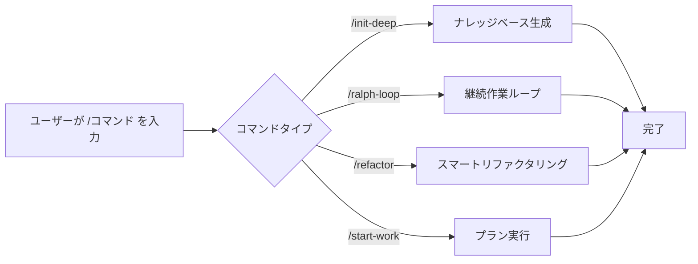

# スラッシュコマンド：プリセットワークフローでワンクリック実行

## このレッスンで学べること

- `/init-deep` でワンクリックでプロジェクトナレッジベースを生成
- `/ralph-loop` でエージェントをタスク完了まで継続的に動作させる
- `/refactor` でスマートリファクタリングを実行し、各ステップを自動検証
- `/start-work` で Prometheus プランから体系的な開発を開始

## 今あなたが抱えている課題

同じ複雑なタスクを繰り返し実行する際、毎回長いコマンドを入力する必要があります：

```
"このプロジェクトの構造を分析して、すべての重要なモジュールを見つけ、各ディレクトリに AGENTS.md を生成し、並行してコードベースのパターンを探索してください..."
```

このような長いコマンドは時間の無駄であり、ステップを見落としやすくなります。

## このテクニックを使うタイミング

**スラッシュコマンド**はワンクリックでトリガーできるプリセットワークフローテンプレートです。これらのコマンドは一般的な開発シナリオをカバーしています：

| シナリオ | 使用コマンド |
| --- | --- |
| プロジェクトナレッジベースの初期化 | `/init-deep` |
| AI を継続的に動作させる | `/ralph-loop` |
| スマートリファクタリング | `/refactor` |
| プランから作業を開始 | `/start-work` |

## コアコンセプト

**スラッシュコマンド**（Slash Commands）は、`/` で始まるトリガーワードで複雑なタスクを素早く実行できる、事前定義されたワークフローテンプレートです。

**動作原理**：



oh-my-opencode には 6 つのスラッシュコマンドが組み込まれています：

| コマンド | 機能 | 複雑度 |
| --- | --- | --- |
| `/init-deep` | 階層化された AGENTS.md ファイルを生成 | 中 |
| `/ralph-loop` | 自己参照型の開発ループ | 高 |
| `/ulw-loop` | Ultrawork 版の ralph-loop | 高 |
| `/cancel-ralph` | アクティブな Ralph Loop をキャンセル | 低 |
| `/refactor` | スマートリファクタリング、完全なツールチェーン | 高 |
| `/start-work` | Prometheus プランから作業を開始 | 中 |

::: info カスタムコマンド
組み込みコマンドに加えて、`.opencode/command/` または `.claude/commands/` ディレクトリにカスタムコマンド（Markdown ファイル）を作成できます。
:::

## 🎒 始める前の準備

- ✅ oh-my-opencode のインストールが完了している
- ✅ 少なくとも 1 つの AI Provider が設定されている
- ✅ 基本的なエージェントの使い方を理解している（先に《Sisyphus 入門：メインオーケストレーター》を学習することを推奨）

## 実践してみよう

### ステップ 1：プロジェクトナレッジベースを生成

**なぜ必要か**
AI エージェントが効率的に動作するには、プロジェクトの構造と規約を理解する必要があります。`/init-deep` コマンドはプロジェクトを自動分析し、階層化された AGENTS.md ファイルを生成します。

**OpenCode で入力**：

```
/init-deep
```

**期待される結果**：エージェントがプロジェクト構造の分析、コードパターンの探索、AGENTS.md ファイルの生成を並行して開始します。

**応用的な使い方**：

```bash
# すべてのファイルを再生成（古いものを削除）
/init-deep --create-new

# 生成の深さを制限
/init-deep --max-depth=2
```

**出力例**：

```
=== init-deep Complete ===

Mode: update

Files:
  [OK] ./AGENTS.md (root, 120 lines)
  [OK] ./src/hooks/AGENTS.md (45 lines)
  [OK] ./src/agents/AGENTS.md (38 lines)

Dirs Analyzed: 12
AGENTS.md Created: 3
```

### ステップ 2：AI を継続的に動作させる

**なぜ必要か**
一部のタスクは完了までに複数回の反復が必要です（例：複雑なバグの修正）。`/ralph-loop` コマンドはエージェントを途中で停止させず、タスクが完了するまで継続的に動作させます。

**OpenCode で入力**：

```
/ralph-loop "ログインページの認証問題を修正し、すべてのエラーケースが処理されていることを確認"
```

**期待される結果**：エージェントが作業を開始し、完了後も自動的に継続し、完了マーカーが出力されるまで続きます。

**応用的な使い方**：

```bash
# カスタム完了マーカー
/ralph-loop "ユニットテストを作成" --completion-promise="TESTS_DONE"

# 最大反復回数を制限
/ralph-loop "パフォーマンスを最適化" --max-iterations=50
```

**Ultrawork 版**（すべての専門エージェントをアクティブ化）：

```bash
/ulw-loop "認証、認可、レート制限機能を含む REST API を開発"
```

**チェックポイント** ✅

- エージェントは各反復後に自動的に継続していますか？
- 完了後に "Ralph Loop Complete!" というプロンプトが表示されましたか？

### ステップ 3：ループをキャンセル

**なぜ必要か**
タスクの方向性が間違っている場合や手動で介入したい場合は、ループをキャンセルする必要があります。

**OpenCode で入力**：

```
/cancel-ralph
```

**期待される結果**：ループが停止し、ステータスファイルがクリーンアップされます。

### ステップ 4：スマートリファクタリング

**なぜ必要か**
コードをリファクタリングする際、無計画な変更はバグを引き起こします。`/refactor` コマンドは完全なツールチェーン（LSP、AST-Grep、テスト検証）を使用して安全なリファクタリングを保証します。

**OpenCode で入力**：

```bash
# シンボルのリネーム
/refactor "AuthService クラスを UserService にリファクタリング"

# モジュールのリファクタリング
/refactor src/auth --scope=module --strategy=safe

# パターンマッチングリファクタリング
/refactor "deprecated API を使用しているすべての箇所を新しい API に移行"
```

**期待される結果**：エージェントが 6 つのフェーズでリファクタリングプロセスを実行します：

1. **インテントゲートウェイ** - リファクタリング目標の確認
2. **コードベース分析** - 依存関係の並行探索
3. **Codemap 構築** - 影響範囲のマッピング
4. **テスト評価** - テストカバレッジの確認
5. **プラン生成** - 詳細なリファクタリングプランの作成
6. **リファクタリング実行** - 段階的な実行と検証

**応用的な使い方**：

```bash
# アグレッシブ戦略（より大きな変更を許可）
/refactor "アーキテクチャリファクタリング" --strategy=aggressive

# ファイルスコープ
/refactor "utils.ts の関数を最適化" --scope=file
```

::: warning テストカバレッジ要件
対象コードのテストカバレッジが 50% 未満の場合、`/refactor` はアグレッシブ戦略の実行を拒否します。先にテストを追加することを推奨します。
:::

### ステップ 5：プランから作業を開始

**なぜ必要か**
Prometheus でプランニングを行った後、プラン内のタスクを体系的に実行する必要があります。`/start-work` コマンドはプランを自動的にロードし、Atlas エージェントを使用して実行します。

**OpenCode で入力**：

```bash
# 単一のプランを自動選択
/start-work

# 特定のプランを選択
/start-work "auth-api-plan"
```

**期待される結果**：

- プランが 1 つだけの場合：自動的に選択して実行を開始
- 複数のプランがある場合：すべてのプランを一覧表示して選択

**出力例**：

```
Available Work Plans

Current Time: 2026-01-26T10:30:00Z
Session ID: abc123

1. [auth-api-plan.md] - Modified: 2026-01-25 - Progress: 3/10 tasks
2. [migration-plan.md] - Modified: 2026-01-26 - Progress: 0/5 tasks

Which plan would you like to work on? (Enter number or plan name)
```

**チェックポイント** ✅

- プランは正しくロードされましたか？
- タスクは順番に実行されていますか？
- 完了したタスクはマークされていますか？

## よくある落とし穴

### 1. `/init-deep` が既存ファイルを無視する

**問題**：デフォルトモードでは、`/init-deep` は既存の AGENTS.md を保持し、不足している部分のみを更新または作成します。

**解決策**：`--create-new` パラメータを使用してすべてのファイルを再生成します。

### 2. `/ralph-loop` が無限ループする

**問題**：エージェントがタスクを完了できない場合、ループは最大反復回数（デフォルト 100）まで継続します。

**解決策**：
- 適切な `--max-iterations` を設定（例：20-30）
- `/cancel-ralph` で手動キャンセル
- より明確なタスク説明を提供

### 3. `/refactor` のテストカバレッジが低い

**問題**：対象コードにテストがなく、リファクタリングが失敗します。

**解決策**：
```bash
# まずエージェントにテストを追加させる
"AuthService に完全なユニットテストを追加し、すべてのエッジケースをカバーしてください"

# その後リファクタリング
/refactor "AuthService クラスをリファクタリング"
```

### 4. `/start-work` がプランを見つけられない

**問題**：Prometheus が生成したプランが `.sisyphus/plans/` ディレクトリに保存されていません。

**解決策**：
- Prometheus の出力にプランファイルのパスが含まれているか確認
- プランファイルの拡張子が `.md` であることを確認

### 5. コマンドパラメータの形式エラー

**問題**：パラメータの位置または形式が正しくありません。

**解決策**：
```bash
# ✅ 正しい
/ralph-loop "タスクの説明" --completion-promise=DONE

# ❌ 間違い
/ralph-loop --completion-promise=DONE "タスクの説明"
```

## このレッスンのまとめ

| コマンド | 主な機能 | 使用頻度 |
| --- | --- | --- |
| `/init-deep` | プロジェクトナレッジベースを自動生成 | 初期設定 |
| `/ralph-loop` | 継続作業ループ | 高 |
| `/ulw-loop` | Ultrawork 版のループ | 中 |
| `/cancel-ralph` | ループをキャンセル | 低 |
| `/refactor` | 安全なスマートリファクタリング | 高 |
| `/start-work` | Prometheus プランを実行 | 中 |

**ベストプラクティス**：
- 新規プロジェクトでは最初に `/init-deep` でナレッジベースを構築
- 複雑なタスクには `/ralph-loop` で AI を継続的に動作させる
- コードリファクタリングには `/refactor` を優先使用し、安全性を確保
- Prometheus と組み合わせて `/start-work` で体系的な開発を実施

## 次のレッスンの予告

次のレッスンでは **[設定の詳細カスタマイズ](../advanced-configuration/)** を学びます。

学べること：
- エージェントのデフォルトモデルとプロンプトをオーバーライドする方法
- 権限とセキュリティ制限を設定する方法
- Categories と Skills をカスタマイズする方法
- バックグラウンドタスクの並行制御を調整する方法

---

## 付録：ソースコード参照

<details>
<summary><strong>クリックしてソースコードの場所を表示</strong></summary>

> 更新日：2026-01-26

| 機能 | ファイルパス | 行番号 |
| --- | --- | --- |
| コマンド定義 | [`src/features/builtin-commands/commands.ts`](https://github.com/code-yeongyu/oh-my-opencode/blob/main/src/features/builtin-commands/commands.ts) | 8-73 |
| コマンドローダー | [`src/features/builtin-commands/index.ts`](https://github.com/code-yeongyu/oh-my-opencode/blob/main/src/features/builtin-commands/index.ts) | 75-89 |
| init-deep テンプレート | [`src/features/builtin-commands/templates/init-deep.ts`](https://github.com/code-yeongyu/oh-my-opencode/blob/main/src/features/builtin-commands/templates/init-deep.ts) | 全文 |
| ralph-loop テンプレート | [`src/features/builtin-commands/templates/ralph-loop.ts`](https://github.com/code-yeongyu/oh-my-opencode/blob/main/src/features/builtin-commands/templates/ralph-loop.ts) | 全文 |
| refactor テンプレート | [`src/features/builtin-commands/templates/refactor.ts`](https://github.com/code-yeongyu/oh-my-opencode/blob/main/src/features/builtin-commands/templates/refactor.ts) | 全文 |
| start-work テンプレート | [`src/features/builtin-commands/templates/start-work.ts`](https://github.com/code-yeongyu/oh-my-opencode/blob/main/src/features/builtin-commands/templates/start-work.ts) | 全文 |
| Ralph Loop Hook 実装 | [`src/hooks/ralph-loop/index.ts`](https://github.com/code-yeongyu/oh-my-opencode/blob/main/src/hooks/ralph-loop/index.ts) | 全文 |
| コマンド型定義 | [`src/features/builtin-commands/types.ts`](https://github.com/code-yeongyu/oh-my-opencode/blob/main/src/features/builtin-commands/types.ts) | 全文 |

**主要な関数**：
- `loadBuiltinCommands()`：組み込みコマンド定義をロード、特定のコマンドの無効化をサポート
- `createRalphLoopHook()`：Ralph Loop ライフサイクルフックを作成
- `startLoop()`：ループを開始、ステータスとパラメータを設定
- `cancelLoop()`：アクティブなループをキャンセル、ステータスファイルをクリーンアップ

**主要な定数**：
- `DEFAULT_MAX_ITERATIONS = 100`：デフォルトの最大反復回数
- `DEFAULT_COMPLETION_PROMISE = "DONE"`：デフォルトの完了マーカー

**設定場所**：
- コマンドの無効化：`oh-my-opencode.json` の `disabled_commands` フィールド
- ループ設定：`oh-my-opencode.json` の `ralph_loop` オブジェクト

</details>
