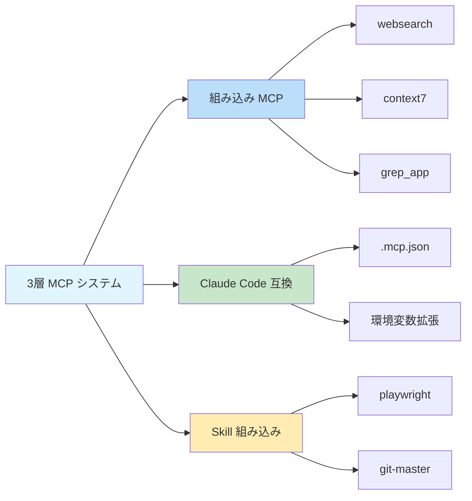

# 組み込み MCP サーバー: Web検索、ドキュメントクエリ、コード検索

## 学習内容

- ✅ 3つの組み込み MCP サーバーとその使用シーンを理解する
- ✅ Exa Websearch の API Key を設定する方法を知る
- ✅ 不要な MCP サービスを無効化する方法を学ぶ
- ✅ 3層 MCP システムのアーキテクチャと動作原理を理解する

## 現在の課題

AI エージェントはローカルファイルへのアクセスとネットワークリクエストしかできませんが、専門的な検索やドキュメントクエリの機能が不足しています。エージェントに以下の能力を持たせたい場合：
- Web をリアルタイムで検索して最新情報を取得する
- 公式ドキュメントを参照して正確な API 説明を得る
- GitHub リポジトリで実装例を検索する

しかし、これらの機能を手動で実装すると開発の複雑さが増します。

## いつこのアプローチを使うか

AI エージェントの機能を拡張する必要がある場合：

| シーン | 推奨される MCP |
|--------|----------------|
| 最新の技術情報、ニュース、業界トレンドを取得する必要がある | **websearch** (Exa) |
| ライブラリやフレームワークの公式 API ドキュメントをクエリする | **context7** |
| GitHub リポジトリで実装例を見つける | **grep_app** (Grep.app) |

## コアコンセプト: MCP とは？

**MCP (Model Context Protocol)** は、AI エージェントが外部ツールやデータソースにアクセスできるようにする標準プロトコルです。簡単に言うと：

::: info MCP とは？
MCP は AI エージェントに「ツールボックス」を装備するようなものです。中には様々な専門ツール（検索、データベース、API など）が入っています。エージェントは必要に応じてこれらのツールを呼び出し、ローカルでは提供できない機能にアクセスできます。
:::

Oh-My-OpenCode は**3層 MCP システム**を提供します：



**このレッスンでは第1層（組み込み MCP サーバー）に焦点を当てます。**

---

## 3つの組み込み MCP サーバー

Oh-My-OpenCode には 3 つのリモート MCP サーバーが組み込まれており、すぐに使用できます（一部は API Key の設定が必要です）。

### 1. websearch (Exa AI)

**機能**: [Exa AI](https://exa.ai) によるリアルタイム Web 検索。

**使用シーン**:
- 最新の技術記事やニュースを検索する
- 特定の問題の解決策を見つける
- 業界のトレンドやベストプラクティスを取得する

**設定要件**:

`EXA_API_KEY` 環境変数を設定する必要があります：

::: code-group

```bash [macOS/Linux]
export EXA_API_KEY="your-api-key-here"
```

```powershell [Windows]
setx EXA_API_KEY "your-api-key-here"
```

:::

::: tip Exa API Key の取得
1. [Exa AI](https://exa.ai) にアクセス
2. アカウントを登録
3. Dashboard で API Key を作成
4. Key を環境変数に追加
:::

**ソースコードの場所**: `src/mcp/websearch.ts`（1-11 行目）

---

### 2. context7

**機能**: 公式ドキュメントクエリ。あらゆるプログラミングライブラリやフレームワークをサポート。

**使用シーン**:
- React、Vue、Next.js などの API ドキュメントをクエリする
- Node.js、Python などのランタイムの公式ドキュメントを取得する
- オープンソースプロジェクトの使用ガイドを参照する

**設定要件**: 設定不要、すぐに使用できます。

**ソースコードの場所**: `src/mcp/context7.ts`（1-7 行目）

---

### 3. grep_app (Grep.app)

**機能**: 実装例を見つけるための超高速 GitHub コード検索。

**使用シーン**:
- オープンソースプロジェクトで特定パターンの実装を見つける
- 他の人がどのようにコードを書いているかを学ぶ
- 特定の問題を解決するコードスニペットを見つける

**設定要件**: 設定不要、すぐに使用できます。

**ソースコードの場所**: `src/mcp/grep-app.ts`（1-7 行目）

---

## MCP の設定と無効化

### デフォルトの動作

すべての組み込み MCP サーバーは**デフォルトで有効**です。Oh-My-OpenCode は起動時にこれらのサービスを自動的に登録します。

### 不要な MCP を無効化する

特定の MCP サービスが不要な場合、設定ファイルで無効化できます：

```jsonc
// ~/.config/opencode/oh-my-opencode.json または .opencode/oh-my-opencode.json
{
  "$schema": "./assets/oh-my-opencode.schema.json",

  // 不要な MCP サーバーを無効化
  "disabled_mcps": [
    "websearch",    // Web 検索を無効化（Exa API Key がない場合）
    "grep_app"      // GitHub コード検索を無効化
  ]
}
```

::: warning MCP を無効化する理由？
不要な MCP を無効化すると：
1. **リソースを節約**: 不要な接続とリクエストを減らす
2. **設定を簡素化**: 未設定の API Key に関するプロンプトを回避
3. **安定性を向上**: 潜在的なネットワーク障害ポイントを減らす
:::

### 設定の優先順位

組み込み MCP の無効化設定の優先順位：

| 設定場所 | 優先順位 |
|---------|----------|
| ユーザー設定 `~/.config/opencode/oh-my-opencode.json` | 高（プロジェクト設定を上書き） |
| プロジェクト設定 `.opencode/oh-my-opencode.json` | 中 |
| コードのデフォルト値 | 低（すべて有効） |

---

## 動作原理: リモート MCP の設定

すべての組み込み MCP サーバーは**リモート（remote）モード**を使用し、HTTP/SSE プロトコル経由で外部サービスに接続します。

**設定モード**（ソースコード定義）：

```typescript
// src/mcp/websearch.ts
export const websearch = {
  type: "remote" as const,        // "remote" に固定
  url: "https://mcp.exa.ai/mcp?tools=web_search_exa",  // MCP サーバーのアドレス
  enabled: true,                   // 有効状態（disabled_mcps で上書き）
  headers: process.env.EXA_API_KEY  // オプションのリクエストヘッダー（API Key）
    ? { "x-api-key": process.env.EXA_API_KEY }
    : undefined,
  oauth: false as const,            // OAuth 自動検出を無効化
}
```

**設定フィールドの説明**:

| フィールド | 型 | 説明 |
|----------|------|------|
| `type` | `"remote"` | 固定値、リモート MCP を示す |
| `url` | `string` | MCP サーバーの HTTP アドレス |
| `enabled` | `boolean` | 有効かどうか（コードでは `true` 固定、`disabled_mcps` で制御） |
| `headers` | `object` | オプションの HTTP リクエストヘッダー（認証用） |
| `oauth` | `false` | OAuth 自動検出を無効化（Exa は API Key を使用） |

---

## よくある落とし穴

### 落とし穴 1: websearch は API Key が必要

**症状**: エージェントが websearch を使用しようとすると失敗し、API Key がないと警告されます。

**解決方法**:

```bash
# 環境変数が設定されているか確認
echo $EXA_API_KEY

# 空の場合、API Key を設定
export EXA_API_KEY="your-actual-api-key"

# またはシェル設定（~/.bashrc、~/.zshrc など）に永続的に追加
echo 'export EXA_API_KEY="your-actual-api-key"' >> ~/.zshrc
```

::: tip API Key の検証
設定後、OpenCode を再起動するか診断コマンドを実行して検証できます：
```bash
oh-my-opencode doctor --verbose
```
:::

### 落とし穴 2: 無効化後も MCP がプロンプトされる

**症状**: MCP を無効化しても、エージェントがそれを使用しようとします。

**解決方法**:

1. 設定ファイルのパスが正しいか確認：
   - ユーザー設定: `~/.config/opencode/oh-my-opencode.json`
   - プロジェクト設定: `.opencode/oh-my-opencode.json`

2. JSON 形式が正しいか確認（カンマ、引用符に注意）：

```jsonc
{
  "disabled_mcps": ["websearch"]  // ✅ 正しい
  // "disabled_mcps": ["websearch"],  // ❌ エラー: 末尾にカンマは不可
}
```

3. 設定を有効にするために OpenCode を再起動します。

### 落とし穴 3: Grep.app の結果が不正確

**症状**: grep_app が期待と異なる結果を返します。

**考えられる原因**:
- 検索キーワードが一般的すぎる
- 対象リポジトリが非アクティブまたは削除されている
- 検索構文が正しくない

**解決方法**:
- より具体的な検索語を使用する
- 検索時にファイルタイプや言語を指定する
- [Grep.app](https://grep.app) に直接アクセスして手動で検証する

---

## まとめ

このレッスンでは Oh-My-OpenCode の 3 つの組み込み MCP サーバーを紹介しました：

| MCP | 機能 | 設定要件 | 主な用途 |
|-----|------|---------|----------|
| **websearch** | リアルタイム Web 検索 | EXA_API_KEY | 最新情報の取得 |
| **context7** | 公式ドキュメントクエリ | なし | API ドキュメントの参照 |
| **grep_app** | GitHub コード検索 | なし | 実装例の検索 |

**重要ポイント**:

1. **3層 MCP システム**: 組み込み → Claude Code 互換 → Skill 組み込み
2. **デフォルト有効**: すべての組み込み MCP はデフォルトで有効、`disabled_mcps` で無効化可能
3. **リモートモード**: すべての組み込み MCP は HTTP/SSE プロトコルで外部サービスに接続
4. **Exa は Key 必要**: websearch は `EXA_API_KEY` 環境変数が必要

これらの MCP サーバーは AI エージェントの機能を大幅に拡張し、リアルタイム情報と専門知識ベースにアクセスできるようにします。

---

## 付録: ソースコード参照

<details>
<summary><strong>クリックしてソースコードの場所を展開</strong></summary>

> 更新日時: 2026-01-26

| 機能 | ファイルパス | 行番号 |
|------|-----------|--------|
| MCP ファクトリ関数 | [`src/mcp/index.ts`](https://github.com/code-yeongyu/oh-my-opencode/blob/main/src/mcp/index.ts) | 22-32 |
| websearch 設定 | [`src/mcp/websearch.ts`](https://github.com/code-yeongyu/oh-my-opencode/blob/main/src/mcp/websearch.ts) | 1-11 |
| context7 設定 | [`src/mcp/context7.ts`](https://github.com/code-yeongyu/oh-my-opencode/blob/main/src/mcp/context7.ts) | 1-7 |
| grep_app 設定 | [`src/mcp/grep-app.ts`](https://github.com/code-yeongyu/oh-my-opencode/blob/main/src/mcp/grep-app.ts) | 1-7 |
| McpNameSchema | [`src/mcp/types.ts`](https://github.com/code-yeongyu/oh-my-opencode/blob/main/src/mcp/types.ts) | 1-10 |
| disabled_mcps フィールド | [`src/config/schema.ts`](https://github.com/code-yeongyu/oh-my-opencode/blob/main/src/config/schema.ts) | 331 |

**重要な定数**:
- `allBuiltinMcps`: 組み込み MCP 設定オブジェクト、websearch、context7、grep_app を含む（`src/mcp/index.ts:16-20`）

**重要な関数**:
- `createBuiltinMcps(disabledMcps)`: 有効な MCP のリストを作成、無効化された MCP をフィルタリング（`src/mcp/index.ts:22-32`）

</details>
