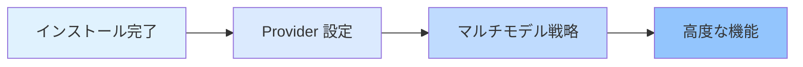

# プラットフォームと統合

本章では、複数の AI Provider（Anthropic、OpenAI、Google、GitHub Copilot など）の設定と管理方法、および oh-my-opencode のマルチモデル自動フェイルバックメカニズムについて説明します。

本章を学ぶことで、タスクタイプと利用可能なモデルに基づいてシステムが最適な AI モデルをインテリジェントに選択する方法をマスターし、効率的で信頼性の高いマルチモデルオーケストレーションワークフローを構築できるようになります。

## 本章の内容

本章は 2 つのパートに分かれています：

### 1. [Provider 設定](provider-setup/)

複数の AI Provider の設定方法を学びます：
- Anthropic Claude（メインオーケストレーターの第一候補）
- OpenAI ChatGPT（アーキテクチャレビュー専用）
- Google Gemini（フロントエンドとメディア分析）
- GitHub Copilot（バックアップ Provider）
- Z.ai Coding Plan と OpenCode Zen（オプションサービス）

**学習後できること**：
- ✅ 6 つの主要な AI Provider を設定する
- ✅ インタラクティブなインストーラーで素早く設定する
- ✅ 各エージェントに最適なモデルを指定する
- ✅ `doctor` コマンドを使用して設定問題を診断する

**所要時間**：25-30 分

### 2. [マルチモデル戦略](model-resolution/)

モデル解決システムの 3 段階優先度メカニズムを深く理解します：
- ユーザーオーバーライド（正確な制御）
- Provider フェイルバック（自動フォールトトレランス）
- システムデフォルト（フォールバックソリューション）

**学習後できること**：
- ✅ モデル解決の完全なワークフローを理解する
- ✅ タスク要件に基づいて手動でモデルを指定する
- ✅ Provider フェイルバックを活用してシステムの堅牢性を向上させる
- ✅ モデル解決の問題を診断・解決する

**所要時間**：30-35 分

## 学習パスの推奨

本章は以下の順序で学習することをお勧めします：

**なぜこの順序なのか？**

1. **まず設定、次に理解**：まず各 Provider の設定方法を学び、その後背後にある解決メカニズムを理解する
2. **シンプルから複雑へ**：Provider 設定は基本操作、マルチモデル戦略は高度な概念
3. **実践で理論を検証**：Provider を設定した後、`doctor` コマンドを使用してマルチモデル戦略の効果を検証できる

::: tip クイックスタートパス
すぐに始めたい場合は、[Provider 設定](provider-setup/) のステップ 1-4（基本 Provider の設定）を完了し、他の内容は必要に応じて後で学習できます。
:::

## 前提条件

本章を学習する前に、以下を確認してください：

- ✅ [インストールと初期設定](../installation/) を完了している
- ✅ OpenCode をインストールしている（バージョン >= 1.0.150）
- ✅ 基本的な JSON/JSONC 設定ファイル形式を理解している
- ✅ 少なくとも 1 つの AI Provider のアカウントサブスクリプションを持っている（Anthropic Claude を推奨）

::: warning Provider アカウントがない場合怎么办？
Provider に実際に接続せずに、まず設定手順を学ぶことができます。システムは OpenCode のデフォルトモデルをフォールバックとして使用します。
:::

## よくある質問

<strong>すべての Provider を設定する必要がありますか？</strong>

いいえ。最も頻繁に使用する Provider（例：Anthropic Claude のみ）だけを設定できます。oh-my-opencode の Provider フェイルバックメカニズムは、利用可能な Provider を自動的に使用します。

ただし、マルチモデルオーケストレーションの利点を最大限に活用したい場合は、少なくとも 2-3 つの Provider を設定することをお勧めします。これにより、システムはタスクタイプに基づいて最適なモデルを自動的に選択できます。

<strong>Provider 設定とモデル解決の違いは何ですか？</strong>

- **Provider 設定**：「インストールステップ」、システムに利用可能な AI サービスを伝える
- **モデル解決**：「意思決定ロジック」、システムが各エージェントに対してどの Provider を使用するかを選択する方法

比喩：Provider 設定は「チームメンバーの採用」、モデル解決は「タスクの割り当て」。

<strong>設定はいつでも変更できますか？</strong>

設定ファイルはいつでも変更できます：
- ユーザー設定：`~/.config/opencode/oh-my-opencode.json`
- プロジェクト設定：`.opencode/oh-my-opencode.json`

変更後、次回エージェントを使用するときに自動的に反映されます。Provider 認証を変更した場合は、`opencode auth login` を実行して再認証する必要があります。

## 次のステップ

本章を完了した後、以下のことができます：

### 推奨パス：AI エージェントチームを学ぶ

[AI エージェントチーム：10 人のエキスパート紹介](../../advanced/ai-agents-overview/) を続けて学び、専門的なタスクに異なるエージェントを使用する方法を理解します。

### 高度なパス：深度カスタマイズ

基本設定に既に慣れている場合は、[設定深度カスタマイズ：エージェントと権限管理](../../advanced/advanced-configuration/) にジャンプして、以下を学習できます：
- エージェントのプロンプトをカスタマイズする方法
- エージェントの権限とアクセススコープを設定する方法
- カスタムエージェントとカテゴリを作成する方法

### 実践パス：Prometheus プランニングを使用する

[Prometheus プランニング：インタビュー形式の要件収集](../../advanced/prometheus-planning/) の使用を開始し、実際のエージェント協力を通じてマルチモデルオーケストレーションの威力を体験します。

---

**始めましょう**：[Provider 設定](provider-setup/) からマルチモデルオーケストレーションの旅を始めましょう！
