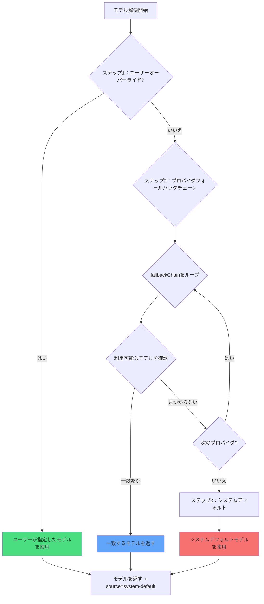

# マルチモデル戦略：自動フォールバックと優先度

## 学習目標

- oh-my-opencode が各エージェントに最も適切な AI モデルを自動的に選択する仕組みを理解する
- 3ステップモデル解決メカニズム（ユーザーオーバーライド → プロバイダフォールバック → システムデフォルト）を習得する
- エージェントとカテゴリのモデルオーバーライド設定をできるようになる
- `doctor` コマンドを使用してモデル解決の結果を検証する
- タスク的需求に応じてモデルを手動で指定し、コストとパフォーマンスを最適化する

## 現在の課題

複数の AI プロバイダ（Anthropic、OpenAI、Google など）を設定した後、次のような疑問を感じたことはないでしょうか：

- **モデル選択が不明確**：Sisyphus、Oracle、Librarian などのエージェントは実際にどのモデルを使用している？
- **手動設定が面倒**：各エージェントに個別にモデルを指定する必要があり、プロバイダの変更時にすべて調整が必要
- **コストが管理できない**：どのタスクで高額なモデル（Claude Opus など）が使用されているかわからない
- **プロバイダの障害が用户体验に影響**：あるプロバイダの API が停止すると、システム全体が動作しなくなる
- **マルチモデルの協力が不透明**：並列タスクで異なるエージェントがどのモデルを使用しているかわからない

これらはすべて、マルチモデル編成の真の力を発揮することを妨げています。

## コアコンセプト

**モデル解決システム**は oh-my-opencode の「インテリジェントモデルセレクタ」です。設定と利用可能なモデルに基づいて、各エージェントとカテゴリに使用するモデルを動的に決定します。

::: info モデル解決とは？
モデル解決（Model Resolution）は、実行時に各エージェントまたはカテゴリに具体的な AI モデルを選択するプロセスです。これはハードコードされたものではなく、設定、利用可能なプロバイダ、モデル名などに基づいて動的に計算されます。
:::

### 3ステップ解決フロー

モデル解決は3つの優先度ステップで実装されています：



**ステップ1：ユーザーオーバーライド（User Override）**
- `oh-my-opencode.json` でエージェントまたはカテゴリの `model` を明示的に指定した場合、システムはそのモデルを直接使用します
- プロバイダフォールバックチェーンをスキップします
- これは最高の優先度です

**ステップ2：プロバイダフォールバック（Provider Fallback）**
- ユーザーオーバーライドがない場合、システムは定義されたプロバイダ優先度チェーンに従って試行します
- 各エージェントまたはカテゴリには `fallbackChain` があり、希望するプロバイダの順序が定義されています
- システムは各プロバイダを順番に試行し、利用可能なモデルを見つけます

**ステップ3：システムデフォルト（System Default）**
- すべてのプロバイダに利用可能なモデルがない場合、OpenCode のデフォルトモデルが使用されます
- これは最後のセーフネットです

### エージェントのプロバイダ優先度チェーン

各エージェントには、タスクタイプと必要な能力に基づいた希望するプロバイダの順序があります：

| エージェント | 推奨モデル（プレフィックスなし） | プロバイダ優先度チェーン | バリアント |
| --- | --- | --- | --- |
| **Sisyphus** | `claude-opus-4-5` | anthropic → github-copilot → opencode → zai-coding-plan | max |
| **Oracle** | `gpt-5.2` | openai → anthropic → google | high |
| **Librarian** | `big-pickle` | zai-coding-plan → opencode → anthropic | - |
| **Explore** | `claude-haiku-4-5` | anthropic → opencode → github-copilot | - |
| **Multimodal Looker** | `gemini-3-flash` | google → openai → zai-coding-plan → anthropic → opencode | - |
| **Prometheus** | `claude-opus-4-5` | anthropic → github-copilot → opencode → google | max |
| **Metis** | `claude-opus-4-5` | anthropic → github-copilot → opencode → google | max |
| **Momus** | `gpt-5.2` | openai → anthropic → google | medium |
| **Atlas** | `claude-sonnet-4-5` | anthropic → github-copilot → opencode → google | - |

::: tip なぜ Sisyphus は Anthropic を好むのか？
Sisyphus はメインオーケストレーターであり、強力な推論能力が必要です。Claude Opus は複雑なオーケストレーションタスクに最も適したモデルであるため、Anthropic はその優先度チェーンの最上位にあります。Anthropic のクオータが不足している場合、システムは他のプロバイダに自動的にフォールバックします。
:::

### カテゴリのプロバイダ優先度チェーン

カテゴリも同じ解決ロジックに従います：

| カテゴリ | 推奨モデル（プレフィックスなし） | プロバイダ優先度チェーン | バリアント |
| --- | --- | --- | --- |
| **visual-engineering** | `gemini-3-pro` | google → anthropic → openai | - |
| **ultrabrain** | `gpt-5.2-codex` | openai → anthropic → google | xhigh |
| **artistry** | `gemini-3-pro` | google → anthropic → openai | max |
| **quick** | `claude-haiku-4-5` | anthropic → google → opencode | - |
| **unspecified-low** | `claude-sonnet-4-5` | anthropic → openai → google | - |
| **unspecified-high** | `claude-opus-4-5` | anthropic → openai → google | max |
| **writing** | `gemini-3-flash` | google → anthropic → zai-coding-plan → openai | - |

::: tip カテゴリの利点
`delegate_task(category="quick", ...)` でタスクを委任する場合、システムは自動的に quick カテゴリのプロバイダ優先度チェーンを使用します。これは、各エージェントの設定を覚える必要がなく、タスクタイプに基づいて適切なカテゴリを選択するだけでよいことを意味します。
:::

## 実践チュートリアル

### ステップ1：現在のモデル解決状態を確認する

`doctor` コマンドを使用して、各エージェントとカテゴリのモデル解決結果を確認します：

```bash
bunx oh-my-opencode doctor --verbose
```

**表示される出力の例**：

```
✅ モデル解決チェック
━━━━━━━━━━━━━━━━━━━━━━━━━━━━━━━━━━━━━━━━━━━━━━━━━━━

Agent: sisyphus
  必要モデル: claude-opus-4-5 (variant: max)
  フォールバックチェーン: anthropic → github-copilot → opencode → zai-coding-plan → openai → google
  ユーザーオーバーライド: (なし)
  解決済みモデル: anthropic/claude-opus-4-5
  ソース: provider-fallback
  バリアント: max

Agent: oracle
  必要モデル: gpt-5.2 (variant: high)
  フォールバックチェーン: openai → anthropic → google
  ユーザーオーバーライド: (なし)
  解決済みモデル: openai/gpt-5.2
  ソース: provider-fallback
  バリアント: high

カテゴリ: quick
  必要モデル: claude-haiku-4-5
  フォールバックチェーン: anthropic → google → opencode
  ユーザーオーバーライド: (なし)
  解決済みモデル: anthropic/claude-haiku-4-5
  ソース: provider-fallback
```

この出力には次の情報が含まれます：
- 各エージェント/カテゴリのモデル必要条件
- プロバイダ優先度チェーンの順序
- ユーザーオーバーライド設定の有無
- 最終的な解決済みモデルとソース（override/provider-fallback/system-default）

### ステップ2：エージェントのモデルを手動でオーバーライドする

Oracle にデフォルトの GPT-5.2 ではなく、OpenAI の最新モデルを使用したい場合：

`~/.config/opencode/oh-my-opencode.json` または `.opencode/oh-my-opencode.json` を編集します：

```jsonc
{
  "$schema": "https://raw.githubusercontent.com/code-yeongyu/oh-my-opencode/master/assets/oh-my-opencode.schema.json",

  "agents": {
    "oracle": {
      "model": "openai/o3"  // o3 モデルにオーバーライド
    },
    "explore": {
      "model": "opencode/gpt-5-nano"  // 無料モデルを使用
    }
  }
}
```

::: info ステップ1の優先度
`agents.oracle.model` を設定すると、システムはステップ1で直接このモデルを使用し、プロバイダフォールバックチェーンをスキップします。Anthropic の Claude Opus が利用可能な場合でも、Oracle は指定された OpenAI o3 を使用します。
:::

**確認方法**：`doctor` コマンドを再実行すると、Oracle の解決結果が次のように表示されます：

```
Agent: oracle
  必要モデル: gpt-5.2 (variant: high)
  フォールバックチェーン: openai → anthropic → google
  ユーザーオーバーライド: openai/o3  // ← ユーザーオーバーライドが有効
  解決済みモデル: openai/o3
  ソース: override  // ← ソースが override に変更
  バリアント: high
```

### ステップ3：カテゴリのモデルを手動でオーバーライドする

`quick` カテゴリに無料モデルの GPT-5 Nano を使用したい場合：

```jsonc
{
  "$schema": "https://raw.githubusercontent.com/code-yeongyu/oh-my-opencode/master/assets/oh-my-opencode.schema.json",

  "categories": {
    "quick": {
      "model": "opencode/gpt-5-nano"  // 無料モデルにオーバーライド
    },
    "visual-engineering": {
      "model": "anthropic/claude-opus-4-5"  // Opus を強制使用
    }
  }
}
```

**確認方法**：`delegate_task(category="quick", ...)` を使用するとき、Anthropic の Haiku が利用可能な場合でも、システムは `opencode/gpt-5-nano` を使用します。

### ステップ4：プロバイダ障害をシミュレートする

プロバイダフォールバックメカニズムを理解する最良の方法は、障害シナリオをシミュレートすることです。

OpenAI のみを設定しているが、Sisyphus（Anthropic を好む）がどのモデルを使用するかを確認したい場合：

**現在の設定**：
```jsonc
{
  // oh-my-opencode.json
  // openai プロバイダのみ設定
}
```

**doctor の実行結果**：

```
Agent: sisyphus
  必要モデル: claude-opus-4-5 (variant: max)
  フォールバックチェーン: anthropic → github-copilot → opencode → zai-coding-plan → openai → google
  ユーザーオーバーライド: (なし)
  
  // 第1ラウンド試行：anthropic/claude-opus-4-5
  // 結果：利用不可（未設定）
  
  // 第2ラウンド試行：github-copilot/claude-opus-4-5
  // 結果：利用不可（未設定）
  
  // 第3ラウンド試行：opencode/claude-opus-4-5
  // 結果：利用不可（未設定）
  
  // 第4ラウンド試行：zai-coding-plan/glm-4.7
  // 結果：利用不可（未設定）
  
  // 第5ラウンド試行：openai/gpt-5.2-codex（fallbackChain の5番目のエントリから）
  // 結果：発見！
  
  解決済みモデル: openai/gpt-5.2-codex
  ソース: provider-fallback
  バリアント: medium
```

**確認方法**：Sisyphus は Claude Opus を好みますが、Anthropic が利用不可のため、システムは OpenAI の GPT-5.2 Codex にフォールバックします。

::: tip 自動フォールバックの利点
プロバイダフォールバックメカニズムはシステムの堅牢性を確保します。あるプロバイダが障害発生やクオータ枯渇の場合でも、システムは自動的に代替プロバイダに切り替わり、手動での介入は不要です。
:::

### ステップ5：システムデフォルトの最終手段を検証する

プロバイダを1つも設定していない場合、またはすべてのプロバイダが障害の場合：

**doctor の実行結果**：

```
Agent: sisyphus
  必要モデル: claude-opus-4-5
  フォールバックチェーン: anthropic → github-copilot → ...
  
  // すべてのプロバイダ試行が失敗
  
  解決済みモデル: anthropic/claude-opus-4-5  // システムデフォルトを使用
  ソース: system-default  // ← ソースが system-default
  バリアント: max
```

**確認方法**：システムは OpenCode によって設定されたデフォルトモデルを使用します。これは最後のセーフネットです。

## チェックポイント ✅

上記の手順を完了したら、次を確認します：

- [ ] `doctor --verbose` を実行すると、すべてのエージェントとカテゴリのモデル解決結果が表示される
- [ ] エージェントのモデルを手動でオーバーライドした後、`Source` が `override` に変更される
- [ ] カテゴリのモデルを手動でオーバーライドした後、`delegate_task` が指定したモデルを使用する
- [ ] プロバイダ障害をシミュレートすると、システムは正しく次の利用可能なプロバイダにフォールバックする
- [ ] すべてのプロバイダが利用不可の場合、システムは `system-default` を使用する

いずれかが発生しない場合は、次を確認します：
- 設定ファイルのパスが正しいか（`~/.config/opencode/oh-my-opencode.json` または `.opencode/oh-my-opencode.json`）
- プロバイダが正しく設定されているか（API キー、環境変数など）
- モデル名が正しいか（`anthropic/claude-opus-4-5` などのプロバイダプレフィックスを含む）

## 適用シナリオ

| シナリオ | 手動モデルオーバーライド | プロバイダフォールバックを使用 |
| --- | --- | --- |
| **コスト重視タスク** | ✅ 安価なモデルを指定 | ❌ 高額モデルを選択する可能性あり |
| **パフォーマンス重視タスク** | ✅ 最強モデルを指定 | ❌ 弱いモデルにフォールバックする可能性あり |
| **新モデルのテスト** | ✅ 実験的モデルを指定 | ❌ 自動的に選択されない |
| **日常開発** | ❌ 過度な設定 | ✅ 自動的に最適選択 |
| **プロバイダ障害** | ❌ 手動変更が必要 | ✅ 自動的にフォールバック |
| **マルチプロバイダ環境** | ❌ 過度な設定 | ✅ 自動的に負荷分散 |

**経験則**：
- モデルを正確に制御する必要がある場合にのみ手動オーバーライドを使用する
- それ以外の場合はシステムに自動的に選択させ、プロバイダフォールバックの堅牢性を享受する
- コスト重視タスクは `quick` カテゴリでオーバーライドするか、安価なモデルを指定する
- 最高パフォーマンスが必要なタスクは `claude-opus-4-5` または `gpt-5.2` でオーバーライドする

## 注意点

::: warning よくあるエラー

**1. モデル名にプロバイダプレフィックスがない**

```jsonc
// ❌ エラー：プロバイダプレフィックスがない
{
  "agents": {
    "oracle": {
      "model": "gpt-5.2"  // openai/ プレフィックスがない
    }
  }
}

// ✅ 正しい：完全なパスを含む
{
  "agents": {
    "oracle": {
      "model": "openai/gpt-5.2"  // 完全なモデルパス
    }
  }
}
```

**2. 存在しないモデルをオーバーライドする**

```jsonc
// ❌ エラー：モデル名のスペルミス
{
  "agents": {
    "oracle": {
      "model": "openai/gpt-6"  // GPT-6 は存在しない
    }
  }
}

// ✅ 正しい：実際のモデルを使用
{
  "agents": {
    "oracle": {
      "model": "openai/gpt-5.2"  // 実際のモデル
    }
  }
}
```

**3. バリアント設定を無視する**

一部のエージェントとカテゴリには推奨されるバリアント（`max`、`high`、`medium` など）があり、これらはモデルの推論能力に影響します。手動でオーバーライドする際は注意が必要です：

```jsonc
// ✅ 推奨：デフォルトのバリアントを保持
{
  "agents": {
    "oracle": {
      "model": "openai/gpt-5.2"
      // バリアントは fallbackChain から継承：high
    }
  }
}

// ✅ 任意：手動でバリアントを指定
{
  "agents": {
    "oracle": {
      "model": "openai/gpt-5.2",
      "variant": "max"  // デフォルトを上書き
    }
  }
}
```

**4. プロバイダを設定せずにシステムデフォルトに依存する**

システムデフォルトモデルは OpenCode の設定から取得されます。プロバイダを1つも設定していない場合、OpenCode はデフォルトモデルを使用する可能性がありますが、このモデルは必ずしも望んだものとは限りません。

**推奨事項**：
- 少なくとも1つのプロバイダ（Anthropic、OpenAI、Google など）を設定する
- `doctor` コマンドを定期的に実行してモデル解決の結果を確認する
:::

## 本チャプターまとめ

モデル解決システムは、3ステップ優先度メカニズムを通じてインテリジェントなモデル選択を実現します：

- **ステップ1：ユーザーオーバーライド**：指定したモデルが最高の優先度で、完全な制御が可能
- **ステップ2：プロバイダフォールバック**：定義された優先度チェーンに従って自動的にフォールバックし、堅牢性を保証
- **ステップ3：システムデフォルト**：最後のセーフネットとして、システムが常にモデルを利用できるようにする

各エージェントとカテゴリには、タスクタイプと必要な能力に基づいた独自プロバイダ優先度チェーンがあります。Sisyphus は Anthropic（複雑な推論）を好む、Oracle は OpenAI（戦略コンサルティング）を好む、Librarian は zai-coding-plan（複数リポジトリの研究）を好みます。

覚えておいてください：
- **日常開発**：システムに自動的に選択させ、プロバイダフォールバックを享受する
- **正確な制御**：モデルを手動でオーバーライドし、コストとパフォーマンスを最適化する
- **障害復旧**：プロバイダフォールバックが自動的に処理し、手動介入不要
- **検証ツール**：`doctor` コマンドを使用してモデル解決の結果を確認する

## 次のレッスン

> 次のレッスンでは **[AI エージェントチーム：10人の専門家の紹介](../../advanced/ai-agents-overview/)** を学びます。
>
> 学習内容：
> - 10個の内蔵エージェントの機能、使用シナリオ、権限設定
> - タスクタイプに応じた適切なエージェントの選択方法
> - エージェント間の協力パターンとベストプラクティス

---

## 付録：ソースコードリファレンス

<details>
<summary><strong>クリックしてソースコードの位置を表示</strong></summary>

> 更新日時：2026-01-26

| 機能 | ファイルパス | 行番号 |
| --- | --- | --- |
| モデル解決コア関数 | [`src/shared/model-resolver.ts`](https://github.com/code-yeongyu/oh-my-opencode/blob/main/src/shared/model-resolver.ts) | 43-98 |
| エージェントモデル必要条件定義 | [`src/shared/model-requirements.ts`](https://github.com/code-yeongyu/oh-my-opencode/blob/main/src/shared/model-requirements.ts) | 12-79 |
| カテゴリモデル必要条件定義 | [`src/shared/model-requirements.ts`](https://github.com/code-yeongyu/oh-my-opencode/blob/main/src/shared/model-requirements.ts) | 81-133 |
| エージェント作成時のモデル解決 | [`src/agents/utils.ts`](https://github.com/code-yeongyu/oh-my-opencode/blob/main/src/agents/utils.ts) | 203-208, 245-250, 284-289 |
| カテゴリ委任時のモデル解決 | [`src/tools/delegate-task/tools.ts`](https://github.com/code-yeongyu/oh-my-opencode/blob/main/src/tools/delegate-task/tools.ts) | 532-540 |
| doctor コマンドのモデル解決チェック | [`src/cli/doctor/checks/model-resolution.ts`](https://github.com/code-yeongyu/oh-my-opencode/blob/main/src/cli/doctor/checks/model-resolution.ts) | 130-160 |

**主要な型定義**：
- `ModelResolutionInput`：モデル解決入力パラメータ（`src/shared/model-resolver.ts:6-10`）
- `ExtendedModelResolutionInput`：拡張モデル解決入力。fallbackChain と availableModels を含む（`src/shared/model-resolver.ts:23-28`）
- `ModelResolutionResult`：モデル解決結果。model、source、variant を含む（`src/shared/model-resolver.ts:17-21`）
- `ModelSource`：モデルソース列挙（`override`/`provider-fallback`/`system-default`）（`src/shared/model-resolver.ts:12-16`）
- `FallbackEntry`：プロバイダフォールバックチェーンエントリ。providers、model、variant を含む（`src/shared/model-requirements.ts:1-5`）
- `ModelRequirement`：モデル必要条件定義。fallbackChain とデフォルトバリアントを含む（`src/shared/model-requirements.ts:7-10`）

**主要な定数**：
- `AGENT_MODEL_REQUIREMENTS`：すべてのエージェントのモデル必要条件定義。fallbackChain を含む（`src/shared/model-requirements.ts:12-79`）
- `CATEGORY_MODEL_REQUIREMENTS`：すべてのカテゴリのモデル必要条件定義（`src/shared/model-requirements.ts:81-133`）

**主要な関数**：
- `resolveModelWithFallback()`：コアモデル解決関数。3ステップ優先度メカニズムを実装（`src/shared/model-resolver.ts:43-98`）
- `resolveModel()`：シンプルなモデル解決。fallbackChain がない場合に使用（`src/shared/model-resolver.ts:35-41`）
- `normalizeModel()`：モデル名を正規化。前後の空白を削除（`src/shared/model-resolver.ts:30-33`）
- `createBuiltinAgents()`：すべての内蔵エージェントを作成する際に、モデル解決を呼び出してモデルを決定（`src/agents/utils.ts:143-313`）

**ビジネスルール**：
| ルールID | ルール説明 | タグ |
| --- | --- | --- |
| BR-4.1-7 | モデル解決優先度：ユーザーオーバーライド > プロバイダフォールバック > システムデフォルト | 【事実】 |
| BR-4.1-7-1 | ユーザーオーバーライド時は直接返り、プロバイダフォールバックチェーンをスキップ | 【事実】 |
| BR-4.1-7-2 | プロバイダフォールバック時は fallbackChain の順序で各プロバイダを試行 | 【事実】 |
| BR-4.1-7-3 | プロバイダフォールバック時は availableModels キャッシュをチェック、空の場合は connectedProviders をチェック | 【事実】 |
| BR-4.1-7-4 | すべてのプロバイダが利用不可な場合、systemDefaultModel を使用 | 【事実】 |
| BR-4.1-7-5 | Sisyphus の fallbackChain：anthropic → github-copilot → opencode → zai-coding-plan → openai → google | 【事実】 |
| BR-4.1-7-6 | Oracle の fallbackChain：openai → anthropic → google | 【事実】 |
| BR-4.1-7-7 | Librarian の fallbackChain：zai-coding-plan → opencode → anthropic | 【事実】 |
| BR-4.1-7-8 | Explore の fallbackChain：anthropic → opencode → github-copilot | 【事実】 |
| BR-4.1-7-9 | Multimodal Looker の fallbackChain：google → openai → zai-coding-plan → anthropic → opencode | 【事実】 |

</details>
