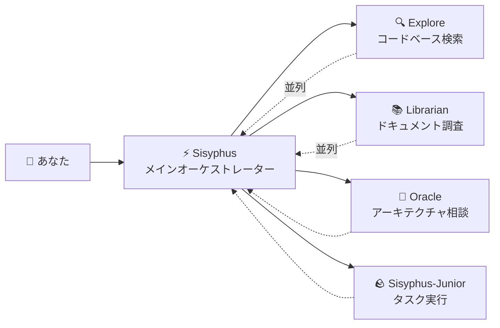

# メインオーケストレーター：シニアエンジニアのように思考・実行する

## 学ぶこと

- Sisyphusが実際の開発チームのように作業を調整する仕組みを理解する
- タスク委任のベストプラクティスをマスターし、異なる専門エージェントが複雑なタスクを協力して完了できるようにする
- 並列バックグラウンドタスクを通じて開発効率を大幅に向上させる方法を学ぶ
- エージェントにタスクを自分で処理させるべきか、専門家に委任すべきかを判断する

## 現在抱えている課題

以下の問題に遭遇したことがあるかもしれません：

- AIエージェントが「途中で諦めて」しまい、コードを書いている最中に目標を忘れる
- 同じファイルが繰り返し変更され、そのたびにコンテキストを再読み込みする必要がある
- AIに多くのタスクを処理させたいが、1つずつしかキューに入れられない
- エージェントがコードを書くが、それが正しいか、他の機能を壊していないかを自分で検証しなければならない

**根本原因**：「何でも屋」にすべての作業をさせようとしていますが、専門家だけが専門的なタスクを真に理解できます。

## 使用すべき状況

Sisyphusはメインオーケストレーターであり、以下のシナリオに適しています：

| シナリオ | 適切性 | 代替案 |
|--- | --- | ---|
| 複雑な機能開発（3ステップ以上） | ✅ 強く推奨 | Prometheus + Atlas（詳細な計画が必要） |
| 既知のバグの迅速な修正 | ✅ 適適 | Sisyphusに直接処理させる |
| 複数のリポジトリ/ドキュメントの調査が必要 | ✅ 強く推奨 | Sisyphusの並列委任を使用 |
| 単純な単一ファイルの変更 | ✅ 受容可能 | 直接編集（よりシンプル） |
| 詳細なプロジェクト計画が必要 | ⚠️ 推奨しない | まずPrometheusを使用して計画を生成 |

## コアコンセプト

**Sisyphus**は、実際の開発チームのように複数のAI専門家を調整するメインオーケストレーターエージェントです。責任の分離と並列委任のメカニズムを通じて、専門的なサブエージェントがそれぞれの強みを活かし、効率的なコラボレーションを実現します。

Sisyphusは「より賢いAI」ではなく、**オーケストレーションシステム**です。

### 責任の分離



**Sisyphusはコードを書きません**。その責任は以下の通りです：

1. **あなたの真のニーズを理解する**（表面的なリクエストだけではない）
2. **誰がそのタスクに最適かを判断する**（すべてを自分でやろうとしない）
3. **タスクを並列で委任する**（複数の専門家が同時に作業できるようにする）
4. **結果を検証する**（「完了しました」を盲目的に信じない）

### なぜSisyphusという名前？

ギリシャ神話で、シシフォスは山に巨石を永遠に押し上げる罰を受けました。

このシステムの設計哲学：**エージェントはすべてのTODOを完了する（巨石を押し上げきる）まで停止できません**。

::: info
これは罰ではなく、品質保証メカニズムです。AIが途中で諦めて散らかったままにしてほしくないでしょう。
:::

### 32k思考バジェット

Sisyphusは**Claude Opus 4.5 + 32k思考バジェット**を使用します。

何が得られるのでしょうか？

| 低バジェット（思考なし） | 32k思考バジェット |
|--- | ---|
| コードを書き始める | まず要件を深く分析し、複雑さを評価し、タスクを分解する |
| エッジケースを見落としやすい | 潜在的な問題とリスクを積極的に特定する |
| 途中で間違っていることに気づく | 最初から最適なアプローチを選択する |

::: tip
Sisyphusには**Opus 4.5**モデルを強く推奨します。他のモデルでは体験が大幅に悪化します。
:::

## 実践してみる

### ステップ1：テストプロジェクトを作成

**理由**
Sisyphusの動作を観察するには、実行可能なプロジェクトが必要です。

```bash
mkdir my-app && cd my-app
npm create next-app@latest . -- --typescript --tailwind --eslint --no-src-dir
npm install
```

**期待される結果**：プロジェクトの初期化が完了し、`npm run dev`で起動できます。

### ステップ2：Sisyphusに複雑なタスクを与える

OpenCodeでプロジェクトを開き、以下を入力します：

```
ユーザーログイン機能を追加してください。以下を含みます：
- メール/パスワードログイン
- JWTトークン保存
- 保護されたルート
- ログイン状態チェック
```

Sisyphusの応答を観察します。

**期待される結果**：

1. Sisyphusはすぐにコードを書き始めない
2. まずTODOリストを作成する（詳細なタスク分解）
3. コードベースのパターンを評価する（設定、ファイル構造を確認）
4. いくつかの明確化の質問をするかもしれない

**チェックポイント ✅**：OpenCodeのTODOパネルを確認すると、以下のようなものが表示されるはずです：

```
□ 必要な依存関係をインストール（bcrypt, jsonwebtoken）
□ ユーザーモデルと型定義を作成
□ ログインAPIエンドポイントを実装
□ JWT署名と検証ユーティリティを作成
□ 保護されたルートミドルウェアを追加
□ フロントエンドログインフォームを実装
□ ログイン状態管理を追加
```

### ステップ3：並列委任を観察（重要な瞬間）

実装中、Sisyphusは以下のようになるかもしれません：

```
[バックグラウンドタスク開始]
- タスクID: bg_abc123
- エージェント: explore
- プロンプト: "このコードベースの既存の認証パターンを見つけて..."

[バックグラウンドタスク開始]
- タスクID: bg_def456
- エージェント: librarian
- プロンプト: "Next.jsのJWTベストプラクティスを調査して..."
```

**これが重要**：Sisyphusはこれらのタスクが完了するのを**待たず**、作業を続けます。

結果が必要になると、`background_output(task_id="...")`を呼び出して取得します。

**なぜこれが速いのか？**

| シリアルアプローチ（従来） | 並列アプローチ（Sisyphus） |
|--- | ---|
| コードベース検索（2分） | ⏳ コードベース検索（2分） |
| 待機中... | ⏳ ドキュメント調査（2分、並列） |
| ドキュメント調査（2分） | 実装開始（合計2分） |
| 実装開始（2分） |  |
| **合計: 6分** | **合計: 4分（33%節約）** |

### ステップ4：検証メカニズム

Sisyphusが「タスク完了」と主張すると、以下を行います：

1. `lsp_diagnostics`を実行してエラーを確認
2. `npm run build`を実行してビルドが成功することを確認
3. テストが存在すればテストスイートを実行
4. TODOを`completed`とマーク

**チェックポイント ✅**：ターミナル出力を確認すると、以下のようなものが表示されるはずです：

```
✓ 変更されたファイルで診断を実行中...
✓ エラーは見つかりませんでした
✓ ビルド成功（終了コード 0）
✓ すべてのテストに合格
```

いずれかの検証に失敗すると、Sisyphusはすぐに修正します—決して散らかったままにしません。

### ステップ5：よくある落とし穴

#### ❌ 間違ったやり方：SisyphusのTODO追跡を中断する

Sisyphusがタスクに取り組んでいるのを見て、イライラして：

```
急いでコードを書いて！計画はやめて！
```

**問題**：SisyphusはTODOをスキップしてコードを直接書き始め、エッジケースを見落とす可能性があります。

**正しいやり方**：

```
Sisyphusが計画を完了するのを待ちます。計画が間違っていると思う場合は、具体的な改善案を提示します：
「TODOのステップ3は、まずデータベース移行計画を考慮すべきです。」
```

#### ❌ 間違ったやり方：Sisyphusに委任させない

設定ですべての専門エージェントを無効にし、Sisyphusだけを残します。

**問題**：Sisyphusはすべてを自分でやろうとしますが、専門的ではない可能性があります。

**正しいやり方**：

デフォルト設定を維持し、Sisyphusに専門家に自動的に委任させます：

| タスク | Sisyphus自身 | 専門家に委任 |
|--- | --- | ---|
| 単純な単一ファイルの変更 | ✅ OK | 不要 |
| コードベース検索 | ⚠️ 遅い | ✅ Explore（より速い） |
| ドキュメント調査 | ⚠️ 不正確かもしれない | ✅ Librarian（より専門的） |
| アーキテクチャ決定 | ❌ 推奨しない | ✅ Oracle（より権威がある） |

## レッスンまとめ

Sisyphusの力は「より賢いこと」から来るのではなく、以下から来ます：

1. **責任の分離**：メインオーケストレーター + 専門チーム、単独で作業しない
2. **深い思考**：32k思考バジェットにより詳細を見落とさない
3. **並列実行**：バックグラウンドタスクにより複数の専門家が同時に作業できる
4. **強制的な検証**：証拠なし = タスク未完了
5. **TODO追跡**：途中で諦めることは許されない

**コア原則**：

::: tip
**デフォルトで委任**：タスクが極めて単純（単一ファイル、既知の場所）でない限り、専門家への委任またはCategory+Skillの使用を優先します。
:::

## 次のレッスンのプレビュー

> 次のレッスンでは、**[Ultrawork Mode](../ultrawork-mode/)**を学び、ワンクリックですべての機能を有効にし、Sisyphusが全力で複雑なタスクを完了できるようにします。
>
> 学ぶこと：
> - `ultrawork`キーワードを使用してタスクを迅速に開始する方法
> - Ultraworkモードが有効にする追加機能
> - Ultraworkを使用すべきか、Prometheusを使用すべきかの判断

---

## 付録：ソースコード参照

<details>
<summary><strong>クリックしてソースコードの場所を展開</strong></summary>

> 最終更新日: 2026-01-26

| 機能 | ファイルパス | 行 |
|--- | --- | ---|
| Sisyphusエージェントファクトリー | [`src/agents/sisyphus.ts`](https://github.com/code-yeongyu/oh-my-opencode/blob/main/src/agents/sisyphus.ts) | 419-450 |
| Sisyphusコアプロンプト | [`src/agents/sisyphus.ts`](https://github.com/code-yeongyu/oh-my-opencode/blob/main/src/agents/sisyphus.ts) | 17-416 |
| エージェントメタデータとモデル設定 | [`src/agents/AGENTS.md`](https://github.com/code-yeongyu/oh-my-opencode/blob/main/src/agents/AGENTS.md) | 24-36 |
| ツール権限制限 | [`src/agents/AGENTS.md`](https://github.com/code-yeongyu/oh-my-opencode/blob/main/src/agents/AGENTS.md) | 44-51 |

**主要設定**:
- **思考バジェット**: 32kトークン（Anthropicモデルのみ）
- **温度**: 0.1（コードエージェントは固定低温度）
- **最大トークン**: 64000
- **推奨モデル**: anthropic/claude-opus-4-5

**コアワークフロー**（ソースコードから）:
- **フェーズ0**: インテントゲート（意図分類、53-103行）
- **フェーズ1**: コードベース評価（107-130行）
- **フェーズ2A**: 探索と調査（132-172行）
- **フェーズ2B**: 実装（176-263行）
- **フェーズ2C**: 失敗回復（266-283行）
- **フェーズ3**: 完了（286-302行）

**主要制約**:
- **自明でないタスクはTODOを作成する必要がある**（311行）
- **バックグラウンドタスクは並列でなければならない**（144-162行）
- **結果を検証する必要がある**（254-262行）

</details>
