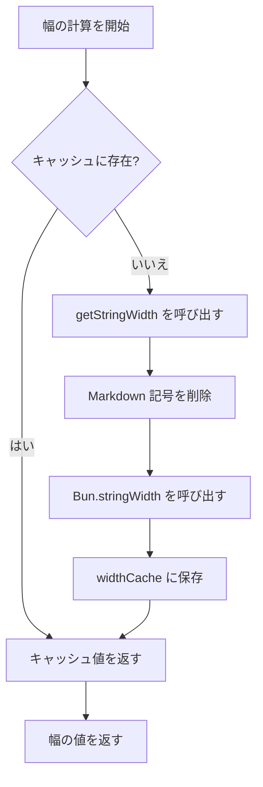

# 技術詳細：キャッシュメカニズムとパフォーマンス最適化

## 学習後の成果

- プラグインのキャッシュメカニズムがパフォーマンスを向上させる仕組みを理解する
- widthCache のデータ構造と使用方法を習得する
- キャッシュの自動クリーンアップがトリガーされる条件を理解する
- パフォーマンス最適化の効果を分析する方法を知る

## 現在の課題

あなたは次のような疑問を持っているかもしれません：

> プラグインはどのようにテーブル幅を高速計算しているのか？大きなテーブルを処理してもスムーズなのはなぜか？キャッシュメカニズムはどのように設計されているのか？

このレッスンでは、プラグインの内部実装を深く分析し、キャッシュメカニズムの設計思想とパフォーマンス最適化戦略を理解します。

## コアコンセプト

### なぜキャッシュを使うのか？

Markdown テーブルをフォーマットする際、プラグインは各セルの**表示幅**（display width）を計算する必要があります。この計算には以下が含まれます：

1. **Markdown 記号の削除**：`**太字**`、`*斜体*`、`~~取り消し線~~` など
2. **インラインコードの保護**：`` `コード` `` 内の Markdown 記号はそのまま保持
3. **`Bun.stringWidth()` の呼び出し**：Unicode 文字の表示幅を計算（絵文字、中国語文字を含む）

**問題点**：同じセルの内容が複数回出現する可能性があります（例：テーブルヘッダーの列名）。そのたびにこれらのロジックを再計算すると遅くなります。

**解決策**：キャッシュ（Map）を使用して「テキスト内容 → 表示幅」のマッピングを保存し、重複計算を回避します。

## キャッシュデータ構造

プラグインは 2 つのグローバル変数を使用してキャッシュを管理します：

### widthCache

```typescript
const widthCache = new Map<string, number>()
```

**用途**：文字列の表示幅計算結果をキャッシュ

**構造**：
- **Key**：セルの元のテキスト内容（すべての Markdown 構文を含む）
- **Value**：計算後の表示幅（文字数）

**例**：

| 元のテキスト（Key） | 表示幅（Value） | 説明 |
|--- | --- | ---|
| `**姓名**` | 4 | `**` を削除後の幅が 4 |
| `*年龄*` | 4 | `*` を削除後の幅が 4 |
| `` `status` `` | 8 | コードブロック記号も幅に含まれる |
| `张三` | 4 | 中国語文字の幅は 1 |

### cacheOperationCount

```typescript
let cacheOperationCount = 0
```

**用途**：キャッシュ操作の回数を記録し、自動クリーンアップをトリガーするために使用

**クリーンアップのしきい値**：
- 操作数 > 100 回、または
- キャッシュエントリ > 1000 個

## キャッシュ検索フロー

### calculateDisplayWidth 関数

セル幅を計算する必要がある場合、プラグインは `calculateDisplayWidth()` 関数を呼び出し、以下のフローを実行します：

<details>
<summary><strong>📖 完全なコードを表示</strong></summary>

```typescript
function calculateDisplayWidth(text: string): number {
  if (widthCache.has(text)) {
    return widthCache.get(text)!  // キャッシュヒット、直接返す
  }

  const width = getStringWidth(text)  // 実際の幅を計算
  widthCache.set(text, width)          // キャッシュに保存
  return width
}
```

</details>

**フローチャート**：



**ステップの詳細**：

| ステップ | 操作 | 時間計算量 |
|--- | --- | ---|
| 1 | `widthCache.has(text)` をチェック | O(1) |
| 2 | キャッシュヒット → 直接返す | O(1) |
| 3 | キャッシュミス → 幅を計算 | O(n) |
| 4 | キャッシュに保存 | O(1) |

**重要なポイント**：
- **キャッシュヒット時**：計算なしで直接返す（O(1)）
- **キャッシュミス時**：完全な幅計算ロジックを実行（O(n)）
- **元のテキストを保存**：Key は完全な Markdown テキストであり、正確なマッチングを保証

## キャッシュクリーンアップメカニズム

### なぜキャッシュをクリーンアップするのか？

キャッシュはパフォーマンスを向上させますが、メモリを占有します。クリーンアップしない場合：
- **メモリ使用量が継続的に増加**：新しいセルの内容が毎回キャッシュされる
- **不要なデータが含まれる可能性**：古いテーブルの内容はもう必要ないかもしれない

### 自動クリーンアップのトリガー条件

プラグインはフォーマット完了ごとに `incrementOperationCount()` を呼び出して操作カウントを更新します：

<details>
<summary><strong>📖 クリーンアップコードを表示</strong></summary>

```typescript
function incrementOperationCount() {
  cacheOperationCount++

  if (cacheOperationCount > 100 || widthCache.size > 1000) {
    cleanupCache()
  }
}

function cleanupCache() {
  widthCache.clear()
  cacheOperationCount = 0
}
```

</details>

**トリガー条件**（いずれかを満たすとトリガー）：

| 条件 | しきい値 | 説明 |
|--- | --- | ---|
| 操作回数 | > 100 回のフォーマット操作 | 頻繁なクリーンアップを回避 |
| キャッシュエントリ | > 1000 個のセル | メモリ使用量の増大を防止 |

**クリーンアップ戦略**：
- **完全なクリア**：`widthCache.clear()` ですべてのキャッシュを削除
- **カウントのリセット**：`cacheOperationCount = 0`

::: info クリーンアップのタイミング

キャッシュクリーンアップは**フォーマット完了ごと**に発生し、フォーマット中ではありません。これにより、進行中のフォーマット操作が中断されることはありません。

:::

## パフォーマンス最適化の効果

### キャッシュヒット率の分析

5 列 × 10 行のテーブルを想定します。そのうち：

- **重複する内容**：テーブルヘッダーの列名が区切り行とデータ行で 11 回繰り返し出現
- **一意の内容**：各セルの内容はすべて異なる

**キャッシュの効果**：

| シナリオ | キャッシュなし | キャッシュあり | パフォーマンス向上 |
|--- | --- | --- | ---|
| 5 列 × 10 行（重複なし） | 50 回の計算 | 50 回の計算 | なし |
| 5 列 × 10 行（ヘッダー重複） | 50 回の計算 | 10 回の計算 + 40 回のキャッシュヒット | ~80% |

### 実際の影響

**キャッシュによるメリット**：

1. **計算オーバーヘッドの削減**：Markdown 記号の重複削除と `Bun.stringWidth()` の呼び出しを回避
2. **CPU 使用率の低下**：`getStringWidth()` は正規表現の置換と Unicode 計算を含むため、オーバーヘッドが大きい
3. **応答速度の向上**：多くの重複セルを含むテーブルでは、効果がより顕著

**シナリオの例**：

| シナリオ | キャッシュの効果 |
|--- | ---|
| AI 生成の比較テーブル | ✅ 効果が顕著（複数列の重複内容） |
| シンプルな単一行テーブル | ⚪ 効果は普通（内容は一意） |
| テーブル内の Markdown ネスト | ✅ 効果が顕著（記号削除のオーバーヘッドが大きい） |

## パフォーマンス最適化の提案

::: tip 開発者への提案

さらにパフォーマンスを最適化する必要がある場合は、以下を検討できます：

1. **キャッシュしきい値の調整**：実際のテーブルサイズに基づいて `100` 回と `1000` エントリのしきい値を調整
2. **LRU キャッシュ**：最近最少使用（LRU）アルゴリズムを使用して完全なクリア戦略を置き換え
3. **パフォーマンス監視**：ログを追加してキャッシュヒット率を統計し、実際の効果を分析

:::

## このレッスンのまとめ

プラグインは `widthCache` キャッシュメカニズムを使用してパフォーマンスを最適化します：

- **保存構造**：`Map<string, number>` で元のテキストから表示幅へのマッピング
- **検索フロー**：まずキャッシュを確認 → ミスの場合は計算して保存
- **クリーンアップメカニズム**：操作数 > 100 またはエントリ > 1000 の場合に自動クリーンアップ
- **パフォーマンス向上**：重複計算を削減し、CPU 使用率を低下

このメカニズムにより、プラグインは複雑なテーブルを処理してもスムーズさを維持でき、パフォーマンス最適化の中核実装となっています。

## 次のレッスンの予告

> 次のレッスンでは **[更新ログ：バージョン履歴と変更記録](../../changelog/release-notes/)** を学びます。
>
> 学習内容：
> - プラグインのバージョン進化の歴史
> - 新機能と修正の記録
> - プラグインの更新を追跡する方法

---

## 付録：ソースコード参照

<details>
<summary><strong>クリックしてソースコードの場所を表示</strong></summary>

> 更新日時：2026-01-26

| 機能 | ファイルパス | 行番号 |
|--- | --- | ---|
| widthCache 定義 | [`source/franlol/opencode-md-table-formatter/index.ts`](https://github.com/franlol/opencode-md-table-formatter/blob/main/index.ts#L6) | 6 |
| cacheOperationCount 定義 | [`source/franlol/opencode-md-table-formatter/index.ts`](https://github.com/franlol/opencode-md-table-formatter/blob/main/index.ts#L7) | 7 |
| calculateDisplayWidth 関数 | [`source/franlol/opencode-md-table-formatter/index.ts`](https://github.com/franlol/opencode-md-table-formatter/blob/main/index.ts#L151-L159) | 151-159 |
| incrementOperationCount 関数 | [`source/franlol/opencode-md-table-formatter/index.ts`](https://github.com/franlol/opencode-md-table-formatter/blob/main/index.ts#L219-L225) | 219-225 |
| cleanupCache 関数 | [`source/franlol/opencode-md-table-formatter/index.ts`](https://github.com/franlol/opencode-md-table-formatter/blob/main/index.ts#L227-L230) | 227-230 |

**重要な定数**：
- `widthCache = new Map<string, number>()`：文字列表示幅をキャッシュする Map 構造
- `cacheOperationCount = 0`：キャッシュ操作カウンタ

**重要な関数**：
- `calculateDisplayWidth(text: string): number`：表示幅を計算（キャッシュ付き）、まずキャッシュを確認してから計算
- `incrementOperationCount(): void`：操作カウントを増加し、条件付きでクリーンアップをトリガー
- `cleanupCache(): void`：widthCache をクリアし、カウンタをリセット

</details>
