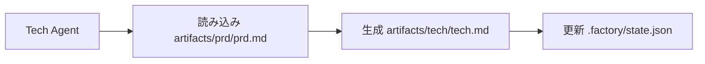

# コテキスト最適化：マルチセッション実行

## 学んだらできること

- `factory continue` コマンドを使用して新しいセッションでパイプラインを継続する
- 各ステージがクリーンなコンテキストを独占する利点を理解する
- Token 消費を大幅に削減する方法を習得する
- 中断からの復元をサポートし、いつでも一時停止・再開できる

## 今の悩み

AI アシスタント（Claude Code など）で完全な 7 ステージパイプラインを実行する際、以下の問題に直面するかもしれません：

- **Token がどんどん増える**：対話が蓄積するとコンテキストが長くなり、各ステージで以前のすべてのステージの内容を読み込む必要がある
- **コストがどんどん高くなる**：長い対話はより多くの入力 Token を意味し、費用が直線的に増加する
- **応答が遅くなる**：コンテキストが長すぎると応答時間が増加する可能性がある
- **復元が難しい**：あるステージが失敗した場合、再開するには大量のコンテキストを再読み込みする必要がある

::: tip 核心問題
長い対話のコンテキスト蓄積は AI アシスタントの固有特性ですが、「マルチセッション実行」でこの問題を回避できます。
:::

## いつ使うか

| シナリオ                    | マルチセッションを使用 | 理由                           |
| --------------------------- | ---------------------- | ------------------------------ |
| 完全な 7 ステージパイプラインの実行 | ✅ 強く推奨     | すべての Token が貴重           |
| 1-2 ステージのみの実行       | ⚠️ オプション        | コンテキストが短いため、必須ではない  |
| 特定のステージのデバッグ     | ⚠️ オプション        | 頻繁な再試行によりセッション切り替えコストが増加する可能性がある |
| 長時間中断後の復元           | ✅ 必須     | 古いコンテキストの読み込みを回避する    |

## 核心アイデア

Agent App Factory は**マルチセッション実行**をサポートしています。その核心的なアイデアは：

**各ステージ完了後、新しいセッションで次のステージを実行する。**

これらのメリット：

1. **クリーンなコンテキスト**：各ステージは必要な入力ファイルのみ読み込み、対話履歴に依存しない
2. **Token 節約**：以前のすべてのステージの内容を AI に繰り返し渡すことを回避する
3. **復元可能**：いつでも中断でき、後に新しいセッションで継続しても進捗が失われない
4. **クロスプラットフォーム互換**：すべての AI アシスタント（Claude Code、OpenCode、Cursor など）に適用

### コンテキスト分離戦略

マルチセッション実行を実現するために、Agent App Factory は**コンテキスト分離戦略**を採用しています：

::: info コンテキスト分離とは？
コンテキスト分離とは、各 Agent がファイル入力のみに依存し、対話履歴に依存しないことです。以前に何が起きたかに関係なく、Agent は指定された入力ファイルからのみ情報を読み取ります。
:::

各 Agent 実行時：

- ✅ **のみ読み込み** `pipeline.yaml` で定義された `inputs` ファイル
- ❌ **使用しない** 対話履歴の「記憶」
- ❌ **想定しない** 以前のステージで何が起きたか

例えば、Tech Agent 実行時：



Tech Agent は `artifacts/prd/prd.md` のみ気にし、「ユーザーが以前にどのようなアプリを作りたいと言ったか」を考えることはありません。すべての情報は入力ファイルから来ます。

### 状態復元メカニズム

`factory continue` を実行すると、システムは：

1. `.factory/state.json` を読み取り現在の進捗を取得する
2. `.factory/pipeline.yaml` を読み取り次のステージを決定する
3. **そのステージに必要な入力ファイルのみ読み込む**
4. 新しい AI アシスタントウィンドウを起動して継続する

状態ファイル（`.factory/state.json`）はシステム全体の「記憶センター」です：

```json
{
  "version": 1,
  "status": "waiting_for_confirmation",
  "current_stage": "tech",
  "completed_stages": ["bootstrap", "prd"],
  "last_updated": "2026-01-29T12:00:00Z"
}
```

各ステージ完了後、状態はこのファイルに更新されます。新しいセッション起動時、このファイルを読み取るだけで現在の位置を知ることができます。

## 🎒 始める前の準備

::: warning 前提条件チェック
このチュートリアルを始める前に、以下を確認してください：

- [ ] [クイックスタート](../../start/getting-started/) を完了し、Factory プロジェクトを初期化した
- [ ] [7 ステージパイプライン概要](../../start/pipeline-overview/) を理解した
- [ ] Claude Code（または他の AI アシスタント）をインストールした

まだ完了していない場合は、先にこれらの前提コースを完了してください。
:::

## 実践してみよう

実際のシナリオを通じて `factory continue` コマンドの使い方を学びましょう。

### シナリオ設定

7 ステージパイプラインを実行しており、現在 `bootstrap` と `prd` ステージが完了し、`ui` ステージで確認を待っている状態とします。

### ステップ 1：チェックポイントで「新しいセッションで継続」を選択

あるステージが完了すると、Sisyphus スケジューラがオプションテーブルを表示します：

```
✓ ui 完了！

生成された成果物：
- artifacts/ui/ui.schema.yaml
- artifacts/ui/preview.web/index.html
- artifacts/ui/preview.web/styles.css
- artifacts/ui/preview.web/app.js

┌─────────────────────────────────────────────────────────────┐
│  📋 次の操作を選択してください                                         │
│  オプション番号（1-5）を入力し、Enter キーで確認                        │
└─────────────────────────────────────────────────────────────┘

┌──────┬──────────────────────────────────────────────────────┐
│ オプション │ 説明                                                  │
├──────┼──────────────────────────────────────────────────────┤
│  1   │ 次のステージに継続（同一セッション）                               │
│      │ tech ステージを継続実行します                                 │
├──────┼──────────────────────────────────────────────────────┤
│  2   │ 新しいセッションで継続 ⭐ 推奨オプション、Token 節約                   │
│      │ 新しいコマンドラインウィンドウで実行：factory continue               │
│      │ （新しい Claude Code ウィンドウを自動起動し、パイプラインを継続）        │
├──────┼──────────────────────────────────────────────────────┤
│  3   │ このステージを再実行                                             │
│      │ ui ステージを再実行します                                       │
├──────┼──────────────────────────────────────────────────────┤
│  4   │ 成果物を変更後に再実行                                     │
│      │ artifacts/prd/prd.md を変更後に再実行                   │
├──────┼──────────────────────────────────────────────────────┤
│  5   │ パイプラインを一時停止                                             │
│      │ 現在の進捗を保存し、後で継続します                                 │
└──────┴──────────────────────────────────────────────────────┘

💡 ヒント：1-5 の数字を入力し、Enter キーで選択を確認してください
```

**表示されるべき内容**：
- オプション 2 が「⭐ 推奨オプション、Token 節約」とマークされている

現在のセッションでは、オプション 5（パイプラインを一時停止）を選択し、新しいコマンドラインウィンドウで `factory continue` を実行できます。

**理由**
- オプション 1 は「次のステージに継続（同一セッション）」で、現在のセッションで継続し、コンテキストが蓄積する
- オプション 2 は「新しいセッションで継続」で、新しいクリーンなコンテキストで次のステージを実行し、**Token を節約**する
- オプション 5 は「パイプラインを一時停止」で、現在の進捗を保存し、後に `factory continue` で復元できる

### ステップ 2：新しいコマンドラインウィンドウで `factory continue` を実行

新しいターミナルウィンドウ（またはタブ）を開き、プロジェクトディレクトリに移動して、以下を実行します：

```bash
factory continue
```

**表示されるべき内容**：

```
Agent Factory - Continue in New Session

Pipeline Status:
───────────────────────────────────────
Project: my-awesome-app
Status: Waiting
Current Stage: tech
Completed: bootstrap, prd

Starting new Claude Code session...
✓ 新しい Claude Code ウィンドウが起動しました
  (ウィンドウが開くまでお待ちください)
```

**何が起きましたか**：

1. `factory continue` コマンドが `.factory/state.json` を読み取り、現在の状態を知る
2. 現在のプロジェクトの状態情報を表示する
3. 新しい Claude Code ウィンドウを自動起動し、「パイプラインを継続してください」という指示を渡す
4. 新しいウィンドウで `tech` ステージから自動的に継続実行する

### ステップ 3：新しいウィンドウで継続実行

新しい Claude Code ウィンドウが起動すると、新しい対話が表示されますが、状態は以前保存されたチェックポイントから復元されます。

新しいセッションで、Agent は：

1. `.factory/state.json` を読み取り現在のステージを取得する
2. `.factory/pipeline.yaml` を読み取りそのステージの入力と出力を決定する
3. **そのステージに必要な入力ファイルのみ読み込む**（例：`artifacts/prd/prd.md`）
4. そのステージのタスクを実行する

**重要なポイント**：
- 新しいセッションには以前のステージの対話履歴がない
- Agent は入力ファイルからのみ情報を読み取り、「記憶」に依存しない
- これが**コンテキスト分離**の体現

### ステップ 4：コンテキスト分離を検証

コンテキスト分離が有効であることを検証するために、新しいセッションで Agent に尋ねてみてください：

「bootstrap ステージで何が行われたか知っていますか？」

コンテキスト分離が有効であれば、Agent は以下のように言うでしょう：

「以前の作業を理解するために、まず関連ファイルを確認する必要があります。読み取ります...」

その後、対話履歴から「思い出す」のではなく、`input/idea.md` または他のファイルを読み取って情報を取得しようとします。

**チェックポイント ✅**
- 新しいセッションが正常に起動した
- 正しいプロジェクト状態が表示された
- Agent は入力ファイルのみに依存し、対話履歴に依存しない

### ステップ 5：残りのステージを継続実行

各ステージ完了後、以下を選択できます：

- 現在のセッションで継続（オプション 1）- 短いフローに適用
- **新しいセッションで継続（オプション 2）** - **推奨、Token 節約**
- パイプラインを一時停止（オプション 5）- 後で `factory continue` を実行

完全な 7 ステージパイプラインでは、各ステージで「新しいセッションで継続」を使用することをお勧めします。これにより：

```
bootstrap (セッション 1) → prd (セッション 2) → ui (セッション 3) → tech (セッション 4)
→ code (セッション 5) → validation (セッション 6) → preview (セッション 7)
```

各セッションはクリーンであり、以前のすべてのステージの内容を読み込む必要がありません。

## トラブルシューティング

### ヒント 1：`factory continue` を実行し忘れる

**誤った方法**：
- 古いセッションで直接次のステージを開始する
- または、`factory continue` を実行せずに新しいウィンドウで直接 Claude Code を開く

**正しい方法**：
- 常に `factory continue` コマンドを使用して新しいセッションを起動する
- このコマンドは自動的に状態を読み取り、正しい指示を渡す

### ヒント 2：新しいセッションで履歴ファイルを繰り返し読み込む

**誤った方法**：
- 新しいセッションで AI に以前のステージの成果物を手動で読み込むよう要求する
- AI が以前に何が起きたかを「知っているべき」と考える

**正しい方法**：
- コンテキスト分離メカニズムを信頼し、Agent は自動的に入力ファイルから情報を読み取る
- そのステージに必要な入力ファイルのみを提供する

### ヒント 3：プロジェクト間で `factory continue` を使用

**誤った方法**：
- プロジェクト A で `factory continue` を実行しようとするが、現在のディレクトリはプロジェクト B

**正しい方法**：
- `factory continue` は現在のディレクトリが Factory プロジェクトかどうかをチェックする
- そうでない場合、`factory init` を先に実行する必要があると通知する

### ヒント 4：成果物を変更後に `factory continue` を使用しない

**シナリオ**：
- あるステージが完了した後、成果物（PRD など）を手動で変更した
- 次のステージを継続実行したい

**正しい方法**：
- `factory run` を実行する（指定されたステージから再開）
- または `factory continue` を実行する（現在のチェックポイントから継続）
- コンテキストが不整合になる可能性があるため、古いセッションで直接継続しないでください

## まとめ

このレッスンでは、`factory continue` コマンドを使用したマルチセッション実行を学びました：

### 核心ポイント

1. **マルチセッション実行**：各ステージ完了後、新しいセッションで次のステージを実行する
2. **コンテキスト分離**：Agent は入力ファイルのみに依存し、対話履歴に依存しない
3. **状態復元**：`.factory/state.json` が現在の進捗を記録し、新しいセッションで復元できる
4. **Token 節約**：長いコンテキストの読み込みを回避し、コストを大幅に削減する

### コマンドクイックリファレンス

| コマンド             | 役割                         | 使用シナリオ           |
| ------------------- | ---------------------------- | ------------------ |
| `factory continue` | 新しいセッションでパイプラインを継続実行       | 各ステージ完了後     |
| `factory run`      | 現在のセッションでパイプラインを実行       | 初回実行またはデバッグ     |
| `factory status`   | 現在のプロジェクト状態を確認             | 進捗を理解           |

### ベストプラクティス

- ✅ 完全な 7 ステージパイプラインを実行する際、各ステージで `factory continue` を使用する
- ✅ チェックポイントで「新しいセッションで継続」（オプション 2）を選択する
- ✅ コンテキスト分離メカニズムを信頼し、履歴ファイルを手動で読み込まない
- ✅ `factory status` を使用してプロジェクトの進捗を確認する

## 次回の予告

> 次回は **[権限とセキュリティメカニズム](../security-permissions/)** を学びます。
>
> 学べること：
> > - 権限境界行列が Agent の権限超過をどのように防ぐか
> > - 権限超過処理メカニズムと信頼できない成果物の分離
> > - セキュリティチェックポイントと権限検証プロセス
> > - Claude Code の権限ファイルの設定方法

このレッスンで、Agent App Factory のセキュリティメカニズムを理解し、各 Agent が権限付きディレクトリでのみファイルを読み書きすることを確保できます。

---

## 付録：ソースコード参照

<details>
<summary><strong>クリックしてソースコードの場所を表示</strong></summary>

> 更新日時：2026-01-29

| 機能                 | ファイルパス                                                                                                       | 行番号    |
| -------------------- | -------------------------------------------------------------------------------------------------------------- | ------- |
| factory continue コマンド | [`cli/commands/continue.js`](https://github.com/hyz1992/agent-app-factory/blob/main/cli/commands/continue.js) | 1-144   |
| スケジューラコンテキスト最適化    | [`agents/orchestrator.checkpoint.md`](https://github.com/hyz1992/agent-app-factory/blob/main/agents/orchestrator.checkpoint.md) | 113-154  |
| コンテキスト分離戦略      | [`policies/context-isolation.md`](https://github.com/hyz1992/agent-app-factory/blob/main/policies/context-isolation.md) | 1-64    |

**主要な関数**：
- `launchClaudeCode(projectDir, nextStage, completedStages)`：新しい Claude Code ウィンドウを起動する
- `commandExists(cmd)`：コマンドが利用可能かどうかを確認する
- `module.exports(projectDir)`：`factory continue` コマンドのメイン関数

**主要な定数**：
- `state.json`：状態ファイルパス（`.factory/state.json`）
- `pipeline.yaml`：パイプライン定義ファイルパス（`.factory/pipeline.yaml`）
- `config.yaml`：プロジェクト設定ファイルパス（`.factory/config.yaml`）

**主要なビジネスルール**：
- BR-6-1：各ステージがクリーンなコンテキストを独占する
- BR-6-2：`factory continue` コマンドを使用して継続する
- BR-6-3：現在のステージに必要なファイルのみ読み込む

</details>
