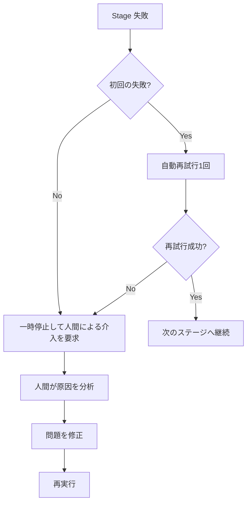
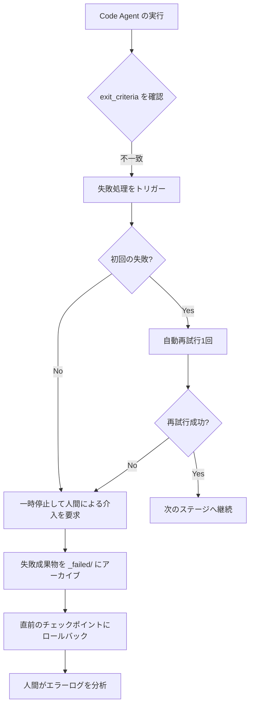
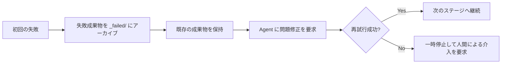
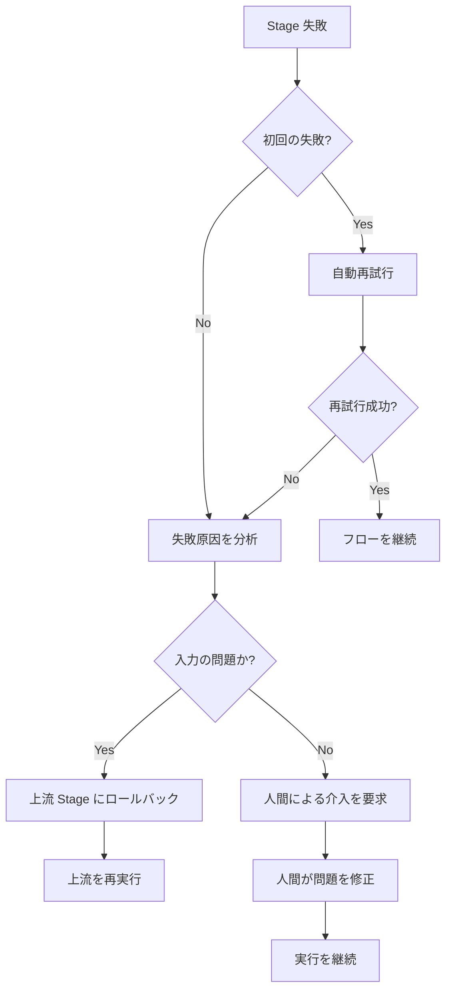

# 失敗処理とロールバック：インテリジェントな耐障害性とエラー回復

## 学習後の成果

- **失敗の種類を特定**：出力の欠落、内容不一致、権限外書き込みなどの失敗原因を迅速に判断
- **再試行メカニズムを理解**：自動再試行1回の戦略と失敗アーカイブのルールを習得
- **ロールバック操作の実行**：直近の成功したチェックポイントへのロールバック方法と安定状態の復元を学習
- **人間による介入処理**：人間の介入が必要なタイミングと、失敗原因の分析・修正方法を把握
- **エラーログの解釈**：`pipeline/error.log` のエラーレポートを理解し、問題を迅速に特定

## 現在の課題

パイプライン実行時に最も懸念されるのは：

- **失敗した場合どうするか**：特定のステージでエラーが発生した場合、再試行すべきか最初からやり直すべきか？
- **データの汚染**：失敗した成果物は後続のステージに影響するか？削除されるか？
- **ロールバック方法**：直前の成功状態に戻るにはどうするか？
- **人間による介入**：連続して失敗した場合、何をするべきか？ログの見方は？

失敗処理メカニズムはこれらの問題を解決するために設計されています—失敗の検出、自動再試行、失敗成果物のアーカイブ、チェックポイントへのロールバック、人間による介入までの完全なフローを定義します。

## この機能を使うべき場面

パイプラインで以下の状況が発生した場合：

- **ステージ失敗**：Agent の実行が失敗し、出力ファイルが欠落しているか期待通りでない
- **権限外操作**：Agent が認可されていないディレクトリに書き込み、セキュリティチェックをトリガーした
- **連続失敗**：同一ステージが2回失敗し、人間による介入と分析が必要
- **ロールバックが必要**：直前の成功状態に戻ってやり直したい
- **ログ分析**：詳細なエラーレポートとスタックトレースを確認する必要がある

## コアコンセプト

失敗処理戦略は Sisyphus スケジューラによって一元的に実行されます。これは**耐障害エンジニア**のように振る舞い、パイプラインでエラーが発生した際に自動処理するか人間による介入を要求します。

### 失敗の定義

以下の状況は Stage の失敗とみなされます：

| 失敗タイプ | 症状 | コード位置 |
|---------|------|----------|
| **出力欠落** | `pipeline.yaml` で指定された出力ファイルが存在しないか命名が一致しない | `failure.policy.md:9` |
| **exit_criteria 不一致** | 出力内容が `pipeline.yaml` の終了条件を満たしていない | `failure.policy.md:10` |
| **権限外書き込み** | Agent が未認可のディレクトリまたはファイルに書き込みを行った | `failure.policy.md:11` |
| **その他の例外** | スクリプトエラー、入力の読み込み不可などでタスク完了が不可能 | `failure.policy.md:12` |

### 再試行メカニズム



**再試行ルール**（`failure.policy.md:16-18`）：

- 各 Stage はデフォルトで **自動再試行1回**が許可される
- 再試行時、スケジューラは Agent に対し、既存の成果物を保持したまま問題を修正するよう要求（完全なやり直しではなく）
- 2回目の試行も失敗した場合、スケジューラはパイプラインを一時停止し人間による介入フローに入る

### ロールバックとアーカイブ

**失敗アーカイブ**（`failure.policy.md:22-23`）：

```bash
# 失敗成果物を _failed/ ディレクトリに移動
mv artifacts/<stage>/ artifacts/_failed/<stage-id>/attempt-1/
mv artifacts/<stage>/ artifacts/_failed/<stage-id>/attempt-2/
```

**ロールバック戦略**（`failure.policy.md:23`）：

- スケジューラは直近の成功したチェックポイントにロールバック
- その Stage から実行を再開
- 上流と下流の成果物の一貫性を確保し、データ汚染を回避

### 人間による介入

**介入のタイミング**（`failure.policy.md:27`）：

- 同一 Stage が連続して2回失敗した後
- 権限外書き込みが検出された時

**介入フロー**（`failure.policy.md:27-29`）：

1. スケジューラが実行を一時停止し失敗原因を報告
2. 人間が入力、設定、スキルに問題がないか確認
3. 人間が入力ファイルを修正、スキルを調整、またはパラメータを変更
4. 残りのフローを継続実行

::: warning スケジューラの制約
スケジューラは人間の確認なしに、失敗した Stage をスキップしたり出力を変更したりすることはできません。
:::

## 実践チュートリアル

### ステップ 1：失敗処理フローを理解する

パイプラインを実行している際に特定のステージが失敗すると、Sisyphus スケジューラは自動的に失敗処理フローを開始します。

**サンプルシナリオ**：Code ステージの失敗



### ステップ 2：エラーログを確認する

失敗時、スケジューラは詳細なエラー情報を `pipeline/error.log` に記録します。

**エラーログ形式**（`failure.policy.md:166-200`）：

```bash
cat pipeline/error.log
```

**以下の内容が表示されるはずです**：

```log
============================================
ERROR REPORT
============================================
Timestamp: 2026-01-29T10:30:00Z
Stage: code
Attempt: 2/2
Status: FAILED

Error Type: TypeScript Compilation Error
Error Message: Cannot find module '@prisma/client'

Stack Trace:
  at Object.<anonymous> (src/lib/prisma.ts:1:1)
  at Module._compile (node:internal/modules/cjs/loader:1198:14)

Exit Criteria Failed:
  - [ ] バックエンドが起動可能で重大エラーがない (FAILED)
  - [x] クライアントがレンダリング可能でアクセス可能
  - [x] 余分な認証や無関係な機能が導入されていない

Failed Artifacts Moved To:
  artifacts/_failed/code/attempt-2/

Recommended Action:
  1. package.json に @prisma/client が含まれているか確認
  2. npx prisma generate を実行してクライアントを生成
  3. Code ステージを再試行

============================================
```

**エラーログの解説**：

| フィールド | 説明 | サンプル |
|------|------|------|
| **Timestamp** | 失敗発生日時 | 2026-01-29T10:30:00Z |
| **Stage** | 失敗したステージ | code |
| **Attempt** | 再試行回数 | 2/2（2回目の失敗） |
| **Status** | 現在の状態 | FAILED |
| **Error Type** | エラータイプ | TypeScript Compilation Error |
| **Error Message** | エラー説明 | Cannot find module '@prisma/client' |
| **Stack Trace** | スタックトレース | src/lib/prisma.ts:1:1 |
| **Exit Criteria Failed** | 未通過の終了条件 | バックエンドが起動可能で重大エラーがない (FAILED) |
| **Failed Artifacts Moved To** | 失敗成果物のアーカイブ場所 | artifacts/_failed/code/attempt-2/ |
| **Recommended Action** | 推奨される修正ステップ | 1. package.json を確認... |

### ステップ 3：再試行メカニズムを理解する

初回の失敗時、Sisyphus は自動的に再試行をトリガーします。

**再試行フロー**（`failure.policy.md:16-18`）：



**重要な特性**：

- **インクリメンタル修正**：再試行時、スケジューラは Agent に対し既存の成果物に基づいて問題を修正するよう要求（完全なやり直しではない）
- **失敗アーカイブ**：失敗するたびに成果物を `artifacts/_failed/<stage-id>/attempt-N/` に移動し、比較分析を容易にする
- **最大1回**：デフォルトでは自動再試行は1回のみ許可され、無限ループを回避

### ステップ 4：失敗アーカイブを確認する

ステージが失敗すると、すべての失敗成果物が `artifacts/_failed/` ディレクトリにアーカイブされます。

**ディレクトリ構造**：

```bash
artifacts/
├── _failed/
│   ├── code/
│   │   ├── attempt-1/
│   │   │   ├── backend/
│   │   │   └── client/
│   │   └── attempt-2/
│   │       ├── backend/
│   │       └── client/
│   ├── ui/
│   │   └── attempt-1/
│   └── prd/
│       └── attempt-1/
```

**アーカイブディレクトリの命名規則**：

- `artifacts/_failed/<stage-id>/attempt-N/`
  - `<stage-id>`：失敗したステージ名（例：`code`、`ui`、`prd`）
  - `attempt-N`：試行回数（1は初回の失敗、2は2回目の失敗）

**アーカイブが必要な理由**：

- **汚染回避**：失敗した成果物が後続のステージに影響しない
- **分析容易**：異なる試行の差異を比較し、問題の根本原因を特定できる
- **証拠保持**：後続のデバッグのために失敗成果物を保持

### ステップ 5：ロールバック操作の実行

直前の状態に戻る必要がある場合、ロールバック機能を使用できます。

**ロールバックフロー**（`failure.policy.md:23`）：

```bash
# 直前のチェックポイントに手動ロールバック
factory run <stage-id>

# 例：tech ステージにロールバックして再実行
factory run tech
```

**ロールバックルール**：

- **ロールバックターゲット**：直近の成功したチェックポイントにロールバック
- **状態リセット**：現在のステージの成果物と失敗アーカイブをクリア
- **再実行**：ターゲットステージから実行を再開

**ロールバックの例**：

Code ステージが2回失敗し、Tech ステージに戻ってアーキテクチャを再設計したいと仮定します：

```bash
# 1. tech ステージにロールバック
factory run tech

# 2. AIアシスタントが Tech Agent を再実行
# 3. artifacts/tech/ と artifacts/backend/prisma/ を再生成
# 4. その後 Code ステージを継続実行
```

### ステップ 6：人間による介入処理

連続して2回失敗すると、Sisyphus はパイプラインを一時停止し人間による介入を要求します。

**介入意思決定ツリー**（`failure.policy.md:204-236`）：



**人間による介入チェックリスト**（`failure.policy.md:240-263`）：

#### 環境チェック

- [ ] Node.js バージョン >= 18
- [ ] npm バージョン >= 9
- [ ] 十分なディスク容量
- [ ] ネットワーク接続正常（npm ダウンロード）

#### 状態チェック

- [ ] `.factory/state.json` の状態が正しい
- [ ] 上流 Stage の成果物が完全
- [ ] 失敗成果物が `_failed/` にアーカイブ済み

#### 修正確認

- [ ] 失敗原因が明確
- [ ] 修正案が実装済み
- [ ] 関連設定が更新済み

#### 実行再開

- [ ] 失敗した Stage から再開
- [ ] 実行ログを監視
- [ ] 出力成果物を検証

### ステップ 7：一般的な失敗シナリオの処理

異なるステージにはそれぞれ一般的な失敗シナリオがあります。以下は解決策です。

#### 7.1 Bootstrap ステージの失敗

**一般的なエラー**（`failure.policy.md:35-48`）：

| エラータイプ | 症状 | 原因 | 解決策 |
|---------|------|------|----------|
| **出力欠落** | `input/idea.md` が存在しない | Agent が正しくファイルを書き込まなかった | 再試行、書き込みパスを確認 |
| **内容不完整** | idea.md に主要なセクションが欠けている | ユーザー入力情報が不足 | 一時停止、ユーザーによる情報補完を要求 |
| **フォーマットエラー** | テンプレート構造に一致しない | Agent がテンプレートに従わなかった | 再試行、テンプレート要件を強調 |

**処理フロー**：

```bash
# 1. input/ ディレクトリが存在するか確認
ls -la input/

# 2. 存在しない場合、ディレクトリを作成
mkdir -p input/

# 3. Bootstrap ステージを再試行
factory run bootstrap
```

#### 7.2 PRD ステージの失敗

**一般的なエラー**（`failure.policy.md:50-65`）：

| エラータイプ | 症状 | 原因 | 解決策 |
|---------|------|------|----------|
| **技術詳細の記述** | PRD に技術スタックの記述が含まれる | Agent が境界を越えた | 再試行、責務の境界を強調 |
| **機能過多** | Must Have > 7 個 | スコープクリープ | 再試行、MVP に絞るよう要求 |
| **ユーザー記述が不明確** | "全員"、"ほとんどのユーザー" | 具体的化されていない | 再試行、具体的なユーザーペルソナを要求 |
| **非目標の欠如** | Non-Goals が空 | 境界が明確でない | 再試行、非目標を列挙するよう要求 |

**処理フロー**：

```bash
# 1. PRD に技術キーワードが含まれていないか検証
grep -E "(React|API|データベース)" artifacts/prd/prd.md

# 2. Must Have 機能数 ≤ 7 か検証
grep -A 100 "Must Have" artifacts/prd/prd.md | wc -l

# 3. 再試行時に具体的な修正要求を提供
factory run prd
```

#### 7.3 UI ステージの失敗

**一般的なエラー**（`failure.policy.md:67-82`）：

| エラータイプ | 症状 | 原因 | 解決策 |
|---------|------|------|----------|
| **ページ超過** | ページ数 > 8 | スコープクリープ | 再試行、ページ数を絞るよう要求 |
| **プレビューが開けない** | HTML ファイルが破損 | 生成エラー | 再試行、HTML 構文を確認 |
| **AI スタイルの使用** | Inter フォント + 紫色グラデーション | ガイドライン未準拠 | 再試行、明確なデザインスタイルを選択するよう要求 |
| **Schema 無効** | YAML 解析失敗 | 構文エラー | 再試行、YAML 構文を検証 |

**処理フロー**：

```bash
# 1. ui.schema.yaml のページ数をカウント
grep -c "page:" artifacts/ui/ui.schema.yaml

# 2. プレビューをブラウザで開こうとする
open artifacts/ui/preview.web/index.html

# 3. YAML 構文を検証
npx js-yaml artifacts/ui/ui.schema.yaml

# 4. 禁止された AI スタイル要素が使用されているか確認
grep -E "(Inter|purple|gradient)" artifacts/ui/ui.schema.yaml
```

#### 7.4 Tech ステージの失敗

**一般的なエラー**（`failure.policy.md:84-99`）：

| エラータイプ | 症状 | 原因 | 解決策 |
|---------|------|------|----------|
| **Prisma 構文エラー** | schema.prisma が無効 | 構文問題 | 再試行、prisma validate を実行 |
| **過度設計** | マイクロサービス/キャッシュ導入 | MVP 原則違反 | 再試行、アーキテクチャを簡素化するよう要求 |
| **データモデル過多** | テーブル数 > 10 | スコープクリープ | 再試行、データモデルを絞る |
| **API 定義の欠如** | tech.md にエンドポイントリストがない | 内容不完整 | 再試行、API 補充を要求 |

**処理フロー**：

```bash
# 1. Prisma 検証を実行
cd artifacts/backend
npx prisma validate

# 2. tech.md に必要なセクションが含まれているか確認
grep -E "(API|エンドポイント|ルート)" artifacts/tech/tech.md

# 3. データモデル数をカウント
grep -c "model " artifacts/backend/prisma/schema.prisma

# 4. 不必要な複雑な技術が導入されていないか確認
grep -E "(マイクロサービス|キャッシュ|キュー)" artifacts/tech/tech.md
```

#### 7.5 Code ステージの失敗

**一般的なエラー**（`failure.policy.md:101-131`）：

| エラータイプ | 症状 | 原因 | 解決策 |
|---------|------|------|----------|
| **依存関係インストール失敗** | npm install エラー | パッケージバージョン競合 | package.json を確認、バージョンを更新 |
| **TypeScript エラー** | tsc コンパイル失敗 | タイプ問題 | タイプエラーを修正、再試行 |
| **必要ファイルの欠如** | ディレクトリ構造が不完整 | 生成漏れ | 再試行、ファイルリストを確認 |
| **テスト失敗** | npm test 失敗 | コードロジックエラー | テストを修正、再試行 |
| **API 起動不可** | ポート待ち受け失敗 | 設定問題 | 環境変数設定を確認 |

**処理フロー**：

```bash
# 1. 依存関係チェックを実行
cd artifacts/backend
npm install --dry-run

# 2. タイプチェックを実行
npx tsc --noEmit

# 3. ファイルリストと照合してディレクトリ構造を確認
ls -la src/

# 4. テストを実行
npm test

# 5. 上記すべてが通過した場合、サービス起動を試行
npm run dev
```

**一般的な依存関係問題の修正**（`failure.policy.md:120-131`）：

```bash
# バージョン競合
rm -rf node_modules package-lock.json
npm install

# Prisma バージョン不一致
npm install @prisma/client@latest prisma@latest

# React Native 依存関係問題
cd artifacts/client
npx expo install --fix
```

#### 7.6 Validation ステージの失敗

**一般的なエラー**（`failure.policy.md:133-147`）：

| エラータイプ | 症状 | 原因 | 解決策 |
|---------|------|------|----------|
| **検証レポート不完整** | report.md にセクションが欠けている | Agent が未完了 | 再試行 |
| **重大問題過多** | エラー数 > 10 | Code ステージ品質が低い | Code ステージにロールバック |
| **セキュリティ問題** | ハードコードされた鍵が検出された | セキュリティ違反 | ロールバック、セキュリティ問題を修正 |

**処理フロー**：

```bash
# 1. report.md を解析してすべてのセクションが存在するか確認
grep -E "(## 概要|## バックエンド|## フロントエンド|## 問題)" artifacts/validation/report.md

# 2. 重大問題数をカウント
grep -c "重大問題" artifacts/validation/report.md

# 3. 重大問題 > 10 の場合、Code ステージへのロールバックを推奨
factory run code

# 4. セキュリティスキャン結果を確認
grep -E "(鍵|パスワード|token)" artifacts/validation/report.md
```

#### 7.7 Preview ステージの失敗

**一般的なエラー**（`failure.policy.md:149-162`）：

| エラータイプ | 症状 | 原因 | 解決策 |
|---------|------|------|----------|
| **README 不完整** | インストール手順が欠けている | 内容漏れ | 再試行、手順を補充 |
| **Docker ビルド失敗** | Dockerfile エラー | 設定問題 | Dockerfile を修正 |
| **デプロイ設定の欠如** | docker-compose がない | 未生成 | 再試行、設定生成を要求 |

**処理フロー**：

```bash
# 1. README.md に必要なすべてのセクションが含まれているか確認
grep -E "(## クイックスタート|## インストール|## 実行)" artifacts/preview/README.md

# 2. docker build を試行して Dockerfile を検証
cd artifacts/preview
docker build -t test-app .

# 3. デプロイ設定ファイルが存在するか確認
ls -la docker-compose.yml .github/workflows/
```

## チェックポイント ✅

本課程の完了後、以下ができるようになっているはずです：

- [ ] 失敗処理の4種類（出力欠落、内容不一致、権限外、例外）を理解
- [ ] 自動再試行1回のメカニズムを習得
- [ ] 失敗成果物が `artifacts/_failed/` にアーカイブされることを知っている
- [ ] `pipeline/error.log` エラーレポートを解釈できる
- [ ] チェックポイントへのロールバックフローを理解
- [ ] 人間による介入が必要なタイミングを知っている
- [ ] 一般的な失敗シナリオの処理方法を習得

## トラブルシューティング

### 問題 1：再試行時に成果物が完全に再実行される

**症状**：2回目の再試行時、すべての成果物が再生成され、既存のものを修正していない。

**原因**：Agent が「既存の成果物に基づいて修正する」というルールに従わなかった。

**解決策**：

再試行時、Agent に明確に指示します：

```markdown
既存の成果物に基づいて問題を修正してください。完全にやり直さないでください。
正しい部分を維持し、exit_criteria に合致しない部分のみ修正してください。
```

### 問題 2：失敗成果物が後続ステージを汚染する

**症状**：失敗成果物がアーカイブされず、後続ステージの実行に影響している。

**原因**：失敗成果物のアーカイブステップが実行されなかった。

**解決策**：

失敗成果物を手動でアーカイブします：

```bash
# 失敗成果物を _failed/ ディレクトリに移動
mv artifacts/<stage-id> artifacts/_failed/<stage-id>/attempt-1/

# その後、そのステージを再実行
factory run <stage-id>
```

### 問題 3：ロールバック後に成果物が不一致になる

**症状**：上流ステージにロールバックした後、成果物が以前と一致しない。

**原因**：ロールバック時に現在のステージのみリセットされ、依存する下流成果物がクリアされなかった。

**解決策**：

完全なロールバックフロー：

```bash
# 1. ターゲットステージにロールバック
factory run <target-stage>

# 2. すべての下流ステージ成果物をクリア
rm -rf artifacts/<downstream-stage-1>/
rm -rf artifacts/<downstream-stage-2>/

# 3. 再実行
factory run
```

### 問題 4：人間による介入後に継続実行が失敗する

**症状**：問題を修正して継続実行しても、依然として失敗する。

**原因**：修正案が不完全、または修正が保存されなかった。

**解決策**：

人間による介入チェックリスト：

```bash
# 1. 失敗原因が明確であるか確認
cat pipeline/error.log

# 2. 修正案が実装済みであるか確認
# 修正されたファイルを確認

# 3. 関連設定が更新済みであるか確認
cat .factory/state.json

# 4. 再実行
factory run <failed-stage>
```

### 問題 5：エラーログが不完整

**症状**：`pipeline/error.log` に重要な情報が欠けている。

**原因**：スケジューラがエラーログを正しく記録しなかった。

**解決策**：

ログファイルが存在するか確認します：

```bash
# 存在しない場合、手動で作成
mkdir -p pipeline
cat > pipeline/error.log << 'EOF'
ERROR REPORT
============================================
Timestamp: $(date -u +"%Y-%m-%dT%H:%M:%SZ")
Stage: <stage-id>
Attempt: 1/1
Status: FAILED

Error Type: Manual Debug
Error Message: Debug information needed

Stack Trace:
  (add stack trace if available)

Exit Criteria Failed:
  - [ ] exit-criteria-1
  - [ ] exit-criteria-2

Failed Artifacts Moved To:
  artifacts/_failed/<stage-id>/attempt-1/

Recommended Action:
  1. Describe the issue
  2. Provide fix steps
  3. Retry the stage

============================================
EOF
```

## ベストプラクティス

### 1. 早期失敗

**原則**：問題を早期に発見し、後続のステージで時間を浪費しないようにする。

**実践**：

- Bootstrap ステージでユーザー入力が完整であるか検証
- PRD ステージで技術詳細が含まれていないか確認（責務境界違反）
- UI ステージでページ数が合理的であるか検証

### 2. 詳細なログ

**原則**：問題のトラブルシューティングに十分なコンテキスト情報を記録する。

**実践**：

- エラーログにはタイムスタンプ、ステージ、試行回数、エラータイプ、スタックトレースを含める
- 推奨される修正ステップはファイル名と行番号まで具体的にする
- 失敗成果物のアーカイブは比較分析を容易にする

### 3. 原子操作

**原則**：各ステージの出力は原子的であり、ロールバックが容易であるべき。

**実践**：

- 成果物ファイルを一度に生成し、段階的に書き込まない
- 中途で失敗した場合、不完整な成果物を保持しない
- ファイルの一部ではなく、ステージ全体の成果物をアーカイブ

### 4. 証拠保持

**原則**：再試行前に失敗成果物をアーカイブし、比較分析を容易にする。

**実践**：

- 毎回の失敗を `attempt-N/` サブディレクトリにアーカイブ
- 複数回の試行の成果物を保持し、差異を比較しやすくする
- `git diff` を使用して異なる試行の差異を比較

### 5. 段階的再試行

**原則**：再試行時に単純な繰り返しではなく、より具体的な指導を提供する。

**実践**：

```markdown
# 初回の失敗
PRD ドキュメントを生成してください。

# 2回目の再試行（具体的な指導を提供）
既存の PRD に基づいて以下の問題を修正してください：
1. すべての技術詳細（React、API など）を削除
2. Must Have 機能数を 10 から 7 に削減
3. ターゲットユーザーに具体的なペルソナを追加
4. Non-Goals セクションを補充し、境界を明確化
```

## 本課のまとめ

失敗処理メカニズムは AI App Factory の耐障害性を保障し、パイプラインがエラー時に自動回復するか人間による介入を要求することを確実にします。

**重要ポイント**：

1. **失敗の定義**：出力欠落、内容不一致、権限外書き込み、その他の例外
2. **再試行メカニズム**：各ステージは自動再試行1回が許可され、2回目の失敗後は人間による介入を要求
3. **失敗アーカイブ**：失敗成果物を `artifacts/_failed/<stage-id>/attempt-N/` に移動
4. **ロールバック戦略**：直近の成功したチェックポイントにロールバックし、上流と下流の成果物の一貫性を確保
5. **人間による介入**：連続して2回失敗した後、原因を分析、問題を修正、再実行
6. **エラーログ**：詳細なエラーレポートにはタイムスタンプ、ステージ、エラータイプ、スタックトレース、推奨修正ステップが含まれる
7. **一般的なシナリオ**：各ステージには特定の一般的なエラーと処理方法がある

## 次の予告

> 次回は **[よくある質問とトラブルシューティング](../../faq/troubleshooting/)** を学習します。
>
> 学習内容：
> - 初期化段階の一般的な問題
> - 実行プロセス中のトラブルシューティング
> - デプロイ関連の問題処理

---

## 付録：ソースコード参照

<details>
<summary><strong>クリックしてソースコード位置を展開</strong></summary>

> 更新日：2026-01-29

| 機能 | ファイルパス | 行号 |
|------|----------|------|
| 失敗戦略定義 | [`source/hyz1992/agent-app-factory/policies/failure.policy.md`](https://github.com/hyz1992/agent-app-factory/blob/main/policies/failure.policy.md) | 1-276 |
| スケジューラ失敗処理 | [`source/hyz1992/agent-app-factory/agents/orchestrator.checkpoint.md`](https://github.com/hyz1992/agent-app-factory/blob/main/agents/orchestrator.checkpoint.md) | 38-46 |
| 能力境界マトリクス | [`source/hyz1992/agent-app-factory/policies/capability.matrix.md`](https://github.com/hyz1992/agent-app-factory/blob/main/policies/capability.matrix.md) | 1-40 |

**失敗の定義**（`failure.policy.md:5-13`）：
- 出力欠落：`pipeline.yaml` で指定された出力ファイルが存在しないか命名が一致しない
- exit_criteria 不一致：出力内容が `pipeline.yaml` のその Stage の `exit_criteria` を満たしていない
- 権限外書き込み：Agent が認可されていないディレクトリまたはファイルに書き込みを行った
- その他の例外：スクリプトエラー、入力の読み込み不可などでタスク完了が不可能

**再試行メカニズム**（`failure.policy.md:16-18`）：
- 各 Stage はデフォルトで自動再試行1回が許可される
- スケジューラは Agent に対し既存の成果物を保持したまま問題を修正するよう要求すべき（完全なやり直しではない）
- 2回目の試行も失敗した場合、スケジューラはパイプラインを一時停止し人間による介入フローに入る

**ロールバックとアーカイブ**（`failure.policy.md:22-23`）：
- 失敗成果物を `artifacts/_failed/<stage-id>/` ディレクトリに移動
- 直近の成功したチェックポイントにロールバックし、その Stage から実行を再開

**人間による介入**（`failure.policy.md:27-29`）：
- 同一 Stage が連続して2回失敗した時、スケジューラは実行を一時停止し失敗原因を報告する必要がある
- 人間による介入後、入力ファイルを修正、スキルを調整、またはパラメータを変更し、その後残りのフローを継続実行できる
- スケジューラは人間の確認なしに失敗した Stage をスキップしたり出力を変更したりすることはできない

**エラーログ形式**（`failure.policy.md:166-200`）：
- Timestamp、Stage、Attempt、Status
- Error Type、Error Message、Stack Trace
- Exit Criteria Failed
- Failed Artifacts Moved To
- Recommended Action

**一般的な失敗シナリオ**（`failure.policy.md:33-162`）：
- Bootstrap ステージ：出力欠落、内容不完整、フォーマットエラー
- PRD ステージ：技術詳細の記述、機能過多、ユーザー記述が不明確、非目標の欠如
- UI ステージ：ページ超過、プレビューが開けない、AI スタイルの使用、Schema 無効
- Tech ステージ：Prisma 構文エラー、過度設計、データモデル過多、API 定義の欠如
- Code ステージ：依存関係インストール失敗、TypeScript エラー、必要ファイルの欠如、テスト失敗、API 起動不可
- Validation ステージ：検証レポート不完整、重大問題過多、セキュリティ問題
- Preview ステージ：README 不完整、Docker ビルド失敗、デプロイ設定の欠如

**スケジューラ失敗処理フロー**（`orchestrator.checkpoint.md:38-46`）：
- `policies/failure.policy.md` を読み込み、戦略に従って実行
- Agent に対し既存の成果物を保持したまま問題を修正し再試行するよう要求
- 失敗成果物を `artifacts/_failed/<stage-id>/` ディレクトリに移動
- 連続して2回失敗した後パイプラインを一時停止し、失敗原因を報告して人間による介入を待つ

**権限外処理**（`orchestrator.checkpoint.md:48-52`）：
- 出力パスが認可されたディレクトリに限定されているか確認
- 権限外書き込みが発見された場合、その成果物を `artifacts/_untrusted/<stage-id>/` に移動
- 実行を一時停止し報告

**人間による介入意思決定ツリー**（`failure.policy.md:204-236`）：
- 初回の失敗 → 自動再試行 → 再試行成功？ → 継続 / 2回目の失敗
- 2回目の失敗 → 失敗原因を分析 → 入力の問題？ → 上流 Stage にロールバック / 人間による介入を要求

**失敗回復チェックリスト**（`failure.policy.md:240-263`）：
- 環境チェック：Node.js バージョン、npm バージョン、ディスク容量、ネットワーク接続
- 状態チェック：`.factory/state.json`、上流 Stage 成果物、失敗成果物アーカイブ
- 修正確認：失敗原因、修正案、関連設定
- 実行再開：失敗 Stage から再開、ログ監視、成果物検証

**ベストプラクティス**（`failure.policy.md:267-274`）：
- 早期失敗：問題を早期に発見し、後続の Stage で時間を浪費しない
- 詳細なログ：トラブルシューティングに十分なコンテキスト情報を記録
- 原子操作：各 Stage の出力は原子的であり、ロールバックが容易
- 証拠保持：失敗成果物をアーカイブしてから再試行し、比較分析を容易にする
- 段階的再試行：再試行時に単純な繰り返しではなく、より具体的な指導を提供

</details>
