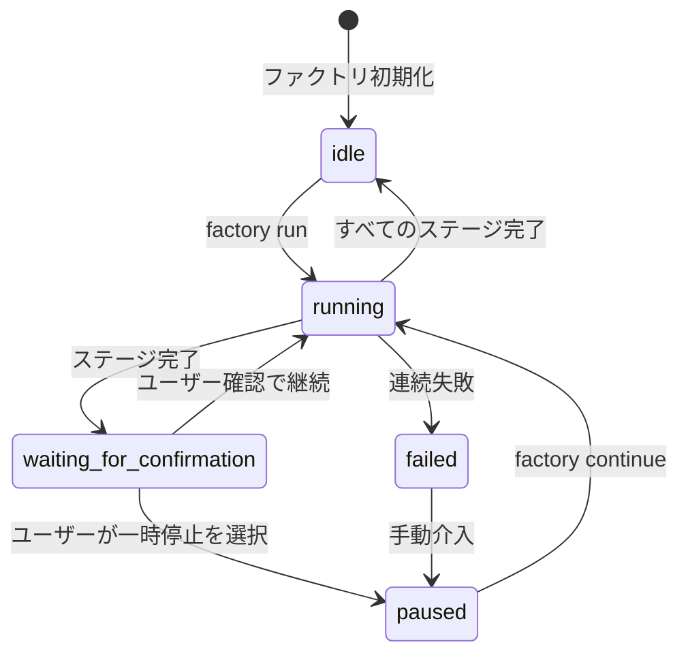
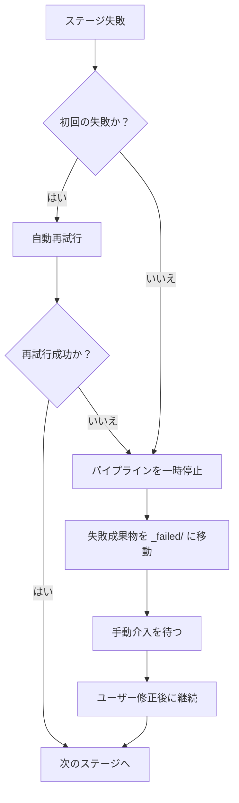

# Sisyphus スケジューラ詳解：パイプラインの調整と状態管理

## 学ぶことでできること

- 7段階パイプラインの実行を調整するスケジューラの仕組みを理解する
- ステートマシンの動作原理と状態遷移ルールを習得する
- 能力境界マトリクスの権限チェックメカニズムを把握する
- 失敗シナリオの対処方法を学ぶ（再試行、ロールバック、手動介入）
- `factory continue` コマンドでトークン消費を最適化する手法を習得する

## 現在直面している課題

パイプラインを何度か実行していますが、以下の点について不明確な部分があるかもしれません：

- Sisyphusは実際に何をしているのか？他のエージェントとはどのように違うのか？
- エージェントが特定のディレクトリにしかアクセスできない理由は？権限を超えると何が起こるのか？
- 失敗した後、スケジューラはどのように処理するのか？時には自動的に再試行し、時には手動介入が必要なのはなぜ？
- `factory continue` コマンドがトークンを節約できるのはなぜ？背後の仕組みはどうなっているのか？

これらの疑問に興味があるなら、この章が答えを見つける助けになるでしょう。

## この機能を活用するタイミング

以下の状況で活用できます：

- **パイプラインの問題をデバッグする際**：スケジューラが特定の段階でどのような処理を行い、なぜ失敗したのかを理解するために
- **トークン消費を最適化する際**：`factory continue` を使用して各段階で新しいセッションを作成することで
- **パイプラインを拡張する際**：新しいエージェントを追加したり、既存のロジックを修正したりする場合
- **失敗シナリオを処理する際**：特定の段階が失敗する理由を理解し、どのように復旧するかを学ぶために
- **権限の問題を確認する際**：エージェントが特定のファイルにアクセスできない理由を確認するために

## 核心的な考え方

Sisyphus スケジューラは、AI App Factory全体の「指揮官」です。

**以下のアナロジーを覚えておきましょう**：

- 他のエージェント（bootstrap、prd、ui、tech、code、validation、preview）は、タスクを実行する作業員
- Sisyphus は、作業員をスケジュールし、作業の品質をチェックし、例外処理を行う監督者

**Sisyphus の独自性**：

| 特性 | Sisyphus | 他のエージェント |
| --- | --- | --- |
| **責任** | 調整、検証、状態管理 | 具体的な成果物を生成 |
| **成果物** | state.jsonを更新 | PRD、コード、ドキュメントなどを生成 |
| **権限** | state.jsonを読み書き | 特定のartifacts/サブディレクトリを読み書き |
| **コンテンツ生成** | ビジネスコンテンツを生成しない | 具体的なビジネス成果物を生成 |

**重要な原則**：

1. **厳密な順序**：pipeline.yaml で定義された順序で実行し、段階を飛ばしたり並列化したりしない
2. **単一ステージ実行**：同時にアクティブなエージェントは1つだけ
3. **責任の分離**：Sisyphusはビジネス成果物を変更せず、調整と検証のみを担当
4. **品質チェック**：各ステージ完了後、成果物がexit_criteriaを満たすか検証する必要がある

## ステートマシンモデル

Sisyphus は、ステートマシン方式でプロセス全体を実行します。ステートマシンを理解することは、スケジューラを習得する鍵です。

### 5つの状態



### 状態の詳細

| 状態 | 説明 | トリガー条件 |
| --- | --- | --- |
| **idle** | 起動待ち | プロジェクト初期化完了、またはパイプライン全段階完了 |
| **running** | あるステージを実行中 | factory run または factory continue 起動後 |
| **waiting_for_confirmation** | 手動確認待ち | 現在のステージ完了後、ユーザーの次のアクションを待つ |
| **paused** | 手動一時停止 | ユーザーが一時停止を選択、または連続失敗後一時停止 |
| **failed** | 未処理の失敗を検出 | エージェントが連続2回失敗、または権限超過書き込み |

::: info 状態ファイル
すべての状態は `.factory/state.json` ファイルに保存され、Sisyphus だけが更新権限を持ちます。
:::

### 状態遷移の例

**シナリオ 1：正常実行**

```
idle → running (factory run)
   ↓
waiting_for_confirmation (bootstrap 完了)
   ↓
running (ユーザーが継続を選択)
   ↓
waiting_for_confirmation (prd 完了)
   ↓
... (すべての段階完了まで繰り返し)
   ↓
idle
```

**シナリオ 2：失敗からの復旧**

```
running → failed (code ステージが連続2回失敗)
   ↓
paused (手動介入でコード修正)
   ↓
running (factory continue で code を再試行)
   ↓
waiting_for_confirmation
```

## 能力境界マトリクス

### 権限制御が必要な理由は？

想像してみてください：

- PRD エージェントがUIエージェントが生成したファイルを変更したら、どのような問題が発生しますか？
- Tech エージェントがCodeエージェントが生成したコードを読み取ったら、どのような結果になりますか？

**答え**：責任の混乱、成果物の追跡不能、品質の保証不能です。

能力境界マトリクスは、各エージェントの読み書き権限を制限することで、責任の分離を保証します。

### 権限マトリクス

| エージェント | 読み取り可能ディレクトリ | 書き込み可能ディレクトリ | 説明 |
| --- | --- | --- | --- |
| **bootstrap** | なし | `input/` | `input/` ディレクトリでのみ `idea.md` を作成または変更 |
| **prd** | `input/` | `artifacts/prd/` | アイデアファイルを読み取り、PRDを生成 |
| **ui** | `artifacts/prd/` | `artifacts/ui/` | PRDを読み取り、UI Schemaとプレビューを生成 |
| **tech** | `artifacts/prd/` | `artifacts/tech/`, `artifacts/backend/prisma/` | PRDを読み取り、技術設計とデータモデルを生成 |
| **code** | `artifacts/ui/`, `artifacts/tech/`, `artifacts/backend/prisma/` | `artifacts/backend/`, `artifacts/client/` | UIと技術設計に基づいてコードを生成 |
| **validation** | `artifacts/backend/`, `artifacts/client/` | `artifacts/validation/` | コード品質を検証し、検証レポートを生成 |
| **preview** | `artifacts/backend/`, `artifacts/client/` | `artifacts/preview/` | 生成されたコードを読み取り、デモの説明を作成 |

### 権限チェックフロー

**実行前**：

1. Sisyphus が capability.matrix.md を読み取る
2. エージェントに許可される読み取りと書き込みのディレクトリを通知
3. エージェントは権限範囲内で操作を行う必要がある

**実行後**：

1. Sisyphus が新しく作成または変更されたファイルをスキャン
2. 許可されたディレクトリ範囲内かどうかチェック
3. 権限超過を発見した場合、直ちに処理

### 権限超過処理メカニズム

エージェントが許可されていないディレクトリに書き込んだ場合：

1. **成果物の隔離**：権限超過ファイルを `artifacts/_untrusted/<stage-id>/` に移動
2. **失敗の記録**：イベントを失敗としてマーク
3. **パイプラインの一時停止**：手動介入を待つ
4. **修正提案の提供**：ユーザーに信頼できないファイルをどう処理するかを指示

**例**：

```
⚠️  ステージ "prd" で権限超過書き込みが検出されました：
   - artifacts/ui/ui.schema.yaml

隔離されたファイル：artifacts/_untrusted/prd

続行する前にこれらのファイルを確認してください。
```

## チェックポイントメカニズム

各ステージ完了後、Sisyphus は一時停止し、手動確認を待ちます。これがチェックポイントメカニズムです。

### チェックポイントの価値

- **品質管理**：各ステージの成果物を手動で検証
- **柔軟な制御**：いつでも一時停止、再試行、スキップが可能
- **デバッグの容易化**：問題を早期に発見し、後期への蓄積を回避

### チェックポイント出力テンプレート

各ステージ完了後、Sisyphus は以下の形式でオプションを表示します：

```
✓ prd 完了！

生成された成果物：
- artifacts/prd/prd.md

┌─────────────────────────────────────────────────────────────┐
│  📋 次の操作を選択してください                               │
│  オプション番号（1-5）を入力し、Enterキーで確認してください  │
└─────────────────────────────────────────────────────────────┘

┌──────┬──────────────────────────────────────────────────────┐
│ オプション │ 説明                                             │
├──────┼──────────────────────────────────────────────────────┤
│  1   │ 次のステージへ（同一セッション）                        │
│      │ ui ステージを継続実行します                             │
├──────┼──────────────────────────────────────────────────────┤
│  2   │ 新しいセッションで継続 ⭐ 推奨オプション、トークン節約  │
│      │ 新しいコマンドラインウィンドウで実行：factory continue │
│      │ （新しいClaude Codeウィンドウを自動起動し、パイプラインを継続） │
├──────┼──────────────────────────────────────────────────────┤
│  3   │ ステージを再実行                                     │
│      │ prd ステージを再実行します                              │
├──────┼──────────────────────────────────────────────────────┤
│  4   │ 成果物修正後に再実行                                  │
│      │ input/idea.md 修正後に再実行                          │
├──────┼──────────────────────────────────────────────────────┤
│  5   │ パイプラインを一時停止                                 │
│      │ 現在の進行状況を保存し、後で継続                       │
└──────┴──────────────────────────────────────────────────────┘

💡 ヒント：1-5の間の番号を入力し、Enterキーで選択を確認してください
```

::: tip 推奨される方法
**オプション 2（新しいセッションで継続）がベストプラクティス**です。詳細は次の「コンテキスト最適化」セクションを参照してください。
:::

## 失敗処理戦略

あるステージが失敗した場合、Sisyphus は事前定義された戦略に従って処理します。

### 失敗の定義

**Sisyphus が失敗とみなす状況**：

- 出力ファイルが不足（要求されたファイルが存在しない）
- 出力内容が exit_criteria を満たさない（例：PRD にユーザーストーリーが欠けている）
- エージェントが権限超過書き込み（許可されていないディレクトリに書き込み）
- エージェントが連続して実行エラー（スクリプトエラー、入力の読み取り不可）

### 失敗処理フロー



### 自動再試行メカニズム

- **デフォルトルール**：各ステージで自動再試行を1回許可
- **再試行戦略**：既存の成果物に基づいて問題を修正
- **失敗アーカイブ**：再試行失敗後、成果物を `artifacts/_failed/<stage-id>/attempt-2/` に移動

### 手動介入シナリオ

**手動介入が必要な状況**：

1. **連続2回失敗**：自動再試行後も失敗
2. **権限超過書き込み**：エージェントが許可されていないディレクトリに書き込み
3. **スクリプトエラー**：エージェント実行中に例外が発生

**手動介入フロー**：

1. Sisyphus がパイプラインを一時停止
2. 失敗の原因とエラー情報を表示
3. 修正提案の提供：
   - 入力ファイルの修正
   - エージェント定義の調整
   - スキルファイルの更新
4. ユーザー修正後、`factory continue` を実行して継続

## コンテキスト最適化（トークン節約）

### 問題の説明

同一セッションで7つのステージを連続実行すると、以下の問題に直面します：

- **コンテキストの蓄積**：AIがすべての過去の会話を記憶する必要がある
- **トークンの浪費**：過去の成果物を繰り返し読み取る
- **コストの増加**：長いセッションではトークン消費がより大きい

### 解決策：セッション分割実行

**核心的な考え方**：各ステージを新しいセッションで実行する。

```
セッション 1: bootstrap
  ├─ input/idea.md を生成
  ├─ state.json を更新
  └─ セッション終了

セッション 2: prd
  ├─ state.json を読み取り（現在の状態のみ読み込み）
  ├─ input/idea.md を読み取り（入力ファイルのみ読み込み）
  ├─ artifacts/prd/prd.md を生成
  ├─ state.json を更新
  └─ セッション終了

セッション 3: ui
  ├─ state.json を読み取り
  ├─ artifacts/prd/prd.md を読み取り
  ├─ artifacts/ui/ui.schema.yaml を生成
  ├─ state.json を更新
  └─ セッション終了
```

### 使用方法

**ステップ 1**：現在のセッションでステージ完了後、「新しいセッションで継続」を選択

```
┌──────┬──────────────────────────────────────────────────────┐
│ オプション │ 説明                                             │
├──────┼──────────────────────────────────────────────────────┤
│  2   │ 新しいセッションで継続 ⭐ 推奨オプション、トークン節約  │
│      │ 新しいコマンドラインウィンドウで実行：factory continue │
│      │ （新しいClaude Codeウィンドウを自動起動し、パイプラインを継続） │
└──────┴──────────────────────────────────────────────────────┘
```

**ステップ 2**：新しいコマンドラインウィンドウを開き、実行：

```bash
factory continue
```

このコマンドは自動的に以下を実行します：
1. `.factory/state.json` を読み取り、現在の進行状況を取得
2. 新しい Claude Code ウィンドウを起動
3. 次の待機中ステージから継続

### コンテキスト分離の利点

| 利点 | 説明 |
| --- | --- |
| **トークン節約** | 過去の会話と成果物をロードする必要がない |
| **安定性の向上** | コンテキスト爆発によるAIの目標逸脱を回避 |
| **デバッグの容易化** | 各ステージが独立しており、問題の特定が容易 |
| **中断からの復旧** | 任意のチェックポイントで中断後に復旧可能 |

## 必須スキル使用の検証

特定のステージでは、出力品質を保証するために特定のスキルの使用が要求されます。Sisyphus はこれらのスキルの使用状況を検証します。

### bootstrap ステージ

**必須要件**：`superpowers:brainstorm` スキルを使用する必要がある

**検証方法**：

1. エージェントの出力メッセージにスキルの使用が明記されているか確認
2. 言及がない場合、成果物を拒否
3. 再実行を促し、そのスキルの使用を強調

**失敗時のメッセージ**：

```
❌ superpowers:brainstorm スキルが使用されていません
idea.md を生成する前に、このスキルを使用してユーザーのアイデアを深く掘り下げてください
```

### ui ステージ

**必須要件**：`ui-ux-pro-max` スキルを使用する必要がある

**検証方法**：

1. エージェントの出力メッセージにスキルの使用が明記されているか確認
2. `ui.schema.yaml` のデザインシステム設定をチェック
3. デザインシステム設定が専門的な推奨ではない場合、成果物を拒否

**失敗時のメッセージ**：

```
❌ ui-ux-pro-max スキルが使用されていません
このスキルを使用して、プロフェッショナルなデザインシステムとUIプロトタイプを生成してください
```

### 連続失敗の処理

あるステージがスキル検証失敗で連続2回失敗した場合：

1. パイプラインを一時停止
2. 手動介入を依頼
3. エージェント定義とスキル設定をチェック

## 実践演習：失敗したステージのデバッグ

code ステージが失敗したと仮定し、デバッグ方法を見てみましょう。

### ステップ 1：state.json を確認

```bash
cat .factory/state.json
```

**出力例**：

```json
{
  "version": "1.0",
  "status": "failed",
  "currentStage": "code",
  "completedStages": ["bootstrap", "prd", "ui", "tech"],
  "failedStages": ["code"],
  "stageHistory": [
    {
      "stageId": "code",
      "status": "failed",
      "startTime": "2026-01-29T10:00:00Z",
      "endTime": "2026-01-29T10:15:00Z",
      "attempts": 2,
      "error": "Exit criteria not met: Missing package.json"
    }
  ],
  "lastCheckpoint": "tech",
  "createdAt": "2026-01-29T09:00:00Z",
  "updatedAt": "2026-01-29T10:15:00Z"
}
```

**重要な情報**：

- `status: failed` - パイプラインが失敗
- `currentStage: code` - 現在失敗中のステージ
- `completedStages` - 4つのステージが完了
- `error: "Exit criteria not met: Missing package.json"` - 失敗の原因

### ステップ 2：失敗成果物を確認

```bash
ls -la artifacts/_failed/code/attempt-2/
```

**出力例**：

```
drwxr-xr-x  5 user  staff  160 Jan 29 10:15 .
drwxr-xr-x  3 user  staff   96 Jan 29 10:15 ..
-rw-r--r--  1 user  staff 2.1K Jan 29 10:15 server.ts
-rw-r--r--  1 user  staff 1.5K Jan 29 10:15 client.ts
```

**問題発見**：`package.json` ファイルが欠けています！

### ステップ 3：exit_criteria を確認

```bash
cat .factory/pipeline.yaml | grep -A 10 'code:'
```

**出力例**：

```yaml
code:
  agent: agents/code.agent.md
  inputs:
    - artifacts/ui/ui.schema.yaml
    - artifacts/tech/tech.md
    - artifacts/backend/prisma/schema.prisma
  outputs:
    - artifacts/backend/package.json
    - artifacts/backend/server.ts
    - artifacts/client/package.json
    - artifacts/client/app.ts
  exit_criteria:
    - package.json が存在
    - 正しい依存関係が含まれる
    - コードが型チェックを通過
```

**問題確認**：Code エージェントが `package.json` を生成しておらず、exit_criteria に違反しています。

### ステップ 4：問題を修正

**ソリューション 1**：Code エージェント定義を修正

```bash
nano .factory/agents/code.agent.md
```

エージェント定義で `package.json` の生成を明示的に要求：

```markdown
## 必須ファイル

以下のファイルを生成する必要があります：
- artifacts/backend/package.json（正しい依存関係を含む）
- artifacts/backend/server.ts
- artifacts/client/package.json
- artifacts/client/app.ts
```

**ソリューション 2**：入力ファイルを修正

問題が Tech 設計ステージにある場合、技術設計を修正できます：

```bash
nano artifacts/tech/tech.md
```

明確な依存関係の説明を追加。

### ステップ 5：パイプラインを継続

問題修正後、再実行：

```bash
factory continue
```

Sisyphus は以下を実行します：
1. state.json を読み取り（状態は failed）
2. lastCheckpoint（tech）から継続
3. code ステージを再実行
4. 成果物が exit_criteria を満たすか検証

## このレッスンのまとめ

Sisyphus スケジューラは、AI App Factory の「指揮官」として以下を担当します：

- **パイプラインの調整**：7つのステージを順序通り実行
- **状態管理**：state.json を維持し、進行状況を追跡
- **権限チェック**：エージェントが許可されたディレクトリでのみ読み書きすることを保証
- **失敗処理**：自動再試行、失敗成果物のアーカイブ、手動介入の待機
- **品質チェック**：各ステージの成果物が exit_criteria を満たすか検証

**重要な原則**：

1. 厳密な順序で実行し、スキップや並列化は不可
2. 同一時点でアクティブなエージェントは1つのみ
3. すべての成果物は artifacts/ ディレクトリに書き込む必要がある
4. 各ステージ完了後、手動での確認が必要
5. `factory continue` の使用でトークンを節約することを推奨

**このフローチャートを覚えておきましょう**：

```
factory run → pipeline.yaml を読み取り → ステージを実行 → 成果物を検証 → チェックポイント確認
      ↑                                                                      │
      └──────────────────── factory continue（新しいセッション）←──────────────────────┘
```

## 次のレッスンの予告

> 次のレッスンでは **[コンテキスト最適化：セッション分割実行](../context-optimization/)** を学びます。
>
> 学べること：
> - `factory continue` コマンドの使用方法
> - なぜセッション分割実行でトークンを節約できるか
> - 開発環境でスケジューラをテストする方法
> - 一般的なデバッグテクニックとログ分析

## 付録：ソースコードリファレンス

<details>
<summary><strong>クリックしてソースコードの場所を表示</strong></summary>

> 更新日時：2026-01-29

| 機能 | ファイルパス | 行番号 |
| --- | --- | --- |
| スケジューラコア定義 | [`source/hyz1992/agent-app-factory/agents/orchestrator.checkpoint.md`](https://github.com/hyz1992/agent-app-factory/blob/main/agents/orchestrator.checkpoint.md) | 全文 |
| スケジューラ実装ガイド | [`source/hyz1992/agent-app-factory/agents/orchestrator-implementation.md`](https://github.com/hyz1992/agent-app-factory/blob/main/agents/orchestrator-implementation.md) | 全文 |
| 能力境界マトリクス | [`source/hyz1992/agent-app-factory/policies/capability.matrix.md`](https://github.com/hyz1992/agent-app-factory/blob/main/policies/capability.matrix.md) | 全文 |
| 失敗処理戦略 | [`source/hyz1992/agent-app-factory/policies/failure.policy.md`](https://github.com/hyz1992/agent-app-factory/blob/main/policies/failure.policy.md) | 全文 |
| パイプライン定義 | [`source/hyz1992/agent-app-factory/pipeline.yaml`](https://github.com/hyz1992/agent-app-factory/blob/main/pipeline.yaml) | 全文 |

**重要な関数**：

- `executeStage()` - 単一ステージの実行（117-189行）
- `waitForCheckpointConfirmation()` - チェックポイント確認の待機（195-236行）
- `handleStageFailure()` - ステージ失敗の処理（242-289行）
- `checkUnauthorizedWrites()` - 権限超過書き込みのチェック（295-315行）
- `getPermissions()` - 権限マトリクスの取得（429-467行）

**重要な定数**：

- 状態列挙：`idle`, `running`, `waiting_for_confirmation`, `paused`, `failed`
- 最大再試行回数：2回（269行）
- パス解決優先順位：`.factory/` → ルートディレクトリ（31-33行）

</details>
