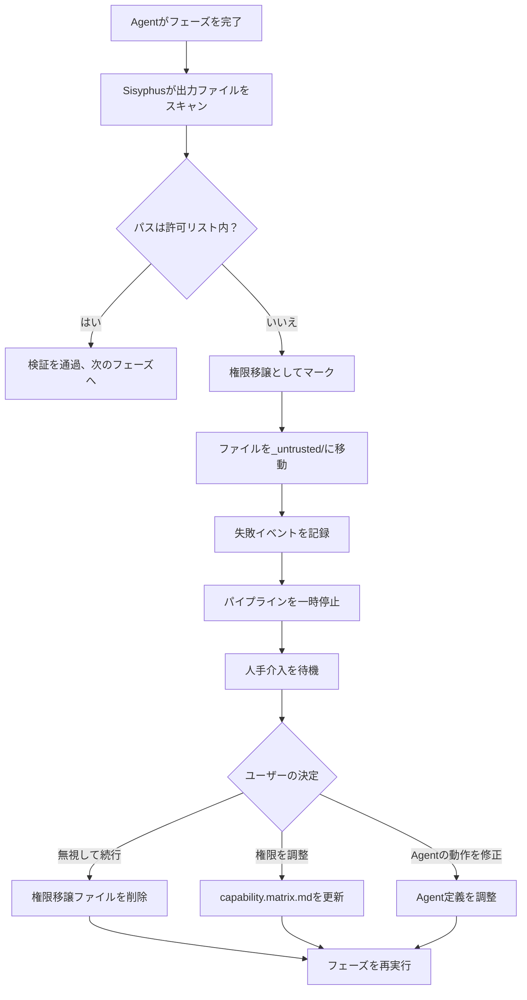

# 権限とセキュリティメカニズム：能力境界マトリックスと権限移譲防止

## 学習後にできること

- 能力境界マトリックスの設計原理と権限分離メカニズムを理解する
- Claude Codeの権限ファイルを設定し、`--dangerously-skip-permissions`の使用を回避する方法を学ぶ
- 権限移譲操作の処理フローと復旧方法を習得する
- 強制スキル使用検証のメカニズムを理解する
- 権限関連のセキュリティ問題を識別し修正する能力を身につける

## 現在の課題

以下のような状況に遭遇したことがあるかもしれません：

- Agentが特定のファイルにアクセスできない理由がわからない
- `factory run`実行時に常に権限が必要と表示され、直接`--dangerously-skip-permissions`を使ってスキップしている
- Agent間の権限境界が不明確で、権限移譲操作によるデータ汚染を心配している
- 権限移譲発生後の処理と復旧方法がわからない

これらの問題でお悩みの場合、この章で完全な権限とセキュリティの認知を構築するお手伝いをします。

## この知識を使う場面

以下の状況で必要です：

- **Claude Codeの設定**：Factoryプロジェクトに正しい権限ファイルを設定する
- **権限問題のデバッグ**：Agentが特定のファイルを読み書きできない理由を調査する
- **権限移譲例外の処理**：権限移譲操作によるパイプライン中断の復旧
- **Agentの拡張**：新しいAgentを追加する際に権限境界を定義する
- **セキュリティ監査**：既存プロジェクトの権限設定が妥当か確認する

## 核心思想

AI App Factoryのセキュリティメカニズムは**能力境界マトリックス**（Capability Boundary Matrix）に基づき、各Agentが許可されたディレクトリ内でのみ操作できるようにします。

**この比喩を覚えておいてください**：

- Agentは工場の**専門作業員**のようなもの
- 能力境界マトリックスは**作業許可証**のようなもので、各作業員がどの工場に入れるか、どの設備を操作できるかを明確に規定している
- Sisyphusスケジューラは**安全責任者**のようなもので、作業員の工場への出入り時に許可証をチェックし、権限移譲行為がないか確認する

**3層保護メカニズム**：

| レベル | 責任 | チェックタイミング |
| --- | --- | --- |
| **Claude Code 権限** | ファイルシステムの読み書き権限 | AI アシスタント起動時 |
| **能力境界マトリックス** | Agentのディレクトリアクセス権限 | フェーズ実行前後 |
| **強制スキル検証** | 特定フェーズのスキル使用要件 | bootstrapとuiフェーズ |

## 能力境界マトリックスの詳細

### なぜ権限分離が必要なのか？

権限制限がないと何が起こるか想像してみてください：

- **PRD AgentがUIファイルを修正**：UIデザインが乱れ、追跡不可能になる
- **Tech AgentがCodeファイルを読み取る**：技術アーキテクチャがコード実装の影響を受け、MVP原則から外れる
- **Code AgentがPRDを修正**：要件文書がコードロジックで"汚染"され、責任が不明確になる

**答え**：責任境界が不明確だと、産物の追跡ができず、品質を保証できません。

能力境界マトリックスは、各Agentの読み書き権限を制限することで責任分離を実現します。

### 権限マトリックステーブル

| Agent | 読み取り可能ディレクトリ | 書き込み可能ディレクトリ | 説明 |
| --- | --- | --- | --- |
| **bootstrap** | なし | `input/` | `input/`ディレクトリ内の`idea.md`のみ作成または修正 |
| **prd** | `input/` | `artifacts/prd/` | 着想ファイルを読み取り、PRDを生成；他のディレクトリへの書き込み禁止 |
| **ui** | `artifacts/prd/` | `artifacts/ui/` | PRDを読み取り、UI Schemaとプレビューを生成 |
| **tech** | `artifacts/prd/` | `artifacts/tech/`, `artifacts/backend/prisma/` | PRDを読み取り、技術設計とデータモデルを生成 |
| **code** | `artifacts/ui/`, `artifacts/tech/`, `artifacts/backend/prisma/` | `artifacts/backend/`, `artifacts/client/` | UIと技術設計に基づきバックエンドとクライアントコードを生成；上流産物の修正禁止 |
| **validation** | `artifacts/backend/`, `artifacts/client/` | `artifacts/validation/` | コード品質を検証し、検証レポートを生成；コードは読み取り専用、修正禁止 |
| **preview** | `artifacts/backend/`, `artifacts/client/` | `artifacts/preview/` | 生成されたサービスとクライアントを読み取り、デモ説明を記述 |

::: tip 核心原則
- **単向依存**：Agentは上流フェーズの産物のみ読み取り可能で、下流または同レベルの産物は読み取り禁止
- **責任独立**：各Agentは自分の産出ディレクトリのみ書き込み可能
- **権限移譲禁止**：許可されていない読み書き操作はセキュリティ違反と見なされる
:::

### 権限チェックフロー

Sisyphusスケジューラは各フェーズの実行前後に権限チェックを行います：

**実行前（権限の通知）**：

```
1. Sisyphusがcapability.matrix.mdを読み取る
2. 現在のAgentの読み取り・書き込み可能ディレクトリをAIアシスタントに渡す
3. AIアシスタントは実行時にこれらの制限を遵守しなければならない
```

**実行後（出力の検証）**：

```
1. Sisyphusが新規作成または修正されたファイルをスキャンする
2. ファイルパスがAgentの許可ディレクトリ範囲内かチェックする
3. 権限移譲が検出された場合、即座に処理する（権限移譲処理メカニズムを参照）
```

::: info 自動化 vs 手動
権限チェックは主にAIアシスタント（Claude Code）の権限システムとSisyphusの検証ロジックによって自動的に行われます。権限移譲などの例外状況でのみ人手の介入が必要です。
:::

## Claude Code権限の設定

### なぜ--dangerously-skip-permissionsは推奨されないのか？

以下のようなコマンドを見たことがあるかもしれません：

```bash
claude --dangerously-skip-permissions
```

**このオプションの問題点**：

| 問題 | 説明 | リスク |
| --- | --- | --- |
| **全チェックをスキップ** | Claude Codeがファイル操作の検証を一切行わない | AIがシステムファイルを誤って削除・修正する可能性 |
| **セキュリティ脆弱性** | Agentが任意のディレクトリを読み書き可能 | 権限移譲操作を検出できない |
| **追跡不可能** | 権限境界がないため問題の特定が困難 | デバッグとメンテナンスが困難 |

### Factoryによる自動権限設定生成

Factory CLIはプロジェクト初期化時に自動的に`.claude/settings.local.json`を生成し、正確な権限を設定します：

**生成タイミング**：`factory init`コマンド実行時

**設定内容**（ソース位置：`cli/utils/claude-settings.js:41-91`）：

```json
{
  "permissions": {
    "allow": [
      // ========== ファイル操作権限 ==========
      "Read(/path/to/project/**)",
      "Write(/path/to/project/**)",
      "Glob(/path/to/project/**)",
      "Edit(/path/to/project/*,**)",
      
      // ========== Git操作権限 ==========
      "Bash(git add:*)",
      "Bash(git commit:*)",
      "Bash(git push:*)",
      // ... その他のgitコマンド
      
      // ========== ビルドツール権限 ==========
      "Bash(npm install:*)",
      "Bash(npm run:*)",
      "Bash(npx:*)",
      
      // ========== TypeScript権限 ==========
      "Bash(tsc:*)",
      "Bash(npx type-check:*)",
      
      // ========== データベース(Prisma)権限 ==========
      "Bash(npx prisma validate:*)",
      "Bash(npx prisma generate:*)",
      "Bash(npx prisma migrate dev:*)",
      
      // ========== Factory CLI権限 ==========
      "Bash(factory init:*)",
      "Bash(factory run:*)",
      "Bash(factory continue:*)",
      
      // ========== Docker権限 ==========
      "Bash(docker compose:*)",
      "Bash(docker build:*)",
      
      // ========== スキル(Plugins)権限 ==========
      "Skill(superpowers:brainstorming)",
      "Skill(superpowers:writing-plans)",
      "Skill(ui-ux-pro-max)",
      "Skill(*)",
      
      // ========== Web操作権限 ==========
      "WebFetch(domain:github.com)",
      "WebFetch(domain:npmjs.org)",
      
      // ========== 汎用ツール権限 ==========
      "Bash(curl:*)",
      "Bash(grep:*)",
      "Bash(find:*)"
    ]
  },
  "features": {
    "autoSave": true,
    "telemetry": false
  }
}
```

**権限設定の特徴**：

| 特性 | 説明 | 例 |
| --- | --- | --- |
| **プロジェクトレベル制限** | 現在のプロジェクトディレクトリの読み書きのみ許可 | `Read(/Users/xxx/my-app/**)` |
| **コマンドレベル精密制御** | 各コマンドに明確な権限パターン | `Bash(npm install:*)`は`npm install --global`を許可しない |
| **クロスプラットフォーム対応** | WindowsとUnixパスを自動適応 | Windowsは`//d/**`、Unixは`/path/**` |
| **スキルホワイトリスト** | 使用を許可するスキルを明確に記載 | `Skill(superpowers:brainstorming)` |

**設定が有効か確認する方法**：

```bash
# 生成された権限設定を確認
cat .claude/settings.local.json

# ファイルの存在を確認
ls -la .claude/settings.local.json
```

::: warning プラットフォーム差異
WindowsとUnix/macOSのパス形式は異なります：
- Windows: `//C/**`または`//d/**`（ドライブ文字）
- Unix/macOS: `/Users/username/project/**`

Factoryは現在のプラットフォームを自動検出し、正しいパス形式を生成します。
:::

## 権限移譲処理メカニズム

### 権限移譲操作とは何か？

**権限移譲の定義**：Agentが許可リストにないディレクトリに書き込むこと。

**典型的なシナリオ**：

| Agent | 許可された書き込みディレクトリ | 権限移譲した書き込みディレクトリ | 問題 |
| --- | --- | --- | --- |
| **prd** | `artifacts/prd/` | `artifacts/ui/` | PRD AgentがUIファイルを越界修正 |
| **tech** | `artifacts/tech/` | `artifacts/prd/` | Tech Agentが要件文書を修正 |
| **code** | `artifacts/backend/` | `artifacts/prd/` | Code Agentが上流産物を逆修正 |

### 権限移譲処理フロー

Sisyphusが権限移譲書き込みを検出した場合：



### 権限移譲産物の分離

権限移譲ファイルは`artifacts/_untrusted/<stage-id>/`ディレクトリに移動されます：

**例**：PRD Agentが`artifacts/ui/`に権限移譲書き込みした場合

```
artifacts/
├── prd/
│   └── prd.md
├── ui/
│   └── ui.schema.yaml  ← 元々ここにあるべきだったが、PRD Agentによって書き込まれた
└── _untrusted/
    └── prd/
        └── ui/
            └── ui.schema.yaml  ← 権限移譲ファイルはここに移動された
```

**エラーメッセージ**：

```
⚠️  Unauthorized writes detected for stage "prd":

Untrusted files:
  - artifacts/ui/ui.schema.yaml

Files moved to quarantine: artifacts/_untrusted/prd/artifacts/ui/ui.schema.yaml

Pipeline paused. Please review these files before proceeding.

Choose action:
  1. Delete untrusted files and retry
  2. Adjust permissions in capability.matrix.md
  3. Modify Agent behavior in .factory/agents/prd.agent.md
  4. Continue (accept untrusted files) - Not recommended
```

### 人手介入処理

**オプション1：権限移譲ファイルを削除し、再実行する**（推奨）

```bash
# 権限移譲ファイルを確認
ls -la artifacts/_untrusted/prd/

# 権限移譲ファイルを削除
rm -rf artifacts/_untrusted/prd/

# フェーズを再実行
factory continue
```

**オプション2：権限マトリックスを調整する**

権限移譲が正当な場合（例：特定のAgentが追加のディレクトリへの書き込みが必要な場合）：

```bash
# 権限マトリックスを編集
nano .factory/policies/capability.matrix.md

# Agentの書き込み可能ディレクトリを修正
# 例：prd Agentに`artifacts/ui/`書き込み権限を追加

# 再実行
factory continue
```

**オプション3：Agentの動作を修正する**

権限移譲がAgentの誤操作による場合：

```bash
# Agent定義を編集
nano .factory/agents/prd.agent.md

# 非許可ディレクトリへの書き込みを明確に禁止
# 指示を追加："`artifacts/ui/`またはその他の非許可ディレクトリへの書き込みを禁止する"

# 再実行
factory continue
```

::: danger 警告
オプション4（権限移譲ファイルを受け入れる）は**極めて推奨されません**。理由は以下の通りです：
- 権限分離の設計原則に反する
- 責任が混乱し、追跡が困難になる
- 後続フェーズが誤った産物により失敗する可能性がある
:::

## 強制スキル使用検証

特定のフェーズでは、出力品質を保証するために特定のスキルの使用が求められます。Sisyphusはこれらのスキルの使用状況を検証します。

### bootstrapフェーズの検証

**強制要件**：`superpowers:brainstorm`スキルの使用が必須

**なぜか？**

- Brainstormingスキルは構造化された思考フレームワークを提供する
- 製品着想が深く掘り下げられ、表面的な説明にならないことを保証する
- Agentが重要な分析ステップをスキップするのを防ぐ

**検証方法**：

1. Agentの出力メッセージにスキルの使用が明確に記載されているか確認する
2. 記載がない場合、産物を受け入れない
3. 再実行を求め、スキルの使用を明確に強調する

**失敗時のメッセージ**：

```
❌ 検出：superpowers:brainstormスキルが未使用

Bootstrap Agentは、ユーザーの着想を深く掘り下げるためにsuperpowers:brainstormスキルを使用する必要があります。

bootstrapフェーズを再実行し、以下を明確に記載してください：
"superpowers:brainstormスキルを使用してユーザーの着想を分析しました..."
```

**正しい例**：

```
superpowers:brainstormスキルを使用してユーザーの着想を深く分析しました。

brainstormingスキルにより、以下の重要ポイントを識別しました：
- 核心問題：[問題の説明]
- 対象ユーザー：[ユーザーペルソナ]
- 価値提案：[価値ポイント]
- 重要な仮説：[仮説リスト]

生成された着想文書：input/idea.md
```

### uiフェーズの検証

**強制要件**：`ui-ux-pro-max`スキルの使用が必須

**なぜか？**

- UI/UX Pro Maxスキルは専門的なデザインシステムフレームワークを提供する
- "AIデフォルトスタイル"（Interフォント、紫のグラデーションなど）を回避する
- デザインシステムの一貫性と保守性を保証する

**検証方法**：

1. Agentの出力メッセージにスキルの使用が明確に記載されているか確認する
2. `ui.schema.yaml`のデザインシステム設定が専門的か確認する
3. デザインシステム設定が専門的でない場合、産物を受け入れない

**失敗時のメッセージ**：

```
❌ 検出：ui-ux-pro-maxスキルが未使用

UI Agentは、専門的なデザインシステムとUIプロトタイプを生成するためにui-ux-pro-maxスキルを使用する必要があります。

uiフェーズを再実行し、以下を明確に記載してください：
"ui-ux-pro-maxスキルを使用してUIシステムを設計しました..."
```

**正しい例**：

```
ui-ux-pro-maxスキルを使用してUIシステムとプロトタイプを設計しました。

ui-ux-pro-maxスキルにより、以下を選択しました：
- デザイン方向：[具体的なスタイル、例：ミニマリズム / サイバーパンク]
- カラーシステム：[カラースキーム]
- フォントシステム：[フォント選択]
- コンポーネントライブラリ：[コンポーネント仕様]

生成されたUI産物：
- artifacts/ui/ui.schema.yaml
- artifacts/ui/preview.web/index.html
```

### 連続失敗の処理

あるフェーズがスキル検証により連続2回失敗した場合：

1. パイプラインを一時停止
2. 人手介入を要求
3. 以下の可能性があるか確認：
   - AIアシスタントに対応するスキル（Plugin）がインストールされているか
   - Agent定義にスキルの使用が明確に要求されているか
   - Skillファイルパスが正しいか

## 実戦演習：権限移譲例外の処理

PRD AgentがUIディレクトリに権限移譲書き込みした場合の完全な処理フローを見てみましょう。

### ステップ1：権限移譲の識別

PRDフェーズ完了後、Sisyphusが報告：

```
⚠️  Unauthorized writes detected for stage "prd":

Untrusted files:
  - artifacts/ui/ui.schema.yaml

Files moved to quarantine: artifacts/_untrusted/prd/artifacts/ui/ui.schema.yaml

Pipeline paused.
```

### ステップ2：権限移譲ファイルの確認

```bash
# 権限移譲ファイルの内容を確認
cat artifacts/_untrusted/prd/artifacts/ui/ui.schema.yaml

# 出力例：
```yaml
# PRD Agentが生成したUI Schema（権限移譲産物）
pages:
  - name: Home
    components:
      - Hero
      - Features
```

### ステップ3：原因の分析

**可能性のある原因**：

| 原因 | 説明 | 証拠 |
| --- | --- | --- |
| **Agentの誤操作** | PRD Agentが誤ってUIファイルを生成 | ファイル内容に確かにUI構造が含まれている |
| **Promptが不明確** | Agent定義が他のディレクトリへの書き込みを禁止していない | `.factory/agents/prd.agent.md`を確認する必要がある |
| **権限設定エラー** | PRD Agentの書き込み権限が大きすぎる | `capability.matrix.md`を確認する必要がある |

**Agent定義の確認**：

```bash
cat .factory/agents/prd.agent.md
```

**権限マトリックスの確認**：

```bash
cat .factory/policies/capability.matrix.md | grep -A 1 "prd"
```

**出力**：

```
| **prd** | `input/` | `artifacts/prd/` | 着想ファイルを読み取り、PRDを生成；他のディレクトリへの書き込み禁止 |
```

権限マトリックスは正しいため、問題はAgentの動作にあります。

### ステップ4：Agent定義の修正

Agent定義を編集し、明確な禁止指示を追加：

```bash
nano .factory/agents/prd.agent.md
```

**追加内容**：

```markdown
## 禁止事項

- ❌ **`artifacts/ui/`ディレクトリへの書き込み禁止**：UI設計はUI Agentが担当
- ❌ **`artifacts/tech/`ディレクトリへの書き込み禁止**：技術アーキテクチャはTech Agentが担当
- ❌ **`artifacts/backend/`または`artifacts/client/`への書き込み禁止**：コード生成はCode Agentが担当
- ✅ **`artifacts/prd/`ディレクトリのみ書き込み可能**：PRD文書を生成
```

### ステップ5：権限移譲ファイルの削除と再実行

```bash
# 権限移譲ファイルを削除
rm -rf artifacts/_untrusted/prd/

# PRDフェーズを再実行
factory continue
```

### ステップ6：修正の検証

PRDフェーズが再度権限移譲していないか確認：

```bash
# 生成された産物を確認
ls -la artifacts/prd/

# 他のディレクトリに書き込んでいないか確認
ls -la artifacts/_untrusted/prd/

# 出力は空であるべきで、新しい権限移譲がないことを示す
```

**成功のサイン**：

```
✓ prd 完了！

生成された産物：
- artifacts/prd/prd.md

...（チェックポイントオプション）

権限移譲警告は表示されない
```

## セキュリティのベストプラクティス

### 1. 初期化時に権限設定を確認する

```bash
# factory init実行後すぐに確認
cat .claude/settings.local.json

# 以下を確認：
# ✅ permissions.allow配列が存在する
# ✅ プロジェクトパスが正しい（Windowsは//d/**、Unixは/path/**）
# ✅ 必要なコマンド権限が含まれている（npm, git, factory, docker等）
# ✅ スキル権限が含まれている（superpowers, ui-ux-pro-max）
```

### 2. 定期的に権限マトリックスを見直す

```bash
# 権限マトリックスを確認
cat .factory/policies/capability.matrix.md

# 以下を確認：
# ✅ 各Agentの読み書き権限が妥当である
# ✅ 過度な権限付与がない（例：Code AgentがPRDに書き込まない）
# ✅ 権限移譲処理メカニズムが明確である
```

### 3. 権限移譲イベントを監視する

```bash
# 権限移譲ファイルが存在するか確認
ls -la artifacts/_untrusted/

# 権限移譲ファイルが存在する場合、原因を分析：
# - Agentの誤操作によるものか？
# - 権限設定が不合理か？
# - Agent定義を調整する必要があるか？
```

### 4. バージョン管理で設定ファイルを保護する

```bash
# 重要な設定ファイルをGitに追加
git add .claude/settings.local.json
git add .factory/policies/capability.matrix.md
git commit -m "chore: セキュリティ設定ファイルを追加"
```

**理由**：

- 設定の誤削除や誤修正を防止
- 権限設定のバージョン追跡をサポート
- チーム協業時の権限の一貫性を維持

::: warning settings.local.jsonはコミットすべきか？
名前に`local`が含まれていますが、Factoryが生成する`.claude/settings.local.json`はプロジェクトレベルの権限設定であり、バージョン管理に含めるべきです。チーム全員が同じ権限設定を使用する必要があります。
:::

### 5. 定期的に権限設定を更新する

以下の状況では権限設定の更新が必要です：

| トリガー条件 | 更新が必要な設定 |
| --- | --- |
| 新しいAgentを追加 | `capability.matrix.md`を更新 |
| 新しいビルドツールを導入 | `settings.local.json`のBash権限を更新 |
| 新しいスキル（Plugin）を追加 | `settings.local.json`のSkill権限を更新 |
| Agentの責任を調整 | `capability.matrix.md`を更新 |

**更新フロー**：

```bash
# 1. 設定ファイルを修正
nano .claude/settings.local.json
# または
nano .factory/policies/capability.matrix.md

# 2. 修正をコミット
git add .claude/settings.local.json
git add .factory/policies/capability.matrix.md
git commit -m "security: 新しいAgent/ツールの権限を更新"

# 3. 権限を再初期化（オプション）
# capability.matrix.mdを修正した場合、追加操作は不要、Sisyphusが自動的に読み取る
# settings.local.jsonを修正した場合、Claude Codeの再起動が必要な場合がある
```

## 一般的なセキュリティ問題のトラブルシューティング

### 問題1：Agentがファイルを読み取れない

**症状**：

```
❌ Error: Cannot read file: artifacts/prd/prd.md
```

**トラブルシューティング手順**：

1. ファイルが存在するか確認
   ```bash
   ls -la artifacts/prd/prd.md
   ```

2. Agentの読み取り権限を確認
   ```bash
   cat .factory/policies/capability.matrix.md | grep -A 1 "prd"
   ```
   Agentの読み取り可能ディレクトリにそのファイルのディレクトリが含まれているか確認。

3. Claude Code権限設定を確認
   ```bash
   cat .claude/settings.local.json | grep "Read"
   ```
   プロジェクトディレクトリのRead権限が存在するか確認。

### 問題2：Agentがファイルを書き込めない

**症状**：

```
❌ Error: Cannot write file: artifacts/prd/prd.md
```

**トラブルシューティング手順**：

1. Agentの書き込み権限を確認
   ```bash
   cat .factory/policies/capability.matrix.md | grep -A 1 "prd"
   ```
   Agentの書き込み可能ディレクトリに対象ディレクトリが含まれているか確認。

2. Claude Code権限設定を確認
   ```bash
   cat .claude/settings.local.json | grep "Write"
   ```
   プロジェクトディレクトリのWrite権限が存在するか確認。

3. ディレクトリが存在するか確認
   ```bash
   ls -la artifacts/prd/
   ```
   ディレクトリが存在しない場合、Agentは自動的に作成しますが、Write権限が必要です。

### 問題3：権限移譲警告が頻発する

**症状**：

同一Agentで権限移譲警告が頻繁に発生する。

**トラブルシューティング手順**：

1. 権限移譲パターンを分析
   ```bash
   ls -la artifacts/_untrusted/<stage-id>/
   ```
   Agentが常にどのディレクトリに書き込むか確認。

2. Agent定義を確認
   ```bash
   cat .factory/agents/<stage>.agent.md
   ```
   明確な禁止指示が含まれているか確認。

3. 権限を調整する必要があるか検討
   - 権限移譲が正当な場合 → `capability.matrix.md`を更新
   - 権限移譲が誤操作の場合 → Agent定義を修正

### 問題4：スキル検証に失敗する

**症状**：

```
❌ 検出：superpowers:brainstormスキルが未使用
```

**トラブルシューティング手順**：

1. スキルがインストールされているか確認
   - AIアシスタントに対応するPluginがインストールされているか確認
   - Claude Code：`settings.local.json`のSkill権限を確認
   - OpenCode：Pluginリストを確認

2. Agent定義を確認
   ```bash
   cat .factory/agents/<stage>.agent.md
   ```
   Agentがスキルの使用を明確に要求しているか確認。

3. Skillファイルパスを確認
   ```bash
   ls -la .factory/skills/<stage>/skill.md
   ```
   Skillファイルが存在し、パスが正しいか確認。

## 本レッスンのまとめ

権限とセキュリティメカニズムはAI App Factoryの核心保護システムであり、以下を含みます：

**3層保護**：

1. **Claude Code権限**：ファイルシステムの読み書き権限、`settings.local.json`で設定
2. **能力境界マトリックス**：Agentのディレクトリアクセス権限、`capability.matrix.md`で定義
3. **強制スキル検証**：特定フェーズのスキル使用要件、Sisyphusが検証

**核心原則**：

- 責任分離：各Agentは許可されたディレクトリのみ読み書き可能
- 単向依存：Agentは上流産物のみ読み取り可能で、下流または同レベルの産物は読み取り禁止
- 権限移譲分離：権限移譲ファイルは自動的に`_untrusted/`に移動し、人手処理を待つ
- スキル保証：BootstrapとUIフェーズは指定スキルの使用が必須

**実践ポイント**：

- 初期化時に権限設定が正しく生成されたか確認する
- 定期的に能力境界マトリックスを見直し、権限が妥当か確認する
- 権限移譲イベントを監視し、Agentの動作をタイムリーに修正する
- 設定ファイルをバージョン管理で保護する
- 問題発生時は、トラブルシューティングフローに従って原因を特定する

**このフローを覚えておいてください**：

```
factory init → 権限設定を生成 → パイプラインを実行 → Sisyphusが権限をチェック
      ↓                                                      │
      └── 権限移譲？ → _untrusted/に移動 → 人手介入 → 修正 → 続行 ──┘
```

## 次のレッスンの予告

> 次のレッスンでは**[失敗処理とロールバック](../failure-handling/)**を学習します。
>
> 学べる内容：
> - 失敗識別メカニズム（出力欠損、内容不一致、権限移譲）
> - 自動リトライ戦略と失敗アーカイブフロー
> - ロールバックメカニズムと人手介入フロー
> - 失敗からパイプラインを復旧する方法

## 付録：ソースコード参照

<details>
<summary><strong>クリックしてソースコードの場所を表示</strong></summary>

> 更新時間：2026-01-29

| 機能 | ファイルパス | 行号 |
| --- | --- | --- |
| 能力境界マトリックス定義 | [`source/hyz1992/agent-app-factory/policies/capability.matrix.md`](https://github.com/hyz1992/agent-app-factory/blob/main/policies/capability.matrix.md) | 全文（1-23行） |
| Claude Code権限生成 | [`source/hyz1992/agent-app-factory/cli/utils/claude-settings.js`](https://github.com/hyz1992/agent-app-factory/blob/main/cli/utils/claude-settings.js) | 38-91行 |
| 権限チェックロジック | [`source/hyz1992/agent-app-factory/agents/orchestrator.checkpoint.md`](https://github.com/hyz1992/agent-app-factory/blob/main/agents/orchestrator.checkpoint.md) | 47-53行 |
| 権限移譲処理戦略 | [`source/hyz1992/agent-app-factory/agents/orchestrator.checkpoint.md`](https://github.com/hyz1992/agent-app-factory/blob/main/agents/orchestrator.checkpoint.md) | 19-21行 |
| Bootstrapスキル検証 | [`source/hyz1992/agent-app-factory/agents/orchestrator.checkpoint.md`](https://github.com/hyz1992/agent-app-factory/blob/main/agents/orchestrator.checkpoint.md) | 58-70行 |
| UIスキル検証 | [`source/hyz1992/agent-app-factory/agents/orchestrator.checkpoint.md`](https://github.com/hyz1992/agent-app-factory/blob/main/agents/orchestrator.checkpoint.md) | 72-84行 |

**主要関数**：

- `generatePermissions(projectDir)` - Claude Code権限設定を生成（41-91行）
- `generateClaudeSettings(projectDir)` - `settings.local.json`を生成して書き込み（256-275行）
- `getPathPatterns()` - プラットフォーム固有のパスパターンを取得（14-36行）

**主要定数**：

- 権限移譲分離ディレクトリ：`artifacts/_untrusted/<stage-id>/`
- スキル名：
  - Bootstrap: `superpowers:brainstorm`
  - UI: `ui-ux-pro-max`
- プラットフォームパス形式：
  - Windows: `//{drive}/**`
  - Unix/macOS: `/path/to/project/**`

</details>
