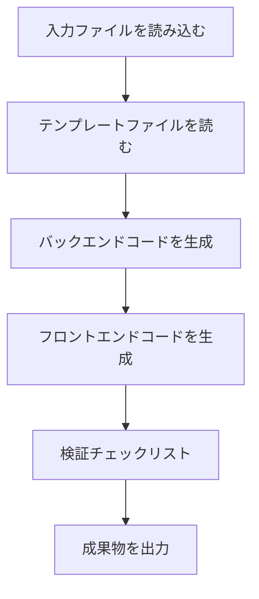

# フェーズ 5: Code - 実行可能なコードを生成

## 学習後にできること

- **ワンクリックでフルスタックコードを生成**: UI Schema と Tech 設計から実行可能なフロントエンド・バックエンドアプリを自動生成
- **コード生成フローを理解**: Code Agent が設計ドキュメントを本番環境対応のコードに変換する方法を習得
- **コード品質を検証**: 生成されたコードの完全性、テストカバレッジ、セキュリティ基準の確認方法を学習
- **一般的な問題をデバッグ**: 依存関係のインストール、型チェック、API 接続の問題を解決

## 現在の課題

製品アイデアの構造化、PRD 生成、UI 設計、技術アーキテクチャ設計を完了しました。次に頭を悩ませるのは：

- **設計をコードに変換する方法**: UI Schema と Tech 設計はドキュメントにありますが、どう実装すればよいのか？
- **フルスタック開発が複雑すぎる**: バックエンドは Express + Prisma、フロントエンドは React Native、どこから始めればよいのか？
- **コード品質の保証**: 生成されたコードにテスト、ドキュメントがあり、セキュリティ規格に準拠していることをどう確実にするか？
- **時間が足りない**: MVP を書くのに数日かかる、もっと速い方法はないか？

Code フェーズはこれらの問題を解決するためにあります。前段階の設計に基づいて、本番環境対応のフルスタックコードを自動生成します。

## いつこの手法を使うか

以下の場合に使用します：

- **アイデアを迅速に検証**: 直接開発に投入するのではなく、コードで製品アイデアの実現可能性を検証
- **アプリケーションの骨組みを作成**: ゼロから始めるのではなく、後続の開発のための実行可能な基盤を提供
- **技術スタックを統一**: フロントエンド・バックエンドコードが統一されたアーキテクチャと規格に従うことを保証
- **開発時間を節約**: 設計からコードへ、数分で MVP フレームワークを完成

## 核心的な考え方

Code Agent は**フルスタックエンジニア**です。その任務は前段階の設計ドキュメントを実行可能なコードに変換することです。主な特徴：

### 入出力

| タイプ | 内容 |
| --- | --- |
| **入力** | UI Schema（インターフェース構造）、Tech 設計（技術方案）、Prisma Schema（データモデル） |
| **出力** | `artifacts/backend/`（バックエンドコード）、`artifacts/client/`（フロントエンドコード） |

### 技術スタック

| 部分 | 技術スタック |
| --- | --- |
| **バックエンド** | Express + Prisma + TypeScript |
| **フロントエンド** | React Native Web + Expo + TypeScript |
| **データベース** | SQLite（開発）/ PostgreSQL（本番） |

### 実行制約

::: warning 厳格な範囲
Code Agent は**PRD と UI Schema で確認された機能のみを実装**し、**以下は追加しません**：
- 認証、認可システム
- 複雑な状態管理（Redux など）
- コアでない機能特性
:::

## 実践手順

### ステップ 1: Code フェーズに入る

Tech フェーズを完了したと仮定して、コード生成を開始します。

```bash
# パイプライン内の場合、次のフェーズに直接進む
factory run code

# または特定のフェーズから再開
factory run code
```

**確認すべきこと**: CLI が Code フェーズの情報を表示し、入力ファイルと期待される出力を示します。

### ステップ 2: AI アシスタントが Code Agent を実行

AI アシスタントは `agents/code.agent.md` と `skills/code/skill.md` を読み込み、実行を開始します。

Code Agent の実行フロー：



**AI アシスタントが行うこと**：

1. **テンプレートファイルを読む**（`skills/code/references/backend-template.md` と `frontend-template.md`）
   - プロジェクト構造とコードの組織方法を理解
   - ディレクトリと設定ファイルの組織方法を学習

2. **入力ファイルを分析**
   - `ui.schema.yaml` からページ構造とコンポーネントを理解
   - `tech.md` から技術アーキテクチャと API 設計を理解
   - `schema.prisma` からデータモデルを理解

3. **バックエンドコードを生成**
   - Express + Prisma プロジェクト構造を作成
   - API ルートとコントローラーを生成
   - データ検証とエラー処理を実装
   - テストとドキュメントを追加

4. **フロントエンドコードを生成**
   - React Native + Expo プロジェクト構造を作成
   - ページコンポーネントと UI コンポーネントを生成
   - データ状態管理と API 呼び出しを実装
   - テストとナビゲーション設定を追加

5. **検証チェックリスト**
   - Code Skill のチェックリストと照合
   - すべての必須項目が完了していることを確認

6. **成果物を出力**
   - `artifacts/backend/` と `artifacts/client/` ディレクトリを生成

### ステップ 3: 生成されたコードを検証

Code Agent が完了すると、完全なコードディレクトリ構造が生成されます。

**バックエンドディレクトリ構造**：

```
backend/
├── package.json          # 依存関係とスクリプト
├── tsconfig.json         # TypeScript 設定
├── .env.example          # 環境変数テンプレート
├── .gitignore            # Git 無視ファイル
├── README.md             # プロジェクト説明
├── GETTING_STARTED.md    # クイックスタートガイド
├── prisma/
│   ├── schema.prisma     # データモデル（Tech フェーズからコピー）
│   └── seed.ts           # シードデータ
└── src/
    ├── index.ts          # アプリケーションエントリ
    ├── app.ts            # Express アプリケーション設定
    ├── config/           # 環境変数設定
    ├── lib/              # Prisma クライアント
    ├── middleware/       # エラー処理、ログ
    ├── routes/           # API ルート
    ├── controllers/      # コントローラー
    ├── services/         # ビジネスロジック
    ├── validators/       # 入力検証（Zod）
    └── __tests__/        # テストファイル
```

**フロントエンドディレクトリ構造**：

```
client/
├── package.json          # 依存関係とスクリプト
├── tsconfig.json         # TypeScript 設定
├── app.json              # Expo 設定
├── babel.config.js       # Babel 設定
├── .env.example          # 環境変数テンプレート
├── .gitignore            # Git 無視ファイル
├── README.md             # プロジェクト説明
├── GETTING_STARTED.md    # クイックスタートガイド
├── App.tsx               # アプリケーションエントリ
└── src/
    ├── config/           # 環境変数設定
    ├── api/              # API クライアント
    ├── components/       # UI コンポーネント
    ├── hooks/            # カスタム Hooks
    ├── navigation/       # ナビゲーション設定
    ├── screens/          # ページコンポーネント
    ├── styles/           # テーマとスタイル
    └── types/            # 型定義
```

**チェックポイント ✅**: 以下のファイルが存在することを確認：

| ファイル | バックエンド | フロントエンド |
| --- | --- | --- |
| `package.json` | ✅ | ✅ |
| `tsconfig.json` | ✅ | ✅ |
| `.env.example` | ✅ | ✅ |
| `README.md` | ✅ | ✅ |
| `GETTING_STARTED.md` | ✅ | ✅ |
| テストファイル | ✅ | ✅ |
| Prisma Schema | ✅ | - |

### ステップ 4: バックエンドサービスを起動

`backend/GETTING_STARTED.md` のガイドに従ってサービスを起動します。

```bash
# バックエンドディレクトリに移動
cd artifacts/backend

# 依存関係をインストール
npm install

# 環境変数を設定
cp .env.example .env

# データベースを初期化
npx prisma generate
npx prisma migrate dev
npm run db:seed

# 開発サーバーを起動
npm run dev
```

**確認すべきこと**：

```
Server running on http://localhost:3000
Environment: development
Database connected
```

**チェックポイント ✅**: ヘルスチェックエンドポイントにアクセスしてサービスが正常であることを確認。

```bash
curl http://localhost:3000/health
```

以下が返されるはず：

```json
{
  "status": "ok",
  "timestamp": "2024-01-29T12:00:00.000Z"
}
```

### ステップ 5: フロントエンドアプリを起動

`client/GETTING_STARTED.md` のガイドに従ってアプリを起動します。

```bash
# 新しいターミナルを開き、フロントエンドディレクトリに移動
cd artifacts/client

# 依存関係をインストール
npm install

# 環境変数を設定
cp .env.example .env

# 開発サーバーを起動
npm start
```

**確認すべきこと**: Metro Bundler が起動し、実行オプションを表示します。

```
› Metro waiting on exp://192.168.x.x:19000
› Scan the QR code above with Expo Go (Android) or the Camera app (iOS)
› Press a │ open Android
› Press i │ open iOS simulator
› Press w │ open web

Logs for your project will appear below.
```

実行プラットフォームを選択：
- `w` を押す - ブラウザで開く（テストに最も便利）

**チェックポイント ✅**: アプリがブラウザで開き、フロントエンドインターフェースが表示される。

### ステップ 6: フロントエンド・バックエンド統合をテスト

1. **API ドキュメントにアクセス**: http://localhost:3000/api-docs
   - Swagger UI ドキュメントを確認
   - すべてのエンドポイントが定義されていることを確認

2. **フロントエンド機能をテスト**：
   - 新しいデータを作成
   - データを編集
   - データを削除
   - リストを更新

3. **コンソールログを確認**：
   - フロントエンドに API 呼び出しエラーがないか
   - バックエンドにリクエストログがあるか
   - 未処理の例外がないか

### ステップ 7: チェックポイントを確認

AI アシスタントが Code フェーズの完了を確認すると、以下が表示されます：

```
✅ Code フェーズ完了

生成されたファイル：
- バックエンド：artifacts/backend/（Express + Prisma + TypeScript）
- フロントエンド：artifacts/client/（React Native + Expo + TypeScript）

チェックポイントオプション：
[1] 続行 - Validation フェーズに進む
[2] 再試行 - コードを再生成
[3] 一時停止 - 現在の状態を保存
```

**続行**を選択して次のフェーズに進みます。

## チェックポイント ✅

Code フェーズを完了したら、以下を確認してください：

- [ ] バックエンドコードが正常に起動する（`npm run dev`）
- [ ] フロントエンドアプリがブラウザで開ける
- [ ] ヘルスチェックエンドポイントが正常を返す
- [ ] API ドキュメントにアクセス可能（`/api-docs`）
- [ ] フロントエンドがバックエンド API を呼び出せる
- [ ] フロントエンドが Loading と Error 状態を処理する
- [ ] テストファイルが存在し実行可能（`npm test`）

## よくある問題と解決策

### 問題 1: 依存関係のインストール失敗

**症状**: `npm install` でエラー

**解決策**：

```bash
# キャッシュをクリアして再試行
rm -rf node_modules package-lock.json
npm cache clean --force
npm install
```

### 問題 2: Prisma マイグレーション失敗

**症状**: `npx prisma migrate dev` でエラー

**解決策**：

```bash
# データベースをリセット
npx prisma migrate reset

# または手動でデータベースファイルを削除
rm prisma/dev.db
npx prisma migrate dev
```

### 問題 3: フロントエンドがバックエンドに接続できない

**症状**: フロントエンドで `Network Error` または `ECONNREFUSED` エラー

**チェックリスト**：

1. バックエンドが起動していることを確認：`curl http://localhost:3000/health`
2. フロントエンドの `.env` 設定を確認：`EXPO_PUBLIC_API_URL=http://localhost:3000/api`
3. 実機テストの場合、LAN IP に変更（例：`http://192.168.1.100:3000/api`）

### 問題 4: テスト失敗

**症状**: `npm test` でエラー

**解決策**：

- テストファイルが存在することを確認：`src/__tests__/`
- テスト依存関係がインストールされていることを確認：`npm install --save-dev vitest @testing-library/react-native`
- エラーメッセージを確認し、コードの問題を修正

## Code Agent の特殊要件

Code Agent には特別な制約と要件があり、特に注意が必要です：

### 1. テンプレートファイルを必ず読む

コードを生成する前に、Code Agent は**完全に読む必要があります**：
- `skills/code/references/backend-template.md`
- `skills/code/references/frontend-template.md`

これらのテンプレートファイルは、本番環境対応のプロジェクト構造とサンプルコードを示しています。

### 2. 認証と認可の追加を禁止

::: warning 範囲制限
Code Agent は**絶対に追加してはいけません**：
- ログイン/登録機能
- Token 認証
- 権限制御
- 複雑な状態管理（Redux など）
:::

これらの機能は後続のイテレーションで追加されます。MVP フェーズではコアビジネスロジックのみに焦点を当てます。

### 3. コード品質要件

生成されたコードは以下を満たす必要があります：

| 要件 | 説明 |
| --- | --- |
| **TypeScript** | 厳格モード、`any` 型なし |
| **テスト** | ヘルスチェック、CRUD エンドポイント、入力検証テスト |
| **API ドキュメント** | Swagger/OpenAPI 仕様（`/api-docs`） |
| **エラー処理** | 統一エラー処理ミドルウェア |
| **ログ** | 構造化ログ（winston/pino） |
| **セキュリティ** | Zod 検証、helmet、CORS ホワイトリスト |
| **ドキュメント** | README とクイックスタートガイド |

## コード生成チェックリスト

Code Agent は以下のチェックリストに照らしてコードを生成します。

### バックエンド必須項目

- [ ] 環境変数サポート（dotenv）
- [ ] 依存関係バージョン固定（Prisma 5.x）
- [ ] 型定義（JSON フィールド処理）
- [ ] コア依存関係：Express + Prisma + Zod + Helmet
- [ ] API エンドポイント：ヘルスチェック + CRUD
- [ ] 統一レスポンス形式
- [ ] 入力検証（Zod Schema）
- [ ] エラー処理ミドルウェア
- [ ] テストファイル（ヘルスチェック + CRUD + 検証）
- [ ] Swagger API ドキュメント
- [ ] シードデータ（`prisma/seed.ts`）

### フロントエンド必須項目

- [ ] コア依存関係：React Native Web + Expo + React Navigation
- [ ] 永続化ストレージ（AsyncStorage）
- [ ] ナビゲーション設定（React Navigation 6+）
- [ ] セーフエリア（SafeAreaView）
- [ ] API Client（Axios + インターセプター）
- [ ] カスタム Hooks（データ管理）
- [ ] 基本 UI コンポーネント（Button, Input, Card, Loading）
- [ ] ページコンポーネント（少なくともホームページと詳細ページ）
- [ ] Loading と Error 状態処理
- [ ] プルダウン更新（RefreshControl）
- [ ] テストファイル（ページレンダリング + コンポーネント + Hooks）

## テストと品質保証

MVP フェーズであっても、Code Agent は基本的なテストコードを生成します。

### バックエンドテスト例

```typescript
// src/__tests__/items.test.ts
import { describe, it, expect } from 'vitest';
import request from 'supertest';
import app from '../app';

describe('Items API', () => {
  it('should return health check', async () => {
    const res = await request(app).get('/health');
    expect(res.status).toBe(200);
  });

  it('should create a new item', async () => {
    const res = await request(app)
      .post('/api/items')
      .send({ title: 'Test Item', amount: 100 });

    expect(res.status).toBe(201);
    expect(res.body.data).toHaveProperty('id');
  });

  it('should reject invalid item', async () => {
    const res = await request(app)
      .post('/api/items')
      .send({ title: '' }); // 必須フィールドが欠落

    expect(res.status).toBe(400);
  });
});
```

### フロントエンドテスト例

```typescript
// src/screens/__tests__/HomeScreen.test.tsx
import React from 'react';
import { render, screen } from '@testing-library/react-native';
import HomeScreen from '../HomeScreen';

describe('HomeScreen', () => {
  it('should render without crashing', () => {
    render(<HomeScreen />);
    expect(screen.getByText(/home/i)).toBeTruthy();
  });

  it('should show loading state initially', () => {
    render(<HomeScreen />);
    expect(screen.getByTestId('loading-indicator')).toBeTruthy();
  });
});
```

## クイックスタートガイド

生成された各プロジェクトには `GETTING_STARTED.md` が含まれ、5 分以内にプロジェクトを実行するのに役立ちます。

### バックエンドクイックスタート

```bash
# 1. プロジェクトをクローン
cd artifacts/backend

# 2. 依存関係をインストール
npm install

# 3. 環境変数を設定
cp .env.example .env

# 4. データベースを初期化
npx prisma generate
npx prisma migrate dev
npm run db:seed

# 5. サービスを起動
npm run dev
```

### フロントエンドクイックスタート

```bash
# 1. プロジェクトをクローン
cd artifacts/client

# 2. 依存関係をインストール
npm install

# 3. 環境変数を設定
cp .env.example .env

# 4. アプリを起動
npm start
```

**注意**: バックエンドが起動していることを確認してください。そうでないとフロントエンドは API に接続できません。

## 本レッスンのまとめ

Code フェーズはパイプラインの中核的な部分の一つであり、前段階の設計を実行可能なコードに変換します。

**重要なポイント**：

1. **入出力**: Code Agent は UI Schema、Tech 設計、Prisma Schema に基づいてフロントエンド・バックエンドコードを生成
2. **技術スタック**: バックエンドは Express + Prisma、フロントエンドは React Native Web + Expo を使用
3. **範囲制御**: PRD と UI Schema の機能のみを実装し、認証と認可は追加しない
4. **品質保証**: テスト、API ドキュメント、クイックスタートガイドを生成
5. **検証基準**: バックエンドが起動可能、フロントエンドがレンダリング可能、API が呼び出し可能

## 次のレッスン予告

> 次のレッスンでは **[Validation フェーズ](../stage-validation/)** を学びます。
>
> 学ぶこと：
> - 生成されたコードの品質を検証する方法
> - 依存関係のインストールと型チェック
> - Prisma Schema の検証
> - 検証レポートの生成

---

## 付録：ソースコード参照

<details>
<summary><strong>クリックしてソースコードの場所を表示</strong></summary>

> 更新日時：2026-01-29

| 機能 | ファイルパス | 行番号 |
| --- | --- | --- |
| Code Agent 定義 | [`agents/code.agent.md`](https://github.com/hyz1992/agent-app-factory/blob/main/agents/code.agent.md) | 1-82 |
| Code Skill | [`skills/code/skill.md`](https://github.com/hyz1992/agent-app-factory/blob/main/skills/code/skill.md) | 1-1488 |
| バックエンドテンプレート | [`skills/code/references/backend-template.md`](https://github.com/hyz1992/agent-app-factory/blob/main/skills/code/references/backend-template.md) | 1-670 |
| フロントエンドテンプレート | [`skills/code/references/frontend-template.md`](https://github.com/hyz1992/agent-app-factory/blob/main/skills/code/references/frontend-template.md) | 1-1231 |
| パイプライン定義 | [`pipeline.yaml`](https://github.com/hyz1992/agent-app-factory/blob/main/pipeline.yaml) | 63-77 |

**重要な制約**：
- PRD と UI Schema の機能のみを実装（`code.agent.md:25`）
- 認証、認可、複雑な状態管理の追加を禁止（`code.agent.md:28`）
- テンプレートファイルを完全に読む必要あり（`code/skill.md:1476`）
- すべてのデータベース操作は Service レイヤーを通じて（`backend-template.md:665`）
- すべての入力は Zod で検証（`backend-template.md:666`）

**重要なチェックリスト**：
- バックエンド必須項目：環境変数、依存関係固定、型定義（`code.agent.md:37-47`）
- フロントエンド必須項目：コア依存関係、インポートパス、設定ファイル（`code.agent.md:50-64`）
- 一般的なエラーの防止（`code.agent.md:65-74`）

</details>
