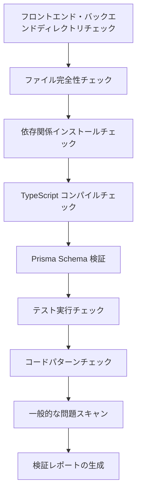

# ステージ 6：Validation - コード品質の検証

## この章でできること

- **自動コード検証**：ワンクリックでフロントエンド・バックエンドコードの依存関係、型チェック、基本テストを検証
- **検証レポートの読み取り**：Validation Agent が生成する詳細なレポートと問題分類を理解
- **問題の迅速な特定**：レポートの具体的な位置と修正提案に基づいてコードエラーを修正
- **コード品質の保証**：生成されたコードが本番環境準備完了基準を満たしていることを確認

## 現在直面している課題

Code ステージを完了し、フロントエンド・バックエンドコードを生成しましたが、最も頭を悩ませるのは：

- **コードが動くか**：依存関係は正しくインストールされているか？型チェックは通るか？
- **Prisma は正しいか**：スキーマ構文に問題はないか？クライアントを生成できるか？
- **テストは信頼できるか**：テストはあるか？通るか？
- **落とし穴はないか**：環境変数設定は正しいか？インポートパスは正しいか？

これらの問題を手動で一つずつチェックするには長い時間がかかり、見落としが生じやすいです。Validation ステージはまさにこれらの問題を解決するためにあります - 自動的にコード品質を検証し、詳細なレポートを生成します。

## この手法を使用するタイミング

以下の状況で必要です：

- **コードの迅速な検証**：生成されたコードが基本的な品質基準を満たしていることを確認する
- **潜在的な問題の発見**：デプロイ前に依存関係、型、テストなどの問題を見つける
- **コード品質の保証**：フロントエンド・バックエンドコードが基本チェックを通過できることを確認
- **デプロイ失敗の回避**：事前に問題を発見し、手戻りコストを削減

## 核心コンセプト

Validation Agent は**品質検査員**であり、Code Agent が生成したコードが品質基準を満たしているかを検証する任務を持っています。その核心的な特徴：

### 入力と出力

| タイプ | 内容 |
|------|------|
| **入力** | `artifacts/backend/`（バックエンドコード）、`artifacts/client/`（フロントエンドコード） |
| **出力** | `artifacts/validation/report.md`（検証レポート） |

### 検証チェック項目

Validation Agent は 8 大カテゴリのチェックを実行します：

| チェック項目 | 説明 |
|--------|------|
| **ファイル完全性** | すべての必須ファイルが存在することを確認 |
| **依存関係インストール** | `package.json` 依存関係が正常に解析できることを検証 |
| **TypeScript コンパイル** | コードが型チェックを通過しているかを確認 |
| **Prisma Schema** | データモデルの構文が正しいことを検証 |
| **テスト実行** | テストが存在し、通過することを確認 |
| **コード規約** | lint スクリプト設定をチェック |
| **キーパターン** | コード内のキーパターン（エラーハンドリング、ヘルスチェックなど）をスキャン |
| **一般的な問題** | 既知のエラーパターンを特定 |

### 実行制約

::: warning 読み取り専用モード
Validation Agent は**検証のみで変更しません**：
- コードファイルの変更を禁止
- 実際の依存関係インストールを禁止（`--dry-run` を使用）
- 副作用のあるコマンドの実行を禁止
:::

## 実践してみましょう

### ステップ 1：Validation ステージに入る

Code ステージを完了したと仮定し、コード品質の検証を開始します。

```bash
# パイプライン内の場合、次のステージに直接進む
factory run validation

# または、特定のステージからやり直す
factory run validation
```

**期待される表示**：CLI に Validation ステージの情報が表示されます。入力ファイルと期待される出力が含まれます。

### ステップ 2：AI アシスタントが Validation Agent を実行

AI アシスタントが `agents/validation.agent.md` を読み込み、実行を開始します。

Validation Agent の実行フロー：



**AI アシスタントは以下を実行します**：

1. **バックエンドディレクトリのチェック**
   - `artifacts/backend/` が存在することを確認
   - 必須ファイルのチェック：`package.json`、`tsconfig.json`、`.env.example`、`prisma/schema.prisma`

2. **フロントエンドディレクトリのチェック**
   - `artifacts/client/` が存在することを確認
   - 必須ファイルのチェック：`package.json`、`tsconfig.json`、`app.json`、`App.tsx`

3. **依存関係インストールチェック**
   - バックエンド：`cd artifacts/backend && npm install --dry-run`
   - フロントエンド：`cd artifacts/client && npm install --dry-run`
   - 依存関係が正常に解析できることを検証

4. **TypeScript コンパイルチェック**
   - バックエンド：`cd artifacts/backend && npx tsc --noEmit`
   - フロントエンド：`cd artifacts/client && npx tsc --noEmit`
   - コードが型チェックを通過しているかを確認

5. **Prisma Schema 検証**
   - `cd artifacts/backend && npx prisma validate`
   - データモデルの構文が正しいことを検証

6. **テスト実行チェック**
   - バックエンド：`cd artifacts/backend && npm test`
   - フロントエンド：`cd artifacts/client && npm test`
   - テストが存在し、通過することを確認

7. **コードパターンチェック**
   - キーパターンのスキャン：エラーハンドリング、ヘルスチェック、SafeAreaView など
   - 依存関係設定のチェック：dotenv、React Native Web など

8. **一般的な問題スキャン**
   - SQLite で `type` 定義を使用
   - 環境変数値に引用符がある
   - 間違ったインポートパス
   - 必要なインポートが欠けている

9. **検証レポートの生成**
   - すべてのチェック結果を要約
   - 発見された問題をリストアップ
   - 修正提案を提供
   - `artifacts/validation/report.md` に保存

### ステップ 3：検証レポートを確認

Validation Agent が完了すると、詳細な検証レポートが生成されます。

`artifacts/validation/report.md` を開きます：

```bash
cat artifacts/validation/report.md
```

**期待される表示**：

```markdown
# コード検証レポート

**生成時間**: 2026-01-29 12:00:00
**検証結果**: ✅ 通過

## 要約

- バックエンド検証: ✅
- フロントエンド検証: ✅
- 全体評価: コード品質は MVP 基準を満たしており、Preview ステージに進むことができます

---

## バックエンド検証詳細

### ファイル完全性
| ファイル | ステータス |
|------|------|
| package.json | ✅ |
| tsconfig.json | ✅ |
| .env.example | ✅ |
| prisma/schema.prisma | ✅ |
| src/index.ts | ✅ |
| src/app.ts | ✅ |

### 依存関係インストール
- ステータス: ✅
- 詳細: すべての依存関係が正常に解析できます

### TypeScript コンパイル
- ステータス: ✅
- エラー数: 0

### Prisma 検証
- ステータス: ✅
- 詳細: Prisma schema の構文が正しいです

### テスト実行
- ステータス: ✅
- テスト数: 12
- 通過数: 12
- 失敗数: 0

### コードパターンチェック
| チェック項目 | ステータス |
|--------|------|
| エラーハンドリングミドルウェア | ✅ |
| ヘルスチェックエンドポイント | ✅ |
| 環境変数の使用 | ✅ |
| Prisma Client インポート | ✅ |
| テストファイルが存在 | ✅ |
| dotenv の先頭行インポート | ✅ |

---

## フロントエンド検証詳細

### ファイル完全性
| ファイル | ステータス |
|------|------|
| package.json | ✅ |
| tsconfig.json | ✅ |
| app.json | ✅ |
| App.tsx | ✅ |
| src/navigation/index.tsx | ✅ |

### 依存関係インストール
- ステータス: ✅
- 詳細: すべての依存関係が正常に解析できます

### TypeScript コンパイル
- ステータス: ✅
- エラー数: 0

### テスト実行
- ステータス: ✅
- テスト数: 8
- 通過数: 8
- 失敗数: 0

### コードパターンチェック
| チェック項目 | ステータス |
|--------|------|
| SafeAreaView の使用 | ✅ |
| Loading コンポーネント | ✅ |
| エラーハンドリング | ✅ |
| API 呼び出しのカプセル化 | ✅ |
| React Native Web 依存関係 | ✅ |
| async-storage 依存関係 | ✅ |

---

## 発見された問題

重大な問題や警告はありません

---

## 修正提案

修正は不要です

---

## 結論

コード品質は MVP 基準を満たしており、Preview ステージに進むことを推奨します。
```

### ステップ 4：検証失敗の場合の処理

検証に失敗した場合、レポートに具体的な問題と修正提案がリストアップされます。

**例：部分的に通過した検証レポート**

```markdown
**検証結果**: ⚠️ 部分的に通過

## 発見された問題

### 重大な問題（修正必須）

1. TypeScript コンパイルエラー
   - 位置: src/controllers/items.ts:15
   - エラー: Property 'title' does not exist on type 'any'
   - 提案: 型定義 `const item: Item = req.body;` を追加

2. Prisma schema 検証失敗
   - 位置: prisma/schema.prisma:10
   - エラー: Invalid datasource provider 'sqlite'
   - 提案: `provider = "sqlite"` を `provider = "postgresql"` に変更（本番環境）

### 警告（修正推奨）

1. テストファイルが不足
   - 位置: src/controllers/
   - 提案: 各コントローラにテストファイルを追加

2. 環境変数設定が不完全
   - 位置: .env.example
   - 提案: `DATABASE_URL` の例を追加

## 修正提案

1. TypeScript エラーの修正：`src/controllers/items.ts` に型定義を追加
2. Prisma schema の更新：データソースの provider を変更
3. テストファイルの追加：コントローラにテストを記述
4. 環境変数の補完：`.env.example` を補充
```

**修正手順**：

1. **問題ファイルの特定**
   ```bash
   # 問題ファイルを開く
   vim artifacts/backend/src/controllers/items.ts
   ```

2. **コードの修正**
   ```typescript
   // 型定義を追加
   const item: Item = req.body;
   ```

3. **Prisma schema の更新**
   ```prisma
   datasource db {
     provider = "postgresql"  // postgresql に変更
     url      = env("DATABASE_URL")
   }
   ```

4. **再検証**
   ```bash
   # Validation ステージを再実行
   factory run validation
   ```

### ステップ 5：チェックポイントの確認

AI アシスタントが Validation ステージの完了を確認した時、次のように表示されます：

```
✅ Validation ステージ完了

生成されたファイル：
- 検証レポート：artifacts/validation/report.md

検証結果：✅ 通過 / ⚠️ 部分的に通過 / ❌ 失敗

チェックポイントオプション：
[1] 続行 - Preview ステージに進む
[2] リトライ - コードを再検証
[3] 一時停止 - 現在の状態を保存
```

- 検証に通過した場合、**続行** を選択して次のステージに進みます
- 問題がある場合、修正後に **リトライ** を選択して再検証します
- 修正に時間がかかる場合、**一時停止** を選択して現在の状態を保存します

## チェックポイント ✅

Validation ステージを完了したら、以下が達成されているはずです：

- [ ] バックエンドとフロントエンドのすべての必須ファイルが存在する
- [ ] 依存関係が正常に解析できる（`npm install --dry-run`）
- [ ] TypeScript コンパイルでエラーがない（`npx tsc --noEmit`）
- [ ] Prisma schema 検証が通過する（`npx prisma validate`）
- [ ] テストファイルが存在し、通過する（`npm test`）
- [ ] キーパターンチェックがすべて通過
- [ ] 検証レポートが生成されている（`artifacts/validation/report.md`）

## よくある落とし穴

### 問題 1：依存関係インストール失敗

**症状**：`npm install --dry-run` でエラー

**解決策**：

```bash
# package.json の構文をチェック
cat artifacts/backend/package.json

# よくある問題：
# - 引用符が欠けている
# - 依存関係名が間違っている
# - バージョン形式が正しくない

# 修正後に再検証
factory run validation
```

### 問題 2：TypeScript コンパイルエラー

**症状**：`npx tsc --noEmit` でエラー

**よくあるエラーの種類**：

| エラー | 原因 | 解決策 |
|------|------|----------|
| `Property does not exist` | 型が定義されていない | 型定義を追加 |
| `Module not found` | インポートパスが間違っている | インポートパスをチェック |
| `Implicit any` | 暗黙的な any 型 | 厳格モードを有効にし、型を追加 |

### 問題 3：Prisma schema 検証失敗

**症状**：`npx prisma validate` でエラー

**よくあるエラー**：

| エラー | 原因 | 解決策 |
|------|------|----------|
| `Invalid datasource provider` | provider が間違っている | `postgresql` または `sqlite` を使用 |
| `Error parsing` | 構文エラー | model 定義をチェック |
| `Relation error` | リレーション定義エラー | `@relation` フィールドをチェック |

### 問題 4：テスト失敗

**症状**：`npm test` でエラー

**解決策**：

```bash
# テストファイルが存在するかをチェック
find artifacts/backend -name "*.test.ts"

# テスト依存関係がインストールされているかをチェック
cat artifacts/backend/package.json | grep -A 5 "devDependencies"

# テスト依存関係が不足している場合、手動でインストール
cd artifacts/backend
npm install --save-dev vitest @testing-library/react-native
```

### 問題 5：キーパターンチェック失敗

**症状**：レポートにキーパターンが不足していると表示される

**よくある不足パターン**：

| パターン | 位置 | 修正方法 |
|------|------|----------|
| エラーハンドリングミドルウェア | `src/middleware/error.ts` | エラーハンドリングミドルウェアを追加 |
| ヘルスチェックエンドポイント | `src/routes/health.ts` | `/health` ルートを追加 |
| dotenv 先頭行インポート | `src/index.ts:1` | `import 'dotenv/config';` を追加 |
| SafeAreaView | `src/screens/Home.tsx` | SafeAreaView で内容をラップ |

## Validation Agent の特別な要件

Validation Agent にはいくつかの特別な制約と要件があり、特に注意が必要です：

### 1. 読み取り専用モード

::: warning コードの変更を禁止
Validation Agent は**いかなるコードファイルの変更も絶対に禁止**されており、検証とレポート生成のみを実行します。
:::

### 2. Dry-run インストール

依存関係インストールチェックは `--dry-run` パラメータを使用し、実際に依存関係をインストールしません：

```bash
npm install --dry-run  # 依存関係が解析できるかをチェックするのみ
```

### 3. 完全なレポート

Validation Agent は**必ず**完全な検証レポートを生成する必要があります。以下を含みます：

| セクション | 内容 |
|------|------|
| **要約** | バックエンド/フロントエンド検証ステータスと全体評価 |
| **バックエンド詳細** | ファイル完全性、依存関係、コンパイル、Prisma、テスト、パターンチェック |
| **フロントエンド詳細** | ファイル完全性、依存関係、コンパイル、テスト、パターンチェック |
| **発見された問題** | 重大な問題と警告のリスト |
| **修正提案** | 問題に対する具体的な修正手順 |
| **結論** | 全体評価と次のステップの推奨 |

### 4. 問題の分類

Validation Agent は問題を 3 つのレベルに分類します：

| レベル | 基準 | 処理方法 |
|------|------|----------|
| **重大な問題** | 修正しないと通過できない | レポートで「修正必須」とマーク |
| **警告** | 修正が推奨されるが致命的ではない | レポートで「修正推奨」とマーク |
| **情報** | 参考用のみ | 検証結果に影響しない |

## 検証結果の判定

Validation Agent はチェック結果に基づいて検証ステータスを判定します。

### 通過条件（✅ 通過）

- すべての必須ファイルが存在
- 依存関係インストールにエラーがない
- TypeScript コンパイルにエラーがない
- Prisma schema 検証が通過
- 基本テストが存在し、すべて通過
- キーパターンチェックがすべて通過

### 部分的通過条件（⚠️ 部分的に通過）

- 必須ファイルが存在
- 依存関係インストールにエラーがない
- TypeScript コンパイルに警告はあるがエラーはない
- テストはあるが一部失敗（失敗率 < 30%）
- 非致命的な問題が存在

### 失敗条件（❌ 失敗）

- 必須ファイルが不足している
- 依存関係インストールが失敗
- TypeScript コンパイルにエラーがある
- Prisma schema 検証が失敗
- テストが不足しているか、大量に失敗（失敗率 ≥ 30%）

## コード品質チェックリスト

Validation Agent は以下のチェックリストに照らして検証を行います。

### バックエンド必須項目

- [ ] `package.json` が存在
- [ ] `tsconfig.json` が存在
- [ ] `.env.example` が存在
- [ ] `prisma/schema.prisma` が存在
- [ ] `src/index.ts` が存在
- [ ] `src/app.ts` が存在
- [ ] `src/index.ts` の先頭行に dotenv インポート
- [ ] dotenv が dependencies にある
- [ ] エラーハンドリングミドルウェアが存在
- [ ] ヘルスチェックエンドポイントが存在（`/health`）
- [ ] 環境変数に `process.env` を使用
- [ ] Prisma Client のインポートが正しい
- [ ] 少なくとも 1 つのテストファイルが存在
- [ ] package.json に `test` スクリプトが含まれる

### フロントエンド必須項目

- [ ] `package.json` が存在
- [ ] `tsconfig.json` が存在
- [ ] `app.json` が存在
- [ ] `App.tsx` が存在
- [ ] `src/navigation/index.tsx` が存在
- [ ] SafeAreaView の使用が存在
- [ ] Loading コンポーネントが存在
- [ ] エラーハンドリングが存在
- [ ] API 呼び出しがカプセル化レイヤー経由
- [ ] React Native Web 依存関係が含まれる
- [ ] async-storage 依存関係が含まれる
- [ ] `app.json` が存在しない画像ファイルを参照していない

## よくある問題スキャン

Validation Agent は以下の既知の問題パターンをスキャンします：

| チェック項目 | 検出方法 | 修正提案 |
|--------|----------|----------|
| SQLite で `type` 定義を使用 | schema.prisma に `type Xxx` が含まれているかチェック | `type` 定義を削除 |
| 環境変数値に引用符 | .env に `="xxx"` や `='xxx'` が含まれているかチェック | 引用符を削除 |
| Prisma バージョンが 7.x | package.json の prisma バージョンが ^7 かチェック | Prisma 5.x を使用 |
| 間違ったインポートパス | screens に `from './ui/'` があるかチェック | `from '../components/ui/'` に変更 |
| View インポートが不足 | コンポーネントで View を使用しているがインポートしていないかチェック | `import { View } from 'react-native'` を追加 |
| 文字列が終了していない | .tsx ファイルに連続する引用符があるかチェック | 欠けている引用符を追加 |

## 検証レポートの例

### 通過した検証レポート

```markdown
# コード検証レポート

**生成時間**: 2026-01-29 12:00:00
**検証結果**: ✅ 通過

## 要約

- バックエンド検証: ✅
- フロントエンド検証: ✅
- 全体評価: コード品質は MVP 基準を満たしており、Preview ステージに進むことができます

---

## バックエンド検証詳細

### ファイル完全性
| ファイル | ステータス |
|------|------|
| package.json | ✅ |
| tsconfig.json | ✅ |
| .env.example | ✅ |
| prisma/schema.prisma | ✅ |
| src/index.ts | ✅ |
| src/app.ts | ✅ |

### 依存関係インストール
- ステータス: ✅
- 詳細: すべての依存関係が正常に解析できます

### TypeScript コンパイル
- ステータス: ✅
- エラー数: 0

### Prisma 検証
- ステータス: ✅
- 詳細: Prisma schema の構文が正しいです

### テスト実行
- ステータス: ✅
- テスト数: 12
- 通過数: 12
- 失敗数: 0

### コードパターンチェック
| チェック項目 | ステータス |
|--------|------|
| エラーハンドリングミドルウェア | ✅ |
| ヘルスチェックエンドポイント | ✅ |
| 環境変数の使用 | ✅ |
| Prisma Client インポート | ✅ |
| テストファイルが存在 | ✅ |
| dotenv の先頭行インポート | ✅ |

---

## フロントエンド検証詳細

### ファイル完全性
| ファイル | ステータス |
|------|------|
| package.json | ✅ |
| tsconfig.json | ✅ |
| app.json | ✅ |
| App.tsx | ✅ |
| src/navigation/index.tsx | ✅ |

### 依存関係インストール
- ステータス: ✅
- 詳細: すべての依存関係が正常に解析できます

### TypeScript コンパイル
- ステータス: ✅
- エラー数: 0

### テスト実行
- ステータス: ✅
- テスト数: 8
- 通過数: 8
- 失敗数: 0

### コードパターンチェック
| チェック項目 | ステータス |
|--------|------|
| SafeAreaView の使用 | ✅ |
| Loading コンポーネント | ✅ |
| エラーハンドリング | ✅ |
| API 呼び出しのカプセル化 | ✅ |
| React Native Web 依存関係 | ✅ |
| async-storage 依存関係 | ✅ |

---

## 発見された問題

重大な問題や警告はありません

---

## 修正提案

修正は不要です

---

## 結論

コード品質は MVP 基準を満たしており、Preview ステージに進むことを推奨します。
```

### 失敗した検証レポート

```markdown
# コード検証レポート

**生成時間**: 2026-01-29 12:00:00
**検証結果**: ❌ 失敗

## 要約

- バックエンド検証: ❌
- フロントエンド検証: ⚠️
- 全体評価: バックエンドに重大な問題があり、修正が必要です

---

## 発見された問題

### 重大な問題（修正必須）

1. TypeScript コンパイルエラー
   - 位置: src/controllers/items.ts:15
   - エラー: Property 'title' does not exist on type 'any'
   - 提案: 型定義 `const item: Item = req.body;` を追加

2. Prisma schema 検証失敗
   - 位置: prisma/schema.prisma:10
   - エラー: Invalid datasource provider 'sqlite'
   - 提案: `provider = "sqlite"` を `provider = "postgresql"` に変更

3. 必須ファイルが不足
   - 位置: src/
   - ファイル: src/middleware/error.ts
   - 提案: エラーハンドリングミドルウェアを作成

### 警告（修正推奨）

1. フロントエンドテスト失敗
   - 位置: src/screens/__tests__/HomeScreen.test.tsx
   - 失敗: 2/8 テストが失敗
   - 提案: テストケースを修正

2. Loading コンポーネントが不足
   - 位置: src/components/
   - 提案: Loading コンポーネントを作成し、正しく使用

---

## 修正提案

1. TypeScript エラーの修正：`src/controllers/items.ts` に型定義を追加
2. Prisma schema の更新：データソースの provider を postgresql に変更
3. エラーハンドリングミドルウェアの作成：`src/middleware/error.ts` を追加
4. フロントエンドテストの修正：失敗したテストケースをチェックして修正
5. Loading コンポーネントの作成：`src/components/Loading.tsx` を追加

---

## 結論

バックエンドに重大な問題があり、修正が必要です。推奨：
1. TypeScript コンパイルエラーを修正
2. Prisma schema を更新
3. 不足しているファイルを追加
4. Validation ステージを再実行
```

## この章のまとめ

Validation ステージはパイプラインの品質保証フェーズであり、生成されたコードが基本的な品質基準を満たしていることを確認します。

**重要ポイント**：

1. **検証フロー**：Validation Agent がファイル完全性、依存関係、コンパイル、テストなどを自動チェック
2. **読み取り専用モード**：検証のみで変更せず、`--dry-run` を使用して副作用を回避
3. **問題分類**：問題を重大、警告、情報の 3 レベルに分類
4. **詳細なレポート**：具体的な位置と修正提案を含む検証レポートを生成
5. **結果判定**：チェック結果に基づいて通過/部分的に通過/失敗を判定

## 次の章の予告

> 次の章では **[Preview ステージ](../stage-preview/)** を学びます。
>
> 学べること：
> - 実行説明ドキュメントを生成する方法
> - クイックスタートガイド
> - デプロイ設定（Docker、CI/CD）

---

## 付録：ソースコード参照

<details>
<summary><strong>クリックしてソースコードの場所を表示</strong></summary>

> 更新時間：2026-01-29

| 機能 | ファイルパス | 行番号 |
|------|----------|------|
| Validation Agent 定義 | [`agents/validation.agent.md`](https://github.com/hyz1992/agent-app-factory/blob/main/agents/validation.agent.md) | 1-320 |
| パイプライン定義 | [`pipeline.yaml`](https://github.com/hyz1992/agent-app-factory/blob/main/pipeline.yaml) | 79-96 |

**重要な制約**：
- コードファイルの変更を禁止（`validation.agent.md:293`）
- 実際の依存関係インストールを禁止、`--dry-run` を使用（`validation.agent.md:294`）
- 完全な検証レポートを生成する必要がある（`validation.agent.md:296`）
- 具体的な修正提案を提供する必要がある（`validation.agent.md:298`）

**検証チェック項目**：
- ファイル完全性チェック（`validation.agent.md:24-42`）
- 依存関係インストールチェック（`validation.agent.md:43-53`）
- TypeScript コンパイルチェック（`validation.agent.md:55-65`）
- Prisma Schema 検証（`validation.agent.md:67-73`）
- テスト実行チェック（`validation.agent.md:75-85`）
- コード規約チェック（`validation.agent.md:87-97`）
- キーパターンチェック（`validation.agent.md:99-122`）
- よくある問題スキャン（`validation.agent.md:124-136`）

**検証結果判定**：
- 通過条件（`validation.agent.md:268-274`）
- 部分的通過条件（`validation.agent.md:276-281`）
- 失敗条件（`validation.agent.md:283-288`）

**実行フロー**：
- 操作手順（`validation.agent.md:303-313`）
- 出力フォーマット（`validation.agent.md:139-262`）

</details>
