# 7段階パイプライン概要

## 学習目標

- 7段階パイプラインの完全フローと各段階の責務を理解する
- 各段階の入力・出力・終了条件を知る
- チェックポイントメカニズムが品質を保証する仕組みを理解する
- SisyphusスケジューラーがAgentの実行を調整する方法を理解する
- 権限マトリクスがAgentの越権を防ぐ仕組みをマスターする
- 「新規セッションで継続」機能を活用してTokenを節約する方法を学ぶ

## コア概念

**パイプラインとは？**

AI App Factoryのパイプラインは、製品アイデアを段階的に動作するアプリケーションに変換する自動化された生産ラインです。工場の生産ラインのように、原材料（製品アイデア）が7つの工程（段階）を経て、最終的に製品（完成したアプリケーション）が出力されます。

各工程は専用のAgentが担当し、それぞれが自分の責務を果たし、互いに干渉しません：

| 段階 | Agent | 責務 | 産物 |
| ----- | ----- | ---- | ---- |
| Bootstrap | Bootstrap Agent | 製品アイデアを深く掘り下げる | `input/idea.md` |
| PRD | PRD Agent | 製品要件書を生成 | `artifacts/prd/prd.md` |
| UI | UI Agent | インターフェースとプロトタイプを設計 | `artifacts/ui/ui.schema.yaml` + プレビューページ |
| Tech | Tech Agent | 技術アーキテクチャを設計 | `artifacts/tech/tech.md` + Prisma Schema |
| Code | Code Agent | 実行可能なコードを生成 | `artifacts/backend/` + `artifacts/client/` |
| Validation | Validation Agent | コード品質を検証 | `artifacts/validation/report.md` |
| Preview | Preview Agent | デプロイガイドを生成 | `artifacts/preview/README.md` |

**主な特徴**

1. **チェックポイントメカニズム**：各段階の完了後に一時停止し、確認後でなければ続行しません
2. **権限分離**：各Agentは許可されたディレクトリのみ読み書きでき、汚染を防ぎます
3. **失敗時のロールバック**：段階が失敗すると自動で再試行し、連続失敗の場合は直近の成功チェックポイントへロールバックします
4. **コンテキスト最適化**：新規セッションでの継続実行をサポートし、Tokenを節約します

## パイプライン全体像

```mermaid
graph LR
    A[Bootstrap<br/>製品アイデアの構造化] -->|idea.md| B[PRD<br/>要件書生成]
    B -->|prd.md| C[UI<br/>インターフェース・プロトタイプ設計]
    C -->|ui.schema.yaml| D[Tech<br/>技術アーキテクチャ設計]
    D -->|tech.md + schema.prisma| E[Code<br/>実行可能なコード生成]
    E -->|backend + client| F[Validation<br/>コード品質検証]
    F -->|検証レポート| G[Preview<br/>デプロイガイド生成]
    
    style A fill:#e0f2fe
    style B fill:#f0fdf4
    style C fill:#fef3c7
    style D fill:#ede9fe
    style E fill:#fce7f3
    style F fill:#dbeafe
    style G fill:#d1fae5
```



**パイプライン実行ルール**

::: tip 実行ルール

1. **厳密な順序**：Bootstrapから開始し、Previewまで順に実行。スキップや並列実行は不可
2. **単一Agentアクティブ**：同時に稼働できるAgentは1つのみ
3. **遡り不可**：確認済みの産物は修正できず、当該段階を再実行するのみ可能

注意：これらはパイプラインの実行ルールであり、チェックポイントオプションの数を意味しません。各段階完了後、Sisyphusは5つのチェックポイントオプションを提供します（詳細は後述の「チェックポイントメカニズム」を参照）。

:::

## 各段階の詳細

### 段階 1：Bootstrap - 製品アイデアの構造化

**何をする？**

ユーザーが提供する自然言語での製品記述を構造化されたドキュメントに変換し、問題・ユーザー・価値・仮説を深く掘り下げます。

**なぜ重要？**

明確な製品定義はパイプライン全体の基礎です。このステップが不適切だと、後続の全段階が方向を逸脱します。

**入力と出力**

| 種類 | パス | 説明 |
| ---- | ---- | ---- |
| 入力 | ユーザーの自然言語記述 | 例：「家計簿アプリを作りたい」 |
| 出力 | `input/idea.md` | 構造化された製品アイデアドキュメント |

**終了条件**

- [ ] `idea.md` が存在する
- [ ] 一貫性のある製品アイデアを記述している
- [ ] Agentが `superpowers:brainstorm` スキルを使用して深く掘り下げている

**強制スキル使用**

::: warning superpowers:brainstorm の使用が必須

Bootstrap段階では `superpowers:brainstorm` スキルを使用して深く掘り下げることが必須です。Agentがこのスキルの使用に言及していない場合、産物は拒否され、再実行が求められます。

:::

### 段階 2：PRD - 製品要件書の生成

**何をする？**

構造化された製品アイデアをMVPレベルの製品要件書に変換し、機能範囲・非目標・ユーザーストーリーを明確化します。

**なぜ重要？**

PRDは設計と開発の「契約」であり、「何をするか」と「何をしないか」を明確にし、スコープクリープを防ぎます。

**入力と出力**

| 種類 | パス | 説明 |
| ---- | ---- | ---- |
| 入力 | `input/idea.md` | Bootstrap段階の出力である構造化されたアイデア |
| 出力 | `artifacts/prd/prd.md` | MVPレベルの製品要件書 |

**終了条件**

- [ ] PRDにターゲットユーザーが含まれている
- [ ] PRDでMVP範囲が定義されている
- [ ] PRDに非目標がリストされている
- [ ] PRDに技術的な実装詳細が含まれていない

**注意：PRDには技術詳細を含めない**

PRDは「ユーザーが何を必要としているか」を記述し、「どのように実装するか」ではありません。技術実装の詳細はTechとCode段階が担当します。

### 段階 3：UI - インターフェースとプロトタイプの設計

**何をする？**

PRDに基づいてUI構造・カラースキームを設計し、ブラウザでプレビュー可能なHTMLプロトタイプを生成します。

**なぜ重要？**

視覚的なデザインにより、チームと初期ユーザーが製品の形態を直感的に理解でき、開発の手戻りを減らします。

**入力と出力**

| 種類 | パス | 説明 |
| ---- | ---- | ---- |
| 入力 | `artifacts/prd/prd.md` | PRDドキュメント |
| 出力 | `artifacts/ui/ui.schema.yaml` | UI構造定義 |
| 出力 | `artifacts/ui/preview.web/index.html` | プレビュー可能なHTMLプロトタイプ |

**終了条件**

- [ ] `ui.schema.yaml` が存在する
- [ ] ページ数が3以下
- [ ] プレビューページがブラウザで開ける
- [ ] Agentが `ui-ux-pro-max` スキルを使用している

**強制スキル使用**

::: warning ui-ux-pro-max の使用が必須

UI段階では `ui-ux-pro-max` スキルを使用してプロフェッショナルなデザインシステムを生成することが必須です。このスキルには67種類のスタイル、96種類のカラーパレット、100の業界ルールが含まれています。

:::

### 段階 4：Tech - 技術アーキテクチャの設計

**何をする？**

最小限の実用的な技術アーキテクチャとデータモデルを設計し、技術スタックを選択し、APIエンドポイントを定義します。

**なぜ重要？**

技術アーキテクチャはコードの保守性・拡張性・パフォーマンスを決定します。過度な設計は開発を困難にし、不十分な設計は要件を支えられません。

**入力と出力**

| 種類 | パス | 説明 |
| ---- | ---- | ---- |
| 入力 | `artifacts/prd/prd.md` | PRDドキュメント |
| 出力 | `artifacts/tech/tech.md` | 技術アーキテクチャドキュメント |
| 出力 | `artifacts/backend/prisma/schema.prisma` | Prismaデータモデル |

**終了条件**

- [ ] 技術スタックが明確に宣言されている
- [ ] データモデルがPRDと整合している
- [ ] 過度な最適化やオーバーデザインが行われていない

**技術スタックのデフォルト選択**

- バックエンド：Node.js + Express + Prisma
- データベース：SQLite（開発）/ PostgreSQL（本番）
- フロントエンド：React Native + Expo

### 段階 5：Code - 実行可能なコードの生成

**何をする？**

UI Schema・Tech設計・Prisma Schemaに基づいて、完全なフロントエンド・バックエンドコード・テスト・設定・ドキュメントを生成します。

**なぜ重要？**

これは「アイデアからアプリへ」の重要なステップであり、生成されるコードは実行可能で本番対応品質です。

**入力と出力**

| 種類 | パス | 説明 |
| ---- | ---- | ---- |
| 入力 | `artifacts/ui/ui.schema.yaml` | UI構造定義 |
| 入力 | `artifacts/tech/tech.md` | 技術アーキテクチャドキュメント |
| 入力 | `artifacts/backend/prisma/schema.prisma` | データモデル |
| 出力 | `artifacts/backend/` | バックエンドコード（Express + Prisma） |
| 出力 | `artifacts/client/` | フロントエンドコード（React Native） |

**終了条件**

- [ ] バックエンドが起動可能で重大なエラーがない
- [ ] クライアントがレンダリング可能でアクセス可能
- [ ] 追加の認証や無関係な機能が導入されていない

**生成される内容**

Code Agentは以下を生成します：

**バックエンド**：
- Expressサーバー + ルート
- Prisma ORM + データモデル
- 単体テスト・結合テスト（Vitest）
- APIドキュメント（Swagger/OpenAPI）
- シードデータ（`prisma/seed.ts`）
- Docker設定
- ログとモニタリング

**フロントエンド**：
- React Nativeページとコンポーネント
- React Navigationルート
- 単体テスト（Jest + React Testing Library）
- 環境設定

::: info なぜ認証機能を生成しない？

AI App FactoryはMVPにフォーカスしており、デフォルトでは認証・認可などの複雑な機能を生成しません。これらの機能は後続のイテレーションで追加できます。

:::

### 段階 6：Validation - コード品質の検証

**何をする？**

生成されたコードが依存関係のインストール・型チェック・コード規約を通過できるかを検証します。

**なぜ重要？**

コードを実行する前に問題を発見し、デプロイ後にエラーが判明するのを防ぎ、デバッグ時間を節約します。

**入力と出力**

| 種類 | パス | 説明 |
| ---- | ---- | ---- |
| 入力 | `artifacts/backend/` | バックエンドコード |
| 入力 | `artifacts/client/` | フロントエンドコード |
| 出力 | `artifacts/validation/report.md` | 検証レポート |

**終了条件**

- [ ] 検証レポートが生成されている
- [ ] バックエンドの依存関係が正常に解決できる
- [ ] フロントエンドの依存関係が正常に解決できる
- [ ] TypeScriptコンパイルで深刻なエラーがない
- [ ] Prismaスキーマ検証が通っている

**検証内容**

Validation Agentは以下をチェックします：

1. **依存関係解決**：`npm install` が成功するか
2. **型チェック**：`tsc --noEmit` が通るか
3. **コード規約**：`policies/code-standards.md` に準拠しているか
4. **Prisma Schema**：`prisma validate` が通るか
5. **テスト通過率**：テストが存在し、実行可能か

**失敗処理**

検証が失敗した場合、Validation Agentは詳細なエラーレポートを生成し、具体的な問題と修正提案を提示します。

### 段階 7：Preview - デプロイガイドの生成

**何をする？**

全ての産物をまとめ、完全な実行手順・デプロイ設定・デモフロードキュメントを生成します。

**なぜ重要？**

これはパイプラインの最終段階であり、生成されたアプリケーションを迅速に実行・デプロイできるようにします。

**入力と出力**

| 種類 | パス | 説明 |
| ---- | ---- | ---- |
| 入力 | `artifacts/backend/` | バックエンドコード |
| 入力 | `artifacts/client/` | フロントエンドコード |
| 出力 | `artifacts/preview/README.md` | 完全な実行手順 |
| 出力 | `artifacts/preview/GETTING_STARTED.md` | クイックスタートガイド |

**終了条件**

- [ ] READMEにインストール手順が含まれている
- [ ] READMEに実行コマンドが含まれている
- [ ] READMEにアクセスURLとデモフローがリストされている

**生成される内容**

Preview Agentは以下を生成します：

- ローカル実行手順（Web・iOS・Android）
- Dockerデプロイ設定（`docker-compose.yml`）
- CI/CD設定参考（GitHub Actions）
- Git Hooks設定参考（Husky）
- データベース移行ガイド（SQLite → PostgreSQL）

## チェックポイントメカニズム

**チェックポイントとは？**

各段階完了後、パイプラインは一時停止し、生成された産物リストを提示して期待通りか確認を求めます。期待通りでない場合、「再試行」や「修正後に再実行」を選択できます。

**なぜチェックポイントが必要？**

- **エラーの蓄積防止**：初期の問題を現在の段階で解決しないと、後続段階でエラーが拡大します
- **品質保証**：各段階で出力が期待通りであることを保証し、使用不可なコードの生成を防ぎます
- **柔軟な制御**：任意のチェックポイントで一時停止・再試行・入力修正が可能です

**チェックポイントオプション**

各段階完了後、Sisyphusスケジューラーは以下のオプションを提示します：

```
┌──────┬──────────────────────────────────────────────────────┐
│ オプション │ 説明                                                  │
├──────┼──────────────────────────────────────────────────────┤
│  1   │ 次の段階へ（同一セッション）                               │
│      │ [次の段階名] 段階を実行します                              │
├──────┼──────────────────────────────────────────────────────┤
│  2   │ 新規セッションで継続 ⭐ 推奨オプション、Token節約         │
│      │ 新規コマンドラインウィンドウで実行：factory continue      │
│      │ （自動的に新しいClaude Codeウィンドウを起動し、パイプラインを継続） │
├──────┼──────────────────────────────────────────────────────┤
│  3   │ 当該段階を再実行                                         │
│      │ [現在の段階名] 段階を再実行します                          │
├──────┼──────────────────────────────────────────────────────┤
│  4   │ 産物を修正後に再実行                                     │
│      │ [特定の入力ファイル] を修正後に再実行                     │
├──────┼──────────────────────────────────────────────────────┤
│  5   │ パイプラインを一時停止                                   │
│      │ 現在の進捗を保存し、後で継続                             │
└──────┴──────────────────────────────────────────────────────┘
```

**推奨される方法**

::: tip 「新規セッションで継続」を選択してTokenを節約

各段階完了後、「新規セッションで継続」（オプション2）を選択することを推奨します：

1. 新規コマンドラインウィンドウで `factory continue` を実行
2. コマンドが自動的に新しいClaude Codeウィンドウを起動
3. 各段階がクリーンなコンテキストを専有し、Tokenの蓄積を回避

:::

## 権限マトリクス

**なぜ権限分離が必要？**

Agentが任意のディレクトリを自由に読み書きできると、以下の問題が発生する可能性があります：

- Bootstrap Agentが誤って完成済みのPRDを修正する
- Code Agentが誤ってUI設計を削除する
- Validation Agentが誤ってバックエンドコードを修正する

**能力境界マトリクス**

Sisyphusスケジューラーは各段階の実行前後でAgentの権限をチェックします：

| Agent | 読み取り可能 | 書き込み可能 |
| ----- | ------ | ------ |
| bootstrap | なし | `input/` |
| prd | `input/` | `artifacts/prd/` |
| ui | `artifacts/prd/` | `artifacts/ui/` |
| tech | `artifacts/prd/` | `artifacts/tech/`, `artifacts/backend/prisma/` |
| code | `artifacts/ui/`, `artifacts/tech/`, `artifacts/backend/prisma/` | `artifacts/backend/`, `artifacts/client/` |
| validation | `artifacts/backend/`, `artifacts/client/` | `artifacts/validation/` |
| preview | `artifacts/backend/`, `artifacts/client/` | `artifacts/preview/` |

**越権処理**

Agentが未許可のディレクトリに書き込んだ場合、Sisyphusスケジューラーはファイルを `artifacts/_untrusted/<stage-id>/` に移動し、パイプラインを一時停止して報告します。

::: warning 越権の例

PRD Agentが `artifacts/ui/ui.schema.yaml` に書き込んだと仮定します（これはその権限範囲ではありません）。スケジューラーは：

1. ファイルを `artifacts/_untrusted/prd/ui.schema.yaml` に移動
2. パイプラインを一時停止
3. 報告：越権書き込みを検出しました。手動処理が必要です

:::

## 失敗処理

**何を失敗とみなす？**

- 出力ファイルが存在しない
- 産物の内容が `exit_criteria` を満たしていない
- Agentが未許可のディレクトリに書き込んだ
- スクリプトエラーまたは入力が読み取れない

**デフォルト処理戦略**

1. **自動再試行**：各段階で自動再試行を1回許可
2. **失敗アーカイブ**：失敗した産物を `artifacts/_failed/<stage-id>/` に移動
3. **パイプライン一時停止**：連続2回失敗後、手動介入を待機
4. **ロールバックメカニズム**：直近の成功チェックポイントへロールバックして再実行

::: tip 手動介入後の処理

連続2回失敗した場合、以下が可能です：

1. 入力ファイルを修正（例：`input/idea.md`）
2. Agentプロンプトを調整
3. 権限問題を修正
4. `factory run [stage]` を実行して当該段階から再開

:::

## 状態管理

**状態ファイル**

パイプラインの全状態は `.factory/state.json` に保存されます：

```json
{
  "version": 1,
  "status": "waiting_for_confirmation",
  "current_stage": "prd",
  "completed_stages": ["bootstrap"],
  "started_at": "2026-01-29T10:00:00Z",
  "last_updated": "2026-01-29T10:30:00Z"
}
```

**状態マシン**

| 状態 | 意味 | トリガー条件 |
| ---- | ---- | -------- |
| idle | 未起動 | `factory run` を待機中 |
| running | 実行中 | 某Stageの実行開始 |
| waiting_for_confirmation | 確認待ち | 段階完了 |
| paused | 一時停止中 | ユーザーが一時停止を選択 |
| failed | 失敗で介入が必要 | 連続失敗または越権操作 |

Sisyphusスケジューラーのみが状態を更新する権限を持ちます。

## よくある失敗

### よくあるエラー 1：Bootstrap段階でbrainstormスキルを使用していない

**現象**：Sisyphusが `input/idea.md` を拒否し、「superpowers:brainstorm スキルを使用していません」と提示される。

**原因**：Bootstrap Agentが `superpowers:brainstorm` スキルを使用して製品アイデアを深く掘り下げていませんでした。

**解決方法**：産物確認時に「当該段階を再実行」を選択し、Agentに `superpowers:brainstorm` スキルの使用を明示的に要求します。

### よくあるエラー 2：UI段階のデザインが平凡

**現象**：生成されたUIデザインが画一的で、全てが紫のグラデーションとInterフォント。

**原因**：UI Agentが `ui-ux-pro-max` スキルを使用していませんでした。

**解決方法**：産物確認時に「当該段階を再実行」を選択し、Agentに `ui-ux-pro-max` スキルの使用を明示的に要求し、明確な審美方向（例：「サイバーパンク」「ミニマリズム」）を指定します。

### よくあるエラー 3：Code段階で認証機能が生成された

**現象**：生成されたバックエンドコードにJWT認証・ユーザーログインなどの複雑な機能が含まれている。

**原因**：Code AgentがMVP範囲を超過しました。

**解決方法**：PRDを修正し、「非目標」（例：「ユーザーログインはサポートしない」「マルチユーザー協働はサポートしない」）を明確にリストし、Code段階を再実行します。

### よくあるエラー 4：Token消費が過大

**現象**：パイプラインが後半に進むとToken消費が急増し、AIアシスタントの応答が遅くなる。

**原因**：同一セッションで複数の段階を実行し、コンテキストが蓄積されています。

**解決方法**：**常に「新規セッションで継続」（オプション2）を選択し、各段階がクリーンなコンテキストを専有するようにします**。

## 本レッスンのまとめ

- パイプラインは7段階で構成されます：Bootstrap → PRD → UI → Tech → Code → Validation → Preview
- 各段階完了後に確認を一時停止し、出力が期待通りかを保証します
- SisyphusスケジューラーがAgentの実行を調整し、状態と権限を管理します
- 能力境界マトリクスがAgentの越権を防ぎ、責務分離を保証します
- 「新規セッションで継続」を選択すると、Tokenを大幅に節約できます

## 次回レッスンの予告

> 次回レッスンでは **[Claude Code統合ガイド](../../platforms/claude-code/)** を学びます。
>
> 学習内容：
> - Claude Codeの権限を設定する方法
> - パイプラインを実行する方法
> - Claude Codeのベストプラクティス

---

## 付録：ソースコード参照

<details>
<summary><strong>クリックしてソースコードの場所を展開</strong></summary>

> 更新日：2026-01-29

| 機能 | ファイルパス | 行番号 |
| --- | --- | --- |
| パイプライン定義 | [`pipeline.yaml`](https://github.com/hyz1992/agent-app-factory/blob/main/pipeline.yaml) | 1-111 |
| スケジューラーコア | [`agents/orchestrator.checkpoint.md`](https://github.com/hyz1992/agent-app-factory/blob/main/agents/orchestrator.checkpoint.md) | 1-302 |
| プロジェクトREADME | [`README.md`](https://github.com/hyz1992/agent-app-factory/blob/main/README.md) | 1-253 |

**重要な定数**：
- パイプラインモード：`checkpoint`（チェックポイントモード、各段階で確認待機）

**重要なAgent定義**：
- **Bootstrap Agent**：`superpowers:brainstorm` スキルを使用し、`input/idea.md` を生成
- **PRD Agent**：`input/idea.md` を読み取り、`artifacts/prd/prd.md` を生成
- **UI Agent**：`ui-ux-pro-max` スキルを使用し、`artifacts/ui/ui.schema.yaml` とプレビューページを生成
- **Tech Agent**：`artifacts/tech/tech.md` と `artifacts/backend/prisma/schema.prisma` を生成
- **Code Agent**：UI・Tech・Schemaに基づいて `artifacts/backend/` と `artifacts/client/` を生成
- **Validation Agent**：コード品質を検証し、`artifacts/validation/report.md` を生成
- **Preview Agent**：`artifacts/preview/README.md` を生成

</details>
