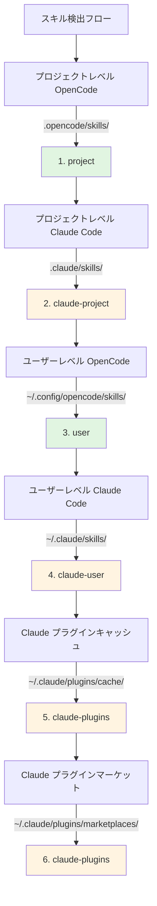

# Claude Code スキル互換性

## 学習後にできること

- プラグインが Claude Code のスキル形式と自動的に互換性を持つ仕組みを理解する
- ツールマッピングメカニズムを習得し、Claude スキルを OpenCode で正しく動作させる
- スキル検出の完全な優先順位ルールを理解する
- Claude プラグインマーケットの既存スキルを書き直すことなく再利用する

## 現在の課題

すでに Claude Code のスキルをお持ちの方、または Claude プラグインマーケットのスキルを使いたい方がいらっしゃるでしょう。しかし、これらのスキルは Claude Code 向けに書かれています。OpenCode で直接使用すると問題が発生します：

- Claude スキル内のツール呼び出し（`TodoWrite`、`Task` など）が OpenCode に存在しない
- OpenCode がインストール済みの Claude プラグインスキルをどのように見つけるか不明
- スキル形式の非互換性を心配し、すべてを書き直す必要があるのではないかと懸念

## 核心的なアプローチ

OpenCode Agent Skills プラグインは**3層の互換性メカニズム**により、修正なしで Claude Code スキルを使用できます：

1. **自動検出** - Claude Code の標準ディレクトリ（`.claude/skills/`、`~/.claude/plugins/`）からスキルをスキャン
2. **ツールマッピング** - スキル読み込み時にツールマッピングガイドを自動注入し、Claude のツール名を OpenCode のツール名に変換
3. **形式サポート** - Claude プラグインの v1 と v2 両方のインストール形式をサポート

::: info キーコンセプト
**Claude Code スキル形式** - Anthropic が定義したスキル仕様。`SKILL.md` ファイルでスキルを記述し、YAML frontmatter（メタデータ）と Markdown コンテンツ（指示）を含みます。
:::

### ツールマッピングの原理

プラグインが Claude Code で書かれたスキルの読み込みを検出すると、ツールマッピングガイドを自動的に注入します：

| Claude Code ツール | OpenCode ツール | マッピングルール |
| --- | --- | --- |
| `TodoWrite/TodoRead` | `todowrite/todoread` | 小文字化 |
| `Task`（サブエージェント） | `task`（subagent_type パラメータ付き） | パラメータ使用に変更 |
| `Skill` | `use_skill` | ツール名を置換 |
| `Read/Write/Edit/Bash/Glob/Grep/WebFetch` | `read/write/edit/bash/glob/grep/webfetch` | 小文字化 |

**マッピング方式**：プラグインはスキル読み込み時に、マッピングガイドを XML としてセッションコンテキストに注入します。AI はマッピングに従って正しいツールを自動的に呼び出します。

::: tip なぜマッピングが必要なのか？
Claude Code と OpenCode ではツールの命名規則が異なります。Claude は PascalCase（例：`TodoWrite`）を使用し、OpenCode は小文字（例：`todowrite`）を使用します。ツールマッピングにより、AI は呼び出しの変換方法を理解できます。
:::

### スキル検出の優先順位

プラグインは以下の順序でスキルを検出し、**最初にマッチしたスキルが有効**になります（同名スキルは重複しません）：



**優先順位ルール**：
- プロジェクトレベルのスキルがユーザーレベルのスキルを上書き（プロジェクトごとのカスタマイズが容易）
- OpenCode スキルが Claude スキルより優先（混乱を回避）
- 同名スキルは最初に検出されたバージョンのみ保持

::: details 例：同名スキルの上書き
2つの場所に `git-helper` という名前のスキルがあると仮定します：
- `.claude/skills/git-helper/SKILL.md`（Claude バージョン）
- `.opencode/skills/git-helper/SKILL.md`（OpenCode バージョン）

**結果**：OpenCode バージョンが有効（優先順位が高い）
:::

## 🎒 開始前の準備

- OpenCode Agent Skills プラグインがインストール・設定済み
- 基本的なスキルの概念を理解している（先に[OpenCode Agent Skills とは？](../../start/what-is-opencode-agent-skills/)を読むことを推奨）
- （オプション）Claude Code のインストール済みプラグインまたはスキルがある

## 実践ガイド

### ステップ 1：Claude スキルが検出されているか確認

**目的**
プラグインが Claude Code のスキルディレクトリを正しくスキャンできていることを確認します。

OpenCode でツールを呼び出します：

```
get_available_skills()
```

**期待される結果**：返されるスキルリストに `.claude/skills/`、`~/.claude/skills/`、`~/.claude/plugins/` からのスキルが含まれ、各スキルの `source` フィールドにソース（`claude-project`、`claude-user`、`claude-plugins` など）が表示されます。

**チェックポイント ✅**：リストに期待する Claude スキルが含まれていることを確認。

### ステップ 2：Claude スキルを読み込む

**目的**
ツールマッピングメカニズムが正常に動作しているか検証します。

ツールを呼び出して Claude スキルを読み込みます：

```
use_skill(skill="スキル名")
```

**期待される結果**：成功メッセージが返される（例：`Skill "xxx" loaded.`）。

**チェックポイント ✅**：AI がそのスキルの指示を使用できるようになりました。

### ステップ 3：ツールマッピングの動作を検証

**目的**
AI が Claude のツールではなく OpenCode のツールを正しく呼び出せることを確認します。

AI にそのスキルのツールを必要とするタスクを依頼します。例：

```
スキルの todo 機能を使ってタスクリストを作成してください。
```

**期待される結果**：AI が Claude の `TodoWrite` ツールではなく、OpenCode の `todowrite` ツールを正しく呼び出します。

::: tip マッピングが有効かどうかの確認方法
AI のツール呼び出しログ（デバッグモードが有効な場合）を確認すると、`TodoWrite` ではなく `todowrite` が呼び出されていることがわかります。
:::

**チェックポイント ✅**：ツール呼び出しが成功し、タスクが完了。

## よくある問題と解決策

### 1. プラグイン形式の不一致

**問題**：古い Claude プラグインは v1 形式を使用し、新しいものは v2 形式を使用するため、一部のスキルが検出されない。

**原因**：v1 と v2 では `installed_plugins.json` の構造が異なります。

**解決策**：プラグインは両方の形式をサポートしているため、手動変換は不要です。それでもスキルが検出されない場合は、`~/.claude/plugins/installed_plugins.json` が存在し、形式が正しいか確認してください。

### 2. ツールマッピングが機能しない

**問題**：AI が依然として Claude のツール名を呼び出し、エラーが発生する。

**原因**：スキルの内容がツールマッピングガイドをバイパスしているか、ハードコードされたツール呼び出しを使用している可能性があります。

**解決策**：
- スキルが読み込み後に使用されていることを確認（ツールを直接呼び出すのではなく）
- スキル内にコード例がある場合は、ツール名を手動で OpenCode 形式に変更

### 3. スキル名の競合

**問題**：同名のスキルが異なる場所にあり、間違ったバージョンが読み込まれる。

**原因**：スキル検出の優先順位による上書き。

**解決策**：
- スキルの `source` フィールドを確認してソースを特定
- 名前空間形式を使用してソースを明示的に指定：`use_skill(skill="user:skill-name")` または `use_skill(skill="claude-plugins:skill-name")`

::: details 名前空間構文
プラグインは `namespace:skill-name` 形式をサポートしています：
- `project:skill-name` - プロジェクトレベルの OpenCode スキル
- `claude-project:skill-name` - プロジェクトレベルの Claude スキル
- `user:skill-name` - ユーザーレベルの OpenCode スキル
- `claude-user:skill-name` - ユーザーレベルの Claude スキル
- `claude-plugins:skill-name` - Claude プラグインマーケットのスキル
:::

## このレッスンのまとめ

OpenCode Agent Skills プラグインは、3層の互換性メカニズムにより、Claude Code スキルをシームレスに再利用できます：

- **自動検出** - 6つの場所からスキルをスキャン（プロジェクトレベル、ユーザーレベル、プラグインレベルをカバー）
- **ツールマッピング** - Claude のツール名を OpenCode のツール名に自動変換
- **形式サポート** - v1 と v2 両方の Claude プラグイン形式をサポート

スキルを書き直す必要はありません。インストールして使用するだけで、プラグインが互換性の問題を自動的に処理します。

## 次のレッスン予告

> 次のレッスンでは **[Superpowers ワークフロー統合](../superpowers-integration/)** を学びます。
>
> 学習内容：
> - Superpowers モードを有効にする方法
> - Superpowers スキルの自動検出と読み込み
> - 厳格なワークフローによる開発効率の向上

---

## 付録：ソースコード参照

<details>
<summary><strong>クリックしてソースコードの場所を表示</strong></summary>

> 更新日：2026-01-24

| 機能 | ファイルパス | 行番号 |
| --- | --- | --- |
| ツールマッピング定義 | [`src/claude.ts`](https://github.com/joshuadavidthomas/opencode-agent-skills/blob/main/src/claude.ts#L19-L25) | 19-25 |
| v1/v2 形式の型定義 | [`src/claude.ts`](https://github.com/joshuadavidthomas/opencode-agent-skills/blob/main/src/claude.ts#L35-L61) | 35-61 |
| プラグインインストールパス抽出 | [`src/claude.ts`](https://github.com/joshuadavidthomas/opencode-agent-skills/blob/main/src/claude.ts#L68-L77) | 68-77 |
| プラグインスキル検出 | [`src/claude.ts`](https://github.com/joshuadavidthomas/opencode-agent-skills/blob/main/src/claude.ts#L82-L105) | 82-105 |
| マーケットスキル検出 | [`src/claude.ts`](https://github.com/joshuadavidthomas/opencode-agent-skills/blob/main/src/claude.ts#L115-L180) | 115-180 |
| キャッシュスキル検出 | [`src/claude.ts`](https://github.com/joshuadavidthomas/opencode-agent-skills/blob/main/src/claude.ts#L193-L253) | 193-253 |
| スキル検出優先順位リスト | [`src/skills.ts`](https://github.com/joshuadavidthomas/opencode-agent-skills/blob/main/src/skills.ts#L241-L254) | 241-254 |
| 同名スキル重複排除ロジック | [`src/skills.ts`](https://github.com/joshuadavidthomas/opencode-agent-skills/blob/main/src/skills.ts#L256-L260) | 256-260 |
| toolTranslation インポート | [`src/tools.ts`](https://github.com/joshuadavidthomas/opencode-agent-skills/blob/main/src/tools.ts#L15) | 15 |
| ツールマッピング注入 | [`src/tools.ts`](https://github.com/joshuadavidthomas/opencode-agent-skills/blob/main/src/tools.ts#L238-L249) | 238-249 |

**主要な定数**：
- `toolTranslation`：ツールマッピングガイドの XML 文字列。スキル読み込み時にセッションコンテキストに注入。`src/claude.ts:19-25` で定義、`src/tools.ts:15` でインポート

**主要な関数**：
- `getPluginInstallPaths()`：v1/v2 形式からプラグインインストールパスを抽出
- `discoverSkillsFromPluginDir()`：プラグインディレクトリの skills/ サブディレクトリをスキャン
- `discoverMarketplaceSkills()`：`~/.claude/plugins/marketplaces/` からスキルを検出（優先）
- `discoverPluginCacheSkills()`：`~/.claude/plugins/cache/` からスキルを検出（フォールバック）
- `findFile()`：指定されたファイル名を再帰的に検索（ユーティリティ関数）

**重要なフロー**：
1. プラグイン初期化時に `discoverAllSkills()` を呼び出し → 6つの検出パスを走査
2. Claude プラグインスキル検出時に `discoverMarketplaceSkills()` または `discoverPluginCacheSkills()` を呼び出し
3. スキル読み込み時、`use_skill` ツールが XML コンテンツに `toolTranslation` を挿入（244行目）

</details>
