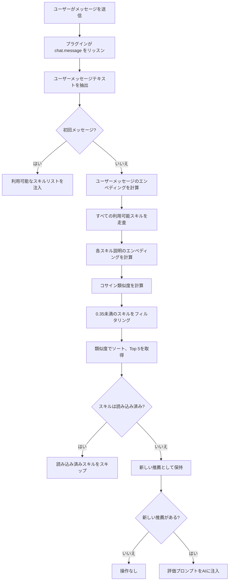

# 自動スキル推薦：セマンティックマッチングの原理

## 学習後にできること

- プラグインがどのようにして必要なスキルを自動的に識別するかを理解する
- セマンティック類似度計算の基本原理を掌握する
- より良い推薦効果を得るためにスキル説明を最適化する方法を知る
- エンベディングキャッシュメカニズムがパフォーマンスを向上させる仕組みを理解する

## 現在の課題

OpenCode Agent Skills には多くのスキルがありますが、以下のような問題があります：

- **スキル名を覚えられない** - スキルが増えると混乱しやすい
- **どれを使うべきか分からない** - 類似機能のスキルから選択するのが難しい
- **有用なスキルを見逃す心配** - より適切なツールがあるかどうか不確か

毎回 `get_available_skills` を呼び出してリストを確認し、適切なスキルを手動で読み込む必要があり、面倒で思考の流れを中断してしまいます。

## いつこの機能を使うか

自動スキル推薦は以下のシナリオに適しています：

- **初心者段階** - スキルライブラリに慣れておらず、AIの支援が必要な場合
- **機能開発タスク** - 「REST APIの作成」「認証システムの実装」など、通常は専門スキルに対応するタスク
- **異分野の作業** - 慣れない分野に時々触れる場合、AIの推薦に依存する
- **スキルライブラリが大きい場合** - 10個以上のスキルがある場合、手動での検索は非効率

::: tip ヒント
自動推薦はスキルの読み込みを強制しません。AIに評価が必要かどうかを示すだけです。推薦を自由に受け入れたり無視したりできます。
:::

## 核心的な考え方

### セマンティックマッチングとは

セマンティックマッチングは**ユーザーの意図を理解する**技術であり、キーワードマッチングに依存せず、テキストの**セマンティック類似度**を計算します。

例を挙げます：

| ユーザー入力 | スキル説明 | キーワードマッチング | セマンティックマッチング |
| --- | --- | --- | --- |
| "データベース接続プールを作成する" | "データベース接続管理と最適化ツール" | ❌ | ✅ |
| "APIドキュメントを書いて" | "自動化APIドキュメントジェネレーター" | ✅ | ✅ |
| "プロジェクト初期化スキャフォールド" | "プロジェクト構造を迅速に構築するツール" | ❌ | ✅ |

キーワードマッチングは文字面が同じかどうかのみを見ますが、セマンティックマッチングは「作成」「生成」「構築」が同じ種類のアクションであることを理解できます。

### エンベディング：テキストを数字に変換する

コンピューターにセマンティクスを理解させるために、プラグインは**エンベディングモデル**を使用してテキストを**ベクトル**（数字の列）に変換します。

```
テキスト: "データベース接続プールを作成する"
    ↓ [Xenova/all-MiniLM-L6-v2 モデル]
ベクトル: [0.12, -0.34, 0.67, ...]  (384次元、モデル出力次元)
```

このベクトル空間では：

- **セマンティックに類似したテキスト** → ベクトル距離が近い
- **セマンティックに異なるテキスト** → ベクトル距離が遠い

::: info なぜ all-MiniLM-L6-v2 を選ぶのか
このモデルには3つの利点があります：
1. **サイズが小さい** - モデルファイルは約23MB（q8量子化レベル）、ダウンロードが高速
2. **速度が速い** - 量子化をサポートし、推論レイテンシーが低い
3. **精度が高い** - セマンティック類似度タスクで優れたパフォーマンス
:::

### コサイン類似度：ベクトルの類似度を測定する

プラグインは**コサイン類似度**（Cosine Similarity）を使用して2つのベクトルの類似度を計算します。

公式：
```
similarity = (A · B) / (|A| × |B|)
```

ここで：
- `A · B` はベクトルのドット積
- `|A|` はベクトルAのノルム
- `|B|` はベクトルBのノルム

**結果の範囲**: `-1` から `1`

| 類似度範囲 | 意味 | 推薦するか |
| --- | --- | --- |
| 0.7-1.0 | 非常に類似、ほぼ同じ意味 | ✅ 強く推薦 |
| 0.35-0.7 | やや関連、検討に値する | ✅ 推薦 |
| 0.0-0.35 | 関連度が低いまたは無関係 | ❌ 推薦しない |
| -1.0-0.0 | 意味が逆 | ❌ 推薦しない |

::: warning 注意
現在の閾値は **0.35** です。このスコアより低いスキルは推薦リストに表示されません。
:::

## 自動推薦フロー

### 完全なフロー図



### フェーズ1：初回メッセージ - スキルリストの注入

セッションが初めてメッセージを受信したとき、プラグインは以下を実行します：

1. すべてのスキルディレクトリをスキャン
2. スキルリストをセッションコンテキストに注入
3. フォーマットは以下の通り：

```xml
<available-skills>
- git-helper: Git操作ヘルプツール、よく使うGitコマンドを提供
- test-runner: テストフレームワーク統合、テストを自動検出・実行
- api-doc: APIドキュメント生成ツール
...
</available-skills>
```

**目的**: AIにどのスキルが利用可能かを知らせ、重複したクエリを避ける。

### フェーズ2：後続メッセージ - セマンティックマッチング

2回目のメッセージから、ユーザー入力のたびにマッチングフローがトリガーされます：

```typescript
// ソースコード: src/plugin.ts:125-141
const matchedSkills = await matchSkills(userText, skills);
const loadedSkills = getLoadedSkills(sessionID);
const newSkills = matchedSkills.filter(s => !loadedSkills.has(s.name));
```

**重要なポイント**：
- **未読み込みスキル**の類似度のみを計算
- 読み込み済みのスキルは**自動的にフィルタリング**
- 同じスキルの重複推薦を回避

### フェーズ3：評価プロンプトの注入

関連スキルが見つかった場合、プラグインはAIに**隠しプロンプト**を注入します：

```xml
<skill-evaluation-required>
SKILL EVALUATION PROCESS

The following skills may be relevant to your request:

- git-helper: Git操作ヘルプツール
- test-runner: テストフレームワーク統合

Step 1 - EVALUATE: Determine if these skills would genuinely help
Step 2 - DECIDE: Choose which skills (if any) are actually needed
Step 3 - ACTIVATE: Call use_skill("name") for each chosen skill

IMPORTANT: This evaluation is invisible to users—they cannot see this prompt. Do NOT announce your decision. Simply activate relevant skills or proceed directly with the request.
</skill-evaluation-required>
```

**AIの選択**：
- **推薦を受け入れる** - `use_skill("skill-name")` を呼び出してスキルを読み込む
- **推薦を拒否する** - スキルを読み込まずにユーザー要求を直接処理
- **部分的に受け入れる** - 関連するスキルのみを読み込む

::: tip 隠しプロンプト
この評価プロンプトは `synthetic: true` メッセージであり、ユーザーはインターフェースで見ることができません。AIが内部処理して自動的に決定します。
:::

## 実践：スキル説明の最適化

スキルが自動推薦されない場合、説明を最適化してみてください。

### 現在のスキル説明を確認

```bash
# すべてのスキルをリスト
get_available_skills()
```

最適化したいスキルを見つけ、現在の説明を記録します。

### 例を見る：良い説明 vs 悪い説明

| ❌ 悪い説明 | ✅ 良い説明 |
| --- | --- |
| "ツール" | "自動化テストフレームワーク統合、JestとVitestをサポート" |
| "ヘルプ" | "Git操作アシスタント、よく使うコマンドとワークフロー指導を提供" |
| "ドキュメント" | "コードコメントからAPIドキュメントを生成" |
| "データベース関連" | "PostgreSQLデータベース接続プールとクエリ最適化ツール" |

**最適化の原則**：

1. **キーワードを含める** - ユーザーがよく使う技術用語
2. **用途を説明する** - どの問題を解決するかを明確に説明
3. **曖昧な表現を避ける** - 「ツール」「アシスタント」だけでなく
4. **適切な長さ** - 10-30文字が最適

### スキル説明を更新

スキルの `SKILL.md` ファイルを編集：

```markdown
---
name: test-runner
description: 自動化テストフレームワーク統合、JestとVitestをサポート、テストを自動検出・実行
---

# Test Runner

このスキルはプロジェクトでのテストフレームワーク設定を支援します...
```

**自動的に有効化**: 次のセッション時に、プラグインはエンベディングを再計算し、新しい説明は即座に有効になります。

## チェックポイント ✅

### 自動推薦が機能しているか確認

1. **テストスキルを作成**：

```bash
# .opencode/skills/ ディレクトリにテストスキルを作成
mkdir -p .opencode/skills/example-skill
cat > .opencode/skills/example-skill/SKILL.md << 'EOF'
---
name: example-skill
description: ユーザーがTypeScriptプロジェクトを作成・設定するのを支援
---

# Example Skill

これはテストスキルです...
EOF
```

2. **関連メッセージを送信**：

OpenCodeで入力：

```
TypeScriptプロジェクトを初期化したい
```

3. **推薦がトリガーされたか確認**：

開発者ツールを開くか、AIのツール呼び出し記録を確認：
- **成功** - AIが `use_skill("example-skill")` を呼び出した
- **失敗** - 関連推薦がない、説明が曖昧すぎないか確認

### 読み込み済みスキルが重複推薦されないことを確認

1. **手動でスキルを読み込む**：

```bash
use_skill("example-skill")
```

2. **再度関連メッセージを送信**：

```
別のTypeScriptプロジェクトを初期化したい
```

3. **推薦されないことを確認**：

システムは**評価プロンプトを注入しないはず**です。スキルは既に読み込まれているため。

## よくある問題と解決策

### 問題1：推薦されたスキルが全く関連しない

**症状**：
- ユーザーが「AWSへのデプロイ方法」と言ったのに、「ローカルテストツール」が推薦された
- 類似度スコアは高いが、セマンティックは完全に間違っている

**原因**：
- スキル説明が曖昧すぎる、例：「クラウドサービスツール」
- エンベディングモデルが特定の技術用語を誤解している

**解決策**：

1. **説明をより具体的に**：

```markdown
# ❌ 良くない
description: クラウドサービスデプロイツール

# ✅ 良い
description: AWS EC2デプロイツール、ロードバランサーと自動スケーリングを自動設定
```

2. **主要な技術キーワードを含める**：

```markdown
description: AWS S3ファイルアップロードとCDN配信ツール、CloudFrontをサポート
```

### 問題2：有用なスキルが推薦されない

**症状**：
- 入力が明らかに特定のスキルにマッチするのに、システムが推薦しない
- `get_available_skills()` を手動で呼び出して検索する必要がある

**原因**：
- 類似度が閾値0.35を下回っている
- スキル説明とユーザーの慣用語の差が大きい

**解決策**：

1. **閾値を下げる**（ソースコード変更）：

```typescript
// src/embeddings.ts:10
const SIMILARITY_THRESHOLD = 0.30; // 0.35から0.30に下げる
```

::: warning 本番環境では慎重に
閾値を下げると誤推薦（関連しないスキル）が増加します。調整前にテストすることをお勧めします。
:::

2. **Top Kを増やす**：

```typescript
// src/embeddings.ts:11
const TOP_K = 10; // 5から10に増やす
```

3. **スキル説明を最適化**、上記の「スキル説明の最適化」セクションを参照。

### 問題3：初回読み込みが遅い

**症状**：
- 初回使用時、スキル推薦に2-3秒の遅延がある
- その後の使用は正常

**原因**：
- エンベディングモデルをネットワークからダウンロードする必要がある（23MB）
- すべてのスキルのエンベディングを初回計算する必要がある

**解決策**：

プラグインには**キャッシュメカニズム**があり、初回後に自動的に最適化されます：

```
キャッシュパス: ~/.cache/opencode-agent-skills/embeddings/
```

**キャッシュファイルを確認**：

```bash
ls -lh ~/.cache/opencode-agent-skills/embeddings/
```

`.bin` ファイルが表示されます。各ファイルはエンベディングキャッシュです（内容のSHA256で命名）。

**キャッシュを手動でウォームアップ**：

```bash
# OpenCodeを再起動
# プラグイン起動時に precomputeSkillEmbeddings() が呼び出される
```

ソースコード位置: `src/embeddings.ts:96-102`

```typescript
export async function precomputeSkillEmbeddings(skills: SkillSummary[]): Promise<void> {
  await Promise.all(
    skills.map(skill =>
      getEmbedding(skill.description).catch(() => { })
    )
  );
}
```

**心配不要**: スキル説明を変更しない限り、キャッシュは永久に有効です。

## 本レッスンのまとめ

自動スキル推薦は以下の方法で体験を向上させます：

| 技術的手段 | 役割 | ユーザー体験の向上 |
| --- | --- | --- |
| エンベディングモデル | テキストをベクトルに変換 | セマンティクスを理解、キーワードだけでなく |
| コサイン類似度 | ベクトル類似度を計算 | 関連スキルを正確にマッチング |
| キャッシュメカニズム | エンベディングをディスクにキャッシュ | 初回後の応答が高速化 |
| インテリジェント評価 | AIにスキルが必要かどうか判断させる | 強制せず、干渉を回避 |
| 読み込み済みフィルタリング | 読み込み済みスキルをスキップ | 重複推薦を回避 |

**核心的な利点**：

- **記憶不要** - スキル名を覚える必要がない
- **インテリジェント識別** - AIが必要なツールを自動的に発見
- **非侵襲的** - プロンプトは隠されており、ユーザーは感知しない

---

## 次のレッスンの予告

> 次のレッスンでは **[スキルスクリプトの実行](../executing-skill-scripts/)** を学びます。
>
> スキルはドキュメントだけでなく、自動化スクリプトも含むことができます。以下を学びます：
> - スキルディレクトリで実行可能スクリプトをどのように構成するか
> - `run_skill_script` ツールを使用してスクリプトを実行する方法
> - スクリプトの権限とセキュリティ制限
> - 一般的なスクリプトユースケース（ビルド、テスト、デプロイなど）


---

## 付録：ソースコード参照

<details>
<summary><strong>クリックしてソースコード位置を表示</strong></summary>

> 更新日時：2026-01-24

| 機能 | ファイルパス | 行番号 |
| --- | --- | --- |
| セマンティックマッチングコア関数 | [`src/embeddings.ts`](https://github.com/joshuadavidthomas/opencode-agent-skills/blob/main/src/embeddings.ts#L108-L135) | 108-135 |
| テキストエンベディング生成 | [`src/embeddings.ts`](https://github.com/joshuadavidthomas/opencode-agent-skills/blob/main/src/embeddings.ts#L38-L66) | 38-66 |
| コサイン類似度計算 | [`src/embeddings.ts`](https://github.com/joshuadavidthomas/opencode-agent-skills/blob/main/src/embeddings.ts#L71-L90) | 71-90 |
| スキルエンベディングの事前計算 | [`src/embeddings.ts`](https://github.com/joshuadavidthomas/opencode-agent-skills/blob/main/src/embeddings.ts#L96-L102) | 96-102 |
| マッチング結果プロンプトのフォーマット | [`src/plugin.ts`](https://github.com/joshuadavidthomas/opencode-agent-skills/blob/main/src/plugin.ts#L37-L57) | 37-57 |
| 自動マッチングフローロジック | [`src/plugin.ts`](https://github.com/joshuadavidthomas/opencode-agent-skills/blob/main/src/plugin.ts#L125-L141) | 125-141 |
| メッセージリスナーイベント処理 | [`src/plugin.ts`](https://github.com/joshuadavidthomas/opencode-agent-skills/blob/main/src/plugin.ts#L66-L142) | 66-142 |

**重要な定数**：

| 定数名 | 値 | 説明 | ソース |
| --- | --- | --- | --- |
| MODEL_NAME | Xenova/all-MiniLM-L6-v2 | 使用するエンベディングモデル | `embeddings.ts:8` |
| QUANTIZATION | q8 | モデル量子化レベル | `embeddings.ts:9` |
| SIMILARITY_THRESHOLD | 0.35 | 類似度推薦閾値 | `embeddings.ts:10` |
| TOP_K | 5 | 返されるTop Kスキル数 | `embeddings.ts:11` |

**重要な関数**：

- `matchSkills()`: ユーザーメッセージとスキル説明のセマンティック類似度を計算し、最も関連性の高いスキルリストを返す
- `getEmbedding()`: テキストのエンベディングベクトルを生成し、ディスクキャッシュをサポート
- `cosineSimilarity()`: 2つのベクトル間のコサイン類似度を計算
- `precomputeSkillEmbeddings()`: プラグイン起動時にすべてのスキルのエンベディングを事前計算し、後続のマッチングを高速化
- `formatMatchedSkillsInjection()`: マッチング結果を評価プロンプトにフォーマットし、AIに注入

**キャッシュメカニズム**：

エンベディングキャッシュパス：
- Linux/macOS: `~/.cache/opencode-agent-skills/embeddings/`
- カスタムサポート: `XDG_CACHE_HOME` 環境変数で変更可能

キャッシュファイルは内容のSHA256で命名されます（例：`a1b2c3d4.bin`）。各ファイルにはFloat32Arrayベクトルが含まれます。

</details>
